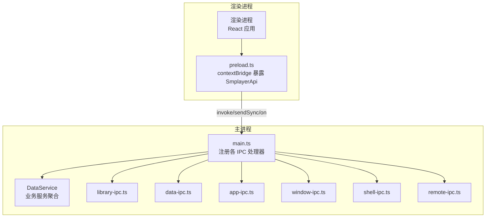
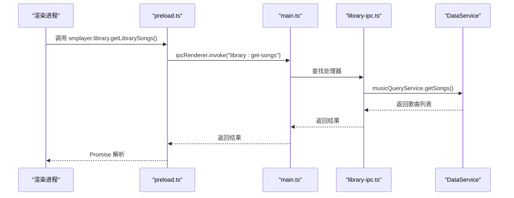
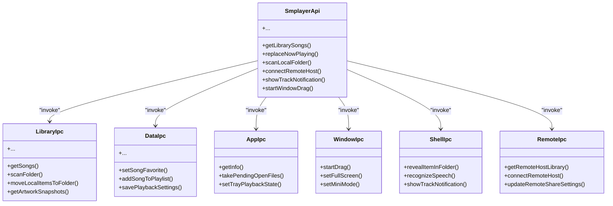

# API参考

<cite>
**本文引用的文件**
- [electron/main.ts](file://electron/main.ts)
- [electron/preload.ts](file://electron/preload.ts)
- [electron/ipc/app-ipc.ts](file://electron/ipc/app-ipc.ts)
- [electron/ipc/data-ipc.ts](file://electron/ipc/data-ipc.ts)
- [electron/ipc/library-ipc.ts](file://electron/ipc/library-ipc.ts)
- [electron/ipc/remote-ipc.ts](file://electron/ipc/remote-ipc.ts)
- [electron/ipc/shell-ipc.ts](file://electron/ipc/shell-ipc.ts)
- [electron/ipc/window-ipc.ts](file://electron/ipc/window-ipc.ts)
- [src/shared/contracts.ts](file://src/shared/contracts.ts)
- [electron/services/data-service.ts](file://electron/services/data-service.ts)
- [package.json](file://package.json)
</cite>

## 目录
1. [简介](#简介)
2. [项目结构](#项目结构)
3. [核心组件](#核心组件)
4. [架构总览](#架构总览)
5. [详细组件分析](#详细组件分析)
6. [依赖关系分析](#依赖关系分析)
7. [性能与并发特性](#性能与并发特性)
8. [故障排查与调试](#故障排查与调试)
9. [结论](#结论)
10. [附录：API清单与使用指南](#附录api清单与使用指南)

## 简介
本文件为 SMPlayer 的 IPC API 参考文档，覆盖应用、数据、库管理、远程、Shell、窗口等 IPC 接口。文档从系统架构、数据流、错误处理、性能与并发、调试方法等方面进行系统化梳理，并提供面向开发者的最佳实践与客户端实现指南。API 基于 Electron 的 ipcRenderer/ipcMain 模式，通过 preload 暴露统一的 SmplayerApi 接口给渲染进程使用。

## 项目结构
SMPlayer 的 IPC 层位于 electron/ipc 下，每个模块负责一组功能域；preload.ts 将 ipcRenderer 调用封装为 SmplayerApi；main.ts 在主进程中注册各 IPC 处理器并注入服务实例。

图表来源
- [electron/preload.ts:45-287](file://electron/preload.ts#L45-L287)
- [electron/main.ts:141-209](file://electron/main.ts#L141-L209)
- [electron/ipc/library-ipc.ts:28-302](file://electron/ipc/library-ipc.ts#L28-L302)
- [electron/ipc/data-ipc.ts:20-151](file://electron/ipc/data-ipc.ts#L20-L151)
- [electron/ipc/app-ipc.ts:10-26](file://electron/ipc/app-ipc.ts#L10-L26)
- [electron/ipc/window-ipc.ts:16-59](file://electron/ipc/window-ipc.ts#L16-L59)
- [electron/ipc/shell-ipc.ts:20-100](file://electron/ipc/shell-ipc.ts#L20-L100)
- [electron/ipc/remote-ipc.ts:19-54](file://electron/ipc/remote-ipc.ts#L19-L54)

章节来源
- [electron/main.ts:141-209](file://electron/main.ts#L141-L209)
- [electron/preload.ts:45-287](file://electron/preload.ts#L45-L287)

## 核心组件
- SmplayerApi（统一 API 接口）
  - 由 preload.ts 暴露，封装 ipcRenderer.invoke/sendSync/on，映射到各 IPC 端点。
  - 定义了应用、库、数据、远程、Shell、窗口等领域的完整 API。
- 主进程注册器
  - main.ts 注册各 IPC 处理器，注入服务实例（如 DataService）。
- 数据服务聚合
  - DataService 聚合多个子服务（设置、历史、歌单、歌词、扫描、本地项、外置音频等），供 IPC 使用。

章节来源
- [electron/preload.ts:45-287](file://electron/preload.ts#L45-L287)
- [electron/main.ts:141-209](file://electron/main.ts#L141-L209)
- [electron/services/data-service.ts:39-198](file://electron/services/data-service.ts#L39-L198)

## 架构总览
IPC 交互采用“渲染进程调用 preload -> 主进程处理 -> 业务服务执行”的模式。部分操作使用同步通道（sendSync）以满足低延迟场景，其余多为异步（invoke/on）。

图表来源
- [electron/preload.ts:47-50](file://electron/preload.ts#L47-L50)
- [electron/ipc/library-ipc.ts:43](file://electron/ipc/library-ipc.ts#L43)
- [electron/services/data-service.ts:120-132](file://electron/services/data-service.ts#L120-L132)

## 详细组件分析

### 应用 IPC（app-ipc）
- 功能域：应用信息查询、待打开文件队列、托盘播放状态。
- 关键端点
  - app:get-info：返回平台、版本、打包状态、用户数据路径。
  - app:take-pending-open-files：取出待打开的歌曲 ID 列表。
  - app:set-tray-playback-state：设置托盘播放状态。
- 请求参数
  - app:get-info：无参数。
  - app:take-pending-open-files：无参数。
  - app:set-tray-playback-state：isPlaying: boolean。
- 响应格式
  - app:get-info：AppInfo。
  - 其余端点：返回值由具体服务决定或 void。
- 错误处理
  - 无显式异常抛出，失败时返回空值或不更新状态。
- 使用示例
  - 获取应用信息：调用 smplayer.getAppInfo()。
  - 设置托盘状态：调用 smplayer.setTrayPlaybackState(true/false)。

章节来源
- [electron/ipc/app-ipc.ts:10-26](file://electron/ipc/app-ipc.ts#L10-L26)
- [src/shared/contracts.ts:1-6](file://src/shared/contracts.ts#L1-L6)

### 数据 IPC（data-ipc）
- 功能域：歌单、播放队列、搜索历史、最近播放、偏好设置、播放设置、即时播放设置。
- 关键端点
  - library:set-favorite / set-favorites：收藏/取消收藏歌曲。
  - playlist:*：创建/删除/重命名/排序/增删歌曲。
  - queue:*：替换队列、移除歌曲、清空队列。
  - search:*：保存查询、添加/移除/清空最近搜索。
  - recent-played:*：记录/移除/恢复/清空最近播放。
  - settings:update：更新应用设置。
  - preferences:*：更新/添加/删除/清理偏好项。
  - view-state:save：保存视图状态。
  - playback:save-settings / get-settings-immediate / save-settings-immediate：播放设置持久化与即时读取。
  - playback:mark-song-played：标记歌曲已播放。
- 请求参数
  - 多数端点携带 songId、playlistId、songIds、query、update 等。
- 响应格式
  - 多数为 Promise<void>；部分返回实体对象或布尔值。
- 异步与同步
  - playback:get-settings-immediate 使用 event.returnValue 同步返回；其他多为异步。
- 错误处理
  - 未见显式 try/catch，失败通常静默或返回空值。
- 使用示例
  - 替换播放队列：调用 smplayer.replaceNowPlaying(ids)。
  - 清空最近播放：调用 smplayer.clearRecentPlayed()。

章节来源
- [electron/ipc/data-ipc.ts:20-151](file://electron/ipc/data-ipc.ts#L20-L151)
- [src/shared/contracts.ts:527-663](file://src/shared/contracts.ts#L527-L663)

### 库管理 IPC（library-ipc）
- 功能域：音乐库快照、歌曲属性、封面、歌词、扫描、导入导出、移动/隐藏本地项、根目录选择。
- 关键端点
  - library:get-*：获取库快照（shell/settings/counts/songs/folders/recent/…）。
  - library:get-song-properties / update-song-properties / update-song-play-count：歌曲属性读写与播放计数。
  - library:get-artwork-snapshot(s)：封面快照。
  - lyrics:*：歌词读取、导入、保存、浏览器搜索、保存网络歌词到文件。
  - library:pick-root：选择音乐库根目录。
  - library:scan / scan-folder / cancel-scan-folder / prepare-scan-folder：全库/文件夹扫描与进度回调。
  - library:move-*-to-folder / delete-*-from-disk / delete-local-items / hide-*-local-folder：本地项移动/删除/隐藏。
  - data:export / data:import：数据库导出/导入。
- 进度事件
  - library:scan-folder-progress：扫描进度事件。
  - library:move-local-items-progress：批量移动进度事件。
- 错误处理
  - 对话框取消返回 canceled 结果；歌词导入可能返回错误类型。
- 使用示例
  - 扫描文件夹：调用 smplayer.scanLocalFolder(path, opId, max) 并监听 onScanLocalFolderProgress。

章节来源
- [electron/ipc/library-ipc.ts:28-302](file://electron/ipc/library-ipc.ts#L28-L302)
- [src/shared/contracts.ts:311-479](file://src/shared/contracts.ts#L311-L479)

### 远程 IPC（remote-ipc）
- 功能域：远程分享开关、授权设备、远端主机连接与拉取库。
- 关键端点
  - remote-share:get-status / update-settings / start / stop：远程分享状态与控制。
  - authorized-devices:*：授权设备列表与更新。
  - remote-hosts:*：远端主机列表、连接、拉取库、删除。
- 协议与数据格式
  - 与远端主机通过 HTTP API 交互，使用 Bearer Token 认证。
  - 返回 RemoteMusicData，包含 host、songs、playlists、favorites、nowPlaying。
- 错误处理
  - 远端请求失败抛出错误；连接流程包含登录与计数校验。
- 使用示例
  - 连接远端主机：调用 smplayer.connectRemoteHost({ baseUrl, password })。

章节来源
- [electron/ipc/remote-ipc.ts:19-135](file://electron/ipc/remote-ipc.ts#L19-L135)
- [src/shared/contracts.ts:106-168](file://src/shared/contracts.ts#L106-L168)

### Shell IPC（shell-ipc）
- 功能域：系统集成、反馈、语音识别、通知。
- 关键端点
  - shell:reveal-item：在资源管理器中显示文件。
  - shell:create-local-folder：创建本地文件夹。
  - shell:send-feedback-email / open-feedback-browser / open-voice-assistant-privacy-settings：反馈与隐私设置。
  - voice:recognize / cancel-recognition：语音识别与取消。
  - shell:reveal-system-logs：打开日志目录。
  - shell:show-track-notification：显示曲目通知。
- 事件回调
  - voice:recognition-hypothesis / recognition-state：识别过程中的中间结果与状态变更。
- 错误处理
  - Notification 不支持时直接返回；隐私设置根据平台差异处理。
- 使用示例
  - 显示通知：调用 smplayer.showTrackNotification({ songId, title, artist, album })。

章节来源
- [electron/ipc/shell-ipc.ts:20-100](file://electron/ipc/shell-ipc.ts#L20-L100)
- [src/shared/contracts.ts:291-310](file://src/shared/contracts.ts#L291-L310)

### 窗口 IPC（window-ipc）
- 功能域：窗口拖拽、标题栏覆盖、全屏/迷你模式切换。
- 关键端点
  - window:start-drag / stop-drag：开始/停止窗口拖拽。
  - window:set-controls-light：根据夜间模式切换窗口背景色与标题栏覆盖颜色。
  - window:set-full-screen / get-full-screen：全屏切换与查询。
  - window:set-mini-mode / get-mini-mode：迷你模式切换与查询。
- 错误处理
  - 无显式异常，失败时忽略或保持原状。
- 使用示例
  - 开始拖拽：调用 smplayer.startWindowDrag()。

章节来源
- [electron/ipc/window-ipc.ts:16-59](file://electron/ipc/window-ipc.ts#L16-L59)

## 依赖关系分析

图表来源
- [electron/preload.ts:45-287](file://electron/preload.ts#L45-L287)
- [electron/ipc/library-ipc.ts:28-302](file://electron/ipc/library-ipc.ts#L28-L302)
- [electron/ipc/data-ipc.ts:20-151](file://electron/ipc/data-ipc.ts#L20-L151)
- [electron/ipc/app-ipc.ts:10-26](file://electron/ipc/app-ipc.ts#L10-L26)
- [electron/ipc/window-ipc.ts:16-59](file://electron/ipc/window-ipc.ts#L16-L59)
- [electron/ipc/shell-ipc.ts:20-100](file://electron/ipc/shell-ipc.ts#L20-L100)
- [electron/ipc/remote-ipc.ts:19-135](file://electron/ipc/remote-ipc.ts#L19-L135)

## 性能与并发特性
- 调用频率与节流
  - 高频 UI 事件（如播放进度、识别中间结果）建议在渲染层做节流/去抖，避免过多 IPC 触发。
  - 批量操作（如批量收藏、批量移动）优先使用批量端点（如 set-favorites、move-local-items-to-folder）。
- 数据传输优化
  - 大对象（如封面快照、歌词）建议按需加载，避免一次性传输大量数据。
  - 扫描/移动进度事件用于分片传输，降低单次 IPC 压力。
- 异步与同步
  - get/save 播放设置使用同步通道（sendSync）以减少往返延迟；其他操作使用异步（invoke/on）。
- 错误重试机制
  - 远程连接失败可重试，但需限制次数并等待指数退避。
  - 扫描/移动操作支持取消（cancel-scan-folder），避免长时间阻塞。
- 并发控制
  - 导入/导出数据库涉及文件 IO，建议串行化或加锁，避免竞争条件。
  - 托盘菜单与 Windows Jump List 更新在设置变更后触发，注意去抖。

[本节为通用指导，无需特定文件来源]

## 故障排查与调试
- 常见问题
  - 无法显示通知：检查 Notification 支持与设置中的通知开关。
  - 语音识别失败：确认平台支持、隐私权限与麦克风可用性。
  - 扫描卡住：检查取消标志与进度回调是否正常。
  - 远程连接失败：核对密码、URL 正确性与网络连通性。
- 调试方法
  - 在 preload 中打印 invoke 调用与返回值，定位异常端点。
  - 使用 onScanLocalFolderProgress/onMoveLocalItemsProgress 监听进度事件，观察阶段与数值。
  - 在 main.ts 中注册更多日志输出，记录 ipcMain.handle 的进入/退出。
- 工具建议
  - 使用 Electron DevTools 的 Console/Network 面板查看 IPC 调用与错误堆栈。
  - 使用系统日志目录（smplayer.revealSystemLogs）定位应用日志。

章节来源
- [electron/ipc/shell-ipc.ts:34-66](file://electron/ipc/shell-ipc.ts#L34-L66)
- [electron/ipc/library-ipc.ts:205-250](file://electron/ipc/library-ipc.ts#L205-L250)
- [electron/ipc/remote-ipc.ts:71-111](file://electron/ipc/remote-ipc.ts#L71-L111)

## 结论
SMPlayer 的 IPC API 以清晰的功能域划分与统一的 SmplayerApi 暴露，覆盖了本地音乐库管理、播放控制、系统集成与远程分享等核心能力。通过同步/异步混合通道、事件驱动的进度回调以及完善的类型契约，开发者可以稳定地构建跨平台桌面音乐应用。建议在生产环境中结合节流、批处理与错误重试策略，确保用户体验与系统稳定性。

[本节为总结，无需特定文件来源]

## 附录：API清单与使用指南

### 版本与兼容性
- 当前版本：3.0.0
- 兼容性说明
  - Electron 41.x，SQLite 通过 node:sqlite 提供。
  - 远程 API 使用标准 HTTP 协议，需与远端服务版本匹配。
  - 部分平台特性（如 Windows 标题栏覆盖）仅在对应平台生效。

章节来源
- [package.json:4](file://package.json#L4)
- [electron/main.ts:74-76](file://electron/main.ts#L74-L76)

### 客户端实现指南
- 初始化
  - 在渲染进程通过 window.smplayer 使用 API。
  - 使用 on* 回调订阅事件（如 onScanLocalFolderProgress、onVoiceRecognitionHypothesis）。
- 最佳实践
  - 对高频调用进行节流/去抖（如播放进度、识别中间结果）。
  - 使用批量端点处理大批量数据（如 setSongsFavorite、moveLocalItemsToFolder）。
  - 对远程操作增加重试与超时控制。
  - 在设置变更后及时更新托盘菜单与 Jump List。
- 错误处理
  - 对话框取消与网络错误需显式判断 canceled 字段。
  - 识别失败时检查 error 字段并提示用户开启隐私权限。

章节来源
- [electron/preload.ts:127-179](file://electron/preload.ts#L127-L179)
- [electron/ipc/library-ipc.ts:205-250](file://electron/ipc/library-ipc.ts#L205-L250)
- [electron/ipc/remote-ipc.ts:62-69](file://electron/ipc/remote-ipc.ts#L62-L69)

### API 端点一览（按域）

- 应用（app-ipc）
  - app:get-info：获取 AppInfo
  - app:take-pending-open-files：取出待打开歌曲 ID 列表
  - app:set-tray-playback-state：设置托盘播放状态

- 数据（data-ipc）
  - library:set-favorite / set-favorites
  - playlist:create / delete / restore / rename / reorder
  - playlist:add-song(s) / remove-song(s) / reorder-songs
  - queue:replace / remove-song / clear
  - search:save-query / add-recent / remove-recent(s) / restore-recent / clear-recent
  - recent-played:record-(playlist/album/artist) / remove / restore / clear
  - settings:update
  - preferences:update-settings / add-item / update-item / remove-item / clear-invalid
  - view-state:save
  - playback:save-settings / get-settings-immediate / save-settings-immediate
  - playback:mark-song-played

- 库管理（library-ipc）
  - library:get-shell / get-settings / get-counts / get-songs / get-folders / get-recent-* / get-playlists / get-favorites / get-now-playing / get-search
  - library:get-artwork-snapshot(s)
  - library:get-song-properties / update-song-properties / update-song-play-count
  - lyrics:get / import / save / open-search-browser / save-internet-to-file
  - library:pick-root
  - library:scan / prepare-scan-folder / scan-folder / cancel-scan-folder
  - library:move-*-to-folder / delete-*-from-disk / delete-local-items / hide-*-local-folder
  - data:export / data:import

- 远程（remote-ipc）
  - remote-share:get-status / update-settings / start / stop
  - authorized-devices:list / update / delete
  - remote-hosts:list / connect / get-library / delete

- Shell（shell-ipc）
  - shell:reveal-item / create-local-folder
  - shell:send-feedback-email / open-feedback-browser / open-voice-assistant-privacy-settings
  - voice:recognize / cancel-recognition
  - shell:reveal-system-logs
  - shell:show-track-notification

- 窗口（window-ipc）
  - window:start-drag / stop-drag
  - window:set-controls-light
  - window:set-full-screen / get-full-screen
  - window:set-mini-mode / get-mini-mode

章节来源
- [electron/ipc/app-ipc.ts:10-26](file://electron/ipc/app-ipc.ts#L10-L26)
- [electron/ipc/data-ipc.ts:20-151](file://electron/ipc/data-ipc.ts#L20-L151)
- [electron/ipc/library-ipc.ts:28-302](file://electron/ipc/library-ipc.ts#L28-L302)
- [electron/ipc/remote-ipc.ts:19-135](file://electron/ipc/remote-ipc.ts#L19-L135)
- [electron/ipc/shell-ipc.ts:20-100](file://electron/ipc/shell-ipc.ts#L20-L100)
- [electron/ipc/window-ipc.ts:16-59](file://electron/ipc/window-ipc.ts#L16-L59)
- [src/shared/contracts.ts:527-663](file://src/shared/contracts.ts#L527-L663)