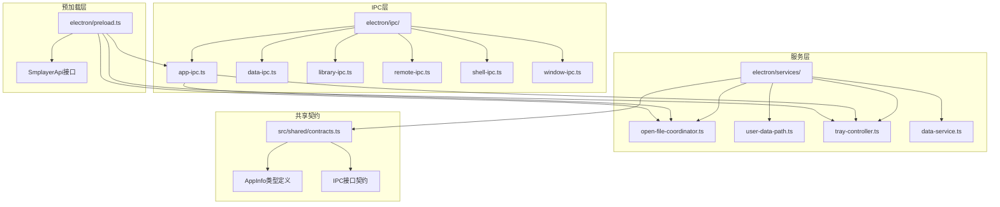
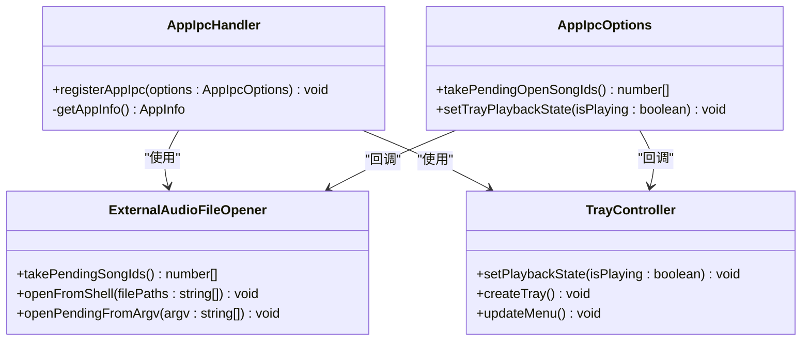
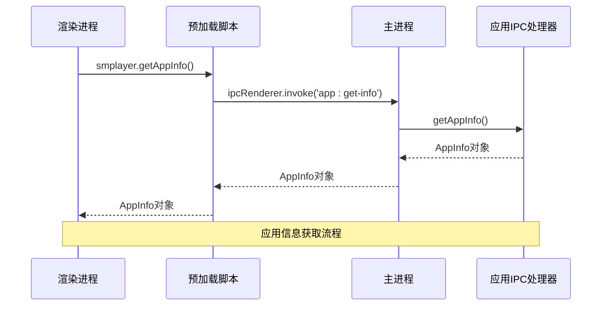
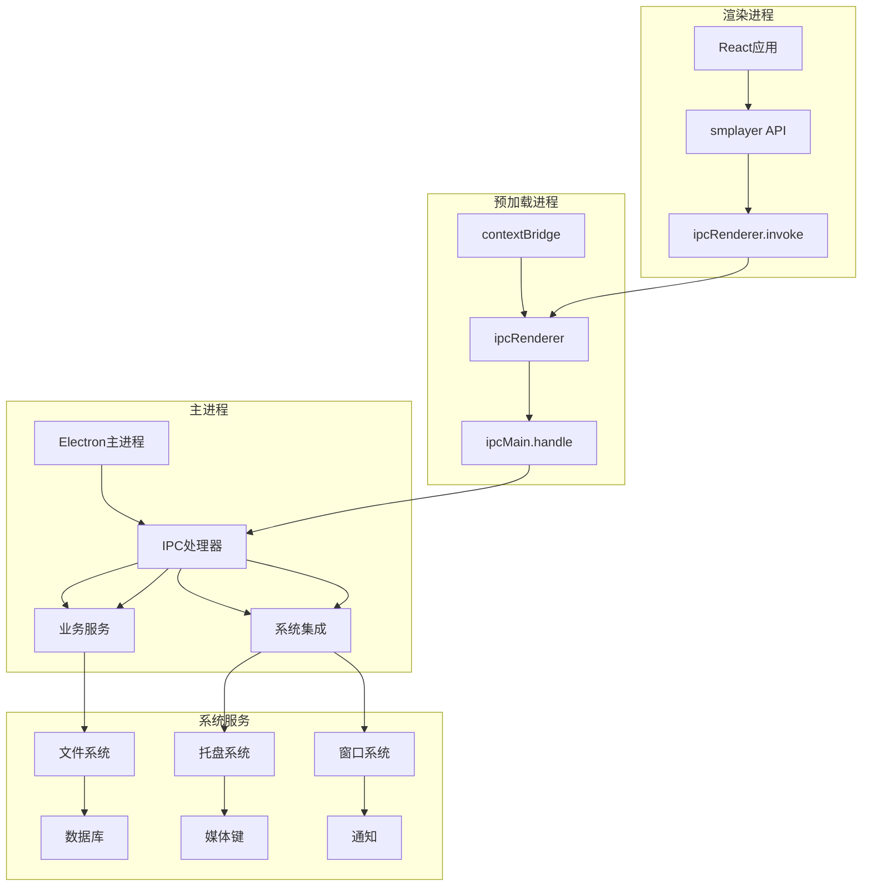
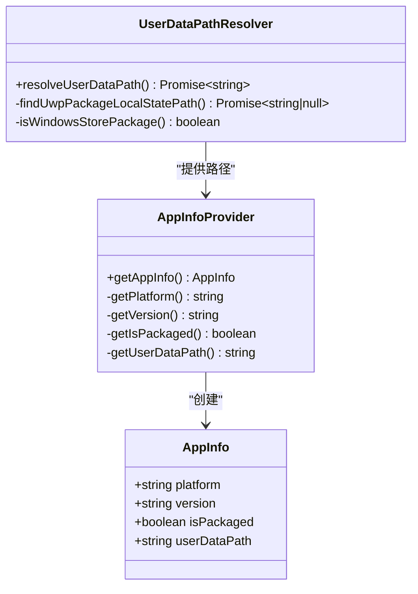
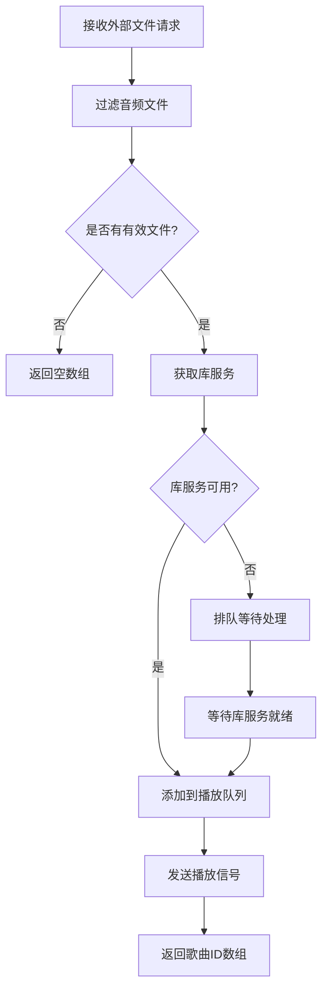
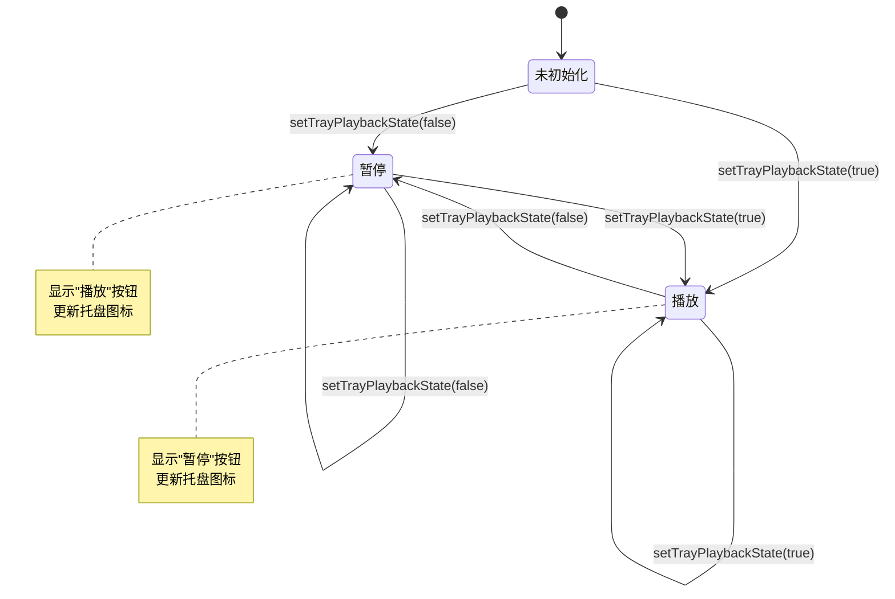
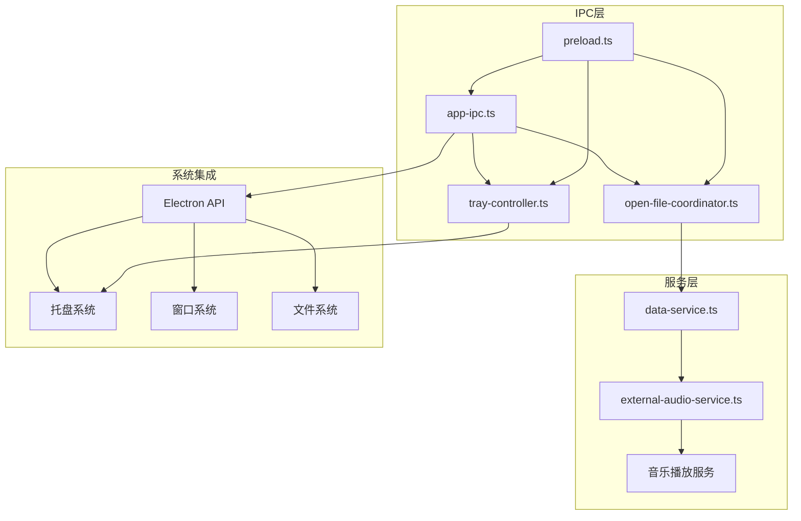

# 应用IPC接口

<cite>
**本文档引用的文件**
- [electron/ipc/app-ipc.ts](file://electron/ipc/app-ipc.ts)
- [electron/preload.ts](file://electron/preload.ts)
- [electron/main.ts](file://electron/main.ts)
- [electron/tray-controller.ts](file://electron/tray-controller.ts)
- [electron/services/open-file-coordinator.ts](file://electron/services/open-file-coordinator.ts)
- [electron/services/user-data-path.ts](file://electron/services/user-data-path.ts)
- [src/shared/contracts.ts](file://src/shared/contracts.ts)
</cite>

## 目录
1. [简介](#简介)
2. [项目结构](#项目结构)
3. [核心组件](#核心组件)
4. [架构概览](#架构概览)
5. [详细组件分析](#详细组件分析)
6. [依赖关系分析](#依赖关系分析)
7. [性能考虑](#性能考虑)
8. [故障排除指南](#故障排除指南)
9. [结论](#结论)

## 简介

SMPlayer的IPC接口是Electron应用中进程间通信的核心组件，负责在主进程和渲染进程之间传递应用状态、媒体控制命令和系统集成信息。本文档详细说明了应用IPC接口的规范，包括应用信息获取、待处理文件处理、托盘播放状态设置等关键接口。

这些接口实现了以下主要功能：
- 应用信息查询（平台、版本、打包状态、用户数据路径）
- 外部音频文件处理和队列管理
- 托盘播放状态同步和媒体控制
- 跨进程事件通信和状态同步

## 项目结构

SMPlayer的IPC架构采用模块化设计，主要分布在以下几个关键目录：



**图表来源**
- [electron/ipc/app-ipc.ts:1-26](file://electron/ipc/app-ipc.ts#L1-L26)
- [electron/preload.ts:45-150](file://electron/preload.ts#L45-L150)
- [electron/services/open-file-coordinator.ts:15-81](file://electron/services/open-file-coordinator.ts#L15-L81)

**章节来源**
- [electron/ipc/app-ipc.ts:1-26](file://electron/ipc/app-ipc.ts#L1-L26)
- [electron/preload.ts:1-287](file://electron/preload.ts#L1-L287)

## 核心组件

### 应用IPC注册器

应用IPC注册器负责在主进程中注册所有应用相关的IPC处理器，并提供统一的接口管理：



**图表来源**
- [electron/ipc/app-ipc.ts:5-16](file://electron/ipc/app-ipc.ts#L5-L16)
- [electron/services/open-file-coordinator.ts:40-74](file://electron/services/open-file-coordinator.ts#L40-L74)
- [electron/tray-controller.ts:28-120](file://electron/tray-controller.ts#L28-L120)

### 预加载API接口

预加载脚本提供了渲染进程访问IPC接口的安全通道：



**图表来源**
- [electron/preload.ts:45-47](file://electron/preload.ts#L45-L47)
- [electron/ipc/app-ipc.ts:10-11](file://electron/ipc/app-ipc.ts#L10-L11)

**章节来源**
- [electron/ipc/app-ipc.ts:1-26](file://electron/ipc/app-ipc.ts#L1-L26)
- [electron/preload.ts:45-150](file://electron/preload.ts#L45-L150)

## 架构概览

SMPlayer的IPC架构遵循Electron的标准模式，采用主进程-渲染进程的双进程模型：



**图表来源**
- [electron/main.ts:141-209](file://electron/main.ts#L141-L209)
- [electron/preload.ts:286](file://electron/preload.ts#L286)

## 详细组件分析

### 应用信息获取接口

#### 接口规范

**端点**: `app:get-info`

**功能**: 获取当前应用的基本信息，包括运行平台、版本号、打包状态和用户数据路径。

**请求参数**: 无

**响应格式**: `AppInfo` 对象

**错误处理**: 无

#### 数据结构定义



**图表来源**
- [src/shared/contracts.ts:1-6](file://src/shared/contracts.ts#L1-L6)
- [electron/ipc/app-ipc.ts:18-25](file://electron/ipc/app-ipc.ts#L18-L25)
- [electron/services/user-data-path.ts:11-28](file://electron/services/user-data-path.ts#L11-L28)

#### 调用示例

```typescript
// 基本调用
const appInfo = await window.smplayer.getAppInfo();
console.log(`平台: ${appInfo.platform}`);
console.log(`版本: ${appInfo.version}`);
console.log(`已打包: ${appInfo.isPackaged}`);
console.log(`用户数据路径: ${appInfo.userDataPath}`);

// 版本兼容性检查
if (appInfo.version >= '1.0.0') {
    // 使用新功能
}

// 平台特定逻辑
switch (appInfo.platform) {
    case 'win32':
        // Windows特定处理
        break;
    case 'darwin':
        // macOS特定处理
        break;
    case 'linux':
        // Linux特定处理
        break;
}
```

**章节来源**
- [electron/ipc/app-ipc.ts:18-25](file://electron/ipc/app-ipc.ts#L18-L25)
- [src/shared/contracts.ts:1-6](file://src/shared/contracts.ts#L1-L6)

### 待处理文件处理接口

#### 接口规范

**端点**: `app:take-pending-open-files`

**功能**: 获取并清空外部传入的音频文件队列，返回已处理的歌曲ID列表。

**请求参数**: 无

**响应格式**: `Promise<number[]>` - 歌曲ID数组

**错误处理**: 返回空数组表示无待处理文件

#### 处理流程



**图表来源**
- [electron/services/open-file-coordinator.ts:52-73](file://electron/services/open-file-coordinator.ts#L52-L73)
- [electron/services/open-file-coordinator.ts:15-38](file://electron/services/open-file-coordinator.ts#L15-L38)

#### 调用示例

```typescript
// 获取待处理文件
const pendingFiles = await window.smplayer.takePendingOpenFiles();
console.log(`待处理文件数量: ${pendingFiles.length}`);

// 处理文件队列
if (pendingFiles.length > 0) {
    // 播放第一个文件
    await playTrack(pendingFiles[0]);
    
    // 监听后续文件
    const unsubscribe = window.smplayer.onOpenFiles((songIds) => {
        console.log(`新文件: ${songIds.length}`);
        // 处理新文件
    });
    
    // 取消监听
    // unsubscribe();
}
```

**章节来源**
- [electron/services/open-file-coordinator.ts:40-74](file://electron/services/open-file-coordinator.ts#L40-L74)
- [electron/preload.ts:148-149](file://electron/preload.ts#L148-L149)

### 托盘播放状态设置接口

#### 接口规范

**端点**: `app:set-tray-playback-state`

**功能**: 同步播放状态到托盘菜单，更新播放/暂停按钮的状态显示。

**请求参数**:
- `isPlaying: boolean` - 是否正在播放

**响应格式**: `Promise<void>`

**错误处理**: 无

#### 状态管理



**图表来源**
- [electron/tray-controller.ts:113-120](file://electron/tray-controller.ts#L113-L120)
- [electron/ipc/app-ipc.ts:13-15](file://electron/ipc/app-ipc.ts#L13-L15)

#### 调用示例

```typescript
// 设置播放状态
await window.smplayer.setTrayPlaybackState(true);  // 开始播放
await window.smplayer.setTrayPlaybackState(false); // 暂停播放

// 在播放控制器中使用
class PlaybackController {
    constructor(private isPlaying: boolean = false) {}
    
    async play() {
        this.isPlaying = true;
        await window.smplayer.setTrayPlaybackState(true);
    }
    
    async pause() {
        this.isPlaying = false;
        await window.smplayer.setTrayPlaybackState(false);
    }
}
```

**章节来源**
- [electron/tray-controller.ts:113-120](file://electron/tray-controller.ts#L113-L120)
- [electron/ipc/app-ipc.ts:13-15](file://electron/ipc/app-ipc.ts#L13-L15)

## 依赖关系分析

### 组件依赖图



**图表来源**
- [electron/main.ts:156-159](file://electron/main.ts#L156-L159)
- [electron/preload.ts:286](file://electron/preload.ts#L286)

### 关键依赖关系

1. **应用IPC依赖外部文件协调器**: 通过回调函数获取待处理的音频文件ID
2. **托盘控制器依赖播放状态**: 维护播放状态并在UI中反映
3. **预加载脚本依赖所有IPC处理器**: 提供统一的API接口
4. **主进程依赖服务层**: 实际执行业务逻辑

**章节来源**
- [electron/main.ts:156-159](file://electron/main.ts#L156-L159)
- [electron/ipc/app-ipc.ts:10-16](file://electron/ipc/app-ipc.ts#L10-L16)

## 性能考虑

### IPC调用优化

1. **批量处理**: 将多个文件操作合并为单个IPC调用
2. **状态缓存**: 在渲染进程中缓存应用状态，减少不必要的IPC调用
3. **异步处理**: 所有IPC调用都是异步的，避免阻塞主线程
4. **错误恢复**: 自动处理库服务不可用的情况

### 内存管理

1. **文件队列清理**: 处理完成后及时清理待处理文件队列
2. **事件监听器管理**: 提供取消函数防止内存泄漏
3. **数据库连接**: 合理管理数据库连接和事务

## 故障排除指南

### 常见问题及解决方案

#### 应用信息获取失败

**症状**: `getAppInfo()` 返回undefined或抛出异常

**可能原因**:
1. Electron环境未正确初始化
2. 应用路径解析失败
3. 权限问题导致无法访问用户数据目录

**解决方案**:
```typescript
try {
    const appInfo = await window.smplayer.getAppInfo();
    if (!appInfo) {
        throw new Error('应用信息获取失败');
    }
} catch (error) {
    console.error('应用信息获取错误:', error);
    // 回退到默认值或显示错误界面
}
```

#### 外部文件处理延迟

**症状**: 文件打开后需要等待一段时间才开始播放

**可能原因**:
1. 库服务尚未初始化完成
2. 文件路径验证失败
3. 数据库写入操作阻塞

**解决方案**:
```typescript
// 检查库服务状态
const libraryService = getLibraryService();
if (!libraryService) {
    // 等待库服务初始化
    await waitForLibraryService();
}

// 或者使用重试机制
let retryCount = 0;
while (!libraryService && retryCount < 5) {
    await sleep(1000);
    libraryService = getLibraryService();
    retryCount++;
}
```

#### 托盘状态不同步

**症状**: 托盘按钮状态与实际播放状态不一致

**可能原因**:
1. IPC消息丢失
2. 托盘控制器未正确更新
3. 多个播放实例竞争状态

**解决方案**:
```typescript
// 强制同步状态
async function syncTrayState() {
    const isPlaying = getCurrentPlaybackState();
    await window.smplayer.setTrayPlaybackState(isPlaying);
    
    // 验证状态
    setTimeout(async () => {
        const verifiedState = getCurrentPlaybackState();
        if (verifiedState !== isPlaying) {
            await window.smplayer.setTrayPlaybackState(verifiedState);
        }
    }, 1000);
}
```

**章节来源**
- [electron/services/open-file-coordinator.ts:63-67](file://electron/services/open-file-coordinator.ts#L63-L67)
- [electron/tray-controller.ts:113-120](file://electron/tray-controller.ts#L113-L120)

## 结论

SMPlayer的IPC接口设计体现了现代Electron应用的最佳实践，具有以下特点：

1. **模块化设计**: 每个IPC处理器职责单一，便于维护和测试
2. **类型安全**: 完整的TypeScript类型定义确保接口契约
3. **错误处理**: 全面的错误处理机制保证应用稳定性
4. **性能优化**: 异步处理和状态缓存提升用户体验
5. **平台兼容**: 支持多平台特性，包括Windows跳表和托盘集成

这些接口为SMPlayer提供了强大的应用状态管理和系统集成功能，为用户提供了流畅的音乐播放体验。通过合理的错误处理和状态同步机制，确保了应用在各种使用场景下的稳定性和可靠性。