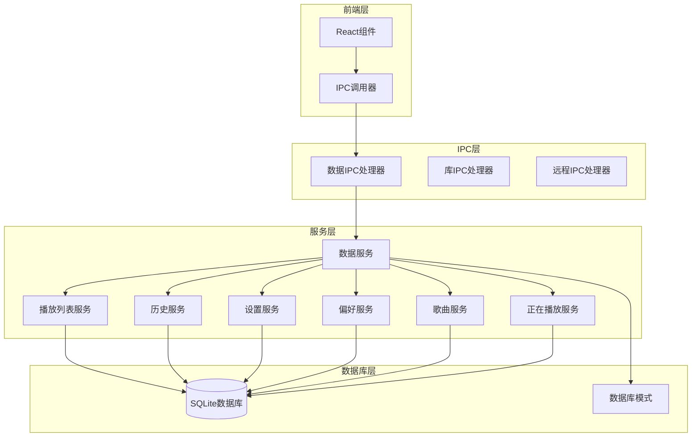
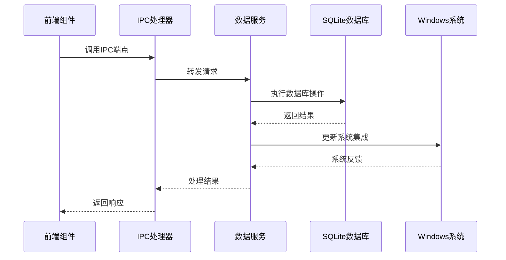
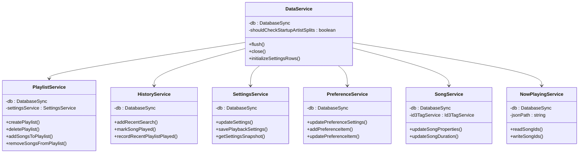
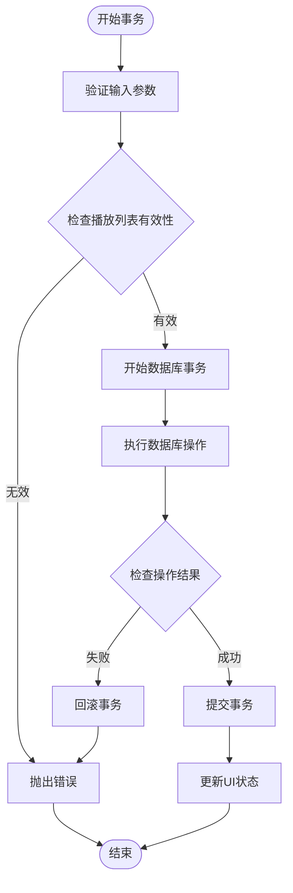
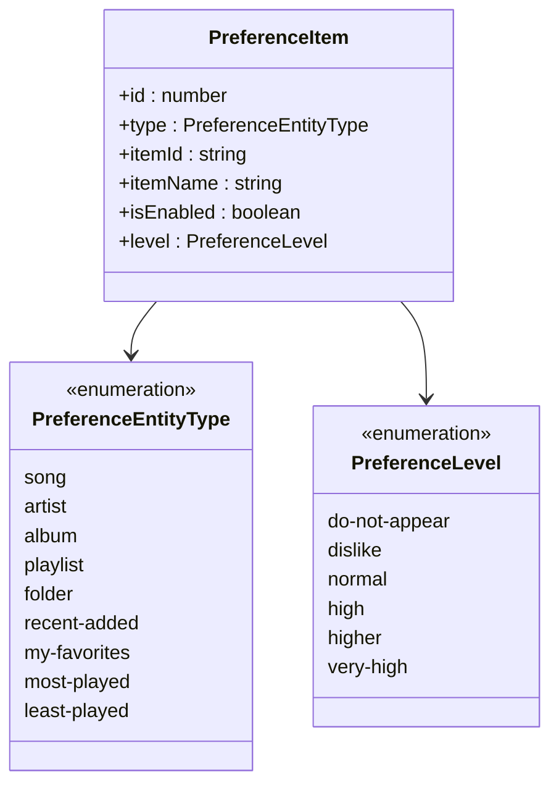
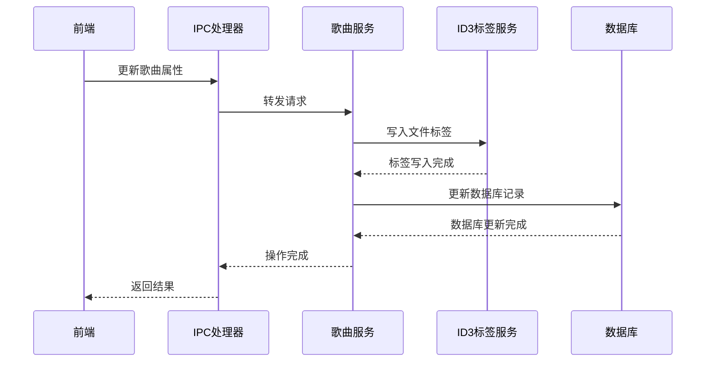
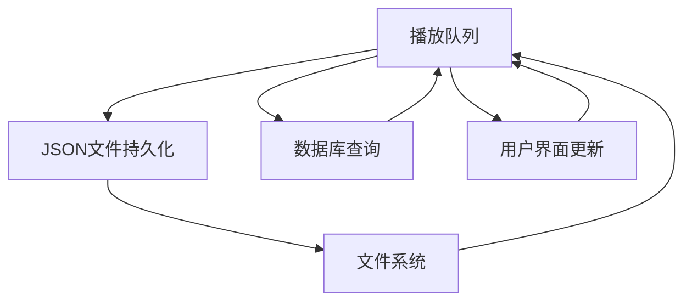
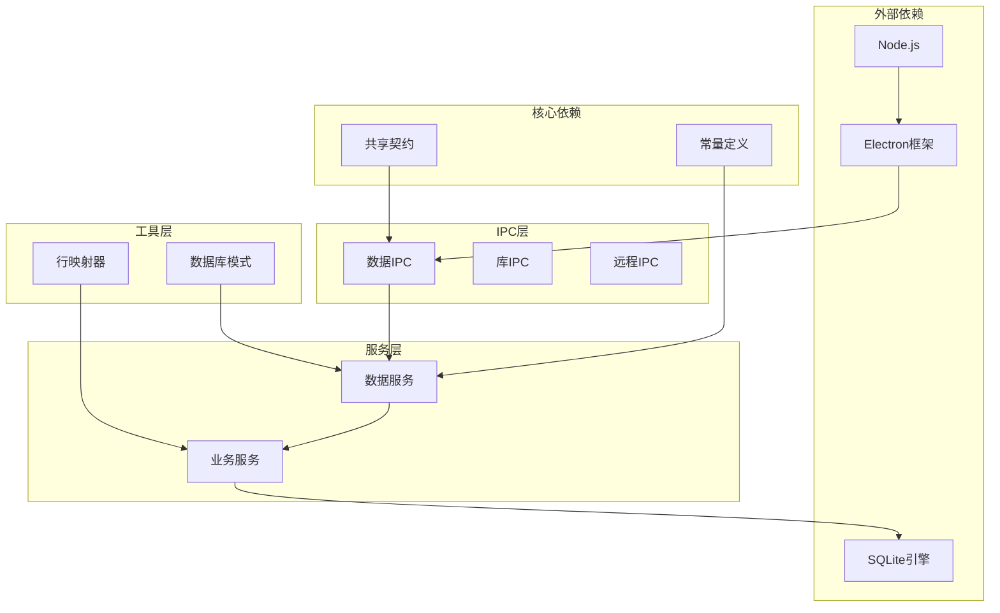
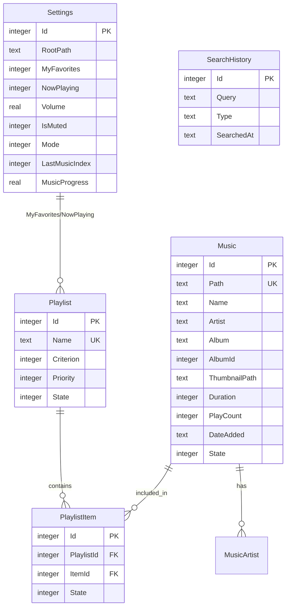

# 数据IPC接口

<cite>
**本文档引用的文件**
- [data-ipc.ts](file://electron/ipc/data-ipc.ts)
- [data-service.ts](file://electron/services/data-service.ts)
- [schema.ts](file://electron/services/schema.ts)
- [playlist-service.ts](file://electron/services/playlist-service.ts)
- [history-service.ts](file://electron/services/history-service.ts)
- [settings-service.ts](file://electron/services/settings-service.ts)
- [preference-service.ts](file://electron/services/preference-service.ts)
- [song-service.ts](file://electron/services/song-service.ts)
- [now-playing-service.ts](file://electron/services/now-playing-service.ts)
- [row-mappers.ts](file://electron/services/row-mappers.ts)
- [constants.ts](file://electron/services/constants.ts)
- [contracts.ts](file://src/shared/contracts.ts)
</cite>

## 目录
1. [简介](#简介)
2. [项目结构](#项目结构)
3. [核心组件](#核心组件)
4. [架构概览](#架构概览)
5. [详细组件分析](#详细组件分析)
6. [依赖关系分析](#依赖关系分析)
7. [性能考虑](#性能考虑)
8. [故障排除指南](#故障排除指南)
9. [结论](#结论)

## 简介

SMPlayer的数据IPC接口是应用程序与Electron主进程之间进行数据库操作通信的核心模块。该接口提供了完整的音乐库管理功能，包括播放列表管理、搜索历史、设置配置、偏好设置等数据操作的IPC端点。

本接口基于SQLite数据库实现，采用Node.js的node:sqlite模块进行同步数据库操作，确保了高性能和线程安全。接口设计遵循CRUD（创建、读取、更新、删除）模式，为前端提供了统一的数据访问层。

## 项目结构

数据IPC接口主要由以下层次组成：

**图表来源**
- [data-ipc.ts:20-150](file://electron/ipc/data-ipc.ts#L20-L150)
- [data-service.ts:39-197](file://electron/services/data-service.ts#L39-L197)

**章节来源**
- [data-ipc.ts:1-151](file://electron/ipc/data-ipc.ts#L1-L151)
- [data-service.ts:1-198](file://electron/services/data-service.ts#L1-L198)

## 核心组件

### 数据IPC处理器

数据IPC处理器是整个接口的核心，负责注册和管理所有数据库相关的IPC端点。它通过工厂模式创建各种服务实例，并提供统一的错误处理机制。

主要功能特性：
- **服务注册**：动态注册播放列表、历史、设置、偏好等服务
- **错误处理**：统一的异常捕获和错误响应
- **状态管理**：维护应用状态和UI更新
- **事务支持**：确保数据操作的原子性

### 数据服务容器

数据服务容器负责管理所有业务服务的生命周期和依赖关系。它初始化数据库连接、创建各种服务实例，并提供统一的访问接口。

关键组件包括：
- **PlaylistService**：播放列表CRUD操作
- **HistoryService**：搜索历史和播放记录管理
- **SettingsService**：应用设置和配置管理
- **PreferenceService**：用户偏好设置
- **SongService**：歌曲元数据管理
- **NowPlayingService**：正在播放队列管理

**章节来源**
- [data-ipc.ts:20-27](file://electron/ipc/data-ipc.ts#L20-L27)
- [data-service.ts:39-58](file://electron/services/data-service.ts#L39-L58)

## 架构概览

数据IPC接口采用分层架构设计，确保了良好的关注点分离和可维护性：

**图表来源**
- [data-ipc.ts:28-150](file://electron/ipc/data-ipc.ts#L28-L150)
- [data-service.ts:147-154](file://electron/services/data-service.ts#L147-L154)

### 数据库架构

系统使用SQLite作为主要存储引擎，采用WAL（Write-Ahead Logging）模式提高并发性能：

**图表来源**
- [data-service.ts:39-101](file://electron/services/data-service.ts#L39-L101)
- [playlist-service.ts:9-27](file://electron/services/playlist-service.ts#L9-L27)
- [history-service.ts:30-50](file://electron/services/history-service.ts#L30-L50)
- [settings-service.ts:61-79](file://electron/services/settings-service.ts#L61-L79)
- [preference-service.ts:44-49](file://electron/services/preference-service.ts#L44-L49)
- [song-service.ts:17-27](file://electron/services/song-service.ts#L17-L27)
- [now-playing-service.ts:6-24](file://electron/services/now-playing-service.ts#L6-L24)

## 详细组件分析

### 播放列表管理接口

播放列表管理提供了完整的CRUD操作，支持单个和批量操作：

#### CRUD操作端点

| 端点名称 | 方法 | 参数 | 功能描述 |
|---------|------|------|----------|
| `library:set-favorite` | handle | songId: number, favorite: boolean | 设置歌曲收藏状态 |
| `library:set-favorites` | handle | songIds: number[], favorite: boolean | 批量设置歌曲收藏状态 |
| `playlist:create` | handle | name: string, songIds?: number[] | 创建新播放列表 |
| `playlist:delete` | handle | playlistId: number | 删除播放列表 |
| `playlist:rename` | handle | playlistId: number, name: string | 重命名播放列表 |
| `playlist:add-song` | handle | playlistId: number, songId: number | 添加歌曲到播放列表 |
| `playlist:add-songs` | handle | playlistId: number, songIds: number[] | 批量添加歌曲到播放列表 |
| `playlist:remove-song` | handle | playlistId: number, songId: number | 从播放列表移除歌曲 |
| `playlist:remove-songs` | handle | playlistId: number, songIds: number[] | 批量从播放列表移除歌曲 |

#### 事务处理机制

播放列表操作采用严格的事务处理确保数据一致性：

**图表来源**
- [playlist-service.ts:175-200](file://electron/services/playlist-service.ts#L175-L200)
- [playlist-service.ts:338-364](file://electron/services/playlist-service.ts#L338-L364)

**章节来源**
- [data-ipc.ts:28-64](file://electron/ipc/data-ipc.ts#L28-L64)
- [playlist-service.ts:171-201](file://electron/services/playlist-service.ts#L171-L201)

### 搜索历史管理接口

搜索历史管理提供了完整的搜索记录维护功能：

#### 搜索历史端点

| 端点名称 | 方法 | 参数 | 功能描述 |
|---------|------|------|----------|
| `search:save-query` | handle | query: string | 保存当前搜索查询 |
| `search:add-recent` | handle | query: string, type?: SearchHistoryType | 添加最近搜索记录 |
| `search:remove-recent` | handle | entryId: number | 移除单条搜索记录 |
| `search:remove-recents` | handle | entryIds: number[] | 批量移除搜索记录 |
| `search:restore-recent` | handle | entry: SearchHistoryEntry | 恢复搜索记录 |
| `search:clear-recent` | handle |  | 清空所有搜索记录 |

#### 数据一致性保证

搜索历史操作通过以下机制保证数据一致性：
- **唯一性约束**：搜索查询和类型组合的唯一索引
- **时间戳管理**：自动记录搜索时间
- **清理机制**：定期清理无效的搜索记录

**章节来源**
- [data-ipc.ts:70-82](file://electron/ipc/data-ipc.ts#L70-L82)
- [history-service.ts:236-290](file://electron/services/history-service.ts#L236-L290)

### 设置管理接口

设置管理提供了应用配置的完整生命周期管理：

#### 设置操作端点

| 端点名称 | 方法 | 参数 | 功能描述 |
|---------|------|------|----------|
| `settings:update` | handle | update | 更新应用设置 |
| `view-state:save` | handle | update | 保存视图状态 |
| `playback:save-settings` | handle | update | 保存播放设置 |
| `playback:get-settings-immediate` | on |  | 获取播放设置快照 |
| `playback:save-settings-immediate` | on | update | 立即保存播放设置 |

#### 设置映射机制

设置系统采用双向映射机制，确保数据类型的一致性：

**图表来源**
- [settings-service.ts:208-269](file://electron/services/settings-service.ts#L208-L269)
- [settings-service.ts:295-336](file://electron/services/settings-service.ts#L295-L336)

**章节来源**
- [data-ipc.ts:108-132](file://electron/ipc/data-ipc.ts#L108-L132)
- [settings-service.ts:189-292](file://electron/services/settings-service.ts#L189-L292)

### 偏好设置管理接口

偏好设置管理提供了用户个性化配置的管理功能：

#### 偏好设置端点

| 端点名称 | 方法 | 参数 | 功能描述 |
|---------|------|------|----------|
| `preferences:update-settings` | handle | update | 更新偏好设置 |
| `preferences:add-item` | handle | type: PreferenceEntityType, itemId: string, name: string, level?: PreferenceLevel | 添加偏好项 |
| `preferences:update-item` | handle | itemId: number, update | 更新偏好项 |
| `preferences:remove-item` | handle | itemId: number | 移除偏好项 |
| `preferences:clear-invalid` | handle | type | 清理无效偏好项 |

#### 偏好项类型系统

系统支持多种偏好项类型，每种类型都有特定的验证规则：

**图表来源**
- [preference-service.ts:194-273](file://electron/services/preference-service.ts#L194-L273)
- [contracts.ts:198-208](file://src/shared/contracts.ts#L198-L208)

**章节来源**
- [data-ipc.ts:114-128](file://electron/ipc/data-ipc.ts#L114-L128)
- [preference-service.ts:51-123](file://electron/services/preference-service.ts#L51-L123)

### 歌曲属性管理接口

歌曲属性管理提供了音乐元数据的读取和更新功能：

#### 歌曲操作端点

| 端点名称 | 方法 | 参数 | 功能描述 |
|---------|------|------|----------|
| `library:update-song-duration` | handle | songId: number, duration: number | 更新歌曲时长 |
| `playback:mark-song-played` | handle | songId: number | 标记歌曲已播放 |

#### 元数据同步机制

歌曲属性更新采用多阶段同步机制：

**图表来源**
- [song-service.ts:155-203](file://electron/services/song-service.ts#L155-L203)
- [data-ipc.ts:34-36](file://electron/ipc/data-ipc.ts#L34-L36)

**章节来源**
- [data-ipc.ts:145-149](file://electron/ipc/data-ipc.ts#L145-L149)
- [song-service.ts:155-247](file://electron/services/song-service.ts#L155-L247)

### 正在播放队列管理接口

正在播放队列管理提供了播放队列的实时管理功能：

#### 队列操作端点

| 端点名称 | 方法 | 参数 | 功能描述 |
|---------|------|------|----------|
| `queue:replace` | handle | songIds: number[] | 替换播放队列 |
| `queue:remove-song` | handle | songId: number | 移除队列中的歌曲 |
| `queue:clear` | handle |  | 清空播放队列 |

#### 文件系统集成

正在播放队列与文件系统深度集成，通过JSON文件持久化队列状态：

**图表来源**
- [now-playing-service.ts:72-93](file://electron/services/now-playing-service.ts#L72-L93)

**章节来源**
- [data-ipc.ts:65-69](file://electron/ipc/data-ipc.ts#L65-L69)
- [now-playing-service.ts:26-48](file://electron/services/now-playing-service.ts#L26-L48)

## 依赖关系分析

数据IPC接口的依赖关系呈现清晰的分层结构：

**图表来源**
- [data-ipc.ts:1-18](file://electron/ipc/data-ipc.ts#L1-L18)
- [data-service.ts:1-22](file://electron/services/data-service.ts#L1-L22)

### 数据库模式设计

系统采用规范化数据库设计，确保数据一致性和完整性：

**图表来源**
- [schema.ts:39-260](file://electron/services/schema.ts#L39-L260)
- [row-mappers.ts:8-31](file://electron/services/row-mappers.ts#L8-L31)

**章节来源**
- [schema.ts:33-364](file://electron/services/schema.ts#L33-L364)
- [row-mappers.ts:1-87](file://electron/services/row-mappers.ts#L1-L87)

## 性能考虑

### 数据库性能优化

系统采用了多项性能优化策略：

1. **WAL模式**：启用Write-Ahead Logging提高并发性能
2. **索引优化**：为常用查询字段建立索引
3. **预编译语句**：使用预编译语句减少解析开销
4. **批量操作**：支持批量插入和更新操作

### 缓存策略

- **行映射缓存**：缓存常用的查询结果
- **状态快照**：提供快速的状态访问接口
- **文件系统缓存**：缓存正在播放队列状态

### 并发控制

系统采用以下并发控制机制：
- **事务隔离**：使用BEGIN/COMMIT确保操作原子性
- **状态检查**：通过ACTIVE_STATE枚举管理对象状态
- **锁机制**：SQLite的内置锁机制保证数据安全

## 故障排除指南

### 常见错误类型

| 错误类型 | 触发条件 | 解决方案 |
|---------|----------|----------|
| 数据库锁定 | 多个进程同时访问 | 确保单实例运行 |
| 事务回滚 | 操作失败 | 检查输入参数和约束 |
| 文件权限 | 无法访问音乐文件 | 检查文件系统权限 |
| 索引损坏 | 查询性能下降 | 运行VACUUM或重建索引 |

### 调试技巧

1. **日志记录**：启用详细的日志输出
2. **状态检查**：使用ACTIVE_STATE验证对象状态
3. **事务检查**：确保所有操作都在事务中执行
4. **内存监控**：监控内存使用情况

### 最佳实践

1. **输入验证**：始终验证用户输入
2. **错误处理**：实现完善的异常处理机制
3. **资源清理**：及时释放数据库连接
4. **性能监控**：定期检查数据库性能指标

**章节来源**
- [playlist-service.ts:303-308](file://electron/services/playlist-service.ts#L303-L308)
- [history-service.ts:291-306](file://electron/services/history-service.ts#L291-L306)

## 结论

SMPlayer的数据IPC接口提供了一个完整、高效、可靠的数据库操作解决方案。通过清晰的分层架构、严格的事务处理机制和完善的错误处理策略，该接口能够满足复杂的音乐库管理需求。

关键优势包括：
- **高性能**：基于SQLite的优化设计
- **可靠性**：严格的事务和状态管理
- **可扩展性**：模块化的服务架构
- **易维护性**：清晰的代码结构和文档

该接口为前端提供了统一的数据访问层，简化了复杂的数据操作逻辑，为用户提供了流畅的应用体验。