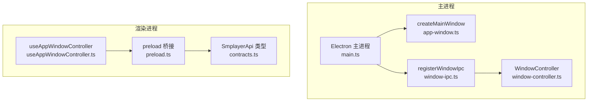
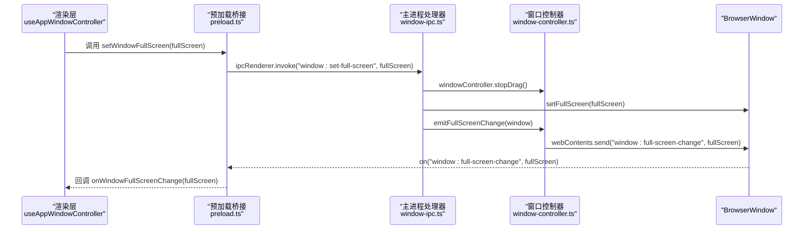
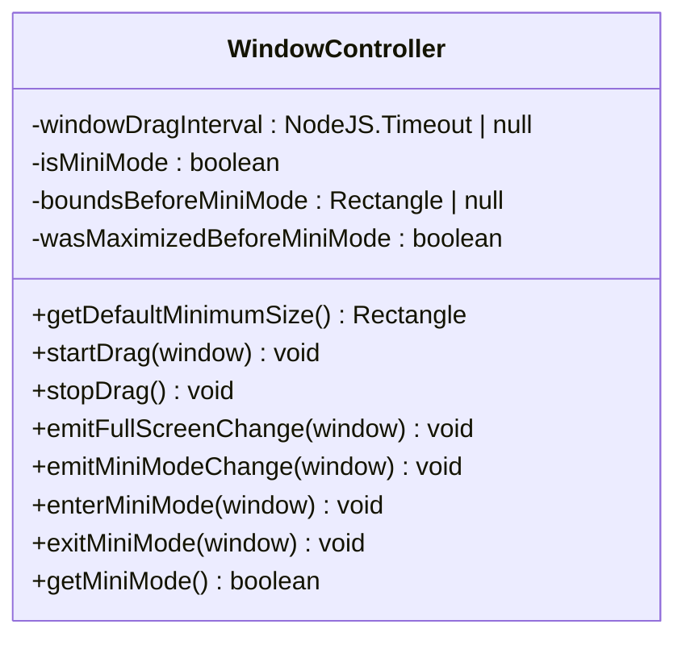
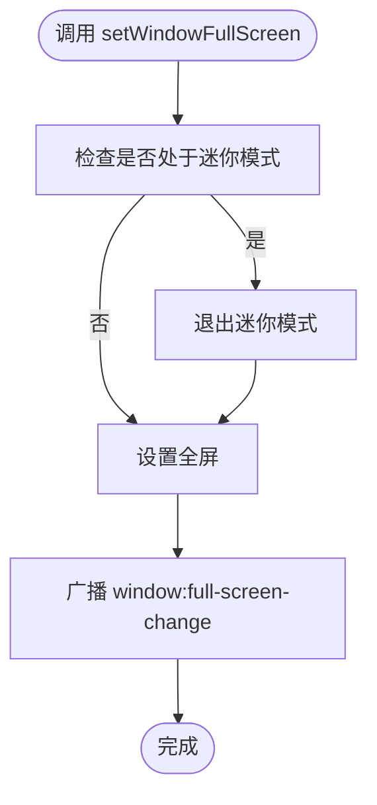
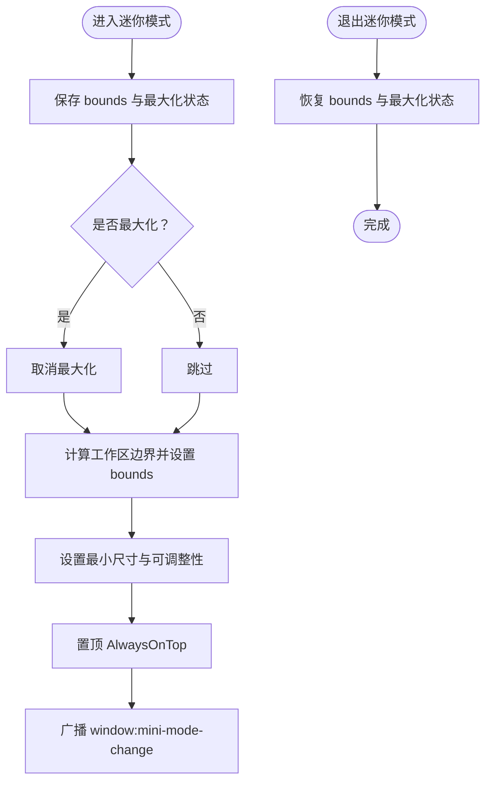
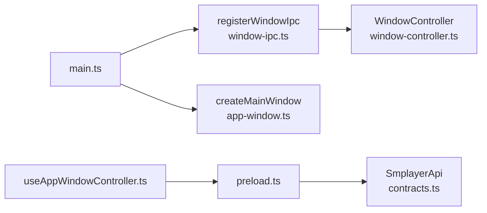

# 窗口IPC接口

<cite>
**本文档引用的文件**
- [window-ipc.ts](file://electron/ipc/window-ipc.ts)
- [window-controller.ts](file://electron/window-controller.ts)
- [app-window.ts](file://electron/app-window.ts)
- [main.ts](file://electron/main.ts)
- [preload.ts](file://electron/preload.ts)
- [useAppWindowController.ts](file://src/hooks/useAppWindowController.ts)
- [contracts.ts](file://src/shared/contracts.ts)
- [common.css](file://src/styles/common.css)
- [responsive.css](file://src/styles/responsive.css)
</cite>

## 目录
1. [简介](#简介)
2. [项目结构](#项目结构)
3. [核心组件](#核心组件)
4. [架构总览](#架构总览)
5. [详细组件分析](#详细组件分析)
6. [依赖关系分析](#依赖关系分析)
7. [性能考量](#性能考量)
8. [故障排查指南](#故障排查指南)
9. [结论](#结论)
10. [附录](#附录)

## 简介
本文件为 SMPlayer 的窗口 IPC 接口完整 API 文档，聚焦于窗口管理相关的 IPC 端点与机制，涵盖窗口创建、销毁、最小化、最大化、全屏切换、位置拖拽、状态同步与事件通知等能力。文档同时提供多窗口管理策略、窗口状态同步、事件处理流程、最佳实践（生命周期管理、内存优化、用户体验优化）以及窗口配置、主题适配、响应式设计的使用指南。

## 项目结构
SMPlayer 的窗口 IPC 能力由主进程窗口控制器、IPC 注册器、渲染层 API 暴露与 React Hook 组成，形成“主进程控制 + 渲染层调用 + 状态同步”的闭环。

图表来源
- [main.ts:189-198](file://electron/main.ts#L189-L198)
- [window-ipc.ts:16-58](file://electron/ipc/window-ipc.ts#L16-L58)
- [window-controller.ts:6-122](file://electron/window-controller.ts#L6-L122)
- [app-window.ts:41-138](file://electron/app-window.ts#L41-L138)
- [preload.ts:45-286](file://electron/preload.ts#L45-L286)
- [useAppWindowController.ts:8-78](file://src/hooks/useAppWindowController.ts#L8-L78)
- [contracts.ts:527-663](file://src/shared/contracts.ts#L527-L663)

章节来源
- [main.ts:189-198](file://electron/main.ts#L189-L198)
- [window-ipc.ts:16-58](file://electron/ipc/window-ipc.ts#L16-L58)
- [window-controller.ts:6-122](file://electron/window-controller.ts#L6-L122)
- [app-window.ts:41-138](file://electron/app-window.ts#L41-L138)
- [preload.ts:45-286](file://electron/preload.ts#L45-L286)
- [useAppWindowController.ts:8-78](file://src/hooks/useAppWindowController.ts#L8-L78)
- [contracts.ts:527-663](file://src/shared/contracts.ts#L527-L663)

## 核心组件
- 窗口 IPC 注册器：在主进程中注册窗口相关的 IPC 处理函数，负责窗口状态变更与事件广播。
- 窗口控制器：封装窗口拖拽、全屏、迷你模式等窗口行为逻辑，并向渲染进程发送状态事件。
- 主窗口创建器：负责创建 BrowserWindow，设置标题栏、背景色、权限策略、启动页等。
- 预加载桥接：在渲染进程中暴露 SmplayerApi，包含窗口 IPC 方法与事件监听器。
- React Hook：在渲染侧提供窗口状态读取、事件订阅与窗口操作便捷方法。

章节来源
- [window-ipc.ts:16-58](file://electron/ipc/window-ipc.ts#L16-L58)
- [window-controller.ts:6-122](file://electron/window-controller.ts#L6-L122)
- [app-window.ts:41-138](file://electron/app-window.ts#L41-L138)
- [preload.ts:45-286](file://electron/preload.ts#L45-L286)
- [useAppWindowController.ts:8-78](file://src/hooks/useAppWindowController.ts#L8-L78)
- [contracts.ts:527-663](file://src/shared/contracts.ts#L527-L663)

## 架构总览
窗口 IPC 的调用链路如下：
- 渲染层通过 window.smplayer 调用窗口方法（如 setWindowFullScreen、setWindowMiniMode）。
- 预加载层将调用转发到 ipcRenderer.invoke，并注册对应事件监听器（如 onWindowFullScreenChange）。
- 主进程通过 registerWindowIpc 注册 ipcMain.handle 处理器，调用 WindowController 执行具体窗口操作。
- WindowController 在执行窗口操作后，通过 window.webContents.send 广播状态事件给渲染层。

图表来源
- [window-ipc.ts:34-42](file://electron/ipc/window-ipc.ts#L34-L42)
- [window-controller.ts:46-52](file://electron/window-controller.ts#L46-L52)
- [preload.ts:251-261](file://electron/preload.ts#L251-L261)
- [useAppWindowController.ts:63-67](file://src/hooks/useAppWindowController.ts#L63-L67)

## 详细组件分析

### 窗口 IPC 端点与行为
- 窗口拖拽
  - 渲染层：startWindowDrag、stopWindowDrag
  - 主进程：window:start-drag、window:stop-drag
  - 行为：基于屏幕光标位置计算偏移，定时更新窗口位置；拖拽期间停止窗口控制器的拖拽循环，避免冲突。
- 控件主题切换
  - 渲染层：setWindowControlsLight(light)
  - 主进程：window:set-controls-light(light)
  - 行为：根据 light 切换窗口背景色与 Windows 标题栏覆盖层颜色与符号色。
- 全屏切换
  - 渲染层：setWindowFullScreen(fullScreen)、getWindowFullScreen()
  - 主进程：window:set-full-screen(fullScreen)、window:get-full-screen()
  - 行为：若进入全屏且当前处于迷你模式，则先退出迷你模式；设置全屏后广播 window:full-screen-change。
- 迷你模式
  - 渲染层：setWindowMiniMode(miniMode)、getWindowMiniMode()
  - 主进程：window:set-mini-mode(miniMode)、window:get-mini-mode()
  - 行为：进入迷你模式时保存原 bounds 与最大化状态，限制最小尺寸并置顶；退出迷你模式时恢复原 bounds 与最大化状态。

章节来源
- [window-ipc.ts:17-57](file://electron/ipc/window-ipc.ts#L17-L57)
- [window-controller.ts:16-120](file://electron/window-controller.ts#L16-L120)
- [preload.ts:70-76](file://electron/preload.ts#L70-L76)
- [useAppWindowController.ts:43-67](file://src/hooks/useAppWindowController.ts#L43-L67)

### 窗口控制器类图

图表来源
- [window-controller.ts:6-122](file://electron/window-controller.ts#L6-L122)

### 全屏切换流程图

图表来源
- [window-ipc.ts:34-42](file://electron/ipc/window-ipc.ts#L34-L42)
- [window-controller.ts:46-52](file://electron/window-controller.ts#L46-L52)

### 迷你模式进入/退出流程图

图表来源
- [window-controller.ts:62-116](file://electron/window-controller.ts#L62-L116)

### 窗口事件监听与状态同步
- 渲染层通过 onWindowFullScreenChange 与 onWindowMiniModeChange 订阅窗口状态变化，实现 UI 同步。
- 预加载层在初始化时注册事件监听器，并在组件卸载时移除监听，避免内存泄漏。
- React Hook useAppWindowController 自动拉取初始状态并订阅变化，简化渲染层逻辑。

章节来源
- [preload.ts:251-272](file://electron/preload.ts#L251-L272)
- [useAppWindowController.ts:15-33](file://src/hooks/useAppWindowController.ts#L15-L33)

### 主窗口创建与生命周期
- 创建主窗口时设置最小尺寸、背景色、标题栏样式、Windows 标题栏覆盖层、macOS 挥发性效果等。
- 窗口关闭事件中根据设置决定隐藏到系统托盘或直接退出应用，并在首次隐藏时提示用户。
- 窗口 ready-to-show 时显示窗口，防止白屏。
- 设置外部链接打开方式与媒体权限策略，提升安全性与体验。

章节来源
- [app-window.ts:41-138](file://electron/app-window.ts#L41-L138)

### 渲染层 API 类型与暴露
- SmplayerApi 定义了窗口相关的方法与事件监听器，包括窗口拖拽、全屏、迷你模式、事件订阅等。
- 预加载层通过 contextBridge 将 API 暴露到 window.smplayer，供 React 组件使用。

章节来源
- [contracts.ts:527-663](file://src/shared/contracts.ts#L527-L663)
- [preload.ts:45-286](file://electron/preload.ts#L45-L286)

## 依赖关系分析
- 主进程依赖
  - main.ts 注册窗口 IPC：registerWindowIpc
  - window-ipc.ts 提供窗口 IPC 处理器
  - window-controller.ts 提供窗口行为控制
  - app-window.ts 提供主窗口创建与生命周期事件
- 渲染层依赖
  - preload.ts 暴露 SmplayerApi
  - useAppWindowController.ts 提供窗口状态与操作 Hook
  - contracts.ts 定义 API 类型

图表来源
- [main.ts:189-198](file://electron/main.ts#L189-L198)
- [window-ipc.ts:16-58](file://electron/ipc/window-ipc.ts#L16-L58)
- [window-controller.ts:6-122](file://electron/window-controller.ts#L6-L122)
- [app-window.ts:41-138](file://electron/app-window.ts#L41-L138)
- [preload.ts:45-286](file://electron/preload.ts#L45-L286)
- [useAppWindowController.ts:8-78](file://src/hooks/useAppWindowController.ts#L8-L78)
- [contracts.ts:527-663](file://src/shared/contracts.ts#L527-L663)

## 性能考量
- 拖拽性能
  - 使用定时器按帧更新窗口位置，建议保持稳定的刷新频率以避免卡顿。
  - 拖拽过程中停止其他窗口操作，减少状态竞争。
- 全屏与迷你模式切换
  - 切换前保存/恢复 bounds 与最大化状态，避免布局抖动。
  - 全屏切换时优先退出迷你模式，确保状态一致性。
- 内存与事件监听
  - 渲染层在组件卸载时移除事件监听器，避免内存泄漏。
  - 预加载层仅在需要时注册监听器，减少不必要的事件分发。

[本节为通用性能建议，不直接分析特定文件]

## 故障排查指南
- 窗口无法拖拽
  - 检查是否处于最大化状态，窗口控制器在最大化时不支持拖拽。
  - 确认 startWindowDrag 与 stopWindowDrag 是否正确配对调用。
- 全屏状态不同步
  - 确认 onWindowFullScreenChange 是否被正确注册与移除。
  - 检查主进程是否正确广播 window:full-screen-change。
- 迷你模式异常
  - 确认 enterMiniMode/exitMiniMode 的调用顺序与参数。
  - 检查 bounds 与最大化状态是否正确保存/恢复。
- 标题栏主题未生效
  - 确认 setWindowControlsLight 的调用时机与平台差异（Windows 标题栏覆盖层）。

章节来源
- [window-controller.ts:16-44](file://electron/window-controller.ts#L16-L44)
- [window-ipc.ts:34-42](file://electron/ipc/window-ipc.ts#L34-L42)
- [preload.ts:251-272](file://electron/preload.ts#L251-L272)

## 结论
SMPlayer 的窗口 IPC 接口通过清晰的职责分离与事件驱动机制，实现了窗口状态的统一管理与实时同步。主进程的窗口控制器集中处理窗口行为，渲染层通过预加载桥接与 Hook 简化了窗口操作与状态订阅。结合主题适配与响应式设计，可为用户提供一致且高效的窗口交互体验。

[本节为总结性内容，不直接分析特定文件]

## 附录

### 窗口 IPC API 参考
- 窗口拖拽
  - startWindowDrag(): Promise<void>
  - stopWindowDrag(): Promise<void>
- 全屏控制
  - setWindowFullScreen(fullScreen: boolean): Promise<void>
  - getWindowFullScreen(): Promise<boolean>
- 迷你模式
  - setWindowMiniMode(miniMode: boolean): Promise<void>
  - getWindowMiniMode(): Promise<boolean>
- 事件监听
  - onWindowFullScreenChange(callback: (fullScreen: boolean) => void): () => void
  - onWindowMiniModeChange(callback: (miniMode: boolean) => void): () => void

章节来源
- [contracts.ts:552-558](file://src/shared/contracts.ts#L552-L558)
- [contracts.ts:660-661](file://src/shared/contracts.ts#L660-L661)
- [preload.ts:70-76](file://electron/preload.ts#L70-L76)
- [preload.ts:251-272](file://electron/preload.ts#L251-L272)

### 最佳实践
- 生命周期管理
  - 在组件卸载时移除事件监听器，避免内存泄漏。
  - 在窗口关闭时根据用户设置选择隐藏到托盘或退出应用。
- 内存优化
  - 避免在渲染层频繁创建临时对象，复用事件回调。
  - 合理使用定时器，及时清理。
- 用户体验优化
  - 在全屏与迷你模式切换时保持状态一致性，避免布局抖动。
  - 提供明确的状态反馈（如全屏/迷你模式图标）。
- 主题适配与响应式设计
  - 使用 setWindowControlsLight 动态切换标题栏主题。
  - 借助响应式样式在不同窗口尺寸下优化布局与控件密度。

章节来源
- [app-window.ts:76-96](file://electron/app-window.ts#L76-L96)
- [responsive.css:1-200](file://src/styles/responsive.css#L1-L200)
- [common.css:1-200](file://src/styles/common.css#L1-L200)