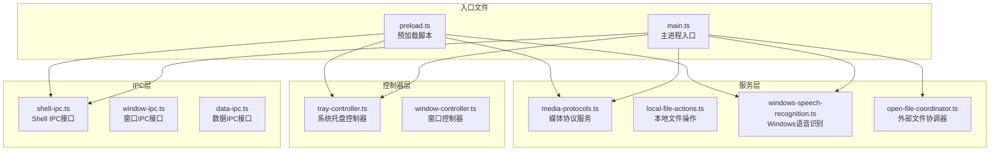
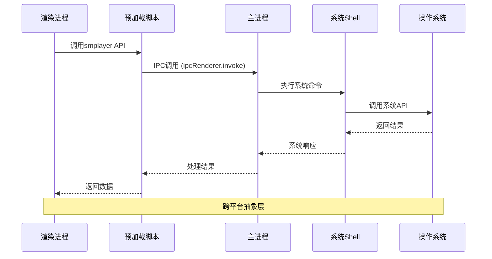
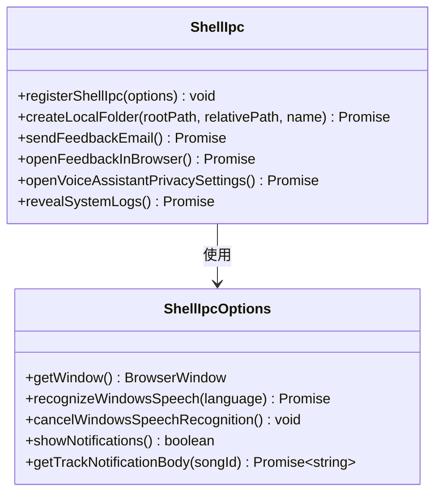
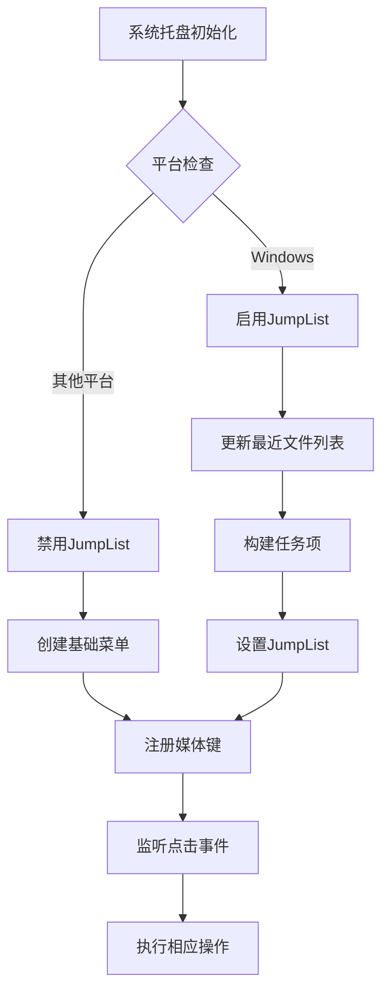
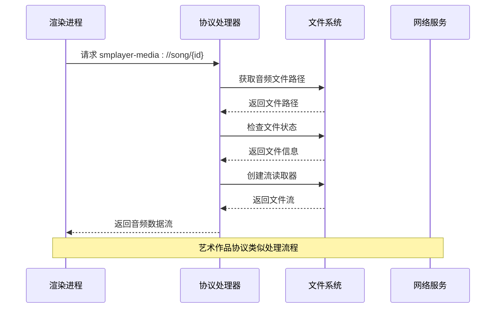
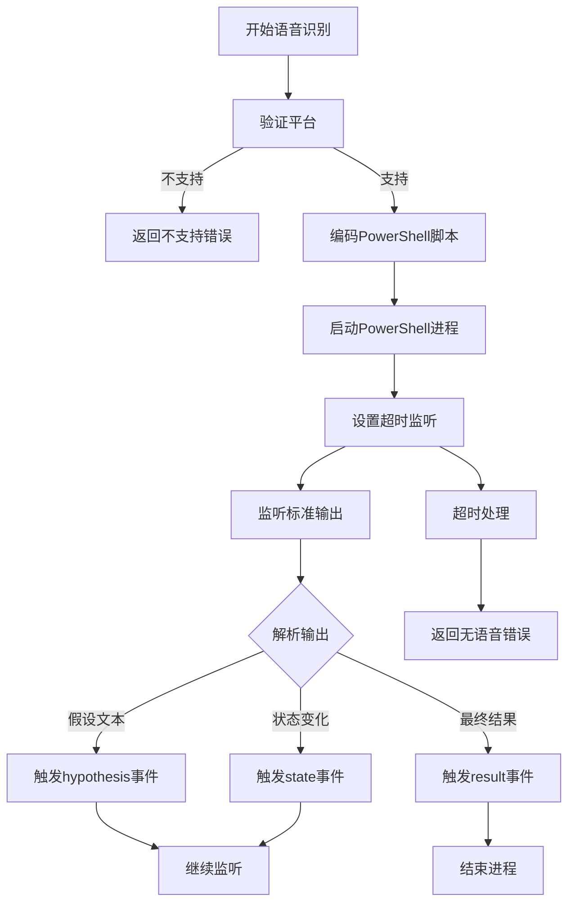
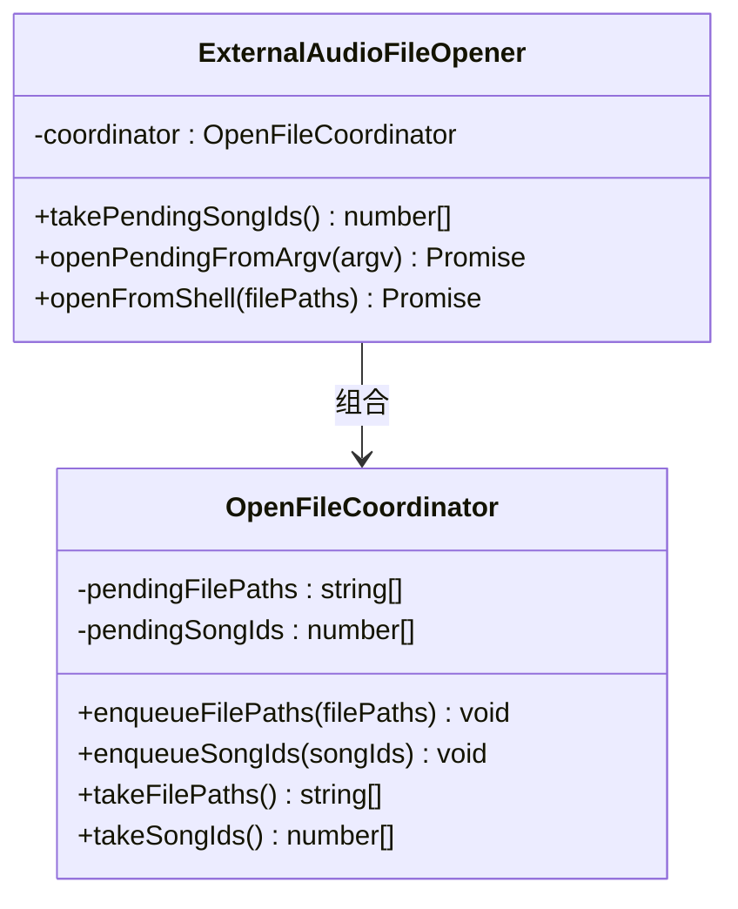
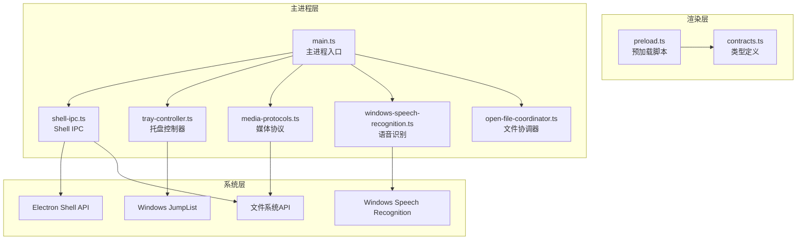

# 系统Shell IPC接口

<cite>
**本文档引用的文件**
- [shell-ipc.ts](file://electron/ipc/shell-ipc.ts)
- [tray-controller.ts](file://electron/tray-controller.ts)
- [media-protocols.ts](file://electron/services/media-protocols.ts)
- [local-file-actions.ts](file://electron/services/local-file-actions.ts)
- [windows-speech-recognition.ts](file://electron/services/windows-speech-recognition.ts)
- [main.ts](file://electron/main.ts)
- [preload.ts](file://electron/preload.ts)
- [contracts.ts](file://src/shared/contracts.ts)
- [open-file-coordinator.ts](file://electron/services/open-file-coordinator.ts)
</cite>

## 目录
1. [简介](#简介)
2. [项目结构](#项目结构)
3. [核心组件](#核心组件)
4. [架构概览](#架构概览)
5. [详细组件分析](#详细组件分析)
6. [依赖关系分析](#依赖关系分析)
7. [性能考虑](#性能考虑)
8. [故障排除指南](#故障排除指南)
9. [结论](#结论)

## 简介

SMPlayer的系统Shell IPC接口是应用程序与操作系统深度集成的核心模块，负责处理各种系统级交互功能。该接口实现了跨平台的文件操作、系统托盘管理、媒体键控制、语音识别、通知系统等关键功能，特别针对Windows平台提供了JumpList、全局媒体键绑定等特性。

本接口通过Electron的IPC机制，将渲染进程中的用户操作转换为系统级调用，同时处理平台差异和兼容性问题，确保在不同操作系统上都能提供一致的用户体验。

## 项目结构

系统Shell IPC接口主要分布在以下目录和文件中：

**图表来源**
- [shell-ipc.ts:1-100](file://electron/ipc/shell-ipc.ts#L1-L100)
- [tray-controller.ts:1-209](file://electron/tray-controller.ts#L1-L209)
- [media-protocols.ts:1-120](file://electron/services/media-protocols.ts#L1-L120)
- [windows-speech-recognition.ts:1-240](file://electron/services/windows-speech-recognition.ts#L1-L240)

**章节来源**
- [shell-ipc.ts:1-100](file://electron/ipc/shell-ipc.ts#L1-L100)
- [tray-controller.ts:1-209](file://electron/tray-controller.ts#L1-L209)
- [media-protocols.ts:1-120](file://electron/services/media-protocols.ts#L1-L120)

## 核心组件

系统Shell IPC接口由以下几个核心组件构成：

### 1. Shell IPC接口
负责处理系统级Shell操作，包括文件浏览、反馈邮件发送、系统日志查看等。

### 2. 系统托盘控制器
管理任务栏图标、上下文菜单、JumpList和全局媒体键绑定。

### 3. 媒体协议服务
注册自定义协议（smplayer-media、smplayer-artwork）以支持内部资源访问。

### 4. 本地文件操作服务
提供文件删除、移动冲突解决等系统级文件操作。

### 5. Windows语音识别服务
实现基于PowerShell的Windows语音识别功能。

**章节来源**
- [shell-ipc.ts:20-67](file://electron/ipc/shell-ipc.ts#L20-L67)
- [tray-controller.ts:28-51](file://electron/tray-controller.ts#L28-L51)
- [media-protocols.ts:10-31](file://electron/services/media-protocols.ts#L10-L31)

## 架构概览

系统Shell IPC接口采用分层架构设计，确保各组件职责清晰、耦合度低：

**图表来源**
- [preload.ts:45-287](file://electron/preload.ts#L45-L287)
- [main.ts:156-203](file://electron/main.ts#L156-L203)

## 详细组件分析

### Shell IPC接口分析

Shell IPC接口提供了丰富的系统级操作能力：

#### 文件操作功能
- **文件浏览**: `shell:reveal-item` - 在文件管理器中显示指定路径
- **文件夹创建**: `shell:create-local-folder` - 创建本地音乐库文件夹
- **文件删除**: 通过`trashPathIfExists`函数实现安全删除

#### 用户反馈功能
- **邮件反馈**: `shell:send-feedback-email` - 打开默认邮件客户端
- **浏览器反馈**: `shell:open-feedback-browser` - 在浏览器中打开反馈页面
- **隐私设置**: `shell:open-voice-assistant-privacy-settings` - 导航到语音助手隐私设置

#### 系统集成功能
- **日志查看**: `shell:reveal-system-logs` - 打开应用日志目录
- **通知管理**: `shell:show-track-notification` - 显示歌曲播放通知

**图表来源**
- [shell-ipc.ts:8-14](file://electron/ipc/shell-ipc.ts#L8-L14)
- [shell-ipc.ts:20-67](file://electron/ipc/shell-ipc.ts#L20-L67)

**章节来源**
- [shell-ipc.ts:20-99](file://electron/ipc/shell-ipc.ts#L20-L99)

### 系统托盘控制器分析

系统托盘控制器实现了完整的任务栏集成：

#### 托盘菜单功能
- **窗口控制**: 显示/隐藏窗口切换
- **媒体控制**: 播放/暂停、上一首、下一首
- **快速播放**: 快速启动播放功能
- **设置导航**: 打开应用设置界面
- **退出应用**: 安全退出应用程序

#### Windows JumpList集成
- **最近文件**: 显示最近播放的音乐文件
- **任务项**: 提供快速启动窗口的任务项
- **条件限制**: 仅在打包版本且非便携模式下启用

#### 全局媒体键绑定
- **MediaPlayPause**: 播放/暂停控制
- **MediaNextTrack**: 下一首歌曲
- **MediaPreviousTrack**: 上一首歌曲
- **MediaStop**: 停止播放

**图表来源**
- [tray-controller.ts:122-160](file://electron/tray-controller.ts#L122-L160)
- [tray-controller.ts:171-188](file://electron/tray-controller.ts#L171-L188)

**章节来源**
- [tray-controller.ts:28-209](file://electron/tray-controller.ts#L28-L209)

### 媒体协议服务分析

媒体协议服务实现了自定义协议注册和处理：

#### 协议注册
- **smplayer-media**: 音频文件流式传输协议
- **smplayer-artwork**: 艺术作品图片获取协议

#### 协议处理逻辑
- **范围请求支持**: 实现HTTP Range请求以支持音频流
- **内容类型检测**: 自动识别音频文件格式并设置正确的内容类型
- **缓存优化**: 为艺术作品图片设置长期缓存策略

**图表来源**
- [media-protocols.ts:34-66](file://electron/services/media-protocols.ts#L34-L66)
- [media-protocols.ts:68-87](file://electron/services/media-protocols.ts#L68-L87)

**章节来源**
- [media-protocols.ts:10-120](file://electron/services/media-protocols.ts#L10-L120)

### Windows语音识别服务分析

Windows语音识别服务提供了完整的语音控制功能：

#### PowerShell集成
- **PowerShell脚本**: 使用Windows Speech Recognition API
- **编码处理**: Base64编码PowerShell脚本以避免字符编码问题
- **超时控制**: 18秒超时机制防止长时间占用

#### 语音状态管理
- **实时转录**: `hypothesis`事件提供实时语音转文字
- **状态监控**: `state`事件跟踪识别状态变化
- **结果输出**: 最终识别结果通过`result`事件返回

#### 错误处理
- **权限检查**: 处理隐私设置相关的权限错误
- **语言支持**: 自动选择支持的语言变体
- **异常捕获**: 捕获并报告各种识别失败情况

**图表来源**
- [windows-speech-recognition.ts:34-129](file://electron/services/windows-speech-recognition.ts#L34-L129)

**章节来源**
- [windows-speech-recognition.ts:26-240](file://electron/services/windows-speech-recognition.ts#L26-L240)

### 外部文件协调器分析

外部文件协调器处理来自系统外部的文件打开请求：

#### 文件队列管理
- **待处理文件**: 存储从命令行或系统拖拽传入的文件
- **待处理歌曲**: 存储已添加到库中的歌曲ID
- **延迟处理**: 在应用初始化完成后批量处理

#### 文件过滤机制
- **扩展名检查**: 仅接受支持的音频文件扩展名
- **存在性验证**: 确保文件路径有效且文件存在
- **批量处理**: 支持多个文件的并发处理

**图表来源**
- [open-file-coordinator.ts:15-74](file://electron/services/open-file-coordinator.ts#L15-L74)

**章节来源**
- [open-file-coordinator.ts:40-74](file://electron/services/open-file-coordinator.ts#L40-L74)

## 依赖关系分析

系统Shell IPC接口的依赖关系呈现清晰的分层结构：

**图表来源**
- [main.ts:32-34](file://electron/main.ts#L32-L34)
- [main.ts:175-188](file://electron/main.ts#L175-L188)

**章节来源**
- [main.ts:141-203](file://electron/main.ts#L141-L203)

## 性能考虑

系统Shell IPC接口在设计时充分考虑了性能优化：

### 异步处理
- 所有IPC调用都使用异步模式，避免阻塞主线程
- 文件操作采用Promise链式调用，提高响应速度

### 缓存策略
- 艺术作品图片设置长期缓存（31536000秒）
- 音频文件支持范围请求，减少不必要的数据传输

### 并发控制
- 音频元数据读取使用并发限制（6个并发）
- 文件操作批量处理，减少系统调用次数

### 内存管理
- 及时清理PowerShell进程引用
- 合理的垃圾回收策略

## 故障排除指南

### 常见问题及解决方案

#### 1. Windows JumpList不显示
**症状**: JumpList没有显示最近播放的文件
**原因**: 应用未打包或处于便携模式
**解决方案**: 确保应用以打包模式运行，移除便携环境变量

#### 2. 语音识别失败
**症状**: 语音识别返回"privacy-required"错误
**原因**: 系统隐私设置未允许应用访问麦克风
**解决方案**: 引导用户到隐私设置页面授权应用

#### 3. 文件删除不生效
**症状**: 删除文件后仍能在文件管理器中看到
**原因**: 文件可能在其他程序中被占用
**解决方案**: 关闭占用文件的程序后重试

#### 4. 媒体协议无法加载
**症状**: 音频或图片无法正常播放
**原因**: 协议注册失败或文件路径无效
**解决方案**: 重启应用重新注册协议，检查文件路径有效性

**章节来源**
- [tray-controller.ts:127-131](file://electron/tray-controller.ts#L127-L131)
- [windows-speech-recognition.ts:225-232](file://electron/services/windows-speech-recognition.ts#L225-L232)
- [media-protocols.ts:34-37](file://electron/services/media-protocols.ts#L34-L37)

## 结论

SMPlayer的系统Shell IPC接口展现了现代桌面应用的系统集成最佳实践。通过精心设计的分层架构、完善的错误处理机制和跨平台兼容性考虑，该接口为用户提供了无缝的系统级体验。

关键优势包括：
- **完整的系统集成**: 涵盖文件操作、托盘管理、媒体键控制等核心功能
- **平台特定优化**: 针对Windows平台的JumpList和语音识别进行了专门优化
- **良好的抽象设计**: 通过预加载脚本提供统一的API接口
- **健壮的错误处理**: 全面的异常捕获和用户友好的错误提示

该接口为开发者提供了清晰的扩展点，可以轻松添加新的系统集成功能，同时保持现有功能的稳定性。