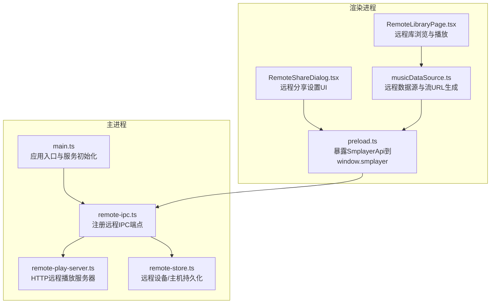
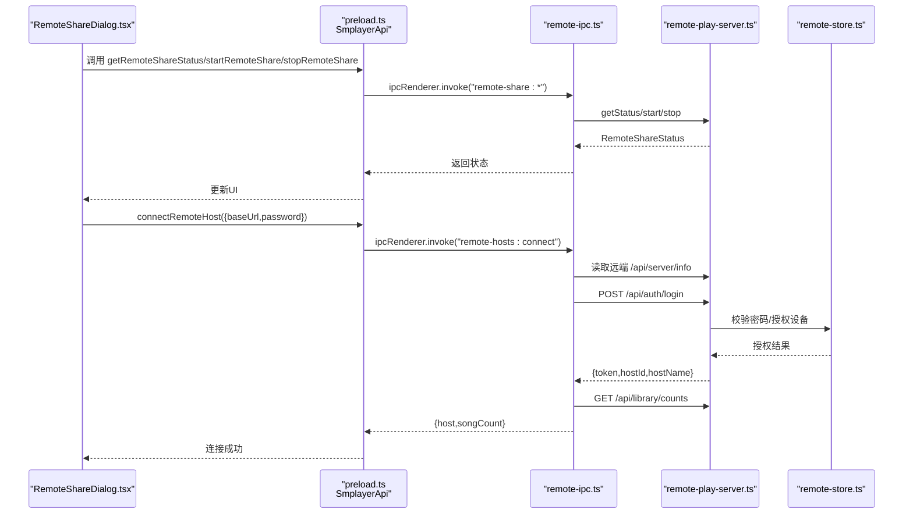
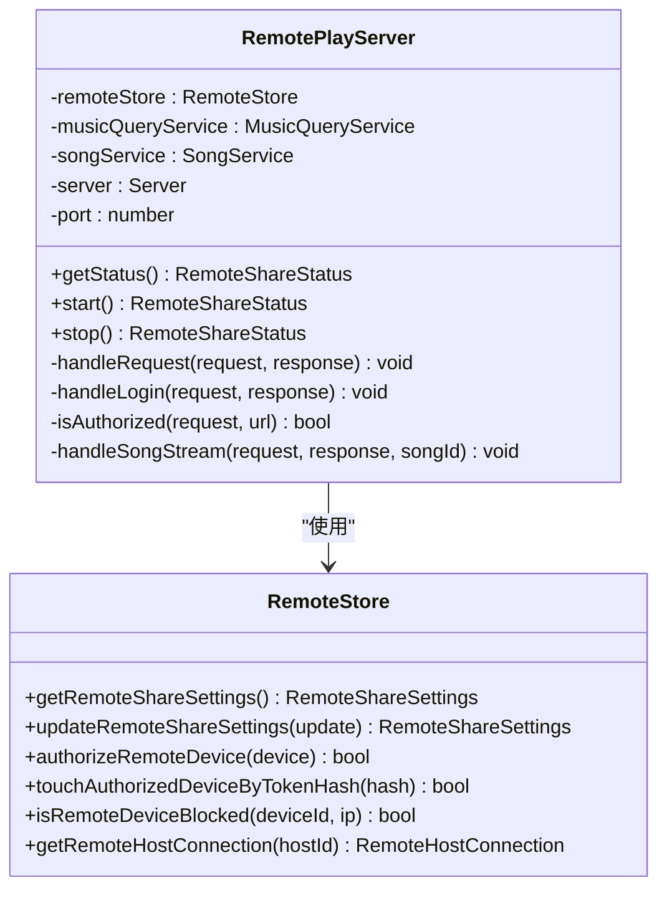
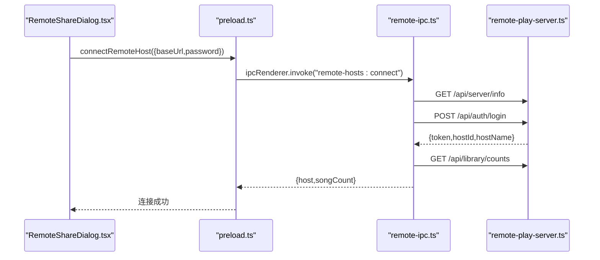
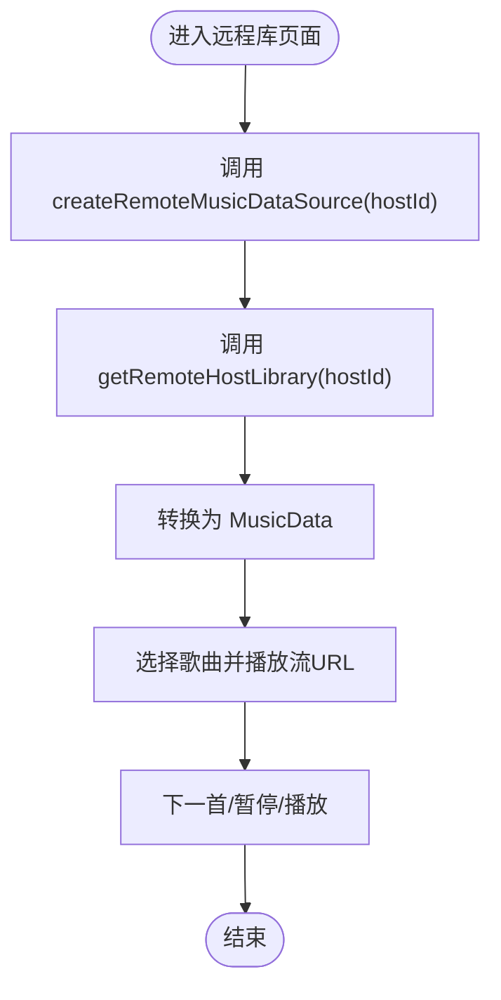
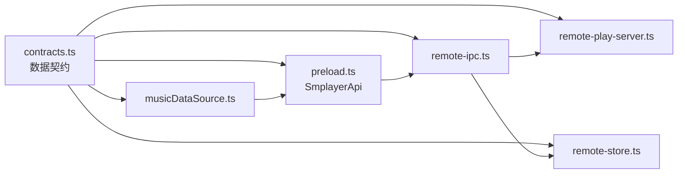

# 远程IPC接口

<cite>
**本文引用的文件**
- [electron/ipc/remote-ipc.ts](file://electron/ipc/remote-ipc.ts)
- [electron/services/remote-play-server.ts](file://electron/services/remote-play-server.ts)
- [electron/services/remote-store.ts](file://electron/services/remote-store.ts)
- [src/shared/contracts.ts](file://src/shared/contracts.ts)
- [src/data/musicDataSource.ts](file://src/data/musicDataSource.ts)
- [src/pages/RemoteLibraryPage.tsx](file://src/pages/RemoteLibraryPage.tsx)
- [src/components/RemoteShareDialog.tsx](file://src/components/RemoteShareDialog.tsx)
- [electron/preload.ts](file://electron/preload.ts)
- [electron/main.ts](file://electron/main.ts)
</cite>

## 目录
1. [简介](#简介)
2. [项目结构](#项目结构)
3. [核心组件](#核心组件)
4. [架构总览](#架构总览)
5. [详细组件分析](#详细组件分析)
6. [依赖关系分析](#依赖关系分析)
7. [性能考量](#性能考量)
8. [故障排查指南](#故障排查指南)
9. [结论](#结论)
10. [附录](#附录)

## 简介
本文件为 SMPlayer 的远程 IPC 接口完整 API 文档，覆盖远程播放、网络共享与实时同步等能力。内容包括：
- 远程播放服务器的启动与配置
- 播放列表与音乐库共享机制
- 播放状态同步协议
- 远程控制实现指南（连接建立、认证、数据传输、断线重连）
- 安全性、性能优化与错误处理最佳实践

## 项目结构
远程 IPC 相关代码主要分布在以下模块：
- 主进程 IPC 注册与远程主机交互：electron/ipc/remote-ipc.ts
- 远程播放 HTTP 服务器：electron/services/remote-play-server.ts
- 远程设备与主机持久化存储：electron/services/remote-store.ts
- 前端 IPC 暴露与远程界面：electron/preload.ts、src/components/RemoteShareDialog.tsx、src/pages/RemoteLibraryPage.tsx
- 数据契约与类型定义：src/shared/contracts.ts
- 远程数据源与流式播放：src/data/musicDataSource.ts
- 应用入口与服务初始化：electron/main.ts

图表来源
- [electron/main.ts:141-209](file://electron/main.ts#L141-L209)
- [electron/ipc/remote-ipc.ts:19-54](file://electron/ipc/remote-ipc.ts#L19-L54)
- [electron/services/remote-play-server.ts:77-147](file://electron/services/remote-play-server.ts#L77-L147)
- [electron/services/remote-store.ts:49-115](file://electron/services/remote-store.ts#L49-L115)
- [electron/preload.ts:108-118](file://electron/preload.ts#L108-L118)
- [src/components/RemoteShareDialog.tsx:29-48](file://src/components/RemoteShareDialog.tsx#L29-L48)
- [src/pages/RemoteLibraryPage.tsx:11-24](file://src/pages/RemoteLibraryPage.tsx#L11-L24)
- [src/data/musicDataSource.ts:205-284](file://src/data/musicDataSource.ts#L205-L284)

章节来源
- [electron/main.ts:141-209](file://electron/main.ts#L141-L209)
- [electron/ipc/remote-ipc.ts:19-54](file://electron/ipc/remote-ipc.ts#L19-L54)
- [electron/services/remote-play-server.ts:77-147](file://electron/services/remote-play-server.ts#L77-L147)
- [electron/services/remote-store.ts:49-115](file://electron/services/remote-store.ts#L49-L115)
- [electron/preload.ts:108-118](file://electron/preload.ts#L108-L118)
- [src/components/RemoteShareDialog.tsx:29-48](file://src/components/RemoteShareDialog.tsx#L29-L48)
- [src/pages/RemoteLibraryPage.tsx:11-24](file://src/pages/RemoteLibraryPage.tsx#L11-L24)
- [src/data/musicDataSource.ts:205-284](file://src/data/musicDataSource.ts#L205-L284)

## 核心组件
- 远程播放服务器（RemotePlayServer）：基于 Node.js http 服务器，提供 /api/* 端点，支持登录认证、库查询、歌曲流式播放。
- 远程存储（RemoteStore）：SQLite 同步数据库封装，管理远程分享设置、授权设备、远程主机信息与令牌校验。
- 远程 IPC（registerRemoteIpc）：在主进程中注册 IPC 处理器，负责远程分享启停、设备与主机管理、远程主机连接与库拉取。
- 前端 API 暴露（preload SmplayerApi）：将远程相关 IPC 方法暴露给渲染进程，供 UI 使用。
- 远程数据源（createRemoteMusicDataSource）：将远程主机的音乐库转换为本地统一的数据模型，并生成可播放的流 URL。

章节来源
- [electron/services/remote-play-server.ts:77-294](file://electron/services/remote-play-server.ts#L77-L294)
- [electron/services/remote-store.ts:49-524](file://electron/services/remote-store.ts#L49-L524)
- [electron/ipc/remote-ipc.ts:19-134](file://electron/ipc/remote-ipc.ts#L19-L134)
- [electron/preload.ts:108-118](file://electron/preload.ts#L108-L118)
- [src/data/musicDataSource.ts:205-284](file://src/data/musicDataSource.ts#L205-L284)

## 架构总览
远程 IPC 的整体流程如下：
- 渲染进程通过 window.smplayer 调用远程分享与主机管理方法。
- 主进程的 registerRemoteIpc 将调用转发至 RemotePlayServer 或 RemoteStore。
- RemotePlayServer 提供 HTTP API，供其他客户端访问音乐库与流媒体。
- RemoteStore 维护设备授权、主机连接与令牌状态。
- 前端 RemoteLibraryPage 使用 createRemoteMusicDataSource 获取远程库并进行播放。

图表来源
- [src/components/RemoteShareDialog.tsx:29-90](file://src/components/RemoteShareDialog.tsx#L29-L90)
- [electron/preload.ts:108-118](file://electron/preload.ts#L108-L118)
- [electron/ipc/remote-ipc.ts:71-111](file://electron/ipc/remote-ipc.ts#L71-L111)
- [electron/services/remote-play-server.ts:149-255](file://electron/services/remote-play-server.ts#L149-L255)
- [electron/services/remote-store.ts:289-398](file://electron/services/remote-store.ts#L289-L398)

## 详细组件分析

### 远程播放服务器（RemotePlayServer）
- 启动与停止
  - start：监听指定端口（默认 8023），返回运行状态与局域网地址列表。
  - stop：关闭服务器并更新分享状态。
- 认证与授权
  - /api/auth/login：接收 {password, deviceId, deviceName, platform, browser}，校验密码后生成随机 token 并存入授权设备。
  - 请求头 Authorization: Bearer <token> 或 URL 参数 token 用于后续资源访问鉴权。
- 资源接口
  - /api/server/info：返回设备信息与协议版本。
  - /api/library/counts：返回歌曲数量。
  - /api/library/songs：返回歌曲列表。
  - /api/library/playlists：返回播放列表。
  - /api/library/favorites：返回收藏快照。
  - /api/library/now-playing：返回当前播放队列。
  - /api/songs：返回歌曲数组包装对象。
  - /api/stream/{id}：按字节范围提供音频流，支持 Range 请求。
- 安全性
  - 密码明文对比（建议仅在受控局域网使用）。
  - 设备黑名单与授权状态检查。
  - 令牌以 SHA-256 哈希存储，按需刷新 LastSeenTime。

图表来源
- [electron/services/remote-play-server.ts:77-294](file://electron/services/remote-play-server.ts#L77-L294)
- [electron/services/remote-store.ts:49-398](file://electron/services/remote-store.ts#L49-L398)

章节来源
- [electron/services/remote-play-server.ts:77-294](file://electron/services/remote-play-server.ts#L77-L294)
- [electron/services/remote-store.ts:289-398](file://electron/services/remote-store.ts#L289-L398)

### 远程IPC（registerRemoteIpc）
- 远程分享控制
  - remote-share:get-status：获取服务器运行状态。
  - remote-share:update-settings：更新分享设置并按需重启服务器。
  - remote-share:start/stop：启动或停止服务器。
- 设备与主机管理
  - authorized-devices:list/update/delete：授权设备列表与变更。
  - remote-hosts:list/connect/get-library/delete：远程主机列表、连接、拉取库、删除。
- 远程主机连接流程
  - 读取远端 /api/server/info 获取设备信息。
  - POST /api/auth/login 交换 token。
  - GET /api/library/counts 获取歌曲总数。
  - 保存主机信息与 token，返回 {host, songCount}。
- 远程库拉取
  - 并行请求 /api/library/songs、/api/library/playlists、/api/library/favorites、/api/library/now-playing。
  - 为每首歌拼接 /api/stream/{id}?token=... 作为 mediaUrl。

图表来源
- [electron/ipc/remote-ipc.ts:71-111](file://electron/ipc/remote-ipc.ts#L71-L111)
- [electron/services/remote-play-server.ts:149-255](file://electron/services/remote-play-server.ts#L149-L255)

章节来源
- [electron/ipc/remote-ipc.ts:19-134](file://electron/ipc/remote-ipc.ts#L19-L134)

### 远程数据源与播放（createRemoteMusicDataSource 与 RemoteLibraryPage）
- 远程数据源
  - createRemoteMusicDataSource(hostId)：首次加载时调用 window.smplayer.getRemoteHostLibrary(hostId)，缓存 RemoteMusicData 并转换为本地 MusicData。
  - getStreamUrl(song)：返回拼接好的流 URL（含 token）。
- 播放控制
  - RemoteLibraryPage 使用 HTMLAudioElement 播放远程流，支持切换下一首、暂停/播放。
  - 通过路由参数选择艺术家/专辑/播放列表/歌曲视图。

图表来源
- [src/data/musicDataSource.ts:205-284](file://src/data/musicDataSource.ts#L205-L284)
- [src/pages/RemoteLibraryPage.tsx:11-82](file://src/pages/RemoteLibraryPage.tsx#L11-L82)

章节来源
- [src/data/musicDataSource.ts:205-284](file://src/data/musicDataSource.ts#L205-L284)
- [src/pages/RemoteLibraryPage.tsx:11-82](file://src/pages/RemoteLibraryPage.tsx#L11-L82)

### 前端UI与IPC暴露
- RemoteShareDialog.tsx
  - 展示远程分享状态、复制地址、修改密码、连接远程主机、查看已连接主机与授权设备。
  - 调用 window.smplayer 的远程 IPC 方法。
- preload.ts
  - 暴露 SmplayerApi 中与远程相关的方法：getRemoteShareStatus、updateRemoteShareSettings、startRemoteShare、stopRemoteShare、getAuthorizedDevices、updateAuthorizedDevice、deleteAuthorizedDevice、getRemoteHosts、connectRemoteHost、getRemoteHostLibrary、deleteRemoteHost。

章节来源
- [src/components/RemoteShareDialog.tsx:29-243](file://src/components/RemoteShareDialog.tsx#L29-L243)
- [electron/preload.ts:108-118](file://electron/preload.ts#L108-L118)

## 依赖关系分析

图表来源
- [src/shared/contracts.ts:106-179](file://src/shared/contracts.ts#L106-L179)
- [electron/preload.ts:108-118](file://electron/preload.ts#L108-L118)
- [electron/ipc/remote-ipc.ts:19-54](file://electron/ipc/remote-ipc.ts#L19-L54)
- [electron/services/remote-store.ts:49-115](file://electron/services/remote-store.ts#L49-L115)
- [electron/services/remote-play-server.ts:77-147](file://electron/services/remote-play-server.ts#L77-L147)
- [src/data/musicDataSource.ts:205-284](file://src/data/musicDataSource.ts#L205-L284)

章节来源
- [src/shared/contracts.ts:106-179](file://src/shared/contracts.ts#L106-L179)
- [electron/preload.ts:108-118](file://electron/preload.ts#L108-L118)
- [electron/ipc/remote-ipc.ts:19-54](file://electron/ipc/remote-ipc.ts#L19-L54)
- [electron/services/remote-store.ts:49-115](file://electron/services/remote-store.ts#L49-L115)
- [electron/services/remote-play-server.ts:77-147](file://electron/services/remote-play-server.ts#L77-L147)
- [src/data/musicDataSource.ts:205-284](file://src/data/musicDataSource.ts#L205-L284)

## 性能考量
- 流式播放
  - 服务器支持 Range 请求，前端可利用浏览器原生音频解码与缓冲，减少一次性下载开销。
- 并行拉取
  - 连接远程主机时并行获取歌曲、播放列表、收藏与正在播放队列，缩短首屏时间。
- 缓存策略
  - 远程数据源对 RemoteMusicData 与 MusicData 进行缓存，避免重复拉取。
- 端口与网络
  - 默认端口 8023，启动时绑定 0.0.0.0，便于局域网访问；建议仅在可信网络内启用分享。

章节来源
- [electron/services/remote-play-server.ts:266-293](file://electron/services/remote-play-server.ts#L266-L293)
- [electron/ipc/remote-ipc.ts:116-121](file://electron/ipc/remote-ipc.ts#L116-L121)
- [src/data/musicDataSource.ts:205-251](file://src/data/musicDataSource.ts#L205-L251)

## 故障排查指南
- 连接失败
  - 检查远端是否已启动分享且端口可达。
  - 确认密码正确，设备未被阻止。
  - 查看 UI 提示消息与日志。
- 认证失败
  - /api/auth/login 返回 401 表示密码错误；返回 403 表示设备被阻止。
- 无权限访问资源
  - 401 未授权：缺少有效 Bearer token 或 token 已过期。
  - 确保请求头 Authorization: Bearer <token> 或 URL 参数 token 正确传递。
- 断线重连
  - 重新发起 connectRemoteHost，服务器会重新授权并发放新 token。
  - 若主机信息失效，可删除后重新添加。
- 服务器无法启动
  - 端口占用或权限不足，尝试更换端口或以管理员权限运行。

章节来源
- [electron/services/remote-play-server.ts:218-255](file://electron/services/remote-play-server.ts#L218-L255)
- [electron/services/remote-store.ts:289-300](file://electron/services/remote-store.ts#L289-L300)
- [electron/ipc/remote-ipc.ts:71-111](file://electron/ipc/remote-ipc.ts#L71-L111)

## 结论
SMPlayer 的远程 IPC 接口通过主进程 HTTP 服务器与 IPC 桥接，实现了安全可控的局域网音乐共享与播放。其设计具备清晰的职责分离、完善的认证与授权机制、以及面向前端的统一数据模型与播放体验。建议在受控网络环境中使用，并结合令牌轮换与设备白名单策略提升安全性。

## 附录

### API 参考（IPC 与 HTTP）

- IPC 端点（渲染进程调用）
  - getRemoteShareStatus：获取远程分享状态
  - updateRemoteShareSettings：更新分享设置
  - startRemoteShare/stopRemoteShare：启动/停止分享
  - getAuthorizedDevices/updateAuthorizedDevice/deleteAuthorizedDevice：授权设备管理
  - getRemoteHosts/connectRemoteHost/getRemoteHostLibrary/deleteRemoteHost：远程主机管理

- HTTP 端点（外部客户端访问）
  - GET /api/server/info：返回设备信息与协议版本
  - POST /api/auth/login：登录换取 token
  - GET /api/library/counts：返回歌曲数量
  - GET /api/library/songs：返回歌曲列表
  - GET /api/library/playlists：返回播放列表
  - GET /api/library/favorites：返回收藏快照
  - GET /api/library/now-playing：返回当前播放队列
  - GET /api/songs：返回歌曲数组包装对象
  - GET /api/stream/{id}：按 Range 提供音频流

章节来源
- [electron/preload.ts:108-118](file://electron/preload.ts#L108-L118)
- [electron/ipc/remote-ipc.ts:22-53](file://electron/ipc/remote-ipc.ts#L22-L53)
- [electron/services/remote-play-server.ts:158-216](file://electron/services/remote-play-server.ts#L158-L216)