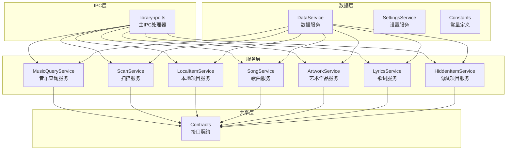
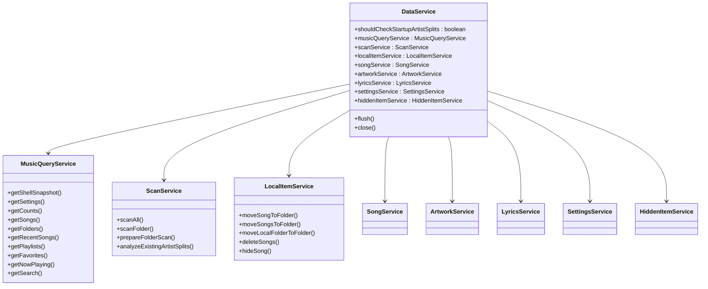
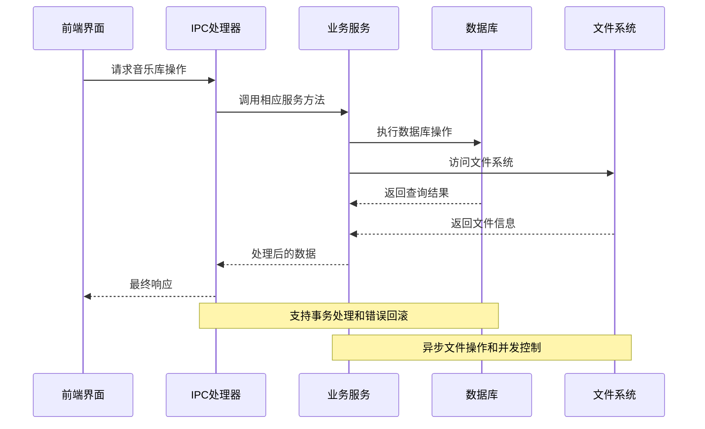
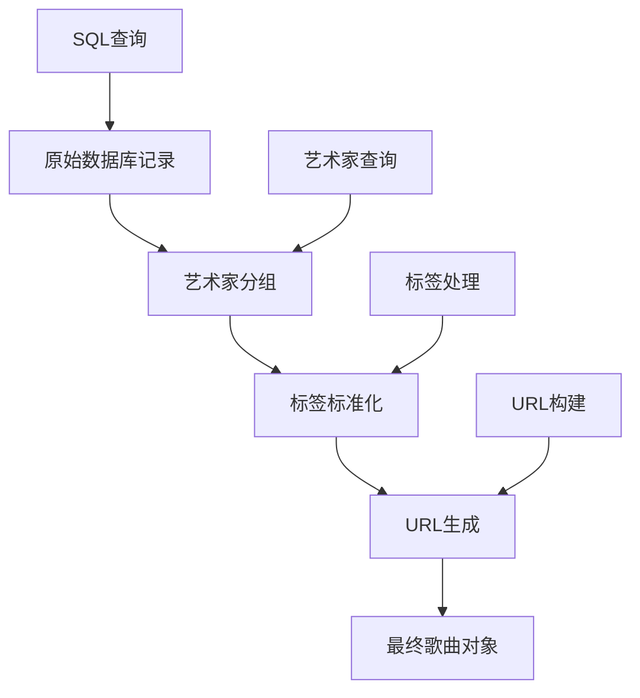
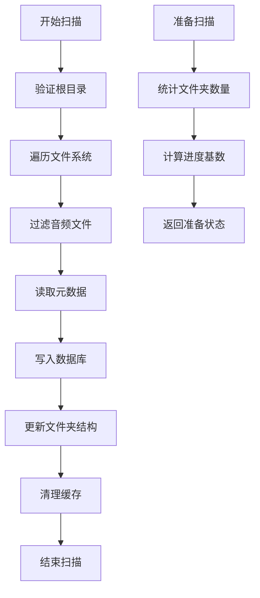
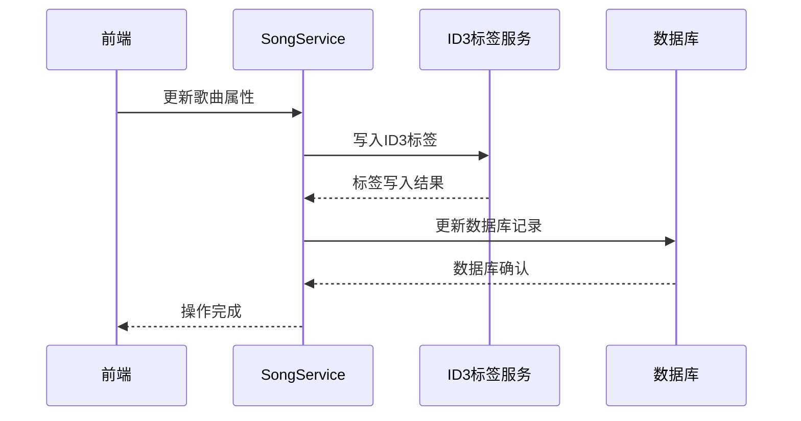
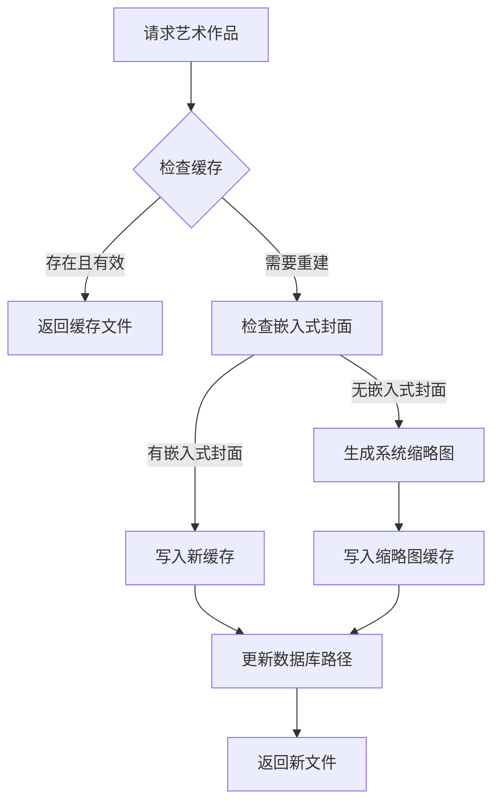
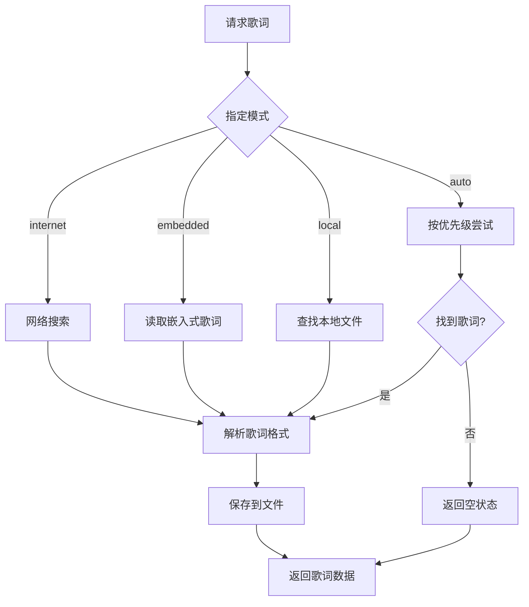
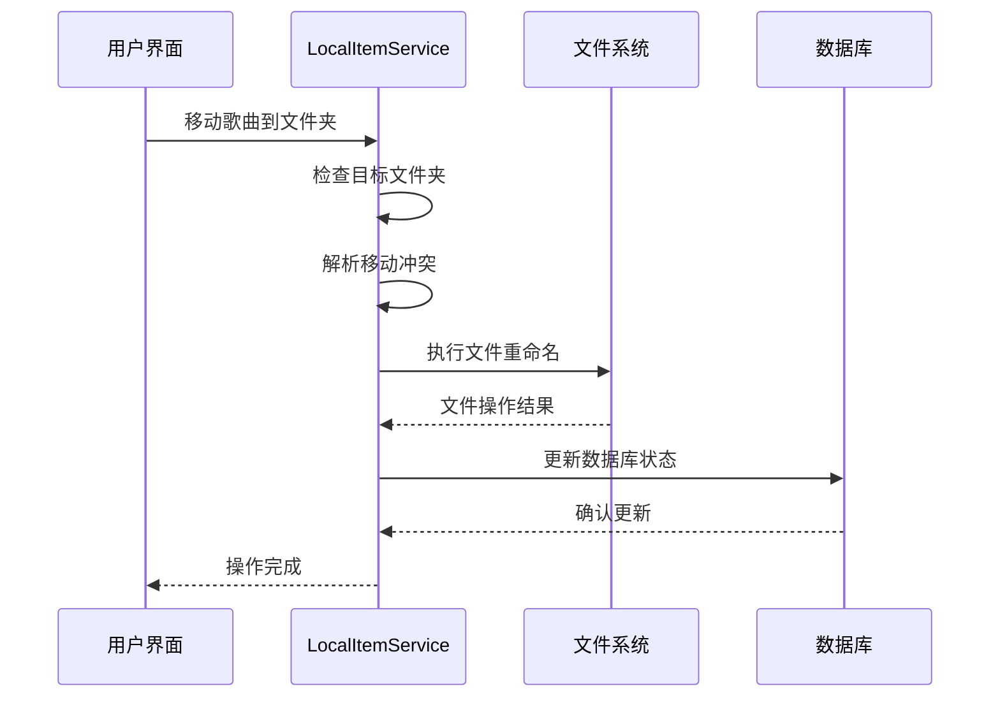
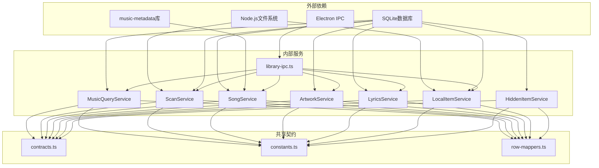

# 音乐库IPC接口

<cite>
**本文档引用的文件**
- [library-ipc.ts](file://electron/ipc/library-ipc.ts)
- [music-query-service.ts](file://electron/services/music-query-service.ts)
- [scan-service.ts](file://electron/services/scan-service.ts)
- [local-item-service.ts](file://electron/services/local-item-service.ts)
- [song-service.ts](file://electron/services/song-service.ts)
- [artwork-service.ts](file://electron/services/artwork-service.ts)
- [lyrics-service.ts](file://electron/services/lyrics-service.ts)
- [hidden-item-service.ts](file://electron/services/hidden-item-service.ts)
- [data-service.ts](file://electron/services/data-service.ts)
- [settings-service.ts](file://electron/services/settings-service.ts)
- [contracts.ts](file://src/shared/contracts.ts)
- [constants.ts](file://electron/services/constants.ts)
- [row-mappers.ts](file://electron/services/row-mappers.ts)
</cite>

## 目录
1. [简介](#简介)
2. [项目结构](#项目结构)
3. [核心组件](#核心组件)
4. [架构概览](#架构概览)
5. [详细组件分析](#详细组件分析)
6. [依赖关系分析](#依赖关系分析)
7. [性能考虑](#性能考虑)
8. [故障排除指南](#故障排除指南)
9. [结论](#结论)

## 简介

SMPlayer的音乐库IPC接口是应用程序与主进程之间通信的核心桥梁，负责处理音乐库的所有管理操作。该接口提供了完整的音乐文件扫描、元数据提取、音乐库刷新、搜索查询等功能，支持实时进度反馈和错误处理。

本接口采用Electron的IPC（Inter-Process Communication）机制，通过`ipcMain.handle`注册各种音乐库操作的处理器，为前端界面提供统一的数据访问和操作接口。

## 项目结构

音乐库IPC接口主要分布在以下目录中：

**图表来源**
- [library-ipc.ts:28-302](file://electron/ipc/library-ipc.ts#L28-L302)
- [data-service.ts:39-197](file://electron/services/data-service.ts#L39-L197)

## 核心组件

### IPC处理器注册

主IPC处理器在`library-ipc.ts`中注册了所有音乐库相关的接口：

- **基础查询接口**：获取音乐库快照、设置、统计信息、歌曲列表等
- **扫描接口**：全库扫描、文件夹扫描、取消扫描
- **媒体操作接口**：歌曲属性更新、播放计数更新、歌词操作
- **艺术作品接口**：专辑封面选择、保存、删除
- **本地项目接口**：歌曲移动、文件夹操作、隐藏管理
- **数据导入导出接口**：数据库备份和恢复

### 数据服务架构

`DataService`作为核心协调器，整合了所有音乐库服务：

**图表来源**
- [data-service.ts:39-197](file://electron/services/data-service.ts#L39-L197)
- [music-query-service.ts:50-417](file://electron/services/music-query-service.ts#L50-L417)
- [scan-service.ts:65-800](file://electron/services/scan-service.ts#L65-L800)
- [local-item-service.ts:22-347](file://electron/services/local-item-service.ts#L22-L347)

**章节来源**
- [library-ipc.ts:28-302](file://electron/ipc/library-ipc.ts#L28-L302)
- [data-service.ts:39-197](file://electron/services/data-service.ts#L39-L197)

## 架构概览

音乐库IPC接口采用分层架构设计，确保了良好的模块化和可维护性：

**图表来源**
- [library-ipc.ts:28-302](file://electron/ipc/library-ipc.ts#L28-L302)
- [music-query-service.ts:50-417](file://electron/services/music-query-service.ts#L50-L417)
- [scan-service.ts:131-306](file://electron/services/scan-service.ts#L131-L306)

### 数据流处理

系统支持多种数据流模式：

1. **同步查询**：直接从数据库返回静态数据
2. **异步扫描**：长时间运行的文件系统扫描操作
3. **实时进度**：扫描过程中的进度反馈
4. **批量操作**：多首歌曲或文件夹的批量处理

## 详细组件分析

### 音乐查询服务

`MusicQueryService`负责所有音乐库数据的查询和聚合：

#### 核心查询方法

| 方法名 | 功能描述 | 返回类型 | 性能特征 |
|--------|----------|----------|----------|
| `getShellSnapshot()` | 获取完整音乐库快照 | `LibraryShellSnapshot` | O(n) |
| `getCounts()` | 获取音乐库统计信息 | `LibraryCounts` | O(1) |
| `getSongs()` | 获取所有歌曲列表 | `LibrarySong[]` | O(n log n) |
| `getFolders()` | 获取文件夹结构 | `LibraryFolder[]` | O(n) |
| `getRecentSongs()` | 获取最近播放歌曲 | `RecentLibrarySong[]` | O(k log k) |

#### 数据映射机制

**图表来源**
- [music-query-service.ts:290-349](file://electron/services/music-query-service.ts#L290-L349)

**章节来源**
- [music-query-service.ts:50-417](file://electron/services/music-query-service.ts#L50-L417)

### 扫描服务

`ScanService`实现了高效的音乐文件扫描和元数据提取功能：

#### 扫描流程

**图表来源**
- [scan-service.ts:131-306](file://electron/services/scan-service.ts#L131-L306)
- [scan-service.ts:366-579](file://electron/services/scan-service.ts#L366-L579)

#### 并发控制

扫描服务使用并发限制来平衡性能和资源使用：

- **元数据读取并发**：6个并发进程
- **文件系统访问**：顺序处理以避免冲突
- **数据库写入**：事务批处理

**章节来源**
- [scan-service.ts:14-16](file://electron/services/scan-service.ts#L14-L16)
- [scan-service.ts:131-579](file://electron/services/scan-service.ts#L131-L579)

### 歌曲服务

`SongService`提供歌曲级别的操作和元数据管理：

#### 元数据提取

| 元数据字段 | 提取源 | 处理方式 |
|------------|--------|----------|
| 标题 | ID3标签/文件名 | 标准化处理 |
| 艺术家 | ID3标签 | 多艺术家分割 |
| 专辑 | ID3标签 | 标准化处理 |
| 时长 | 音频文件 | 自动计算或读取 |
| 播放次数 | 数据库 | 原子性更新 |

#### 属性更新机制

**图表来源**
- [song-service.ts:155-203](file://electron/services/song-service.ts#L155-L203)

**章节来源**
- [song-service.ts:17-297](file://electron/services/song-service.ts#L17-L297)

### 艺术作品服务

`ArtworkService`管理专辑封面和缩略图：

#### 艺术作品来源

| 来源类型 | 优先级 | 处理方式 |
|----------|--------|----------|
| 嵌入式封面 | 最高 | 从音频文件提取 |
| 缓存文件 | 中等 | 使用现有缓存 |
| 系统缩略图 | 最低 | 生成系统缩略图 |
| 无封面 | 不适用 | 返回空状态 |

#### 缓存策略

**图表来源**
- [artwork-service.ts:259-310](file://electron/services/artwork-service.ts#L259-L310)

**章节来源**
- [artwork-service.ts:25-340](file://electron/services/artwork-service.ts#L25-L340)

### 歌词服务

`LyricsService`提供歌词的获取、存储和管理功能：

#### 歌词获取策略

**图表来源**
- [lyrics-service.ts:50-78](file://electron/services/lyrics-service.ts#L50-L78)

**章节来源**
- [lyrics-service.ts:32-572](file://electron/services/lyrics-service.ts#L32-L572)

### 本地项目服务

`LocalItemService`处理本地文件系统的操作：

#### 移动操作流程

**图表来源**
- [local-item-service.ts:79-93](file://electron/services/local-item-service.ts#L79-L93)

**章节来源**
- [local-item-service.ts:22-347](file://electron/services/local-item-service.ts#L22-L347)

## 依赖关系分析

音乐库IPC接口的依赖关系呈现清晰的层次结构：

**图表来源**
- [library-ipc.ts:1-370](file://electron/ipc/library-ipc.ts#L1-L370)
- [contracts.ts:1-664](file://src/shared/contracts.ts#L1-L664)
- [constants.ts:1-28](file://electron/services/constants.ts#L1-L28)

### 关键依赖特性

1. **模块解耦**：每个服务独立封装特定功能
2. **数据一致性**：通过事务保证数据库操作的原子性
3. **错误隔离**：各服务独立处理错误，不影响整体稳定性
4. **扩展性**：基于接口契约的设计便于功能扩展

**章节来源**
- [library-ipc.ts:1-370](file://electron/ipc/library-ipc.ts#L1-L370)
- [contracts.ts:1-664](file://src/shared/contracts.ts#L1-L664)

## 性能考虑

### 查询优化

1. **索引策略**：数据库查询使用适当的索引和排序
2. **批量操作**：支持批量查询和更新减少IPC往返
3. **缓存机制**：艺术作品和歌词内容的智能缓存

### 扫描性能

1. **并发控制**：合理控制并发度避免系统过载
2. **进度反馈**：实时进度报告提升用户体验
3. **增量扫描**：支持文件夹级别的增量更新

### 内存管理

1. **流式处理**：大文件处理采用流式读取
2. **垃圾回收**：及时释放不再使用的资源
3. **内存监控**：监控内存使用防止泄漏

## 故障排除指南

### 常见问题及解决方案

#### 扫描失败

**症状**：扫描过程中断或报错
**原因**：
- 文件权限不足
- 磁盘空间不足
- 文件损坏

**解决方法**：
1. 检查文件系统权限
2. 清理磁盘空间
3. 验证文件完整性

#### 数据库锁定

**症状**：操作超时或数据库锁定错误
**原因**：长时间运行的数据库操作
**解决方法**：
1. 重启应用程序
2. 检查数据库文件权限
3. 确保没有其他进程访问数据库

#### 艺术作品加载失败

**症状**：专辑封面显示为空白
**原因**：
- 缓存文件损坏
- 文件路径错误
- 网络连接问题

**解决方法**：
1. 清理艺术作品缓存
2. 重新生成缩略图
3. 检查网络连接

**章节来源**
- [scan-service.ts:14-16](file://electron/services/scan-service.ts#L14-L16)
- [artwork-service.ts:259-310](file://electron/services/artwork-service.ts#L259-L310)

## 结论

SMPlayer的音乐库IPC接口展现了现代桌面应用程序的优秀设计实践。通过清晰的分层架构、完善的错误处理机制和高效的性能优化，该接口为用户提供了稳定可靠的音乐库管理体验。

关键优势包括：
- **模块化设计**：每个服务职责明确，易于维护和扩展
- **性能优化**：合理的并发控制和缓存策略
- **用户体验**：实时进度反馈和优雅的错误处理
- **数据安全**：事务处理和数据一致性保障

该接口为音乐库的日常管理和高级维护提供了完整的技术支撑，是SMPlayer应用架构的重要组成部分。