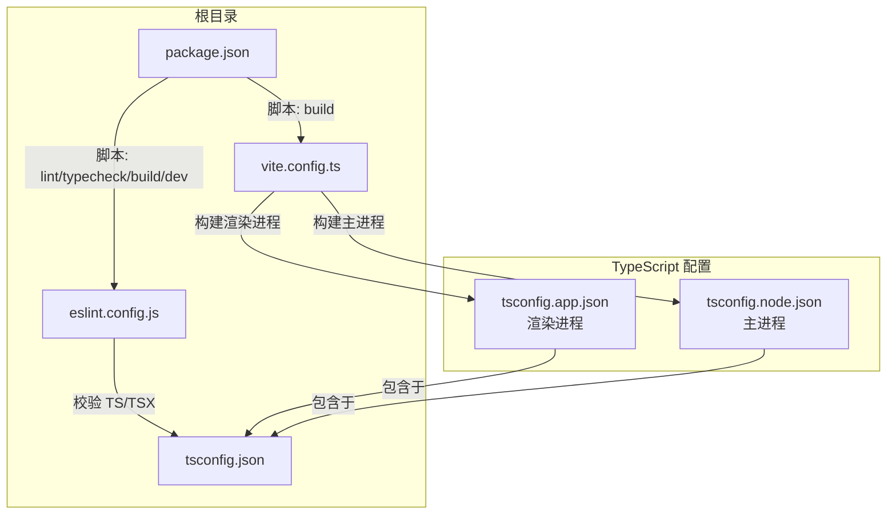
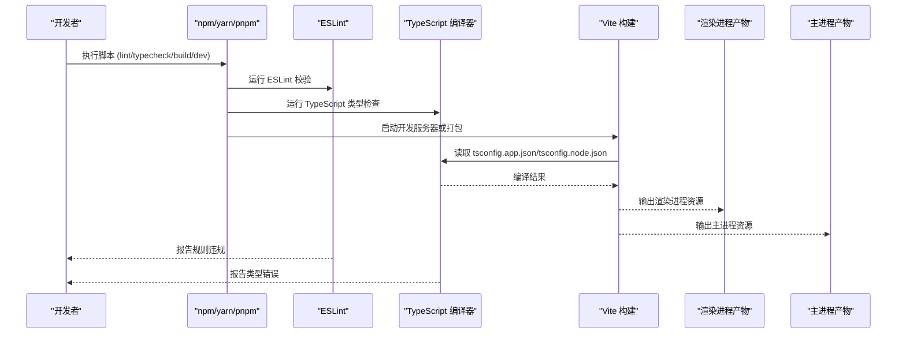
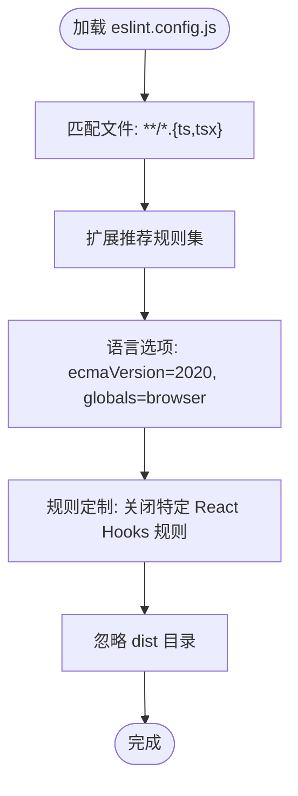
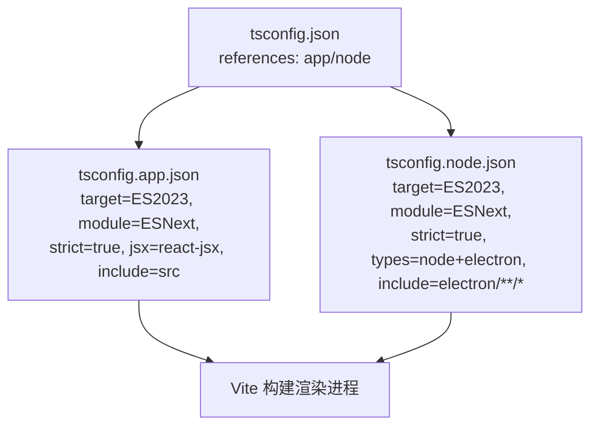
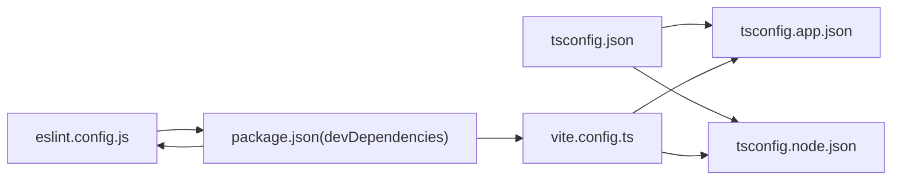

# 代码质量工具

<cite>
**本文引用的文件**   
- [eslint.config.js](file://eslint.config.js)
- [tsconfig.json](file://tsconfig.json)
- [tsconfig.app.json](file://tsconfig.app.json)
- [tsconfig.node.json](file://tsconfig.node.json)
- [package.json](file://package.json)
- [vite.config.ts](file://vite.config.ts)
- [src/main.tsx](file://src/main.tsx)
- [src/App.tsx](file://src/App.tsx)
- [electron/main.ts](file://electron/main.ts)
- [src/hooks/usePlaybackController.ts](file://src/hooks/usePlaybackController.ts)
- [src/components/AppBar.tsx](file://src/components/AppBar.tsx)
- [electron/services/data-service.ts](file://electron/services/data-service.ts)
</cite>

## 目录
1. [简介](#简介)
2. [项目结构](#项目结构)
3. [核心组件](#核心组件)
4. [架构总览](#架构总览)
5. [详细组件分析](#详细组件分析)
6. [依赖分析](#依赖分析)
7. [性能考虑](#性能考虑)
8. [故障排查指南](#故障排查指南)
9. [结论](#结论)
10. [附录](#附录)

## 简介
本指南面向 SMPlayer 的前端与 Electron 主进程开发团队，提供一套完整的代码质量工具配置与使用方法，覆盖 ESLint 配置、TypeScript 编译配置、IDE 自动检查与自动修复、以及 CI/CD 中的自动化流程与常见问题的解决方案。文档同时给出可落地的代码规范与最佳实践，帮助团队在保持高质量的同时提升开发效率。

## 项目结构
SMPlayer 采用 Vite + React + TypeScript + Electron 的混合架构，代码质量工具主要围绕以下文件展开：
- ESLint 配置：eslint.config.js（扁平化配置）
- TypeScript 多配置：tsconfig.json（聚合）、tsconfig.app.json（渲染进程）、tsconfig.node.json（主进程）
- 构建与脚本：package.json（脚本与依赖）、vite.config.ts（构建与插件）

图表来源
- [eslint.config.js:1-28](file://eslint.config.js#L1-L28)
- [tsconfig.json:1-8](file://tsconfig.json#L1-L8)
- [tsconfig.app.json:1-29](file://tsconfig.app.json#L1-L29)
- [tsconfig.node.json:1-27](file://tsconfig.node.json#L1-L27)
- [package.json:8-22](file://package.json#L8-L22)
- [vite.config.ts:1-36](file://vite.config.ts#L1-L36)

章节来源
- [eslint.config.js:1-28](file://eslint.config.js#L1-L28)
- [tsconfig.json:1-8](file://tsconfig.json#L1-L8)
- [tsconfig.app.json:1-29](file://tsconfig.app.json#L1-L29)
- [tsconfig.node.json:1-27](file://tsconfig.node.json#L1-L27)
- [package.json:8-22](file://package.json#L8-L22)
- [vite.config.ts:1-36](file://vite.config.ts#L1-L36)

## 核心组件
- ESLint 配置（eslint.config.js）
  - 使用扁平化配置，扩展推荐规则集，启用 React Hooks 与 React Refresh 规则集，并对部分规则进行关闭以适配项目现状。
  - 语言环境配置为浏览器全局变量，语法目标为 ES2020。
- TypeScript 编译配置
  - 根配置 tsconfig.json 聚合两个子配置：tsconfig.app.json（渲染进程）与 tsconfig.node.json（主进程）。
  - 渲染进程配置启用严格模式、未使用局部变量/参数检查、不可达 switch 检查、无副作用导入检查等。
  - 主进程配置同样启用严格模式与相关检查，类型包含 node 与 electron。
- 构建与脚本
  - package.json 提供 lint、typecheck、build、dev 等脚本，便于本地与 CI 执行。
  - vite.config.ts 配置 React 插件与 Electron 插件，构建目标为 esnext。

章节来源
- [eslint.config.js:8-27](file://eslint.config.js#L8-L27)
- [tsconfig.json:3-6](file://tsconfig.json#L3-L6)
- [tsconfig.app.json:19-25](file://tsconfig.app.json#L19-L25)
- [tsconfig.node.json:17-23](file://tsconfig.node.json#L17-L23)
- [package.json:8-22](file://package.json#L8-L22)
- [vite.config.ts:7-35](file://vite.config.ts#L7-L35)

## 架构总览
下图展示代码质量工具在项目中的整体作用路径：开发者执行脚本触发 ESLint 与 TypeScript 类型检查；Vite 构建时读取 tsconfig 进行编译；Electron 主进程与渲染进程分别由各自 tsconfig 管理。

图表来源
- [package.json:8-22](file://package.json#L8-L22)
- [eslint.config.js:8-27](file://eslint.config.js#L8-L27)
- [tsconfig.app.json:1-29](file://tsconfig.app.json#L1-L29)
- [tsconfig.node.json:1-27](file://tsconfig.node.json#L1-L27)
- [vite.config.ts:1-36](file://vite.config.ts#L1-L36)

## 详细组件分析

### ESLint 配置详解（eslint.config.js）
- 文件匹配与扩展
  - 匹配范围：**/*.{ts,tsx}
  - 扩展推荐规则集：@eslint/js 推荐、typescript-eslint 推荐、React Hooks 推荐、React Refresh（Vite）推荐
- 语言选项
  - ecmaVersion: 2020
  - globals: 浏览器环境
- 规则定制
  - 关闭 react-hooks/exhaustive-deps
  - 关闭 react-hooks/set-state-in-effect
- 忽略项
  - 全局忽略 dist 目录

图表来源
- [eslint.config.js:8-27](file://eslint.config.js#L8-L27)

章节来源
- [eslint.config.js:8-27](file://eslint.config.js#L8-L27)

### TypeScript 编译配置详解（tsconfig.json、tsconfig.app.json、tsconfig.node.json）
- 根配置 tsconfig.json
  - 通过 references 引用两个子配置，实现分层管理
- 渲染进程 tsconfig.app.json
  - 目标与模块：ES2023 + ESNext
  - 类型：vite/client
  - 严格模式：开启
  - 未使用检查：noUnusedLocals/Parameters
  - 语句检查：noFallthroughCasesInSwitch、noUncheckedSideEffectImports
  - JSX：react-jsx
  - 包含范围：src
- 主进程 tsconfig.node.json
  - 目标与模块：ES2023 + ESNext
  - 类型：node、electron
  - 严格模式：开启
  - 未使用检查：noUnusedLocals/Parameters
  - 语句检查：noFallthroughCasesInSwitch、noUncheckedSideEffectImports
  - 包含范围：vite.config.ts、electron/**/*.ts

图表来源
- [tsconfig.json:3-6](file://tsconfig.json#L3-L6)
- [tsconfig.app.json:4-17](file://tsconfig.app.json#L4-L17)
- [tsconfig.node.json:4-7](file://tsconfig.node.json#L4-L7)

章节来源
- [tsconfig.json:3-6](file://tsconfig.json#L3-L6)
- [tsconfig.app.json:4-25](file://tsconfig.app.json#L4-L25)
- [tsconfig.node.json:4-23](file://tsconfig.node.json#L4-L23)

### IDE 代码检查与自动修复配置
- VS Code（推荐）
  - 安装扩展：ESLint、TypeScript Importer、Prettier（如需统一格式）
  - 设置工作区配置（.vscode/settings.json）：
    - editor.codeActionsOnSave：启用 ESLint 自动修复
    - typescript.preferences.importModuleSpecifier：选择合适的模块导入风格
    - editor.formatOnSave：按需开启格式化
- WebStorm/IntelliJ
  - 在 Settings -> Languages & Frameworks -> JavaScript -> Code Quality Tools 中启用 ESLint 并选择项目级配置
  - TypeScript 编译器选择“使用 TypeScript 编译器”并指向项目 tsconfig

章节来源
- [eslint.config.js:8-27](file://eslint.config.js#L8-L27)
- [tsconfig.app.json:19-25](file://tsconfig.app.json#L19-L25)
- [tsconfig.node.json:17-23](file://tsconfig.node.json#L17-L23)

### 代码质量检查自动化与 CI/CD 集成
- 本地执行
  - 类型检查：npm run typecheck
  - 代码检查：npm run lint
  - 开发构建：npm run dev
  - 生产构建：npm run build
- CI/CD 建议步骤（以 GitHub Actions 为例）
  - 步骤 1：安装依赖（npm ci 或等效）
  - 步骤 2：类型检查（npm run typecheck）
  - 步骤 3：代码检查（npm run lint）
  - 步骤 4：构建（npm run build）
  - 步骤 5：可选：上传覆盖率报告（若接入）
- 注意事项
  - CI 中建议固定 Node 版本，确保 ESLint 与 TypeScript 版本稳定
  - 若使用缓存，注意缓存 key 包含 package-lock.json 与 tsconfig 变更

章节来源
- [package.json:8-22](file://package.json#L8-L22)

### 代码规范与最佳实践
- 命名约定
  - 组件与函数：帕斯卡命名（如 AppBar）
  - 常量：大写下划线（如 APPBAR_PAGE_ACTIONS_ID）
  - 变量与属性：驼峰命名（如 currentTrackId）
- 代码格式
  - 使用一致的缩进与换行策略；建议在 IDE 中启用保存时自动修复
- 注释规范
  - 对外暴露的接口与复杂逻辑添加必要注释
  - 不要过度注释显而易见的代码
- React/TS 最佳实践
  - 将大型 Hook 拆分为多个小 Hook，保持单一职责
  - 使用 useMemo/useCallback 缓解不必要的重渲染
  - 明确 props 类型与默认值处理

章节来源
- [src/components/AppBar.tsx:18-44](file://src/components/AppBar.tsx#L18-L44)
- [src/hooks/usePlaybackController.ts:28-53](file://src/hooks/usePlaybackController.ts#L28-L53)

### 常见问题与解决方案
- ESLint 报错：未使用的变量/参数
  - 解决：删除或使用下划线前缀占位；确认逻辑是否需要保留
- ESLint 报错：React Hooks 依赖缺失
  - 解决：补充依赖数组；或根据项目策略关闭对应规则（已在配置中关闭）
- TypeScript 报错：未使用局部变量/参数
  - 解决：删除或使用下划线前缀；确认是否应作为入参存在
- 构建失败：模块解析问题
  - 解决：检查 tsconfig.moduleResolution 与 bundler 模式；确认包导出字段与类型声明

章节来源
- [eslint.config.js:22-25](file://eslint.config.js#L22-L25)
- [tsconfig.app.json:19-25](file://tsconfig.app.json#L19-L25)
- [tsconfig.node.json:17-23](file://tsconfig.node.json#L17-L23)

### 重构建议
- 将大型组件拆分为更小的纯组件与 Hook，提升可测试性与可维护性
- 对复杂状态机（如播放控制）抽取为独立状态机模块，明确状态转换
- 对 Electron 主进程服务进行模块化封装，避免单文件过长

章节来源
- [src/hooks/usePlaybackController.ts:68-200](file://src/hooks/usePlaybackController.ts#L68-L200)
- [electron/services/data-service.ts:39-197](file://electron/services/data-service.ts#L39-L197)

## 依赖分析
- ESLint 与 TypeScript 版本
  - ESLint 与 TypeScript 版本在 package.json 中有明确声明，建议在 CI 中锁定版本
- Vite 与 Electron 插件
  - vite.config.ts 使用 @vitejs/plugin-react 与 vite-plugin-electron/simple，构建目标为 esnext
- 依赖关系示意

图表来源
- [eslint.config.js:1-28](file://eslint.config.js#L1-L28)
- [tsconfig.json:1-8](file://tsconfig.json#L1-L8)
- [tsconfig.app.json:1-29](file://tsconfig.app.json#L1-L29)
- [tsconfig.node.json:1-27](file://tsconfig.node.json#L1-L27)
- [package.json:32-48](file://package.json#L32-L48)
- [vite.config.ts:1-36](file://vite.config.ts#L1-L36)

章节来源
- [package.json:32-48](file://package.json#L32-L48)
- [vite.config.ts:3-24](file://vite.config.ts#L3-L24)

## 性能考虑
- 类型检查与增量编译
  - 使用 tsconfig 的 references 与 buildInfo 文件，提升增量编译效率
- ESLint 性能
  - 仅对变更文件运行 ESLint；在 CI 中缓存依赖
- 构建性能
  - Vite 默认 esnext 目标，结合现代浏览器特性减少转译开销

## 故障排查指南
- 本地无法启动开发服务器
  - 检查 node_modules 是否完整安装；清理缓存后重装依赖
- ESLint 报错频繁
  - 确认编辑器已使用项目级 ESLint；检查 .eslintignore 是否误排除了 src
- TypeScript 报错与实际不符
  - 清理 tsbuildinfo 与 node_modules/.tmp；重新执行类型检查
- Electron 主进程构建异常
  - 检查 tsconfig.node.json 的 types 与 include；确认外部原生模块未被内联打包

章节来源
- [eslint.config.js:8-27](file://eslint.config.js#L8-L27)
- [tsconfig.app.json:3-4](file://tsconfig.app.json#L3-L4)
- [tsconfig.node.json:3-4](file://tsconfig.node.json#L3-L4)
- [vite.config.ts:10-24](file://vite.config.ts#L10-L24)

## 结论
通过合理配置 ESLint 与 TypeScript，并在 IDE 与 CI 中落实自动化检查，SMPlayer 能够在快速迭代的同时维持稳定的代码质量。建议团队持续优化规则与脚本，逐步收紧规则以提升一致性与可维护性。

## 附录
- 快速命令参考
  - npm run lint：运行 ESLint
  - npm run typecheck：运行 TypeScript 类型检查
  - npm run dev：启动开发服务器
  - npm run build：生产构建
- 配置文件路径
  - ESLint：eslint.config.js
  - TypeScript：tsconfig.json、tsconfig.app.json、tsconfig.node.json
  - 构建：vite.config.ts
  - 脚本：package.json