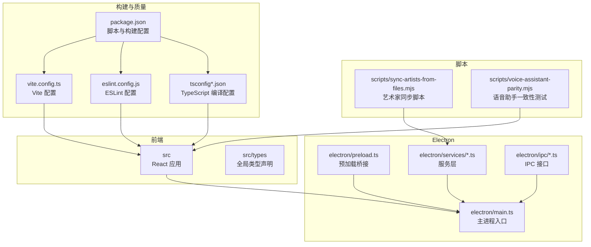
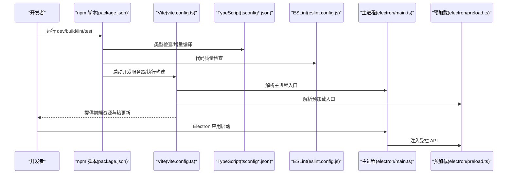
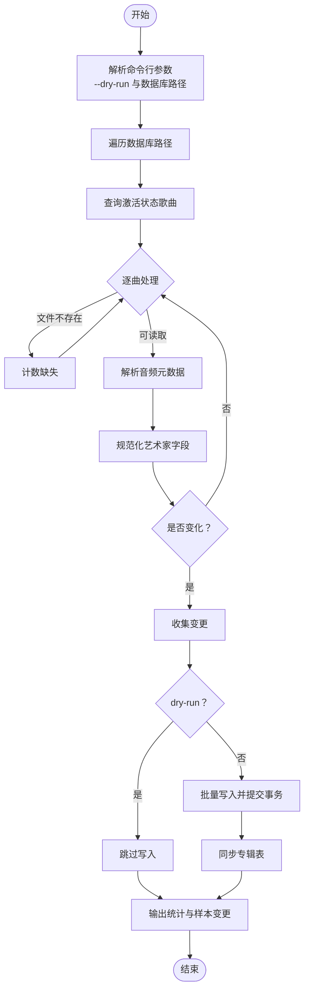
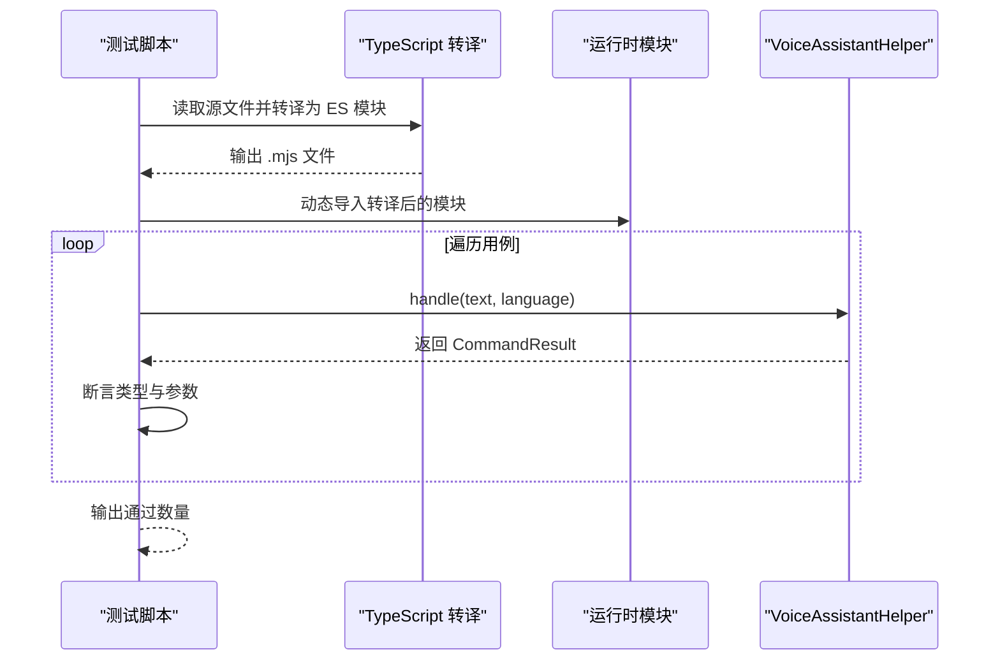
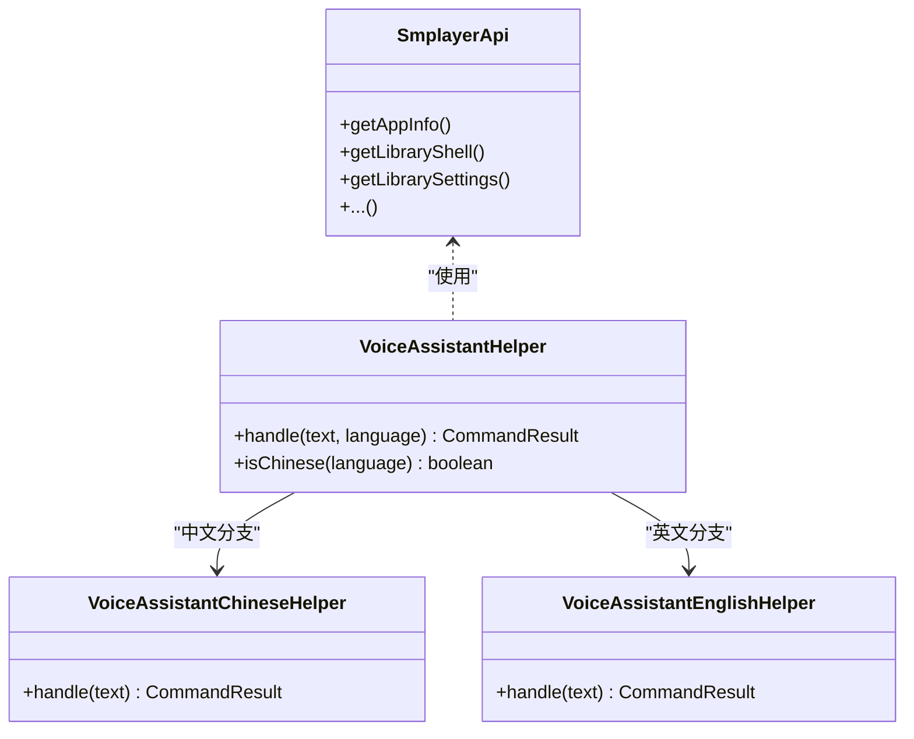
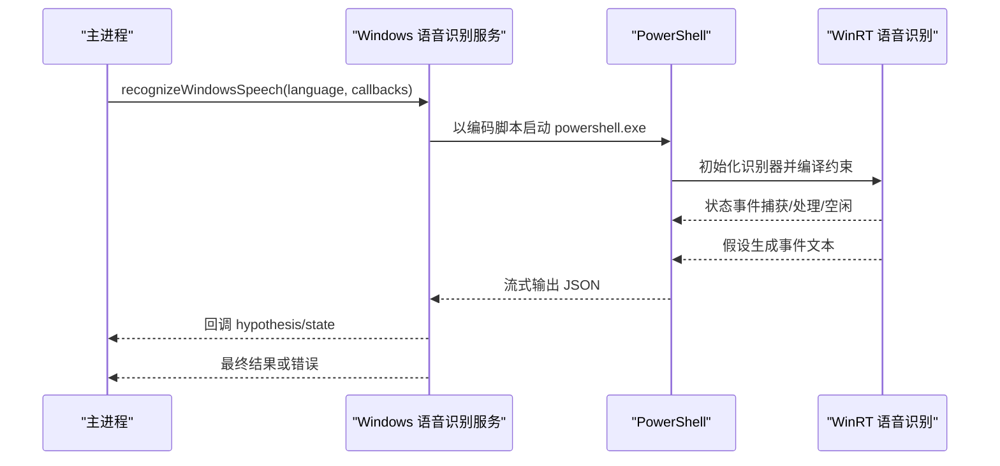
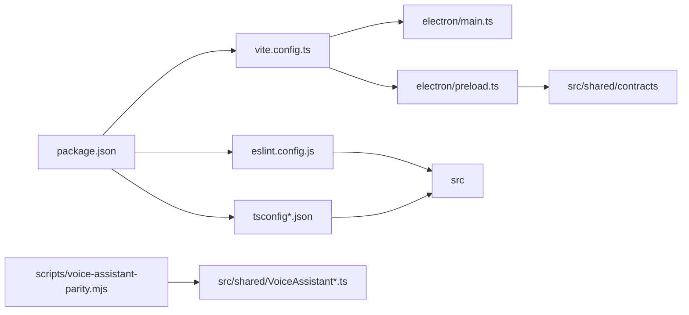

# 开发工具

<cite>
**本文引用的文件**
- [eslint.config.js](file://eslint.config.js)
- [vite.config.ts](file://vite.config.ts)
- [package.json](file://package.json)
- [tsconfig.json](file://tsconfig.json)
- [tsconfig.app.json](file://tsconfig.app.json)
- [tsconfig.node.json](file://tsconfig.node.json)
- [scripts/sync-artists-from-files.mjs](file://scripts/sync-artists-from-files.mjs)
- [scripts/voice-assistant-parity.mjs](file://scripts/voice-assistant-parity.mjs)
- [electron/main.ts](file://electron/main.ts)
- [electron/preload.ts](file://electron/preload.ts)
- [electron/services/windows-speech-recognition.ts](file://electron/services/windows-speech-recognition.ts)
- [src/shared/VoiceAssistantHelper.ts](file://src/shared/VoiceAssistantHelper.ts)
- [src/shared/VoiceAssistantChineseHelper.ts](file://src/shared/VoiceAssistantChineseHelper.ts)
- [src/shared/VoiceAssistantEnglishHelper.ts](file://src/shared/VoiceAssistantEnglishHelper.ts)
- [src/types/global.d.ts](file://src/types/global.d.ts)
</cite>

## 目录
1. [简介](#简介)
2. [项目结构](#项目结构)
3. [核心组件](#核心-components)
4. [架构总览](#架构总览)
5. [详细组件分析](#详细组件分析)
6. [依赖关系分析](#依赖关系分析)
7. [性能考量](#性能考量)
8. [故障排除指南](#故障排除指南)
9. [结论](#结论)
10. [附录](#附录)

## 简介
本指南面向 SMPlayer 的开发者与维护者，系统性介绍项目中的开发工具链与辅助脚本，涵盖以下主题：
- ESLint 配置与 TypeScript 编译配置（tsconfig）的设置与使用
- Vite 构建配置与 Electron 集成参数
- 代码质量检查与自动化测试流程
- 开发环境调试工具与技巧（Electron 调试、React 开发工具、性能分析）
- 构建与打包配置（多平台、图标、安装包定制）
- 开发工作流最佳实践（代码规范、提交规范、版本管理）
- 常见问题与故障排除

## 项目结构
该项目采用前端与 Electron 主进程分离的组织方式：React 前端位于 src 目录，Electron 主进程与预加载脚本位于 electron 目录；辅助脚本位于 scripts 目录；构建与质量工具通过根目录配置文件统一管理。

图表来源
- [vite.config.ts:1-36](file://vite.config.ts#L1-L36)
- [package.json:1-175](file://package.json#L1-L175)
- [electron/main.ts:1-243](file://electron/main.ts#L1-L243)
- [electron/preload.ts:1-287](file://electron/preload.ts#L1-L287)
- [scripts/sync-artists-from-files.mjs:1-319](file://scripts/sync-artists-from-files.mjs#L1-L319)
- [scripts/voice-assistant-parity.mjs:1-96](file://scripts/voice-assistant-parity.mjs#L1-L96)

章节来源
- [vite.config.ts:1-36](file://vite.config.ts#L1-L36)
- [package.json:1-175](file://package.json#L1-L175)

## 核心组件
- ESLint 配置：基于 flat 配置，启用推荐规则与 React Hooks、React Refresh 规则，并针对 TSX 文件生效。
- TypeScript 编译配置：采用多引用配置，分别约束应用层与 Node/Electron 层的编译行为与严格性。
- Vite 配置：集成 React 插件与 Electron 插件，配置主进程与预加载入口、Rollup 外部化依赖、路径别名与构建目标。
- 辅助脚本：艺术家元数据同步脚本与语音助手一致性测试脚本，用于数据修复与功能回归验证。
- Electron 架构：主进程负责窗口、协议注册、IPC 注册与服务初始化；预加载脚本通过 contextBridge 暴露受控 API 至渲染进程。

章节来源
- [eslint.config.js:1-28](file://eslint.config.js#L1-L28)
- [tsconfig.json:1-8](file://tsconfig.json#L1-L8)
- [tsconfig.app.json:1-29](file://tsconfig.app.json#L1-L29)
- [tsconfig.node.json:1-27](file://tsconfig.node.json#L1-L27)
- [vite.config.ts:1-36](file://vite.config.ts#L1-L36)
- [scripts/sync-artists-from-files.mjs:1-319](file://scripts/sync-artists-from-files.mjs#L1-L319)
- [scripts/voice-assistant-parity.mjs:1-96](file://scripts/voice-assistant-parity.mjs#L1-L96)
- [electron/main.ts:1-243](file://electron/main.ts#L1-L243)
- [electron/preload.ts:1-287](file://electron/preload.ts#L1-L287)

## 架构总览
下图展示从开发命令到最终产物的关键流程，以及主要配置文件之间的关系。

图表来源
- [package.json:8-22](file://package.json#L8-L22)
- [vite.config.ts:7-35](file://vite.config.ts#L7-L35)
- [tsconfig.app.json:1-29](file://tsconfig.app.json#L1-L29)
- [eslint.config.js:8-27](file://eslint.config.js#L8-L27)
- [electron/main.ts:141-209](file://electron/main.ts#L141-L209)
- [electron/preload.ts:45-286](file://electron/preload.ts#L45-L286)

## 详细组件分析

### ESLint 配置分析
- 配置类型：flat 配置，集中管理规则与扩展。
- 扩展来源：继承 JS 推荐规则、TypeScript ESLint 推荐规则、React Hooks 推荐规则、React Refresh Vite 支持。
- 语言选项：ECMAScript 2020，浏览器全局变量。
- 关键规则：关闭 React Hooks 的 exhaustive-deps 与 setState-in-effect，以降低开发期负担。
- 生效范围：仅对 TS/TSX 文件生效。

章节来源
- [eslint.config.js:8-27](file://eslint.config.js#L8-L27)

### TypeScript 编译配置分析
- 顶层引用：通过 references 将应用层与 Node/Electron 层配置分离开，提升编译效率与隔离性。
- 应用层（tsconfig.app.json）：
  - 目标与模块：ES2023、ESNext，bundler 模式，禁止输出 JS。
  - 严格性：开启严格模式与未使用检测，保证高质量。
  - JSX：使用 react-jsx。
- Node/Electron 层（tsconfig.node.json）：
  - 目标与模块：ES2023、ESNext，bundler 模式，禁止输出 JS。
  - 类型：内置 Node 与 Electron 类型。
  - 严格性：与应用层一致。

章节来源
- [tsconfig.json:1-8](file://tsconfig.json#L1-L8)
- [tsconfig.app.json:1-29](file://tsconfig.app.json#L1-L29)
- [tsconfig.node.json:1-27](file://tsconfig.node.json#L1-L27)

### Vite 构建配置分析
- 插件：
  - @vitejs/plugin-react：React HMR 与优化。
  - vite-plugin-electron/simple：简化 Electron 开发体验，自动处理主进程与预加载。
- 主进程配置：
  - 入口：electron/main.ts。
  - Rollup 外部化：将 music-metadata 与 node:sqlite 标记为外部依赖，避免打包进主进程。
- 预加载配置：
  - 输入：electron/preload.ts。
- 路径别名：
  - @ -> src 目录，便于导入。
- 构建目标：
  - esnext，面向现代浏览器与 Node 环境。
- 其他：
  - clearScreen: false，保留控制台输出。

章节来源
- [vite.config.ts:7-35](file://vite.config.ts#L7-L35)

### 代码质量检查与自动化测试
- 类型检查：通过 npm 脚本调用 tsc -b，实现增量编译与类型检查。
- ESLint：通过 npm 脚本调用 eslint .，对整个仓库进行静态检查。
- 语音助手一致性测试：通过 npm 脚本运行 scripts/voice-assistant-parity.mjs，对中英文语音指令解析进行断言校验。

章节来源
- [package.json:11-15](file://package.json#L11-L15)
- [scripts/voice-assistant-parity.mjs:1-96](file://scripts/voice-assistant-parity.mjs#L1-L96)

### 艺术家同步脚本
用途：从本地 SQLite 数据库读取歌曲元数据，使用 music-metadata 解析音频标签，修正艺术家字段并同步专辑信息，支持干跑（dry-run）与多数据库路径。

图表来源
- [scripts/sync-artists-from-files.mjs:29-103](file://scripts/sync-artists-from-files.mjs#L29-L103)
- [scripts/sync-artists-from-files.mjs:105-133](file://scripts/sync-artists-from-files.mjs#L105-L133)
- [scripts/sync-artists-from-files.mjs:135-214](file://scripts/sync-artists-from-files.mjs#L135-L214)

章节来源
- [scripts/sync-artists-from-files.mjs:1-319](file://scripts/sync-artists-from-files.mjs#L1-L319)

### 语音助手测试脚本
用途：将共享语音助手模块转译为 ES 模块格式，动态导入并在多种语言与语句组合下断言匹配类型与参数，确保中英文指令解析一致性。

图表来源
- [scripts/voice-assistant-parity.mjs:19-34](file://scripts/voice-assistant-parity.mjs#L19-L34)
- [scripts/voice-assistant-parity.mjs:36-95](file://scripts/voice-assistant-parity.mjs#L36-L95)
- [src/shared/VoiceAssistantHelper.ts:65-78](file://src/shared/VoiceAssistantHelper.ts#L65-L78)

章节来源
- [scripts/voice-assistant-parity.mjs:1-96](file://scripts/voice-assistant-parity.mjs#L1-L96)
- [src/shared/VoiceAssistantHelper.ts:1-93](file://src/shared/VoiceAssistantHelper.ts#L1-L93)
- [src/shared/VoiceAssistantChineseHelper.ts:1-185](file://src/shared/VoiceAssistantChineseHelper.ts#L1-L185)
- [src/shared/VoiceAssistantEnglishHelper.ts:1-175](file://src/shared/VoiceAssistantEnglishHelper.ts#L1-L175)

### Electron 预加载与 API 暴露
- 预加载脚本通过 contextBridge 将受控 API 暴露给渲染进程，覆盖库操作、播放队列、窗口控制、语音识别、远程分享、偏好设置等能力。
- 渲染进程通过全局 window.smplayer 访问 API，类型由 src/types/global.d.ts 定义。

图表来源
- [electron/preload.ts:45-286](file://electron/preload.ts#L45-L286)
- [src/shared/VoiceAssistantHelper.ts:65-78](file://src/shared/VoiceAssistantHelper.ts#L65-L78)
- [src/shared/VoiceAssistantChineseHelper.ts:10-61](file://src/shared/VoiceAssistantChineseHelper.ts#L10-L61)
- [src/shared/VoiceAssistantEnglishHelper.ts:10-65](file://src/shared/VoiceAssistantEnglishHelper.ts#L10-L65)

章节来源
- [electron/preload.ts:1-287](file://electron/preload.ts#L1-L287)
- [src/types/global.d.ts:1-10](file://src/types/global.d.ts#L1-L10)

### Windows 语音识别服务
- 使用 PowerShell 调用 Windows WinRT 语音识别 API，支持中英语言自动适配。
- 输出结构：假设识别到文本则返回文本，否则返回错误码（如无语音、隐私未授权、失败等）。
- 超时与取消：超时约 18 秒，支持主动取消。

图表来源
- [electron/services/windows-speech-recognition.ts:26-129](file://electron/services/windows-speech-recognition.ts#L26-L129)
- [electron/services/windows-speech-recognition.ts:135-239](file://electron/services/windows-speech-recognition.ts#L135-L239)

章节来源
- [electron/services/windows-speech-recognition.ts:1-240](file://electron/services/windows-speech-recognition.ts#L1-L240)

### 构建与打包配置（electron-builder）
- 应用标识与产品名称：appId、productName、copyright。
- asar 打包与解包：开启 asar 并指定 node 原生模块为 asarUnpack。
- 输出目录与资源：buildResources 指向 public，output 指向 release；files 包含 dist 与 dist-electron。
- 图标与文件关联：跨平台图标与文件扩展名关联配置。
- 多平台目标：
  - macOS：dmg、zip。
  - Windows：nsis（x64）、portable（x64），请求权限 asInvoker。
  - Linux：AppImage、deb。
- NSIS 安装器：允许更改安装目录、桌面/开始菜单快捷方式、卸载不删除用户数据。
- APPX（Windows Store）：应用 ID、发布者、显示名、语言、能力等。

章节来源
- [package.json:50-173](file://package.json#L50-L173)

## 依赖关系分析
- 组件耦合：
  - 主进程依赖服务层与 IPC 注册，服务层依赖外部库（如 music-metadata）。
  - 预加载脚本依赖 contracts 类型与 IPC 通道。
  - 语音助手模块被预加载与测试脚本共同使用。
- 外部依赖：
  - Vite 与 Electron 插件用于开发与打包。
  - ESLint 与 TypeScript ESLint 保障代码质量与类型安全。
  - electron-builder 实现多平台打包。

图表来源
- [vite.config.ts:7-35](file://vite.config.ts#L7-L35)
- [package.json:8-22](file://package.json#L8-L22)
- [electron/preload.ts:1-287](file://electron/preload.ts#L1-L287)
- [scripts/voice-assistant-parity.mjs:1-96](file://scripts/voice-assistant-parity.mjs#L1-L96)

章节来源
- [vite.config.ts:1-36](file://vite.config.ts#L1-L36)
- [package.json:1-175](file://package.json#L1-L175)

## 性能考量
- 构建目标：esnext，有利于现代浏览器与 Node 环境的特性利用，但需注意兼容性与打包体积。
- 外部化依赖：主进程将 heavy 依赖标记为外部，减少打包体积并避免不必要的重编译。
- 类型检查：分层 tsconfig 与 references，提升增量编译效率。
- 代码质量：严格的 ESLint 规则与 TypeScript 严格模式，有助于早期发现潜在性能与可维护性问题。

## 故障排除指南
- ESLint 报错
  - 症状：ESLint 在 flat 配置下报“找不到规则”或“无法解析扩展”。
  - 排查：确认已安装 @eslint/js、typescript-eslint、eslint-plugin-react-hooks、eslint-plugin-react-refresh，并在 defineConfig 中正确 extends。
  - 参考：[eslint.config.js:8-27](file://eslint.config.js#L8-L27)
- TypeScript 编译错误
  - 症状：类型检查失败或模块解析异常。
  - 排查：检查 tsconfig.app.json 与 tsconfig.node.json 的 include、moduleResolution、verbatimModuleSyntax 是否符合实际目录与模块格式。
  - 参考：[tsconfig.app.json:1-29](file://tsconfig.app.json#L1-L29)、[tsconfig.node.json:1-27](file://tsconfig.node.json#L1-L27)
- Vite 启动失败或热更新异常
  - 症状：dev 无法启动或 HMR 不生效。
  - 排查：确认 @vitejs/plugin-react 与 vite-plugin-electron/simple 已安装；检查 vite.config.ts 的插件顺序与入口配置；确认 clearScreen 设置不影响日志查看。
  - 参考：[vite.config.ts:7-35](file://vite.config.ts#L7-L35)
- electron-builder 打包失败
  - 症状：不同平台构建失败或图标/文件关联无效。
  - 排查：核对 build 字段中的 appId、productName、asar、asarUnpack、files、extraResources、fileAssociations、targets 与平台特定配置（mac/win/linux/appx/nsis）。
  - 参考：[package.json:50-173](file://package.json#L50-L173)
- 语音助手测试失败
  - 症状：断言失败或模块导入异常。
  - 排查：确认转译输出 .mjs 存在且路径替换正确；检查用例输入与期望值；确保动态导入路径与模块导出一致。
  - 参考：[scripts/voice-assistant-parity.mjs:19-34](file://scripts/voice-assistant-parity.mjs#L19-L34)、[src/shared/VoiceAssistantHelper.ts:65-78](file://src/shared/VoiceAssistantHelper.ts#L65-L78)
- Windows 语音识别异常
  - 症状：无语音、隐私未授权、失败或超时。
  - 排查：确认平台为 win32；检查 PowerShell 执行策略与编码脚本；关注回调中的错误码；必要时手动触发隐私设置。
  - 参考：[electron/services/windows-speech-recognition.ts:26-129](file://electron/services/windows-speech-recognition.ts#L26-L129)

## 结论
本指南梳理了 SMPlayer 的开发工具链与脚本，明确了 ESLint、TypeScript、Vite 与 electron-builder 的配置要点，并结合艺术家同步与语音助手测试脚本展示了实际使用场景。遵循本文档的配置与最佳实践，可显著提升开发效率、代码质量与构建稳定性。

## 附录
- 开发命令速查
  - 启动开发服务器：npm run dev
  - 启动 Electron 应用：npm run start
  - 类型检查：npm run typecheck
  - 构建：npm run build
  - 代码检查：npm run lint
  - 预览：npm run preview
  - 语音助手测试：npm run test:voice
  - 打包（通用）：npm run pack
  - 打包（各平台）：npm run dist、dist:win、dist:mac、dist:linux、dist:win:store
- 调试建议
  - Electron：使用主进程与渲染进程双端调试，结合预加载暴露的 API 进行断点验证。
  - React：启用 React DevTools，结合 Vite HMR 快速迭代。
  - 性能：利用浏览器性能面板与 Node 性能分析工具定位瓶颈。
- 版本与提交
  - 建议使用语义化版本与约定式提交，配合 CI 自动化执行 lint、typecheck 与测试。