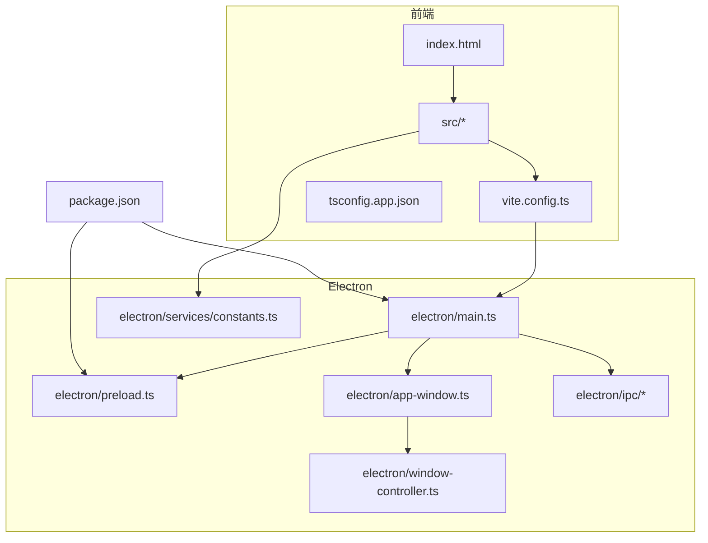
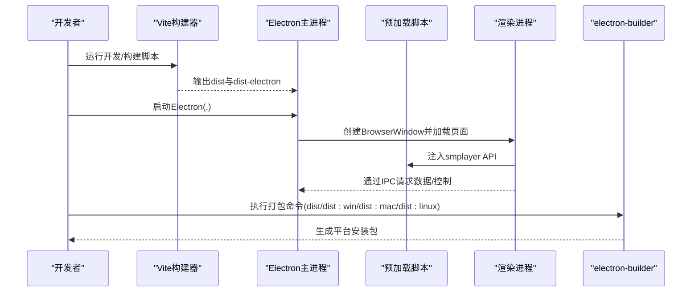
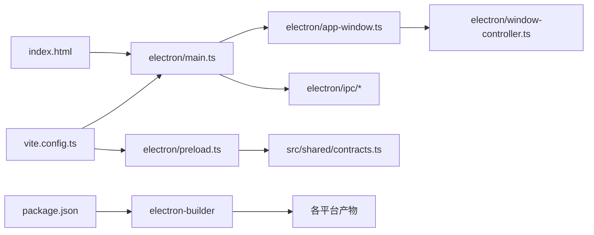

# 构建配置

<cite>
**本文引用的文件**
- [vite.config.ts](file://vite.config.ts)
- [package.json](file://package.json)
- [tsconfig.json](file://tsconfig.json)
- [tsconfig.app.json](file://tsconfig.app.json)
- [tsconfig.node.json](file://tsconfig.node.json)
- [index.html](file://index.html)
- [eslint.config.js](file://eslint.config.js)
- [electron/main.ts](file://electron/main.ts)
- [electron/preload.ts](file://electron/preload.ts)
- [electron/app-window.ts](file://electron/app-window.ts)
- [electron/window-controller.ts](file://electron/window-controller.ts)
- [electron/ipc/app-ipc.ts](file://electron/ipc/app-ipc.ts)
- [electron/services/constants.ts](file://electron/services/constants.ts)
- [src/shared/contracts.ts](file://src/shared/contracts.ts)
</cite>

## 目录
1. [简介](#简介)
2. [项目结构](#项目结构)
3. [核心组件](#核心组件)
4. [架构总览](#架构总览)
5. [详细组件分析](#详细组件分析)
6. [依赖关系分析](#依赖关系分析)
7. [性能考量](#性能考量)
8. [故障排查指南](#故障排查指南)
9. [结论](#结论)
10. [附录](#附录)

## 简介
本指南面向SMPlayer项目的构建与打包配置，围绕Vite构建配置、Electron主进程与渲染进程的打包策略、跨平台发布（Windows/macOS/Linux）以及开发/生产环境差异进行系统化说明。文档同时提供性能优化建议、常见问题与解决方案，并给出可扩展的自定义流程思路。

## 项目结构
SMPlayer采用React + TypeScript + Vite作为前端构建工具，结合Electron实现桌面应用；使用electron-builder进行跨平台打包与分发。关键目录与文件如下：
- 构建与类型配置：vite.config.ts、tsconfig*.json、eslint.config.js
- 应用入口与页面：index.html、src/main.tsx、src/App.tsx
- Electron主进程与预加载：electron/main.ts、electron/preload.ts、electron/app-window.ts、electron/window-controller.ts
- IPC与共享契约：electron/ipc/*.ts、src/shared/contracts.ts
- 发布配置：package.json 中的 scripts 与 build 字段

图表来源
- [vite.config.ts:1-36](file://vite.config.ts#L1-L36)
- [package.json:1-175](file://package.json#L1-L175)
- [index.html:1-26](file://index.html#L1-L26)
- [electron/main.ts:1-243](file://electron/main.ts#L1-L243)
- [electron/preload.ts:1-287](file://electron/preload.ts#L1-L287)
- [electron/app-window.ts:1-173](file://electron/app-window.ts#L1-L173)
- [electron/window-controller.ts:1-122](file://electron/window-controller.ts#L1-L122)
- [electron/ipc/app-ipc.ts:1-26](file://electron/ipc/app-ipc.ts#L1-L26)
- [electron/services/constants.ts:1-28](file://electron/services/constants.ts#L1-L28)
- [src/shared/contracts.ts:1-664](file://src/shared/contracts.ts#L1-L664)

章节来源
- [vite.config.ts:1-36](file://vite.config.ts#L1-L36)
- [package.json:1-175](file://package.json#L1-L175)
- [index.html:1-26](file://index.html#L1-L26)
- [electron/main.ts:1-243](file://electron/main.ts#L1-L243)
- [electron/preload.ts:1-287](file://electron/preload.ts#L1-L287)
- [electron/app-window.ts:1-173](file://electron/app-window.ts#L1-L173)
- [electron/window-controller.ts:1-122](file://electron/window-controller.ts#L1-L122)
- [electron/ipc/app-ipc.ts:1-26](file://electron/ipc/app-ipc.ts#L1-L26)
- [electron/services/constants.ts:1-28](file://electron/services/constants.ts#L1-L28)
- [src/shared/contracts.ts:1-664](file://src/shared/contracts.ts#L1-L664)

## 核心组件
- Vite构建配置：定义插件、路径别名、构建目标与清屏行为，集成vite-plugin-electron简化主进程与预加载打包。
- TypeScript配置：拆分应用与Node/Electron两类编译上下文，确保严格类型检查与Bundler模式。
- Electron主进程：负责窗口创建、服务初始化、IPC注册、系统协议与托盘交互。
- 预加载脚本：通过contextBridge暴露受控API给渲染进程，承载大量业务接口调用。
- 发布配置：electron-builder在package.json中集中声明，支持多平台产物与安装器目标。

章节来源
- [vite.config.ts:1-36](file://vite.config.ts#L1-L36)
- [tsconfig.app.json:1-29](file://tsconfig.app.json#L1-L29)
- [tsconfig.node.json:1-27](file://tsconfig.node.json#L1-L27)
- [package.json:50-173](file://package.json#L50-L173)
- [electron/main.ts:1-243](file://electron/main.ts#L1-L243)
- [electron/preload.ts:1-287](file://electron/preload.ts#L1-L287)

## 架构总览
下图展示从开发到打包的关键流程：Vite启动开发服务器或执行构建，Electron主进程加载渲染页面并注入预加载脚本，IPC桥接前后端能力，最终由electron-builder产出各平台安装包。

图表来源
- [vite.config.ts:7-35](file://vite.config.ts#L7-L35)
- [package.json:8-22](file://package.json#L8-L22)
- [package.json:50-173](file://package.json#L50-L173)
- [electron/main.ts:141-219](file://electron/main.ts#L141-L219)
- [electron/preload.ts:45-286](file://electron/preload.ts#L45-L286)

## 详细组件分析

### Vite构建配置（vite.config.ts）
- 插件体系
  - @vitejs/plugin-react：启用React JSX转换与开发期HMR。
  - vite-plugin-electron/simple：自动识别并打包主进程与预加载脚本，主进程使用Rollup外部化策略避免打包大型原生模块。
- 路径别名
  - 将@解析为src目录，便于导入组件与资源。
- 构建目标
  - target设为esnext，配合现代浏览器特性与更优Tree-shaking效果。
- 清屏行为
  - 关闭clearScreen以保留终端输出信息，提升调试效率。

章节来源
- [vite.config.ts:7-35](file://vite.config.ts#L7-L35)

### TypeScript编译配置（tsconfig*.json）
- tsconfig.json：聚合应用与Node编译上下文。
- tsconfig.app.json：应用侧编译目标ES2023、模块解析bundler、JSX React、严格模式与无emit。
- tsconfig.node.json：Node/Electron侧编译目标ES2023、包含vite.config.ts与electron/**/*.ts、严格模式与无emit。

章节来源
- [tsconfig.json:1-8](file://tsconfig.json#L1-L8)
- [tsconfig.app.json:1-29](file://tsconfig.app.json#L1-L29)
- [tsconfig.node.json:1-27](file://tsconfig.node.json#L1-L27)

### ESLint配置（eslint.config.js）
- 使用flat config风格，启用TypeScript、React Hooks、React Refresh推荐规则，并关闭部分对开发体验影响较大的规则项。
- 全局忽略dist目录，避免扫描产物。

章节来源
- [eslint.config.js:1-28](file://eslint.config.js#L1-L28)

### Electron主进程（electron/main.ts）
- 单实例锁、媒体协议注册、用户数据路径解析、远程分享服务、托盘控制器与窗口控制器初始化。
- 注册各类IPC处理器，连接渲染层API与后端服务。
- 处理窗口生命周期事件（关闭、最小化、全屏、迷你模式切换）与系统激活事件。

章节来源
- [electron/main.ts:1-243](file://electron/main.ts#L1-L243)

### 预加载脚本（electron/preload.ts）
- 通过contextBridge.exposeInMainWorld暴露SmplayerApi，封装大量invoke/send/on回调，统一渲染层访问入口。
- 支持夜间模式启动时的样式注入与事件监听。
- 提供窗口控制、播放队列、歌词、搜索、偏好设置、远程主机、语音识别等丰富接口。

章节来源
- [electron/preload.ts:1-287](file://electron/preload.ts#L1-L287)
- [src/shared/contracts.ts:527-663](file://src/shared/contracts.ts#L527-L663)

### 窗口与UI（electron/app-window.ts、electron/window-controller.ts）
- app-window.ts：创建BrowserWindow、设置标题栏、背景色、透明/材质效果、权限策略、开发/生产加载URL、通知提示。
- window-controller.ts：实现拖拽、全屏/迷你模式切换、边界约束与置顶逻辑，向渲染进程广播状态变更。

章节来源
- [electron/app-window.ts:1-173](file://electron/app-window.ts#L1-L173)
- [electron/window-controller.ts:1-122](file://electron/window-controller.ts#L1-L122)

### IPC桥接（electron/ipc/app-ipc.ts）
- 主进程注册应用级IPC处理函数，如获取应用信息、处理托盘播放状态、接收待打开文件列表等。

章节来源
- [electron/ipc/app-ipc.ts:1-26](file://electron/ipc/app-ipc.ts#L1-L26)

### 页面入口（index.html）
- 设置基础meta、图标、标题与启动夜间模式样式注入，通过module脚本加载/src/main.tsx。

章节来源
- [index.html:1-26](file://index.html#L1-L26)

### 构建脚本与发布配置（package.json）
- 开发与构建脚本：dev、start、build、preview、lint、typecheck；打包与分发：pack、dist、dist:win、dist:win:store、dist:mac、dist:linux。
- electron-builder配置：
  - 基础属性：appId、productName、copyright、asar、asarUnpack、npmRebuild。
  - 目录与文件：buildResources指向public，output至release；files包含dist与dist-electron及package.json。
  - 资源与关联：extraResources拷贝图标；fileAssociations定义音频扩展名与图标。
  - 平台目标：mac dmg/zip、win nsis/portable、linux AppImage/deb；NSIS定制安装选项；AppImage与deb元信息。
  - 图标与分类：mac/win/linux icon；win执行级别；appx商店相关字段。

章节来源
- [package.json:8-22](file://package.json#L8-L22)
- [package.json:50-173](file://package.json#L50-L173)

## 依赖关系分析
- 构建链路
  - Vite读取vite.config.ts与tsconfig*.json，按esnext目标构建前端代码与Electron主进程/预加载。
  - electron-builder依据package.json build字段生成多平台安装包。
- 模块耦合
  - electron/main.ts依赖app-window.ts、window-controller.ts、各IPC模块与服务类。
  - electron/preload.ts依赖src/shared/contracts.ts定义的API契约。
  - index.html仅负责渲染入口加载，不直接参与业务逻辑。

图表来源
- [vite.config.ts:7-35](file://vite.config.ts#L7-L35)
- [electron/main.ts:1-243](file://electron/main.ts#L1-L243)
- [electron/preload.ts:1-287](file://electron/preload.ts#L1-L287)
- [electron/app-window.ts:1-173](file://electron/app-window.ts#L1-L173)
- [electron/window-controller.ts:1-122](file://electron/window-controller.ts#L1-L122)
- [electron/ipc/app-ipc.ts:1-26](file://electron/ipc/app-ipc.ts#L1-L26)
- [src/shared/contracts.ts:1-664](file://src/shared/contracts.ts#L1-L664)
- [index.html:1-26](file://index.html#L1-L26)
- [package.json:50-173](file://package.json#L50-L173)

## 性能考量
- 构建目标与模块解析
  - esnext目标与bundler moduleResolution有助于Tree-shaking与更小包体。
- 外部化策略
  - 主进程Rollup external排除大型原生模块，避免Vite打包导致体积膨胀与构建失败。
- 清屏与日志
  - 关闭clearScreen便于查看构建日志，定位问题更快。
- 类型检查与Lint
  - tsconfig*.json开启严格模式，eslint.config.js减少过度限制，平衡质量与效率。
- 资源与图标
  - 将大体积原生二进制置于asarUnpack，避免electron-builder重建导致的体积与启动时间增加。
- 安装器优化
  - NSIS允许选择安装目录、桌面/开始菜单快捷方式，降低用户迁移成本；AppImage与deb提供原生体验。

章节来源
- [vite.config.ts:14-18](file://vite.config.ts#L14-L18)
- [vite.config.ts:32](file://vite.config.ts#L32)
- [vite.config.ts:34](file://vite.config.ts#L34)
- [tsconfig.app.json:12-16](file://tsconfig.app.json#L12-L16)
- [tsconfig.node.json:10-15](file://tsconfig.node.json#L10-L15)
- [eslint.config.js:22-26](file://eslint.config.js#L22-L26)
- [package.json:54-58](file://package.json#L54-L58)
- [package.json:150-157](file://package.json#L150-L157)
- [package.json:158-171](file://package.json#L158-L171)

## 故障排查指南
- 构建失败或体积异常
  - 检查主进程external配置是否覆盖了需要原生加载的模块；确认asarUnpack包含必要的.node文件。
- 预加载API不可用
  - 确认preload.mjs路径与contextBridge暴露的API一致；核对index.html中preload注入与additionalArguments传递。
- 窗口加载空白或白屏
  - 检查app-window.ts中开发/生产URL拼接与startupNightMode参数；确认dist/index.html存在且路径正确。
- 打包产物缺失
  - 确认package.json files包含dist与dist-electron；检查extraResources与icon路径。
- 平台安装器问题
  - Windows：确认NSIS选项与管理员权限；macOS：校验签名与权限；Linux：验证deb/AppImage元信息。
- 语音识别或权限相关
  - 检查window.webContents.session权限策略与平台权限请求处理。

章节来源
- [vite.config.ts:14-24](file://vite.config.ts#L14-L24)
- [electron/app-window.ts:125-135](file://electron/app-window.ts#L125-L135)
- [electron/preload.ts:68-72](file://electron/preload.ts#L68-L72)
- [package.json:64-68](file://package.json#L64-L68)
- [package.json:69-78](file://package.json#L69-L78)
- [package.json:100-125](file://package.json#L100-L125)
- [package.json:126-149](file://package.json#L126-L149)
- [package.json:158-171](file://package.json#L158-L171)

## 结论
SMPlayer的构建配置以Vite为核心，结合Electron与electron-builder实现现代化的跨平台桌面应用开发与发布。通过合理的插件配置、路径别名、外部化策略与严格的类型检查，既保证了开发效率也兼顾了产物体积与性能。建议在团队内统一构建脚本与发布流程，持续关注第三方依赖的原生模块与权限策略，以获得稳定可靠的交付体验。

## 附录

### 开发与生产环境差异
- 开发环境
  - Vite dev server提供热更新与源码映射；index.html附加startupNightMode查询参数；主进程注入额外参数用于预加载样式。
- 生产环境
  - Vite构建输出至dist；electron-builder打包为平台安装包；asar启用并指定asarUnpack；icon与文件关联配置生效。

章节来源
- [index.html:8-19](file://index.html#L8-L19)
- [electron/app-window.ts:125-135](file://electron/app-window.ts#L125-L135)
- [package.json:54-58](file://package.json#L54-L58)
- [package.json:100-171](file://package.json#L100-L171)

### 多平台构建要点
- Windows
  - NSIS安装器与便携版；执行级别asInvoker；图标与文件关联；AppX商店配置。
- macOS
  - dmg/zip目标；图标与分类；权限与签名准备。
- Linux
  - AppImage与deb目标；桌面条目与分类；图标与权限。

章节来源
- [package.json:100-125](file://package.json#L100-L125)
- [package.json:126-149](file://package.json#L126-L149)
- [package.json:158-171](file://package.json#L158-L171)

### 自定义构建流程建议
- 分离开发与CI构建：本地dev使用Vite HMR，CI使用build+electron-builder生成稳定产物。
- 条件打包：根据环境变量选择asar与asarUnpack策略；按平台启用不同NSIS/DEB/AppImage配置。
- 资源优化：将原生二进制与动态库放入asarUnpack；压缩静态资源；按需拆分chunk。
- 安全加固：启用权限策略与contextIsolation；限制webPreferences；校验文件关联与图标路径。

章节来源
- [vite.config.ts:31-35](file://vite.config.ts#L31-L35)
- [package.json:54-58](file://package.json#L54-L58)
- [package.json:69-78](file://package.json#L69-L78)
- [package.json:150-157](file://package.json#L150-L157)
- [package.json:158-171](file://package.json#L158-L171)