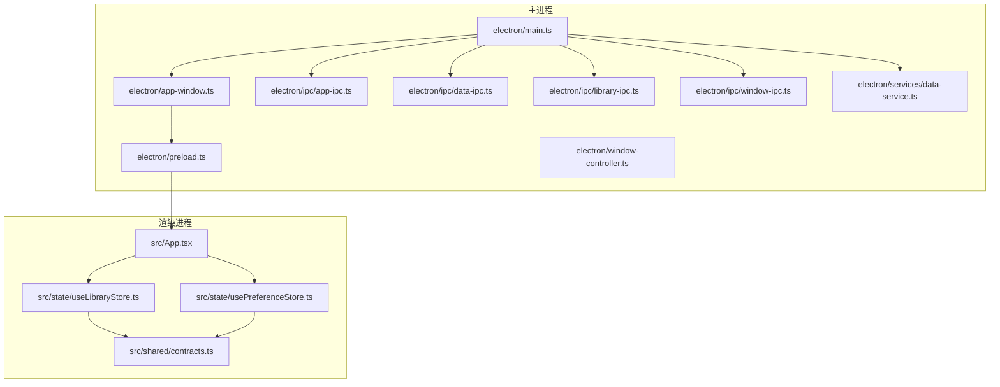
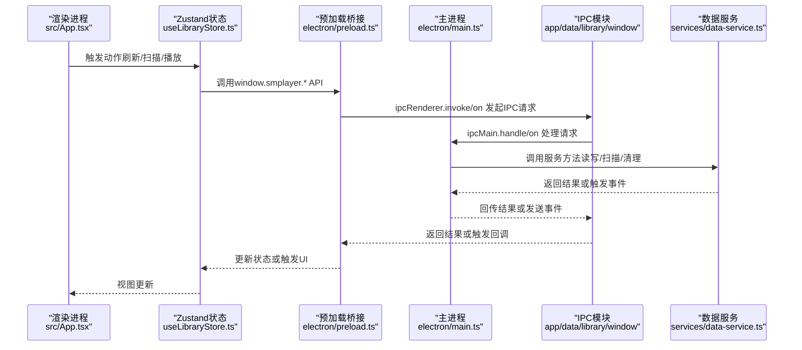
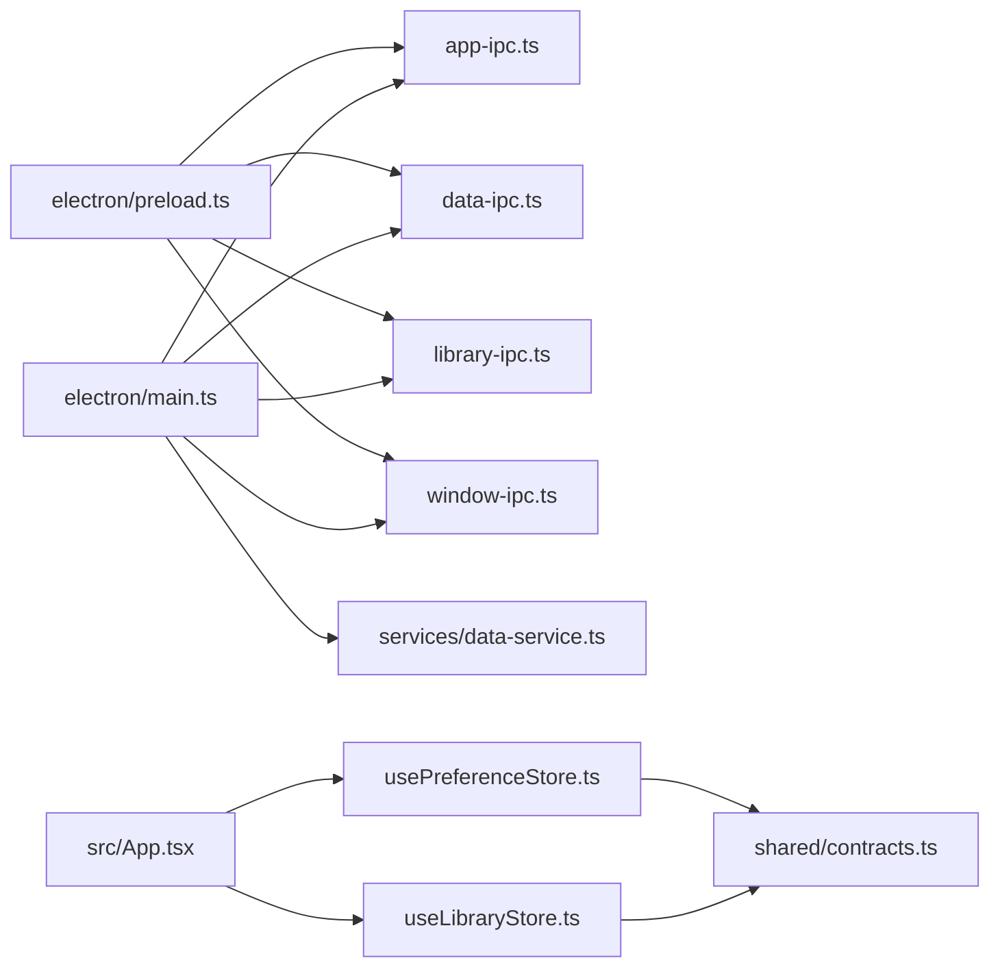

# 调试工具

<cite>
**本文引用的文件**
- [electron/main.ts](file://electron/main.ts)
- [electron/preload.ts](file://electron/preload.ts)
- [electron/app-window.ts](file://electron/app-window.ts)
- [electron/ipc/app-ipc.ts](file://electron/ipc/app-ipc.ts)
- [electron/ipc/data-ipc.ts](file://electron/ipc/data-ipc.ts)
- [electron/ipc/library-ipc.ts](file://electron/ipc/library-ipc.ts)
- [electron/ipc/window-ipc.ts](file://electron/ipc/window-ipc.ts)
- [electron/services/data-service.ts](file://electron/services/data-service.ts)
- [electron/window-controller.ts](file://electron/window-controller.ts)
- [src/state/useLibraryStore.ts](file://src/state/useLibraryStore.ts)
- [src/state/usePreferenceStore.ts](file://src/state/usePreferenceStore.ts)
- [src/shared/contracts.ts](file://src/shared/contracts.ts)
- [src/App.tsx](file://src/App.tsx)
- [vite.config.ts](file://vite.config.ts)
- [package.json](file://package.json)
- [electron/env.d.ts](file://electron/env.d.ts)
</cite>

## 目录
1. [简介](#简介)
2. [项目结构](#项目结构)
3. [核心组件](#核心组件)
4. [架构总览](#架构总览)
5. [详细组件分析](#详细组件分析)
6. [依赖关系分析](#依赖关系分析)
7. [性能与内存](#性能与内存)
8. [故障排除指南](#故障排除指南)
9. [结论](#结论)
10. [附录](#附录)

## 简介
本指南面向SMPlayer项目的开发者与高级用户，系统性讲解如何在Electron应用中进行调试，覆盖主进程、渲染进程、IPC通信、异步流程、状态管理、日志与错误追踪、性能与内存分析，以及在开发/测试/生产环境中的调试配置与最佳实践。文档以仓库现有代码为依据，结合实际可执行的调试步骤与可视化图示，帮助快速定位与解决问题。

## 项目结构
SMPlayer采用典型的Electron + React + Zustand架构：
- 主进程负责窗口生命周期、系统托盘、媒体协议注册、远程服务、数据服务初始化与IPC注册。
- 渲染进程承载UI与业务逻辑，通过Zustand状态库管理音乐库、偏好设置等状态，并通过preload桥接调用主进程能力。
- preload层通过contextBridge暴露受控API给渲染进程，避免直接暴露Node/Electron能力。
- Vite作为构建与开发服务器，配合Electron插件实现主进程与预加载脚本的打包。

**图表来源**
- [electron/main.ts:141-209](file://electron/main.ts#L141-L209)
- [electron/app-window.ts:41-138](file://electron/app-window.ts#L41-L138)
- [electron/preload.ts:45-286](file://electron/preload.ts#L45-L286)
- [electron/ipc/app-ipc.ts:10-16](file://electron/ipc/app-ipc.ts#L10-L16)
- [electron/ipc/data-ipc.ts:20-151](file://electron/ipc/data-ipc.ts#L20-L151)
- [electron/ipc/library-ipc.ts:28-302](file://electron/ipc/library-ipc.ts#L28-L302)
- [electron/ipc/window-ipc.ts:16-58](file://electron/ipc/window-ipc.ts#L16-L58)
- [electron/services/data-service.ts:39-145](file://electron/services/data-service.ts#L39-L145)
- [electron/window-controller.ts:6-52](file://electron/window-controller.ts#L6-L52)
- [src/App.tsx:71-200](file://src/App.tsx#L71-L200)
- [src/state/useLibraryStore.ts:111-200](file://src/state/useLibraryStore.ts#L111-L200)
- [src/state/usePreferenceStore.ts:51-160](file://src/state/usePreferenceStore.ts#L51-L160)
- [src/shared/contracts.ts:1-200](file://src/shared/contracts.ts#L1-200)

**章节来源**
- [vite.config.ts:7-35](file://vite.config.ts#L7-L35)
- [package.json:8-22](file://package.json#L8-L22)

## 核心组件
- 主进程入口与生命周期：负责窗口创建、服务初始化、IPC注册、系统事件处理（单实例、打开文件、退出前清理）。
- 预加载桥接：通过contextBridge暴露受控API，统一命名空间，便于调试时识别调用来源。
- 窗口与UI：窗口行为控制、标题栏覆盖、权限策略、开发/生产加载路径。
- IPC模块：按功能拆分，分别处理应用信息、数据与播放、库管理、窗口控制等。
- 数据服务：数据库连接、服务聚合、扫描与清理逻辑。
- 渲染状态：Zustand库封装，集中管理音乐库快照、加载状态、错误与进度。

**章节来源**
- [electron/main.ts:141-243](file://electron/main.ts#L141-L243)
- [electron/preload.ts:45-286](file://electron/preload.ts#L45-L286)
- [electron/app-window.ts:41-138](file://electron/app-window.ts#L41-L138)
- [electron/ipc/app-ipc.ts:10-26](file://electron/ipc/app-ipc.ts#L10-L26)
- [electron/ipc/data-ipc.ts:20-151](file://electron/ipc/data-ipc.ts#L20-L151)
- [electron/ipc/library-ipc.ts:28-302](file://electron/ipc/library-ipc.ts#L28-L302)
- [electron/ipc/window-ipc.ts:16-58](file://electron/ipc/window-ipc.ts#L16-L58)
- [electron/services/data-service.ts:39-198](file://electron/services/data-service.ts#L39-L198)
- [src/state/useLibraryStore.ts:111-200](file://src/state/useLibraryStore.ts#L111-L200)
- [src/state/usePreferenceStore.ts:51-160](file://src/state/usePreferenceStore.ts#L51-L160)

## 架构总览
下图展示从渲染进程到主进程的关键调用链路，以及IPC事件的双向流动。

**图表来源**
- [src/App.tsx:134-167](file://src/App.tsx#L134-L167)
- [src/state/useLibraryStore.ts:124-144](file://src/state/useLibraryStore.ts#L124-L144)
- [electron/preload.ts:127-137](file://electron/preload.ts#L127-L137)
- [electron/ipc/app-ipc.ts:10-16](file://electron/ipc/app-ipc.ts#L10-L16)
- [electron/ipc/data-ipc.ts:20-151](file://electron/ipc/data-ipc.ts#L20-L151)
- [electron/ipc/library-ipc.ts:28-302](file://electron/ipc/library-ipc.ts#L28-L302)
- [electron/ipc/window-ipc.ts:16-58](file://electron/ipc/window-ipc.ts#L16-L58)
- [electron/services/data-service.ts:39-145](file://electron/services/data-service.ts#L39-L145)

## 详细组件分析

### 主进程调试要点
- 启动与窗口创建
  - 使用Vite开发服务器时，窗口加载地址会附加启动参数；生产模式加载打包后的index.html。
  - 窗口关闭策略：根据设置决定是否退出或隐藏至托盘。
- 生命周期事件
  - 单实例锁、打开文件、激活事件、退出前清理（提交待删除、停止远程服务、刷新数据库）。
- 托盘与全局快捷键
  - 创建托盘菜单、注册全局媒体快捷键，响应托盘命令。
- 建议调试方式
  - 在主进程入口添加日志，确认服务初始化顺序与异常分支。
  - 使用“before-quit”事件验证资源释放与数据库落盘。

**章节来源**
- [electron/app-window.ts:125-135](file://electron/app-window.ts#L125-L135)
- [electron/main.ts:141-243](file://electron/main.ts#L141-L243)

### 预加载桥接与API暴露
- 暴露统一命名空间，所有API以invoke/on形式调用，便于DevTools识别来源。
- 提供扫描进度、移动进度、语音识别状态等事件监听接口。
- 建议调试方式
  - 在DevTools Console中直接访问window.smplayer，查看可用API列表。
  - 对于异步API，观察返回Promise状态与错误消息。

**章节来源**
- [electron/preload.ts:45-286](file://electron/preload.ts#L45-L286)

### 窗口与UI行为
- 窗口最小尺寸、全屏/迷你模式切换、标题栏覆盖颜色随夜间模式动态变化。
- 权限策略限制为音频媒体，外部链接通过系统浏览器打开。
- 建议调试方式
  - 切换夜间模式参数，观察标题栏overlay与背景色变化。
  - 全屏/迷你模式切换时，检查事件是否正确下发到渲染进程。

**章节来源**
- [electron/app-window.ts:41-138](file://electron/app-window.ts#L41-L138)
- [electron/window-controller.ts:6-52](file://electron/window-controller.ts#L6-L52)

### IPC通信调试
- 应用信息、播放控制、设置更新、最近播放、搜索历史、歌词、数据导入导出、扫描与取消扫描、专辑封面选择与保存、本地文件移动与删除、窗口控制等。
- 建议调试方式
  - 在DevTools Network或自定义日志中观察IPC事件名与负载。
  - 对于长耗时任务（扫描），关注进度事件的频率与完整性。

**章节来源**
- [electron/ipc/app-ipc.ts:10-26](file://electron/ipc/app-ipc.ts#L10-L26)
- [electron/ipc/data-ipc.ts:20-151](file://electron/ipc/data-ipc.ts#L20-L151)
- [electron/ipc/library-ipc.ts:28-302](file://electron/ipc/library-ipc.ts#L28-L302)
- [electron/ipc/window-ipc.ts:16-58](file://electron/ipc/window-ipc.ts#L16-L58)

### 数据服务与数据库
- 初始化数据库、服务聚合、扫描清理、播放恢复状态写入。
- 建议调试方式
  - 在数据库层面验证关键表存在与行数，确保迁移与初始化成功。
  - 关注扫描清理阶段对无效项的处理与恢复状态的修正。

**章节来源**
- [electron/services/data-service.ts:39-198](file://electron/services/data-service.ts#L39-L198)

### 渲染进程状态与UI
- Zustand状态集中管理音乐库快照、加载状态、错误与进度；通过window.smplayer调用主进程API。
- 建议调试方式
  - 在React DevTools中查看状态树与组件订阅关系。
  - 使用Zustand DevTools（如扩展）观察状态变更轨迹。

**章节来源**
- [src/state/useLibraryStore.ts:111-200](file://src/state/useLibraryStore.ts#L111-L200)
- [src/state/usePreferenceStore.ts:51-160](file://src/state/usePreferenceStore.ts#L51-L160)
- [src/App.tsx:134-167](file://src/App.tsx#L134-L167)

## 依赖关系分析
- 主进程依赖各IPC模块与数据服务，负责协调渲染进程请求。
- 预加载桥接依赖IPC模块，向渲染进程暴露稳定API。
- 渲染进程依赖Zustand状态与共享契约类型，保证数据一致性。
- Vite配置启用Electron插件，区分主进程与预加载脚本打包。

**图表来源**
- [electron/main.ts:156-203](file://electron/main.ts#L156-L203)
- [electron/preload.ts:45-286](file://electron/preload.ts#L45-L286)
- [src/App.tsx:134-167](file://src/App.tsx#L134-L167)
- [src/state/useLibraryStore.ts:111-200](file://src/state/useLibraryStore.ts#L111-L200)
- [src/state/usePreferenceStore.ts:51-160](file://src/state/usePreferenceStore.ts#L51-L160)
- [src/shared/contracts.ts:1-200](file://src/shared/contracts.ts#L1-200)

**章节来源**
- [vite.config.ts:7-35](file://vite.config.ts#L7-L35)

## 性能与内存
- 性能分析
  - 使用Chrome DevTools Performance面板录制渲染与主进程CPU占用，关注IPC往返时间与重绘/回流热点。
  - 对长耗时IPC（扫描/导入导出）增加进度事件，避免UI阻塞。
- 内存与数据库
  - 数据库服务提供显式刷新与关闭接口，退出前应确保落盘与句柄释放。
  - 定期检查Zustand状态大小与订阅数量，避免无界增长。

**章节来源**
- [electron/services/data-service.ts:147-154](file://electron/services/data-service.ts#L147-L154)
- [electron/ipc/library-ipc.ts:205-250](file://electron/ipc/library-ipc.ts#L205-L250)

## 故障排除指南
- 无法打开文件/外部音频
  - 检查主进程“open-file”事件与外部音频打开器逻辑，确认argv解析与窗口显示。
- 托盘命令无效
  - 确认托盘控制器与主进程IPC注册，检查“app:tray-command”事件是否到达。
- 扫描卡住或中断
  - 检查取消操作ID集合与进度事件发送，确认isCanceled回调与finally清理。
- 窗口全屏/迷你模式异常
  - 检查窗口控制器的全屏切换与迷你模式互斥逻辑，确认事件广播。
- 预加载API不可用
  - 确认preload注入完成与window.smplayer命名空间可用，检查启动夜间模式参数传递。

**章节来源**
- [electron/main.ts:136-139](file://electron/main.ts#L136-L139)
- [electron/main.ts:126-129](file://electron/main.ts#L126-L129)
- [electron/ipc/library-ipc.ts:248-250](file://electron/ipc/library-ipc.ts#L248-L250)
- [electron/window-controller.ts:46-52](file://electron/window-controller.ts#L46-L52)
- [electron/preload.ts:286](file://electron/preload.ts#L286)

## 结论
通过明确的主/渲染/预加载职责划分与清晰的IPC边界，SMPlayer具备良好的可调试性。建议在开发阶段充分利用DevTools与Zustand DevTools，在测试/生产阶段完善日志与错误上报，结合数据库与IPC事件追踪，快速定位问题并优化性能与稳定性。

## 附录

### 在不同环境配置调试工具
- 开发环境
  - 使用Vite开发服务器，主进程通过Electron插件运行，预加载脚本自动注入。
  - 可在preload中打印额外启动参数，辅助诊断夜间模式与路由恢复。
- 测试/生产环境
  - 生产加载dist/index.html，确保IPC事件名与参数一致。
  - 在主进程添加关键日志点，避免在渲染进程输出敏感信息。

**章节来源**
- [vite.config.ts:7-35](file://vite.config.ts#L7-L35)
- [electron/app-window.ts:125-135](file://electron/app-window.ts#L125-L135)
- [electron/preload.ts:5-6](file://electron/preload.ts#L5-L6)

### Electron应用调试方法清单
- Chrome DevTools
  - 打开渲染进程DevTools，检查Elements/Console/Network/Performance。
  - 在Sources中设置断点，观察React组件状态与Zustand状态变更。
- Node.js调试器
  - 使用--inspect-brk在主进程启动时挂起，附加调试器。
  - 在IPC处理函数处设置断点，跟踪数据库事务与文件IO。
- 第三方工具
  - React DevTools：检查组件树与Hook状态。
  - Zustand DevTools：查看状态变更序列与派生计算。
- IPC与异步
  - 记录IPC事件名与参数，观察事件去重与取消逻辑。
  - 对Promise链路增加catch与超时处理，避免未捕获异常导致崩溃。
- 日志与错误追踪
  - 在主进程关键路径输出结构化日志，包含上下文ID与时间戳。
  - 在渲染进程捕获全局错误，上报至遥测或本地日志文件。

**章节来源**
- [electron/main.ts:141-243](file://electron/main.ts#L141-L243)
- [electron/ipc/library-ipc.ts:205-250](file://electron/ipc/library-ipc.ts#L205-L250)
- [src/state/useLibraryStore.ts:124-144](file://src/state/useLibraryStore.ts#L124-L144)