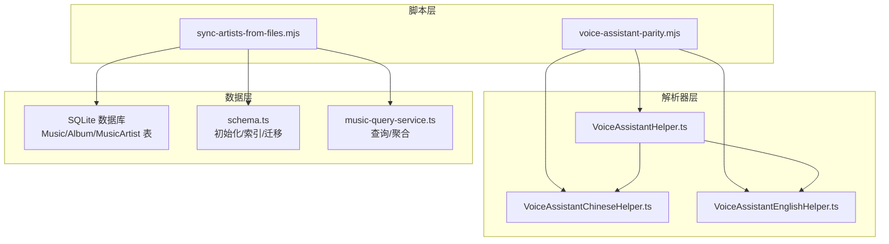
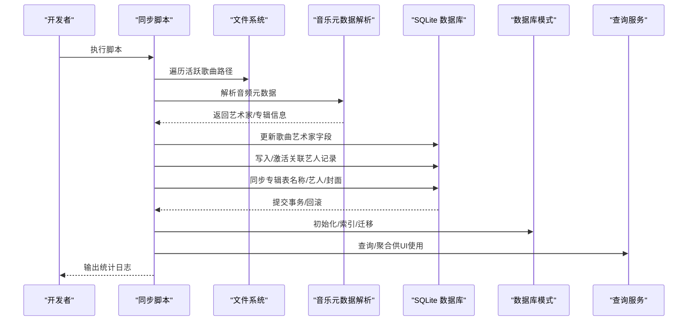
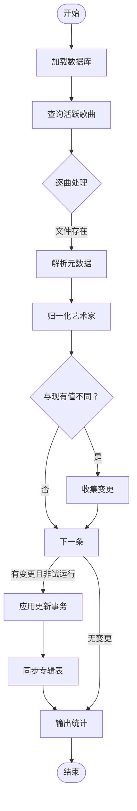
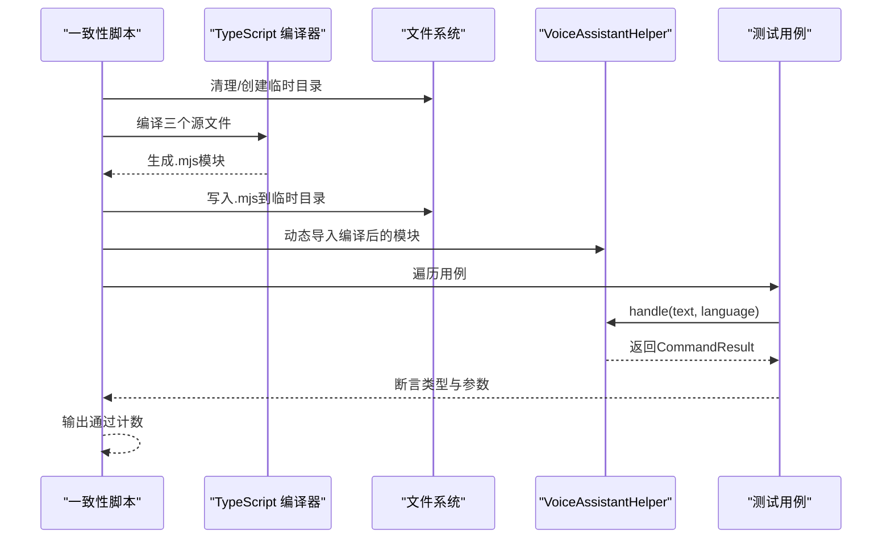
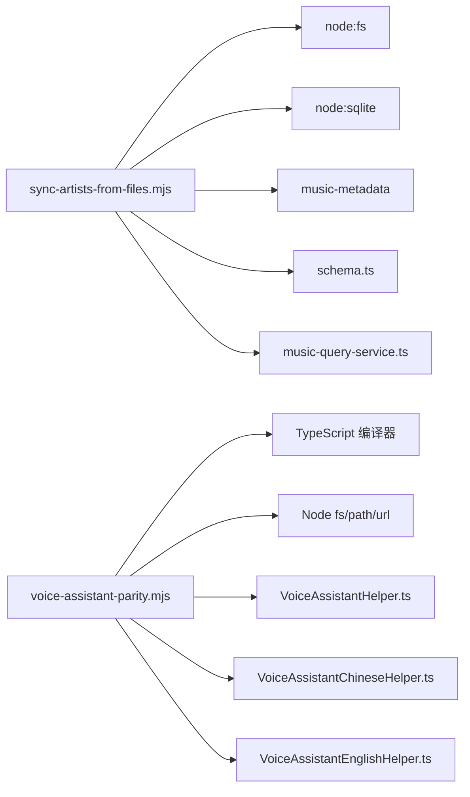

# 辅助脚本

<cite>
**本文引用的文件**
- [sync-artists-from-files.mjs](file://scripts/sync-artists-from-files.mjs)
- [voice-assistant-parity.mjs](file://scripts/voice-assistant-parity.mjs)
- [README.md](file://README.md)
- [package.json](file://package.json)
- [VoiceAssistantHelper.ts](file://src/shared/VoiceAssistantHelper.ts)
- [VoiceAssistantChineseHelper.ts](file://src/shared/VoiceAssistantChineseHelper.ts)
- [VoiceAssistantEnglishHelper.ts](file://src/shared/VoiceAssistantEnglishHelper.ts)
- [schema.ts](file://electron/services/schema.ts)
- [music-query-service.ts](file://electron/services/music-query-service.ts)
</cite>

## 目录
1. [简介](#简介)
2. [项目结构](#项目结构)
3. [核心组件](#核心组件)
4. [架构总览](#架构总览)
5. [详细组件分析](#详细组件分析)
6. [依赖关系分析](#依赖关系分析)
7. [性能考量](#性能考量)
8. [故障排除指南](#故障排除指南)
9. [结论](#结论)
10. [附录](#附录)

## 简介
本指南面向SMPlayer项目的维护者与开发者，系统性讲解两个关键辅助脚本：
- 同步艺术家信息脚本：从本地音频文件元数据中提取艺术家信息，并同步更新SQLite数据库中的歌曲与专辑记录。
- 语音助手一致性校验脚本：对前端语音助手解析器在中英文场景下的行为进行端到端断言校验，确保跨语言解析结果稳定一致。

文档涵盖功能说明、输入输出、使用场景、执行方式、参数配置、运行环境与依赖、工作原理、内部实现逻辑、实际使用示例与最佳实践、常见问题排查与扩展建议。

## 项目结构
- 脚本位于 scripts/ 目录，分别负责两类任务：
  - 同步艺术家信息：scripts/sync-artists-from-files.mjs
  - 语音助手一致性校验：scripts/voice-assistant-parity.mjs
- 语音助手解析器位于 src/shared/，包含通用入口与中英文解析器：
  - VoiceAssistantHelper.ts
  - VoiceAssistantChineseHelper.ts
  - VoiceAssistantEnglishHelper.ts
- 数据库模式与查询服务位于 electron/services/，支撑艺术家与专辑同步逻辑：
  - schema.ts（数据库表结构）
  - music-query-service.ts（查询与聚合）

图表来源
- [sync-artists-from-files.mjs:1-319](file://scripts/sync-artists-from-files.mjs#L1-L319)
- [voice-assistant-parity.mjs:1-96](file://scripts/voice-assistant-parity.mjs#L1-L96)
- [VoiceAssistantHelper.ts:1-93](file://src/shared/VoiceAssistantHelper.ts#L1-L93)
- [VoiceAssistantChineseHelper.ts:1-185](file://src/shared/VoiceAssistantChineseHelper.ts#L1-L185)
- [VoiceAssistantEnglishHelper.ts:1-175](file://src/shared/VoiceAssistantEnglishHelper.ts#L1-L175)
- [schema.ts:85-131](file://electron/services/schema.ts#L85-L131)
- [music-query-service.ts:50-165](file://electron/services/music-query-service.ts#L50-L165)

章节来源
- [README.md:1-157](file://README.md#L1-L157)
- [package.json:1-175](file://package.json#L1-L175)

## 核心组件
- 同步艺术家信息脚本
  - 功能：扫描本地音乐库，读取音频文件元数据，将提取的艺术家信息写回SQLite数据库，并同步专辑表。
  - 输入：SQLite数据库路径（默认路径或命令行指定）。
  - 输出：结构化统计日志（包含处理数量、变更数量、多艺人行数等）。
  - 关键流程：遍历活跃歌曲 -> 读取元数据 -> 归一化艺术家 -> 计算变更 -> 应用更新 -> 同步专辑。
- 语音助手一致性校验脚本
  - 功能：编译并导入前端语音助手模块，执行一组中英文语句的断言测试，验证匹配类型与参数。
  - 输入：预置的测试用例集合（语言、文本、期望类型、期望参数）。
  - 输出：通过断言计数与控制台提示，确认所有用例通过。

章节来源
- [sync-artists-from-files.mjs:1-319](file://scripts/sync-artists-from-files.mjs#L1-L319)
- [voice-assistant-parity.mjs:1-96](file://scripts/voice-assistant-parity.mjs#L1-L96)

## 架构总览
两个脚本分别服务于“数据修复/同步”和“功能一致性保障”，彼此独立但共同提升项目质量与可维护性。

图表来源
- [sync-artists-from-files.mjs:29-103](file://scripts/sync-artists-from-files.mjs#L29-L103)
- [schema.ts:33-363](file://electron/services/schema.ts#L33-L363)
- [music-query-service.ts:50-165](file://electron/services/music-query-service.ts#L50-L165)

## 详细组件分析

### 组件A：同步艺术家信息脚本（sync-artists-from-files.mjs）
- 功能概述
  - 从SQLite数据库中筛选活跃歌曲，逐条读取音频文件元数据，归一化艺术家字段，计算差异并批量更新，随后同步专辑表。
  - 支持“试运行”模式（--dry-run），仅统计不写库。
- 输入输出
  - 输入：数据库路径（默认路径数组或命令行传入；若未指定则按默认路径尝试）。
  - 输出：JSON统计对象（包含数据库路径、是否试运行、歌曲总数、已读取、缺失、失败、变更数、当前活跃多艺人行数、部分变更样本）。
- 使用场景
  - 音乐库首次导入后，需要从文件名或元数据补全/修正艺术家信息。
  - 元数据损坏或不规范时，通过文件名与标签综合识别。
  - 需要重建/修复专辑表与艺人关联的一致性。
- 执行方法
  - 基本执行：node scripts/sync-artists-from-files.mjs
  - 指定数据库：node scripts/sync-artists-from-files.mjs "C:\path\to\SMPlayerSettings.db"
  - 试运行：node scripts/sync-artists-from-files.mjs --dry-run
- 参数与配置
  - --dry-run：开启试运行，不写入数据库，仅统计。
  - 可通过命令行传入一个或多个数据库路径，若未传入则使用内置默认路径数组。
- 运行环境与依赖
  - Node.js（支持ES模块）。
  - 依赖：node:fs、node:sqlite、music-metadata。
- 工作原理与内部实现
  - 数据库连接与准备：打开数据库，查询活跃歌曲（按Id排序）。
  - 元数据读取：对每首歌曲检查文件存在性，存在则解析元数据，跳过封面读取，仅关注时长等必要信息。
  - 艺术家归一化：合并标签中的多个艺术家与主艺术家，处理斜杠分隔、括号别名等情况，去重并规范化。
  - 变更计算：比较归一化后的艺术家字符串与现有值，生成变更列表。
  - 写入策略：事务内批量更新歌曲Artist字段，标记旧艺人记录为非活跃，插入新艺人记录并激活，确保唯一性与优先级。
  - 专辑同步：临时表汇总专辑名称、艺人与封面路径，基于活跃歌曲聚合统计，更新Album表状态与字段，最后回填Music.AlbumId。
  - 统计输出：输出JSON，包含样本变更，便于人工复核。
- 实际使用示例与最佳实践
  - 示例1：修复本地库
    - 在项目根目录执行 node scripts/sync-artists-from-files.mjs，观察输出统计，确认变更数合理后再进行后续扫描或重建。
  - 示例2：多数据库路径
    - node scripts/sync-artists-from-files.mjs "C:\Users\Alice\AppData\Roaming\smplayer\SMPlayerSettings.db" "C:\Users\Bob\AppData\Local\Packages\...\LocalState\SMPlayerSettings.db"
  - 示例3：试运行
    - node scripts/sync-artists-from-files.mjs --dry-run
  - 最佳实践
    - 备份数据库后再执行写操作。
    - 在网络驱动器或外部存储上执行时，注意I/O延迟与并发访问。
    - 结合项目扫描/重建流程，定期运行此脚本以保持元数据一致性。
- 常见问题与排查
  - 文件不存在：缺失计数增加，属于预期；检查路径映射或重新扫描。
  - 元数据解析失败：失败计数增加，检查文件格式与编码；必要时降级到文件名解析策略。
  - 权限不足：无法读取数据库或文件，检查进程权限。
  - 多艺人冲突：查看样本变更，确认艺人拆分与合并规则是否符合预期。
- 扩展建议
  - 支持更多元数据字段（如作词、作曲）。
  - 增加日志级别与进度条。
  - 支持增量扫描与缓存命中优化。

图表来源
- [sync-artists-from-files.mjs:29-103](file://scripts/sync-artists-from-files.mjs#L29-L103)
- [sync-artists-from-files.mjs:105-133](file://scripts/sync-artists-from-files.mjs#L105-L133)
- [sync-artists-from-files.mjs:135-214](file://scripts/sync-artists-from-files.mjs#L135-L214)

章节来源
- [sync-artists-from-files.mjs:1-319](file://scripts/sync-artists-from-files.mjs#L1-L319)
- [schema.ts:85-131](file://electron/services/schema.ts#L85-L131)
- [music-query-service.ts:50-165](file://electron/services/music-query-service.ts#L50-L165)

### 组件B：语音助手一致性校验脚本（voice-assistant-parity.mjs）
- 功能概述
  - 编译前端语音助手源码为ES模块，动态导入并执行一组中英文测试用例，断言匹配类型与参数，确保解析行为稳定。
- 输入输出
  - 输入：测试用例数组（语言、文本、期望类型、期望参数）。
  - 输出：控制台打印“通过用例数”。
- 使用场景
  - 新增/修改语音助手解析规则后，快速回归验证。
  - 国际化扩展（中英文）时，保证解析一致性。
- 执行方法
  - 通过NPM脚本：npm run test:voice
  - 或直接执行：node scripts/voice-assistant-parity.mjs
- 参数与配置
  - 无命令行参数；测试用例集中定义于脚本内部。
- 运行环境与依赖
  - Node.js（ES模块）、TypeScript编译器。
- 工作原理与内部实现
  - 清理/创建临时目录，读取三个源文件，使用TypeScript编译为目标模块，替换相对导入为.mjs后缀，写入临时目录。
  - 导入编译后的VoiceAssistantHelper，遍历测试用例，调用handle(text, language)，断言类型与参数（字符串、ByArtistRequest对象或VolumeRequest对象）。
  - 通过后输出通过计数。
- 实际使用示例与最佳实践
  - 示例：npm run test:voice
  - 最佳实践：新增用例时，同时覆盖中英文场景；修改解析器后先跑脚本，再进行UI联调。
- 常见问题与排查
  - 编译错误：检查TypeScript版本与编译选项；确保源文件可读。
  - 导入失败：确认.mjs后缀替换与路径正确。
  - 断言失败：检查解析器逻辑或测试用例期望值。
- 扩展建议
  - 将测试用例抽取为独立JSON文件，便于维护与扩展。
  - 增加覆盖率统计与失败详情输出。

图表来源
- [voice-assistant-parity.mjs:1-96](file://scripts/voice-assistant-parity.mjs#L1-L96)
- [VoiceAssistantHelper.ts:1-93](file://src/shared/VoiceAssistantHelper.ts#L1-L93)
- [VoiceAssistantChineseHelper.ts:1-185](file://src/shared/VoiceAssistantChineseHelper.ts#L1-L185)
- [VoiceAssistantEnglishHelper.ts:1-175](file://src/shared/VoiceAssistantEnglishHelper.ts#L1-L175)

章节来源
- [voice-assistant-parity.mjs:1-96](file://scripts/voice-assistant-parity.mjs#L1-L96)
- [VoiceAssistantHelper.ts:1-93](file://src/shared/VoiceAssistantHelper.ts#L1-L93)
- [VoiceAssistantChineseHelper.ts:1-185](file://src/shared/VoiceAssistantChineseHelper.ts#L1-L185)
- [VoiceAssistantEnglishHelper.ts:1-175](file://src/shared/VoiceAssistantEnglishHelper.ts#L1-L175)

## 依赖关系分析
- 同步脚本依赖
  - node:fs：文件存在性检查与遍历。
  - node:sqlite：数据库连接、事务、SQL执行。
  - music-metadata：音频元数据解析。
  - 项目内数据库模式与查询服务：用于初始化、索引与查询。
- 语音助手脚本依赖
  - TypeScript编译器：将TS源码转为ES模块。
  - Node.js内置模块：文件系统、路径、URL转换。
  - 项目内语音助手解析器：统一入口与中英文解析器。

图表来源
- [sync-artists-from-files.mjs:1-3](file://scripts/sync-artists-from-files.mjs#L1-L3)
- [voice-assistant-parity.mjs:1-5](file://scripts/voice-assistant-parity.mjs#L1-L5)
- [schema.ts:1-364](file://electron/services/schema.ts#L1-L364)
- [music-query-service.ts:1-418](file://electron/services/music-query-service.ts#L1-L418)
- [VoiceAssistantHelper.ts:1-93](file://src/shared/VoiceAssistantHelper.ts#L1-L93)

章节来源
- [package.json:23-48](file://package.json#L23-L48)
- [README.md:13-13](file://README.md#L13-L13)

## 性能考量
- 同步脚本
  - I/O密集：逐曲解析元数据，建议在本地磁盘或SSD上执行。
  - 事务批处理：单次变更在事务内提交，减少锁竞争与重复写入。
  - 临时表与索引：专辑同步使用临时表与聚合查询，避免全表扫描。
- 语音助手脚本
  - 编译开销：首次执行会编译TS源码，后续可复用临时产物。
  - 断言线性：用例数量有限，性能影响可忽略。

## 故障排除指南
- 同步脚本
  - 数据库不可写：检查文件权限与占用。
  - 路径不存在：确认默认路径或传入路径正确。
  - 元数据解析异常：检查文件格式与编码，必要时降级策略。
  - 事务回滚：查看异常堆栈，定位具体SQL或参数。
- 语音助手脚本
  - 编译失败：检查TypeScript版本与编译选项。
  - 导入路径错误：确认.mjs替换与临时目录路径。
  - 断言失败：核对解析器逻辑与测试用例期望值。

章节来源
- [sync-artists-from-files.mjs:120-133](file://scripts/sync-artists-from-files.mjs#L120-L133)
- [voice-assistant-parity.mjs:16-34](file://scripts/voice-assistant-parity.mjs#L16-L34)

## 结论
这两个辅助脚本分别承担“数据修复/同步”和“功能一致性保障”的职责，是SMPlayer项目质量与可维护性的关键工具。通过明确的输入输出、参数配置与执行流程，开发者可以高效地完成日常维护任务，并在国际化与功能演进过程中保持解析行为的稳定性。

## 附录
- 运行环境与依赖
  - Node.js（支持ES模块）。
  - TypeScript（用于编译前端解析器）。
  - 项目依赖：music-metadata、Electron、React、Vite等（详见package.json与README）。
- 命令参考
  - npm run test:voice：执行语音助手一致性校验。
  - node scripts/sync-artists-from-files.mjs [--dry-run] [dbPath...]：执行艺术家同步脚本。

章节来源
- [package.json:8-21](file://package.json#L8-L21)
- [README.md:90-97](file://README.md#L90-L97)