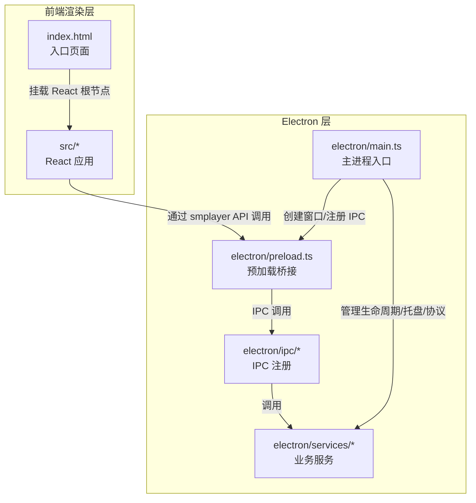
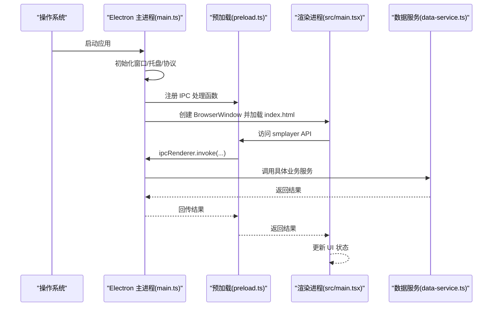
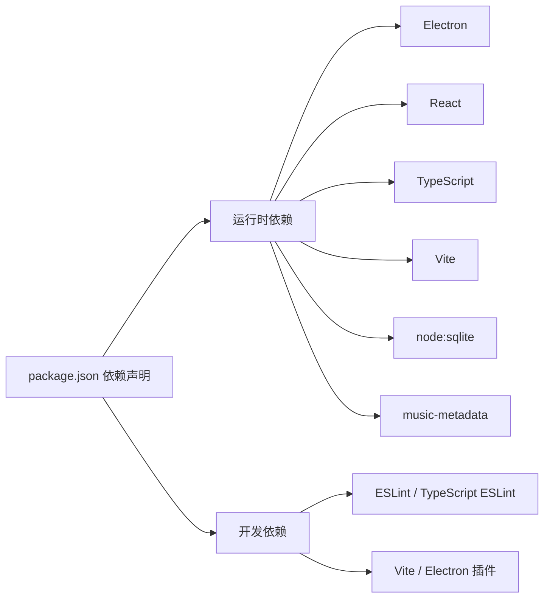

# 快速开始

<cite>
**本文引用的文件**
- [README.md](file://README.md)
- [package.json](file://package.json)
- [vite.config.ts](file://vite.config.ts)
- [tsconfig.json](file://tsconfig.json)
- [tsconfig.app.json](file://tsconfig.app.json)
- [tsconfig.node.json](file://tsconfig.node.json)
- [eslint.config.js](file://eslint.config.js)
- [.npmrc](file://.npmrc)
- [electron/main.ts](file://electron/main.ts)
- [electron/preload.ts](file://electron/preload.ts)
- [electron/ipc/app-ipc.ts](file://electron/ipc/app-ipc.ts)
- [electron/services/data-service.ts](file://electron/services/data-service.ts)
- [src/main.tsx](file://src/main.tsx)
- [index.html](file://index.html)
</cite>

## 目录
1. [简介](#简介)
2. [项目结构](#项目结构)
3. [核心组件](#核心组件)
4. [架构总览](#架构总览)
5. [详细组件分析](#详细组件分析)
6. [依赖关系分析](#依赖关系分析)
7. [性能注意事项](#性能注意事项)
8. [故障排除指南](#故障排除指南)
9. [结论](#结论)
10. [附录](#附录)

## 简介
本指南面向首次接触 SMPlayer 的开发者与用户，帮助你在本地快速搭建开发与运行环境，完成项目启动、构建与打包，并理解关键目录与文件的作用。SMPlayer 是基于 Electron + React + TypeScript + Vite 的跨平台本地音乐播放器，具备本地媒体库扫描、歌词加载、系统托盘、全局媒体键支持、多平台打包等功能。

## 项目结构
该项目采用“前端渲染层 + Electron 主进程 + 预加载桥接层”的经典分层架构，配合 TypeScript 多配置文件组织与 Vite 构建工具链，形成清晰的开发与构建流程。

图表来源
- [src/main.tsx:1-15](file://src/main.tsx#L1-L15)
- [index.html:1-26](file://index.html#L1-L26)
- [electron/main.ts:1-243](file://electron/main.ts#L1-L243)
- [electron/preload.ts:1-287](file://electron/preload.ts#L1-L287)
- [electron/ipc/app-ipc.ts:1-26](file://electron/ipc/app-ipc.ts#L1-L26)
- [electron/services/data-service.ts:1-198](file://electron/services/data-service.ts#L1-L198)

章节来源
- [README.md:1-157](file://README.md#L1-L157)
- [package.json:1-175](file://package.json#L1-L175)

## 核心组件
- 主进程：负责应用生命周期、窗口管理、系统托盘、媒体协议注册、IPC 注册与服务初始化。
- 预加载脚本：通过 contextBridge 暴露受控 API（smplayer）给渲染进程，实现安全通信。
- 渲染层：React 应用，路由驱动页面切换，状态管理与业务逻辑在 hooks 与 stores 中实现。
- 数据服务：封装数据库、扫描、歌词、播放队列、历史记录等子服务，统一对外提供数据能力。
- 构建与脚本：Vite + TypeScript 编译，npm scripts 提供开发、构建、打包、预览等命令。

章节来源
- [electron/main.ts:1-243](file://electron/main.ts#L1-L243)
- [electron/preload.ts:1-287](file://electron/preload.ts#L1-L287)
- [src/main.tsx:1-15](file://src/main.tsx#L1-L15)
- [electron/services/data-service.ts:1-198](file://electron/services/data-service.ts#L1-L198)

## 架构总览
下图展示从启动到渲染的关键交互路径，以及 IPC 与服务层的关系。

图表来源
- [electron/main.ts:141-219](file://electron/main.ts#L141-L219)
- [electron/preload.ts:45-287](file://electron/preload.ts#L45-L287)
- [src/main.tsx:1-15](file://src/main.tsx#L1-L15)
- [electron/services/data-service.ts:1-198](file://electron/services/data-service.ts#L1-L198)

## 详细组件分析

### 环境准备与安装
- Node.js 版本要求
  - 使用现代 LTS 版本即可满足 Electron 41 与 Vite 8 的需求。建议使用 Node 18 或 20。
- Git 安装
  - 用于克隆仓库与后续版本管理。
- 克隆与依赖安装
  - 克隆仓库后，在项目根目录执行依赖安装命令。
  - 若网络受限，可参考镜像配置以加速下载。
- 镜像配置
  - 工程已内置 Electron 及其构建二进制镜像地址，便于国内网络环境使用。

章节来源
- [README.md:90-97](file://README.md#L90-L97)
- [.npmrc:1-3](file://.npmrc#L1-L3)

### 开发环境配置
- VS Code 推荐设置
  - 安装 TypeScript/React/ESLint 插件，启用 ESLint 与 Prettier（若使用）。
  - 在工作区设置中启用“自动格式化”与“保存时格式化”，保持团队一致风格。
- ESLint 配置
  - 工程采用 flat config，覆盖 TS/TSX、React Hooks、React Refresh 等规则。
  - 建议在编辑器中启用 ESLint 实时检查，避免提交前错误。
- TypeScript 编译设置
  - 多 tsconfig 文件组织：应用侧与 Node/Electron 侧分别独立配置，提升类型检查效率与准确性。
  - 关键目标与严格性：应用侧目标 ES2023，Node 侧目标 ES2023；开启严格模式与未使用检测。
- Vite 配置
  - React 插件、Electron 插件集成，主进程外部化 node:sqlite 与 music-metadata，避免浏览器打包报错。
  - 别名 @ 指向 src，便于模块导入。

章节来源
- [eslint.config.js:1-28](file://eslint.config.js#L1-L28)
- [tsconfig.json:1-8](file://tsconfig.json#L1-L8)
- [tsconfig.app.json:1-29](file://tsconfig.app.json#L1-L29)
- [tsconfig.node.json:1-27](file://tsconfig.node.json#L1-L27)
- [vite.config.ts:1-36](file://vite.config.ts#L1-L36)

### 项目启动与常用命令
- 开发模式
  - 运行开发服务器，热更新生效，适合日常开发。
- 生产构建
  - 同步编译 TypeScript 并构建前端资源，生成 dist 与 dist-electron。
- 预览模式
  - 本地预览生产构建产物，验证打包效果。
- 启动 Electron 应用
  - 直接以 Electron 运行当前目录，常用于调试打包后的产物。
- 打包与分发
  - 支持多平台打包（Windows/macOS/Linux），并提供 NSIS、AppImage、deb 等目标。
- 其他任务
  - 类型检查、代码规范检查、语音助手测试脚本等。

章节来源
- [package.json:8-22](file://package.json#L8-L22)
- [README.md:90-103](file://README.md#L90-L103)

### 目录结构与关键文件说明
- electron/
  - main.ts：应用入口，窗口创建、托盘、协议、IPC 注册与生命周期管理。
  - preload.ts：通过 contextBridge 暴露 smplayer API，统一渲染进程访问入口。
  - ipc/*：按功能划分的 IPC 注册模块，如 app-ipc、data-ipc、library-ipc 等。
  - services/*：业务服务层，如数据服务、扫描、歌词、播放队列、设置等。
- src/
  - main.tsx：React 根节点挂载，路由包裹 App。
  - index.html：应用入口页面，支持夜间模式启动参数注入。
  - App.tsx：应用外壳与状态管理入口，承载页面与组件。
- 配置文件
  - vite.config.ts：Vite 与 Electron 插件配置。
  - tsconfig.*：应用与 Node/Electron 分离的 TypeScript 配置。
  - eslint.config.js：ESLint 平台化配置。
  - .npmrc：镜像源配置，加速 Electron 与构建二进制下载。

章节来源
- [electron/main.ts:1-243](file://electron/main.ts#L1-L243)
- [electron/preload.ts:1-287](file://electron/preload.ts#L1-L287)
- [electron/ipc/app-ipc.ts:1-26](file://electron/ipc/app-ipc.ts#L1-L26)
- [electron/services/data-service.ts:1-198](file://electron/services/data-service.ts#L1-L198)
- [src/main.tsx:1-15](file://src/main.tsx#L1-L15)
- [index.html:1-26](file://index.html#L1-L26)
- [vite.config.ts:1-36](file://vite.config.ts#L1-L36)
- [tsconfig.json:1-8](file://tsconfig.json#L1-L8)
- [tsconfig.app.json:1-29](file://tsconfig.app.json#L1-L29)
- [tsconfig.node.json:1-27](file://tsconfig.node.json#L1-L27)
- [eslint.config.js:1-28](file://eslint.config.js#L1-L28)
- [.npmrc:1-3](file://.npmrc#L1-L3)

### 基本使用示例
- 启动开发服务器
  - 在项目根目录执行开发命令，打开浏览器访问本地开发地址。
- 导入本地音乐
  - 首次运行会提示选择本地音乐库根目录，随后进行递归扫描。
- 播放控制
  - 使用底部媒体控制条或全局媒体键进行播放/暂停、上一首/下一首、音量调节等操作。
- 歌词与封面
  - 支持嵌入式歌词与在线歌词检索；封面来自文件内嵌或本地缓存。
- 设置与偏好
  - 在设置页调整语言、主题、通知、自动歌词等偏好项。

章节来源
- [README.md:19-88](file://README.md#L19-L88)
- [package.json:8-22](file://package.json#L8-L22)

## 依赖关系分析
- 构建与运行时依赖
  - Electron、React、TypeScript、Vite、SQLite(node:sqlite)、music-metadata 等。
- 开发依赖
  - ESLint、TypeScript ESLint、React Hooks/Refresh 插件、Vite 与 Electron 插件等。
- 打包配置
  - electron-builder 集成多平台目标，配置图标、文件关联、安装器行为等。

图表来源
- [package.json:23-49](file://package.json#L23-L49)

章节来源
- [package.json:1-175](file://package.json#L1-L175)

## 性能注意事项
- 构建目标
  - 应用侧与 Node/Electron 侧分别采用 ESNext/ES2023，兼顾现代浏览器与 Node 环境。
- 外部化策略
  - 主进程构建将 node:sqlite 与 music-metadata 设为 external，避免浏览器端打包错误。
- 打包体积
  - asar 打包与 npmRebuild 配置有助于减小体积并正确处理原生模块。
- 严格类型检查
  - 开启严格模式与未使用检测，减少运行时隐患并提升维护性。

章节来源
- [vite.config.ts:10-24](file://vite.config.ts#L10-L24)
- [tsconfig.app.json:1-29](file://tsconfig.app.json#L1-L29)
- [tsconfig.node.json:1-27](file://tsconfig.node.json#L1-L27)
- [package.json:50-173](file://package.json#L50-L173)

## 故障排除指南
- 依赖安装失败
  - 网络问题：优先检查 .npmrc 中镜像配置是否生效，必要时手动切换镜像源。
  - 权限问题：在 Windows 上以管理员身份运行终端；在 macOS/Linux 上检查 npm 缓存权限。
  - Node 版本不匹配：升级至推荐的 LTS 版本后再试。
- 编译错误
  - TypeScript 报错：根据 ESLint 与 TS 编译器提示修复类型问题；保持严格模式下的未使用变量/参数检查。
  - Vite 报错：确认 vite.config.ts 中 external 配置与模块解析选项正确。
- Electron 启动异常
  - 确认主进程入口与预加载脚本路径无误；检查 preload.ts 中暴露的 API 是否被渲染进程正确调用。
  - 托盘/协议注册失败：检查平台相关开关与权限（如 Windows AppUserModelId、协议注册）。
- 打包失败
  - electron-builder 报错：核对图标路径、文件关联、安装器参数；确保 dist 与 dist-electron 输出存在。
- 常见提示
  - node:sqlite external 警告与 vite-plugin-electron deprecation 警告为非阻塞提示，不影响 Electron 构建。

章节来源
- [README.md:145-149](file://README.md#L145-L149)
- [.npmrc:1-3](file://.npmrc#L1-L3)
- [vite.config.ts:10-24](file://vite.config.ts#L10-L24)
- [package.json:50-173](file://package.json#L50-L173)

## 结论
通过本指南，你可以在本地快速完成 SMPlayer 的环境搭建与项目启动，理解关键文件与目录的作用，并掌握开发、构建、预览与打包的完整流程。建议在开发过程中持续关注 ESLint 规则与 TypeScript 严格模式，以获得更稳定与可维护的代码质量。

## 附录
- 快速命令清单
  - 安装依赖：在项目根目录执行依赖安装命令。
  - 开发启动：运行开发服务器，进入开发模式。
  - 生产构建：同步编译 TypeScript 并构建前端资源。
  - 预览构建：本地预览生产构建产物。
  - 启动应用：直接以 Electron 运行当前目录。
  - 打包分发：根据平台选择对应打包脚本。

章节来源
- [README.md:90-103](file://README.md#L90-L103)
- [package.json:8-22](file://package.json#L8-L22)