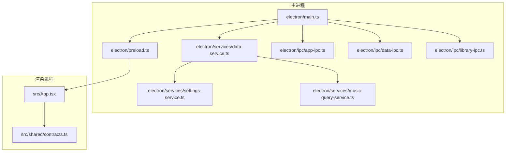
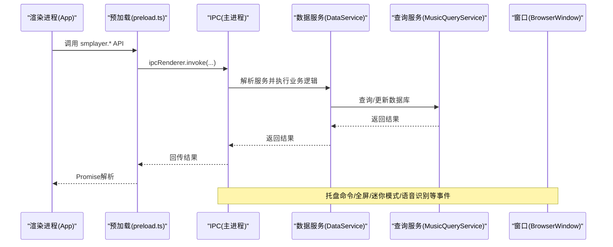
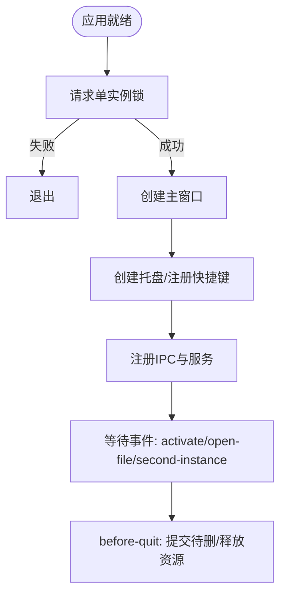
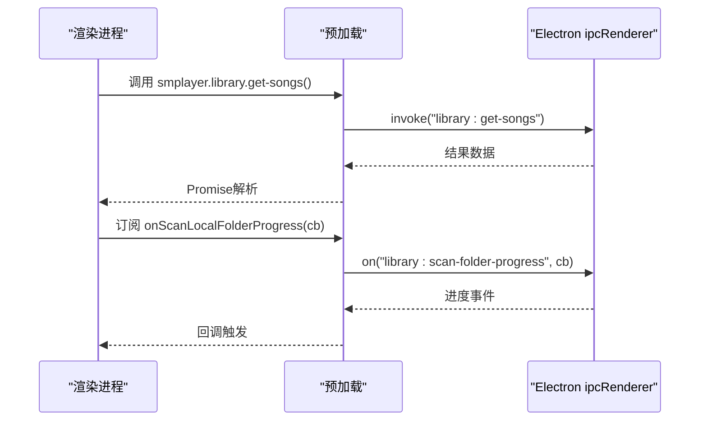
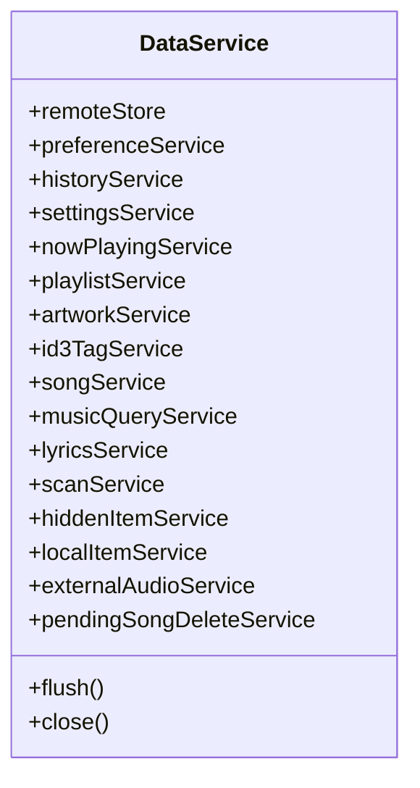
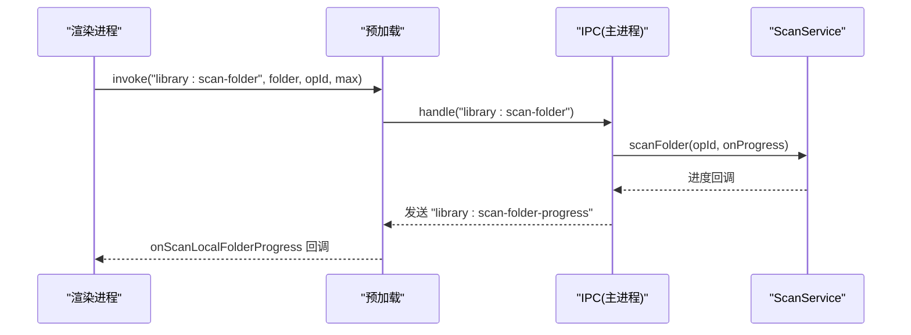
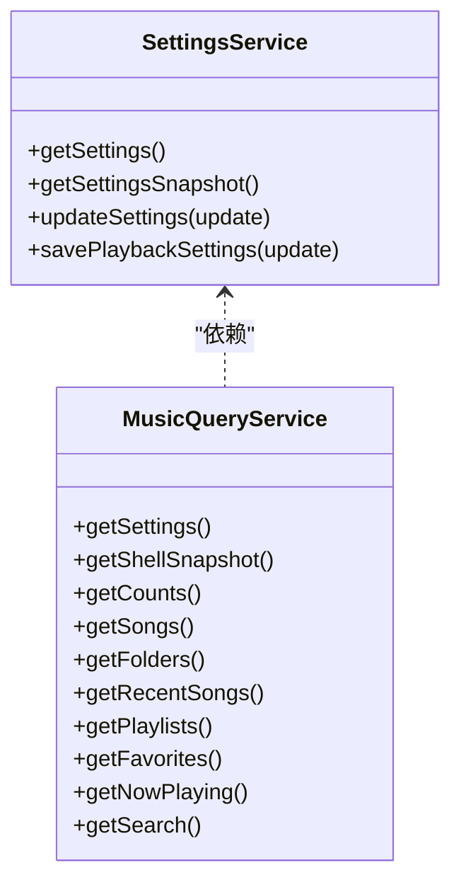
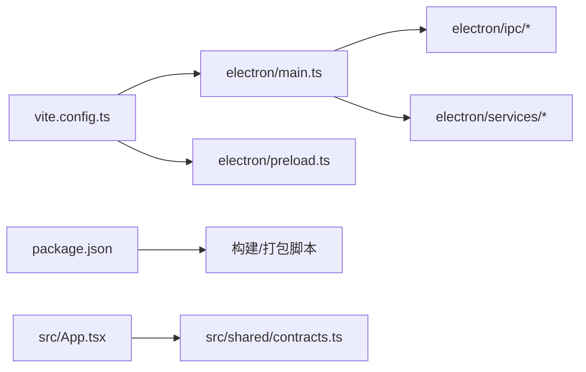

# 故障排除与调试

<cite>
**本文引用的文件**
- [package.json](file://package.json)
- [vite.config.ts](file://vite.config.ts)
- [electron/main.ts](file://electron/main.ts)
- [electron/preload.ts](file://electron/preload.ts)
- [src/App.tsx](file://src/App.tsx)
- [src/shared/contracts.ts](file://src/shared/contracts.ts)
- [electron/services/data-service.ts](file://electron/services/data-service.ts)
- [electron/services/settings-service.ts](file://electron/services/settings-service.ts)
- [electron/services/music-query-service.ts](file://electron/services/music-query-service.ts)
- [electron/ipc/app-ipc.ts](file://electron/ipc/app-ipc.ts)
- [electron/ipc/data-ipc.ts](file://electron/ipc/data-ipc.ts)
- [electron/ipc/library-ipc.ts](file://electron/ipc/library-ipc.ts)
</cite>

## 目录
1. [简介](#简介)
2. [项目结构](#项目结构)
3. [核心组件](#核心组件)
4. [架构总览](#架构总览)
5. [详细组件分析](#详细组件分析)
6. [依赖关系分析](#依赖关系分析)
7. [性能考量](#性能考量)
8. [故障排除指南](#故障排除指南)
9. [结论](#结论)
10. [附录](#附录)

## 简介
本指南面向SMPlayer（基于Electron + React）的开发者与维护者，提供系统化的故障排除与调试方法。内容覆盖应用启动失败、音乐文件识别异常、播放异常、界面显示问题、日志与错误追踪、性能诊断、开发与生产环境调试技巧，以及预防性措施与最佳实践。

## 项目结构
SMPlayer采用Electron主进程与React渲染进程分离的典型架构：主进程负责窗口、系统集成、IPC注册与数据服务；渲染进程负责UI、路由、播放控制与状态管理；二者通过预加载桥接层进行安全通信。

**图表来源**
- [electron/main.ts:1-243](file://electron/main.ts#L1-L243)
- [electron/preload.ts:1-287](file://electron/preload.ts#L1-L287)
- [src/App.tsx:1-800](file://src/App.tsx#L1-L800)
- [src/shared/contracts.ts:1-664](file://src/shared/contracts.ts#L1-L664)
- [electron/services/data-service.ts:1-198](file://electron/services/data-service.ts#L1-L198)
- [electron/services/settings-service.ts:1-200](file://electron/services/settings-service.ts#L1-L200)
- [electron/services/music-query-service.ts:1-200](file://electron/services/music-query-service.ts#L1-L200)
- [electron/ipc/app-ipc.ts:1-26](file://electron/ipc/app-ipc.ts#L1-L26)
- [electron/ipc/data-ipc.ts:1-151](file://electron/ipc/data-ipc.ts#L1-L151)
- [electron/ipc/library-ipc.ts:1-370](file://electron/ipc/library-ipc.ts#L1-L370)

**章节来源**
- [package.json:1-175](file://package.json#L1-L175)
- [vite.config.ts:1-36](file://vite.config.ts#L1-L36)
- [electron/main.ts:1-243](file://electron/main.ts#L1-L243)
- [electron/preload.ts:1-287](file://electron/preload.ts#L1-L287)
- [src/App.tsx:1-800](file://src/App.tsx#L1-L800)
- [src/shared/contracts.ts:1-664](file://src/shared/contracts.ts#L1-L664)

## 核心组件
- 主进程入口与窗口生命周期：负责单实例锁、窗口创建、托盘与全局媒体键、远程分享、协议注册、IPC注册与退出流程。
- 预加载桥接层：在受控环境中向渲染进程暴露API，统一事件监听与清理。
- 数据服务与查询服务：封装SQLite数据库访问、设置读写、音乐查询、扫描与歌词处理。
- IPC模块：将渲染进程调用映射到主进程服务，提供库操作、播放控制、设置更新、扫描进度等接口。
- 渲染进程应用：负责UI、路由、播放控制、夜间模式、通知与语音助手等。

**章节来源**
- [electron/main.ts:141-243](file://electron/main.ts#L141-L243)
- [electron/preload.ts:45-287](file://electron/preload.ts#L45-L287)
- [electron/services/data-service.ts:39-198](file://electron/services/data-service.ts#L39-L198)
- [electron/services/music-query-service.ts:50-200](file://electron/services/music-query-service.ts#L50-L200)
- [electron/ipc/library-ipc.ts:28-302](file://electron/ipc/library-ipc.ts#L28-L302)
- [electron/ipc/data-ipc.ts:20-151](file://electron/ipc/data-ipc.ts#L20-L151)
- [electron/ipc/app-ipc.ts:10-26](file://electron/ipc/app-ipc.ts#L10-L26)
- [src/App.tsx:71-800](file://src/App.tsx#L71-L800)

## 架构总览
下图展示从渲染进程发起请求到主进程服务执行与回传的关键路径，以及托盘命令、语音识别、扫描进度等异步事件流。

**图表来源**
- [electron/preload.ts:45-287](file://electron/preload.ts#L45-L287)
- [electron/ipc/library-ipc.ts:28-302](file://electron/ipc/library-ipc.ts#L28-L302)
- [electron/ipc/data-ipc.ts:20-151](file://electron/ipc/data-ipc.ts#L20-L151)
- [electron/ipc/app-ipc.ts:10-26](file://electron/ipc/app-ipc.ts#L10-L26)
- [electron/main.ts:156-209](file://electron/main.ts#L156-L209)

## 详细组件分析

### 组件A：主进程窗口与托盘控制
- 单实例锁与二次实例参数处理
- 窗口创建、显示/隐藏、哈希路由跳转
- 托盘菜单与全局媒体键注册
- 远程分享服务按设置启停
- before-quit阶段提交待删除任务并释放资源

**图表来源**
- [electron/main.ts:78-243](file://electron/main.ts#L78-L243)

**章节来源**
- [electron/main.ts:78-243](file://electron/main.ts#L78-L243)

### 组件B：预加载桥接与API暴露
- 通过contextBridge.exposeInMainWorld注入smplayer对象
- 将大量渲染侧API映射到ipcRenderer.invoke/on
- 支持扫描进度、移动进度、语音识别状态/假设、窗口状态变更、托盘命令等事件订阅
- 启动时可应用夜间模式样式以减少闪烁

**图表来源**
- [electron/preload.ts:45-287](file://electron/preload.ts#L45-L287)

**章节来源**
- [electron/preload.ts:45-287](file://electron/preload.ts#L45-L287)

### 组件C：库与数据服务
- DataService聚合各子服务：设置、历史、播放队列、歌单、歌词、扫描、本地项、外部音频、待删等
- 初始化数据库、迁移与清理副作用
- flush/close用于WAL检查点与资源释放

**图表来源**
- [electron/services/data-service.ts:39-198](file://electron/services/data-service.ts#L39-L198)

**章节来源**
- [electron/services/data-service.ts:39-198](file://electron/services/data-service.ts#L39-L198)

### 组件D：IPC库操作与扫描进度
- 注册library相关invoke与on事件
- 扫描进度通过“library:scan-folder-progress”事件推送
- 移动进度通过“library:move-local-items-progress”事件推送
- 导入/导出数据时替换当前服务实例并更新跳转列表

**图表来源**
- [electron/ipc/library-ipc.ts:228-250](file://electron/ipc/library-ipc.ts#L228-L250)
- [electron/ipc/library-ipc.ts:215-218](file://electron/ipc/library-ipc.ts#L215-L218)

**章节来源**
- [electron/ipc/library-ipc.ts:28-302](file://electron/ipc/library-ipc.ts#L28-L302)

### 组件E：设置与查询服务
- SettingsService提供设置读取/快照/更新
- MusicQueryService提供歌曲、专辑、艺术家、播放队列、最近播放、搜索等查询
- 二者共同支撑渲染侧UI与播放控制

**图表来源**
- [electron/services/settings-service.ts:61-200](file://electron/services/settings-service.ts#L61-L200)
- [electron/services/music-query-service.ts:50-200](file://electron/services/music-query-service.ts#L50-L200)

**章节来源**
- [electron/services/settings-service.ts:61-200](file://electron/services/settings-service.ts#L61-L200)
- [electron/services/music-query-service.ts:50-200](file://electron/services/music-query-service.ts#L50-L200)

## 依赖关系分析
- Vite/Electron插件配置启用主进程与预加载输入，并将sqlite标记为外部依赖，避免打包体积膨胀与运行时问题。
- package脚本定义了开发、构建、打包与多平台分发流程。
- IPC模块集中注册，便于定位调用链路与错误来源。

**图表来源**
- [vite.config.ts:8-25](file://vite.config.ts#L8-L25)
- [package.json:8-22](file://package.json#L8-L22)
- [electron/main.ts:141-209](file://electron/main.ts#L141-L209)

**章节来源**
- [vite.config.ts:1-36](file://vite.config.ts#L1-L36)
- [package.json:1-175](file://package.json#L1-L175)

## 性能考量
- 数据库WAL检查点：在关闭或退出前调用flush以减少碎片与提升一致性。
- 扫描与移动操作：通过进度事件分片上报，避免阻塞UI线程。
- 大量Promise并发：如歌词自动保存，使用Promise.allSettled避免单点失败影响整体。
- 渲染侧滚动位置记忆：在路由切换前后保存/恢复滚动位置，减少重排抖动。
- 夜间模式：启动时应用样式，避免首屏闪烁与重绘。

**章节来源**
- [electron/services/data-service.ts:147-154](file://electron/services/data-service.ts#L147-L154)
- [electron/ipc/library-ipc.ts:215-218](file://electron/ipc/library-ipc.ts#L215-L218)
- [src/App.tsx:517-525](file://src/App.tsx#L517-L525)
- [electron/preload.ts:20-43](file://electron/preload.ts#L20-L43)

## 故障排除指南

### 应用启动失败
- 现象
  - 第二实例被拒绝、立即退出
  - 窗口未创建或白屏
  - 托盘未出现
- 排查步骤
  - 检查单实例锁是否成功获取
  - 确认窗口创建回调与托盘初始化顺序
  - 核对协议注册与媒体键注册是否在app.whenReady后执行
  - 查看before-quit阶段是否提前退出
- 关联代码
  - 单实例锁与二次实例处理
  - 窗口创建与托盘注册
  - before-quit与资源释放

**章节来源**
- [electron/main.ts:78-82](file://electron/main.ts#L78-L82)
- [electron/main.ts:131-139](file://electron/main.ts#L131-L139)
- [electron/main.ts:141-209](file://electron/main.ts#L141-L209)
- [electron/main.ts:221-232](file://electron/main.ts#L221-L232)

### 音乐文件无法识别/扫描无响应
- 现象
  - 选择根目录后无歌曲入库
  - 扫描进度不更新或卡住
  - 移动/删除本地项目无效果
- 排查步骤
  - 确认扫描操作是否发送了取消信号
  - 检查扫描/移动回调是否正确订阅进度事件
  - 核对导入/导出数据后是否重建了DataService实例
  - 检查数据库连接与WAL状态
- 关联代码
  - 扫描与取消扫描
  - 进度事件发送
  - 导入/导出数据替换服务

**章节来源**
- [electron/ipc/library-ipc.ts:248-250](file://electron/ipc/library-ipc.ts#L248-L250)
- [electron/ipc/library-ipc.ts:215-218](file://electron/ipc/library-ipc.ts#L215-L218)
- [electron/ipc/library-ipc.ts:290-299](file://electron/ipc/library-ipc.ts#L290-L299)
- [electron/services/data-service.ts:147-154](file://electron/services/data-service.ts#L147-L154)

### 播放异常（无声音/卡顿/队列不同步）
- 现象
  - 播放按钮无效或状态不同步
  - 音量/重复/随机模式不生效
  - 通知栏歌词不同步
- 排查步骤
  - 检查渲染侧播放控制与状态绑定
  - 确认即时播放设置同步通道
  - 核对最近播放记录与队列持久化
  - 检查夜间模式与窗口控制色变更是否影响UI
- 关联代码
  - 播放控制与状态
  - 即时设置读写
  - 夜间模式与窗口控制色

**章节来源**
- [src/App.tsx:312-321](file://src/App.tsx#L312-L321)
- [electron/ipc/data-ipc.ts:133-144](file://electron/ipc/data-ipc.ts#L133-L144)
- [src/App.tsx:191-215](file://src/App.tsx#L191-L215)

### 界面显示问题（闪烁/布局错乱/夜间模式异常）
- 现象
  - 首屏闪烁或背景色异常
  - 夜间模式切换不生效
  - 滚动位置丢失
- 排查步骤
  - 检查预加载启动夜间模式应用逻辑
  - 确认夜间模式类名与内联样式的切换时机
  - 核对滚动位置记忆与恢复策略
- 关联代码
  - 启动夜间模式应用
  - 夜间模式类名切换
  - 滚动位置保存/恢复

**章节来源**
- [electron/preload.ts:20-43](file://electron/preload.ts#L20-L43)
- [src/App.tsx:203-215](file://src/App.tsx#L203-L215)
- [src/App.tsx:517-525](file://src/App.tsx#L517-L525)

### 日志记录与错误追踪
- 主进程日志
  - 使用Electron内置日志输出（标准输出/错误输出）
  - 在关键路径添加try/catch与错误上报
- 渲染进程日志
  - 使用浏览器控制台与React DevTools
  - 对API调用与事件订阅建立统一日志埋点
- 错误堆栈分析
  - 区分主/渲染错误来源，结合IPC调用栈定位
  - 对数据库操作与文件IO增加明确的错误信息
- 性能监控
  - 扫描/移动进度事件作为性能指标来源
  - 使用浏览器性能面板观察长任务与重排

[本节为通用指导，无需特定文件引用]

### 调试工具使用
- Electron DevTools
  - 在主进程窗口中打开DevTools查看渲染进程日志
  - 使用性能面板分析主线程阻塞
- React Developer Tools
  - 定位组件渲染次数与状态变化
  - 检查useEffect与订阅的注册/清理
- Node.js调试器
  - 使用Vite/Electron插件提供的调试入口附加到主进程
  - 断点定位IPC处理函数与服务层

**章节来源**
- [vite.config.ts:8-25](file://vite.config.ts#L8-L25)

### 开发环境调试技巧
- 热重载
  - Vite提供快速热更新，修改源码后自动刷新
- 断点调试
  - 在主进程与渲染进程分别设置断点
  - 利用IPC调用栈定位问题发生点
- 状态检查
  - 通过全局状态存储快照与事件日志核对状态一致性

**章节来源**
- [vite.config.ts:1-36](file://vite.config.ts#L1-L36)

### 生产环境问题排查
- 崩溃报告
  - 在主进程捕获未处理异常并生成最小复现场景
- 用户反馈处理
  - 提供“打开系统日志”能力，收集用户侧日志
- 远程调试
  - 通过Electron内置调试端口进行远程调试（需谨慎开启）

**章节来源**
- [electron/preload.ts:78-78](file://electron/preload.ts#L78-L78)

### 预防性措施与最佳实践
- 数据库一致性
  - 在退出前调用flush，确保WAL检查点
  - 对批量操作使用事务或分批提交
- IPC健壮性
  - 为每个invoke提供超时与重试机制
  - 对事件订阅提供去订阅接口，防止内存泄漏
- UI稳定性
  - 对长任务与大列表渲染采用虚拟化与懒加载
  - 控制夜间模式切换时机，避免首屏闪烁

**章节来源**
- [electron/services/data-service.ts:147-154](file://electron/services/data-service.ts#L147-L154)
- [electron/preload.ts:127-148](file://electron/preload.ts#L127-L148)

## 结论
通过梳理主进程、预加载、IPC与服务层的职责边界，结合统一的日志与事件机制，SMPlayer能够在开发与生产环境中高效定位与修复问题。建议在日常开发中坚持“可观测、可调试、可回滚”的工程实践，持续完善错误上报与性能监控体系。

## 附录
- 常用命令
  - 开发：npm run dev
  - 启动：npm run start
  - 构建：npm run build
  - 打包：npm run dist 或对应平台脚本
- 关键类型与API
  - AppInfo、PlaybackMode、TrayCommand、SmplayerApi等类型定义位于共享契约文件

**章节来源**
- [package.json:8-22](file://package.json#L8-L22)
- [src/shared/contracts.ts:1-664](file://src/shared/contracts.ts#L1-L664)