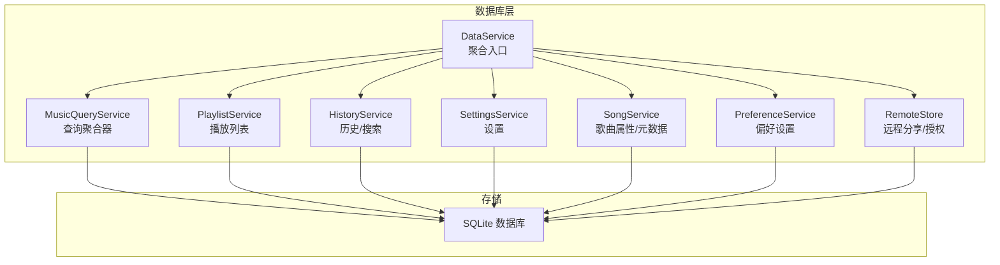
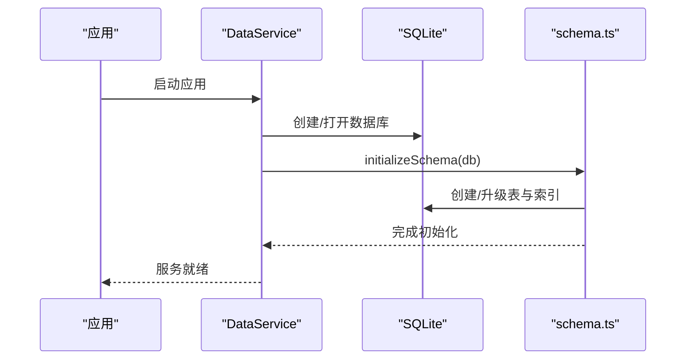
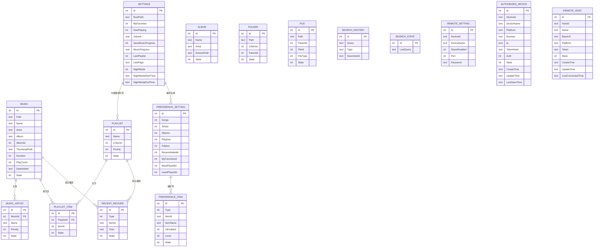
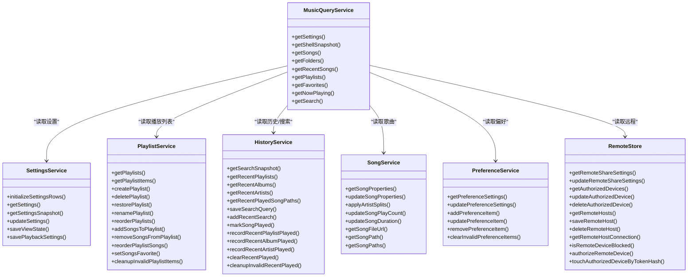
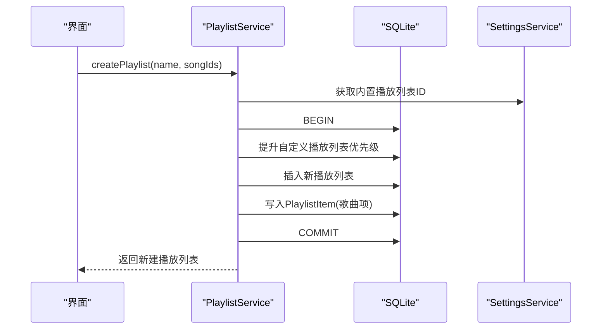
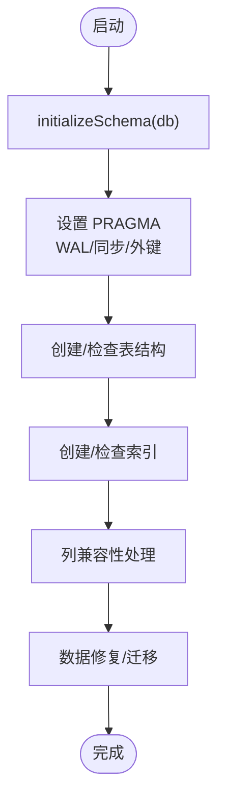
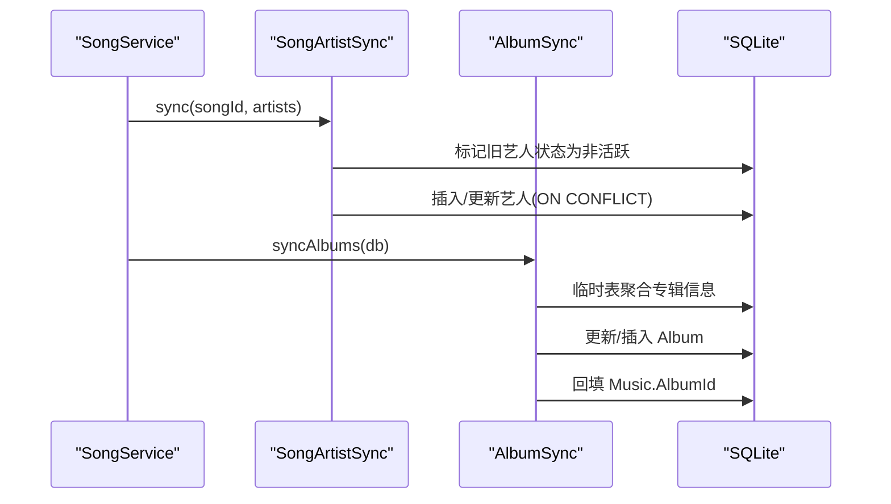
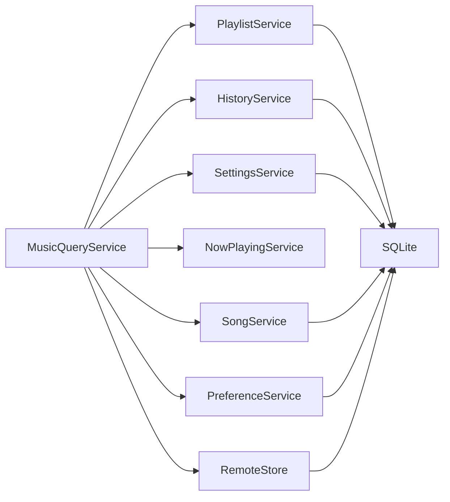

# 数据库系统

<cite>
**本文引用的文件**
- [schema.ts](file://electron/services/schema.ts)
- [row-mappers.ts](file://electron/services/row-mappers.ts)
- [data-service.ts](file://electron/services/data-service.ts)
- [playlist-service.ts](file://electron/services/playlist-service.ts)
- [history-service.ts](file://electron/services/history-service.ts)
- [settings-service.ts](file://electron/services/settings-service.ts)
- [song-service.ts](file://electron/services/song-service.ts)
- [music-query-service.ts](file://electron/services/music-query-service.ts)
- [remote-store.ts](file://electron/services/remote-store.ts)
- [constants.ts](file://electron/services/constants.ts)
- [album-sync.ts](file://electron/services/album-sync.ts)
- [song-artist-sync.ts](file://electron/services/song-artist-sync.ts)
- [preference-service.ts](file://electron/services/preference-service.ts)
- [contracts.ts](file://src/shared/contracts.ts)
</cite>

## 目录
1. [简介](#简介)
2. [项目结构](#项目结构)
3. [核心组件](#核心组件)
4. [架构总览](#架构总览)
5. [详细组件分析](#详细组件分析)
6. [依赖分析](#依赖分析)
7. [性能考虑](#性能考虑)
8. [故障排查指南](#故障排查指南)
9. [结论](#结论)
10. [附录](#附录)

## 简介
本文件系统性梳理 SMPlayer 的数据库设计与实现，覆盖 SQLite 表结构、字段定义、索引策略、约束关系；数据模型与实体关系；数据访问层（RowMappers、查询优化、事务处理）；数据库迁移与版本管理；本地与远程数据同步策略；性能优化建议与调试维护方法。目标是帮助开发者快速理解并高效扩展数据库层。

## 项目结构
数据库层位于 Electron 主进程的服务模块中，采用“按职责分层”的组织方式：
- 初始化与迁移：schema.ts
- 数据访问与查询：data-service.ts、music-query-service.ts、playlist-service.ts、history-service.ts、settings-service.ts、song-service.ts、preference-service.ts、remote-store.ts
- 映射与契约：row-mappers.ts、contracts.ts
- 常量与同步：constants.ts、album-sync.ts、song-artist-sync.ts

图表来源
- [data-service.ts:39-145](file://electron/services/data-service.ts#L39-L145)
- [music-query-service.ts:50-165](file://electron/services/music-query-service.ts#L50-L165)
- [playlist-service.ts:9-145](file://electron/services/playlist-service.ts#L9-L145)
- [history-service.ts:30-182](file://electron/services/history-service.ts#L30-L182)
- [settings-service.ts:61-179](file://electron/services/settings-service.ts#L61-L179)
- [song-service.ts:17-56](file://electron/services/song-service.ts#L17-L56)
- [preference-service.ts:44-139](file://electron/services/preference-service.ts#L44-L139)
- [remote-store.ts:49-115](file://electron/services/remote-store.ts#L49-L115)

章节来源
- [data-service.ts:39-145](file://electron/services/data-service.ts#L39-L145)

## 核心组件
- 数据库初始化与迁移：schema.ts 负责创建/升级表结构、索引、列兼容性处理，并在启动时执行必要的数据修复与迁移逻辑。
- 查询聚合器：music-query-service.ts 将多表数据整合为前端可用的 LibraryShellSnapshot/MusicData 结构。
- 播放列表：playlist-service.ts 提供播放列表 CRUD、排序、收藏等操作，使用事务保证一致性。
- 历史与搜索：history-service.ts 维护最近播放、最近搜索、搜索状态等。
- 设置：settings-service.ts 提供应用设置的读写与映射。
- 歌曲：song-service.ts 处理歌曲属性更新、时长解析、艺术家同步与专辑同步。
- 偏好：preference-service.ts 管理用户偏好的实体与等级。
- 远程：remote-store.ts 管理远程分享、授权设备、远端主机连接信息。
- Row 映射：row-mappers.ts 将数据库行转换为前端契约对象。
- 常量与同步：constants.ts 定义状态值与常量；album-sync.ts、song-artist-sync.ts 执行批量同步任务。

章节来源
- [schema.ts:33-364](file://electron/services/schema.ts#L33-L364)
- [music-query-service.ts:50-165](file://electron/services/music-query-service.ts#L50-L165)
- [playlist-service.ts:9-145](file://electron/services/playlist-service.ts#L9-L145)
- [history-service.ts:30-182](file://electron/services/history-service.ts#L30-L182)
- [settings-service.ts:61-179](file://electron/services/settings-service.ts#L61-L179)
- [song-service.ts:17-56](file://electron/services/song-service.ts#L17-L56)
- [preference-service.ts:44-139](file://electron/services/preference-service.ts#L44-L139)
- [remote-store.ts:49-115](file://electron/services/remote-store.ts#L49-L115)
- [row-mappers.ts:1-87](file://electron/services/row-mappers.ts#L1-L87)
- [constants.ts:1-28](file://electron/services/constants.ts#L1-L28)
- [album-sync.ts:1-83](file://electron/services/album-sync.ts#L1-L83)
- [song-artist-sync.ts:1-39](file://electron/services/song-artist-sync.ts#L1-L39)

## 架构总览
数据库层通过 DataService 聚合各服务，统一管理数据库连接、事务与生命周期。schema.ts 在启动时完成初始化与迁移，确保表结构与索引满足运行需求。各业务服务围绕核心表进行增删改查与关联查询，最终由 music-query-service.ts 输出统一的数据视图。

图表来源
- [data-service.ts:64-72](file://electron/services/data-service.ts#L64-L72)
- [schema.ts:33-364](file://electron/services/schema.ts#L33-L364)

## 详细组件分析

### 数据模型与实体关系
核心表与关系如下：
- Settings：应用全局设置，单行主键（Id=1）。
- Music：本地音乐条目，包含路径、标题、艺人、专辑、时长、播放计数、添加时间等。
- Album：专辑条目，包含名称、艺人、封面路径、状态。
- MusicArtist：歌曲与艺人多对多中间表，支持优先级与状态。
- Folder/File：本地文件夹与文件索引。
- Playlist/PlaylistItem：播放列表与歌曲项，支持状态与顺序。
- PreferenceSetting/PreferenceItem：用户偏好设置与实体偏好。
- RecentRecord/SearchHistory/SearchState：最近播放、搜索历史与当前搜索状态。
- RemoteSetting/AuthorizedDevice/RemoteHost：远程分享与授权/远端主机信息。

图表来源
- [schema.ts:39-233](file://electron/services/schema.ts#L39-L233)
- [schema.ts:235-260](file://electron/services/schema.ts#L235-L260)
- [schema.ts:262-290](file://electron/services/schema.ts#L262-L290)
- [schema.ts:291-322](file://electron/services/schema.ts#L291-L322)
- [schema.ts:324-360](file://electron/services/schema.ts#L324-L360)

章节来源
- [schema.ts:39-233](file://electron/services/schema.ts#L39-L233)
- [schema.ts:235-260](file://electron/services/schema.ts#L235-L260)
- [schema.ts:262-290](file://electron/services/schema.ts#L262-L290)
- [schema.ts:291-322](file://electron/services/schema.ts#L291-L322)
- [schema.ts:324-360](file://electron/services/schema.ts#L324-L360)

### 数据访问层与 Row 映射
- Row 映射：row-mappers.ts 将数据库行转换为前端契约对象（如 LibraryPlaylist、SearchHistoryEntry、SongArtistRow 等），并进行类型校验与默认值处理。
- 查询聚合：music-query-service.ts 聚合歌曲、播放列表、最近播放、搜索、设置等数据，输出 LibraryShellSnapshot/MusicData。
- 事务控制：playlist-service.ts、history-service.ts、song-service.ts、preference-service.ts、remote-store.ts 在涉及多步写入或一致性要求高的场景使用 BEGIN/COMMIT/ROLLBACK。

图表来源
- [music-query-service.ts:50-165](file://electron/services/music-query-service.ts#L50-L165)
- [playlist-service.ts:9-145](file://electron/services/playlist-service.ts#L9-L145)
- [history-service.ts:30-182](file://electron/services/history-service.ts#L30-L182)
- [settings-service.ts:61-179](file://electron/services/settings-service.ts#L61-L179)
- [song-service.ts:17-56](file://electron/services/song-service.ts#L17-L56)
- [preference-service.ts:44-139](file://electron/services/preference-service.ts#L44-L139)
- [remote-store.ts:49-115](file://electron/services/remote-store.ts#L49-L115)

章节来源
- [row-mappers.ts:1-87](file://electron/services/row-mappers.ts#L1-L87)
- [music-query-service.ts:50-165](file://electron/services/music-query-service.ts#L50-L165)
- [playlist-service.ts:171-201](file://electron/services/playlist-service.ts#L171-L201)
- [history-service.ts:232-261](file://electron/services/history-service.ts#L232-L261)
- [song-service.ts:155-203](file://electron/services/song-service.ts#L155-L203)
- [preference-service.ts:141-171](file://electron/services/preference-service.ts#L141-L171)
- [remote-store.ts:56-87](file://electron/services/remote-store.ts#L56-L87)

### 查询流程与事务处理示例
以“创建自定义播放列表”为例，展示事务与多表协作：

图表来源
- [playlist-service.ts:171-201](file://electron/services/playlist-service.ts#L171-L201)

章节来源
- [playlist-service.ts:171-201](file://electron/services/playlist-service.ts#L171-L201)

### 数据库迁移与版本管理
- 启动迁移：initializeSchema(db) 中执行 PRAGMA 设置、建表、建索引、列兼容性处理、数据修复与迁移。
- 列兼容性：addColumnIfMissing/renameColumnIfPresent 确保旧版本字段向后兼容。
- 索引重建：对 SearchHistory 的 Type 字段进行重命名与唯一索引重建，保证查询效率与去重。
- 特殊迁移：将 Music 的 Artist 同步到 MusicArtist；将 RecentRecord 的歌曲记录迁移到 SearchHistory。

图表来源
- [schema.ts:33-364](file://electron/services/schema.ts#L33-L364)

章节来源
- [schema.ts:33-364](file://electron/services/schema.ts#L33-L364)

### 数据同步机制（本地与远程）
- 本地专辑/艺人同步：album-sync.ts 基于临时表聚合专辑信息，更新 Album 并回填 Music.AlbumId；song-artist-sync.ts 基于歌曲更新艺人集合。
- 远程分享：remote-store.ts 管理 RemoteSetting、AuthorizedDevice、RemoteHost；提供授权设备认证、远端主机连接、令牌刷新与最后在线时间维护。
- 时间戳兼容：统一使用 ISO 8601 存储，支持 .NET Ticks 转换。

图表来源
- [song-service.ts:196-198](file://electron/services/song-service.ts#L196-L198)
- [song-artist-sync.ts:26-31](file://electron/services/song-artist-sync.ts#L26-L31)
- [album-sync.ts:3-82](file://electron/services/album-sync.ts#L3-L82)

章节来源
- [song-service.ts:196-198](file://electron/services/song-service.ts#L196-L198)
- [song-artist-sync.ts:26-31](file://electron/services/song-artist-sync.ts#L26-L31)
- [album-sync.ts:3-82](file://electron/services/album-sync.ts#L3-L82)
- [remote-store.ts:302-375](file://electron/services/remote-store.ts#L302-L375)

## 依赖分析
- 低耦合高内聚：各服务围绕单一职责（播放列表、历史、设置、歌曲、偏好、远程）封装，通过 DataService 聚合。
- 外键与状态：MusicArtist、PlaylistItem、Album 等表通过 State 字段实现软删除；MusicArtist 使用外键级联删除。
- 查询依赖：music-query-service.ts 依赖 settings-service、playlist-service、history-service、now-playing-service、song-service 的结果进行组装。

图表来源
- [music-query-service.ts:63-74](file://electron/services/music-query-service.ts#L63-L74)
- [playlist-service.ts:25-27](file://electron/services/playlist-service.ts#L25-L27)
- [history-service.ts:51-52](file://electron/services/history-service.ts#L51-L52)
- [settings-service.ts:70-71](file://electron/services/settings-service.ts#L70-L71)
- [song-service.ts:25-26](file://electron/services/song-service.ts#L25-L26)
- [preference-service.ts:47-48](file://electron/services/preference-service.ts#L47-L48)
- [remote-store.ts:52-53](file://electron/services/remote-store.ts#L52-L53)

章节来源
- [music-query-service.ts:63-74](file://electron/services/music-query-service.ts#L63-L74)

## 性能考虑
- 索引策略
  - 唯一索引：Music.Path、Album.Name(NOCASE)、MusicArtist(MusicId, Name NOSCASE)、Folder.Path、File.Path、SearchHistory(Query NOSCASE, Type)、HiddenStorageItem(Type, Path)、RemoteSetting.DeviceId、RemoteHost.HostId。
  - 普通索引：MusicArtist.Name NOSCASE、MusicArtist.MusicId、Folder.ParentId、File.ParentId、PlaylistItem.PlaylistId、PlaylistItem.ItemId、RecentRecord.Type、PreferenceItem.Type_Item、SearchHistory.SearchedAt。
- 查询优化
  - 使用参数化查询与预编译语句（prepare/run），避免字符串拼接引发 SQL 注入与解析开销。
  - 分组/聚合查询中使用合适的索引（如 NOCASE 排序、Type 过滤）。
  - 避免一次性大范围扫描，使用 LIMIT 限制最近记录数量（如 RECENT_PLAYED_LIMIT）。
- 事务与批处理
  - 对多步写入使用事务（BEGIN/COMMIT/ROLLBACK），减少锁竞争与不一致风险。
  - 使用批量插入/更新（如 PlaylistItem 批量写入、SongArtist 批量 Upsert）。
- 缓存策略
  - 前端缓存 LibraryShellSnapshot/MusicData，减少重复查询。
  - 专辑/艺人同步使用临时表，降低全表扫描成本。
- WAL 模式
  - PRAGMA journal_mode=WAL 提升并发读写性能，适合桌面应用场景。

章节来源
- [schema.ts:238-260](file://electron/services/schema.ts#L238-L260)
- [playlist-service.ts:437-486](file://electron/services/playlist-service.ts#L437-L486)
- [song-artist-sync.ts:11-24](file://electron/services/song-artist-sync.ts#L11-L24)
- [album-sync.ts:3-82](file://electron/services/album-sync.ts#L3-L82)
- [music-query-service.ts:37-40](file://electron/services/music-query-service.ts#L37-L40)

## 故障排查指南
- 启动失败或表缺失
  - 检查 initializeSchema 是否成功执行，确认 PRAGMA 设置、建表、建索引是否完成。
  - 关注列兼容性处理（addColumnIfMissing/renameColumnIfPresent）是否正确执行。
- 数据不一致或异常
  - 播放列表/历史/歌曲更新需使用事务，检查是否存在未提交的事务或回滚逻辑。
  - 使用 cleanupInvalid* 方法清理无效关联（如 PlaylistItem、RecentRecord）。
- 时间戳显示异常
  - 检查 normalizeStoredDate 与 dotNetTicksToIso 的转换逻辑，确保输入格式正确。
- 远程连接问题
  - 校验 AuthorizedDevice 的 Auth 状态与 TokenHash，确认 touchAuthorizedDeviceByTokenHash 是否成功刷新 LastSeenTime。
- 性能问题
  - 使用 EXPLAIN QUERY PLAN 分析慢查询，确认索引是否命中。
  - 对高频查询增加或调整索引，避免全表扫描。

章节来源
- [schema.ts:33-364](file://electron/services/schema.ts#L33-L364)
- [playlist-service.ts:171-201](file://electron/services/playlist-service.ts#L171-L201)
- [history-service.ts:332-338](file://electron/services/history-service.ts#L332-L338)
- [remote-store.ts:377-398](file://electron/services/remote-store.ts#L377-L398)
- [music-query-service.ts:359-416](file://electron/services/music-query-service.ts#L359-L416)

## 结论
SMPlayer 的数据库系统以 SQLite 为核心，采用清晰的分层设计与严格的事务控制，结合完善的索引策略与迁移机制，实现了稳定的本地音乐库管理与远程分享能力。通过 Row 映射与查询聚合，前端可获得一致、高效的音乐数据视图。建议在后续迭代中持续关注查询计划与索引命中情况，配合 WAL 模式与批量写入，进一步提升性能与稳定性。

## 附录
- 数据库文件名：SMPlayerSettings.db（常量定义见 constants.ts）
- 支持的音频扩展名集合（用于扫描与过滤）
- 前端契约类型（LibrarySong/LibraryPlaylist/SettingsSnapshot 等）定义于 contracts.ts

章节来源
- [constants.ts:1-15](file://electron/services/constants.ts#L1-L15)
- [contracts.ts:36-193](file://src/shared/contracts.ts#L36-L193)