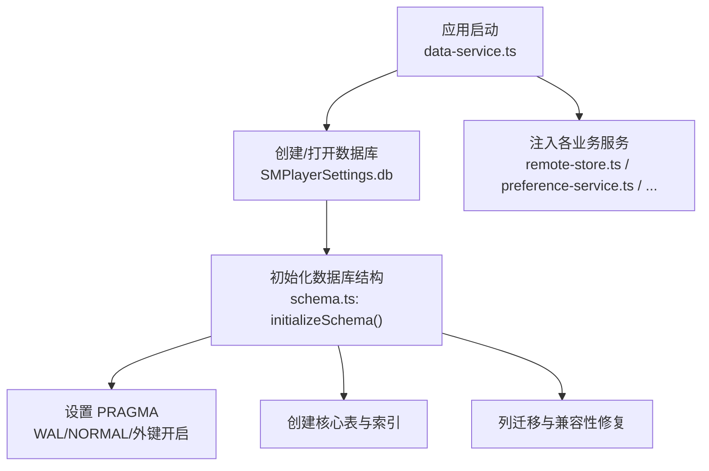
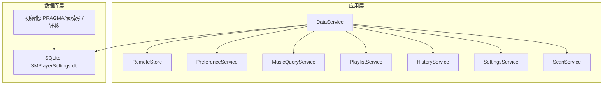
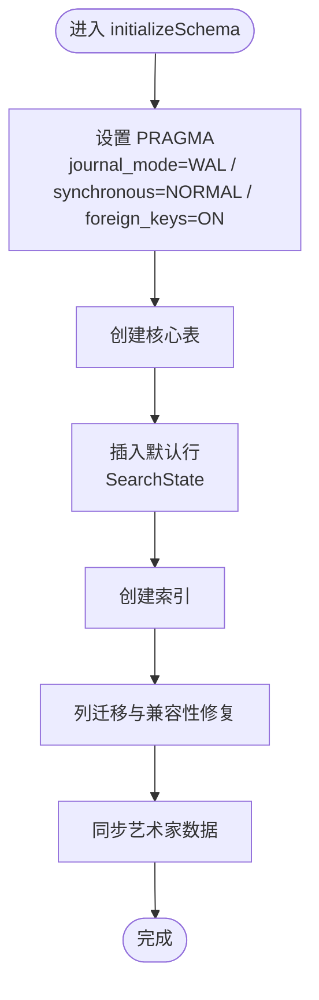
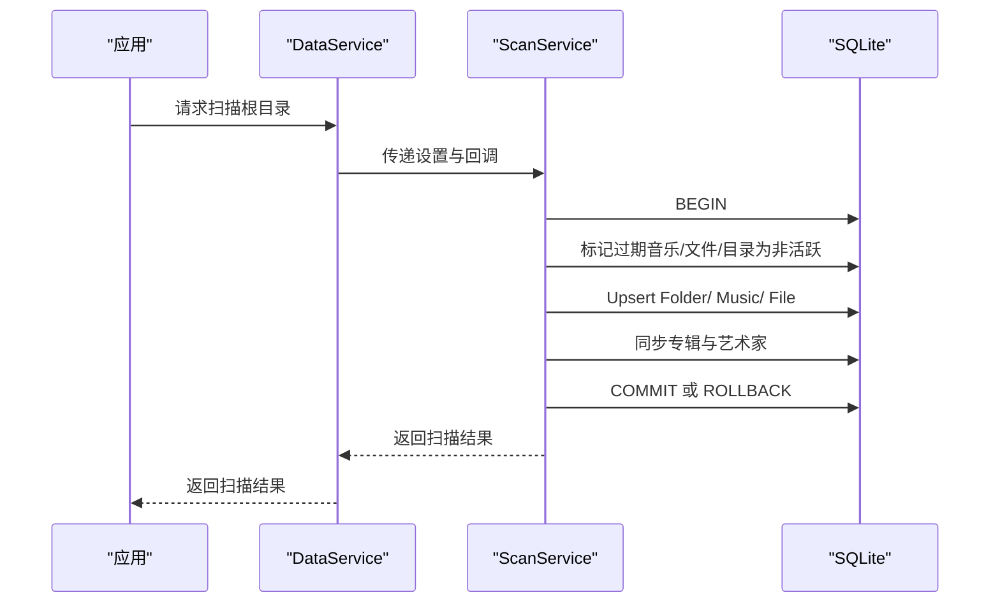
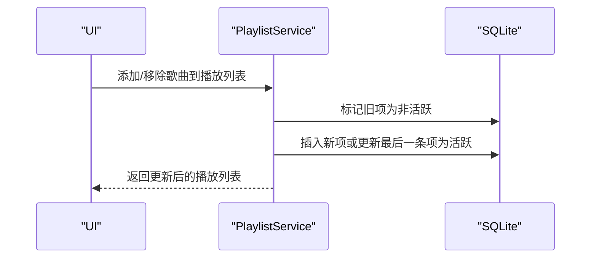
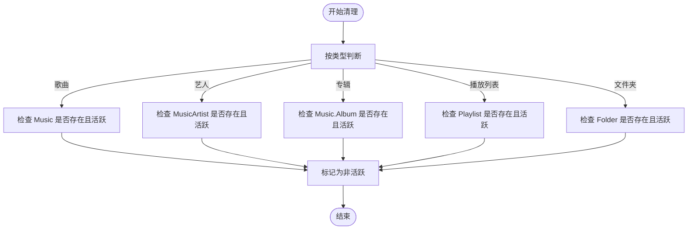
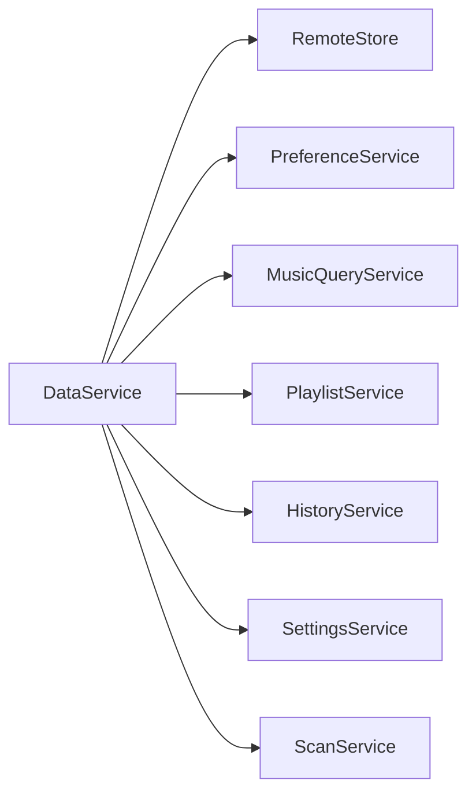

# 数据库设计

<cite>
**本文引用的文件**
- [schema.ts](file://electron/services/schema.ts)
- [data-service.ts](file://electron/services/data-service.ts)
- [remote-store.ts](file://electron/services/remote-store.ts)
- [preference-service.ts](file://electron/services/preference-service.ts)
- [music-query-service.ts](file://electron/services/music-query-service.ts)
- [playlist-service.ts](file://electron/services/playlist-service.ts)
- [history-service.ts](file://electron/services/history-service.ts)
- [settings-service.ts](file://electron/services/settings-service.ts)
- [scan-service.ts](file://electron/services/scan-service.ts)
- [constants.ts](file://electron/services/constants.ts)
- [row-mappers.ts](file://electron/services/row-mappers.ts)
</cite>

## 目录
1. [简介](#简介)
2. [项目结构与数据库入口](#项目结构与数据库入口)
3. [核心组件与职责](#核心组件与职责)
4. [架构总览](#架构总览)
5. [详细组件分析](#详细组件分析)
6. [依赖关系分析](#依赖关系分析)
7. [性能与优化建议](#性能与优化建议)
8. [故障排查指南](#故障排查指南)
9. [结论](#结论)
10. [附录：表结构与索引清单](#附录表结构与索引清单)

## 简介
本文件系统性梳理 SMPlayer 的 SQLite 数据库设计，覆盖数据库初始化与 PRAGMA 配置、核心表结构与关系、索引策略、版本迁移与兼容性处理、以及性能优化与最佳实践。目标是帮助开发者快速理解并维护数据库层。

## 项目结构与数据库入口
- 数据库文件名由常量定义，位于用户数据目录下，文件名为 SMPlayerSettings.db。
- 应用启动时通过数据服务创建或打开数据库连接，并在首次运行时初始化数据库结构与默认行。
- 初始化流程中设置 WAL 模式、同步级别、外键约束，并创建所有业务表及索引，同时执行列迁移与兼容性修复。

图表来源
- [data-service.ts:64-71](file://electron/services/data-service.ts#L64-L71)
- [schema.ts:33-363](file://electron/services/schema.ts#L33-L363)

章节来源
- [constants.ts:1](file://electron/services/constants.ts#L1)
- [data-service.ts:64-71](file://electron/services/data-service.ts#L64-L71)
- [schema.ts:33-363](file://electron/services/schema.ts#L33-L363)

## 核心组件与职责
- 数据服务（DataService）
  - 负责数据库连接生命周期管理、初始化与清理、以及各业务服务的装配。
  - 提供数据库刷新与关闭能力。
- 模式初始化（initializeSchema）
  - 设置 PRAGMA 参数、创建表、索引、默认行、执行列迁移与兼容性修复。
- 远程存储（RemoteStore）
  - 管理远程分享设置、授权设备、远程主机信息的增删改查。
- 偏好设置（PreferenceService）
  - 维护“显示偏好”设置与条目，支持启用/禁用、层级、有效性校验与清理。
- 查询服务（MusicQueryService）
  - 提供音乐库快照、统计、最近播放、搜索历史等查询接口。
- 播放列表（PlaylistService）
  - 管理内置与自定义播放列表、歌曲排序与项管理、失效项清理。
- 历史记录（HistoryService）
  - 维护搜索历史、最近播放记录、最近专辑/艺术家/播放列表等。
- 设置服务（SettingsService）
  - 应用设置的读写、映射与快照转换。
- 扫描服务（ScanService）
  - 全量/增量扫描音乐库，Upsert 音乐、文件、文件夹，同步专辑与艺术家。

章节来源
- [data-service.ts:39-198](file://electron/services/data-service.ts#L39-L198)
- [schema.ts:33-363](file://electron/services/schema.ts#L33-L363)
- [remote-store.ts:49-525](file://electron/services/remote-store.ts#L49-L525)
- [preference-service.ts:44-402](file://electron/services/preference-service.ts#L44-L402)
- [music-query-service.ts:50-418](file://electron/services/music-query-service.ts#L50-L418)
- [playlist-service.ts:9-508](file://electron/services/playlist-service.ts#L9-L508)
- [history-service.ts:30-484](file://electron/services/history-service.ts#L30-L484)
- [settings-service.ts:61-577](file://electron/services/settings-service.ts#L61-L577)
- [scan-service.ts:65-800](file://electron/services/scan-service.ts#L65-L800)

## 架构总览
数据库层围绕“初始化—表结构—索引—迁移—业务服务”的主线展开。业务服务通过统一的数据库连接进行读写，查询服务负责聚合与映射，扫描服务负责批量写入与一致性维护。

图表来源
- [data-service.ts:39-198](file://electron/services/data-service.ts#L39-L198)
- [schema.ts:33-363](file://electron/services/schema.ts#L33-L363)

## 详细组件分析

### 数据库初始化与 PRAGMA 配置
- PRAGMA 设置
  - 日志模式：WAL（写前日志，提升并发写入与读写分离）
  - 同步级别：NORMAL（平衡性能与可靠性）
  - 外键约束：开启（保证参照完整性）
- 表与索引创建
  - 在首次运行时创建所有核心表与索引；对部分表补充唯一索引以避免重复。
- 列迁移与兼容性修复
  - 动态检测并添加缺失列，重命名列，修正旧数据类型与默认值。
  - 对搜索历史类型进行规范化与索引重建。
- 默认行插入
  - 插入默认搜索状态行，确保查询侧无需判空。

图表来源
- [schema.ts:33-363](file://electron/services/schema.ts#L33-L363)

章节来源
- [schema.ts:33-363](file://electron/services/schema.ts#L33-L363)

### 核心表设计与关系

#### Settings（应用设置）
- 设计理念：集中存储应用行为与视图状态，如主题色、夜间模式、通知策略、播放进度、本地视图模式等。
- 主键：自增整型 Id。
- 约束：无显式外键；通过 Id=1 的默认行保障存在性。
- 关系：被多个服务读取与更新，作为全局配置中心。

章节来源
- [schema.ts:39-83](file://electron/services/schema.ts#L39-L83)
- [settings-service.ts:61-293](file://electron/services/settings-service.ts#L61-L293)

#### Music（音乐条目）
- 设计理念：存储音频文件路径、标题、艺人、专辑、缩略图路径、时长、播放次数、添加时间、状态等。
- 主键：自增整型 Id。
- 唯一索引：Path（唯一），防止重复扫描导致的数据冗余。
- 外键：无直接外键；AlbumId 字段用于关联专辑，但未声明外键约束。
- 关系：被 PlaylistItem、HistoryService、ScanService 等广泛引用。

章节来源
- [schema.ts:85-97](file://electron/services/schema.ts#L85-L97)
- [scan-service.ts:102-118](file://electron/services/scan-service.ts#L102-L118)

#### Album（专辑）
- 设计理念：按名称与艺人聚合专辑元数据，支持封面路径与状态。
- 主键：自增整型 Id。
- 唯一索引：Name（大小写不敏感），避免重复专辑。
- 关系：与 Music 通过 AlbumId 关联（非外键）。

章节来源
- [schema.ts:99-105](file://electron/services/schema.ts#L99-L105)
- [scan-service.ts:268](file://electron/services/scan-service.ts#L268)

#### MusicArtist（音乐与艺人多对多中间表）
- 设计理念：将 Music 与艺人名解耦，支持多艺人歌曲拆分与优先级排序。
- 主键：自增整型 Id。
- 复合唯一索引：(MusicId, Name COLLATE NOCASE)，避免重复艺人条目。
- 外键：MusicId 引用 Music(Id)，删除时级联（CASCADE）。
- 关系：被 PreferenceService、HistoryService、ScanService 使用。

章节来源
- [schema.ts:107-114](file://electron/services/schema.ts#L107-L114)
- [preference-service.ts:63-90](file://electron/services/preference-service.ts#L63-L90)
- [scan-service.ts:656](file://electron/services/scan-service.ts#L656)

#### Folder（文件夹）
- 设计理念：记录扫描到的目录结构，支持父子关系与筛选条件。
- 主键：自增整型 Id。
- 唯一索引：Path（唯一），避免重复目录。
- 关系：与 File 通过 ParentId 关联；被 ScanService 写入。

章节来源
- [schema.ts:116-122](file://electron/services/schema.ts#L116-L122)
- [scan-service.ts:595-614](file://electron/services/scan-service.ts#L595-L614)

#### File（文件）
- 设计理念：记录音频文件与其父目录、文件 Id、类型与状态。
- 主键：自增整型 Id。
- 唯一索引：Path（唯一），避免重复文件。
- 关系：与 Folder 通过 ParentId 关联；与 Music 通过 FileId 关联。

章节来源
- [schema.ts:124-131](file://electron/services/schema.ts#L124-L131)
- [scan-service.ts:119-127](file://electron/services/scan-service.ts#L119-L127)

#### Playlist（播放列表）
- 设计理念：内置（我的最爱、正在播放）与自定义播放列表，支持排序与优先级。
- 主键：自增整型 Id。
- 关系：被 PlaylistService 管理；被 MusicQueryService 读取。

章节来源
- [schema.ts:133-139](file://electron/services/schema.ts#L133-L139)
- [playlist-service.ts:147-156](file://electron/services/playlist-service.ts#L147-L156)

#### PlaylistItem（播放列表项）
- 设计理念：多对多关系，记录播放列表中的歌曲顺序与状态。
- 主键：自增整型 Id。
- 复合索引：PlaylistId、ItemId；索引名示例：idx_playlist_item_playlist、idx_playlist_item_item。
- 关系：被 PlaylistService 与 MusicQueryService 使用。

章节来源
- [schema.ts:141-146](file://electron/services/schema.ts#L141-L146)
- [playlist-service.ts:158-164](file://electron/services/playlist-service.ts#L158-L164)

#### PreferenceSetting（偏好设置）
- 设计理念：控制各类实体（歌曲、艺人、专辑、播放列表、文件夹）是否在界面显示。
- 主键：自增整型 Id。
- 关系：被 PreferenceService 读取与更新。

章节来源
- [schema.ts:148-159](file://electron/services/schema.ts#L148-L159)
- [preference-service.ts:275-298](file://electron/services/preference-service.ts#L275-L298)

#### PreferenceItem（偏好条目）
- 设计理念：具体实体的启用/禁用、层级与有效性校验。
- 主键：自增整型 Id。
- 复合索引：Type+ItemId，便于快速定位与清理无效条目。
- 关系：被 PreferenceService 使用。

章节来源
- [schema.ts:161-169](file://electron/services/schema.ts#L161-L169)
- [preference-service.ts:51-123](file://electron/services/preference-service.ts#L51-L123)

#### RecentRecord（最近播放记录）
- 设计理念：记录歌曲、播放列表、专辑、艺人最近播放的时间戳，支持清理与查询。
- 主键：自增整型 Id。
- 索引：Type、Time；被 HistoryService 使用。
- 关系：被 HistoryService 读取与清理。

章节来源
- [schema.ts:171-177](file://electron/services/schema.ts#L171-L177)
- [history-service.ts:13-182](file://electron/services/history-service.ts#L13-L182)

#### SearchState（搜索状态）
- 设计理念：保存最后一次搜索内容，作为 UI 快捷入口。
- 主键：CHECK(Id=1) 的单行表。
- 关系：被 HistoryService 读取与更新。

章节来源
- [schema.ts:179-182](file://electron/services/schema.ts#L179-L182)
- [history-service.ts:53-62](file://electron/services/history-service.ts#L53-L62)

#### SearchHistory（搜索历史）
- 设计理念：记录搜索词、类型与时间，支持去重与清理。
- 主键：自增整型 Id。
- 复合唯一索引：(Query COLLATE NOCASE, Type)，避免重复搜索。
- 索引：SearchedAt（时间倒序查询）。
- 关系：被 HistoryService 管理。

章节来源
- [schema.ts:184-189](file://electron/services/schema.ts#L184-L189)
- [history-service.ts:63-85](file://electron/services/history-service.ts#L63-L85)

#### HiddenStorageItem（隐藏存储项）
- 设计理念：记录被用户隐藏的文件/文件夹路径，扫描时跳过。
- 主键：自增整型 Id。
- 复合唯一索引：(Type, Path)，避免重复。
- 关系：被 ScanService 读取与过滤。

章节来源
- [schema.ts:191-196](file://electron/services/schema.ts#L191-L196)
- [scan-service.ts:581-593](file://electron/services/scan-service.ts#L581-L593)

#### RemoteSetting（远程分享设置）
- 设计理念：设备标识、设备名、端口、密码、开关等。
- 主键：CHECK(Id=1) 的单行表。
- 关系：被 RemoteStore 读取与更新。

章节来源
- [schema.ts:198-205](file://electron/services/schema.ts#L198-L205)
- [remote-store.ts:56-115](file://electron/services/remote-store.ts#L56-L115)

#### AuthorizedDevice（授权设备）
- 设计理念：远端设备的授权状态、平台、浏览器、IP、Token 哈希、时间戳等。
- 主键：自增整型 Id。
- 唯一索引：DeviceId（非空时唯一）；索引：TokenHash。
- 关系：被 RemoteStore 管理。

章节来源
- [schema.ts:207-220](file://electron/services/schema.ts#L207-L220)
- [remote-store.ts:117-169](file://electron/services/remote-store.ts#L117-L169)

#### RemoteHost（远程主机）
- 设计理念：远端主机的标识、名称、基础地址、平台、Token、时间戳等。
- 主键：自增整型 Id。
- 唯一索引：HostId（非空时唯一）。
- 关系：被 RemoteStore 管理。

章节来源
- [schema.ts:222-233](file://electron/services/schema.ts#L222-L233)
- [remote-store.ts:171-263](file://electron/services/remote-store.ts#L171-L263)

### 索引策略与选择依据
- 唯一索引
  - Music.Path：保证文件路径唯一，避免重复扫描。
  - Album.Name（大小写不敏感）：避免重复专辑。
  - Folder.Path：避免重复目录。
  - File.Path：避免重复文件。
  - HiddenStorageItem.(Type, Path)：避免重复隐藏项。
  - SearchHistory.(Query, Type)：避免重复搜索历史。
  - RemoteSetting.Id（CHECK）：单行表约束。
  - AuthorizedDevice.DeviceId（非空时唯一）：设备唯一性。
  - RemoteHost.HostId（非空时唯一）：主机唯一性。
- 普通索引
  - MusicArtist.Name（大小写不敏感）、MusicId：加速艺人查询与关联。
  - MusicArtist.(MusicId, Name)：复合唯一，兼顾查询与去重。
  - Folder.ParentId、File.ParentId：加速父子关系查询。
  - PlaylistItem.(PlaylistId, ItemId)：加速播放列表项查询。
  - Playlist.Name：加速播放列表名称查询。
  - RecentRecord.Type：加速按类型检索最近记录。
  - PreferenceItem.(Type, ItemId)：加速偏好条目查询。
  - SearchHistory.SearchedAt：加速按时间倒序查询。
- 索引重建
  - 将旧类型 all 改为 sidebar 并重建唯一索引，确保查询一致性。

章节来源
- [schema.ts:238-299](file://electron/services/schema.ts#L238-L299)
- [history-service.ts:76-80](file://electron/services/history-service.ts#L76-L80)

### 版本管理与迁移机制
- 动态列管理
  - addColumnIfMissing：检测并添加缺失列，避免硬编码迁移脚本。
  - renameColumnIfPresent：安全重命名列，仅当旧列存在且新列不存在时执行。
- 默认值与兼容性
  - 对新增列设置合理默认值，确保旧版本数据平滑升级。
  - 修复搜索历史类型字段的默认值与索引冲突问题。
- 数据一致性修复
  - 同步艺术家数据：从 Music 表迁移/补全到 MusicArtist 表。
  - 清理无效最近播放与播放列表项：基于实体状态与存在性检查。
- 单行表约束
  - 使用 CHECK(Id=1) 约束限制 RemoteSetting、SearchState 等单行表。

章节来源
- [schema.ts:5-31](file://electron/services/schema.ts#L5-L31)
- [schema.ts:262-322](file://electron/services/schema.ts#L262-L322)
- [schema.ts:334-360](file://electron/services/schema.ts#L334-L360)
- [history-service.ts:101-112](file://electron/services/history-service.ts#L101-L112)
- [playlist-service.ts:58-76](file://electron/services/playlist-service.ts#L58-L76)

### 业务流程与调用序列

#### 扫描与 Upsert 流程

图表来源
- [data-service.ts:133-142](file://electron/services/data-service.ts#L133-L142)
- [scan-service.ts:239-288](file://electron/services/scan-service.ts#L239-L288)

#### 播放列表项变更流程

图表来源
- [playlist-service.ts:437-486](file://electron/services/playlist-service.ts#L437-L486)

#### 偏好条目有效性清理流程

图表来源
- [preference-service.ts:194-273](file://electron/services/preference-service.ts#L194-L273)

## 依赖关系分析
- 组件耦合
  - DataService 作为容器，装配 RemoteStore、PreferenceService、MusicQueryService、PlaylistService、HistoryService、SettingsService、ScanService。
  - 各服务通过统一的 DatabaseSync 实例访问数据库，降低耦合度。
- 外部依赖
  - node:sqlite 提供同步接口；Electron 环境下的 node 模块加载。
- 可能的循环依赖
  - 当前结构清晰，无明显循环依赖迹象。

图表来源
- [data-service.ts:39-198](file://electron/services/data-service.ts#L39-L198)

章节来源
- [data-service.ts:39-198](file://electron/services/data-service.ts#L39-L198)

## 性能与优化建议
- WAL 模式与同步级别
  - 已采用 WAL 与 NORMAL 同步，适合桌面应用的读写混合场景；如需更强一致性可考虑 PRAGMA synchronous = FULL。
- 索引优化
  - 为高频查询字段建立合适索引；避免过度索引导致写入成本上升。
  - 对大小写不敏感查询使用 COLLATE NOCASE，注意索引选择性与存储开销。
- 批量写入
  - 扫描与播放列表项变更均使用事务（BEGIN/COMMIT），显著降低写放大。
- 数据清理
  - 定期清理无效最近记录与播放列表项，保持表规模可控。
- 查询优化
  - 使用 EXISTS/JOIN 代替子查询，减少不必要的全表扫描。
  - 对时间字段使用索引，避免函数包裹导致的索引失效。

[本节为通用建议，无需特定文件引用]

## 故障排查指南
- 数据库无法打开
  - 检查用户数据目录权限与磁盘空间；确认数据库文件名一致。
- 初始化失败
  - 查看 PRAGMA 设置与表创建语句；确认权限与磁盘可用空间。
- 重复数据
  - 检查唯一索引是否生效；确认 Upsert 逻辑是否正确。
- 查询异常
  - 检查索引是否存在；确认 COLLATE 使用是否一致。
- 迁移失败
  - 检查列迁移函数与默认值；确认旧数据类型兼容性。

章节来源
- [schema.ts:33-363](file://electron/services/schema.ts#L33-L363)
- [scan-service.ts:239-288](file://electron/services/scan-service.ts#L239-L288)
- [playlist-service.ts:58-76](file://electron/services/playlist-service.ts#L58-L76)

## 结论
SMPlayer 的数据库设计遵循“初始化即完整、迁移即兼容、索引即高效”的原则。通过 WAL、外键与唯一索引保障一致性与性能，配合动态列迁移与数据修复流程，确保长期演进的稳定性。业务服务围绕统一的数据库连接协作，形成清晰的职责边界与可维护性。

[本节为总结，无需特定文件引用]

## 附录：表结构与索引清单
- Settings：应用设置中心，单行表约束。
- Music：音频文件元数据，唯一路径索引。
- Album：专辑元数据，唯一名称索引。
- MusicArtist：艺人中间表，复合唯一索引与外键。
- Folder：目录结构，唯一路径索引。
- File：文件记录，唯一路径索引。
- Playlist：播放列表，名称索引。
- PlaylistItem：播放列表项，复合索引。
- PreferenceSetting：偏好设置，单行表。
- PreferenceItem：偏好条目，复合索引。
- RecentRecord：最近记录，类型索引。
- SearchState：搜索状态，单行表。
- SearchHistory：搜索历史，复合唯一索引。
- HiddenStorageItem：隐藏项，复合唯一索引。
- RemoteSetting：远程设置，单行表。
- AuthorizedDevice：授权设备，唯一设备号与令牌索引。
- RemoteHost：远程主机，唯一主机标识索引。

章节来源
- [schema.ts:39-233](file://electron/services/schema.ts#L39-L233)
- [schema.ts:238-299](file://electron/services/schema.ts#L238-L299)