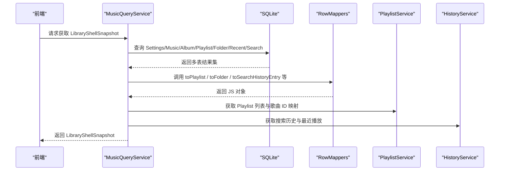
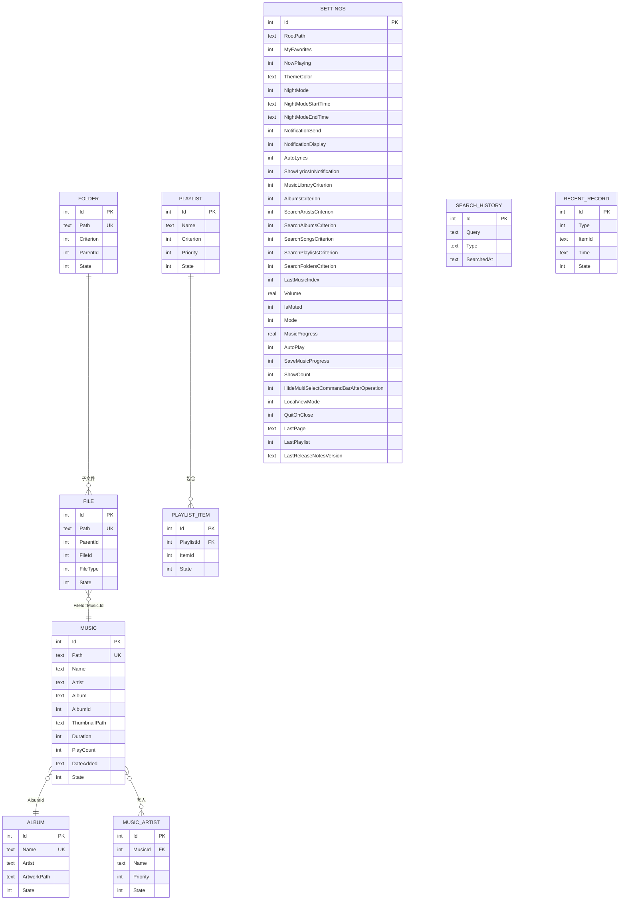
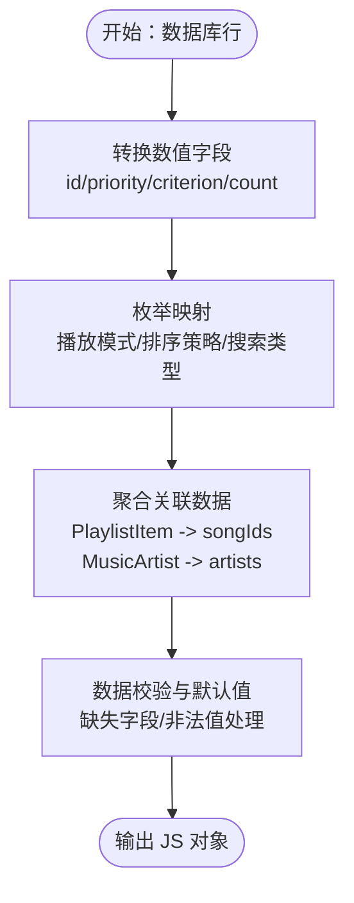
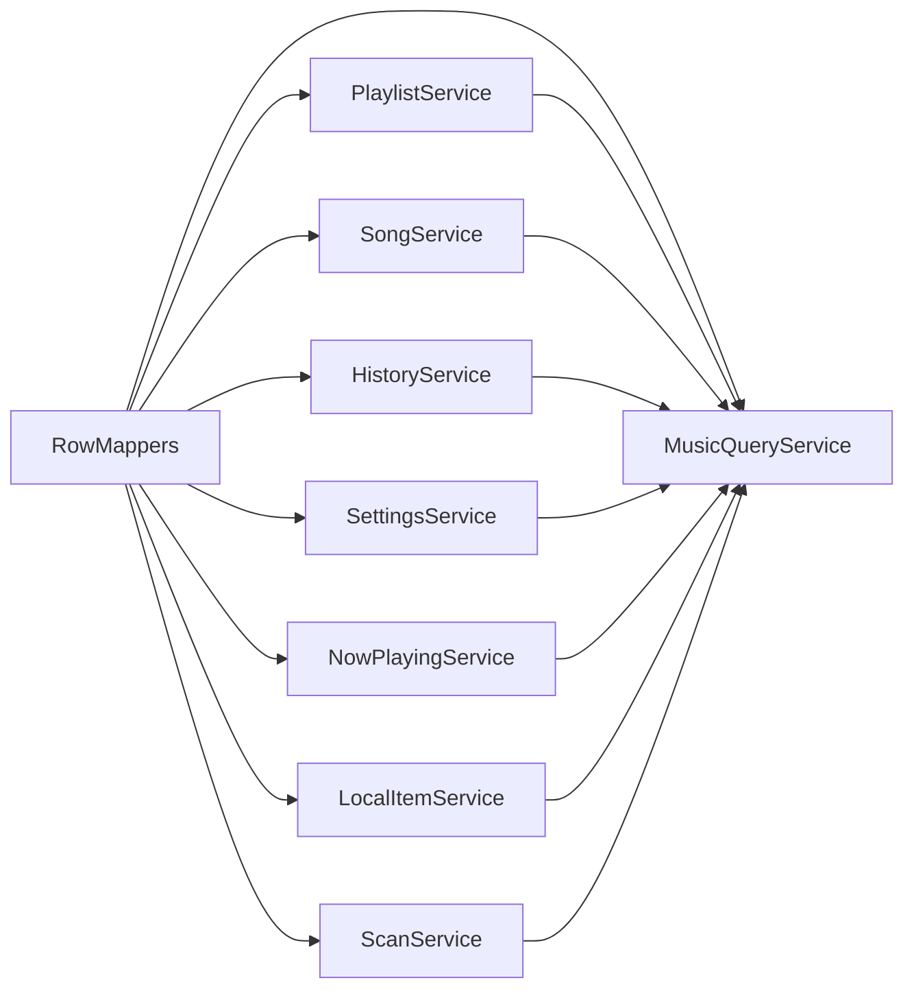

# 数据模型

<cite>
**本文引用的文件**
- [electron/services/schema.ts](file://electron/services/schema.ts)
- [electron/services/row-mappers.ts](file://electron/services/row-mappers.ts)
- [src/shared/contracts.ts](file://src/shared/contracts.ts)
- [electron/services/settings-service.ts](file://electron/services/settings-service.ts)
- [electron/services/music-query-service.ts](file://electron/services/music-query-service.ts)
- [electron/services/playlist-service.ts](file://electron/services/playlist-service.ts)
- [electron/services/song-service.ts](file://electron/services/song-service.ts)
- [electron/services/history-service.ts](file://electron/services/history-service.ts)
- [electron/services/now-playing-service.ts](file://electron/services/now-playing-service.ts)
- [electron/services/local-item-service.ts](file://electron/services/local-item-service.ts)
- [electron/services/scan-service.ts](file://electron/services/scan-service.ts)
- [electron/services/constants.ts](file://electron/services/constants.ts)
</cite>

## 目录
1. [简介](#简介)
2. [项目结构](#项目结构)
3. [核心组件](#核心组件)
4. [架构总览](#架构总览)
5. [详细组件分析](#详细组件分析)
6. [依赖分析](#依赖分析)
7. [性能考虑](#性能考虑)
8. [故障排查指南](#故障排查指南)
9. [结论](#结论)
10. [附录](#附录)

## 简介
本文件系统化梳理 SMPlayer 的数据模型与映射机制，覆盖核心实体（Music、Album、MusicArtist、Playlist、Folder、File、Settings）的结构、关系与生命周期；详解 RowMappers 将数据库记录映射为 JavaScript 对象的实现与数据转换策略；说明一对多、多对多关系的处理；给出序列化/反序列化与扩展性设计建议，并提供最佳实践与常见问题解决方案。

## 项目结构
SMPlayer 的数据层以 SQLite 作为持久化存储，通过服务类封装查询、更新与状态管理。数据模型在数据库表中定义，通过 RowMappers 转换为前端可用的 JS 对象；同时 SettingsService、MusicQueryService、PlaylistService、SongService 等服务协调数据读取、写入与业务逻辑。

```mermaid
graph TB
subgraph "数据库层"
T_Settings["Settings 表"]
T_Music["Music 表"]
T_Album["Album 表"]
T_MusicArtist["MusicArtist 表"]
T_Folder["Folder 表"]
T_File["File 表"]
T_Playlist["Playlist 表"]
T_PlaylistItem["PlaylistItem 表"]
T_SearchHistory["SearchHistory 表"]
T_RecentRecord["RecentRecord 表"]
end
subgraph "服务层"
S_Schema["Schema 初始化"]
S_RowMapper["RowMappers 映射器"]
S_Settings["SettingsService"]
S_MusicQuery["MusicQueryService"]
S_Playlist["PlaylistService"]
S_Song["SongService"]
S_History["HistoryService"]
S_NowPlaying["NowPlayingService"]
S_LocalItem["LocalItemService"]
S_Scan["ScanService"]
end
S_Schema --> T_Settings
S_Schema --> T_Music
S_Schema --> T_Album
S_Schema --> T_MusicArtist
S_Schema --> T_Folder
S_Schema --> T_File
S_Schema --> T_Playlist
S_Schema --> T_PlaylistItem
S_Schema --> T_SearchHistory
S_Schema --> T_RecentRecord
S_MusicQuery --> S_RowMapper
S_Playlist --> S_RowMapper
S_History --> S_RowMapper
S_Settings --> S_RowMapper
S_Song --> S_RowMapper
S_NowPlaying --> S_RowMapper
S_LocalItem --> S_RowMapper
S_Scan --> S_RowMapper
```

图表来源
- [electron/services/schema.ts:33-260](file://electron/services/schema.ts#L33-L260)
- [electron/services/row-mappers.ts:8-86](file://electron/services/row-mappers.ts#L8-L86)
- [electron/services/music-query-service.ts:50-165](file://electron/services/music-query-service.ts#L50-L165)
- [electron/services/settings-service.ts:61-179](file://electron/services/settings-service.ts#L61-L179)
- [electron/services/playlist-service.ts:9-145](file://electron/services/playlist-service.ts#L9-L145)
- [electron/services/song-service.ts:17-56](file://electron/services/song-service.ts#L17-L56)
- [electron/services/history-service.ts:30-50](file://electron/services/history-service.ts#L30-L50)
- [electron/services/now-playing-service.ts:6-24](file://electron/services/now-playing-service.ts#L6-L24)
- [electron/services/local-item-service.ts:22-41](file://electron/services/local-item-service.ts#L22-L41)
- [electron/services/scan-service.ts:65-129](file://electron/services/scan-service.ts#L65-L129)

章节来源
- [electron/services/schema.ts:33-260](file://electron/services/schema.ts#L33-L260)
- [electron/services/row-mappers.ts:8-86](file://electron/services/row-mappers.ts#L8-L86)

## 核心组件
- 数据库模式（Schema）：定义所有实体表及索引、约束、默认值与迁移逻辑，确保数据一致性与演进能力。
- RowMappers：将数据库行转换为应用内对象，执行类型转换、枚举映射与字段规范化。
- 服务层：
  - SettingsService：读取/写入 Settings 表，提供设置快照与值映射。
  - MusicQueryService：聚合查询 Music、Album、Playlist、Folder、SearchHistory、RecentRecord 等，构建 LibraryShell 与各视图数据。
  - PlaylistService：Playlist 及 PlaylistItem 的增删改查、排序、内置播放列表管理。
  - SongService：歌曲元数据读取、标签写入、时长与播放计数更新、艺术家同步。
  - HistoryService：搜索历史、最近播放记录、播放计数更新。
  - NowPlayingService：基于 PlaylistItem 或 JSON 文件恢复“正在播放”队列。
  - LocalItemService：本地文件夹/歌曲移动、重命名、隐藏与恢复、删除状态捕获与回滚。
  - ScanService：扫描音乐库、批量读取元数据、智能艺人拆分、UPSERT 写入、清理副作用。

章节来源
- [electron/services/settings-service.ts:61-293](file://electron/services/settings-service.ts#L61-L293)
- [electron/services/music-query-service.ts:50-417](file://electron/services/music-query-service.ts#L50-L417)
- [electron/services/playlist-service.ts:9-507](file://electron/services/playlist-service.ts#L9-L507)
- [electron/services/song-service.ts:17-296](file://electron/services/song-service.ts#L17-L296)
- [electron/services/history-service.ts:30-483](file://electron/services/history-service.ts#L30-L483)
- [electron/services/now-playing-service.ts:6-103](file://electron/services/now-playing-service.ts#L6-L103)
- [electron/services/local-item-service.ts:22-346](file://electron/services/local-item-service.ts#L22-L346)
- [electron/services/scan-service.ts:65-800](file://electron/services/scan-service.ts#L65-L800)

## 架构总览
数据模型围绕 SQLite 表展开，RowMappers 在查询后进行统一转换；服务层负责业务编排与事务控制；前端通过 IPC 获取 LibraryShellSnapshot 与各实体集合。

图表来源
- [electron/services/music-query-service.ts:171-180](file://electron/services/music-query-service.ts#L171-L180)
- [electron/services/row-mappers.ts:39-86](file://electron/services/row-mappers.ts#L39-L86)
- [electron/services/playlist-service.ts:147-164](file://electron/services/playlist-service.ts#L147-L164)
- [electron/services/history-service.ts:184-193](file://electron/services/history-service.ts#L184-L193)

## 详细组件分析

### 数据模型定义与关系
- Music（歌曲）
  - 字段：自增 Id、Path、Name、Artist、Album、AlbumId、ThumbnailPath、Duration、PlayCount、DateAdded、State
  - 关系：与 Album 多对一（AlbumId），与 MusicArtist 一对多（外键级联删除），与 File 一对一（File.FileId=Music.Id）
- Album（专辑）
  - 字段：自增 Id、Name、Artist、ArtworkPath、State
  - 关系：与 Music 多对一（AlbumId）
- MusicArtist（歌曲-艺人）
  - 字段：自增 Id、MusicId、Name、Priority、State（外键 Music.Id，CASCADE 删除）
  - 关系：与 Music 多对一
- Playlist（播放列表）
  - 字段：自增 Id、Name、Criterion、Priority、State
  - 关系：与 PlaylistItem 一对多
- PlaylistItem（播放列表项）
  - 字段：自增 Id、PlaylistId、ItemId、State
  - 关系：与 Playlist、Music 外键约束
- Folder（本地文件夹）
  - 字段：自增 Id、Path、Criterion、ParentId、State
  - 关系：父子层级（ParentId）
- File（本地文件）
  - 字段：自增 Id、Path、ParentId、FileId、FileType、State
  - 关系：与 Folder（ParentId）、Music（FileId=Music.Id）
- Settings（应用设置）
  - 字段：大量配置项（根目录、主题、夜间模式、通知、歌词源、排序策略、播放进度等）
- SearchHistory（搜索历史）
  - 字段：自增 Id、Query、Type、SearchedAt
- RecentRecord（最近播放记录）
  - 字段：自增 Id、Type、ItemId、Time、State

图表来源
- [electron/services/schema.ts:85-146](file://electron/services/schema.ts#L85-L146)
- [electron/services/schema.ts:191-233](file://electron/services/schema.ts#L191-L233)
- [electron/services/schema.ts:334-362](file://electron/services/schema.ts#L334-L362)

章节来源
- [electron/services/schema.ts:33-260](file://electron/services/schema.ts#L33-L260)

### RowMappers 实现机制
RowMappers 负责将数据库行转换为应用内的 JS 对象，执行以下任务：
- 类型转换：如字符串转数字（id、priority、criterion、count 等）
- 枚举映射：如播放模式、视图模式、歌词请求模式、排序策略、搜索类型等
- 字段规范化：去除空格、合并多艺人、标准化日期格式（含 .NET 时间戳）
- 复合对象组装：如将 PlaylistItem 打包为 songIds 列表，将 MusicArtist 按歌曲聚合为数组

关键映射函数：
- toSearchHistoryEntry：校验并映射搜索历史类型
- toFolder：映射文件夹路径与层级
- toPlaylistItemRow / toSongArtistRow：标准化中间表行
- toPlaylist：将 PlaylistRow 与歌曲映射、内置列表标记、排序策略映射

图表来源
- [electron/services/row-mappers.ts:35-86](file://electron/services/row-mappers.ts#L35-L86)
- [electron/services/music-query-service.ts:290-322](file://electron/services/music-query-service.ts#L290-L322)
- [electron/services/settings-service.ts:446-533](file://electron/services/settings-service.ts#L446-L533)

章节来源
- [electron/services/row-mappers.ts:35-86](file://electron/services/row-mappers.ts#L35-L86)
- [electron/services/music-query-service.ts:290-322](file://electron/services/music-query-service.ts#L290-L322)
- [electron/services/settings-service.ts:446-533](file://electron/services/settings-service.ts#L446-L533)

### 关联关系处理
- 一对多
  - Music → MusicArtist：按歌曲聚合艺人数组
  - Playlist → PlaylistItem：按列表聚合歌曲 ID 列表
  - Folder → File：父子关系
- 多对多
  - 通过中间表 PlaylistItem 实现：Playlist ↔ Music
- 级联与状态
  - MusicArtist 外键删除采用 CASCADE，保证艺人与歌曲解绑
  - 使用 State 字段表示激活/隐藏/父级隐藏，配合服务层状态同步

章节来源
- [electron/services/schema.ts:107-114](file://electron/services/schema.ts#L107-L114)
- [electron/services/music-query-service.ts:299-322](file://electron/services/music-query-service.ts#L299-L322)
- [electron/services/playlist-service.ts:437-486](file://electron/services/playlist-service.ts#L437-L486)

### 生命周期管理
- 创建
  - ScanService：扫描新增歌曲并 UPSERT Music/Album/File，自动建立艺人与文件引用
  - PlaylistService：创建自定义播放列表并插入初始歌曲
- 更新
  - SettingsService：批量更新设置项并映射为运行时快照
  - SongService：写入 ID3 标签并同步 Music 与 MusicArtist
  - HistoryService：记录最近播放与搜索历史
- 删除
  - PlaylistService：软删除播放列表与项（State）
  - LocalItemService：删除歌曲或文件，捕获删除状态用于撤销
  - ScanService：扫描移除的歌曲标记为非活跃

章节来源
- [electron/services/scan-service.ts:102-127](file://electron/services/scan-service.ts#L102-L127)
- [electron/services/playlist-service.ts:166-201](file://electron/services/playlist-service.ts#L166-L201)
- [electron/services/settings-service.ts:208-269](file://electron/services/settings-service.ts#L208-L269)
- [electron/services/song-service.ts:155-203](file://electron/services/song-service.ts#L155-L203)
- [electron/services/history-service.ts:291-330](file://electron/services/history-service.ts#L291-L330)
- [electron/services/local-item-service.ts:43-73](file://electron/services/local-item-service.ts#L43-L73)
- [electron/services/scan-service.ts:777-800](file://electron/services/scan-service.ts#L777-L800)

### 序列化与反序列化
- JSON 序列化
  - NowPlayingService：将歌曲路径序列化到 JSON 文件，用于跨进程/重启恢复播放队列
- 反序列化
  - MusicQueryService：从数据库或 JSON 中解析歌曲 ID，生成媒体/封面 URL
- 设置快照
  - SettingsService：将 SettingsRow 转换为 SettingsSnapshot，供前端直接使用

章节来源
- [electron/services/now-playing-service.ts:72-93](file://electron/services/now-playing-service.ts#L72-L93)
- [electron/services/music-query-service.ts:351-357](file://electron/services/music-query-service.ts#L351-L357)
- [electron/services/settings-service.ts:295-336](file://electron/services/settings-service.ts#L295-L336)

### 扩展性设计
- 新实体表
  - 在 Schema 中新增表与索引，遵循现有命名与状态字段规范
  - 提供对应的 RowMappers 函数与服务类方法
- 新关系
  - 通过中间表（如 PlaylistItem）实现多对多；或在主表添加外键实现一对多
  - 同步维护状态字段与索引
- 迁移与兼容
  - 使用列存在检查与重命名逻辑，避免破坏既有数据
  - 通过初始化脚本迁移旧数据至新结构

章节来源
- [electron/services/schema.ts:33-260](file://electron/services/schema.ts#L33-L260)
- [electron/services/constants.ts:1-28](file://electron/services/constants.ts#L1-L28)

## 依赖分析
- 低耦合高内聚：每个服务专注单一职责（设置、查询、播放列表、歌曲、历史、扫描等）
- RowMappers 作为通用转换层，被多个服务复用
- 事务边界清晰：批量写入（扫描、播放列表重排、艺人同步）均包裹在 BEGIN/COMMIT/Rollback 中

图表来源
- [electron/services/music-query-service.ts:20-35](file://electron/services/music-query-service.ts#L20-L35)
- [electron/services/row-mappers.ts:8-86](file://electron/services/row-mappers.ts#L8-L86)

章节来源
- [electron/services/music-query-service.ts:20-35](file://electron/services/music-query-service.ts#L20-L35)
- [electron/services/row-mappers.ts:8-86](file://electron/services/row-mappers.ts#L8-L86)

## 性能考虑
- 索引优化：为常用查询字段建立唯一/普通索引（如 Music.Path、Album.Name、SearchHistory.Query+Type）
- 分页与限制：最近播放与搜索历史使用 LIMIT 控制返回量
- 批量写入：扫描阶段使用 UPSERT 与事务批量提交，减少往返开销
- 并发读取：元数据读取采用并发批次，避免阻塞 UI
- 缓存与清理：缩略图缓存定期清理，避免磁盘膨胀

章节来源
- [electron/services/schema.ts:238-259](file://electron/services/schema.ts#L238-L259)
- [electron/services/scan-service.ts:14-16](file://electron/services/scan-service.ts#L14-L16)
- [electron/services/now-playing-service.ts:95-102](file://electron/services/now-playing-service.ts#L95-L102)

## 故障排查指南
- 设置未初始化
  - 现象：读取设置时报错
  - 排查：确认 Settings 初始化是否执行；检查 Settings 表是否存在
  - 参考：[electron/services/settings-service.ts:181-187](file://electron/services/settings-service.ts#L181-L187)
- 歌曲不存在
  - 现象：更新歌曲属性或获取路径时报错
  - 排查：确认 Music.State 是否为激活；路径是否正确
  - 参考：[electron/services/song-service.ts:155-162](file://electron/services/song-service.ts#L155-L162)
- 播放列表删除失败
  - 现象：内置播放列表无法删除
  - 排查：内置列表受保护，需通过恢复/重建流程
  - 参考：[electron/services/playlist-service.ts:203-219](file://electron/services/playlist-service.ts#L203-L219)
- 搜索历史类型异常
  - 现象：搜索历史类型不匹配
  - 排查：确认类型集合与映射函数
  - 参考：[electron/services/row-mappers.ts:33-46](file://electron/services/row-mappers.ts#L33-L46)
- 最近播放不一致
  - 现象：最近播放记录缺失或重复
  - 排查：检查 RecentRecord 状态与清理逻辑
  - 参考：[electron/services/history-service.ts:332-338](file://electron/services/history-service.ts#L332-L338)

章节来源
- [electron/services/settings-service.ts:181-196](file://electron/services/settings-service.ts#L181-L196)
- [electron/services/song-service.ts:155-162](file://electron/services/song-service.ts#L155-L162)
- [electron/services/playlist-service.ts:203-219](file://electron/services/playlist-service.ts#L203-L219)
- [electron/services/row-mappers.ts:33-46](file://electron/services/row-mappers.ts#L33-L46)
- [electron/services/history-service.ts:332-338](file://electron/services/history-service.ts#L332-L338)

## 结论
SMPlayer 的数据模型以 SQLite 为核心，通过 Schema 定义清晰的实体与关系，RowMappers 提供稳定的映射与转换，服务层承担业务编排与事务控制。该设计具备良好的扩展性与可维护性，适合持续演进与功能增强。

## 附录
- 常用接口与类型参考
  - LibrarySong、LibraryPlaylist、LibraryFolder、SettingsSnapshot、SearchHistoryEntry 等
  - 参考：[src/shared/contracts.ts:36-377](file://src/shared/contracts.ts#L36-L377)
- 常量与状态
  - 音频扩展名、内置播放列表名称、状态枚举
  - 参考：[electron/services/constants.ts:1-28](file://electron/services/constants.ts#L1-L28)