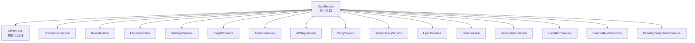
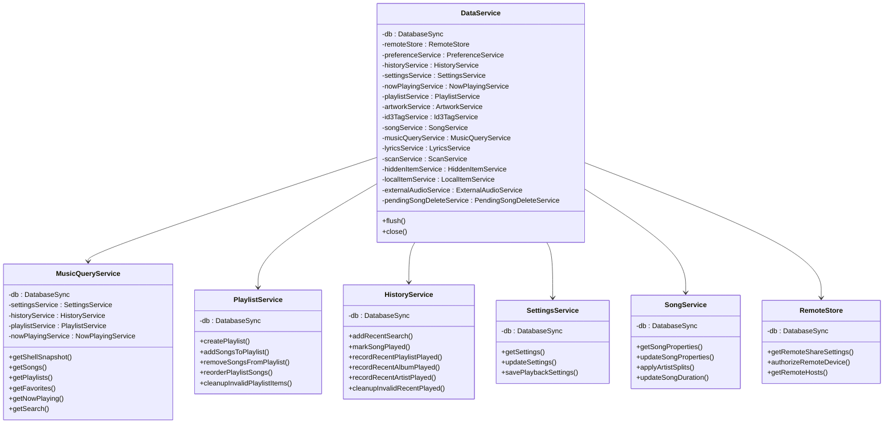
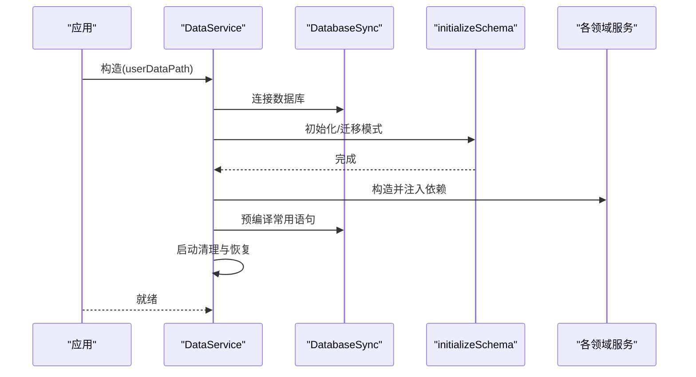
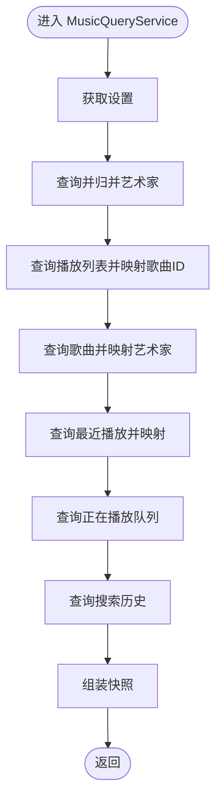
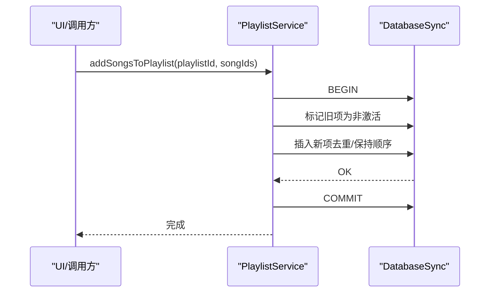
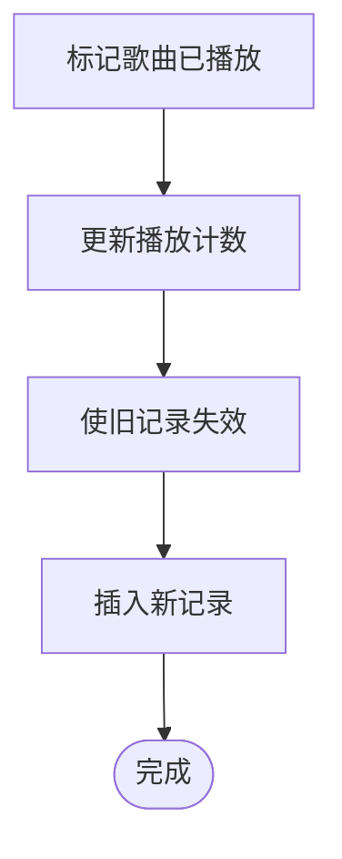
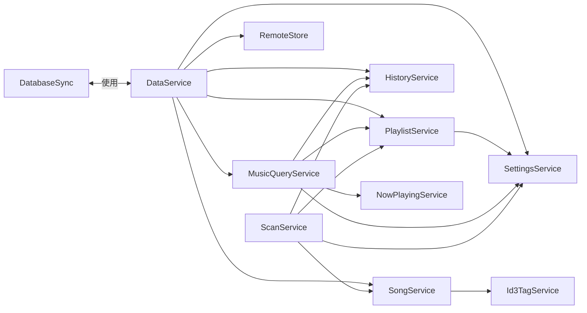

# 数据访问层

<cite>
**本文引用的文件**
- [data-service.ts](file://electron/services/data-service.ts)
- [music-query-service.ts](file://electron/services/music-query-service.ts)
- [playlist-service.ts](file://electron/services/playlist-service.ts)
- [history-service.ts](file://electron/services/history-service.ts)
- [settings-service.ts](file://electron/services/settings-service.ts)
- [schema.ts](file://electron/services/schema.ts)
- [song-service.ts](file://electron/services/song-service.ts)
- [row-mappers.ts](file://electron/services/row-mappers.ts)
- [constants.ts](file://electron/services/constants.ts)
- [remote-store.ts](file://electron/services/remote-store.ts)
</cite>

## 目录
1. [简介](#简介)
2. [项目结构](#项目结构)
3. [核心组件](#核心组件)
4. [架构总览](#架构总览)
5. [详细组件分析](#详细组件分析)
6. [依赖关系分析](#依赖关系分析)
7. [性能考量](#性能考量)
8. [故障排查指南](#故障排查指南)
9. [结论](#结论)
10. [附录：扩展指南](#附录扩展指南)

## 简介
本文件系统性梳理 SMPlayer 的数据访问层，围绕统一入口 DataService 展开，覆盖音乐数据访问、播放列表管理、历史记录处理、设置管理、远程分享与授权、以及扫描与歌词同步等子域。文档重点阐述：
- 整体架构与职责边界
- 各服务类的数据访问模式（查询、更新、批量、事务）
- 事务处理机制（开始、提交、回滚）
- 查询优化策略（SQL 构建、参数化、索引利用、批量写入）
- 安全性与数据校验（SQL 注入防护、输入校验）
- 错误处理与降级策略
- 性能监控与调优建议
- 扩展新数据访问功能的方法论

## 项目结构
数据访问层位于 electron/services 目录，采用“按职责分层 + 统一入口”的组织方式：
- 统一入口：DataService 负责数据库初始化、模式迁移、服务实例装配与生命周期管理
- 子域服务：各领域服务封装对应表的增删改查与业务逻辑
- 基础设施：schema.ts 负责数据库结构与索引初始化；row-mappers.ts 提供跨模块的行映射；constants.ts 提供常量定义

图表来源
- [data-service.ts:64-145](file://electron/services/data-service.ts#L64-L145)
- [schema.ts:33-260](file://electron/services/schema.ts#L33-L260)

章节来源
- [data-service.ts:39-145](file://electron/services/data-service.ts#L39-L145)
- [schema.ts:33-260](file://electron/services/schema.ts#L33-L260)

## 核心组件
- DataService：负责数据库连接、模式初始化、服务实例装配、事务语句预编译、启动时清理与恢复、数据库刷写与关闭
- MusicQueryService：聚合多表查询，提供库快照、统计、歌曲、最近播放、播放列表、收藏夹、搜索历史等只读视图
- PlaylistService：播放列表的 CRUD、排序、收藏夹管理、批量插入与去重、失效项清理
- HistoryService：搜索历史、最近播放（歌曲/专辑/艺术家/播放列表）的增删改查与一致性维护
- SettingsService：应用设置的读取、快照转换、字段映射与更新
- SongService：歌曲元数据读取与写入、时长修正、艺术家拆分与同步
- RemoteStore：远程分享与授权设备/主机的配置与状态管理
- schema.ts：SQLite 模式初始化、索引建立、列演进与兼容性修复
- row-mappers.ts：跨模块的行对象映射与类型转换
- constants.ts：数据库名、播放列表名、状态码等常量

章节来源
- [data-service.ts:39-198](file://electron/services/data-service.ts#L39-L198)
- [music-query-service.ts:50-418](file://electron/services/music-query-service.ts#L50-L418)
- [playlist-service.ts:9-508](file://electron/services/playlist-service.ts#L9-L508)
- [history-service.ts:30-484](file://electron/services/history-service.ts#L30-L484)
- [settings-service.ts:61-577](file://electron/services/settings-service.ts#L61-L577)
- [song-service.ts:17-297](file://electron/services/song-service.ts#L17-L297)
- [remote-store.ts:49-525](file://electron/services/remote-store.ts#L49-L525)
- [schema.ts:33-364](file://electron/services/schema.ts#L33-L364)
- [row-mappers.ts:1-87](file://electron/services/row-mappers.ts#L1-L87)
- [constants.ts:1-28](file://electron/services/constants.ts#L1-L28)

## 架构总览
数据访问层以 DataService 为中心，通过构造函数注入 DatabaseSync 实例，将各领域服务串联起来。每个服务内部使用预编译语句（prepare）执行 SQL，确保参数化与可复用性。事务控制集中在需要原子性的写入场景。

图表来源
- [data-service.ts:39-133](file://electron/services/data-service.ts#L39-L133)
- [music-query-service.ts:50-180](file://electron/services/music-query-service.ts#L50-L180)
- [playlist-service.ts:25-145](file://electron/services/playlist-service.ts#L25-L145)
- [history-service.ts:51-182](file://electron/services/history-service.ts#L51-L182)
- [settings-service.ts:61-179](file://electron/services/settings-service.ts#L61-L179)
- [song-service.ts:25-56](file://electron/services/song-service.ts#L25-L56)
- [remote-store.ts:52-54](file://electron/services/remote-store.ts#L52-L54)

## 详细组件分析

### DataService：统一数据访问入口
- 数据库初始化：连接用户目录下的 SQLite 文件，执行模式初始化与迁移
- 服务装配：按需构造各领域服务实例，并注入依赖（如 SettingsService、HistoryService 等）
- 预编译语句：缓存常用查询/更新语句，减少解析成本
- 启动清理与恢复：检查并修复播放列表、最近播放、播放进度等不一致状态
- 生命周期管理：提供 flush 与 close，确保 WAL 刷新与资源释放

图表来源
- [data-service.ts:64-145](file://electron/services/data-service.ts#L64-L145)
- [schema.ts:33-260](file://electron/services/schema.ts#L33-L260)

章节来源
- [data-service.ts:39-198](file://electron/services/data-service.ts#L39-L198)

### MusicQueryService：音乐数据聚合查询
- 聚合维度：库统计、歌曲列表、最近播放、播放列表、收藏夹、正在播放队列、搜索历史
- 关联查询：通过 PlaylistItem、MusicArtist、RecentRecord 等表进行多表联结
- 参数化查询：所有外部输入均通过占位符传入，避免拼接
- 数据归一化：时间戳标准化、艺术家文本规范化、媒体/封面 URL 生成
- 性能要点：使用索引列过滤（State、ItemId、Type）、限制最近记录数量、分组聚合统计

图表来源
- [music-query-service.ts:171-288](file://electron/services/music-query-service.ts#L171-L288)
- [music-query-service.ts:290-322](file://electron/services/music-query-service.ts#L290-L322)
- [music-query-service.ts:324-349](file://electron/services/music-query-service.ts#L324-L349)

章节来源
- [music-query-service.ts:50-418](file://electron/services/music-query-service.ts#L50-L418)

### PlaylistService：播放列表管理
- 创建/删除/恢复：支持内置与自定义播放列表，内置列表不可删除/重命名
- 收藏夹：通过 MyFavorites 播单管理歌曲收藏状态
- 排序与优先级：支持自定义播放列表优先级调整与排序准则变更
- 批量写入：使用 CASE/IN 占位符与 CTE 插入，保证顺序与幂等
- 失效项清理：定期清理不存在歌曲或播放列表的 PlaylistItem 记录

图表来源
- [playlist-service.ts:338-364](file://electron/services/playlist-service.ts#L338-L364)
- [playlist-service.ts:437-486](file://electron/services/playlist-service.ts#L437-L486)

章节来源
- [playlist-service.ts:9-508](file://electron/services/playlist-service.ts#L9-L508)

### HistoryService：历史记录处理
- 搜索历史：去重插入、按时间倒序查询、按查询内容与类型删除
- 最近播放：歌曲、播放列表、专辑、艺术家分别记录，支持清理无效项
- 歌曲播放计数：播放后更新计数并写入最近播放记录
- 事务保障：所有写入均在事务中执行，失败自动回滚

图表来源
- [history-service.ts:291-306](file://electron/services/history-service.ts#L291-L306)
- [history-service.ts:340-363](file://electron/services/history-service.ts#L340-L363)

章节来源
- [history-service.ts:30-484](file://electron/services/history-service.ts#L30-L484)

### SettingsService：设置管理
- 设置读取：查询最新设置行，缺失则抛出异常
- 快照转换：将 SettingsRow 映射为前端可用的 SettingsSnapshot
- 字段映射：播放模式、本地视图、语言、排序准则等枚举值与整型存储之间的双向映射
- 更新策略：按需更新部分字段，避免全量覆盖

章节来源
- [settings-service.ts:61-293](file://electron/services/settings-service.ts#L61-L293)
- [settings-service.ts:295-336](file://electron/services/settings-service.ts#L295-L336)

### SongService：歌曲数据访问
- 元数据读取：结合文件系统与音乐元数据解析器，补足标题、艺人、专辑、流派、时长等
- 写入与同步：通过 ID3 标签写入器更新标签，同时同步 Music 与 MusicArtist 表
- 批量处理：支持艺术家拆分结果批量同步与专辑信息一致性维护
- 时长修正：仅在合理范围内更新时长，避免噪声

章节来源
- [song-service.ts:17-297](file://electron/services/song-service.ts#L17-L297)

### RemoteStore：远程分享与授权
- 分享设置：设备标识、名称、端口、密码的读取与更新
- 授权设备：设备识别、平台/浏览器、IP、令牌哈希、授权状态、时间戳
- 远程主机：主机标识、名称、基础地址、令牌、连接时间
- 时间戳与安全：统一 ISO 时间存储与 DotNetTicks 转换

章节来源
- [remote-store.ts:49-525](file://electron/services/remote-store.ts#L49-L525)

### schema.ts：数据库模式与索引
- 模式初始化：创建 Settings、Music、Album、MusicArtist、Folder、File、Playlist、PlaylistItem、Preference、RecentRecord、SearchState、SearchHistory、HiddenStorageItem、RemoteSetting、AuthorizedDevice、RemoteHost 等表
- 索引建立：唯一与非唯一索引覆盖常见查询路径
- 列演进：动态添加/重命名列，兼容历史版本
- 数据修复：迁移阶段修复历史数据不一致问题

章节来源
- [schema.ts:33-364](file://electron/services/schema.ts#L33-L364)

## 依赖关系分析
- 低耦合高内聚：各服务仅依赖 DatabaseSync 与必要的其他服务实例
- 依赖注入：DataService 在构造函数中集中注入，避免循环依赖
- 预编译语句：减少 SQL 解析与注入风险，提升执行效率
- 事务边界：写入密集场景（播放列表、历史记录、歌曲属性）使用事务包裹

图表来源
- [data-service.ts:73-133](file://electron/services/data-service.ts#L73-L133)
- [music-query-service.ts:63-74](file://electron/services/music-query-service.ts#L63-L74)
- [playlist-service.ts:25-27](file://electron/services/playlist-service.ts#L25-L27)
- [settings-service.ts:70-71](file://electron/services/settings-service.ts#L70-L71)

章节来源
- [data-service.ts:39-198](file://electron/services/data-service.ts#L39-L198)

## 性能考量
- SQL 优化
  - 使用参数化查询与预编译语句，避免字符串拼接与重复解析
  - 利用索引：路径唯一索引、名称/时间/状态等常用过滤列
  - 聚合查询：COUNT/DISTINCT、GROUP BY 时限定状态与范围
- 批量操作
  - 播放列表重排使用 CASE/IN 与 CTE 插入，减少多次往返
  - 批量去重与顺序插入，避免重复项与无序状态
- I/O 与事务
  - 事务包裹写入，减少 WAL 频繁刷盘
  - 启动时一次性清理无效项，降低运行期负担
- 缓存与延迟
  - 预编译常用查询语句，减少运行期准备
  - 对热点数据（如设置）进行内存缓存（由上层使用）

[本节为通用指导，无需特定文件引用]

## 故障排查指南
- 设置未初始化
  - 现象：读取设置时报错
  - 处理：调用初始化流程，若无设置行则插入默认行
  - 参考
    - [settings-service.ts:181-187](file://electron/services/settings-service.ts#L181-L187)
    - [settings-service.ts:189-196](file://electron/services/settings-service.ts#L189-L196)
- 播放列表/历史记录不一致
  - 现象：播放列表为空或显示不存在的歌曲
  - 处理：执行清理无效项；检查状态字段是否正确
  - 参考
    - [playlist-service.ts:412-419](file://electron/services/playlist-service.ts#L412-L419)
    - [history-service.ts:332-338](file://electron/services/history-service.ts#L332-L338)
- 歌曲属性写入失败
  - 现象：ID3 写入成功但数据库未更新
  - 处理：确认事务包裹与回滚逻辑；检查歌曲存在性
  - 参考
    - [song-service.ts:181-203](file://electron/services/song-service.ts#L181-L203)
- 时间戳异常
  - 现象：时间显示异常或空值
  - 处理：统一 ISO 时间存储；DotNetTicks 转换容错
  - 参考
    - [music-query-service.ts:393-416](file://electron/services/music-query-service.ts#L393-L416)
    - [history-service.ts:477-482](file://electron/services/history-service.ts#L477-L482)
    - [remote-store.ts:500-523](file://electron/services/remote-store.ts#L500-L523)

章节来源
- [settings-service.ts:181-196](file://electron/services/settings-service.ts#L181-L196)
- [playlist-service.ts:412-419](file://electron/services/playlist-service.ts#L412-L419)
- [history-service.ts:332-338](file://electron/services/history-service.ts#L332-L338)
- [song-service.ts:181-203](file://electron/services/song-service.ts#L181-L203)
- [music-query-service.ts:393-416](file://electron/services/music-query-service.ts#L393-L416)
- [remote-store.ts:500-523](file://electron/services/remote-store.ts#L500-L523)

## 结论
SMPlayer 的数据访问层以 DataService 为核心，通过明确的服务边界与统一的事务/参数化策略，实现了稳定、可维护且具备良好性能的数据访问能力。通过模式初始化、索引与批量写入等手段，满足了音乐库的高频读写需求；通过严格的错误处理与清理流程，保障了数据一致性与用户体验。

[本节为总结，无需特定文件引用]

## 附录：扩展指南
新增数据访问功能的步骤建议：
1. 设计表结构与索引
   - 在 schema.ts 中新增表/索引，必要时添加列演进逻辑
   - 参考
     - [schema.ts:33-260](file://electron/services/schema.ts#L33-L260)
2. 新建服务类
   - 在 electron/services 下新增服务文件，依赖 DatabaseSync
   - 参考
     - [playlist-service.ts:25-145](file://electron/services/playlist-service.ts#L25-L145)
3. 定义查询/更新语句
   - 使用 prepare 预编译，参数化输入
   - 参考
     - [music-query-service.ts:75-164](file://electron/services/music-query-service.ts#L75-L164)
4. 事务封装
   - 对写入/更新组合使用 BEGIN/COMMIT/ROLLBACK
   - 参考
     - [playlist-service.ts:175-201](file://electron/services/playlist-service.ts#L175-L201)
     - [history-service.ts:246-261](file://electron/services/history-service.ts#L246-L261)
5. 集成到 DataService
   - 在构造函数中注入新服务实例
   - 参考
     - [data-service.ts:73-133](file://electron/services/data-service.ts#L73-L133)
6. 单元测试与回归
   - 覆盖边界条件（空集、重复、非法输入、事务回滚）
   - 性能压测（批量插入、大查询）

[本节为方法论，无需特定文件引用]