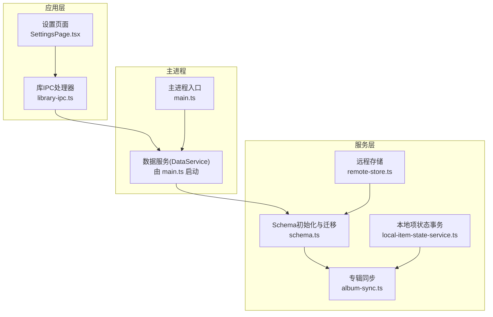
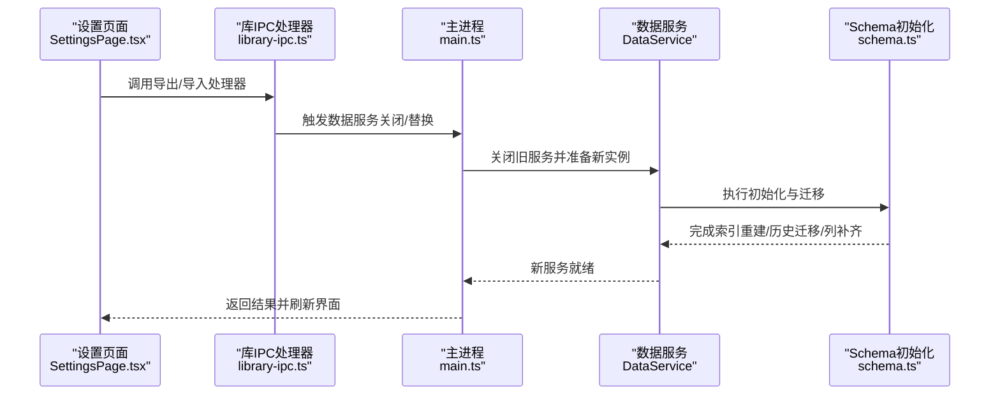
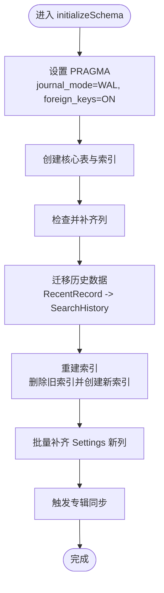
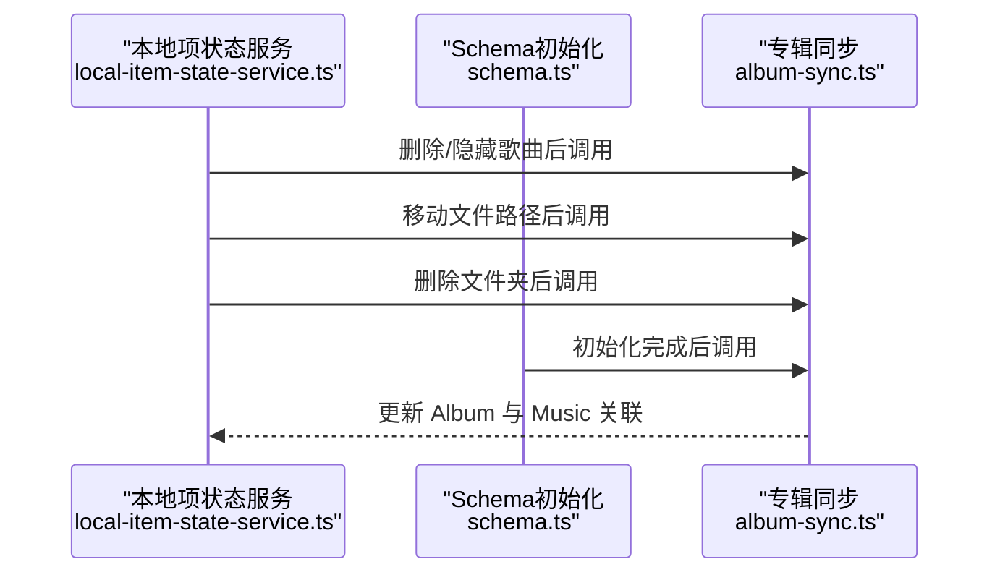
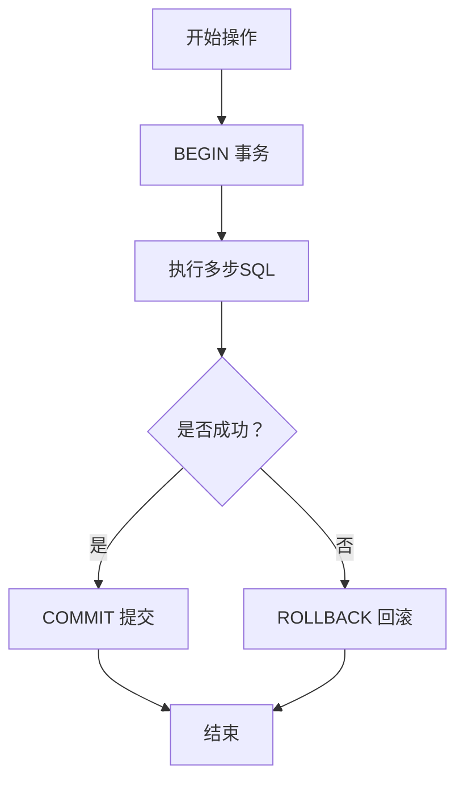
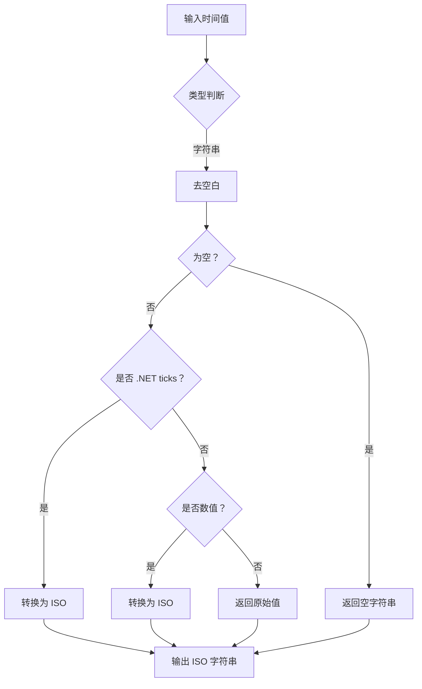
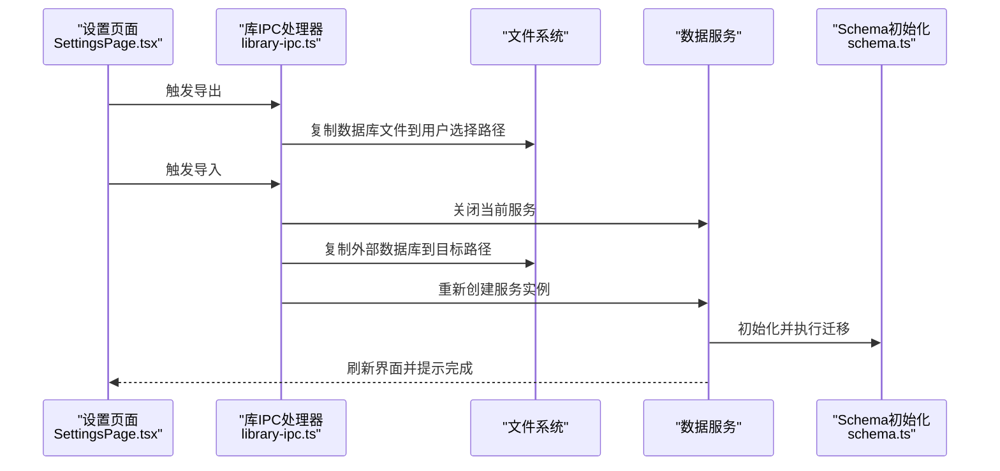
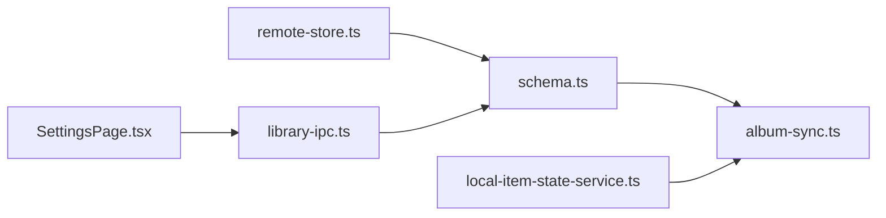

# 数据迁移

<cite>
**本文引用的文件**   
- [schema.ts](file://electron/services/schema.ts)
- [album-sync.ts](file://electron/services/album-sync.ts)
- [local-item-state-service.ts](file://electron/services/local-item-state-service.ts)
- [remote-store.ts](file://electron/services/remote-store.ts)
- [library-ipc.ts](file://electron/ipc/library-ipc.ts)
- [SettingsPage.tsx](file://src/pages/SettingsPage.tsx)
- [main.ts](file://electron/main.ts)
- [MIGRATION_AUDIT.md](file://docs/MIGRATION_AUDIT.md)
- [MIGRATION_CHECKLIST.md](file://MIGRATION_CHECKLIST.md)
</cite>

## 目录
1. [简介](#简介)
2. [项目结构](#项目结构)
3. [核心组件](#核心组件)
4. [架构总览](#架构总览)
5. [详细组件分析](#详细组件分析)
6. [依赖分析](#依赖分析)
7. [性能考虑](#性能考虑)
8. [故障排除指南](#故障排除指南)
9. [结论](#结论)
10. [附录](#附录)

## 简介
本技术文档聚焦于 SMPlayer 的数据库迁移与版本管理机制，系统阐述以下内容：
- 数据库初始化与 schema 升级流程
- 列添加、删除、重命名的实现与安全检查（columnExists、addColumnIfMissing、renameColumnIfPresent）
- 索引的动态管理（创建、删除、重建）与优化
- 自动化迁移流程：向后兼容、数据完整性校验、回滚机制
- 版本控制策略：版本号管理、迁移脚本组织、依赖关系处理
- 备份与恢复：全量备份、导入导出、灾难恢复
- 测试策略与验证方法
- 故障排除与应急处理

## 项目结构
围绕数据迁移的关键文件与职责如下：
- 初始化与迁移：electron/services/schema.ts
- 相关同步逻辑：electron/services/album-sync.ts
- 本地项状态与事务一致性：electron/services/local-item-state-service.ts
- 远程分享相关表与时间字段归一化：electron/services/remote-store.ts
- 导入导出 IPC 与前端入口：electron/ipc/library-ipc.ts、src/pages/SettingsPage.tsx
- 应用生命周期与服务启动顺序：electron/main.ts
- 迁移审计与清单：docs/MIGRATION_AUDIT.md、MIGRATION_CHECKLIST.md

图表来源
- [main.ts:141-170](file://electron/main.ts#L141-L170)
- [schema.ts:33-363](file://electron/services/schema.ts#L33-L363)
- [album-sync.ts:1-82](file://electron/services/album-sync.ts#L1-L82)
- [local-item-state-service.ts:231-335](file://electron/services/local-item-state-service.ts#L231-L335)
- [remote-store.ts:49-134](file://electron/services/remote-store.ts#L49-L134)
- [library-ipc.ts:267-302](file://electron/ipc/library-ipc.ts#L267-L302)
- [SettingsPage.tsx:552-591](file://src/pages/SettingsPage.tsx#L552-L591)

章节来源
- [main.ts:141-170](file://electron/main.ts#L141-L170)
- [schema.ts:33-363](file://electron/services/schema.ts#L33-L363)

## 核心组件
- Schema 初始化与迁移
  - 初始化 PRAGMA（WAL、同步级别、外键）
  - 创建核心表与唯一/普通索引
  - 列存在性检查与条件添加/重命名
  - 历史数据迁移与索引重建
- 专辑同步
  - 基于 Music 表聚合生成临时表，再更新/插入 Album 表并回写 Music.AlbumId
- 本地项状态与事务
  - 隐藏/删除歌曲、移动文件路径、批量删除等均在显式事务中执行，并在异常时回滚
- 远程存储
  - RemoteSetting/AuthorizedDevice/RemoteHost 表的列补齐与索引维护；时间字段统一为 ISO 字符串
- 导入导出
  - 通过 IPC 将当前用户数据目录下的数据库文件复制到用户选择的目标路径，或从外部导入覆盖当前数据库

章节来源
- [schema.ts:33-363](file://electron/services/schema.ts#L33-L363)
- [album-sync.ts:1-82](file://electron/services/album-sync.ts#L1-L82)
- [local-item-state-service.ts:231-335](file://electron/services/local-item-state-service.ts#L231-L335)
- [remote-store.ts:49-134](file://electron/services/remote-store.ts#L49-L134)
- [library-ipc.ts:267-302](file://electron/ipc/library-ipc.ts#L267-L302)

## 架构总览
下图展示数据迁移在应用中的端到端流程：UI 触发导入/导出 -> 主进程 IPC 处理 -> 数据服务关闭/替换 -> 重新初始化 Schema 并进行迁移。

图表来源
- [SettingsPage.tsx:552-591](file://src/pages/SettingsPage.tsx#L552-L591)
- [library-ipc.ts:267-302](file://electron/ipc/library-ipc.ts#L267-L302)
- [main.ts:141-170](file://electron/main.ts#L141-L170)
- [schema.ts:33-363](file://electron/services/schema.ts#L33-L363)

## 详细组件分析

### 组件A：Schema 初始化与迁移（columnExists、addColumnIfMissing、renameColumnIfPresent）
- 功能要点
  - 使用 PRAGMA 设置数据库运行模式与一致性级别
  - 创建所有核心表与索引（含唯一索引与普通索引）
  - 条件列操作：仅当列不存在时添加；仅当旧列存在且新列不存在时重命名
  - 历史数据迁移：将 RecentRecord 中的搜索记录迁移到 SearchHistory，并修正类型值
  - 重建索引：删除旧索引后按新规则重建，确保查询一致性
  - 批量补齐 Settings 表新增列，避免逐条判断
  - 最终触发专辑同步，保持 Album 与 Music 的一致性
- 关键流程图

图表来源
- [schema.ts:33-363](file://electron/services/schema.ts#L33-L363)

章节来源
- [schema.ts:5-31](file://electron/services/schema.ts#L5-L31)
- [schema.ts:33-363](file://electron/services/schema.ts#L33-L363)

### 组件B：专辑同步（Album 与 Music 的一致性）
- 功能要点
  - 以 Music 为源，按专辑名分组统计艺术家与缩略图，生成临时表
  - 先将 Album 全部置为非活跃，再插入/更新 Album 记录
  - 回写 Music.AlbumId，确保专辑关联一致
  - 在多处关键操作后调用该函数，保证数据一致性
- 时序图

图表来源
- [local-item-state-service.ts:231-335](file://electron/services/local-item-state-service.ts#L231-L335)
- [schema.ts:362-363](file://electron/services/schema.ts#L362-L363)
- [album-sync.ts:1-82](file://electron/services/album-sync.ts#L1-L82)

章节来源
- [album-sync.ts:1-82](file://electron/services/album-sync.ts#L1-L82)
- [local-item-state-service.ts:231-335](file://electron/services/local-item-state-service.ts#L231-L335)

### 组件C：索引动态管理
- 功能要点
  - 初始化阶段创建大量索引，覆盖常用查询维度（如 Music.Path、Album.Name、MusicArtist 的复合索引等）
  - 在迁移过程中删除旧索引并重建，确保查询计划最优
  - 对空字符串或无效值进行过滤，避免重复与无意义索引
- 索引策略
  - 唯一索引用于强约束字段（如路径、名称、设备/主机标识）
  - 普通索引用于过滤与排序字段（如父节点、类型、时间戳）

章节来源
- [schema.ts:238-299](file://electron/services/schema.ts#L238-L299)
- [schema.ts:249-259](file://electron/services/schema.ts#L249-L259)

### 组件D：事务与回滚（数据完整性保障）
- 功能要点
  - 隐藏歌曲、删除歌曲、移动文件、删除文件夹等操作均包裹在 BEGIN/COMMIT 或显式事务中
  - 发生错误时执行 ROLLBACK，确保状态一致
  - 与专辑同步配合，保证跨表修改的一致性
- 事务流程图

图表来源
- [local-item-state-service.ts:234-244](file://electron/services/local-item-state-service.ts#L234-L244)
- [local-item-state-service.ts:284-294](file://electron/services/local-item-state-service.ts#L284-L294)
- [local-item-state-service.ts:320-330](file://electron/services/local-item-state-service.ts#L320-L330)

章节来源
- [local-item-state-service.ts:231-335](file://electron/services/local-item-state-service.ts#L231-L335)

### 组件E：远程存储的时间字段归一化
- 功能要点
  - 将多种时间格式（字符串、数字、.NET 时间戳）统一转换为 ISO 字符串
  - 为后续查询与排序提供一致的数据类型
- 归一化流程图

图表来源
- [remote-store.ts:466-498](file://electron/services/remote-store.ts#L466-L498)

章节来源
- [remote-store.ts:466-498](file://electron/services/remote-store.ts#L466-L498)

### 组件F：导入/导出与灾难恢复
- 功能要点
  - 导出：将当前用户数据目录下的数据库文件复制到用户选择位置
  - 导入：关闭当前服务，复制外部数据库到目标路径，重启服务并根据根路径差异进行路径替换
  - UI 层提供导出/导入按钮与消息反馈
- 导入/导出序列图

图表来源
- [library-ipc.ts:267-302](file://electron/ipc/library-ipc.ts#L267-L302)
- [SettingsPage.tsx:552-591](file://src/pages/SettingsPage.tsx#L552-L591)
- [schema.ts:33-363](file://electron/services/schema.ts#L33-L363)

章节来源
- [library-ipc.ts:267-302](file://electron/ipc/library-ipc.ts#L267-L302)
- [SettingsPage.tsx:552-591](file://src/pages/SettingsPage.tsx#L552-L591)

## 依赖分析
- 组件耦合
  - schema.ts 依赖 album-sync.ts 进行最终一致性维护
  - local-item-state-service.ts 在多个业务操作中依赖 album-sync.ts
  - remote-store.ts 依赖 schema.ts 中的表结构定义
  - library-ipc.ts 与 SettingsPage.tsx 作为导入/导出的入口，间接依赖 schema.ts 的初始化能力
- 外部依赖
  - node:sqlite 提供同步数据库访问
  - Electron IPC 提供主渲染通信

图表来源
- [schema.ts:3-3](file://electron/services/schema.ts#L3-L3)
- [album-sync.ts:1-1](file://electron/services/album-sync.ts#L1-L1)
- [local-item-state-service.ts:231-335](file://electron/services/local-item-state-service.ts#L231-L335)
- [remote-store.ts:49-134](file://electron/services/remote-store.ts#L49-L134)
- [library-ipc.ts:267-302](file://electron/ipc/library-ipc.ts#L267-L302)
- [SettingsPage.tsx:552-591](file://src/pages/SettingsPage.tsx#L552-L591)

章节来源
- [schema.ts:3-3](file://electron/services/schema.ts#L3-L3)
- [album-sync.ts:1-1](file://electron/services/album-sync.ts#L1-L1)
- [local-item-state-service.ts:231-335](file://electron/services/local-item-state-service.ts#L231-L335)
- [remote-store.ts:49-134](file://electron/services/remote-store.ts#L49-L134)
- [library-ipc.ts:267-302](file://electron/ipc/library-ipc.ts#L267-L302)
- [SettingsPage.tsx:552-591](file://src/pages/SettingsPage.tsx#L552-L591)

## 性能考虑
- 索引设计
  - 为高频查询字段建立唯一/普通索引，减少全表扫描
  - 在迁移阶段重建索引，避免过期索引导致查询性能下降
- 事务批处理
  - 批量删除/移动等操作使用事务包裹，减少中间态对索引与约束的影响
- WAL 模式
  - 使用 WAL 模式提升并发读写性能，降低锁竞争
- 时间字段归一化
  - 统一时间格式便于排序与比较，减少隐式转换开销

## 故障排除指南
- 导入失败或数据不生效
  - 确认导入前已关闭当前数据服务，导入后已重新创建服务实例
  - 检查根路径差异是否触发了路径替换逻辑
- 专辑显示异常
  - 确认专辑同步已在关键操作后执行
  - 检查 Music.AlbumId 是否被正确回写
- 查询性能骤降
  - 检查迁移后索引是否重建完成
  - 确认未误删唯一索引或缺失必要索引
- 时间字段显示异常
  - 检查时间字段是否被正确归一化为 ISO 字符串
- 回滚与一致性
  - 若某次操作失败，确认事务已回滚，必要时重新执行导入/迁移流程

章节来源
- [library-ipc.ts:267-302](file://electron/ipc/library-ipc.ts#L267-L302)
- [local-item-state-service.ts:231-335](file://electron/services/local-item-state-service.ts#L231-L335)
- [album-sync.ts:1-82](file://electron/services/album-sync.ts#L1-L82)
- [remote-store.ts:466-498](file://electron/services/remote-store.ts#L466-L498)

## 结论
SMPlayer 的数据迁移体系以 schema 初始化为核心，结合条件列操作、索引动态管理、事务回滚与专辑同步，实现了稳定的向后兼容与数据完整性保障。导入/导出流程提供了可靠的灾难恢复手段。建议在后续迭代中：
- 明确版本号与迁移脚本命名规范，形成可追溯的迁移日志
- 引入迁移前快照与可选的回滚点，增强应急处理能力
- 增加迁移前后数据校验与一致性检查工具

## 附录
- 迁移审计与清单
  - 参考文档：docs/MIGRATION_AUDIT.md、MIGRATION_CHECKLIST.md
  - 用于对照原 UWP 与 Electron 实现，确保字段与行为的迁移状态清晰可查

章节来源
- [MIGRATION_AUDIT.md:1-85](file://docs/MIGRATION_AUDIT.md#L1-L85)
- [MIGRATION_CHECKLIST.md:1-79](file://MIGRATION_CHECKLIST.md#L1-L79)