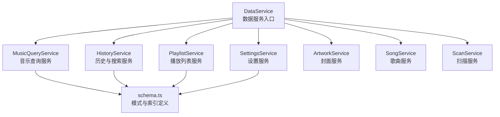
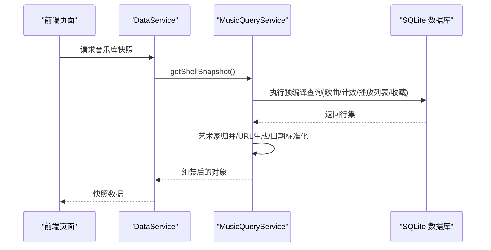
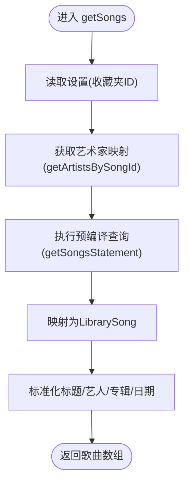
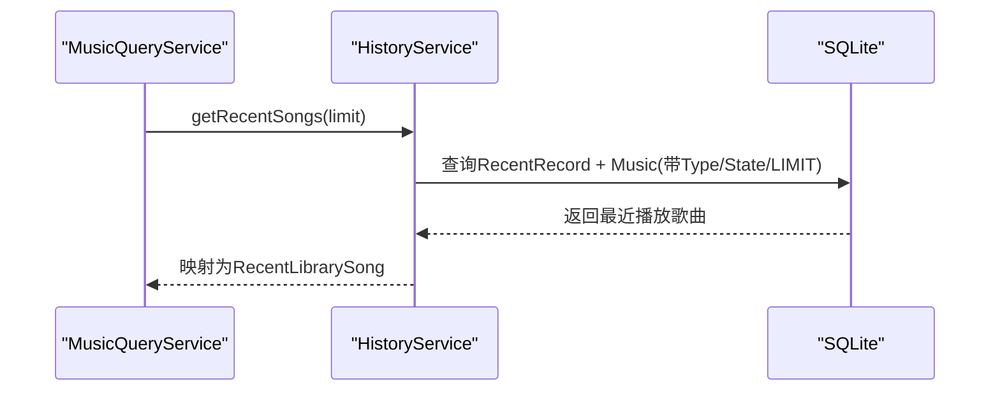
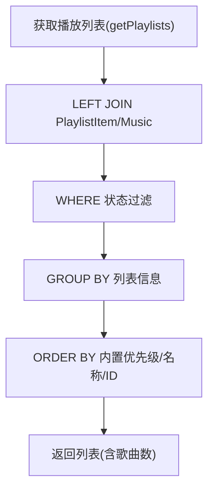
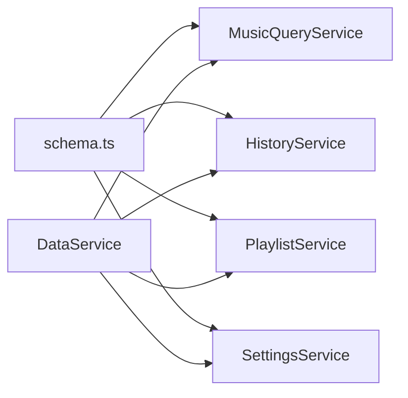

# 查询优化

<cite>
**本文引用的文件**
- [music-query-service.ts](file://electron/services/music-query-service.ts)
- [schema.ts](file://electron/services/schema.ts)
- [data-service.ts](file://electron/services/data-service.ts)
- [history-service.ts](file://electron/services/history-service.ts)
- [playlist-service.ts](file://electron/services/playlist-service.ts)
- [settings-service.ts](file://electron/services/settings-service.ts)
- [row-mappers.ts](file://electron/services/row-mappers.ts)
- [constants.ts](file://electron/services/constants.ts)
</cite>

## 目录
1. [简介](#简介)
2. [项目结构](#项目结构)
3. [核心组件](#核心组件)
4. [架构总览](#架构总览)
5. [详细组件分析](#详细组件分析)
6. [依赖关系分析](#依赖关系分析)
7. [性能考量](#性能考量)
8. [故障排查指南](#故障排查指南)
9. [结论](#结论)
10. [附录](#附录)

## 简介
本文件面向SMPlayer的SQLite查询优化，系统性阐述查询优化策略与实现要点，涵盖索引使用原则、查询计划分析、执行效率评估、各类查询类型（简单查询、连接查询、聚合查询、排序查询）的优化方法、复合索引设计与覆盖查询、查询缓存机制（结果缓存与查询计划缓存）、性能监控工具与方法（如EXPLAIN QUERY PLAN）、大数据量场景下的优化策略（分页、延迟加载、预加载），以及最佳实践与常见陷阱、调试与故障排除方法。内容基于代码库中实际存在的数据库访问层与模式定义进行归纳总结。

## 项目结构
SMPlayer的数据库访问与查询优化主要集中在electron/services目录下，核心模块包括：
- 数据库初始化与模式定义：schema.ts
- 数据服务入口与生命周期管理：data-service.ts
- 音乐库查询服务：music-query-service.ts
- 历史记录与搜索历史服务：history-service.ts
- 播放列表服务：playlist-service.ts
- 设置服务：settings-service.ts
- 行映射工具：row-mappers.ts
- 常量定义：constants.ts

图表来源
- [data-service.ts:64-145](file://electron/services/data-service.ts#L64-L145)
- [music-query-service.ts:63-165](file://electron/services/music-query-service.ts#L63-L165)
- [history-service.ts:51-182](file://electron/services/history-service.ts#L51-L182)
- [playlist-service.ts:25-145](file://electron/services/playlist-service.ts#L25-L145)
- [settings-service.ts:70-179](file://electron/services/settings-service.ts#L70-L179)
- [schema.ts:33-260](file://electron/services/schema.ts#L33-L260)

章节来源
- [data-service.ts:64-145](file://electron/services/data-service.ts#L64-L145)
- [schema.ts:33-260](file://electron/services/schema.ts#L33-L260)

## 核心组件
- MusicQueryService：负责音乐库主查询、最近播放、计数统计、收藏夹与播放列表快照等，大量使用预编译语句与连接查询，是查询优化的关键入口。
- HistoryService：维护搜索历史与最近播放记录，涉及RecentRecord表的读写与清理，查询路径清晰，适合做索引与查询计划分析。
- PlaylistService：处理播放列表与歌曲项的增删改查，包含复杂连接与条件过滤，是连接查询优化的重点。
- SettingsService：读取与更新应用设置，查询相对简单但影响全局行为。
- schema.ts：集中定义表结构与索引，是查询优化的“地基”。

章节来源
- [music-query-service.ts:50-165](file://electron/services/music-query-service.ts#L50-L165)
- [history-service.ts:30-182](file://electron/services/history-service.ts#L30-L182)
- [playlist-service.ts:9-145](file://electron/services/playlist-service.ts#L9-L145)
- [settings-service.ts:61-179](file://electron/services/settings-service.ts#L61-L179)
- [schema.ts:33-260](file://electron/services/schema.ts#L33-L260)

## 架构总览
SMPlayer采用“服务化+预编译语句”的查询架构：
- 数据库初始化在启动时完成，创建表与索引，并确保必要列存在。
- 各业务服务通过预编译语句执行查询，避免SQL拼接带来的性能与安全问题。
- 查询结果在内存中进行二次组装（如艺术家归并、URL生成），减少数据库端的格式化开销。

图表来源
- [data-service.ts:120-132](file://electron/services/data-service.ts#L120-L132)
- [music-query-service.ts:171-180](file://electron/services/music-query-service.ts#L171-L180)
- [music-query-service.ts:199-209](file://electron/services/music-query-service.ts#L199-L209)
- [music-query-service.ts:286-288](file://electron/services/music-query-service.ts#L286-L288)

## 详细组件分析

### MusicQueryService 查询优化分析
- 预编译语句与参数绑定：所有查询均以prepare预编译，配合run/get/all传参，降低解析与缓存计划成本。
- 连接查询与排序：对Music、PlaylistItem、MusicArtist、RecentRecord等表进行连接，排序字段使用COLLATE NOCASE保证大小写不敏感且可利用索引。
- 子查询与EXISTS：在判断是否收藏时使用EXISTS，避免不必要的JOIN开销。
- 结果组装：在内存中完成艺术家归并、URL与日期标准化，减少数据库端字符串处理。

图表来源
- [music-query-service.ts:199-209](file://electron/services/music-query-service.ts#L199-L209)
- [music-query-service.ts:290-322](file://electron/services/music-query-service.ts#L290-L322)
- [music-query-service.ts:324-349](file://electron/services/music-query-service.ts#L324-L349)

章节来源
- [music-query-service.ts:50-165](file://electron/services/music-query-service.ts#L50-L165)
- [music-query-service.ts:199-209](file://electron/services/music-query-service.ts#L199-L209)
- [music-query-service.ts:290-322](file://electron/services/music-query-service.ts#L290-L322)
- [music-query-service.ts:324-349](file://electron/services/music-query-service.ts#L324-L349)

### HistoryService 查询优化分析
- 最近播放查询：通过RecentRecord与目标表连接，限定Type与State，使用LIMIT限制返回数量，避免全表扫描。
- 搜索历史查询：按时间倒序，使用索引提升排序与筛选效率。
- 清理与去重：提供清理无效记录、删除重复搜索条目等操作，保持查询高效稳定。

图表来源
- [music-query-service.ts:216-231](file://electron/services/music-query-service.ts#L216-L231)
- [history-service.ts:137-150](file://electron/services/history-service.ts#L137-L150)

章节来源
- [history-service.ts:137-150](file://electron/services/history-service.ts#L137-L150)
- [history-service.ts:184-193](file://electron/services/history-service.ts#L184-L193)

### PlaylistService 查询优化分析
- 复杂连接与分组：在统计播放列表歌曲数时使用LEFT JOIN与GROUP BY，注意WHERE中的状态过滤。
- 排序逻辑：内置播放列表优先级与名称排序，结合CASE表达式控制顺序，避免额外内存排序。
- 批量操作：通过IN子句与批量UPDATE/INSERT减少往返次数。

图表来源
- [playlist-service.ts:77-102](file://electron/services/playlist-service.ts#L77-L102)

章节来源
- [playlist-service.ts:77-102](file://electron/services/playlist-service.ts#L77-L102)
- [playlist-service.ts:157-164](file://electron/services/playlist-service.ts#L157-L164)

### SettingsService 查询优化分析
- 单行读取：通过ORDER BY Id DESC LIMIT 1确保快速定位最新设置行。
- 更新原子性：使用单条UPDATE语句一次性更新多项设置，减少锁竞争。

章节来源
- [settings-service.ts:70-117](file://electron/services/settings-service.ts#L70-L117)
- [settings-service.ts:169-178](file://electron/services/settings-service.ts#L169-L178)

### schema.ts 模式与索引设计
- 关键索引策略：
  - 唯一索引：Music.Path、Album.Name(NOCASE)、MusicArtist(MusicId, Name NOSCASE)、Folder.Path、File.Path、SearchHistory(Query NOSCASE, Type)、HiddenStorageItem(Type, Path)。
  - 普通索引：MusicArtist.Name、MusicArtist.MusicId、Folder.ParentId、File.ParentId、PlaylistItem(PlaylistId/ItemId)、RecentRecord(Type)、PreferenceItem(Type, ItemId)、SearchHistory(SearchedAt)、AuthorizedDevice(DeviceId唯一+Token索引)、RemoteHost(Host唯一)。
- PRAGMA配置：WAL、NORMAL同步、外键开启，提升并发与一致性。
- 列迁移与兼容：动态添加缺失列，保证升级后查询可用性。

章节来源
- [schema.ts:33-260](file://electron/services/schema.ts#L33-L260)
- [schema.ts:292-360](file://electron/services/schema.ts#L292-L360)

## 依赖关系分析
- MusicQueryService依赖SettingsService、HistoryService、PlaylistService、NowPlayingService，形成“查询-上下文-状态”的组合。
- HistoryService与PlaylistService均依赖schema.ts中的表结构与索引，查询路径清晰。
- DataService作为容器，统一初始化数据库、服务实例与查询入口。

图表来源
- [data-service.ts:120-132](file://electron/services/data-service.ts#L120-L132)
- [music-query-service.ts:63-75](file://electron/services/music-query-service.ts#L63-L75)
- [history-service.ts:51-52](file://electron/services/history-service.ts#L51-L52)
- [playlist-service.ts:25-27](file://electron/services/playlist-service.ts#L25-L27)
- [settings-service.ts:70-71](file://electron/services/settings-service.ts#L70-L71)

章节来源
- [data-service.ts:120-132](file://electron/services/data-service.ts#L120-L132)
- [music-query-service.ts:63-75](file://electron/services/music-query-service.ts#L63-L75)
- [history-service.ts:51-52](file://electron/services/history-service.ts#L51-L52)
- [playlist-service.ts:25-27](file://electron/services/playlist-service.ts#L25-L27)
- [settings-service.ts:70-71](file://electron/services/settings-service.ts#L70-L71)

## 性能考量
- 预编译语句与参数绑定：减少SQL解析与计划缓存碎片，提高重复查询性能。
- 索引选择性与覆盖查询：
  - 对高选择性的列（如Path、Name）建立唯一索引，避免全表扫描。
  - 使用NOCASE索引支持大小写不敏感查询，同时保持排序与过滤效率。
  - 在连接查询中，确保连接键（如Music.Id、PlaylistItem.PlaylistId）有索引。
- 排序与LIMIT：对RecentRecord等高频查询使用LIMIT限制结果集；对排序字段建立索引或使用NOCASE索引。
- 分页与延迟加载：
  - 对大列表查询（如歌曲列表）建议引入OFFSET/LIMIT分页，避免一次性加载过多数据。
  - 对非关键字段（如缩略图URL）采用延迟加载，在需要时再查询生成。
- 预加载与内存组装：
  - 将Artist映射在内存中批量构建，减少数据库端字符串处理与JOIN次数。
- PRAGMA优化：
  - WAL模式提升并发读写；NORMAL同步平衡性能与可靠性；外键开启保障一致性。

章节来源
- [music-query-service.ts:75-96](file://electron/services/music-query-service.ts#L75-L96)
- [music-query-service.ts:118-145](file://electron/services/music-query-service.ts#L118-L145)
- [playlist-service.ts:121-144](file://electron/services/playlist-service.ts#L121-L144)
- [schema.ts:35-37](file://electron/services/schema.ts#L35-L37)

## 故障排查指南
- EXPLAIN QUERY PLAN使用：
  - 在开发或测试环境，对关键查询执行EXPLAIN QUERY PLAN，检查是否命中预期索引、是否存在全表扫描或临时表排序。
  - 关注查询计划中的“SCAN TABLE”、“USE TEMP B-TREE”等提示，针对性调整索引或SQL结构。
- 索引缺失与误用：
  - 若WHERE/JOIN/ORDER字段未建索引，应考虑新增索引；若索引选择性低，需重新评估。
  - 对NOCASE查询，确认使用了NOCASE索引而非普通索引。
- 大结果集与内存压力：
  - 对可能的大结果集查询（如全库扫描）增加LIMIT或改为分页。
  - 将字符串处理移至应用层，减少数据库端函数调用。
- 事务与锁：
  - 批量更新/插入使用BEGIN/COMMIT包裹，减少锁竞争与日志写入开销。
- 数据一致性与清理：
  - 定期清理RecentRecord与SearchHistory中的无效记录，避免索引膨胀与查询变慢。

章节来源
- [history-service.ts:246-261](file://electron/services/history-service.ts#L246-L261)
- [playlist-service.ts:437-486](file://electron/services/playlist-service.ts#L437-L486)
- [schema.ts:292-360](file://electron/services/schema.ts#L292-L360)

## 结论
SMPlayer的查询优化以“预编译语句+合理索引+内存组装”为核心策略。通过schema.ts集中定义的索引与PRAGMA配置，结合各服务的查询实现，能够在中小到中等规模的数据集上获得稳定的查询性能。对于更大规模的数据，建议引入分页、延迟加载与更细粒度的索引设计，并持续使用EXPLAIN QUERY PLAN进行回归验证。

## 附录

### 查询类型与优化要点速览
- 简单查询：确保WHERE列有索引；使用LIMIT限制结果集。
- 连接查询：连接键必须有索引；避免笛卡尔积；尽量在WHERE中过滤后再JOIN。
- 聚合查询：GROUP BY字段尽量走索引；必要时使用物化视图或中间表。
- 排序查询：对排序列建立索引；避免在排序列上使用函数导致索引失效。

### 复合索引设计与覆盖查询
- 复合索引选择策略：将高选择性列放在前面；遵循“最左前缀”原则；考虑查询/排序/过滤三者的组合。
- 索引覆盖：在SELECT中只取索引已包含的列，避免回表；适用于热点查询。

### 查询缓存机制
- 结果缓存：对静态或变化频率低的数据（如设置、固定列表）在应用层缓存，减少数据库访问。
- 查询计划缓存：预编译语句自动复用查询计划，避免重复解析；可通过PRAGMA查看缓存状态。
- 注意：缓存失效策略需与业务状态变更（如新增/删除/修改）同步。

### 性能监控与指标
- 指标建议：查询耗时、命中率、缓存命中、锁等待、WAL检查点频率。
- 工具：EXPLAIN QUERY PLAN、PRAGMA cache_size/working_cache_size、WAL相关PRAGMA。

### 大数据量场景优化清单
- 分页：对歌曲/播放列表/搜索结果使用分页。
- 延迟加载：非关键字段延迟生成（如URL、缩略图）。
- 预加载：对即将展示的数据提前查询并缓存。
- 索引优化：根据查询模式补充复合索引与覆盖索引。
- 清理策略：定期清理无效记录与历史数据，保持索引健康。