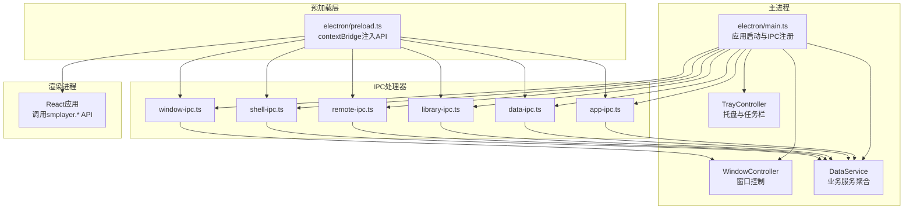
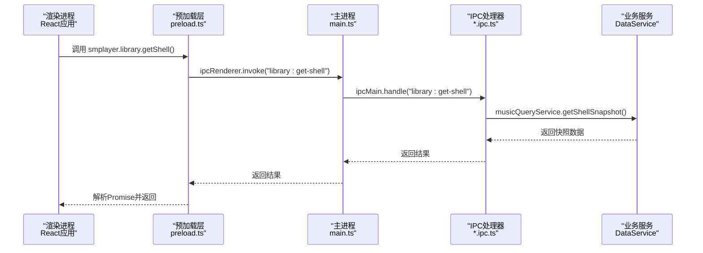
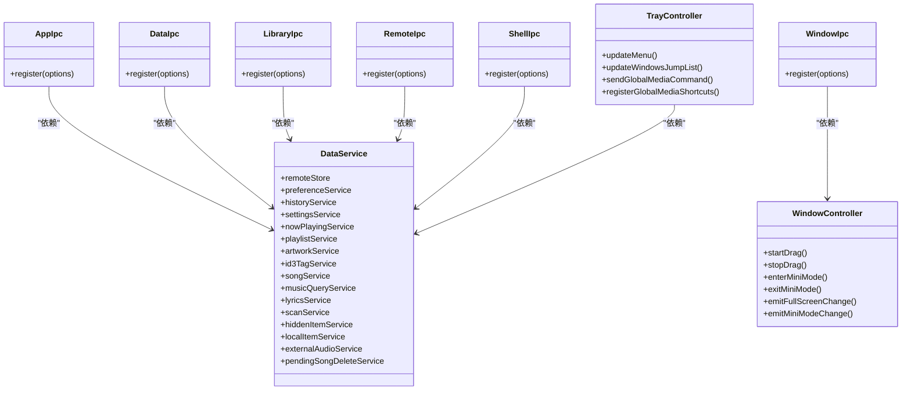

# IPC通信架构

<cite>
**本文档引用的文件**
- [electron/main.ts](file://electron/main.ts)
- [electron/preload.ts](file://electron/preload.ts)
- [electron/ipc/app-ipc.ts](file://electron/ipc/app-ipc.ts)
- [electron/ipc/data-ipc.ts](file://electron/ipc/data-ipc.ts)
- [electron/ipc/library-ipc.ts](file://electron/ipc/library-ipc.ts)
- [electron/ipc/remote-ipc.ts](file://electron/ipc/remote-ipc.ts)
- [electron/ipc/shell-ipc.ts](file://electron/ipc/shell-ipc.ts)
- [electron/ipc/window-ipc.ts](file://electron/ipc/window-ipc.ts)
- [electron/services/data-service.ts](file://electron/services/data-service.ts)
- [electron/window-controller.ts](file://electron/window-controller.ts)
- [electron/tray-controller.ts](file://electron/tray-controller.ts)
- [src/shared/contracts.ts](file://src/shared/contracts.ts)
</cite>

## 目录
1. [简介](#简介)
2. [项目结构](#项目结构)
3. [核心组件](#核心组件)
4. [架构总览](#架构总览)
5. [详细组件分析](#详细组件分析)
6. [依赖关系分析](#依赖关系分析)
7. [性能考虑](#性能考虑)
8. [故障排除指南](#故障排除指南)
9. [结论](#结论)

## 简介
本文件系统性阐述SMPlayer在Electron环境中的IPC（进程间通信）架构，覆盖主进程与渲染进程之间的消息传递机制、事件驱动模型、异步处理模式以及错误处理策略。文档重点解析以下通信接口：app-ipc、data-ipc、library-ipc、remote-ipc、shell-ipc、window-ipc，并给出消息协议、数据序列化、事件流与典型交互流程图，帮助开发者快速理解并扩展IPC能力。

## 项目结构
SMPlayer的IPC相关代码主要分布在以下位置：
- 主进程入口与注册：electron/main.ts
- 预加载桥接层：electron/preload.ts
- IPC处理器模块：electron/ipc/*.ts
- 业务服务层：electron/services/*.ts
- 控制器与系统集成：electron/window-controller.ts、electron/tray-controller.ts
- 类型契约：src/shared/contracts.ts

图表来源
- [electron/main.ts:141-209](file://electron/main.ts#L141-L209)
- [electron/preload.ts:45-286](file://electron/preload.ts#L45-L286)
- [electron/ipc/app-ipc.ts:10-16](file://electron/ipc/app-ipc.ts#L10-L16)
- [electron/ipc/data-ipc.ts:20-151](file://electron/ipc/data-ipc.ts#L20-L151)
- [electron/ipc/library-ipc.ts:28-302](file://electron/ipc/library-ipc.ts#L28-L302)
- [electron/ipc/remote-ipc.ts:19-54](file://electron/ipc/remote-ipc.ts#L19-L54)
- [electron/ipc/shell-ipc.ts:20-67](file://electron/ipc/shell-ipc.ts#L20-L67)
- [electron/ipc/window-ipc.ts:16-58](file://electron/ipc/window-ipc.ts#L16-L58)

章节来源
- [electron/main.ts:141-209](file://electron/main.ts#L141-L209)
- [electron/preload.ts:45-286](file://electron/preload.ts#L45-L286)

## 核心组件
- 预加载桥接层（contextBridge）：通过electron/preload.ts向渲染进程暴露统一的SmplayerApi，封装所有ipcRenderer.invoke/send/sendSync调用，提供类型安全的接口。
- IPC处理器：每个功能域独立注册ipcMain.handle或ipcMain.on，负责接收渲染进程请求并委派给DataService等服务层。
- 业务服务层：DataService聚合多个子服务（播放列表、历史、设置、扫描、歌词、本地项等），作为IPC处理器的后端执行引擎。
- 控制器与系统集成：WindowController负责窗口拖拽、全屏、迷你模式；TrayController负责托盘菜单、Windows跳转列表、全局媒体快捷键。

章节来源
- [electron/preload.ts:45-286](file://electron/preload.ts#L45-L286)
- [electron/services/data-service.ts:39-145](file://electron/services/data-service.ts#L39-L145)
- [electron/window-controller.ts:6-122](file://electron/window-controller.ts#L6-L122)
- [electron/tray-controller.ts:28-209](file://electron/tray-controller.ts#L28-L209)

## 架构总览
SMPlayer采用“预加载桥接层 + 功能域IPC处理器 + 业务服务层”的分层架构。渲染进程通过smplayer.* API发起请求，预加载层将其转换为ipcRenderer.invoke/send/sendSync调用，主进程对应的ipcMain.handle/on处理请求并返回结果或触发事件。

图表来源
- [electron/preload.ts:47-59](file://electron/preload.ts#L47-L59)
- [electron/ipc/library-ipc.ts:40](file://electron/ipc/library-ipc.ts#L40)
- [electron/services/data-service.ts:120-132](file://electron/services/data-service.ts#L120-L132)

## 详细组件分析

### app-ipc：应用信息与托盘状态
- 注册通道
  - app:get-info：返回平台、版本、打包状态、用户数据路径等信息
  - app:take-pending-open-files：获取待打开的歌曲ID队列
  - app:set-tray-playback-state：设置托盘播放状态
- 设计要点
  - 使用ipcMain.handle提供请求-响应式RPC
  - 通过选项回调更新托盘状态，解耦UI与系统托盘
- 典型调用链
  - 渲染进程调用smplayer.getAppInfo() → 预加载层invoke → 主进程handle → 组装AppInfo对象

章节来源
- [electron/ipc/app-ipc.ts:10-26](file://electron/ipc/app-ipc.ts#L10-L26)
- [electron/preload.ts:46](file://electron/preload.ts#L46)
- [src/shared/contracts.ts:1-6](file://src/shared/contracts.ts#L1-L6)

### data-ipc：播放库与偏好设置
- 注册通道
  - 播放库操作：收藏、批量收藏、更新歌曲时长、播放列表增删改查、重排
  - 队列管理：替换、移除、清空
  - 搜索历史：保存、添加最近、删除、恢复、清空
  - 最近播放：记录/移除/恢复/清空
  - 设置与偏好：更新应用设置、更新视图状态、更新播放设置、更新偏好项、清理无效项
  - 即时播放设置：playback:get-settings-immediate（同步）、playback:save-settings-immediate（同步）
  - 标记已播放：playback:mark-song-played
- 设计要点
  - 通过DataService的子服务（playlist/history/settings/preference/nowPlaying/song）委派具体逻辑
  - 部分操作完成后触发托盘菜单与Windows跳转列表更新
  - 同步通道用于低延迟读取播放设置
- 错误处理
  - 未见显式try/catch，异常会透传到渲染进程Promise拒绝

章节来源
- [electron/ipc/data-ipc.ts:20-151](file://electron/ipc/data-ipc.ts#L20-L151)
- [electron/services/data-service.ts:39-145](file://electron/services/data-service.ts#L39-L145)
- [electron/tray-controller.ts:122-160](file://electron/tray-controller.ts#L122-L160)

### library-ipc：音乐库与本地文件操作
- 注册通道
  - 快照查询：get-shell、get-settings、get-counts、get-songs、get-folders、get-recent-*、get-playlists、get-favorites、get-now-playing、get-search
  - 歌曲属性：get-song-properties、update-song-properties、update-song-play-count、update-song-duration
  - 艺术照：选择/保存/删除专辑封面、选择/保存/删除歌曲封面
  - 删除与回收站：删除歌曲/本地项、撤销/提交删除
  - 移动与重命名：移动歌曲/多首歌曲/本地文件夹、批量移动、更新本地文件夹排序、重命名本地文件夹、隐藏本地文件夹
  - 隐藏项：获取隐藏存储项、恢复隐藏项
  - 偏好设置：获取偏好设置
  - 歌词：导入、保存、打开浏览器搜索、从网络保存到文件
  - 库根目录：选择根目录
  - 扫描：全库扫描、准备扫描、文件夹扫描、取消扫描、分析艺术家拆分、应用拆分
  - 数据导入导出：导出数据库、导入数据库
- 设计要点
  - 大量异步操作（扫描、移动、导入导出）通过事件推送进度（library:scan-folder-progress、library:move-local-items-progress）
  - 对话框交互（Open/Save）在主进程弹出，避免渲染进程直接调用系统API
  - 艺术照处理涉及缓存清理（session.defaultSession.clearCache）
- 错误处理
  - 艺术照选择可能抛出“无封面”错误，返回特定错误码供渲染层处理

章节来源
- [electron/ipc/library-ipc.ts:28-302](file://electron/ipc/library-ipc.ts#L28-L302)
- [electron/ipc/library-ipc.ts:304-350](file://electron/ipc/library-ipc.ts#L304-L350)
- [electron/services/data-service.ts:39-145](file://electron/services/data-service.ts#L39-L145)

### remote-ipc：远程分享与主机连接
- 注册通道
  - 远程分享状态：get-status、update-settings、start、stop
  - 授权设备：list、update、delete
  - 远程主机：list、connect（含登录、拉取统计）、get-library（并发拉取歌曲/歌单/收藏/正在播放）、delete
- 设计要点
  - 通过RemotePlayServer与RemoteStore协调远程服务启停与授权
  - 连接过程包含基础URL标准化、服务端信息获取、登录令牌交换、统计信息拉取
  - 获取远程库时为歌曲补全媒体URL与令牌参数
- 错误处理
  - 远程HTTP请求失败抛出错误，由上层捕获

章节来源
- [electron/ipc/remote-ipc.ts:19-54](file://electron/ipc/remote-ipc.ts#L19-L54)
- [electron/ipc/remote-ipc.ts:71-135](file://electron/ipc/remote-ipc.ts#L71-L135)

### shell-ipc：系统外壳与通知
- 注册通道
  - 文件系统：reveal-item（在资源管理器中显示）、创建本地文件夹
  - 反馈：发送邮件、打开反馈页面、语音助手隐私设置
  - 语音识别：开始/取消识别，订阅识别假设与状态变更事件
  - 通知：show-track-notification（根据设置与系统支持决定是否展示）
  - 日志：打开系统日志目录
- 设计要点
  - 通过Notification API展示横幅通知，点击时恢复并聚焦主窗口
  - 语音识别回调通过webContents事件回推渲染层
- 错误处理
  - Notification不支持时直接返回；语音识别错误码通过结果对象携带

章节来源
- [electron/ipc/shell-ipc.ts:20-67](file://electron/ipc/shell-ipc.ts#L20-L67)
- [electron/tray-controller.ts:162-169](file://electron/tray-controller.ts#L162-L169)

### window-ipc：窗口控制与标题栏
- 注册通道
  - 开始/停止窗口拖拽（基于WindowController）
  - 设置窗口控件主题（背景色与标题栏覆盖）
  - 设置/获取全屏状态（进入迷你模式时自动退出）
  - 设置/获取迷你模式（进入时禁用最大化、置顶、调整尺寸；退出时恢复）
- 设计要点
  - Windows平台通过setTitleBarOverlay动态切换标题栏颜色与符号色
  - 全屏与迷你模式切换时通过webContents发送事件给渲染层

章节来源
- [electron/ipc/window-ipc.ts:16-58](file://electron/ipc/window-ipc.ts#L16-L58)
- [electron/window-controller.ts:62-116](file://electron/window-controller.ts#L62-L116)

### 预加载桥接层（SmplayerApi）
- 功能概览
  - 将所有ipcMain.handle/on注册的通道映射为类型安全的Promise/事件回调API
  - 提供library、playlist、search、remote、shell、window、data等域的统一入口
  - 支持事件监听（如扫描进度、语音识别、窗口状态变化）
- 设计要点
  - 使用contextBridge.exposeInMainWorld暴露smplayer对象
  - 严格区分invoke（请求-响应）、sendSync（同步）、on（事件监听）三类调用
- 典型流程
  - 渲染进程调用smplayer.library.getShell() → 预加载层ipcRenderer.invoke → 主进程library-ipc.handle → 返回数据

章节来源
- [electron/preload.ts:45-286](file://electron/preload.ts#L45-L286)

## 依赖关系分析

图表来源
- [electron/services/data-service.ts:39-145](file://electron/services/data-service.ts#L39-L145)
- [electron/ipc/app-ipc.ts:10-26](file://electron/ipc/app-ipc.ts#L10-L26)
- [electron/ipc/data-ipc.ts:20-151](file://electron/ipc/data-ipc.ts#L20-L151)
- [electron/ipc/library-ipc.ts:28-302](file://electron/ipc/library-ipc.ts#L28-L302)
- [electron/ipc/remote-ipc.ts:19-54](file://electron/ipc/remote-ipc.ts#L19-L54)
- [electron/ipc/shell-ipc.ts:20-67](file://electron/ipc/shell-ipc.ts#L20-L67)
- [electron/ipc/window-ipc.ts:16-58](file://electron/ipc/window-ipc.ts#L16-L58)
- [electron/window-controller.ts:6-122](file://electron/window-controller.ts#L6-L122)
- [electron/tray-controller.ts:28-209](file://electron/tray-controller.ts#L28-L209)

章节来源
- [electron/services/data-service.ts:39-145](file://electron/services/data-service.ts#L39-L145)
- [electron/ipc/app-ipc.ts:10-26](file://electron/ipc/app-ipc.ts#L10-L26)
- [electron/ipc/data-ipc.ts:20-151](file://electron/ipc/data-ipc.ts#L20-L151)
- [electron/ipc/library-ipc.ts:28-302](file://electron/ipc/library-ipc.ts#L28-L302)
- [electron/ipc/remote-ipc.ts:19-54](file://electron/ipc/remote-ipc.ts#L19-L54)
- [electron/ipc/shell-ipc.ts:20-67](file://electron/ipc/shell-ipc.ts#L20-L67)
- [electron/ipc/window-ipc.ts:16-58](file://electron/ipc/window-ipc.ts#L16-L58)
- [electron/window-controller.ts:6-122](file://electron/window-controller.ts#L6-L122)
- [electron/tray-controller.ts:28-209](file://electron/tray-controller.ts#L28-L209)

## 性能考虑
- 异步优先：大量耗时操作（扫描、导入导出、网络请求）通过事件流推送进度，避免阻塞主线程
- 缓存与懒加载：艺术照缓存、ID3标签写入回调、SQLite WAL检查点
- 同步通道谨慎使用：仅对极小数据（播放设置）使用sendSync，避免阻塞渲染
- 事件去抖与幂等：扫描进度与移动进度事件按批次推送，确保UI流畅

## 故障排除指南
- 无法显示系统通知
  - 检查Notification.isSupported()与设置中的通知开关
  - 确认系统权限与平台支持
- 语音识别失败
  - 平台不支持或隐私设置未允许麦克风时，结果对象会携带错误码
  - 取消识别需调用cancelSpeechRecognition
- 扫描/移动卡顿
  - 监听library:scan-folder-progress与library:move-local-items-progress事件，及时更新UI
  - 可通过cancelScanLocalFolder中断扫描
- 远程连接失败
  - 核查基础URL格式、密码正确性与网络连通性
  - 查看远程服务端返回的状态码与错误信息

章节来源
- [electron/ipc/shell-ipc.ts:34-66](file://electron/ipc/shell-ipc.ts#L34-L66)
- [electron/ipc/library-ipc.ts:248-250](file://electron/ipc/library-ipc.ts#L248-L250)
- [electron/ipc/remote-ipc.ts:62-69](file://electron/ipc/remote-ipc.ts#L62-L69)

## 结论
SMPlayer的IPC架构以预加载桥接层为核心，围绕功能域划分IPC处理器，业务逻辑集中在DataService中，实现了清晰的职责分离与良好的可维护性。通过事件驱动与异步处理，系统在复杂IO场景下仍保持流畅体验。建议后续在错误处理与日志追踪方面进一步完善，以提升可观测性与调试效率。