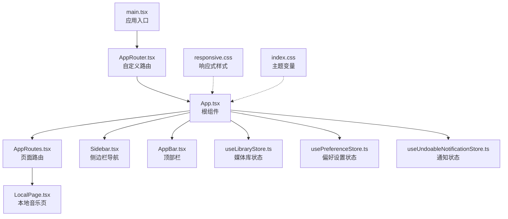
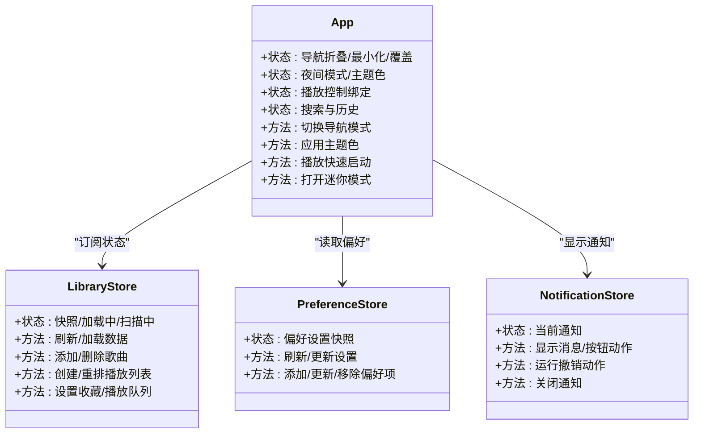
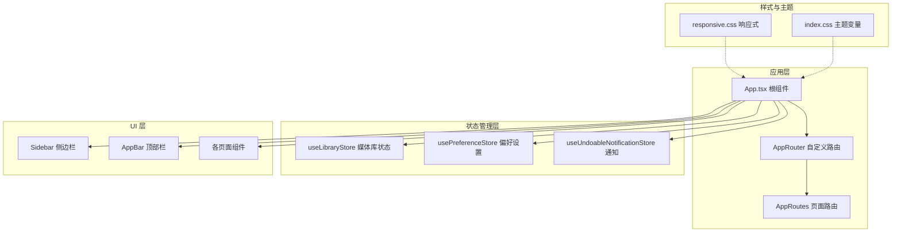
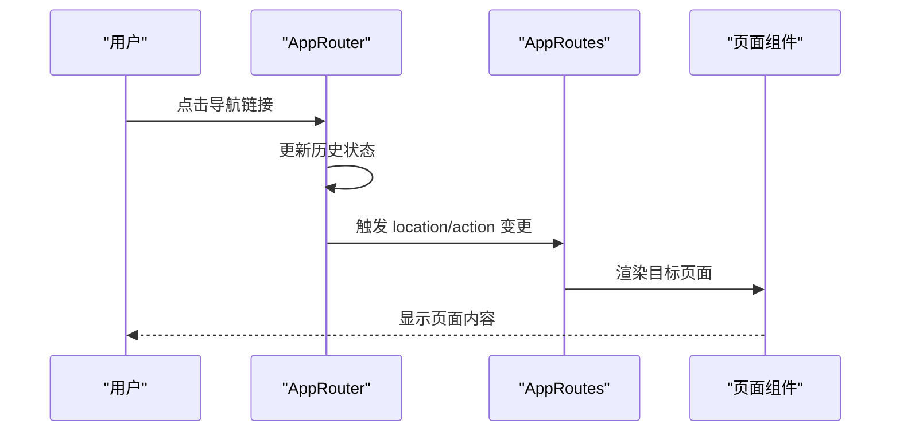
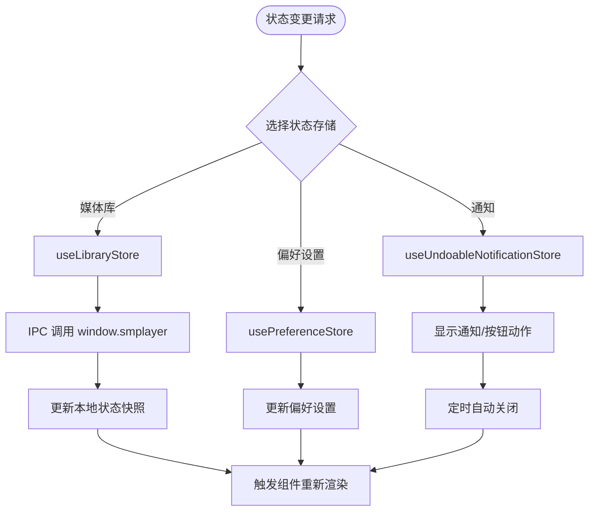
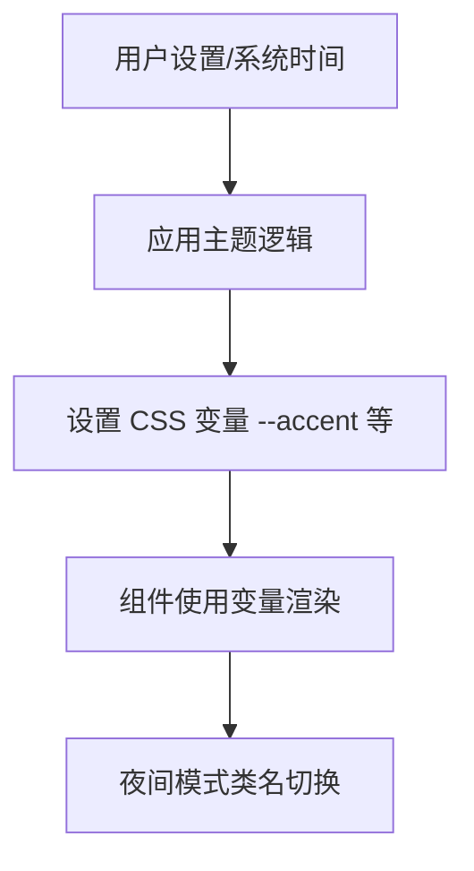
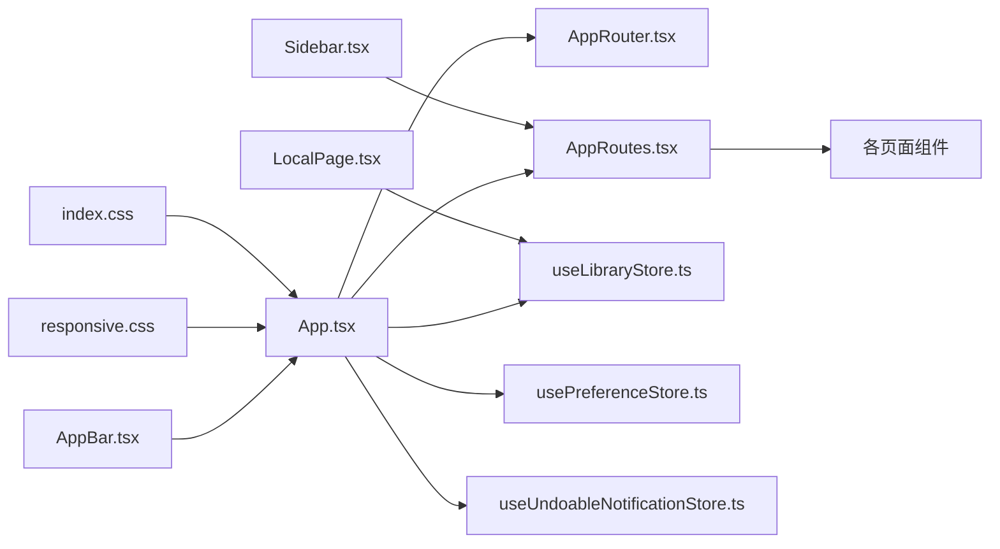

# 前端架构设计

<cite>
**本文档引用的文件**
- [src/App.tsx](file://src/App.tsx)
- [src/main.tsx](file://src/main.tsx)
- [src/AppRouter.tsx](file://src/AppRouter.tsx)
- [src/AppRoutes.tsx](file://src/AppRoutes.tsx)
- [src/appModel.ts](file://src/appModel.ts)
- [src/state/useLibraryStore.ts](file://src/state/useLibraryStore.ts)
- [src/state/usePreferenceStore.ts](file://src/state/usePreferenceStore.ts)
- [src/state/useUndoableNotificationStore.ts](file://src/state/useUndoableNotificationStore.ts)
- [src/components/AppBar.tsx](file://src/components/AppBar.tsx)
- [src/components/Sidebar.tsx](file://src/components/Sidebar.tsx)
- [src/pages/LocalPage.tsx](file://src/pages/LocalPage.tsx)
- [src/styles/responsive.css](file://src/styles/responsive.css)
- [src/shared/libraryViews.ts](file://src/shared/libraryViews.ts)
- [src/index.css](file://src/index.css)
</cite>

## 目录
1. [引言](#引言)
2. [项目结构](#项目结构)
3. [核心组件](#核心组件)
4. [架构总览](#架构总览)
5. [详细组件分析](#详细组件分析)
6. [依赖关系分析](#依赖关系分析)
7. [性能考虑](#性能考虑)
8. [故障排除指南](#故障排除指南)
9. [结论](#结论)

## 引言

本文件为 SMPlayer 的前端架构设计文档，基于 React 19 应用的实际代码实现，深入解析其组件化设计、路由系统、状态管理策略与响应式设计体系。SMPlayer 采用 Electron 环境下的前端架构，结合自定义路由实现与 Zustand 状态管理，构建了完整的音乐播放器用户界面。

该架构以 App.tsx 根组件为核心，通过 AppRouter 提供的自定义路由机制承载页面导航；状态管理由多个 Zustand Store 组成，分别负责媒体库数据、偏好设置与可撤销通知；UI 层采用模块化的组件设计，并通过 CSS 媒体查询实现响应式布局与主题系统。

## 项目结构

SMPlayer 前端采用清晰的分层组织：
- 入口与根组件：main.tsx 负责渲染 App，App.tsx 作为根容器承载全局状态与布局。
- 路由系统：AppRouter 自定义 Hash 路由，AppRoutes 定义各页面路由与数据加载策略。
- 状态管理：useLibraryStore（媒体库）、usePreferenceStore（偏好设置）、useUndoableNotificationStore（通知）。
- 页面与组件：pages 目录包含各业务页面，components 目录包含通用 UI 组件，styles 提供样式与响应式规则。
- 工具与共享逻辑：shared 目录提供国际化、格式化、视图构建等工具函数。

**图表来源**
- [src/main.tsx:1-15](file://src/main.tsx#L1-L15)
- [src/AppRouter.tsx:1-82](file://src/AppRouter.tsx#L1-L82)
- [src/App.tsx:1-1258](file://src/App.tsx#L1-L1258)
- [src/AppRoutes.tsx:1-1108](file://src/AppRoutes.tsx#L1-L1108)
- [src/components/Sidebar.tsx:1-538](file://src/components/Sidebar.tsx#L1-L538)
- [src/components/AppBar.tsx:1-45](file://src/components/AppBar.tsx#L1-L45)
- [src/pages/LocalPage.tsx:1-1566](file://src/pages/LocalPage.tsx#L1-L1566)
- [src/state/useLibraryStore.ts:1-1339](file://src/state/useLibraryStore.ts#L1-L1339)
- [src/state/usePreferenceStore.ts:1-160](file://src/state/usePreferenceStore.ts#L1-L160)
- [src/state/useUndoableNotificationStore.ts:1-113](file://src/state/useUndoableNotificationStore.ts#L1-L113)
- [src/styles/responsive.css:1-560](file://src/styles/responsive.css#L1-L560)
- [src/index.css:67-101](file://src/index.css#L67-L101)

**章节来源**
- [src/main.tsx:1-15](file://src/main.tsx#L1-L15)
- [src/App.tsx:1-1258](file://src/App.tsx#L1-L1258)
- [src/AppRouter.tsx:1-82](file://src/AppRouter.tsx#L1-L82)
- [src/AppRoutes.tsx:1-1108](file://src/AppRoutes.tsx#L1-L1108)

## 核心组件

### 根组件 App.tsx 设计理念

App.tsx 是整个应用的根容器，承担以下职责：
- 全局状态订阅：通过 useLibraryStore 订阅媒体库快照与状态，驱动页面渲染与交互。
- 路由与导航：维护导航深度、滚动位置记忆、标题栏行为与迷你模式切换。
- 主题与夜间模式：根据设置动态应用主题色与夜间模式类名。
- 媒体控制：集成播放控制器与播放命令，统一处理播放、暂停、音量、重复/随机等操作。
- 搜索与历史：集中管理搜索输入、提交与最近搜索记录。
- 通知与对话框：协调可撤销通知与弹窗栈，确保用户体验一致性。
- 响应式布局：监听窗口尺寸变化，动态切换导航模式（最小化、覆盖、宽屏）。

**图表来源**
- [src/App.tsx:71-800](file://src/App.tsx#L71-L800)
- [src/state/useLibraryStore.ts:111-1339](file://src/state/useLibraryStore.ts#L111-L1339)
- [src/state/usePreferenceStore.ts:51-160](file://src/state/usePreferenceStore.ts#L51-L160)
- [src/state/useUndoableNotificationStore.ts:41-113](file://src/state/useUndoableNotificationStore.ts#L41-L113)

**章节来源**
- [src/App.tsx:71-800](file://src/App.tsx#L71-L800)

### 页面组件职责划分

- LocalPage：本地音乐浏览与管理，支持文件夹导航、歌曲排序、多选操作、拖拽移动与批量操作。
- AlbumsPage/ArtistsPage/MusicLibraryPage：媒体库内容展示，支持网格/列表视图、搜索与排序。
- NowPlayingPage：播放队列与当前播放控制，支持上一首/下一首、重复/随机模式切换。
- SettingsPage/PreferenceSettingsPage：设置与偏好配置，支持主题色、语言、夜间模式等。
- SearchPage：全局搜索结果展示，支持按类型过滤与历史记录。

**章节来源**
- [src/pages/LocalPage.tsx:152-200](file://src/pages/LocalPage.tsx#L152-L200)
- [src/AppRoutes.tsx:326-820](file://src/AppRoutes.tsx#L326-L820)

### 组件间通信方式

- Props 下传：App.tsx 将播放控制、搜索、导航等能力通过 props 注入到各页面组件。
- Zustand 订阅：页面组件通过 useLibraryStore/usePreferenceStore 订阅状态变化，自动更新 UI。
- 回调函数：组件通过回调函数向根组件或状态管理发起操作请求（如播放、添加到播放列表、设置收藏等）。
- 事件总线：部分功能通过自定义事件（如库快速跳转、沉浸式标题变更）在组件间传递信息。

**章节来源**
- [src/App.tsx:312-335](file://src/App.tsx#L312-L335)
- [src/AppRoutes.tsx:200-240](file://src/AppRoutes.tsx#L200-L240)

## 架构总览

SMPlayer 前端采用“根组件 + 自定义路由 + Zustand 状态”的架构模式：

**图表来源**
- [src/App.tsx:71-800](file://src/App.tsx#L71-L800)
- [src/AppRouter.tsx:25-82](file://src/AppRouter.tsx#L25-L82)
- [src/AppRoutes.tsx:176-200](file://src/AppRoutes.tsx#L176-L200)
- [src/state/useLibraryStore.ts:111-1339](file://src/state/useLibraryStore.ts#L111-L1339)
- [src/state/usePreferenceStore.ts:51-160](file://src/state/usePreferenceStore.ts#L51-L160)
- [src/state/useUndoableNotificationStore.ts:41-113](file://src/state/useUndoableNotificationStore.ts#L41-L113)
- [src/styles/responsive.css:1-560](file://src/styles/responsive.css#L1-L560)
- [src/index.css:67-101](file://src/index.css#L67-L101)

## 详细组件分析

### 路由系统与导航

AppRouter 实现了基于 Hash 的自定义路由，通过监听 hashchange 与 popstate 同步 location 与 action，提供 push/replace/go 方法，确保与 Electron 环境兼容。

**图表来源**
- [src/AppRouter.tsx:25-82](file://src/AppRouter.tsx#L25-L82)
- [src/AppRoutes.tsx:176-200](file://src/AppRoutes.tsx#L176-L200)

**章节来源**
- [src/AppRouter.tsx:25-82](file://src/AppRouter.tsx#L25-L82)
- [src/AppRoutes.tsx:176-200](file://src/AppRoutes.tsx#L176-L200)

### 状态管理策略（Zustand）

Zustand 在 SMPlayer 中被用于三类状态管理：
- 媒体库状态（useLibraryStore）：封装对 window.smplayer 的 IPC 调用，提供刷新、加载、扫描、播放队列、收藏、播放列表等操作。
- 偏好设置状态（usePreferenceStore）：管理用户偏好项（歌曲/艺术家/专辑/播放列表/文件夹），支持增删改查与失效项清理。
- 通知状态（useUndoableNotificationStore）：提供可撤销通知的显示、按钮动作与自动关闭机制。

**图表来源**
- [src/state/useLibraryStore.ts:111-1339](file://src/state/useLibraryStore.ts#L111-L1339)
- [src/state/usePreferenceStore.ts:51-160](file://src/state/usePreferenceStore.ts#L51-L160)
- [src/state/useUndoableNotificationStore.ts:41-113](file://src/state/useUndoableNotificationStore.ts#L41-L113)

**章节来源**
- [src/state/useLibraryStore.ts:111-1339](file://src/state/useLibraryStore.ts#L111-L1339)
- [src/state/usePreferenceStore.ts:51-160](file://src/state/usePreferenceStore.ts#L51-L160)
- [src/state/useUndoableNotificationStore.ts:41-113](file://src/state/useUndoableNotificationStore.ts#L41-L113)

### 响应式设计与主题系统

- 响应式设计：通过 responsive.css 的媒体查询适配不同屏幕宽度，调整播放器布局、卡片网格与命令栏显示。
- 主题系统：index.css 定义夜间模式变量，appModel.ts 提供 applyThemeColor 动态设置 CSS 变量，实现主题色与夜间模式切换。

**图表来源**
- [src/styles/responsive.css:1-560](file://src/styles/responsive.css#L1-L560)
- [src/index.css:67-101](file://src/index.css#L67-L101)
- [src/appModel.ts:136-150](file://src/appModel.ts#L136-L150)

**章节来源**
- [src/styles/responsive.css:1-560](file://src/styles/responsive.css#L1-L560)
- [src/index.css:67-101](file://src/index.css#L67-L101)
- [src/appModel.ts:136-150](file://src/appModel.ts#L136-L150)

### 组件复用与扩展设计

- 组件复用：Sidebar、AppBar、CommandBar 等通用组件在多页面复用，通过 props 注入能力与事件回调实现扩展。
- 视图构建：libraryViews.ts 提供卡片视图构建工具，统一艺术家、专辑、文件夹与最近播放的展示格式。
- 模块化页面：LocalPage 等页面组件通过组合子组件与 hooks 实现功能解耦，便于扩展新功能。

**章节来源**
- [src/components/Sidebar.tsx:67-538](file://src/components/Sidebar.tsx#L67-L538)
- [src/components/AppBar.tsx:18-45](file://src/components/AppBar.tsx#L18-L45)
- [src/shared/libraryViews.ts:110-339](file://src/shared/libraryViews.ts#L110-L339)

## 依赖关系分析

**图表来源**
- [src/App.tsx:71-800](file://src/App.tsx#L71-L800)
- [src/AppRouter.tsx:25-82](file://src/AppRouter.tsx#L25-L82)
- [src/AppRoutes.tsx:176-200](file://src/AppRoutes.tsx#L176-L200)
- [src/state/useLibraryStore.ts:111-1339](file://src/state/useLibraryStore.ts#L111-L1339)
- [src/state/usePreferenceStore.ts:51-160](file://src/state/usePreferenceStore.ts#L51-L160)
- [src/state/useUndoableNotificationStore.ts:41-113](file://src/state/useUndoableNotificationStore.ts#L41-L113)
- [src/components/Sidebar.tsx:67-538](file://src/components/Sidebar.tsx#L67-L538)
- [src/components/AppBar.tsx:18-45](file://src/components/AppBar.tsx#L18-L45)
- [src/pages/LocalPage.tsx:152-200](file://src/pages/LocalPage.tsx#L152-L200)
- [src/styles/responsive.css:1-560](file://src/styles/responsive.css#L1-L560)
- [src/index.css:67-101](file://src/index.css#L67-L101)

**章节来源**
- [src/App.tsx:71-800](file://src/App.tsx#L71-L800)
- [src/AppRoutes.tsx:176-200](file://src/AppRoutes.tsx#L176-L200)

## 性能考虑

- 状态粒度：Zustand Store 将媒体库、偏好与通知分离，避免无关状态导致的重渲染。
- 数据懒加载：RequireLibraryData 高阶组件仅在需要时加载歌曲/文件夹/最近数据，减少初始负载。
- 滚动位置记忆：通过 getScrollElementKey 与 Map 记录滚动位置，提升页面切换体验。
- 响应式优化：媒体查询仅在必要时改变布局，避免过度重排。
- IPC 调用：媒体库相关操作通过 window.smplayer IPC 执行，避免主线程阻塞。

[本节为通用指导，无需特定文件引用]

## 故障排除指南

- 媒体库未加载：检查 useLibraryStore 的 refreshShell/loadSongs/loadFolders 是否成功执行，确认 window.smplayer 可用。
- 偏好设置不生效：确认 usePreferenceStore 的 updateSettings 是否正确调用 IPC 并更新快照。
- 通知不显示：检查 useUndoableNotificationStore 的 show/showButtons 是否被调用，确认定时器是否被清除。
- 路由异常：验证 AppRouter 的 hashchange/popstate 监听是否正常，确保 location/action 与 navigator 正确同步。
- 夜间模式/主题色无效：确认 appModel.applyThemeColor 是否被调用，CSS 变量是否正确设置。

**章节来源**
- [src/state/useLibraryStore.ts:124-144](file://src/state/useLibraryStore.ts#L124-L144)
- [src/state/usePreferenceStore.ts:72-88](file://src/state/usePreferenceStore.ts#L72-L88)
- [src/state/useUndoableNotificationStore.ts:46-66](file://src/state/useUndoableNotificationStore.ts#L46-L66)
- [src/AppRouter.tsx:56-70](file://src/AppRouter.tsx#L56-L70)
- [src/appModel.ts:136-150](file://src/appModel.ts#L136-L150)

## 结论

SMPlayer 的前端架构以 React 19 为基础，结合自定义路由与 Zustand 状态管理，实现了清晰的组件化设计与良好的可维护性。通过 App.tsx 根组件统一调度全局状态与交互，配合响应式样式与主题系统，满足多场景使用需求。未来可在以下方面持续优化：
- 进一步拆分大型页面组件，提升可测试性与可维护性。
- 引入缓存策略与错误边界，增强稳定性。
- 丰富组件库与设计系统，统一视觉与交互规范。

[本节为总结性内容，无需特定文件引用]