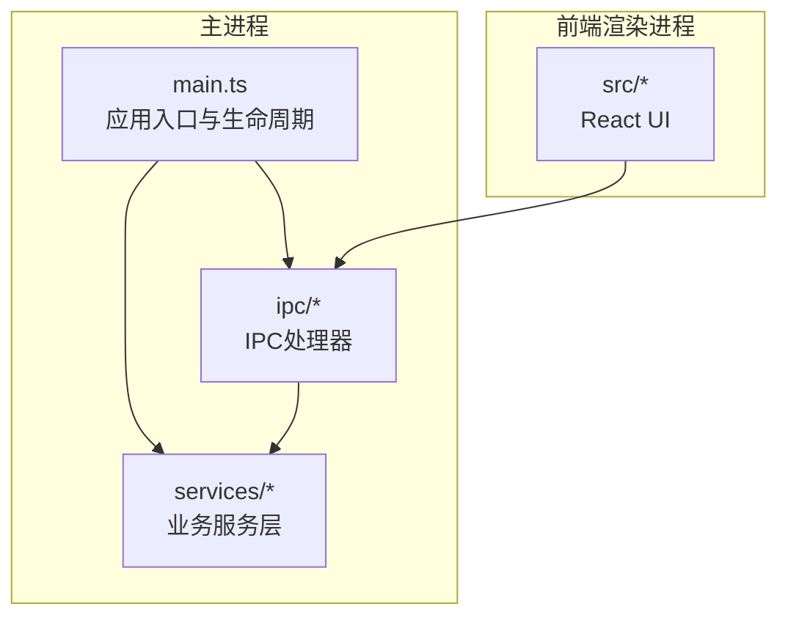
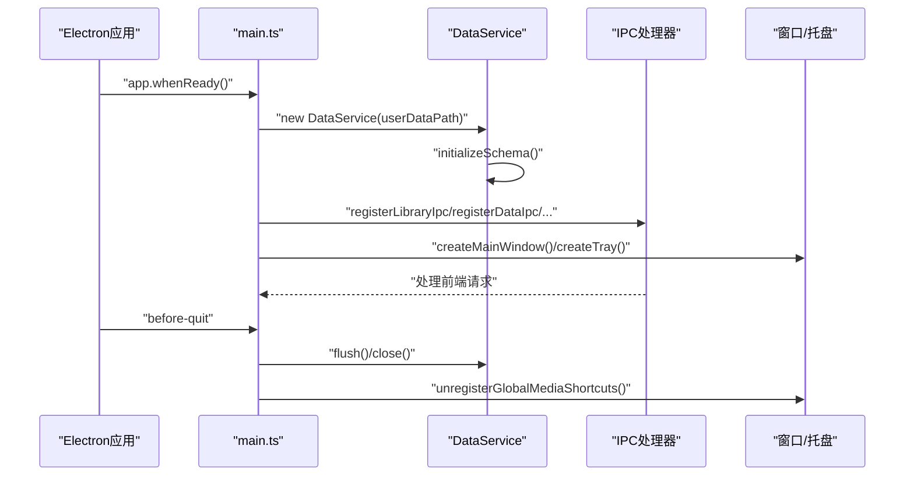
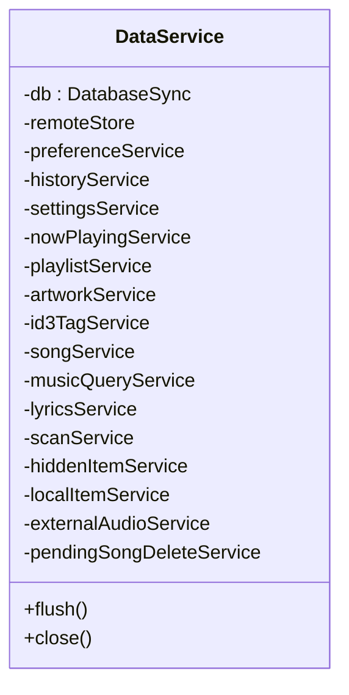
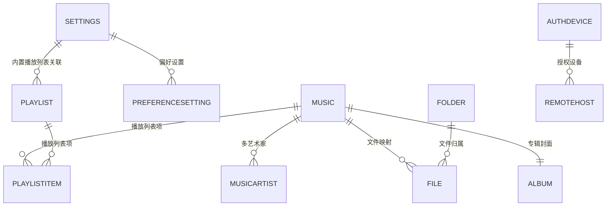
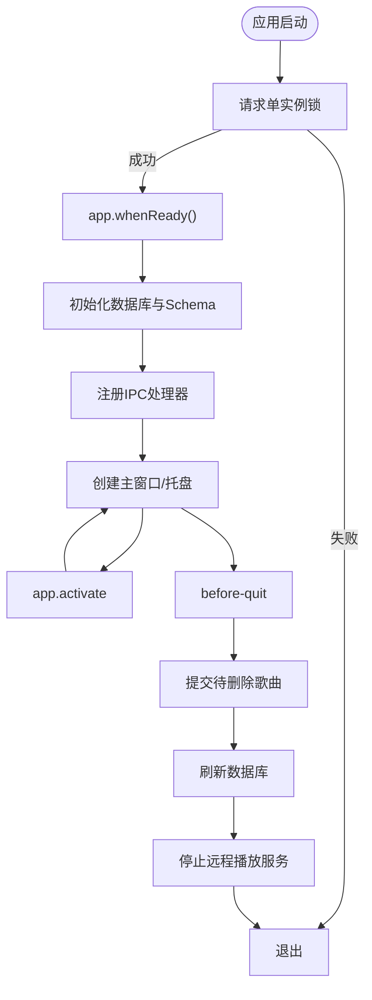
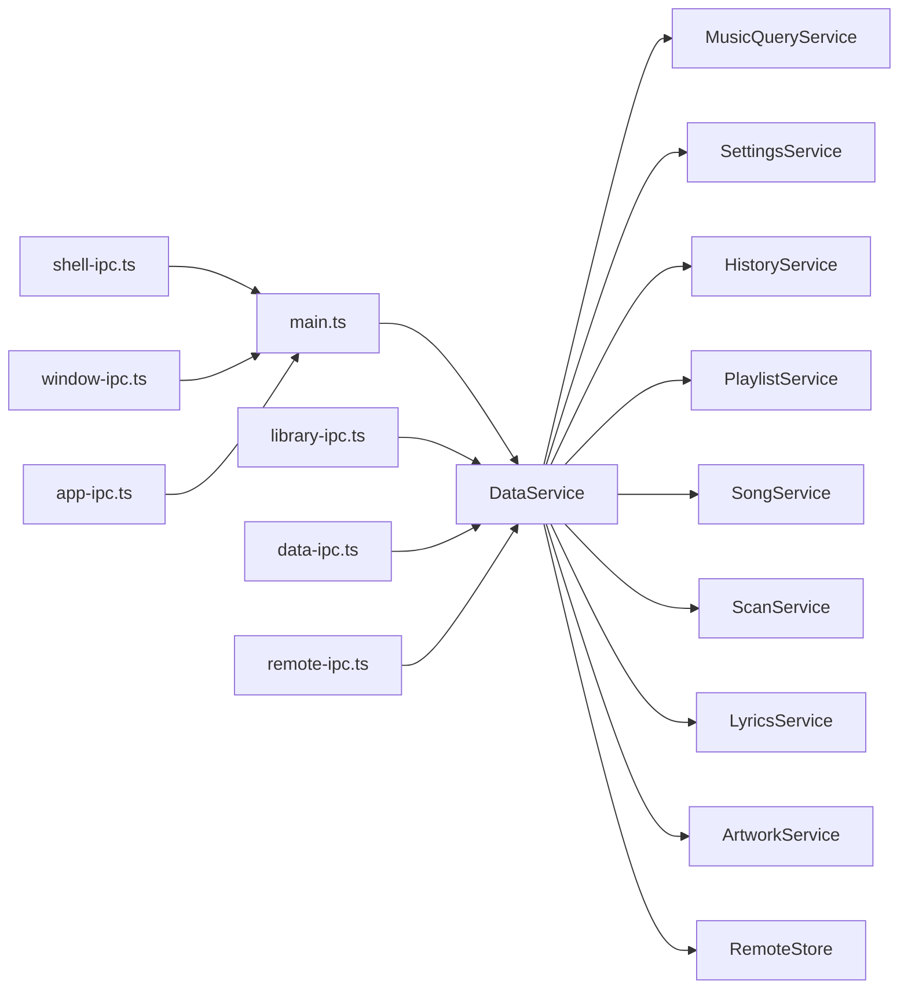

# 后端架构设计

<cite>
**本文档引用的文件**
- [electron/main.ts](file://electron/main.ts)
- [electron/services/data-service.ts](file://electron/services/data-service.ts)
- [electron/services/schema.ts](file://electron/services/schema.ts)
- [electron/services/song-service.ts](file://electron/services/song-service.ts)
- [electron/services/playlist-service.ts](file://electron/services/playlist-service.ts)
- [electron/services/history-service.ts](file://electron/services/history-service.ts)
- [electron/services/settings-service.ts](file://electron/services/settings-service.ts)
- [electron/services/music-query-service.ts](file://electron/services/music-query-service.ts)
- [electron/services/scan-service.ts](file://electron/services/scan-service.ts)
- [electron/ipc/data-ipc.ts](file://electron/ipc/data-ipc.ts)
- [electron/ipc/library-ipc.ts](file://electron/ipc/library-ipc.ts)
- [electron/ipc/remote-ipc.ts](file://electron/ipc/remote-ipc.ts)
- [electron/ipc/shell-ipc.ts](file://electron/ipc/shell-ipc.ts)
- [electron/ipc/window-ipc.ts](file://electron/ipc/window-ipc.ts)
- [electron/ipc/app-ipc.ts](file://electron/ipc/app-ipc.ts)
</cite>

## 目录
1. [简介](#简介)
2. [项目结构](#项目结构)
3. [核心组件](#核心组件)
4. [架构总览](#架构总览)
5. [详细组件分析](#详细组件分析)
6. [依赖关系分析](#依赖关系分析)
7. [性能考虑](#性能考虑)
8. [故障排除指南](#故障排除指南)
9. [结论](#结论)

## 简介
本文件面向SMPlayer的Electron主进程后端，系统性阐述服务层架构、SQLite数据库设计、IPC通信层与应用生命周期管理。重点包括：
- DataService作为服务总线的设计理念与职责边界
- 专用服务的协作关系与数据访问模式
- SQLite数据库表结构、索引与迁移策略
- IPC处理器的注册与调用流程
- 应用生命周期、文件系统操作与系统集成功能

## 项目结构
主进程后端位于 electron 目录，采用“服务层 + IPC处理器”的分层设计：
- 主入口负责应用生命周期、窗口控制、托盘集成与IPC注册
- 服务层封装业务逻辑与数据访问，提供强内聚弱耦合的领域服务
- IPC层负责前端与主进程之间的消息桥接

**图表来源**
- [electron/main.ts:141-209](file://electron/main.ts#L141-L209)
- [electron/ipc/data-ipc.ts:20-151](file://electron/ipc/data-ipc.ts#L20-L151)

**章节来源**
- [electron/main.ts:141-243](file://electron/main.ts#L141-L243)

## 核心组件
- DataService：服务总线，聚合所有业务服务（设置、历史、播放列表、歌曲、扫描、歌词、专辑封面等），统一初始化与清理
- MusicQueryService：查询聚合器，提供库快照（设置、计数、歌曲、播放列表、收藏、最近播放、搜索）
- 专用服务：SettingsService、HistoryService、PlaylistService、SongService、ScanService、ArtworkService、LyricsService、RemoteStore、NowPlayingService、LocalItemService等
- IPC处理器：按功能域拆分（library、data、remote、shell、window、app）

**章节来源**
- [electron/services/data-service.ts:39-145](file://electron/services/data-service.ts#L39-L145)
- [electron/services/music-query-service.ts:50-180](file://electron/services/music-query-service.ts#L50-L180)

## 架构总览
主进程启动时完成以下关键步骤：
- 初始化用户数据路径与SQLite数据库
- 创建DataService并执行数据库初始化与迁移
- 注册各类IPC处理器，建立前后端通信通道
- 创建主窗口、托盘控制器与远程播放服务器
- 绑定应用生命周期事件（单实例锁、激活、退出前清理、窗口关闭）

**图表来源**
- [electron/main.ts:141-232](file://electron/main.ts#L141-L232)
- [electron/services/data-service.ts:64-145](file://electron/services/data-service.ts#L64-L145)
- [electron/services/schema.ts:33-364](file://electron/services/schema.ts#L33-L364)

## 详细组件分析

### 服务总线：DataService
- 职责：集中管理数据库连接、初始化Schema、装配各领域服务、提供统一的flush/close能力
- 关键点：
  - 数据库初始化与迁移在构造函数中完成
  - 通过预编译SQL语句提升查询性能
  - 在构造函数末尾初始化内置播放列表与默认设置
  - 提供清理方法以触发WAL检查点

**图表来源**
- [electron/services/data-service.ts:39-145](file://electron/services/data-service.ts#L39-L145)

**章节来源**
- [electron/services/data-service.ts:64-198](file://electron/services/data-service.ts#L64-L198)

### 数据库架构与迁移：Schema
- 设计要点：
  - 使用WAL模式、NORMAL同步、外键约束
  - 核心表：Settings、Music、Album、MusicArtist、Folder、File、Playlist、PlaylistItem、PreferenceSetting、PreferenceItem、RecentRecord、SearchState、SearchHistory、HiddenStorageItem、RemoteSetting、AuthorizedDevice、RemoteHost
  - 唯一索引与普通索引覆盖高频查询场景
  - 运行时列迁移与索引重建，保证向后兼容
  - 启动时自动同步专辑与历史记录字段

**图表来源**
- [electron/services/schema.ts:33-260](file://electron/services/schema.ts#L33-L260)

**章节来源**
- [electron/services/schema.ts:33-364](file://electron/services/schema.ts#L33-L364)

### 查询聚合：MusicQueryService
- 职责：将多个服务的数据整合为前端友好的库快照，包括设置、计数、歌曲、播放列表、收藏、最近播放、搜索
- 复杂度与优化：
  - 预编译SQL减少解析开销
  - 按需分组与限制返回数量，避免一次性加载海量数据
  - 对日期时间进行归一化处理，兼容多种存储格式

**章节来源**
- [electron/services/music-query-service.ts:50-418](file://electron/services/music-query-service.ts#L50-L418)

### 专用服务

#### 歌曲服务：SongService
- 功能：读取/更新歌曲元数据、写入ID3标签、计算时长、批量应用艺人拆分
- 数据访问：使用预编译语句与事务，确保一致性
- 元数据读取：结合文件系统stat与音乐元数据解析库

**章节来源**
- [electron/services/song-service.ts:17-297](file://electron/services/song-service.ts#L17-L297)

#### 播放列表服务：PlaylistService
- 功能：内置与自定义播放列表管理、歌曲增删改排序、优先级维护、失效项清理
- 优化：批量插入与更新，使用CASE WHEN动态赋值

**章节来源**
- [electron/services/playlist-service.ts:9-508](file://electron/services/playlist-service.ts#L9-L508)

#### 历史记录服务：HistoryService
- 功能：搜索历史、最近播放（歌曲/专辑/艺人）、播放计数更新
- 日期兼容：支持DotNet时间戳、ISO字符串与数值时间戳

**章节来源**
- [electron/services/history-service.ts:30-484](file://electron/services/history-service.ts#L30-L484)

#### 设置服务：SettingsService
- 功能：应用设置、视图状态、播放设置的读取与更新
- 映射：将枚举值与UI配置进行双向转换

**章节来源**
- [electron/services/settings-service.ts:61-577](file://electron/services/settings-service.ts#L61-L577)

#### 扫描服务：ScanService
- 功能：全量/增量扫描音乐库、隐藏项过滤、艺人智能拆分、缩略图缓存清理
- 并发：音频元数据读取并发控制
- 进度：分阶段上报（检查、读取、更新），支持取消

**章节来源**
- [electron/services/scan-service.ts:65-800](file://electron/services/scan-service.ts#L65-L800)

### IPC通信层

#### 数据类IPC：data-ipc
- 职责：播放队列、收藏、搜索历史、设置、偏好等数据变更
- 特点：handle/on组合，即时响应与异步处理并存

**章节来源**
- [electron/ipc/data-ipc.ts:20-151](file://electron/ipc/data-ipc.ts#L20-L151)

#### 库类IPC：library-ipc
- 职责：库快照、歌曲属性、专辑封面、歌词、扫描、导入导出、本地文件操作
- 特点：大量对话框与文件系统交互，进度事件驱动

**章节来源**
- [electron/ipc/library-ipc.ts:28-302](file://electron/ipc/library-ipc.ts#L28-L302)

#### 远程IPC：remote-ipc
- 职责：远程分享开关、授权设备管理、远端主机连接与拉取库数据
- 特点：基于HTTP API的远程调用与令牌管理

**章节来源**
- [electron/ipc/remote-ipc.ts:19-135](file://electron/ipc/remote-ipc.ts#L19-L135)

#### Shell与窗口IPC：shell-ipc、window-ipc
- 职责：系统集成（通知、反馈、语音助手隐私设置）、窗口控制（拖拽、全屏、迷你模式）
- 特点：跨平台行为差异处理

**章节来源**
- [electron/ipc/shell-ipc.ts:20-100](file://electron/ipc/shell-ipc.ts#L20-L100)
- [electron/ipc/window-ipc.ts:16-59](file://electron/ipc/window-ipc.ts#L16-L59)

#### 应用信息IPC：app-ipc
- 职责：应用版本、打包状态、用户数据路径、托盘播放状态

**章节来源**
- [electron/ipc/app-ipc.ts:10-26](file://electron/ipc/app-ipc.ts#L10-L26)

### 应用生命周期管理
- 单实例锁：防止重复启动
- activate：macOS下无窗口时重新创建
- before-quit：提交待删除歌曲、刷新数据库、停止远程播放服务
- will-quit：注销全局媒体快捷键
- window-all-closed：非macOS退出

**图表来源**
- [electron/main.ts:78-242](file://electron/main.ts#L78-L242)

**章节来源**
- [electron/main.ts:78-242](file://electron/main.ts#L78-L242)

## 依赖关系分析

**图表来源**
- [electron/main.ts:141-209](file://electron/main.ts#L141-L209)
- [electron/services/data-service.ts:73-142](file://electron/services/data-service.ts#L73-L142)

**章节来源**
- [electron/services/data-service.ts:39-145](file://electron/services/data-service.ts#L39-L145)

## 性能考虑
- 数据库层
  - WAL模式与索引优化降低查询延迟
  - 预编译语句减少SQL解析成本
  - 事务批处理（如扫描、更新）提升吞吐
- 文件系统与网络
  - 扫描过程并发读取元数据，合理控制并发度
  - 缩略图缓存清理后台执行，避免阻塞IPC返回
  - 远程请求失败不影响扫描主流程
- 前后端交互
  - 分阶段进度上报，避免长时间阻塞
  - handle/on混合使用，兼顾实时性与可靠性

[本节为通用指导，无需具体文件引用]

## 故障排除指南
- 扫描中断
  - 现象：扫描进度未完成即停止
  - 排查：检查取消标志、磁盘权限、隐藏项配置
  - 参考：扫描服务的取消检测与进度回调
- 数据库损坏或迁移失败
  - 现象：启动时报错或数据不一致
  - 排查：确认WAL模式、索引重建、列迁移是否成功
  - 参考：Schema初始化与迁移逻辑
- 远程连接异常
  - 现象：无法连接远端主机或获取库数据
  - 排查：核对密码、设备ID、Token有效性与网络连通性
  - 参考：远程IPC的连接与鉴权流程
- 托盘/通知问题
  - 现象：托盘菜单不更新或通知不显示
  - 排查：确认托盘控制器状态、通知权限与系统设置
  - 参考：主进程生命周期与托盘注册

**章节来源**
- [electron/services/scan-service.ts:16-23](file://electron/services/scan-service.ts#L16-L23)
- [electron/services/schema.ts:33-364](file://electron/services/schema.ts#L33-L364)
- [electron/ipc/remote-ipc.ts:71-111](file://electron/ipc/remote-ipc.ts#L71-L111)
- [electron/main.ts:221-236](file://electron/main.ts#L221-L236)

## 结论
SMPlayer主进程后端采用“服务总线 + 专用服务 + IPC处理器”的清晰分层架构。DataService作为服务总线，将设置、历史、播放、扫描、歌词、封面等子系统有机整合；SQLite Schema提供稳定的数据模型与迁移能力；IPC层以功能域划分，既保证了职责分离，又便于扩展与维护。整体设计在性能、可维护性与用户体验之间取得良好平衡。