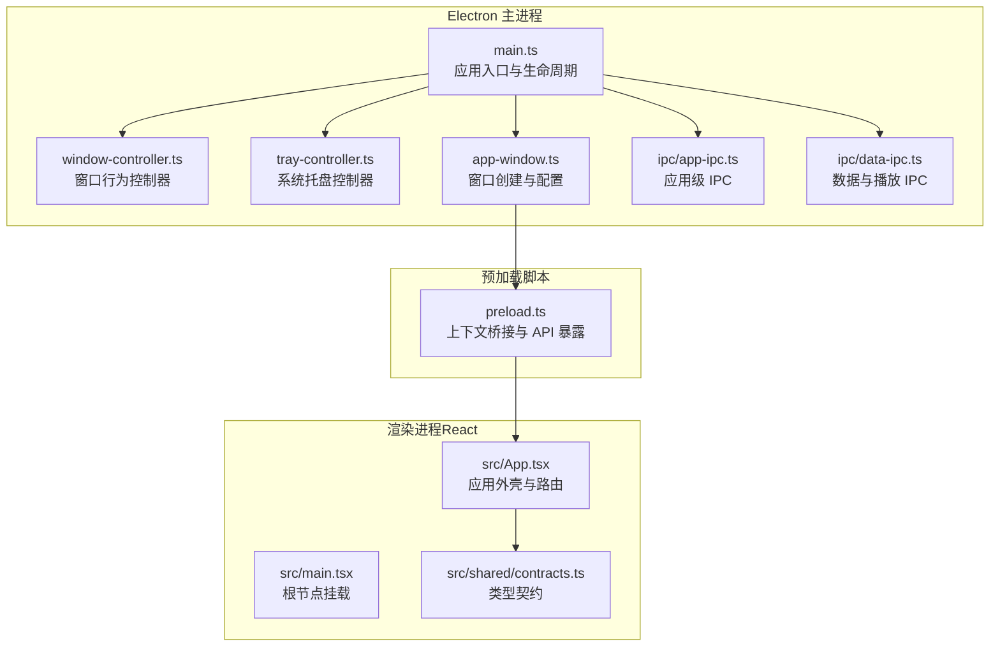
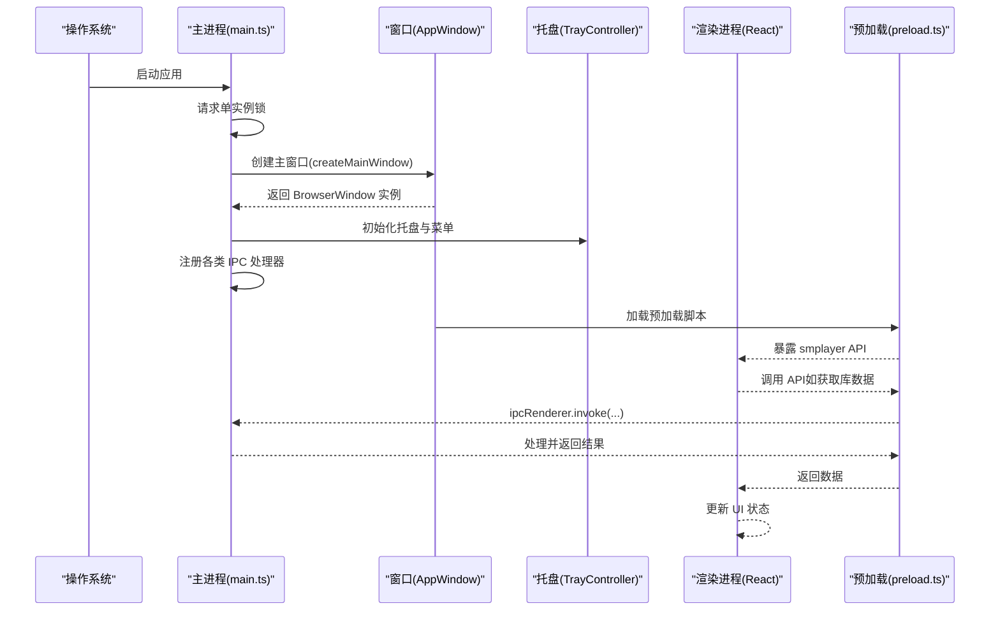
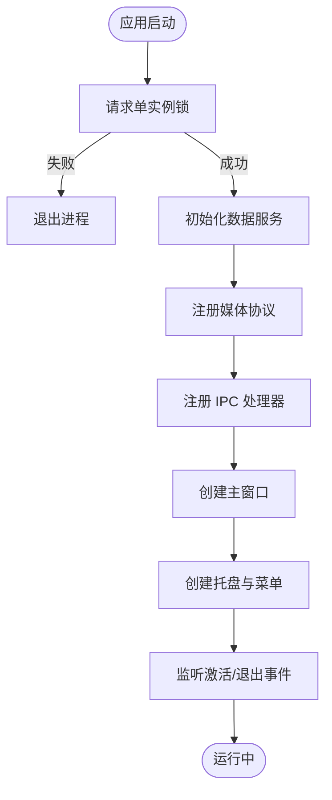
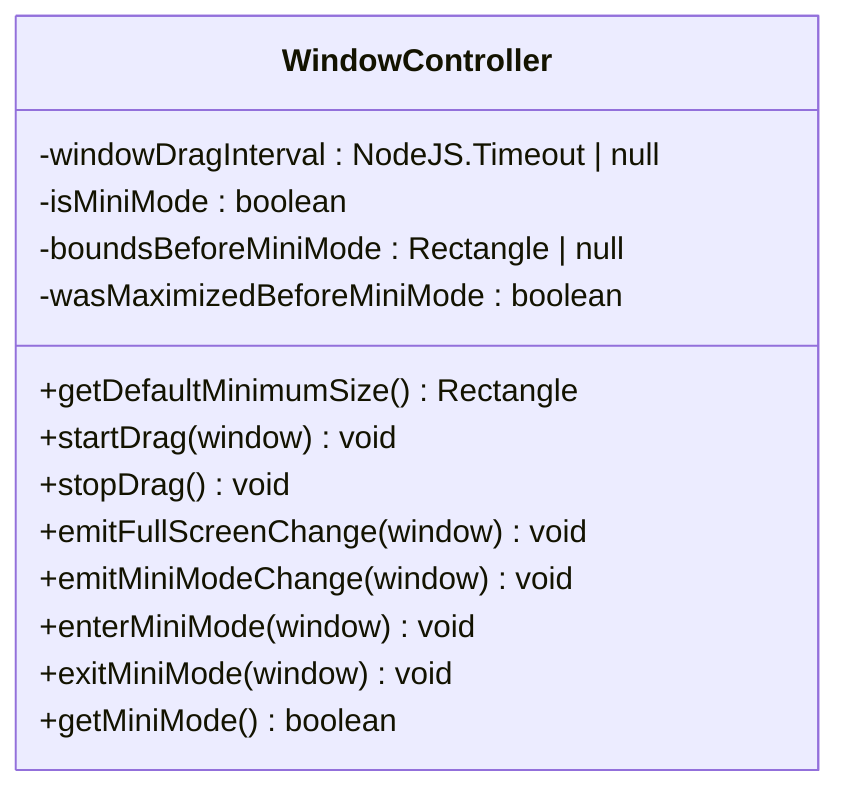
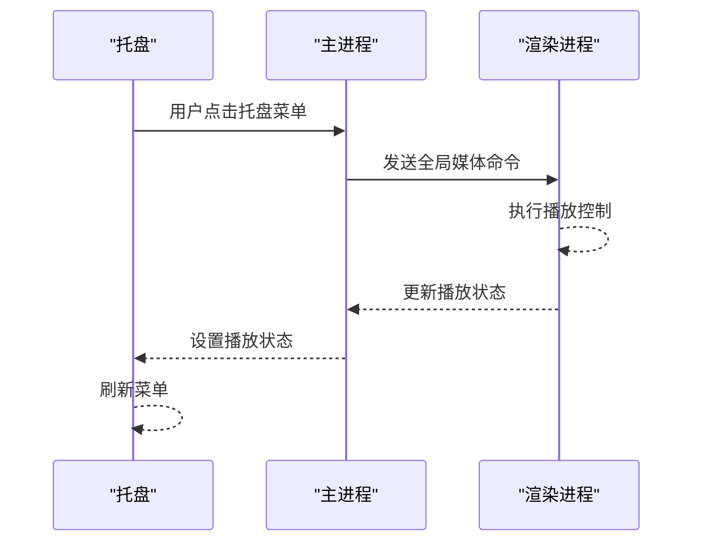
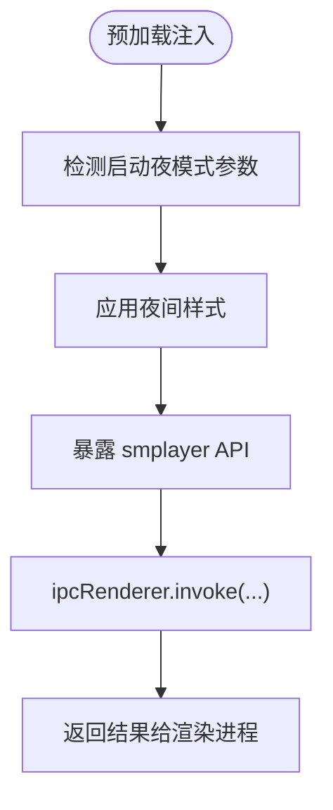
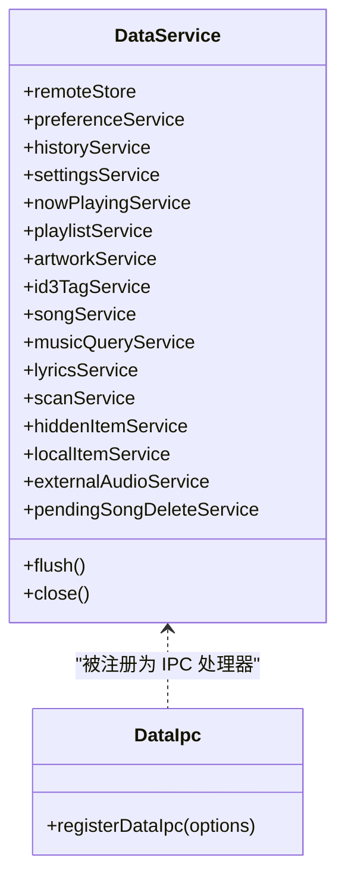
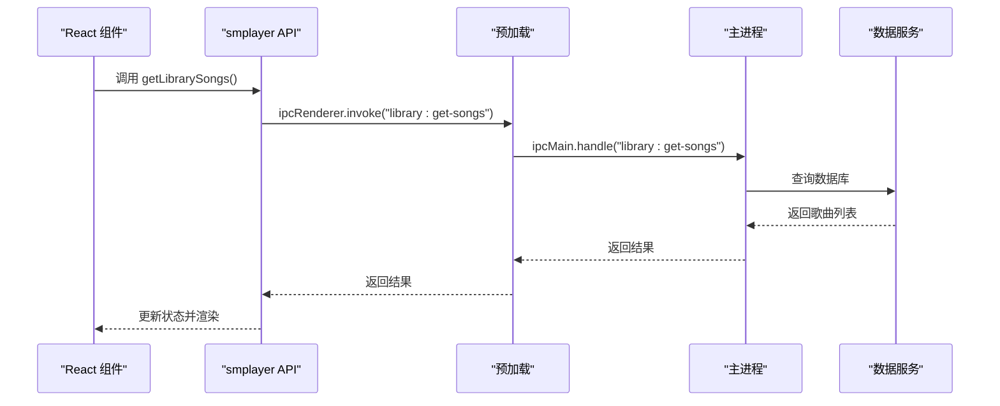
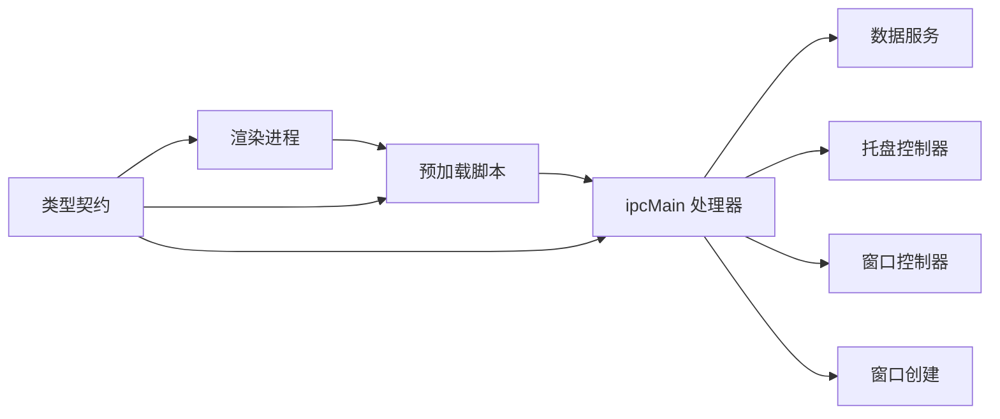

# 整体架构概览

<cite>
**本文档引用的文件**
- [electron/main.ts](file://electron/main.ts)
- [electron/preload.ts](file://electron/preload.ts)
- [electron/app-window.ts](file://electron/app-window.ts)
- [electron/window-controller.ts](file://electron/window-controller.ts)
- [electron/tray-controller.ts](file://electron/tray-controller.ts)
- [electron/ipc/app-ipc.ts](file://electron/ipc/app-ipc.ts)
- [electron/ipc/data-ipc.ts](file://electron/ipc/data-ipc.ts)
- [electron/services/data-service.ts](file://electron/services/data-service.ts)
- [src/main.tsx](file://src/main.tsx)
- [src/App.tsx](file://src/App.tsx)
- [src/shared/contracts.ts](file://src/shared/contracts.ts)
- [package.json](file://package.json)
- [README.md](file://README.md)
</cite>

## 目录
1. [简介](#简介)
2. [项目结构](#项目结构)
3. [核心组件](#核心组件)
4. [架构总览](#架构总览)
5. [详细组件分析](#详细组件分析)
6. [依赖关系分析](#依赖关系分析)
7. [性能考量](#性能考量)
8. [故障排除指南](#故障排除指南)
9. [结论](#结论)

## 简介
本文件为 SMPlayer 的整体架构概览文档，系统阐述基于 Electron 的桌面音乐播放器应用的架构模式与实现细节。该应用采用经典的主进程（BrowserWindow）、渲染进程（React 应用）与预加载脚本（preload）三段式架构，通过 IPC 通道实现进程间通信，结合本地数据库与系统服务，提供完整的音乐库管理、播放控制与桌面集成能力。本文将从职责分工、启动流程、生命周期管理、IPC 机制、安全与性能设计等维度进行深入解析，并给出架构图示与可扩展性建议。

## 项目结构
SMPlayer 采用“Electron 主进程 + React 渲染进程”的分层组织方式：
- Electron 主进程：负责窗口创建、系统托盘、媒体协议注册、远程播放服务、数据服务初始化与 IPC 注册。
- 预加载脚本：在受控上下文中暴露受限 API 给渲染进程，确保安全隔离。
- 渲染进程（React）：承载 UI、路由、状态管理与用户交互，通过 smplayer API 调用主进程能力。

**图表来源**
- [electron/main.ts:1-243](file://electron/main.ts#L1-L243)
- [electron/app-window.ts:1-173](file://electron/app-window.ts#L1-L173)
- [electron/window-controller.ts:1-122](file://electron/window-controller.ts#L1-L122)
- [electron/tray-controller.ts:1-209](file://electron/tray-controller.ts#L1-L209)
- [electron/ipc/app-ipc.ts:1-26](file://electron/ipc/app-ipc.ts#L1-L26)
- [electron/ipc/data-ipc.ts:1-151](file://electron/ipc/data-ipc.ts#L1-L151)
- [electron/preload.ts:1-287](file://electron/preload.ts#L1-L287)
- [src/main.tsx:1-15](file://src/main.tsx#L1-L15)
- [src/App.tsx:1-800](file://src/App.tsx#L1-L800)
- [src/shared/contracts.ts:1-664](file://src/shared/contracts.ts#L1-L664)

**章节来源**
- [package.json:1-175](file://package.json#L1-L175)
- [README.md:1-157](file://README.md#L1-L157)

## 核心组件
- 主进程入口与生命周期管理：负责应用初始化、单实例锁、窗口创建、系统事件监听、退出前清理与资源释放。
- 窗口创建与配置：封装 BrowserWindow 创建逻辑、最小尺寸、标题栏样式、背景色、权限策略与启动路由恢复。
- 窗口行为控制器：实现拖拽、全屏切换、迷你模式切换、边界约束与状态广播。
- 系统托盘控制器：构建托盘菜单、全局媒体快捷键、Windows 跳转列表、播放状态同步。
- 预加载脚本：通过 contextBridge 暴露受限 API，统一 IPC 调用与事件订阅，处理启动夜模式等。
- 数据服务与 IPC：集中管理音乐库、播放队列、历史记录、设置、歌词、扫描等业务逻辑，提供 IPC 接口。
- 渲染进程（React）：UI 外壳、路由、状态管理、播放控制、语音助手、通知与窗口控制。

**章节来源**
- [electron/main.ts:141-242](file://electron/main.ts#L141-L242)
- [electron/app-window.ts:41-138](file://electron/app-window.ts#L41-L138)
- [electron/window-controller.ts:6-121](file://electron/window-controller.ts#L6-L121)
- [electron/tray-controller.ts:28-208](file://electron/tray-controller.ts#L28-L208)
- [electron/preload.ts:45-286](file://electron/preload.ts#L45-L286)
- [electron/services/data-service.ts:39-197](file://electron/services/data-service.ts#L39-L197)
- [src/App.tsx:71-800](file://src/App.tsx#L71-L800)

## 架构总览
SMPlayer 的架构遵循 Electron 安全最佳实践：渲染进程不直接访问 Node/Electron API，所有跨进程调用均通过预加载脚本与 IPC 实现。主进程承担系统集成与数据持久化职责，渲染进程专注 UI 与交互体验。

**图表来源**
- [electron/main.ts:141-209](file://electron/main.ts#L141-L209)
- [electron/app-window.ts:41-138](file://electron/app-window.ts#L41-L138)
- [electron/tray-controller.ts:37-111](file://electron/tray-controller.ts#L37-L111)
- [electron/preload.ts:45-286](file://electron/preload.ts#L45-L286)
- [src/App.tsx:280-321](file://src/App.tsx#L280-L321)

## 详细组件分析

### 主进程（BrowserWindow + 生命周期）
- 单实例锁：防止重复启动，保证资源一致性。
- 窗口创建：根据设置决定启动夜模式、标题栏样式、背景材料与最小尺寸；设置权限策略与外部链接打开策略。
- 生命周期事件：处理“第二次实例”、打开文件、激活、退出前清理（提交待删除歌曲）、窗口关闭策略（隐藏到托盘）。
- 托盘与全局快捷键：托盘菜单与媒体键映射，触发播放控制命令。
- 远程播放服务：按需启动/停止，配合数据服务提供远程分享能力。

**图表来源**
- [electron/main.ts:78-242](file://electron/main.ts#L78-L242)
- [electron/app-window.ts:41-138](file://electron/app-window.ts#L41-L138)
- [electron/tray-controller.ts:37-111](file://electron/tray-controller.ts#L37-L111)

**章节来源**
- [electron/main.ts:78-242](file://electron/main.ts#L78-L242)
- [electron/app-window.ts:41-138](file://electron/app-window.ts#L41-L138)

### 窗口控制器（WindowController）
- 窗口拖拽：基于屏幕坐标与定时器实现平滑拖拽。
- 全屏与迷你模式：切换时广播事件给渲染进程，更新 UI 与窗口属性。
- 边界约束：在多显示器环境下限制窗口位置，避免移出工作区。
- 状态保持：保存迷你模式前的尺寸与最大化状态，便于退出迷你模式后恢复。

**图表来源**
- [electron/window-controller.ts:6-121](file://electron/window-controller.ts#L6-L121)

**章节来源**
- [electron/window-controller.ts:6-121](file://electron/window-controller.ts#L6-L121)

### 系统托盘控制器（TrayController）
- 托盘图标与菜单：根据窗口可见性动态切换显示/隐藏；播放/暂停、上一首/下一首、快速播放、设置与退出。
- Windows 跳转列表：根据最近播放曲目生成任务项，提升文件关联体验。
- 全局媒体快捷键：注册系统媒体键，转发到渲染进程执行播放控制。
- 播放状态同步：接收主进程播放状态变更，更新托盘菜单与图标。

**图表来源**
- [electron/tray-controller.ts:53-111](file://electron/tray-controller.ts#L53-L111)
- [electron/tray-controller.ts:162-188](file://electron/tray-controller.ts#L162-L188)

**章节来源**
- [electron/tray-controller.ts:28-208](file://electron/tray-controller.ts#L28-L208)

### 预加载脚本（preload.ts）
- 上下文桥接：通过 contextBridge.exposeInMainWorld 暴露 smplayer API，限定方法集合，避免直接暴露 Node/Electron API。
- 启动夜模式：在 DOMContentLoaded 前注入夜间样式，确保首屏无闪烁。
- 事件订阅：封装 onXxx 回调，自动注册/注销监听，返回解绑函数。
- IPC 调用：统一使用 ipcRenderer.invoke/send/on，屏蔽底层差异。

**图表来源**
- [electron/preload.ts:20-43](file://electron/preload.ts#L20-L43)
- [electron/preload.ts:45-286](file://electron/preload.ts#L45-L286)

**章节来源**
- [electron/preload.ts:1-287](file://electron/preload.ts#L1-L287)

### 数据服务与 IPC（DataService + data-ipc）
- 数据服务聚合：封装音乐库、播放队列、历史记录、设置、歌词、扫描、隐藏项、外部音频等子服务，统一事务与清理逻辑。
- IPC 注册：将数据操作映射为 IPC 句柄，供渲染进程调用；同时维护托盘菜单与 Windows 跳转列表更新。
- 运行时设置：提供即时读取/写入播放设置的能力，满足 UI 与播放引擎的低延迟需求。

**图表来源**
- [electron/services/data-service.ts:39-197](file://electron/services/data-service.ts#L39-L197)
- [electron/ipc/data-ipc.ts:20-151](file://electron/ipc/data-ipc.ts#L20-L151)

**章节来源**
- [electron/services/data-service.ts:39-197](file://electron/services/data-service.ts#L39-L197)
- [electron/ipc/data-ipc.ts:20-151](file://electron/ipc/data-ipc.ts#L20-L151)

### 渲染进程（React）
- 根节点挂载：创建 React 根实例，渲染路由外壳与应用组件。
- 应用外壳：管理导航、侧边栏、播放控制、搜索、通知、窗口控制与主题切换。
- 状态管理：使用 Zustand 等状态库管理库快照、播放状态、视图状态与撤销通知。
- 与主进程交互：通过 window.smplayer API 调用 IPC，实现播放控制、库扫描、歌词获取、设置更新等。

**图表来源**
- [src/main.tsx:8-14](file://src/main.tsx#L8-L14)
- [src/App.tsx:134-167](file://src/App.tsx#L134-L167)
- [electron/preload.ts:50-60](file://electron/preload.ts#L50-L60)
- [electron/ipc/data-ipc.ts:28-36](file://electron/ipc/data-ipc.ts#L28-L36)

**章节来源**
- [src/main.tsx:1-15](file://src/main.tsx#L1-L15)
- [src/App.tsx:71-800](file://src/App.tsx#L71-L800)

## 依赖关系分析
- 进程间依赖：渲染进程仅通过预加载脚本与主进程通信；预加载脚本依赖 Electron 的 ipcRenderer 与 contextBridge。
- 主进程内部依赖：主进程依赖窗口控制器、托盘控制器、数据服务与各类 IPC 注册器；数据服务进一步依赖多个领域服务。
- 类型契约：src/shared/contracts.ts 提供跨进程一致的数据结构与 API 签名，确保类型安全与接口稳定性。

**图表来源**
- [src/shared/contracts.ts:527-663](file://src/shared/contracts.ts#L527-L663)
- [electron/preload.ts:45-286](file://electron/preload.ts#L45-L286)
- [electron/ipc/data-ipc.ts:20-151](file://electron/ipc/data-ipc.ts#L20-L151)
- [electron/services/data-service.ts:39-197](file://electron/services/data-service.ts#L39-L197)

**章节来源**
- [src/shared/contracts.ts:1-664](file://src/shared/contracts.ts#L1-L664)

## 性能考量
- 首屏渲染优化：预加载脚本在 DOMContentLoaded 前注入夜间样式，减少白屏/闪烁。
- 窗口拖拽与动画：使用定时器与边界约束，避免频繁重排；迷你模式下限制窗口尺寸与置顶，降低 GPU/CPU 开销。
- 数据访问路径：通过 IPC 将重计算与 I/O 放在主进程，渲染进程只做轻量状态更新与 UI 渲染。
- 数据库与缓存：SQLite 事务与 WAL checkpoint 在退出时执行，保证数据一致性与落盘效率；封面缓存避免重复读取。
- 资源打包：asar 打包与按需重建，减小安装体积与启动时间。

[本节为通用性能建议，无需特定文件引用]

## 故障排除指南
- 预加载注入失败：检查 contextBridge 是否成功暴露 smplayer API；确认 preload 脚本路径与附加参数传递。
- IPC 调用超时或无响应：确认 ipcMain.handle 已注册对应通道；检查渲染进程回调是否正确解绑。
- 托盘菜单异常：验证托盘图标路径与平台差异；确认全局媒体快捷键未被系统占用。
- 窗口隐藏/显示问题：检查 quitOnClose 设置与窗口 close 事件拦截逻辑；确认通知提示仅在支持平台上弹出。
- 退出前未提交待删除：确认 before-quit 事件已阻止退出并触发提交，完成后再次 app.quit()。

**章节来源**
- [electron/preload.ts:286-287](file://electron/preload.ts#L286-L287)
- [electron/main.ts:221-232](file://electron/main.ts#L221-L232)
- [electron/app-window.ts:76-96](file://electron/app-window.ts#L76-L96)
- [electron/tray-controller.ts:171-188](file://electron/tray-controller.ts#L171-L188)

## 结论
SMPlayer 的架构以 Electron 为核心，通过清晰的职责划分与严格的 IPC 边界，实现了桌面音乐应用所需的复杂功能：本地库管理、播放控制、系统集成与跨平台打包。主进程承担系统与数据职责，预加载脚本提供安全可控的 API 桥接，渲染进程专注于用户体验与交互。该架构具备良好的可扩展性（新增 IPC 通道与服务模块）、可维护性（类型契约与模块化服务）与安全性（上下文隔离与权限控制），适合长期演进与团队协作。