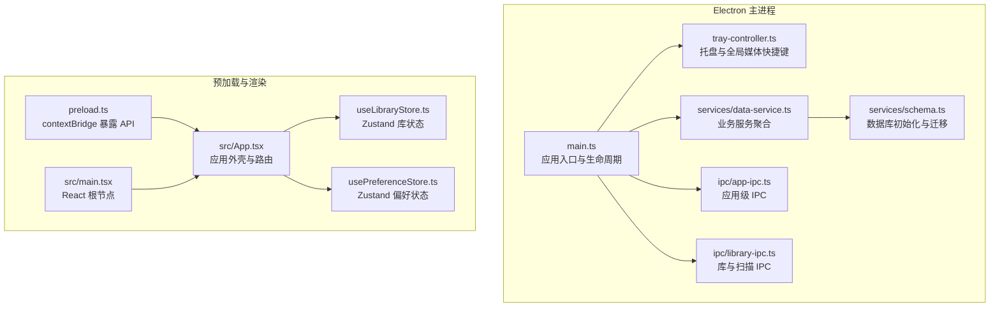
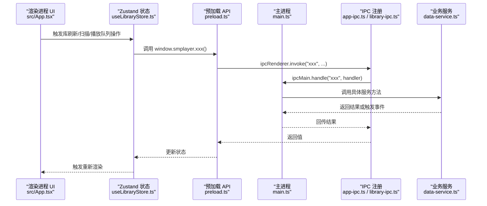
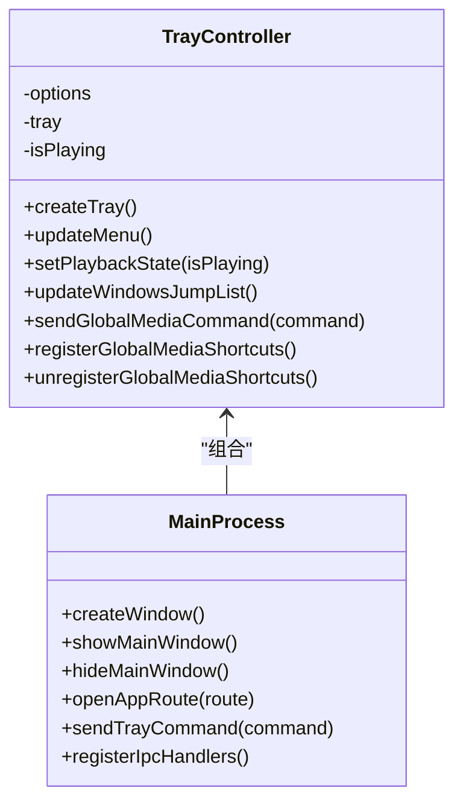
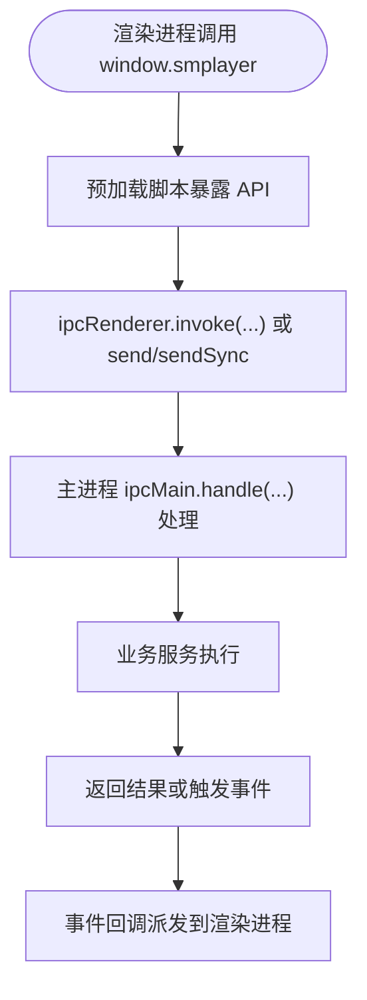
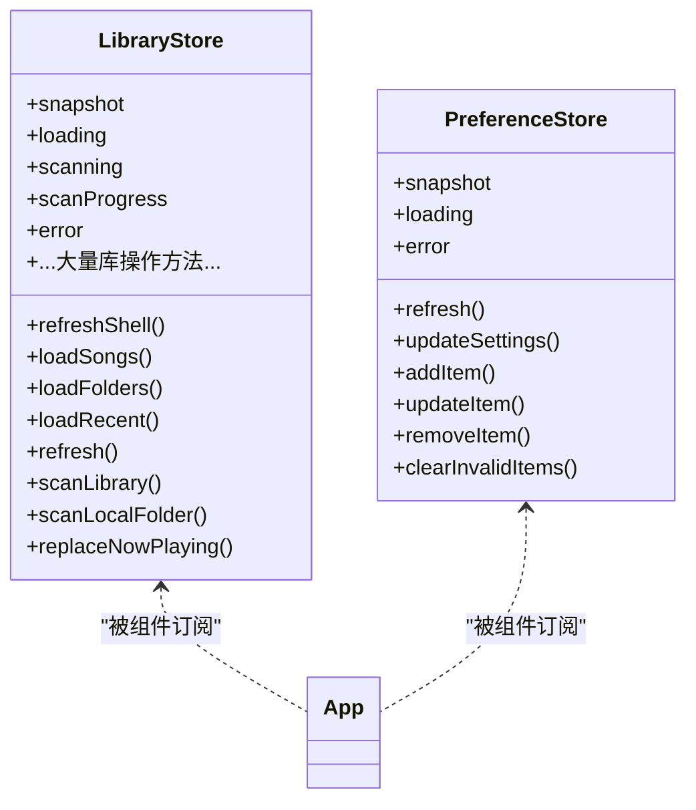
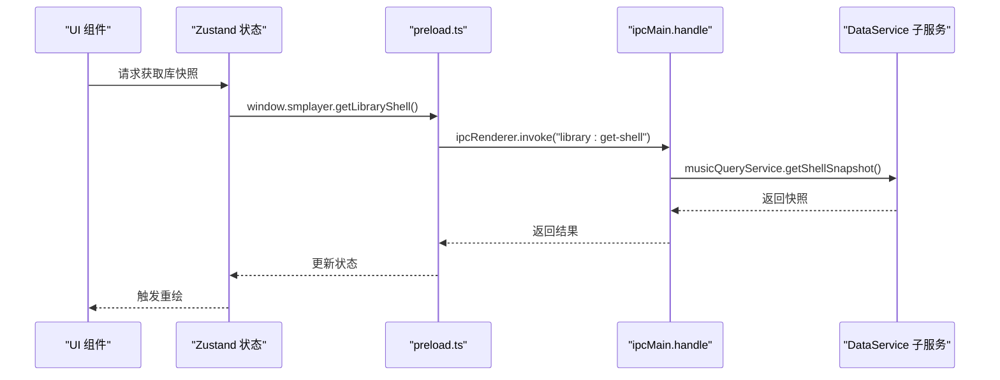
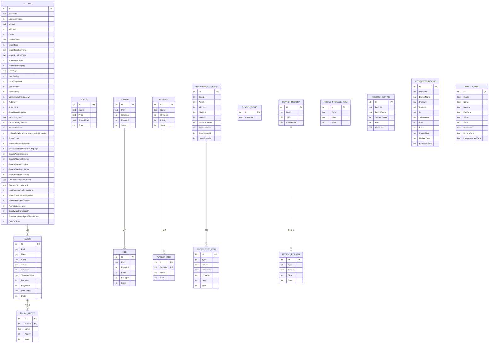
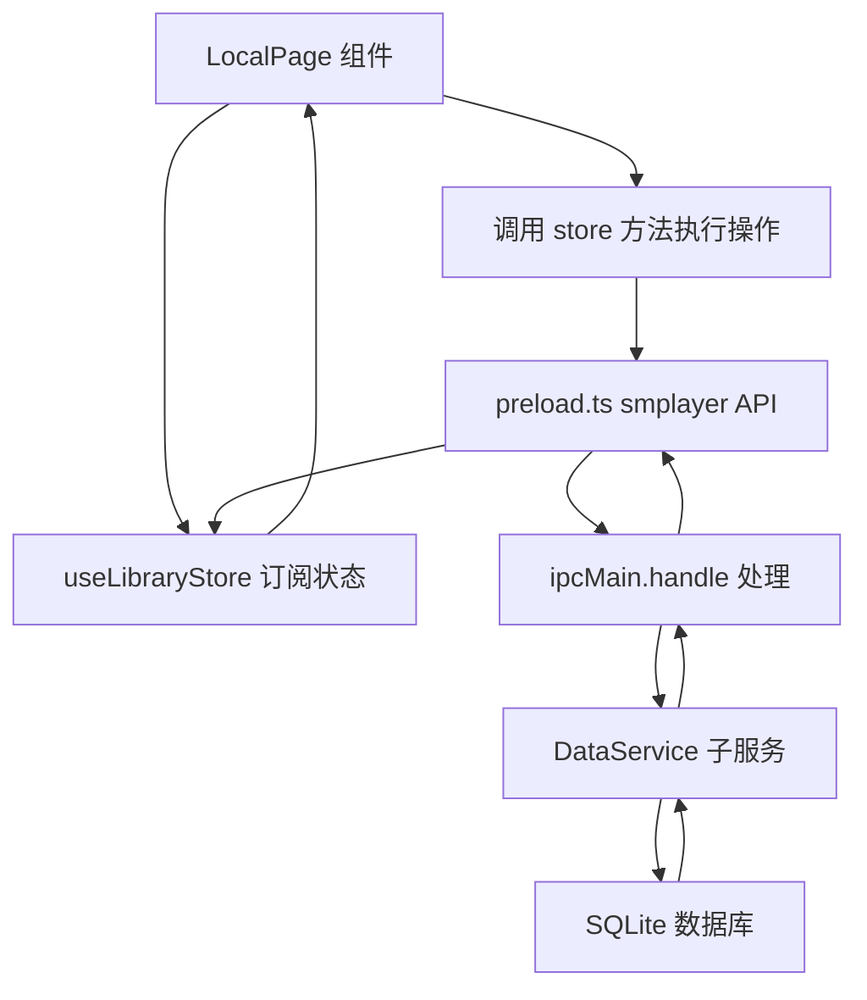
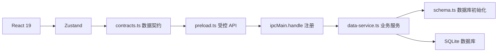

# 架构设计

<cite>
**本文引用的文件**
- [package.json](file://package.json)
- [electron/main.ts](file://electron/main.ts)
- [electron/preload.ts](file://electron/preload.ts)
- [src/main.tsx](file://src/main.tsx)
- [src/App.tsx](file://src/App.tsx)
- [src/state/useLibraryStore.ts](file://src/state/useLibraryStore.ts)
- [src/state/usePreferenceStore.ts](file://src/state/usePreferenceStore.ts)
- [src/shared/contracts.ts](file://src/shared/contracts.ts)
- [electron/ipc/app-ipc.ts](file://electron/ipc/app-ipc.ts)
- [electron/ipc/library-ipc.ts](file://electron/ipc/library-ipc.ts)
- [electron/services/data-service.ts](file://electron/services/data-service.ts)
- [electron/services/schema.ts](file://electron/services/schema.ts)
- [electron/tray-controller.ts](file://electron/tray-controller.ts)
- [src/pages/LocalPage.tsx](file://src/pages/LocalPage.tsx)
- [src/components/AppBar.tsx](file://src/components/AppBar.tsx)
</cite>

## 目录
1. [引言](#引言)
2. [项目结构](#项目结构)
3. [核心组件](#核心组件)
4. [架构总览](#架构总览)
5. [详细组件分析](#详细组件分析)
6. [依赖分析](#依赖分析)
7. [性能考量](#性能考量)
8. [故障排查指南](#故障排查指南)
9. [结论](#结论)
10. [附录](#附录)

## 引言
本文件面向 SMPlayer 的架构设计与实现，系统采用 Electron 主进程-渲染进程分离架构，前端以 React 19 组件化开发，配合 Zustand 状态管理，通过 IPC 实现前后端数据与控制流的解耦。后端以 SQLite 数据库为核心，结合多服务模块（扫描、歌词、专辑封面、播放队列、偏好设置等）提供本地音乐库管理能力，并支持远程分享与语音助手等扩展功能。

## 项目结构
项目采用典型的 Electron + React 前后端分层：
- Electron 主进程负责应用生命周期、窗口、托盘、全局快捷键、IPC 注册、数据库与业务服务初始化。
- 渲染进程负责 UI、路由、状态管理与用户交互。
- 预加载脚本通过 contextBridge 暴露受控 API，隔离渲染进程对 Node/Electron 能力的直接访问。

**图表来源**
- [electron/main.ts:1-243](file://electron/main.ts#L1-L243)
- [electron/tray-controller.ts:1-209](file://electron/tray-controller.ts#L1-L209)
- [electron/services/data-service.ts:1-198](file://electron/services/data-service.ts#L1-L198)
- [electron/services/schema.ts:1-364](file://electron/services/schema.ts#L1-L364)
- [electron/ipc/app-ipc.ts:1-26](file://electron/ipc/app-ipc.ts#L1-L26)
- [electron/ipc/library-ipc.ts:1-370](file://electron/ipc/library-ipc.ts#L1-L370)
- [electron/preload.ts:1-287](file://electron/preload.ts#L1-L287)
- [src/main.tsx:1-15](file://src/main.tsx#L1-L15)
- [src/App.tsx:1-800](file://src/App.tsx#L1-L800)
- [src/state/useLibraryStore.ts:1-800](file://src/state/useLibraryStore.ts#L1-L800)
- [src/state/usePreferenceStore.ts:1-160](file://src/state/usePreferenceStore.ts#L1-L160)

**章节来源**
- [package.json:1-175](file://package.json#L1-L175)
- [electron/main.ts:1-243](file://electron/main.ts#L1-L243)
- [electron/preload.ts:1-287](file://electron/preload.ts#L1-L287)
- [src/main.tsx:1-15](file://src/main.tsx#L1-L15)
- [src/App.tsx:1-800](file://src/App.tsx#L1-L800)

## 核心组件
- Electron 主进程：负责窗口创建、托盘、全局媒体快捷键、IPC 注册、业务服务初始化与退出流程。
- 预加载脚本：通过 contextBridge 将受控 API 暴露给渲染进程，确保安全边界。
- React 前端：以组件化方式组织 UI，使用 React Router 进行页面路由，使用 Zustand 管理应用状态。
- Zustand 状态：useLibraryStore 管理音乐库快照、扫描进度、播放队列、搜索历史等；usePreferenceStore 管理偏好设置。
- IPC 层：app-ipc 提供应用信息与托盘状态；library-ipc 提供库查询、扫描、歌词、封面、删除、移动等操作。
- 业务服务：DataService 聚合多个子服务（设置、历史、播放队列、歌单、歌词、扫描、隐藏项、外部音频、待删歌曲等），并负责数据库初始化与清理。

**章节来源**
- [electron/main.ts:1-243](file://electron/main.ts#L1-L243)
- [electron/preload.ts:1-287](file://electron/preload.ts#L1-L287)
- [src/state/useLibraryStore.ts:1-800](file://src/state/useLibraryStore.ts#L1-L800)
- [src/state/usePreferenceStore.ts:1-160](file://src/state/usePreferenceStore.ts#L1-L160)
- [electron/ipc/app-ipc.ts:1-26](file://electron/ipc/app-ipc.ts#L1-L26)
- [electron/ipc/library-ipc.ts:1-370](file://electron/ipc/library-ipc.ts#L1-L370)
- [electron/services/data-service.ts:1-198](file://electron/services/data-service.ts#L1-L198)

## 架构总览
SMPlayer 的整体架构遵循“主进程服务 + 渲染进程 UI + 预加载桥接”的经典 Electron 模式。前端通过受控 API 访问主进程能力，主进程通过 IPC 分发到具体服务，服务层读写 SQLite 并维护应用状态。

**图表来源**
- [src/App.tsx:1-800](file://src/App.tsx#L1-L800)
- [src/state/useLibraryStore.ts:1-800](file://src/state/useLibraryStore.ts#L1-L800)
- [electron/preload.ts:1-287](file://electron/preload.ts#L1-L287)
- [electron/main.ts:1-243](file://electron/main.ts#L1-L243)
- [electron/ipc/app-ipc.ts:1-26](file://electron/ipc/app-ipc.ts#L1-L26)
- [electron/ipc/library-ipc.ts:1-370](file://electron/ipc/library-ipc.ts#L1-L370)
- [electron/services/data-service.ts:1-198](file://electron/services/data-service.ts#L1-L198)

## 详细组件分析

### 主进程与托盘控制
- 主进程负责应用生命周期、单实例锁、窗口创建、托盘菜单与 Windows JumpList、全局媒体快捷键注册。
- 托盘控制器封装托盘图标、上下文菜单、播放状态更新、快捷键转发至渲染进程。

**图表来源**
- [electron/tray-controller.ts:1-209](file://electron/tray-controller.ts#L1-L209)
- [electron/main.ts:1-243](file://electron/main.ts#L1-L243)

**章节来源**
- [electron/main.ts:1-243](file://electron/main.ts#L1-L243)
- [electron/tray-controller.ts:1-209](file://electron/tray-controller.ts#L1-L209)

### 预加载与受控 API
- 预加载脚本通过 contextBridge.exposeInMainWorld 暴露 smplayer 对象，统一包装 ipcRenderer.invoke/send/sendSync 与事件监听。
- 提供库查询、播放队列、歌词、封面、扫描、删除、移动、设置、通知、语音识别等 API。

**图表来源**
- [electron/preload.ts:1-287](file://electron/preload.ts#L1-L287)
- [electron/ipc/library-ipc.ts:1-370](file://electron/ipc/library-ipc.ts#L1-L370)
- [electron/ipc/app-ipc.ts:1-26](file://electron/ipc/app-ipc.ts#L1-L26)

**章节来源**
- [electron/preload.ts:1-287](file://electron/preload.ts#L1-L287)

### Zustand 状态管理
- useLibraryStore：集中管理音乐库快照、加载/刷新、扫描进度、播放队列、收藏、搜索历史、设置更新、视图状态保存等。
- usePreferenceStore：管理偏好设置启用/禁用、条目增删改、失效条目清理等。

**图表来源**
- [src/state/useLibraryStore.ts:1-800](file://src/state/useLibraryStore.ts#L1-L800)
- [src/state/usePreferenceStore.ts:1-160](file://src/state/usePreferenceStore.ts#L1-L160)

**章节来源**
- [src/state/useLibraryStore.ts:1-800](file://src/state/useLibraryStore.ts#L1-L800)
- [src/state/usePreferenceStore.ts:1-160](file://src/state/usePreferenceStore.ts#L1-L160)

### IPC 与数据流向
- app-ipc：提供应用信息、托盘播放状态设置、打开文件列表等。
- library-ipc：提供库快照、设置、计数、歌曲/文件夹/最近、播放队列、歌词、封面、扫描、删除/移动、导入导出、艺术家拆分分析与应用等。
- 数据从主进程的服务层经 IPC 返回到预加载层，再由状态层驱动 UI 更新。

**图表来源**
- [electron/ipc/library-ipc.ts:1-370](file://electron/ipc/library-ipc.ts#L1-L370)
- [electron/services/data-service.ts:1-198](file://electron/services/data-service.ts#L1-L198)
- [src/state/useLibraryStore.ts:1-800](file://src/state/useLibraryStore.ts#L1-L800)

**章节来源**
- [electron/ipc/app-ipc.ts:1-26](file://electron/ipc/app-ipc.ts#L1-L26)
- [electron/ipc/library-ipc.ts:1-370](file://electron/ipc/library-ipc.ts#L1-L370)
- [electron/services/data-service.ts:1-198](file://electron/services/data-service.ts#L1-L198)

### 数据模型与数据库设计
- contracts.ts 定义了应用内通用的数据契约，包括歌曲、专辑、播放队列、歌词、搜索历史、设置等。
- schema.ts 负责数据库初始化、索引与列迁移，确保跨版本兼容与性能优化。
- data-service.ts 聚合各子服务，负责数据库连接、WAL 模式、清理与恢复逻辑。

**图表来源**
- [src/shared/contracts.ts:1-664](file://src/shared/contracts.ts#L1-L664)
- [electron/services/schema.ts:1-364](file://electron/services/schema.ts#L1-L364)

**章节来源**
- [src/shared/contracts.ts:1-664](file://src/shared/contracts.ts#L1-L664)
- [electron/services/schema.ts:1-364](file://electron/services/schema.ts#L1-L364)
- [electron/services/data-service.ts:1-198](file://electron/services/data-service.ts#L1-L198)

### 页面与组件交互示例：本地页面
- LocalPage 负责本地音乐库的目录浏览、排序、多选、拖拽、批量操作（移动、删除、添加到播放队列/歌单）、快速跳转等。
- 通过 useLibraryStore 获取状态与动作，与预加载 API 协作完成实际操作。

**图表来源**
- [src/pages/LocalPage.tsx:1-800](file://src/pages/LocalPage.tsx#L1-L800)
- [src/state/useLibraryStore.ts:1-800](file://src/state/useLibraryStore.ts#L1-L800)
- [electron/preload.ts:1-287](file://electron/preload.ts#L1-L287)
- [electron/ipc/library-ipc.ts:1-370](file://electron/ipc/library-ipc.ts#L1-L370)
- [electron/services/data-service.ts:1-198](file://electron/services/data-service.ts#L1-L198)

**章节来源**
- [src/pages/LocalPage.tsx:1-800](file://src/pages/LocalPage.tsx#L1-L800)

## 依赖分析
- 技术栈与版本：React 19、Zustand、Electron、TypeScript、Vite、FluentUI Icons、music-metadata 等。
- IPC 依赖：预加载 API 依赖 ipcMain.handle 注册的处理器；主进程依赖各业务服务。
- 数据库依赖：SQLite（node:sqlite），WAL 模式提升并发读取性能；索引覆盖常见查询字段。
- 外部集成：Windows JumpList、全局媒体快捷键、系统通知、语音识别（Windows Speech）。

**图表来源**
- [package.json:1-175](file://package.json#L1-L175)
- [src/shared/contracts.ts:1-664](file://src/shared/contracts.ts#L1-L664)
- [electron/preload.ts:1-287](file://electron/preload.ts#L1-L287)
- [electron/ipc/library-ipc.ts:1-370](file://electron/ipc/library-ipc.ts#L1-L370)
- [electron/services/data-service.ts:1-198](file://electron/services/data-service.ts#L1-L198)
- [electron/services/schema.ts:1-364](file://electron/services/schema.ts#L1-L364)

**章节来源**
- [package.json:1-175](file://package.json#L1-L175)

## 性能考量
- 数据库性能：WAL 模式、同步级别 NORMAL、外键开启；为高频查询建立唯一/非唯一索引；按需懒加载数据（歌曲/文件夹/最近）。
- 渲染性能：Zustand 以原子状态切片减少重渲染；组件内部 useMemo/useCallback 缓存计算；滚动容器自定义滚动条降低重排。
- IPC 性能：批量请求（Promise.all）与进度事件（onScanLocalFolderProgress/onMoveLocalItemsProgress）避免阻塞 UI。
- 启动体验：预加载注入夜间模式样式，减少首屏闪烁；托盘图标尺寸适配不同平台。

[本节为通用指导，无需特定文件引用]

## 故障排查指南
- 扫描取消：扫描进度监听中检测 operationId 是否被取消，避免 UI 与后台状态不一致。
- 删除确认：删除歌曲/本地项采用“待删”机制，支持撤销与提交，防止误删造成数据丢失。
- 错误捕获：状态层统一记录错误消息，组件根据 error 字段展示提示。
- 托盘与快捷键：检查全局媒体快捷键注册与注销时机，确保退出时释放资源。

**章节来源**
- [src/state/useLibraryStore.ts:340-470](file://src/state/useLibraryStore.ts#L340-L470)
- [electron/ipc/library-ipc.ts:248-250](file://electron/ipc/library-ipc.ts#L248-L250)
- [electron/tray-controller.ts:171-188](file://electron/tray-controller.ts#L171-L188)

## 结论
SMPlayer 采用成熟的 Electron + React + Zustand 架构，通过 IPC 解耦前后端，以 SQLite 为核心持久化，辅以多服务模块实现音乐库管理、播放队列、歌词与封面、扫描与导入导出等功能。架构具备良好的扩展性与可维护性，适合进一步引入插件化、模块化服务与可扩展数据库设计。

[本节为总结，无需特定文件引用]

## 附录
- AppBar 组件用于页面标题栏与操作区，提供统一的样式与交互基元。
- 项目构建与打包配置在 package.json 中定义，支持多平台产物与安装器。

**章节来源**
- [src/components/AppBar.tsx:1-45](file://src/components/AppBar.tsx#L1-L45)
- [package.json:1-175](file://package.json#L1-L175)