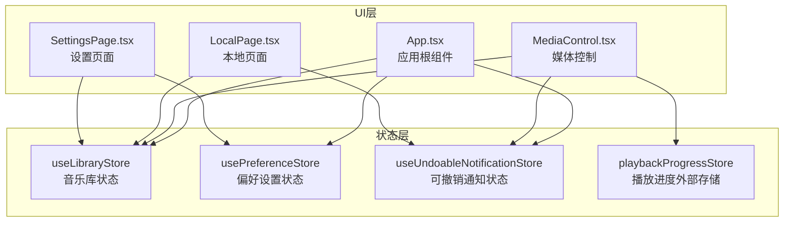
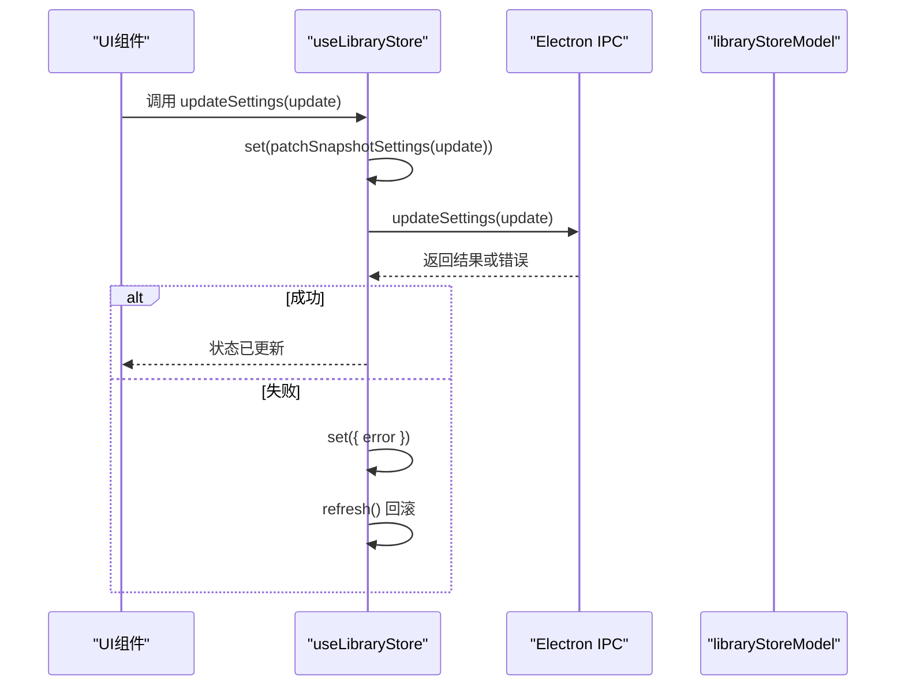
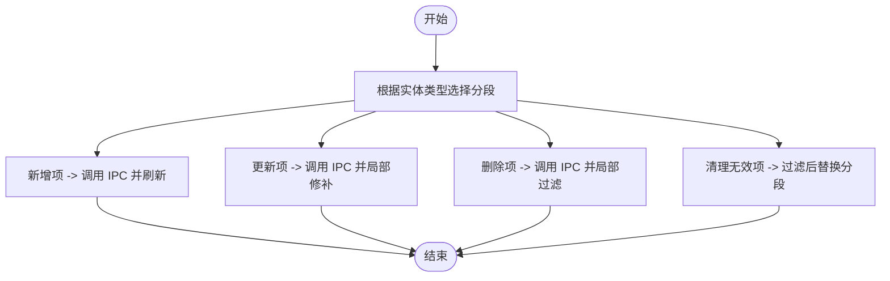
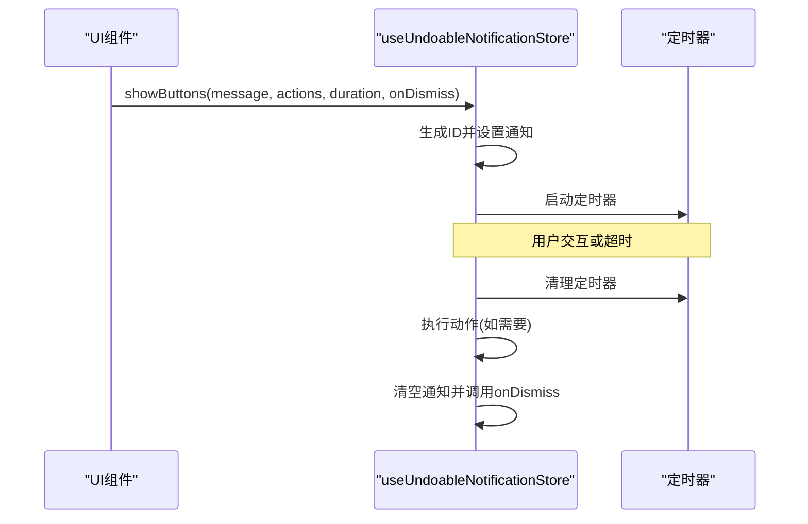
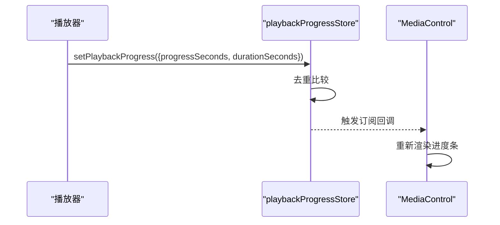
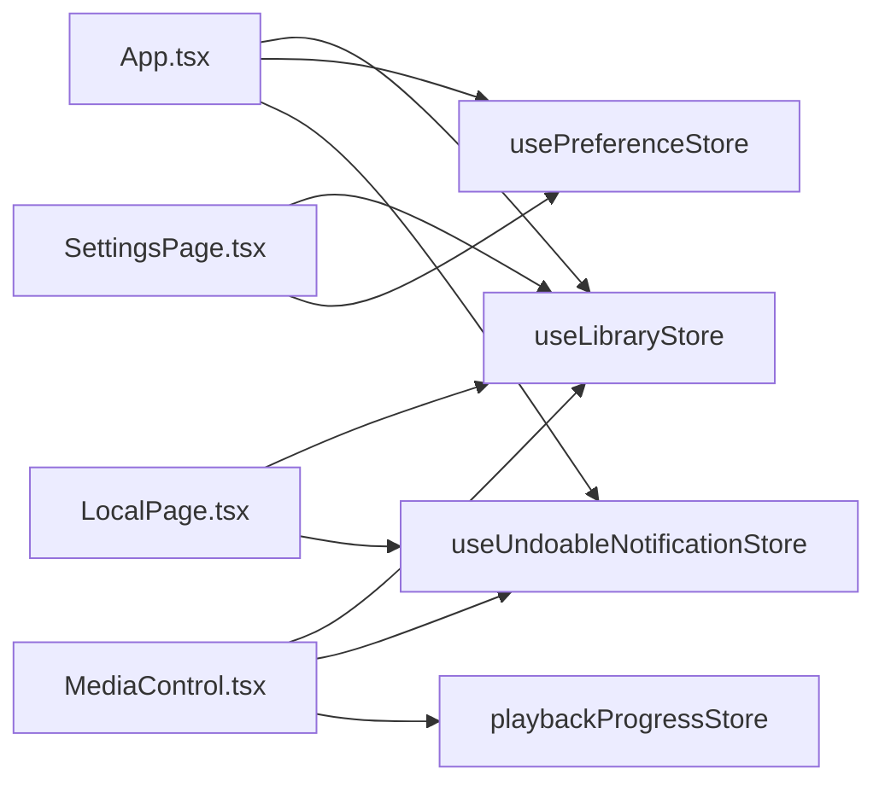

# 状态管理架构

<cite>
**本文档引用的文件**
- [useLibraryStore.ts](file://src/state/useLibraryStore.ts)
- [usePreferenceStore.ts](file://src/state/usePreferenceStore.ts)
- [useUndoableNotificationStore.ts](file://src/state/useUndoableNotificationStore.ts)
- [libraryStoreModel.ts](file://src/state/libraryStoreModel.ts)
- [playbackProgressStore.ts](file://src/state/playbackProgressStore.ts)
- [App.tsx](file://src/App.tsx)
- [MediaControl.tsx](file://src/components/MediaControl.tsx)
- [LocalPage.tsx](file://src/pages/LocalPage.tsx)
- [SettingsPage.tsx](file://src/pages/SettingsPage.tsx)
</cite>

## 目录
1. [简介](#简介)
2. [项目结构](#项目结构)
3. [核心组件](#核心组件)
4. [架构总览](#架构总览)
5. [详细组件分析](#详细组件分析)
6. [依赖关系分析](#依赖关系分析)
7. [性能考虑](#性能考虑)
8. [故障排除指南](#故障排除指南)
9. [结论](#结论)

## 简介
本文件系统性阐述 SMPlayer 中基于 Zustand 的状态管理架构，重点覆盖以下方面：
- 全局状态设计模式与分片策略
- 状态订阅机制与数据流
- 核心状态存储 useLibraryStore、usePreferenceStore、useUndoableNotificationStore 的设计理念与使用方式
- 状态持久化与同步机制
- 状态更新最佳实践
- 状态管理与 UI 组件的集成方式及状态变更对应用行为的影响
- 状态管理架构图与状态流转示例

## 项目结构
SMPlayer 的状态管理采用“按功能分片”的组织方式，核心状态位于 src/state 目录，分别负责音乐库、偏好设置、可撤销通知等不同领域。UI 层通过 React Hooks 订阅状态，实现细粒度的组件更新。



图表来源
- [useLibraryStore.ts:111-1339](file://src/state/useLibraryStore.ts#L111-L1339)
- [usePreferenceStore.ts:51-160](file://src/state/usePreferenceStore.ts#L51-L160)
- [useUndoableNotificationStore.ts:41-113](file://src/state/useUndoableNotificationStore.ts#L41-L113)
- [playbackProgressStore.ts:1-52](file://src/state/playbackProgressStore.ts#L1-L52)
- [App.tsx:134-167](file://src/App.tsx#L134-L167)
- [MediaControl.tsx:10-11](file://src/components/MediaControl.tsx#L10-L11)
- [LocalPage.tsx:19-20](file://src/pages/LocalPage.tsx#L19-L20)
- [SettingsPage.tsx:317-326](file://src/pages/SettingsPage.tsx#L317-L326)

章节来源
- [useLibraryStore.ts:1-1339](file://src/state/useLibraryStore.ts#L1-L1339)
- [usePreferenceStore.ts:1-160](file://src/state/usePreferenceStore.ts#L1-L160)
- [useUndoableNotificationStore.ts:1-113](file://src/state/useUndoableNotificationStore.ts#L1-L113)
- [playbackProgressStore.ts:1-52](file://src/state/playbackProgressStore.ts#L1-L52)
- [App.tsx:1-800](file://src/App.tsx#L1-L800)

## 核心组件
本节聚焦三大状态存储的设计理念与职责边界：

- useLibraryStore：负责音乐库全量快照（snapshot）与操作集合，提供懒加载、并发去重、错误处理、扫描进度、最近播放记录、播放队列、搜索历史等能力。其状态模型以不可变更新为主，结合工具函数对快照进行局部修补（patch），确保 UI 只响应必要字段变化。
- usePreferenceStore：负责用户偏好设置的快照与增删改查操作，支持按实体类型（歌曲/艺人/专辑/歌单/文件夹）分段维护，提供统一的刷新与单项更新策略。
- useUndoableNotificationStore：提供可撤销的通知展示机制，支持按钮式动作、自动消失、运行中动作标记与 onDismiss 回调，保证 UI 交互的一致性与可恢复性。
- playbackProgressStore：非 Zustand 外部存储，采用 useSyncExternalStore 模式，向组件暴露播放进度快照与订阅接口，避免不必要的渲染。

章节来源
- [useLibraryStore.ts:42-109](file://src/state/useLibraryStore.ts#L42-L109)
- [usePreferenceStore.ts:14-24](file://src/state/usePreferenceStore.ts#L14-L24)
- [useUndoableNotificationStore.ts:16-23](file://src/state/useUndoableNotificationStore.ts#L16-L23)
- [libraryStoreModel.ts:12-79](file://src/state/libraryStoreModel.ts#L12-L79)
- [playbackProgressStore.ts:3-6](file://src/state/playbackProgressStore.ts#L3-L6)

## 架构总览
Zustand 在 SMPlayer 中承担“领域状态中心”的角色，遵循以下原则：
- 分片：每个状态存储独立管理自身领域的状态与副作用，降低耦合
- 不可变更新：通过 set 或派生函数返回新对象，确保 React 订阅感知到变化
- 工具函数：将复杂的状态修补逻辑下沉至 libraryStoreModel，保持 store 的简洁
- 外部存储：播放进度采用 useSyncExternalStore，避免与 Zustand 的耦合

```mermaid
classDiagram
class LibraryStoreState {
+snapshot : MusicData
+loading : boolean
+scanning : boolean
+error : string
+refresh()
+loadSongs()
+loadFolders()
+loadRecent()
+scanLibrary()
+...many actions...
}
class PreferenceStoreState {
+snapshot : PreferenceSettingsSnapshot
+loading : boolean
+error : string
+refresh()
+updateSettings()
+addItem()
+updateItem()
+removeItem()
+clearInvalidItems()
}
class UndoableNotificationStoreState {
+notification : UndoableNotification
+show()
+showButtons()
+showMessage()
+dismiss()
+run()
}
class PlaybackProgressSnapshot {
+progressSeconds : number
+durationSeconds : number
}
LibraryStoreState --> "patches via" libraryStoreModel
PreferenceStoreState --> "updates via" PreferenceEntityTypes
UndoableNotificationStoreState --> "manages lifecycle"
PlaybackProgressSnapshot --> "consumed by" MediaControl
```

图表来源
- [useLibraryStore.ts:42-109](file://src/state/useLibraryStore.ts#L42-L109)
- [usePreferenceStore.ts:14-24](file://src/state/usePreferenceStore.ts#L14-L24)
- [useUndoableNotificationStore.ts:16-23](file://src/state/useUndoableNotificationStore.ts#L16-L23)
- [libraryStoreModel.ts:109-120](file://src/state/libraryStoreModel.ts#L109-L120)
- [playbackProgressStore.ts:3-6](file://src/state/playbackProgressStore.ts#L3-L6)

## 详细组件分析

### useLibraryStore：音乐库状态分片与更新策略
- 设计理念
  - 全量快照（snapshot）承载所有音乐库数据，包含设置、统计、歌曲、文件夹、最近播放、歌单、收藏、播放队列、搜索历史等
  - 懒加载与并发去重：针对歌曲、文件夹、最近数据，内部缓存请求 Promise，避免重复请求
  - 进度与扫描：扫描进度通过 set 与 IPC 进度事件联动，扫描完成后异步触发 refresh
  - 错误处理：统一通过 error 字段记录，提供 clearError 清理
- 关键流程
  - 刷新（refresh）：并行拉取 shell/songs/folders/recent，合并到 snapshot
  - 设置更新（updateSettings/saveViewState）：先本地 patch 再 IPC 同步，失败时回滚
  - 收藏与歌单：通过工具函数 patchPlaylistSongs 对收藏与目标歌单进行去重与排序更新
  - 删除/移动/隐藏：先执行 IPC，再刷新对应片段，确保 UI 一致性
- 最佳实践
  - 使用 loadRequiredData 按需加载，减少初始开销
  - 批量操作后统一 refresh，避免多次渲染
  - 使用 clearError 清理上次错误，避免状态污染



图表来源
- [useLibraryStore.ts:1312-1337](file://src/state/useLibraryStore.ts#L1312-L1337)
- [libraryStoreModel.ts:109-120](file://src/state/libraryStoreModel.ts#L109-L120)

章节来源
- [useLibraryStore.ts:111-1339](file://src/state/useLibraryStore.ts#L111-L1339)
- [libraryStoreModel.ts:12-225](file://src/state/libraryStoreModel.ts#L12-L225)

### usePreferenceStore：偏好设置的分段维护与单项更新
- 设计理念
  - 快照包含多类实体（歌曲/艺人/专辑/歌单/文件夹/其他），按类型映射到对应分段
  - 单项更新通过工具函数定位分段并局部修补，避免整块快照替换
  - 提供统一的刷新入口，确保 UI 与后端一致
- 关键流程
  - 刷新（refresh）：从 IPC 获取最新快照，替换当前状态
  - 新增/更新/删除：先 IPC，再根据类型选择分段进行数组级更新
  - 清理无效项：按类型过滤，仅保留有效条目



图表来源
- [usePreferenceStore.ts:51-160](file://src/state/usePreferenceStore.ts#L51-L160)

章节来源
- [usePreferenceStore.ts:1-160](file://src/state/usePreferenceStore.ts#L1-L160)

### useUndoableNotificationStore：可撤销通知的生命周期管理
- 设计理念
  - 以单一通知对象为中心，支持多按钮动作、自动消失、运行中动作索引与 onDismiss 回调
  - show/showButtons/showMessage 三类入口，满足不同场景
  - run 动作执行前标记 runningActionIndex，执行后自动清理
- 关键流程
  - 显示通知：生成唯一 ID，启动定时器，保存 onDismiss
  - 用户点击动作：停止定时器，执行 action，清理通知
  - 自动消失：定时器到期后若通知仍在则清理并调用 onDismiss



图表来源
- [useUndoableNotificationStore.ts:41-113](file://src/state/useUndoableNotificationStore.ts#L41-L113)

章节来源
- [useUndoableNotificationStore.ts:1-113](file://src/state/useUndoableNotificationStore.ts#L1-L113)

### playbackProgressStore：播放进度的外部存储与订阅
- 设计理念
  - 采用 useSyncExternalStore，将播放进度作为外部可变源，避免与 Zustand 状态混用
  - setPlaybackProgress 接收部分更新，内部去重后广播给订阅者
  - MediaControl 通过 usePlaybackProgress 获取实时进度，驱动 UI 更新
- 关键流程
  - 外部更新：setPlaybackProgress 被调用时比较前后差异，必要时触发监听
  - 组件订阅：usePlaybackProgress 返回快照并注册订阅回调



图表来源
- [playbackProgressStore.ts:15-51](file://src/state/playbackProgressStore.ts#L15-L51)
- [MediaControl.tsx:743-744](file://src/components/MediaControl.tsx#L743-L744)

章节来源
- [playbackProgressStore.ts:1-52](file://src/state/playbackProgressStore.ts#L1-L52)
- [MediaControl.tsx:1-800](file://src/components/MediaControl.tsx#L1-L800)

## 依赖关系分析
- 组件到状态存储
  - App.tsx：集中订阅 useLibraryStore、usePreferenceStore、useUndoableNotificationStore，协调全局行为
  - MediaControl.tsx：订阅播放进度与通知，调用 useLibraryStore 的播放控制方法
  - LocalPage.tsx：大量使用 useLibraryStore 的数据与动作，配合 useUndoableNotificationStore 提供撤销提示
  - SettingsPage.tsx：读取 snapshot 设置并调用 useLibraryStore 的设置更新方法
- 状态存储间耦合
  - 低耦合：各 store 仅通过 IPC 与后端交互，彼此不直接依赖
  - 工具函数解耦：libraryStoreModel 将复杂状态修补逻辑抽象为纯函数，store 仅负责调度



图表来源
- [App.tsx:134-167](file://src/App.tsx#L134-L167)
- [MediaControl.tsx:10-11](file://src/components/MediaControl.tsx#L10-L11)
- [LocalPage.tsx:19-20](file://src/pages/LocalPage.tsx#L19-L20)
- [SettingsPage.tsx:317-326](file://src/pages/SettingsPage.tsx#L317-L326)

章节来源
- [App.tsx:1-800](file://src/App.tsx#L1-L800)
- [MediaControl.tsx:1-800](file://src/components/MediaControl.tsx#L1-L800)
- [LocalPage.tsx:1-800](file://src/pages/LocalPage.tsx#L1-L800)
- [SettingsPage.tsx:1-800](file://src/pages/SettingsPage.tsx#L1-L800)

## 性能考虑
- 懒加载与并发去重：useLibraryStore 对歌曲/文件夹/最近数据采用请求去重，避免重复网络请求与状态更新
- 部分更新与不可变策略：通过工具函数对快照进行局部修补，减少不必要的渲染
- 外部存储：播放进度采用 useSyncExternalStore，避免与 Zustand 状态混用带来的额外订阅开销
- 批量刷新：在批量操作后统一 refresh，减少多次渲染抖动

## 故障排除指南
- 错误显示与清理
  - useLibraryStore：提供 clearError 与 error 字段，建议在操作前清理上次错误，避免状态污染
  - usePreferenceStore：统一错误消息格式，便于 UI 展示
- 扫描与移动进度
  - useLibraryStore：扫描/移动进度通过 set 与 IPC 事件联动，若出现进度异常，检查 IPC 事件是否正确移除监听
- 通知生命周期
  - useUndoableNotificationStore：若通知未消失，检查定时器是否被清理；若动作未执行，确认 runningActionIndex 是否正确设置

章节来源
- [useLibraryStore.ts:121-123](file://src/state/useLibraryStore.ts#L121-L123)
- [usePreferenceStore.ts:26-32](file://src/state/usePreferenceStore.ts#L26-L32)
- [useUndoableNotificationStore.ts:28-39](file://src/state/useUndoableNotificationStore.ts#L28-L39)

## 结论
SMPlayer 的状态管理以 Zustand 为核心，采用“按功能分片”的策略，结合工具函数与外部存储，实现了高内聚、低耦合的状态架构。通过不可变更新、懒加载、并发去重与统一错误处理，既保证了 UI 的响应性，也提升了开发体验与可维护性。未来可在以下方向持续优化：
- 将更多领域状态迁移为外部存储（如播放队列、搜索历史）
- 引入状态快照与回放机制，增强调试与可观测性
- 统一错误处理与通知策略，提升用户体验一致性