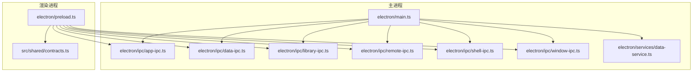
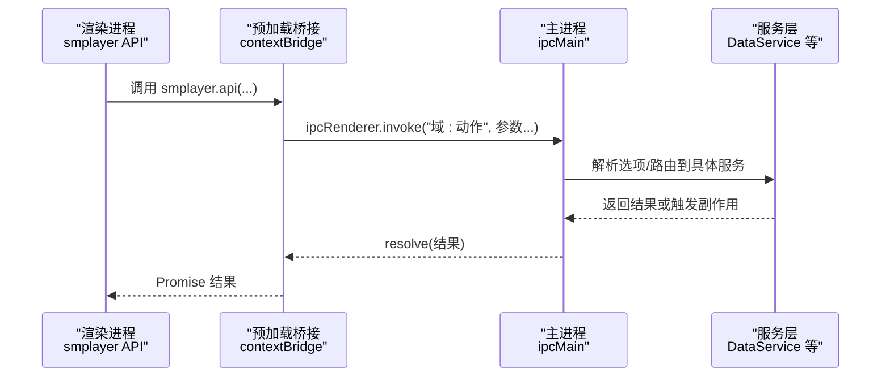
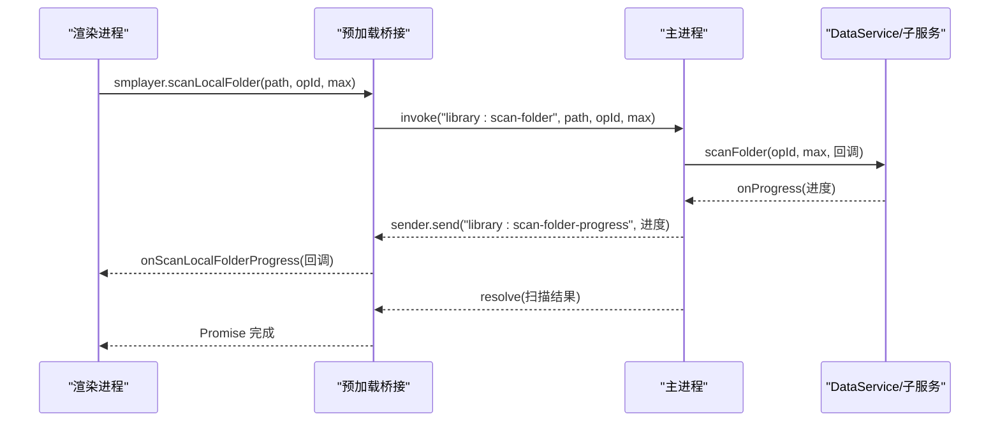
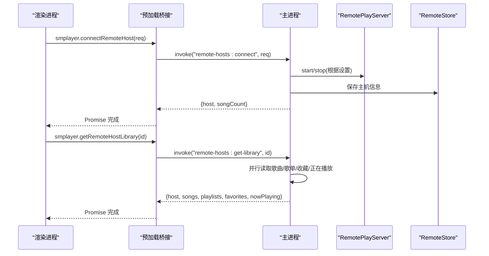
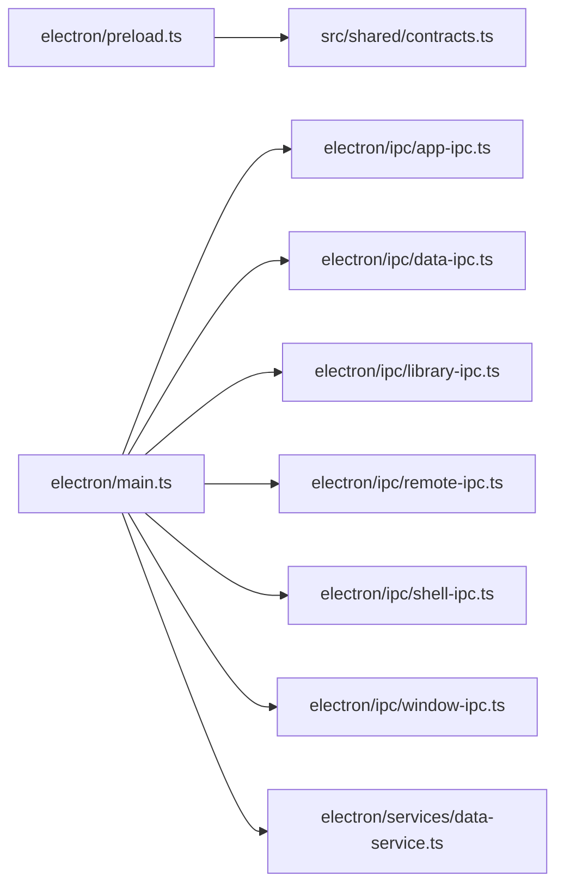

# IPC通信模块

<cite>
**本文档引用的文件**
- [electron/main.ts](file://electron/main.ts)
- [electron/preload.ts](file://electron/preload.ts)
- [electron/ipc/app-ipc.ts](file://electron/ipc/app-ipc.ts)
- [electron/ipc/data-ipc.ts](file://electron/ipc/data-ipc.ts)
- [electron/ipc/library-ipc.ts](file://electron/ipc/library-ipc.ts)
- [electron/ipc/remote-ipc.ts](file://electron/ipc/remote-ipc.ts)
- [electron/ipc/shell-ipc.ts](file://electron/ipc/shell-ipc.ts)
- [electron/ipc/window-ipc.ts](file://electron/ipc/window-ipc.ts)
- [src/shared/contracts.ts](file://src/shared/contracts.ts)
- [electron/services/data-service.ts](file://electron/services/data-service.ts)
</cite>

## 目录
1. [简介](#简介)
2. [项目结构](#项目结构)
3. [核心组件](#核心组件)
4. [架构总览](#架构总览)
5. [详细组件分析](#详细组件分析)
6. [依赖关系分析](#依赖关系分析)
7. [性能考量](#性能考量)
8. [故障排查指南](#故障排查指南)
9. [结论](#结论)
10. [附录：扩展与最佳实践](#附录扩展与最佳实践)

## 简介
本文件系统性梳理 SMPlayer 的 Electron 跨进程通信（IPC）模块，覆盖主进程与渲染进程之间的消息通道、数据流、错误处理与异步模式。文档聚焦以下 IPC 分类：
- 应用 IPC：应用信息、托盘状态、待打开文件
- 数据 IPC：播放设置、搜索历史、偏好设置、播放队列、最近播放
- 库管理 IPC：音乐库查询、歌曲属性、歌词、扫描与导入导出、本地文件操作
- 远程 IPC：远程分享状态、授权设备、远端主机连接与拉取
- Shell IPC：系统交互、语音识别、通知、日志
- 窗口 IPC：拖拽、全屏、迷你模式、标题栏外观

同时给出消息格式、传输协议、异步处理策略、错误处理、性能优化、安全与调试建议，以及扩展新 IPC 接口的方法论。

## 项目结构
SMPlayer 将 IPC 处理器按功能域拆分到独立文件，并在主进程集中注册；渲染进程通过预加载桥接暴露统一 API。

**图表来源**
- [electron/main.ts:141-209](file://electron/main.ts#L141-L209)
- [electron/preload.ts:45-287](file://electron/preload.ts#L45-L287)
- [electron/ipc/app-ipc.ts:10-26](file://electron/ipc/app-ipc.ts#L10-L26)
- [electron/ipc/data-ipc.ts:20-151](file://electron/ipc/data-ipc.ts#L20-L151)
- [electron/ipc/library-ipc.ts:28-302](file://electron/ipc/library-ipc.ts#L28-L302)
- [electron/ipc/remote-ipc.ts:19-54](file://electron/ipc/remote-ipc.ts#L19-L54)
- [electron/ipc/shell-ipc.ts:20-67](file://electron/ipc/shell-ipc.ts#L20-L67)
- [electron/ipc/window-ipc.ts:16-58](file://electron/ipc/window-ipc.ts#L16-L58)
- [electron/services/data-service.ts:39-198](file://electron/services/data-service.ts#L39-L198)

**章节来源**
- [electron/main.ts:141-209](file://electron/main.ts#L141-L209)
- [electron/preload.ts:45-287](file://electron/preload.ts#L45-L287)

## 核心组件
- 主进程注册器：在主进程启动时集中注册各域 IPC 处理器，注入服务实例与回调。
- 预加载桥接：在渲染进程通过 contextBridge 暴露统一的 smplayer API，封装 invoke/sendSync/on 等调用。
- 共享契约：定义所有 IPC 消息的请求/响应类型，确保强类型约束与文档化。

关键要点：
- 异步调用：渲染进程使用 ipcRenderer.invoke 发起请求，主进程用 ipcMain.handle 响应。
- 同步调用：渲染进程使用 ipcRenderer.sendSync 获取即时运行时设置快照。
- 事件监听：主进程向渲染进程推送进度与状态事件（如扫描进度、语音识别状态）。

**章节来源**
- [electron/main.ts:156-203](file://electron/main.ts#L156-L203)
- [electron/preload.ts:45-287](file://electron/preload.ts#L45-L287)
- [src/shared/contracts.ts:527-663](file://src/shared/contracts.ts#L527-L663)

## 架构总览
主进程负责业务逻辑与持久化，渲染进程负责 UI 与用户交互。IPC 作为桥梁，承载数据与控制指令。

**图表来源**
- [electron/preload.ts:45-287](file://electron/preload.ts#L45-L287)
- [electron/main.ts:156-203](file://electron/main.ts#L156-L203)
- [electron/services/data-service.ts:39-198](file://electron/services/data-service.ts#L39-L198)

## 详细组件分析

### 应用 IPC（App IPC）
职责：
- 提供应用基础信息（平台、版本、打包状态、用户数据路径）
- 托盘播放状态同步
- 待打开文件队列提取

接口清单（渲染侧 API 路径）：
- [electron/preload.ts:46](file://electron/preload.ts#L46)
- [electron/preload.ts:149](file://electron/preload.ts#L149)
- [electron/preload.ts:150](file://electron/preload.ts#L150)

主进程处理器：
- [electron/ipc/app-ipc.ts:10-26](file://electron/ipc/app-ipc.ts#L10-L26)

消息格式：
- 请求：无参数
- 响应：AppInfo 类型

错误与异步：
- 同步获取应用信息；托盘状态更新为异步处理。

**章节来源**
- [electron/ipc/app-ipc.ts:10-26](file://electron/ipc/app-ipc.ts#L10-L26)
- [electron/preload.ts:46,149,150](file://electron/preload.ts#L46,L149,L150)
- [src/shared/contracts.ts:1-6](file://src/shared/contracts.ts#L1-L6)

### 数据 IPC（Data IPC）
职责：
- 播放队列管理（替换、移除、清空）
- 搜索历史（保存、新增、删除、恢复、清空）
- 最近播放记录（记录、移除、恢复、清空）
- 设置与偏好（更新、增删改查）
- 即时播放设置（获取与保存）

接口清单（渲染侧 API 路径）：
- [electron/preload.ts:180-229](file://electron/preload.ts#L180-L229)

主进程处理器：
- [electron/ipc/data-ipc.ts:20-151](file://electron/ipc/data-ipc.ts#L20-L151)

消息格式：
- 请求/响应均遵循 contracts.ts 中的数据契约类型。

异步与事件：
- 即时播放设置使用 sendSync；其他多数为 invoke。

**章节来源**
- [electron/ipc/data-ipc.ts:20-151](file://electron/ipc/data-ipc.ts#L20-L151)
- [electron/preload.ts:180-229](file://electron/preload.ts#L180-L229)
- [src/shared/contracts.ts:318-357](file://src/shared/contracts.ts#L318-L357)

### 库管理 IPC（Library IPC）
职责：
- 音乐库快照查询（设置、统计、歌曲、播放列表、收藏、最近、搜索）
- 歌曲属性读写、播放次数更新
- 歌词读取、导入、保存、浏览器搜索、网络歌词保存
- 专辑/歌曲封面选择、保存、删除
- 本地文件删除（软删除）、撤销/提交删除
- 本地文件移动、重命名、隐藏、批量移动进度上报
- 本地库扫描（整库/单目录）、取消扫描、艺术家拆分分析与应用
- 数据导入导出

接口清单（渲染侧 API 路径）：
- [electron/preload.ts:47-127](file://electron/preload.ts#L47-L127)
- [electron/preload.ts:127-148](file://electron/preload.ts#L127-L148)

主进程处理器：
- [electron/ipc/library-ipc.ts:28-302](file://electron/ipc/library-ipc.ts#L28-L302)

消息格式：
- 请求/响应遵循 contracts.ts 中的 LibrarySong、LibraryPlaylist、MyFavoritesSnapshot、NowPlayingSnapshot、SettingsSnapshot、ScanLibraryProgress 等类型。

异步与事件：
- 扫描进度通过事件推送（library:scan-folder-progress）
- 软删除支持撤销/提交流程

**图表来源**
- [electron/preload.ts:127-148](file://electron/preload.ts#L127-L148)
- [electron/ipc/library-ipc.ts:228-247](file://electron/ipc/library-ipc.ts#L228-L247)

**章节来源**
- [electron/ipc/library-ipc.ts:28-302](file://electron/ipc/library-ipc.ts#L28-L302)
- [electron/preload.ts:47-127,127-148](file://electron/preload.ts#L47-L127,L127-L148)
- [src/shared/contracts.ts:36-49,83-91,170-179,311-316,449-463](file://src/shared/contracts.ts#L36-L49,L83-L91,L170-L179,L311-L316,L449-L463)

### 远程 IPC（Remote IPC）
职责：
- 远程分享开关与设置更新
- 授权设备管理
- 远端主机列表、连接、拉取音乐库

接口清单（渲染侧 API 路径）：
- [electron/preload.ts:108-118](file://electron/preload.ts#L108-L118)

主进程处理器：
- [electron/ipc/remote-ipc.ts:19-54](file://electron/ipc/remote-ipc.ts#L19-L54)

消息格式：
- 连接请求 RemoteHostConnectRequest，返回 RemoteHostConnectResult
- 远端音乐数据 RemoteMusicData

**图表来源**
- [electron/preload.ts:115-118](file://electron/preload.ts#L115-L118)
- [electron/ipc/remote-ipc.ts:44-53](file://electron/ipc/remote-ipc.ts#L44-L53)
- [electron/ipc/remote-ipc.ts:71-134](file://electron/ipc/remote-ipc.ts#L71-L134)

**章节来源**
- [electron/ipc/remote-ipc.ts:19-54](file://electron/ipc/remote-ipc.ts#L19-L54)
- [electron/preload.ts:108-118](file://electron/preload.ts#L108-L118)
- [src/shared/contracts.ts:106-168](file://src/shared/contracts.ts#L106-L168)

### Shell IPC（Shell IPC）
职责：
- 文件系统交互（显示项、创建本地文件夹）
- 反馈渠道（邮件、浏览器）
- 语音识别（Windows 语音）
- 系统通知（可配置是否显示）
- 日志位置展示

接口清单（渲染侧 API 路径）：
- [electron/preload.ts:69-79](file://electron/preload.ts#L69-L79)
- [electron/preload.ts:153-157](file://electron/preload.ts#L153-L157)
- [electron/preload.ts:158-179](file://electron/preload.ts#L158-L179)
- [electron/preload.ts:179-180](file://electron/preload.ts#L179-L180)

主进程处理器：
- [electron/ipc/shell-ipc.ts:20-67](file://electron/ipc/shell-ipc.ts#L20-L67)

**章节来源**
- [electron/ipc/shell-ipc.ts:20-67](file://electron/ipc/shell-ipc.ts#L20-L67)
- [electron/preload.ts:69-79,153-157,158-179,179-180](file://electron/preload.ts#L69-L79,L153-L157,L158-L179,L179-L180)

### 窗口 IPC（Window IPC）
职责：
- 窗口拖拽（开始/停止）
- 控件主题切换（浅色/深色）
- 全屏切换（进入/退出迷你模式时自动处理）
- 迷你模式切换
- 查询全屏/迷你模式状态

接口清单（渲染侧 API 路径）：
- [electron/preload.ts:70-76](file://electron/preload.ts#L70-L76)
- [electron/preload.ts:251-272](file://electron/preload.ts#L251-L272)

主进程处理器：
- [electron/ipc/window-ipc.ts:16-58](file://electron/ipc/window-ipc.ts#L16-L58)

**章节来源**
- [electron/ipc/window-ipc.ts:16-58](file://electron/ipc/window-ipc.ts#L16-L58)
- [electron/preload.ts:70-76,251-272](file://electron/preload.ts#L70-L76,L251-L272)

## 依赖关系分析
- 主进程集中注册各域 IPC，依赖 DataService 及其子服务（播放列表、历史、设置、扫描、歌词、本地项、缩略图缓存等）。
- 预加载桥接将 ipcRenderer 的 invoke/sendSync/on 统一封装为 smplayer API，渲染侧仅依赖 contracts.ts 类型。

**图表来源**
- [electron/main.ts:156-203](file://electron/main.ts#L156-L203)
- [electron/preload.ts:45-287](file://electron/preload.ts#L45-L287)
- [electron/services/data-service.ts:39-198](file://electron/services/data-service.ts#L39-L198)

**章节来源**
- [electron/main.ts:156-203](file://electron/main.ts#L156-L203)
- [electron/services/data-service.ts:39-198](file://electron/services/data-service.ts#L39-L198)

## 性能考量
- 使用 invoke 替代频繁的同步调用，避免阻塞渲染线程。
- 对于长耗时任务（扫描、导入导出），采用事件推送进度，避免长时间无反馈。
- 合理使用缓存与快照（如即时播放设置快照），减少重复查询。
- 在主进程对大量异步操作使用 Promise.all 并行处理（如远程库拉取）。
- 对大对象传输进行序列化优化，必要时拆分为多次小消息。

[本节为通用指导，无需特定文件引用]

## 故障排查指南
常见问题与定位思路：
- 渲染进程调用无响应
  - 检查主进程是否已注册对应 handle
  - 确认预加载桥接是否正确映射到 ipcRenderer.invoke
- 扫描进度不更新
  - 确认主进程是否发送 library:scan-folder-progress 事件
  - 检查渲染侧 onScanLocalFolderProgress 是否正确订阅
- 语音识别失败
  - 检查平台支持与隐私设置
  - 关注 onVoiceRecognitionStateChange 与 onVoiceRecognitionHypothesis 事件
- 远程连接异常
  - 校验远端 baseUrl 与鉴权 token
  - 查看远程服务器状态与网络连通性

**章节来源**
- [electron/ipc/library-ipc.ts:215-217,239](file://electron/ipc/library-ipc.ts#L215-L217,L239)
- [electron/preload.ts:127-148,158-179](file://electron/preload.ts#L127-L148,L158-L179)
- [electron/ipc/remote-ipc.ts:71-111](file://electron/ipc/remote-ipc.ts#L71-L111)

## 结论
SMPlayer 的 IPC 架构以“域划分、强类型契约、异步优先”为核心设计原则。通过主进程集中注册与预加载桥接统一封装，实现了清晰的职责边界与良好的可维护性。建议在扩展新接口时严格遵循现有模式，确保类型安全、异步处理与事件推送的一致性。

[本节为总结，无需特定文件引用]

## 附录：扩展与最佳实践

### 新增 IPC 接口步骤
- 在 contracts.ts 中定义请求/响应类型
- 在对应域的 IPC 文件中注册 handle 或 on 事件
- 在主进程 main.ts 中注入选项并注册处理器
- 在预加载桥接中暴露对应的 smplayer API 方法
- 在渲染侧调用并处理返回值与事件

**章节来源**
- [src/shared/contracts.ts:527-663](file://src/shared/contracts.ts#L527-L663)
- [electron/main.ts:156-203](file://electron/main.ts#L156-L203)
- [electron/preload.ts:45-287](file://electron/preload.ts#L45-L287)

### 修改现有接口
- 保持向后兼容：新增字段时保留默认值
- 更新 contracts.ts 与两端实现
- 为旧版本用户提供降级路径或迁移提示

**章节来源**
- [src/shared/contracts.ts:318-357](file://src/shared/contracts.ts#L318-L357)

### 复杂跨进程数据交换
- 对大数组/对象采用分页/分批传输
- 使用事件流推送进度，避免一次性传输过多数据
- 对敏感数据进行权限校验与最小化暴露

[本节为通用指导，无需特定文件引用]