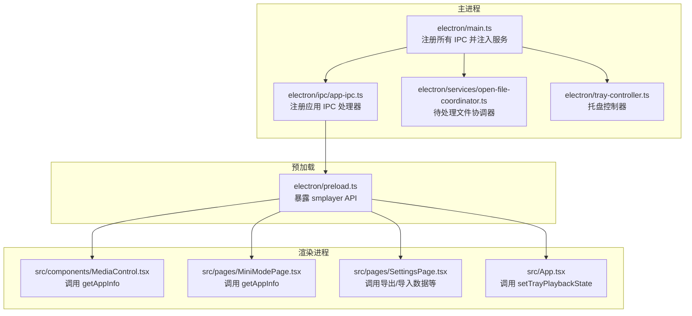
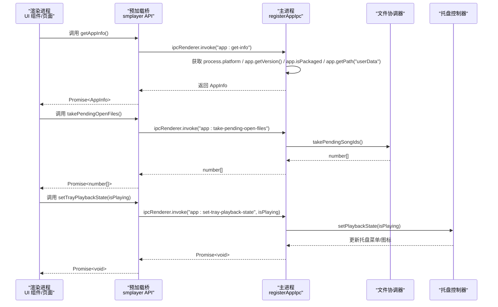
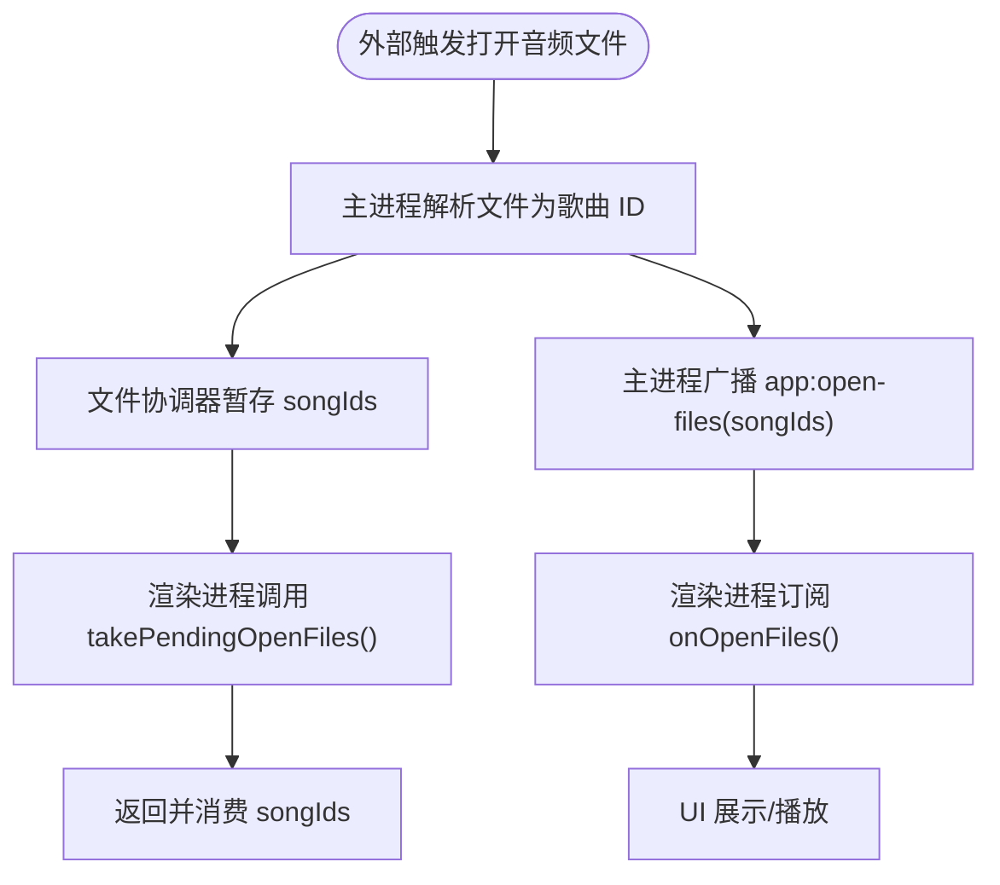
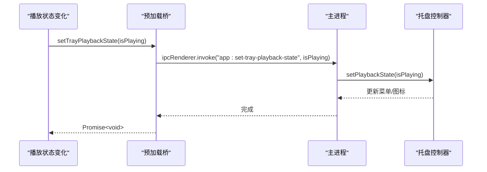
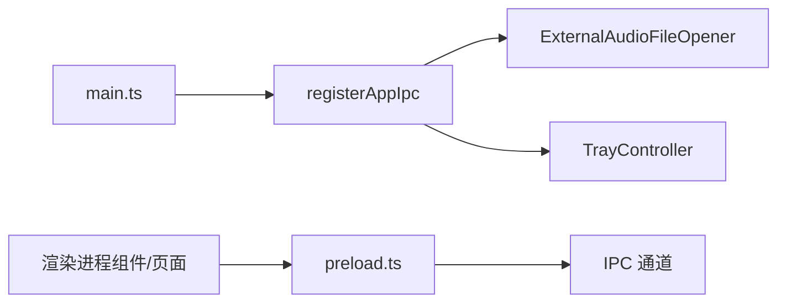

# 应用IPC接口

<cite>
**本文引用的文件**
- [electron/ipc/app-ipc.ts](file://electron/ipc/app-ipc.ts)
- [electron/preload.ts](file://electron/preload.ts)
- [electron/main.ts](file://electron/main.ts)
- [src/shared/contracts.ts](file://src/shared/contracts.ts)
- [electron/services/open-file-coordinator.ts](file://electron/services/open-file-coordinator.ts)
- [electron/tray-controller.ts](file://electron/tray-controller.ts)
- [src/components/MediaControl.tsx](file://src/components/MediaControl.tsx)
- [src/pages/MiniModePage.tsx](file://src/pages/MiniModePage.tsx)
- [src/pages/SettingsPage.tsx](file://src/pages/SettingsPage.tsx)
- [src/App.tsx](file://src/App.tsx)
</cite>

## 目录
1. [简介](#简介)
2. [项目结构](#项目结构)
3. [核心组件](#核心组件)
4. [架构总览](#架构总览)
5. [详细组件分析](#详细组件分析)
6. [依赖关系分析](#依赖关系分析)
7. [性能考量](#性能考量)
8. [故障排查指南](#故障排查指南)
9. [结论](#结论)
10. [附录](#附录)

## 简介
本文件系统性地阐述 SMPlayer 的应用 IPC 接口，重点覆盖以下能力：
- 应用信息获取：通过渲染进程查询平台、版本、打包状态与用户数据目录等信息
- 待处理文件处理：在应用启动或外部打开音频文件时，协调待处理的文件队列，并向渲染进程广播已解析的歌曲 ID 列表
- 托盘播放状态设置：根据播放状态更新托盘菜单与图标，支持全局媒体快捷键与托盘命令

文档将深入解析 registerAppIpc 函数的工作原理，说明其如何注册 IPC 处理器、处理应用信息请求、管理待处理打开文件、控制托盘播放状态；并提供来自渲染进程的实际调用示例（路径引用），解释参数传递、异步处理与错误处理策略；最后给出 AppInfo 数据结构的字段说明、扩展建议与最佳实践。

## 项目结构
应用 IPC 接口由三部分组成：
- 主进程侧注册与实现：负责注册 IPC 处理器、访问应用状态与服务
- 预加载脚本桥接：在渲染进程中暴露安全的 API 桥（contextBridge）
- 渲染进程调用方：在组件与页面中以 Promise 方式调用 IPC 接口

**图表来源**
- [electron/main.ts:156-159](file://electron/main.ts#L156-L159)
- [electron/ipc/app-ipc.ts:10-16](file://electron/ipc/app-ipc.ts#L10-L16)
- [electron/preload.ts:45-286](file://electron/preload.ts#L45-L286)
- [electron/services/open-file-coordinator.ts:40-74](file://electron/services/open-file-coordinator.ts#L40-L74)
- [electron/tray-controller.ts:28-120](file://electron/tray-controller.ts#L28-L120)

**章节来源**
- [electron/main.ts:141-209](file://electron/main.ts#L141-L209)
- [electron/ipc/app-ipc.ts:1-26](file://electron/ipc/app-ipc.ts#L1-L26)
- [electron/preload.ts:1-287](file://electron/preload.ts#L1-L287)

## 核心组件
- registerAppIpc：在主进程中注册应用相关的 IPC 处理器，包括获取应用信息、取出待处理打开文件、设置托盘播放状态
- 预加载桥接：在渲染进程中暴露 smplayer 对象，包含 getAppInfo、takePendingOpenFiles、setTrayPlaybackState 等方法
- 托盘控制器：根据播放状态更新托盘菜单项与图标，维护 isPlaying 状态
- 文件协调器：收集外部传入的音频文件路径，解析为歌曲 ID，并提供“取出”接口供 IPC 使用

**章节来源**
- [electron/ipc/app-ipc.ts:10-25](file://electron/ipc/app-ipc.ts#L10-L25)
- [electron/preload.ts:45-286](file://electron/preload.ts#L45-L286)
- [electron/tray-controller.ts:28-120](file://electron/tray-controller.ts#L28-L120)
- [electron/services/open-file-coordinator.ts:15-74](file://electron/services/open-file-coordinator.ts#L15-L74)

## 架构总览
应用 IPC 的关键交互流程如下：

**图表来源**
- [electron/ipc/app-ipc.ts:10-16](file://electron/ipc/app-ipc.ts#L10-L16)
- [electron/preload.ts:45-286](file://electron/preload.ts#L45-L286)
- [electron/main.ts:156-159](file://electron/main.ts#L156-L159)
- [electron/services/open-file-coordinator.ts:48-50](file://electron/services/open-file-coordinator.ts#L48-L50)
- [electron/tray-controller.ts:113-120](file://electron/tray-controller.ts#L113-L120)

## 详细组件分析

### registerAppIpc 工作原理
- 注册处理器
  - app:get-info：返回当前应用信息（平台、版本、是否打包、用户数据目录）
  - app:take-pending-open-files：返回待处理打开文件对应的歌曲 ID 列表
  - app:set-tray-playback-state：设置托盘播放状态（用于更新托盘菜单与图标）

- 参数与返回
  - 通过 options 回调注入：takePendingOpenSongIds 与 setTrayPlaybackState
  - 处理器内部不直接操作 UI，而是委托给服务层与托盘控制器

- 错误处理
  - IPC invoke 默认通过 Promise 返回结果或异常
  - 若主进程未就绪，渲染进程应重试或等待初始化完成

**章节来源**
- [electron/ipc/app-ipc.ts:10-25](file://electron/ipc/app-ipc.ts#L10-L25)
- [electron/main.ts:156-159](file://electron/main.ts#L156-L159)

### 应用信息获取（getAppInfo）
- 字段说明（AppInfo）
  - platform：运行平台标识
  - version：应用版本号
  - isPackaged：是否为打包后的应用
  - userDataPath：用户数据目录路径

- 典型用法
  - 在 UI 中显示版本号、平台特性开关（如 Windows 语音助手）
  - 根据 isPackaged 决定某些功能的可用性

- 调用示例（路径引用）
  - [src/components/MediaControl.tsx:751-755](file://src/components/MediaControl.tsx#L751-L755)
  - [src/pages/MiniModePage.tsx:207-211](file://src/pages/MiniModePage.tsx#L207-L211)
  - [src/pages/SettingsPage.tsx:402-406](file://src/pages/SettingsPage.tsx#L402-L406)

**章节来源**
- [src/shared/contracts.ts:1-6](file://src/shared/contracts.ts#L1-L6)
- [electron/ipc/app-ipc.ts:18-25](file://electron/ipc/app-ipc.ts#L18-L25)
- [electron/preload.ts:45-46](file://electron/preload.ts#L45-L46)

### 待处理文件处理（takePendingOpenFiles 与 open-files 广播）
- 流程说明
  - 外部通过命令行或系统事件触发音频文件打开
  - 主进程使用 ExternalAudioFileOpener 解析文件为歌曲 ID，并将 ID 列表暂存
  - 渲染进程通过 IPC 取出待处理 ID 列表，随后触发播放或界面更新
  - 同时主进程会向渲染进程广播 app:open-files 事件，通知 UI 展示

- 关键实现
  - 主进程注册：app:take-pending-open-files -> ExternalAudioFileOpener.takePendingSongIds
  - 事件广播：主进程在解析完成后发送 app:open-files(songIds)
  - 预加载桥接：暴露 takePendingOpenFiles 与 onOpenFiles 订阅

- 调用示例（路径引用）
  - [electron/main.ts:131-139](file://electron/main.ts#L131-L139)
  - [electron/services/open-file-coordinator.ts:48-73](file://electron/services/open-file-coordinator.ts#L48-L73)
  - [electron/preload.ts:149](file://electron/preload.ts#L149)
  - [electron/preload.ts:273-283](file://electron/preload.ts#L273-L283)

**图表来源**
- [electron/main.ts:131-139](file://electron/main.ts#L131-L139)
- [electron/services/open-file-coordinator.ts:48-73](file://electron/services/open-file-coordinator.ts#L48-L73)
- [electron/preload.ts:149](file://electron/preload.ts#L149)
- [electron/preload.ts:273-283](file://electron/preload.ts#L273-L283)

**章节来源**
- [electron/main.ts:131-139](file://electron/main.ts#L131-L139)
- [electron/services/open-file-coordinator.ts:40-74](file://electron/services/open-file-coordinator.ts#L40-L74)
- [electron/preload.ts:149](file://electron/preload.ts#L149)
- [electron/preload.ts:273-283](file://electron/preload.ts#L273-L283)

### 托盘播放状态设置（setTrayPlaybackState）
- 功能说明
  - 根据播放状态切换托盘菜单中的播放/暂停按钮文案
  - 保持 isPlaying 状态一致性，避免重复更新

- 实现要点
  - 主进程接收 isPlaying，调用 TrayController.setPlaybackState
  - 托盘控制器根据状态更新菜单项与图标

- 调用示例（路径引用）
  - [src/App.tsx:319-321](file://src/App.tsx#L319-L321)
  - [electron/ipc/app-ipc.ts:13-15](file://electron/ipc/app-ipc.ts#L13-L15)
  - [electron/main.ts:158](file://electron/main.ts#L158)
  - [electron/tray-controller.ts:113-120](file://electron/tray-controller.ts#L113-L120)

**图表来源**
- [src/App.tsx:319-321](file://src/App.tsx#L319-L321)
- [electron/preload.ts:150](file://electron/preload.ts#L150)
- [electron/ipc/app-ipc.ts:13-15](file://electron/ipc/app-ipc.ts#L13-L15)
- [electron/main.ts:158](file://electron/main.ts#L158)
- [electron/tray-controller.ts:113-120](file://electron/tray-controller.ts#L113-L120)

**章节来源**
- [src/App.tsx:319-321](file://src/App.tsx#L319-L321)
- [electron/ipc/app-ipc.ts:13-15](file://electron/ipc/app-ipc.ts#L13-L15)
- [electron/main.ts:158](file://electron/main.ts#L158)
- [electron/tray-controller.ts:113-120](file://electron/tray-controller.ts#L113-L120)

### 预加载桥接与渲染进程调用
- 预加载桥接
  - 暴露 smplayer 对象，包含 getAppInfo、takePendingOpenFiles、setTrayPlaybackState 等方法
  - 通过 ipcRenderer.invoke 发送请求，通过 ipcRenderer.on 订阅事件

- 渲染进程调用示例（路径引用）
  - 获取应用信息：[src/components/MediaControl.tsx:751-755](file://src/components/MediaControl.tsx#L751-L755)、[src/pages/MiniModePage.tsx:207-211](file://src/pages/MiniModePage.tsx#L207-L211)、[src/pages/SettingsPage.tsx:402-406](file://src/pages/SettingsPage.tsx#L402-L406)
  - 设置托盘播放状态：[src/App.tsx:319-321](file://src/App.tsx#L319-L321)
  - 取待处理文件：[electron/preload.ts:149](file://electron/preload.ts#L149)
  - 订阅打开文件事件：[electron/preload.ts:273-283](file://electron/preload.ts#L273-L283)

**章节来源**
- [electron/preload.ts:45-286](file://electron/preload.ts#L45-L286)

## 依赖关系分析
- 主进程依赖
  - registerAppIpc 依赖 ExternalAudioFileOpener（取待处理 ID）与 TrayController（设置托盘状态）
- 预加载桥接
  - 将 IPC 请求映射到具体通道名，确保类型安全与一致的签名
- 渲染进程
  - 通过 window.smplayer 调用，遵循 Promise 异步模型

**图表来源**
- [electron/main.ts:156-159](file://electron/main.ts#L156-L159)
- [electron/ipc/app-ipc.ts:10-16](file://electron/ipc/app-ipc.ts#L10-L16)
- [electron/services/open-file-coordinator.ts:40-74](file://electron/services/open-file-coordinator.ts#L40-L74)
- [electron/tray-controller.ts:28-120](file://electron/tray-controller.ts#L28-L120)
- [electron/preload.ts:45-286](file://electron/preload.ts#L45-L286)

**章节来源**
- [electron/main.ts:156-159](file://electron/main.ts#L156-L159)
- [electron/ipc/app-ipc.ts:10-16](file://electron/ipc/app-ipc.ts#L10-L16)
- [electron/preload.ts:45-286](file://electron/preload.ts#L45-L286)

## 性能考量
- IPC 调用为异步，避免阻塞 UI 线程
- 托盘状态更新仅在状态变更时进行，减少不必要的菜单重建
- 外部文件解析采用批量处理与去重策略，降低 I/O 压力
- 建议在渲染进程对频繁调用进行节流或防抖（例如播放状态变更）

## 故障排查指南
- getAppInfo 返回空或字段缺失
  - 确认主进程已初始化完成，且 app 对象可用
  - 检查预加载桥接是否正确暴露 smplayer 对象

- takePendingOpenFiles 返回空
  - 确认外部文件是否为音频扩展名且存在
  - 检查主进程是否已解析并暂存歌曲 ID

- 托盘播放状态未更新
  - 确认 setTrayPlaybackState 是否被调用
  - 检查 TrayController 是否已创建托盘实例并处于活跃状态

- 打开文件事件未触发
  - 确认主进程已注册 app:open-files 广播
  - 检查渲染进程是否正确订阅 onOpenFiles

**章节来源**
- [electron/services/open-file-coordinator.ts:56-73](file://electron/services/open-file-coordinator.ts#L56-L73)
- [electron/tray-controller.ts:37-120](file://electron/tray-controller.ts#L37-L120)
- [electron/preload.ts:273-283](file://electron/preload.ts#L273-L283)

## 结论
SMPlayer 的应用 IPC 接口以 registerAppIpc 为核心，围绕应用信息、待处理文件与托盘播放状态三大场景构建了清晰、可扩展的桥接层。通过预加载桥接与主进程服务协作，渲染进程能够安全、可靠地调用底层能力。建议在后续迭代中进一步完善错误恢复与日志记录，增强跨平台兼容性与可测试性。

## 附录

### AppInfo 数据结构字段说明
- platform：运行平台标识（如 win32、darwin、linux）
- version：应用版本号
- isPackaged：是否为打包后的应用（影响某些系统集成行为）
- userDataPath：用户数据目录路径（用于存储配置、缓存等）

**章节来源**
- [src/shared/contracts.ts:1-6](file://src/shared/contracts.ts#L1-L6)

### 扩展方法与最佳实践
- 扩展点
  - 新增应用信息字段：在主进程的 getAppInfo 中补充，并同步更新类型定义
  - 新增待处理文件来源：在 ExternalAudioFileOpener 中增加新的解析逻辑
  - 新增托盘命令：在 TrayController 中扩展菜单项与事件处理

- 最佳实践
  - 始终通过 Promise 处理 IPC 调用，合理处理异常
  - 对高频状态更新进行去抖/节流，避免过度刷新
  - 在主进程与渲染进程之间保持一致的事件命名与参数约定
  - 对外部输入进行严格校验（如文件存在性、扩展名匹配）

**章节来源**
- [electron/ipc/app-ipc.ts:18-25](file://electron/ipc/app-ipc.ts#L18-L25)
- [electron/services/open-file-coordinator.ts:76-80](file://electron/services/open-file-coordinator.ts#L76-L80)
- [electron/tray-controller.ts:53-111](file://electron/tray-controller.ts#L53-L111)