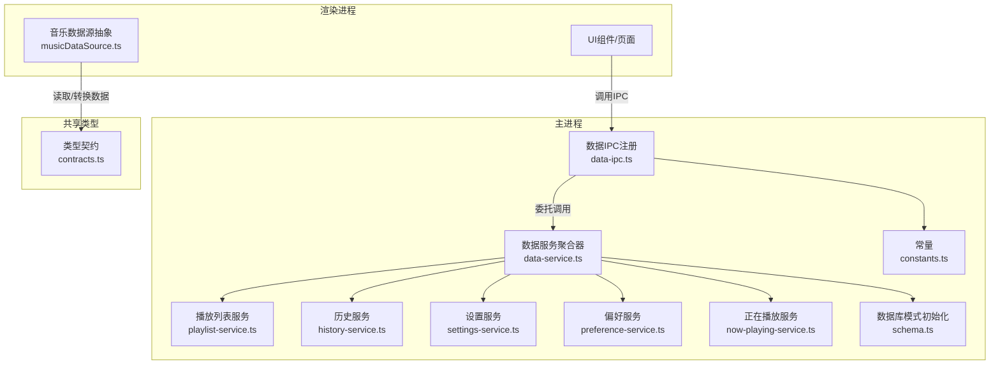
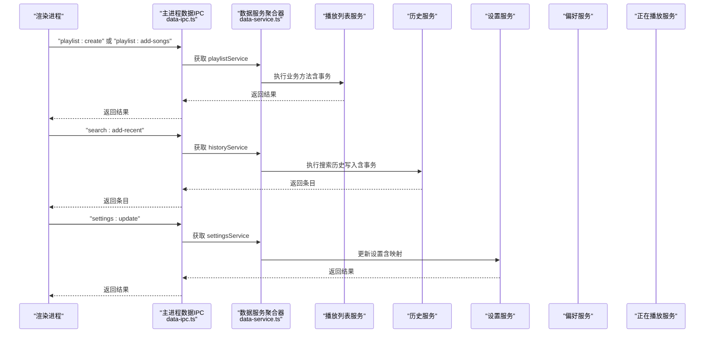
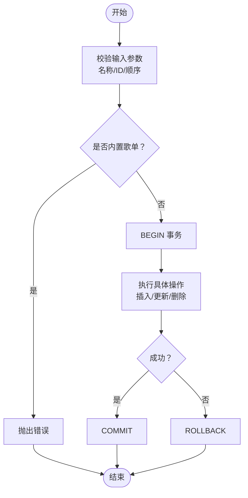
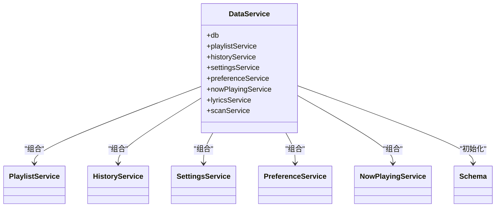

# 数据IPC接口

<cite>
**本文引用的文件**
- [data-ipc.ts](file://electron/ipc/data-ipc.ts)
- [data-service.ts](file://electron/services/data-service.ts)
- [schema.ts](file://electron/services/schema.ts)
- [row-mappers.ts](file://electron/services/row-mappers.ts)
- [playlist-service.ts](file://electron/services/playlist-service.ts)
- [history-service.ts](file://electron/services/history-service.ts)
- [settings-service.ts](file://electron/services/settings-service.ts)
- [preference-service.ts](file://electron/services/preference-service.ts)
- [now-playing-service.ts](file://electron/services/now-playing-service.ts)
- [constants.ts](file://electron/services/constants.ts)
- [contracts.ts](file://src/shared/contracts.ts)
- [musicDataSource.ts](file://src/data/musicDataSource.ts)
</cite>

## 目录
1. [简介](#简介)
2. [项目结构](#项目结构)
3. [核心组件](#核心组件)
4. [架构总览](#架构总览)
5. [详细组件分析](#详细组件分析)
6. [依赖关系分析](#依赖关系分析)
7. [性能考量](#性能考量)
8. [故障排除指南](#故障排除指南)
9. [结论](#结论)
10. [附录](#附录)

## 简介
本文件系统性阐述 SMPlayer 的“数据 IPC 接口”，聚焦于主进程与渲染进程之间的数据操作 IPC 通信机制，涵盖数据库查询、插入、更新、删除等操作的实现方式；解释数据 IPC 如何与主进程的数据服务层交互（数据验证、事务处理、错误传播）；提供复杂数据库操作示例、大量数据传输处理策略、数据一致性保障方法；并总结性能优化与安全注意事项及扩展与排障建议。

## 项目结构
数据 IPC 主要位于主进程的 IPC 注册模块中，通过 Electron 的 ipcMain.handle/on 暴露方法给渲染进程调用；底层由数据服务层封装 SQLite 访问，并以服务类形式组织业务逻辑（播放列表、历史记录、设置、偏好、正在播放队列等）。类型契约在共享类型文件中统一定义。

图表来源
- [data-ipc.ts:20-151](file://electron/ipc/data-ipc.ts#L20-L151)
- [data-service.ts:39-198](file://electron/services/data-service.ts#L39-L198)
- [playlist-service.ts:9-508](file://electron/services/playlist-service.ts#L9-L508)
- [history-service.ts:30-484](file://electron/services/history-service.ts#L30-L484)
- [settings-service.ts:61-577](file://electron/services/settings-service.ts#L61-L577)
- [preference-service.ts:44-402](file://electron/services/preference-service.ts#L44-L402)
- [now-playing-service.ts:6-104](file://electron/services/now-playing-service.ts#L6-L104)
- [schema.ts:33-364](file://electron/services/schema.ts#L33-L364)
- [constants.ts:1-28](file://electron/services/constants.ts#L1-L28)
- [contracts.ts:1-664](file://src/shared/contracts.ts#L1-L664)
- [musicDataSource.ts:43-331](file://src/data/musicDataSource.ts#L43-L331)

章节来源
- [data-ipc.ts:20-151](file://electron/ipc/data-ipc.ts#L20-L151)
- [data-service.ts:39-198](file://electron/services/data-service.ts#L39-L198)
- [schema.ts:33-364](file://electron/services/schema.ts#L33-L364)

## 核心组件
- 数据 IPC 注册器：集中注册所有数据相关 IPC 方法，按功能域分组（播放列表、历史、设置、偏好、正在播放、搜索等），统一注入服务工厂与 UI 更新回调。
- 数据服务聚合器：负责数据库连接、模式初始化、各子服务实例化与生命周期管理。
- 服务层：
  - 播放列表服务：支持创建/删除/重命名/排序歌曲、批量增删、内置歌单管理、外键约束清理。
  - 历史服务：搜索历史持久化、最近播放记录（歌曲/专辑/艺术家/播放列表）、播放计数更新。
  - 设置服务：应用设置、视图状态、播放设置的读写与映射。
  - 偏好服务：实体级显示/优先级控制、有效性校验与清理。
  - 正在播放服务：基于 JSON 文件的队列持久化与路径到 ID 的映射。
- 类型契约：统一前后端数据结构，确保 IPC 参数与返回值的类型安全。
- 行映射器：将数据库行转换为前端可用的领域对象。

章节来源
- [data-ipc.ts:20-151](file://electron/ipc/data-ipc.ts#L20-L151)
- [data-service.ts:39-198](file://electron/services/data-service.ts#L39-L198)
- [playlist-service.ts:9-508](file://electron/services/playlist-service.ts#L9-L508)
- [history-service.ts:30-484](file://electron/services/history-service.ts#L30-L484)
- [settings-service.ts:61-577](file://electron/services/settings-service.ts#L61-L577)
- [preference-service.ts:44-402](file://electron/services/preference-service.ts#L44-L402)
- [now-playing-service.ts:6-104](file://electron/services/now-playing-service.ts#L6-L104)
- [row-mappers.ts:1-87](file://electron/services/row-mappers.ts#L1-L87)
- [contracts.ts:1-664](file://src/shared/contracts.ts#L1-L664)

## 架构总览
数据 IPC 的调用链路如下：渲染进程通过 ipcRenderer 调用主进程注册的 handle/on 方法；主进程根据 IPC 名称路由到对应服务方法；服务方法执行 SQL 语句或文件操作；必要时开启事务并进行一致性校验；最终将结果或快照返回给渲染进程。

图表来源
- [data-ipc.ts:20-151](file://electron/ipc/data-ipc.ts#L20-L151)
- [data-service.ts:39-198](file://electron/services/data-service.ts#L39-L198)
- [playlist-service.ts:171-201](file://electron/services/playlist-service.ts#L171-L201)
- [history-service.ts:236-261](file://electron/services/history-service.ts#L236-L261)
- [settings-service.ts:208-269](file://electron/services/settings-service.ts#L208-L269)

## 详细组件分析

### 数据IPC注册器（data-ipc.ts）
- 功能域划分：播放列表、正在播放队列、搜索历史、最近播放、设置、偏好、视图状态、播放设置等。
- 服务注入：通过选项函数延迟获取具体服务实例，避免循环依赖。
- 事件处理：
  - handle：异步处理，适合需要返回值的写操作（如创建/更新/删除）。
  - on + event.returnValue：同步处理，用于高频读取（如即时获取播放设置）。
- UI联动：写入后触发托盘菜单与任务栏跳转列表刷新，保持 UI 与数据一致。

章节来源
- [data-ipc.ts:20-151](file://electron/ipc/data-ipc.ts#L20-L151)

### 数据服务聚合器（data-service.ts）
- 数据库连接：使用 node:sqlite 同步接口，初始化 WAL 模式、外键约束、索引。
- 服务装配：集中初始化各子服务（播放列表、历史、设置、偏好、正在播放、扫描、歌词、封面等），并建立跨服务依赖（如歌词服务依赖设置/歌曲服务）。
- 清理与恢复：启动时清理无效项、恢复播放状态、初始化内置播放列表。
- 关闭流程：提交 WAL 并关闭数据库连接。

章节来源
- [data-service.ts:39-198](file://electron/services/data-service.ts#L39-L198)

### 播放列表服务（playlist-service.ts）
- 事务模型：所有写操作（创建、删除、重命名、添加/移除歌曲、重排顺序）均包裹在 BEGIN/COMMIT/Rollback 中，确保原子性。
- 数据验证：
  - 内置歌单保护：禁止删除/重命名内置歌单（收藏、正在播放）。
  - 唯一性检查：歌单名称去空格后唯一性校验。
  - 顺序一致性：重排前比对当前与请求的 ID 列表，防止越界或重复。
- 外键与清理：删除歌单时将关联项标记为非活跃；清理无效项（目标不存在或状态不活跃）。
- 性能优化：批量插入使用 CTE/VALUES，减少多次往返；去重使用 Set。

图表来源
- [playlist-service.ts:171-201](file://electron/services/playlist-service.ts#L171-L201)
- [playlist-service.ts:203-219](file://electron/services/playlist-service.ts#L203-L219)
- [playlist-service.ts:263-275](file://electron/services/playlist-service.ts#L263-L275)
- [playlist-service.ts:338-364](file://electron/services/playlist-service.ts#L338-L364)
- [playlist-service.ts:366-406](file://electron/services/playlist-service.ts#L366-L406)

章节来源
- [playlist-service.ts:9-508](file://electron/services/playlist-service.ts#L9-L508)

### 历史服务（history-service.ts）
- 搜索历史：保存最近查询、插入去重、按时间倒序查询、支持按查询内容与类型删除。
- 最近播放：歌曲播放计数+1，写入最近记录，支持按类型（歌曲/专辑/艺术家/播放列表）查询与清理。
- 事务模型：写入/恢复/清理均使用事务，失败回滚。
- 兼容性：支持多种时间格式存储（ISO、.NET 时间戳），自动解析与转换。

章节来源
- [history-service.ts:30-484](file://electron/services/history-service.ts#L30-L484)

### 设置服务（settings-service.ts）
- 设置读写：提供应用设置、视图状态、播放设置的读取与更新，内部完成数值与枚举映射。
- 初始化：首次运行自动创建默认设置行，包含内置歌单 ID。
- 映射函数：将数值编码映射为前端枚举，反之亦然，保证前后端一致性。

章节来源
- [settings-service.ts:61-577](file://electron/services/settings-service.ts#L61-L577)

### 偏好服务（preference-service.ts）
- 实体级偏好：支持歌曲/艺人/专辑/播放列表/文件夹等实体的显示开关、优先级等级。
- 有效性校验：针对不同实体类型检查目标是否存在且处于活跃状态，无效项可批量清理。
- 兼容性：初始化偏好设置表，确保后续查询稳定。

章节来源
- [preference-service.ts:44-402](file://electron/services/preference-service.ts#L44-L402)

### 正在播放服务（now-playing-service.ts）
- 队列持久化：使用 JSON 文件保存当前播放路径序列，重启后可恢复。
- 路径到 ID 映射：根据已知歌曲路径集合映射到数据库 ID，支持回放。
- 回退策略：当 JSON 为空时，回退到“正在播放”歌单的歌曲 ID 序列。

章节来源
- [now-playing-service.ts:6-104](file://electron/services/now-playing-service.ts#L6-L104)

### 数据库模式与索引（schema.ts）
- 模式初始化：启用 WAL、外键、同步级别；创建核心表（Settings、Music、Album、MusicArtist、Playlist、PlaylistItem、PreferenceSetting、PreferenceItem、RecentRecord、SearchHistory、SearchState、HiddenStorageItem、RemoteSetting、AuthorizedDevice、RemoteHost）。
- 索引优化：为常用查询字段建立唯一/普通索引，提升查询性能。
- 迁移兼容：动态添加缺失列、重命名列、修正索引冲突，保证版本演进。

章节来源
- [schema.ts:33-364](file://electron/services/schema.ts#L33-L364)

### 行映射器（row-mappers.ts）
- 将数据库行转换为前端领域对象（如播放列表、搜索历史、歌曲艺人等），并进行类型与枚举映射。
- 提供搜索历史类型的校验与转换，确保类型安全。

章节来源
- [row-mappers.ts:1-87](file://electron/services/row-mappers.ts#L1-L87)

### 类型契约（contracts.ts）
- 定义播放模式、排序准则、库实体（歌曲、专辑、艺人、播放列表、文件夹）、搜索历史、设置快照、偏好项等类型。
- 统一前后端数据结构，避免 IPC 传递时的类型歧义。

章节来源
- [contracts.ts:1-664](file://src/shared/contracts.ts#L1-L664)

### 音乐数据源抽象（musicDataSource.ts）
- 抽象本地与远程数据源，统一提供设置、统计、歌曲、艺人、专辑、文件夹、最近播放、播放列表、收藏、正在播放、搜索等接口。
- 支持远程数据源的懒加载与缓存，以及排序变更的响应式重建。

章节来源
- [musicDataSource.ts:43-331](file://src/data/musicDataSource.ts#L43-L331)

## 依赖关系分析
- IPC 层仅依赖数据服务聚合器提供的服务工厂，避免直接耦合具体服务类。
- 数据服务聚合器依赖各子服务与其依赖（如歌词服务依赖设置/歌曲服务）。
- 子服务之间存在弱耦合：如播放列表服务依赖设置服务（内置歌单 ID），历史服务依赖设置服务（最近播放限制）。
- 数据库层通过 node:sqlite 同步接口访问，配合 WAL 与外键约束保证一致性。

图表来源
- [data-service.ts:39-198](file://electron/services/data-service.ts#L39-L198)
- [schema.ts:33-364](file://electron/services/schema.ts#L33-L364)

章节来源
- [data-service.ts:39-198](file://electron/services/data-service.ts#L39-L198)

## 性能考量
- 事务批处理：写操作统一使用事务，减少磁盘写入次数，提高吞吐量。
- 索引优化：为高频查询字段建立索引，降低查询成本。
- 去重与批量插入：使用 Set 去重与 CTE/VALUES 批量插入，避免重复写入。
- 懒加载与缓存：远程数据源采用懒加载与缓存，减少网络与计算开销。
- WAL 模式：启用 WAL 提升并发读写性能，降低锁竞争。
- JSON 队列：正在播放队列使用 JSON 文件持久化，读写简单高效。

[本节为通用性能指导，无需特定文件来源]

## 故障排除指南
- 写入失败回滚：若某次写入抛错，事务会自动回滚，确保数据一致性。检查服务方法的异常分支与日志。
- 内置歌单保护：尝试删除/重命名内置歌单会抛错，确认目标是否为内置歌单。
- 顺序一致性校验：重排歌单或歌曲时，若当前列表与请求不一致会抛错，先刷新 UI 再重试。
- 无效项清理：定期调用清理方法（如清理无效播放列表项、最近播放项），避免脏数据累积。
- 设置未初始化：首次运行需等待设置初始化完成，否则读取设置会抛错。
- 搜索历史重复：插入前会按查询内容与类型去重，若仍出现重复，检查类型枚举映射。

章节来源
- [playlist-service.ts:206-208](file://electron/services/playlist-service.ts#L206-L208)
- [playlist-service.ts:304-308](file://electron/services/playlist-service.ts#L304-L308)
- [history-service.ts:246-261](file://electron/services/history-service.ts#L246-L261)
- [settings-service.ts:181-187](file://electron/services/settings-service.ts#L181-L187)

## 结论
SMPlayer 的数据 IPC 接口通过清晰的功能域划分与严格的事务模型，实现了可靠的数据操作能力。服务层以强类型契约与行映射器确保前后端一致性，数据库层通过模式初始化与索引优化保障性能。结合 WAL、批量插入与懒加载策略，整体具备良好的扩展性与稳定性。建议在新增功能时遵循现有事务与类型约束模式，持续维护索引与清理流程，以保持系统的长期健康。

[本节为总结性内容，无需特定文件来源]

## 附录

### 数据操作示例（概念性说明）
- 创建播放列表并批量添加歌曲：调用 playlist:create，传入名称与歌曲 ID 数组；服务层开启事务，插入歌单并批量写入 PlaylistItem，最后提交。
- 添加搜索历史：调用 search:add-recent，传入查询字符串与类型；服务层去重后插入 SearchHistory，事务提交。
- 更新播放设置：调用 settings:update 或 playback:save-settings-immediate，服务层将枚举映射为数值并更新 Settings 表。
- 清理无效偏好项：调用 preferences:clear-invalid，按实体类型检查目标有效性并标记为非活跃。

章节来源
- [data-ipc.ts:37-64](file://electron/ipc/data-ipc.ts#L37-L64)
- [data-ipc.ts:70-82](file://electron/ipc/data-ipc.ts#L70-L82)
- [data-ipc.ts:108-113](file://electron/ipc/data-ipc.ts#L108-L113)
- [data-ipc.ts:141-144](file://electron/ipc/data-ipc.ts#L141-L144)

### 安全与一致性建议
- 输入校验：对用户输入（名称、路径、ID 列表）进行长度与格式校验，避免注入与越界。
- 权限控制：对内置歌单与系统关键设置的修改增加权限校验。
- 事务边界：确保每个写操作都在事务内完成，失败即回滚。
- 数据迁移：通过 schema.ts 的迁移函数保证数据库结构演进的向后兼容。

章节来源
- [playlist-service.ts:421-435](file://electron/services/playlist-service.ts#L421-L435)
- [schema.ts:262-364](file://electron/services/schema.ts#L262-L364)