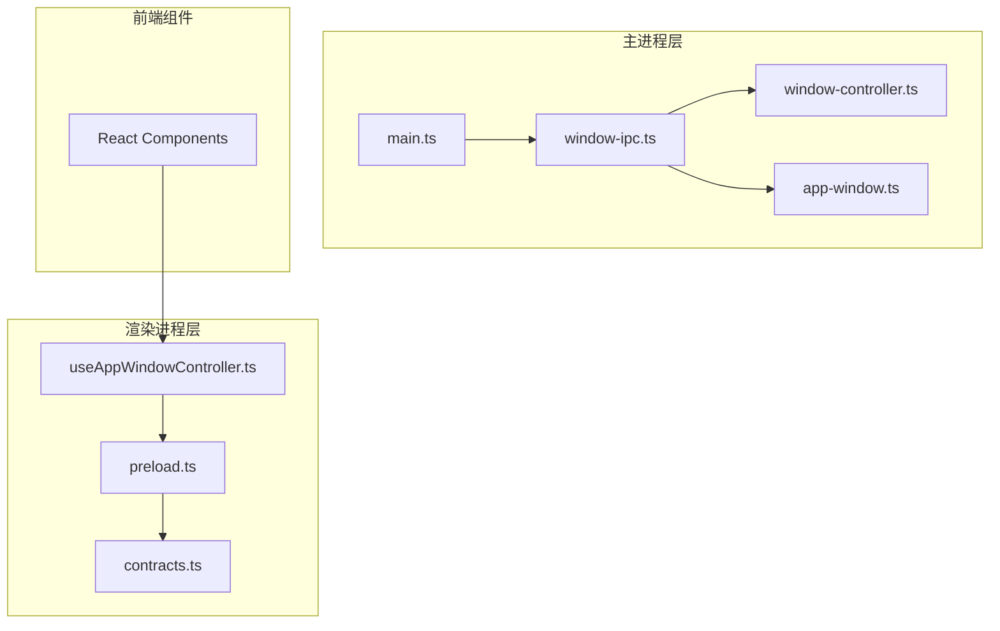
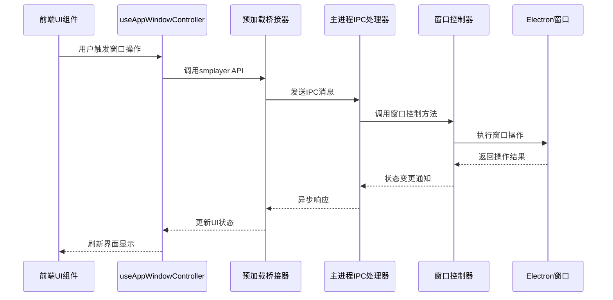
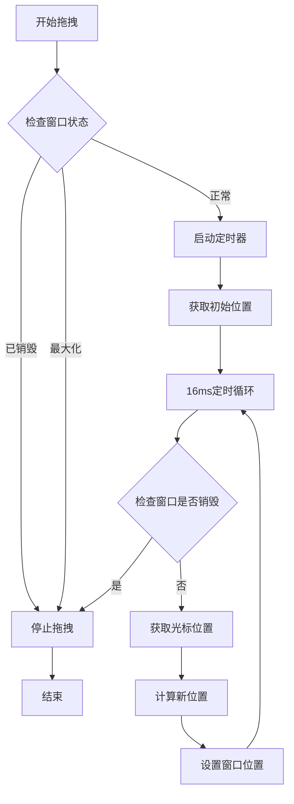
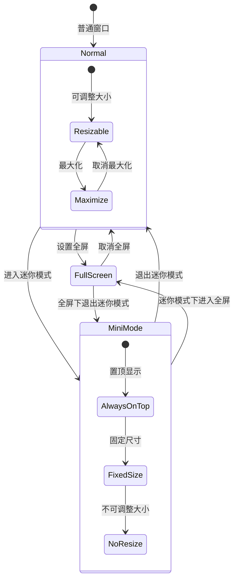
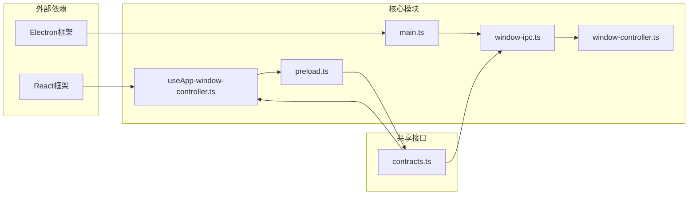

# 窗口IPC接口

<cite>
**本文档引用的文件**
- [window-ipc.ts](file://electron/ipc/window-ipc.ts)
- [window-controller.ts](file://electron/window-controller.ts)
- [app-window.ts](file://electron/app-window.ts)
- [main.ts](file://electron/main.ts)
- [preload.ts](file://electron/preload.ts)
- [useAppWindowController.ts](file://src/hooks/useAppWindowController.ts)
- [contracts.ts](file://src/shared/contracts.ts)
</cite>

## 目录
1. [简介](#简介)
2. [项目结构](#项目结构)
3. [核心组件](#核心组件)
4. [架构概览](#架构概览)
5. [详细组件分析](#详细组件分析)
6. [依赖关系分析](#依赖关系分析)
7. [性能考虑](#性能考虑)
8. [故障排除指南](#故障排除指南)
9. [结论](#结论)

## 简介

SMPlayer的窗口IPC接口是应用程序窗口管理系统的核心组件，负责处理窗口创建、销毁、最小化、最大化、尺寸调整等窗口管理功能。该接口通过Electron的IPC机制实现了主进程与渲染进程之间的窗口控制通信，提供了完整的窗口状态管理和用户界面交互支持。

窗口IPC接口不仅处理基本的窗口操作，还实现了复杂的窗口状态管理，包括迷你模式（Mini Mode）切换、全屏模式管理、窗口拖拽功能等高级特性。该系统确保了窗口状态的一致性和用户体验的流畅性。

## 项目结构

SMPlayer的窗口IPC接口主要分布在以下关键文件中：

**图表来源**
- [main.ts:83-96](file://electron/main.ts#L83-L96)
- [window-ipc.ts:16-58](file://electron/ipc/window-ipc.ts#L16-L58)
- [window-controller.ts:6-121](file://electron/window-controller.ts#L6-L121)

**章节来源**
- [main.ts:141-209](file://electron/main.ts#L141-L209)
- [window-ipc.ts:1-59](file://electron/ipc/window-ipc.ts#L1-L59)

## 核心组件

### 窗口IPC注册器

窗口IPC注册器负责在主进程中注册所有窗口相关的IPC处理器，提供统一的窗口控制接口。

### 窗口控制器

窗口控制器是窗口状态管理的核心类，负责处理窗口的各种状态转换和边界条件处理。

### 预加载桥接器

预加载桥接器在渲染进程中暴露安全的API接口，供前端组件调用窗口控制功能。

**章节来源**
- [window-ipc.ts:16-58](file://electron/ipc/window-ipc.ts#L16-L58)
- [window-controller.ts:6-121](file://electron/window-controller.ts#L6-L121)
- [preload.ts:45-287](file://electron/preload.ts#L45-L287)

## 架构概览

SMPlayer的窗口IPC架构采用分层设计，实现了清晰的职责分离和松耦合的组件关系：

**图表来源**
- [useAppWindowController.ts:43-67](file://src/hooks/useAppWindowController.ts#L43-L67)
- [preload.ts:70-76](file://electron/preload.ts#L70-L76)
- [window-ipc.ts:17-42](file://electron/ipc/window-ipc.ts#L17-L42)

## 详细组件分析

### 窗口IPC处理器

窗口IPC处理器实现了完整的窗口控制功能，包括拖拽、全屏模式、迷你模式等操作。

#### 拖拽功能实现

窗口拖拽功能通过定时器机制实现平滑的拖拽体验：

**图表来源**
- [window-ipc.ts:17-22](file://electron/ipc/window-ipc.ts#L17-L22)
- [window-controller.ts:16-37](file://electron/window-controller.ts#L16-L37)

#### 全屏模式管理

全屏模式切换时需要处理与其他窗口状态的协调：

**图表来源**
- [window-ipc.ts:34-42](file://electron/ipc/window-ipc.ts#L34-L42)
- [window-controller.ts:62-96](file://electron/window-controller.ts#L62-L96)

**章节来源**
- [window-ipc.ts:16-58](file://electron/ipc/window-ipc.ts#L16-L58)
- [window-controller.ts:62-121](file://electron/window-controller.ts#L62-L121)

### 窗口控制器

窗口控制器是窗口状态管理的核心实现，负责处理各种窗口状态转换和边界条件。

#### 窗口状态属性

| 属性名 | 类型 | 描述 | 默认值 |
|--------|------|------|--------|
| windowDragInterval | NodeJS.Timeout \| null | 拖拽定时器实例 | null |
| isMiniMode | boolean | 是否处于迷你模式 | false |
| boundsBeforeMiniMode | Rectangle \| null | 迷你模式前的窗口边界 | null |
| wasMaximizedBeforeMiniMode | boolean | 迷你模式前是否最大化 | false |

#### 关键方法分析

**enterMiniMode方法**：实现窗口进入迷你模式的完整流程

该方法处理从普通模式到迷你模式的状态转换，包括：
- 检查并保存当前窗口状态
- 处理全屏状态的退出
- 计算迷你模式下的最佳位置
- 设置窗口的固定尺寸和置顶属性

**exitMiniMode方法**：实现窗口退出迷你模式的完整流程

该方法恢复窗口到进入迷你模式前的状态：
- 清除置顶属性
- 恢复窗口的原始尺寸限制
- 恢复之前的窗口边界
- 恢复最大化状态

**章节来源**
- [window-controller.ts:62-121](file://electron/window-controller.ts#L62-L121)

### 预加载桥接器

预加载桥接器在渲染进程中创建安全的API接口，供前端组件调用：

#### API接口定义

| 方法名 | 参数类型 | 返回类型 | 描述 |
|--------|----------|----------|------|
| startWindowDrag | void | Promise<void> | 开始窗口拖拽 |
| stopWindowDrag | void | Promise<void> | 停止窗口拖拽 |
| setWindowControlsLight | boolean | Promise<void> | 设置窗口控件主题色 |
| setWindowFullScreen | boolean | Promise<void> | 设置全屏模式 |
| getWindowFullScreen | void | Promise<boolean> | 获取全屏状态 |
| setWindowMiniMode | boolean | Promise<void> | 设置迷你模式 |
| getWindowMiniMode | void | Promise<boolean> | 获取迷你模式状态 |

**章节来源**
- [preload.ts:45-287](file://electron/preload.ts#L45-L287)
- [contracts.ts:527-663](file://src/shared/contracts.ts#L527-L663)

### 前端钩子函数

前端钩子函数提供了React组件友好的窗口控制接口：

#### useAppWindowController钩子

该钩子函数为React组件提供窗口控制的便捷访问：

**状态管理**
- isWindowFullScreen: 当前全屏状态
- isMiniMode: 当前迷你模式状态

**事件监听**
- onWindowFullScreenChange: 全屏状态变化监听
- onWindowMiniModeChange: 迷你模式变化监听
- onTrayCommand: 托盘命令监听

**操作方法**
- startWindowDrag/stopWindowDrag: 窗口拖拽控制
- enterMiniMode/exitMiniMode: 迷你模式切换
- toggleWindowFullScreen: 全屏模式切换

**章节来源**
- [useAppWindowController.ts:8-78](file://src/hooks/useAppWindowController.ts#L8-L78)

## 依赖关系分析

窗口IPC接口的依赖关系体现了清晰的分层架构：

**图表来源**
- [main.ts:35-36](file://electron/main.ts#L35-L36)
- [window-ipc.ts:3](file://electron/ipc/window-ipc.ts#L3)
- [preload.ts:3](file://electron/preload.ts#L3)

**章节来源**
- [main.ts:35-36](file://electron/main.ts#L35-L36)
- [window-ipc.ts:3](file://electron/ipc/window-ipc.ts#L3)
- [preload.ts:3](file://electron/preload.ts#L3)

## 性能考虑

### 拖拽性能优化

窗口拖拽功能采用了16ms的定时器间隔，这提供了约60fps的刷新频率，确保了流畅的用户体验。定时器在窗口销毁或最大化状态下会自动停止，避免了不必要的资源消耗。

### 内存管理

窗口控制器使用了智能的内存管理模式：
- 定时器在不需要时会被正确清理
- 窗口边界信息仅在必要时存储
- 状态变更时及时释放相关资源

### 响应式更新

前端钩子函数实现了高效的响应式更新机制：
- 使用React的useState和useEffect优化组件渲染
- 事件监听器在组件卸载时自动清理
- 异步操作使用Promise确保错误处理

## 故障排除指南

### 常见问题及解决方案

**问题1：窗口拖拽无效**
- 检查窗口是否处于最大化状态
- 确认窗口未被销毁
- 验证鼠标指针捕获是否成功

**问题2：迷你模式切换异常**
- 检查全屏状态是否正确退出
- 确认窗口边界信息是否正确保存
- 验证显示器工作区域计算

**问题3：全屏模式状态不同步**
- 检查事件监听器是否正确注册
- 确认状态变更通知是否发送
- 验证前端状态更新逻辑

**章节来源**
- [window-controller.ts:16-44](file://electron/window-controller.ts#L16-L44)
- [window-ipc.ts:46-57](file://electron/ipc/window-ipc.ts#L46-L57)

## 结论

SMPlayer的窗口IPC接口展现了优秀的软件架构设计，通过清晰的分层结构和职责分离，实现了功能完整且性能优异的窗口管理系统。该系统不仅满足了基本的窗口控制需求，还提供了丰富的高级功能，如迷你模式、全屏管理、智能拖拽等。

系统的安全性通过预加载桥接器得到保障，前端只能通过受控的API接口访问窗口功能。同时，良好的错误处理和资源管理确保了应用的稳定性和可靠性。

未来可以考虑的功能扩展包括：
- 多窗口协调机制
- 窗口间通信协议
- 更精细的窗口状态持久化
- 自定义窗口动画效果