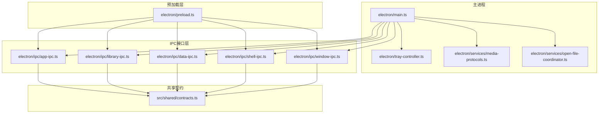
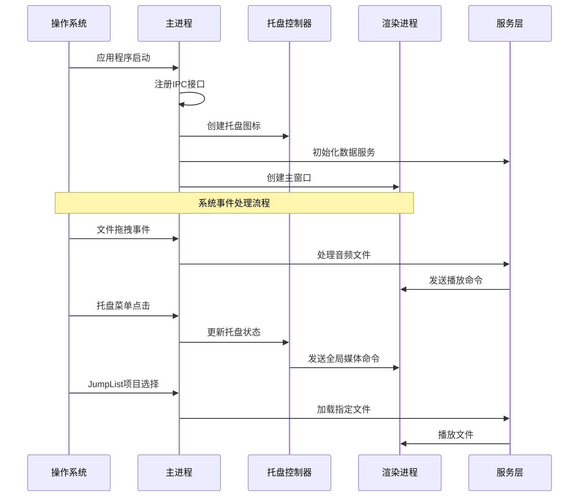
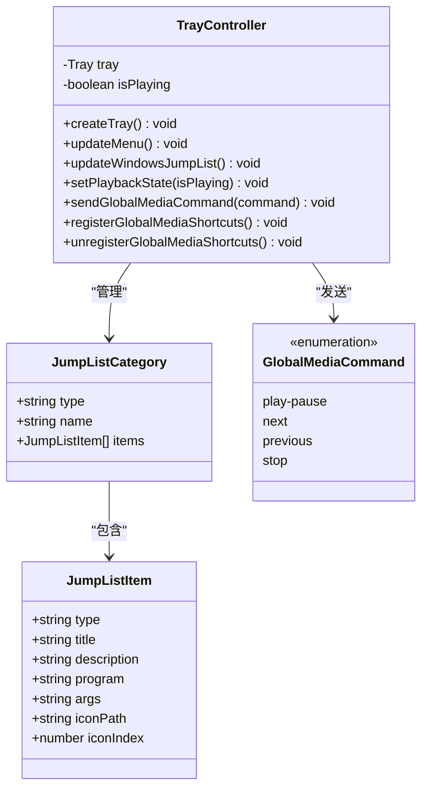
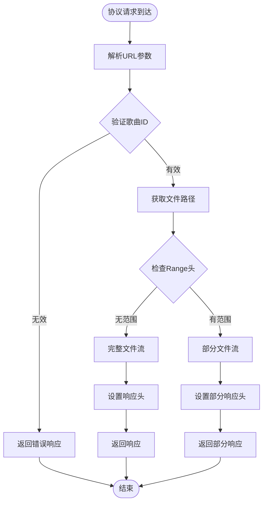
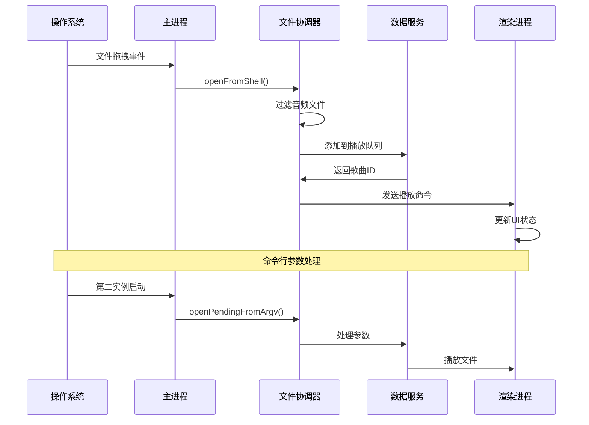
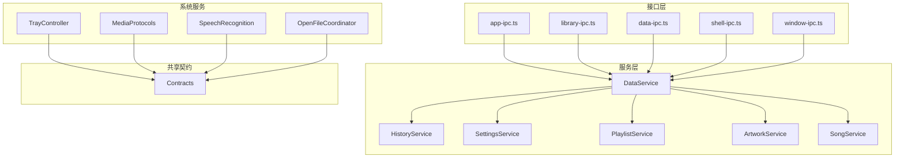

# 系统集成IPC接口

<cite>
**本文档引用的文件**
- [electron/main.ts](file://electron/main.ts)
- [electron/preload.ts](file://electron/preload.ts)
- [electron/tray-controller.ts](file://electron/tray-controller.ts)
- [electron/services/media-protocols.ts](file://electron/services/media-protocols.ts)
- [electron/services/open-file-coordinator.ts](file://electron/services/open-file-coordinator.ts)
- [electron/services/constants.ts](file://electron/services/constants.ts)
- [electron/services/windows-speech-recognition.ts](file://electron/services/windows-speech-recognition.ts)
- [electron/ipc/app-ipc.ts](file://electron/ipc/app-ipc.ts)
- [electron/ipc/library-ipc.ts](file://electron/ipc/library-ipc.ts)
- [electron/ipc/data-ipc.ts](file://electron/ipc/data-ipc.ts)
- [electron/ipc/shell-ipc.ts](file://electron/ipc/shell-ipc.ts)
- [electron/ipc/window-ipc.ts](file://electron/ipc/window-ipc.ts)
- [src/shared/contracts.ts](file://src/shared/contracts.ts)
</cite>

## 目录
1. [简介](#简介)
2. [项目结构](#项目结构)
3. [核心组件](#核心组件)
4. [架构概览](#架构概览)
5. [详细组件分析](#详细组件分析)
6. [依赖关系分析](#依赖关系分析)
7. [性能考虑](#性能考虑)
8. [故障排除指南](#故障排除指南)
9. [结论](#结论)

## 简介

SMPlayer的系统集成IPC接口是应用程序与操作系统深度集成的核心机制，负责处理文件关联、协议处理、系统托盘、JumpList等系统级功能。该接口通过Electron的IPC机制实现了跨进程通信，为用户提供无缝的系统集成体验。

本系统集成了多种Windows平台特性，包括文件扩展名关联、自定义协议注册、系统托盘菜单、JumpList项管理等。通过精心设计的IPC接口，应用程序能够响应系统事件、处理文件拖拽、管理系统托盘行为，并提供丰富的系统集成功能。

## 项目结构

SMPlayer的系统集成IPC接口采用模块化设计，主要分布在以下目录中：

**图表来源**
- [electron/main.ts:1-243](file://electron/main.ts#L1-L243)
- [electron/preload.ts:1-287](file://electron/preload.ts#L1-L287)

**章节来源**
- [electron/main.ts:1-243](file://electron/main.ts#L1-L243)
- [electron/preload.ts:1-287](file://electron/preload.ts#L1-L287)

## 核心组件

### 应用程序生命周期管理

应用程序通过单实例锁机制确保只有一个实例运行，并正确处理应用程序的启动、激活和退出流程。

### 系统托盘控制器

系统托盘控制器负责管理Windows任务栏托盘图标、上下文菜单和JumpList功能。它提供了播放状态指示、全局媒体快捷键支持和最近播放文件列表管理。

### 媒体协议处理器

媒体协议处理器实现了自定义URL方案（smplayer-media和smplayer-artwork），允许外部应用程序通过URL直接访问音乐文件和专辑封面。

### 文件打开协调器

文件打开协调器处理来自操作系统的文件拖拽和外部调用，将音频文件转换为可播放的歌曲ID并通知渲染进程。

**章节来源**
- [electron/main.ts:74-81](file://electron/main.ts#L74-L81)
- [electron/tray-controller.ts:28-51](file://electron/tray-controller.ts#L28-L51)
- [electron/services/media-protocols.ts:10-31](file://electron/services/media-protocols.ts#L10-L31)
- [electron/services/open-file-coordinator.ts:40-74](file://electron/services/open-file-coordinator.ts#L40-L74)

## 架构概览

SMPlayer的系统集成IPC接口采用分层架构设计，实现了清晰的职责分离和良好的可扩展性。

**图表来源**
- [electron/main.ts:141-219](file://electron/main.ts#L141-L219)
- [electron/tray-controller.ts:53-111](file://electron/tray-controller.ts#L53-L111)

## 详细组件分析

### 系统托盘集成

系统托盘控制器实现了完整的Windows托盘集成功能，包括：

#### 托盘菜单管理
- 显示/隐藏窗口切换
- 播放/暂停控制
- 上一首/下一首导航
- 快速播放功能
- 设置入口和退出选项

#### JumpList管理
- 最近播放文件列表
- 自定义任务分类
- 应用程序启动任务
- 条目数量限制（10个）

**图表来源**
- [electron/tray-controller.ts:28-160](file://electron/tray-controller.ts#L28-L160)

**章节来源**
- [electron/tray-controller.ts:122-160](file://electron/tray-controller.ts#L122-L160)
- [electron/tray-controller.ts:171-188](file://electron/tray-controller.ts#L171-L188)

### 媒体协议集成

媒体协议处理器实现了自定义URL方案，为外部应用程序提供统一的音乐文件访问接口。

#### 协议注册
- smplayer-media：用于访问音乐文件
- smplayer-artwork：用于访问专辑封面
- 支持HTTP范围请求
- 流式传输支持

#### URL格式规范
- smplayer-media://song/{songId}
- smplayer-artwork://song/{songId}

**图表来源**
- [electron/services/media-protocols.ts:34-87](file://electron/services/media-protocols.ts#L34-L87)

**章节来源**
- [electron/services/media-protocols.ts:10-31](file://electron/services/media-protocols.ts#L10-L31)
- [electron/services/media-protocols.ts:90-120](file://electron/services/media-protocols.ts#L90-L120)

### 文件关联处理

文件关联处理机制负责响应操作系统的文件打开请求和文件拖拽事件。

#### 音频文件过滤
支持的音频格式包括：
- AAC, AIFF, ALAC, APE, FLAC
- M4A, MP3, OGG, OPUS
- WAV, WMA等

#### 外部文件处理
- 处理来自文件管理器的拖拽
- 响应系统"打开方式"对话框
- 处理命令行参数传递

**图表来源**
- [electron/services/open-file-coordinator.ts:52-73](file://electron/services/open-file-coordinator.ts#L52-L73)
- [electron/main.ts:131-139](file://electron/main.ts#L131-L139)

**章节来源**
- [electron/services/open-file-coordinator.ts:76-81](file://electron/services/open-file-coordinator.ts#L76-L81)
- [electron/services/constants.ts:3-15](file://electron/services/constants.ts#L3-L15)

### Windows语音识别集成

Windows语音识别功能提供了语音控制能力，通过PowerShell脚本调用Windows语音识别API。

#### 语音识别流程
- PowerShell脚本执行
- Windows Runtime API调用
- 实时转录结果处理
- 识别状态监控

#### 错误处理
- 平台不支持检测
- 隐私权限要求
- 语音捕获失败
- 超时处理

**章节来源**
- [electron/services/windows-speech-recognition.ts:26-129](file://electron/services/windows-speech-recognition.ts#L26-L129)
- [electron/ipc/shell-ipc.ts:31-32](file://electron/ipc/shell-ipc.ts#L31-L32)

### IPC接口设计

SMPlayer实现了完整的IPC接口体系，每个模块都有专门的IPC处理函数。

#### 应用程序IPC
- 获取应用信息
- 处理待打开文件
- 设置托盘播放状态

#### 库管理IPC
- 歌曲查询和管理
- 播放列表操作
- 艺术作品管理
- 数据导入导出

#### 数据管理IPC
- 设置更新
- 历史记录管理
- 偏好设置
- 播放队列控制

#### Shell集成IPC
- 文件系统操作
- 系统通知
- 反馈功能
- 语音识别

#### 窗口控制IPC
- 窗口拖拽
- 全屏模式
- 迷你模式
- 标题栏覆盖

**章节来源**
- [electron/ipc/app-ipc.ts:10-26](file://electron/ipc/app-ipc.ts#L10-L26)
- [electron/ipc/library-ipc.ts:28-302](file://electron/ipc/library-ipc.ts#L28-L302)
- [electron/ipc/data-ipc.ts:20-151](file://electron/ipc/data-ipc.ts#L20-L151)
- [electron/ipc/shell-ipc.ts:20-67](file://electron/ipc/shell-ipc.ts#L20-L67)
- [electron/ipc/window-ipc.ts:16-58](file://electron/ipc/window-ipc.ts#L16-L58)

## 依赖关系分析

系统集成IPC接口的依赖关系体现了清晰的分层架构：

**图表来源**
- [electron/ipc/app-ipc.ts:1-26](file://electron/ipc/app-ipc.ts#L1-L26)
- [electron/ipc/library-ipc.ts:16-38](file://electron/ipc/library-ipc.ts#L16-L38)
- [electron/services/data-service.ts:39-145](file://electron/services/data-service.ts#L39-L145)

**章节来源**
- [electron/services/data-service.ts:39-145](file://electron/services/data-service.ts#L39-L145)
- [src/shared/contracts.ts:527-664](file://src/shared/contracts.ts#L527-L664)

## 性能考虑

### 内存管理
- 使用流式传输处理大文件
- 及时清理临时文件和缓存
- 合理使用数据库连接池

### 线程安全
- IPC调用在主线程中处理
- 异步操作避免阻塞UI
- 文件操作使用异步API

### 资源优化
- 图标尺寸适配不同DPI
- 跳表项目数量限制
- 音频文件路径缓存

## 故障排除指南

### 常见问题及解决方案

#### 托盘图标显示异常
- 检查图标文件路径
- 验证DPI适配设置
- 确认权限问题

#### JumpList项目不显示
- 验证打包状态
- 检查便携版环境变量
- 确认文件路径有效性

#### 媒体协议无法访问
- 检查协议注册状态
- 验证URL格式正确性
- 确认文件存在且可读

#### 语音识别失败
- 检查Windows版本支持
- 验证隐私设置
- 确认麦克风权限

**章节来源**
- [electron/tray-controller.ts:122-160](file://electron/tray-controller.ts#L122-L160)
- [electron/services/media-protocols.ts:10-31](file://electron/services/media-protocols.ts#L10-L31)
- [electron/services/windows-speech-recognition.ts:30-129](file://electron/services/windows-speech-recognition.ts#L30-L129)

## 结论

SMPlayer的系统集成IPC接口展现了现代桌面应用程序的最佳实践，通过精心设计的架构实现了与操作系统的深度集成。该接口体系具有以下特点：

### 技术优势
- **模块化设计**：清晰的职责分离和可扩展性
- **平台适配**：针对Windows平台的深度优化
- **性能优化**：流式传输和资源管理
- **错误处理**：完善的异常情况处理机制

### 功能完整性
- 支持完整的系统托盘功能
- 实现自定义协议处理
- 提供文件关联支持
- 集成语音识别功能

### 扩展性考虑
该接口体系为未来的功能扩展提供了良好的基础，可以轻松添加新的系统集成功能或支持其他操作系统平台。

通过本文档的详细分析，开发者可以更好地理解和使用SMPlayer的系统集成IPC接口，为构建高质量的桌面应用程序提供参考和指导。