# 远程IPC接口

<cite>
**本文档引用的文件**
- [remote-ipc.ts](file://electron/ipc/remote-ipc.ts)
- [remote-play-server.ts](file://electron/services/remote-play-server.ts)
- [remote-store.ts](file://electron/services/remote-store.ts)
- [contracts.ts](file://src/shared/contracts.ts)
- [preload.ts](file://electron/preload.ts)
- [main.ts](file://electron/main.ts)
- [RemoteLibraryPage.tsx](file://src/pages/RemoteLibraryPage.tsx)
- [RemoteShareDialog.tsx](file://src/components/RemoteShareDialog.tsx)
- [musicDataSource.ts](file://src/data/musicDataSource.ts)
</cite>

## 目录
1. [简介](#简介)
2. [项目结构](#项目结构)
3. [核心组件](#核心组件)
4. [架构概览](#架构概览)
5. [详细组件分析](#详细组件分析)
6. [依赖关系分析](#依赖关系分析)
7. [性能考虑](#性能考虑)
8. [故障排除指南](#故障排除指南)
9. [结论](#结论)

## 简介

SMPlayer的远程IPC接口是一个完整的音频流媒体系统，允许用户在局域网内通过HTTP协议共享音乐库和实时播放控制。该系统实现了以下核心功能：

- **远程播放服务器**：基于Node.js HTTP服务器的音频流服务
- **网络共享播放列表**：跨设备的音乐库同步和访问
- **实时播放状态同步**：多客户端间的播放状态保持一致
- **安全认证机制**：基于密码和令牌的身份验证系统
- **流媒体传输**：支持HTTP Range请求的音频文件分段传输

该接口采用Electron的IPC（Inter-Process Communication）机制，将主进程的服务与渲染进程的功能无缝集成，为用户提供透明的远程音乐体验。

## 项目结构

远程IPC接口的代码分布在多个层次中，形成了清晰的分层架构：

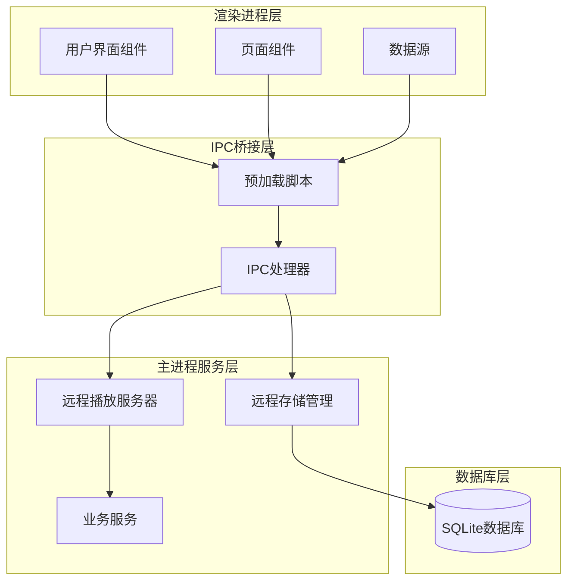

**图表来源**
- [main.ts:146-150](file://electron/main.ts#L146-L150)
- [preload.ts:45-284](file://electron/preload.ts#L45-L284)
- [remote-ipc.ts:19-54](file://electron/ipc/remote-ipc.ts#L19-L54)

**章节来源**
- [main.ts:141-203](file://electron/main.ts#L141-L203)
- [preload.ts:1-287](file://electron/preload.ts#L1-L287)

## 核心组件

### 远程播放服务器

远程播放服务器是整个系统的核心，负责处理所有HTTP请求和音频流传输：

- **HTTP服务器**：监听指定端口（默认8023），处理来自客户端的请求
- **认证系统**：基于密码验证和令牌管理的双重安全机制
- **音频流服务**：支持HTTP Range请求的分段音频传输
- **API接口**：提供设备信息、音乐库查询、播放状态等RESTful接口

### 远程存储管理

远程存储管理负责持久化存储所有远程相关配置和状态：

- **设备配置**：保存本地设备的共享设置和网络地址
- **授权设备**：管理已授权客户端设备的访问权限
- **远程主机**：跟踪已连接的远程音乐库主机
- **安全令牌**：存储和验证访问令牌

### IPC处理器

IPC处理器作为渲染进程和主进程之间的桥梁：

- **API暴露**：将主进程的服务方法暴露给渲染进程调用
- **参数验证**：确保传入参数的类型和格式正确
- **错误处理**：统一处理异步操作中的异常情况

**章节来源**
- [remote-play-server.ts:77-295](file://electron/services/remote-play-server.ts#L77-L295)
- [remote-store.ts:49-525](file://electron/services/remote-store.ts#L49-L525)
- [remote-ipc.ts:19-135](file://electron/ipc/remote-ipc.ts#L19-L135)

## 架构概览

远程IPC接口采用了典型的三层架构设计，每层都有明确的职责分工：

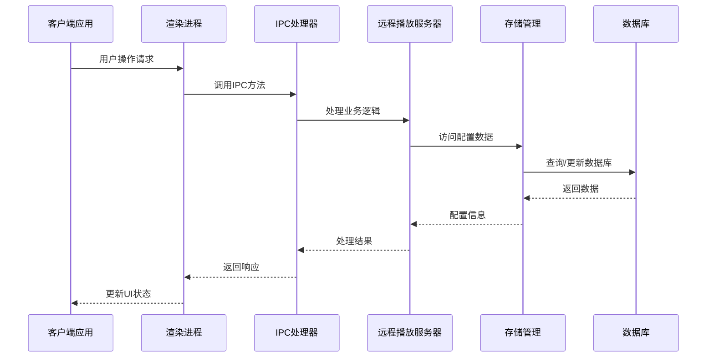

**图表来源**
- [main.ts:171-174](file://electron/main.ts#L171-L174)
- [preload.ts:108-118](file://electron/preload.ts#L108-L118)
- [remote-ipc.ts:22-53](file://electron/ipc/remote-ipc.ts#L22-L53)

### 数据流架构

系统内部的数据流遵循严格的单向原则，确保数据的一致性和可预测性：

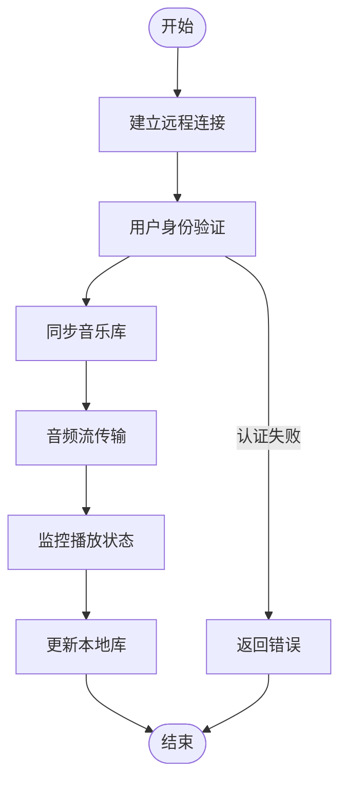

**图表来源**
- [remote-ipc.ts:71-111](file://electron/ipc/remote-ipc.ts#L71-L111)
- [remote-play-server.ts:218-255](file://electron/services/remote-play-server.ts#L218-L255)

## 详细组件分析

### 远程播放服务器实现

远程播放服务器是基于Node.js原生HTTP模块构建的轻量级Web服务器：

#### 服务器生命周期管理

服务器的启动和停止过程经过精心设计，确保资源的正确分配和释放：

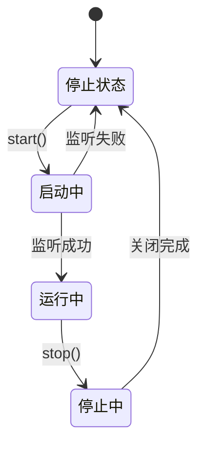

**图表来源**
- [remote-play-server.ts:104-147](file://electron/services/remote-play-server.ts#L104-L147)

#### HTTP请求处理流程

服务器支持多种HTTP方法和路径的组合，提供完整的RESTful API：

| 请求方法 | 路径 | 功能 | 认证要求 |
|---------|------|------|----------|
| GET | /api/server/info | 获取服务器信息 | 否 |
| POST | /api/auth/login | 用户登录认证 | 否 |
| GET | /api/library/counts | 获取音乐库统计 | 是 |
| GET | /api/library/songs | 获取歌曲列表 | 是 |
| GET | /api/library/playlists | 获取播放列表 | 是 |
| GET | /api/library/favorites | 获取收藏夹 | 是 |
| GET | /api/library/now-playing | 获取当前播放状态 | 是 |
| GET | /api/stream/{id} | 流式传输音频文件 | 是 |

**章节来源**
- [remote-play-server.ts:149-216](file://electron/services/remote-play-server.ts#L149-L216)

### 远程存储管理系统

远程存储管理器使用SQLite数据库来持久化所有远程相关数据：

#### 数据模型设计

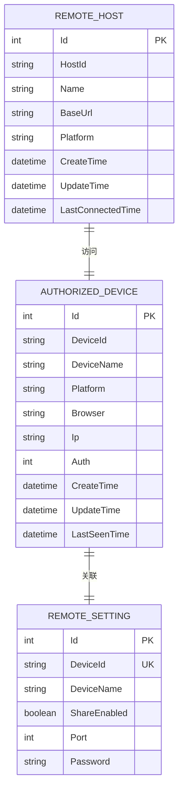

**图表来源**
- [remote-store.ts:13-47](file://electron/services/remote-store.ts#L13-L47)

#### 设备授权机制

系统实现了灵活的设备授权机制，支持动态添加、修改和删除授权设备：

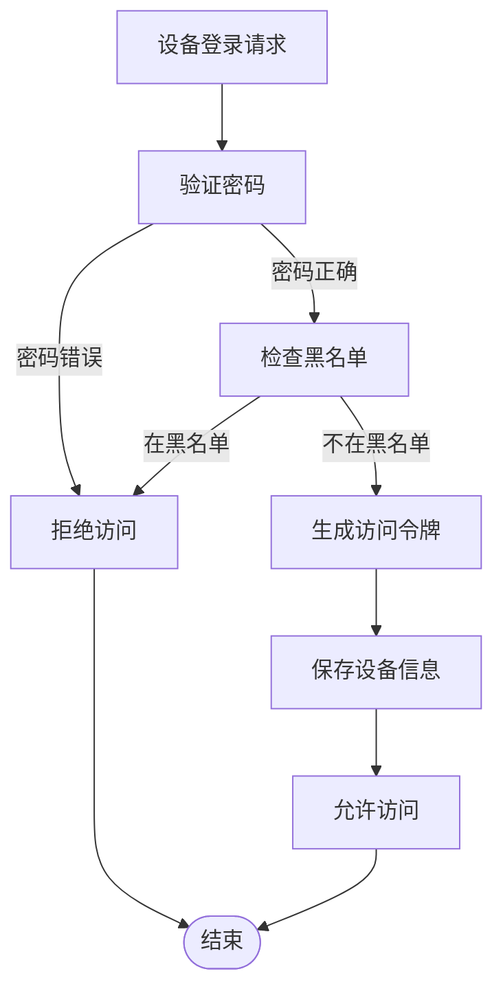

**图表来源**
- [remote-play-server.ts:218-255](file://electron/services/remote-play-server.ts#L218-L255)
- [remote-store.ts:302-375](file://electron/services/remote-store.ts#L302-L375)

**章节来源**
- [remote-store.ts:49-525](file://electron/services/remote-store.ts#L49-L525)

### IPC通信机制

IPC处理器提供了渲染进程和主进程之间的双向通信通道：

#### API方法映射

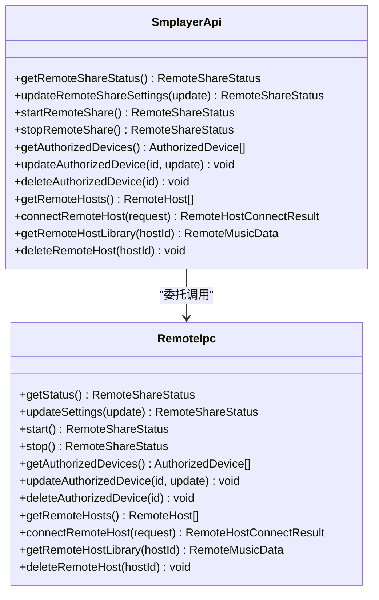

**图表来源**
- [contracts.ts:527-663](file://src/shared/contracts.ts#L527-L663)
- [remote-ipc.ts:19-54](file://electron/ipc/remote-ipc.ts#L19-L54)

#### 参数验证和错误处理

IPC处理器实现了严格的参数验证和错误处理机制：

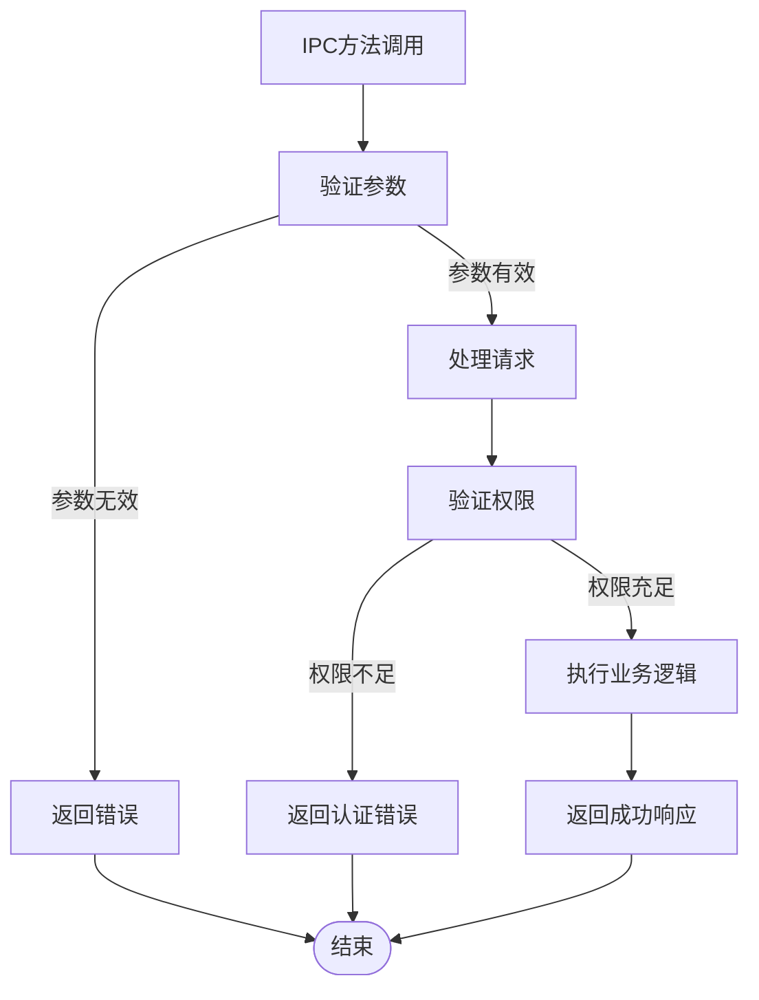

**图表来源**
- [remote-ipc.ts:22-53](file://electron/ipc/remote-ipc.ts#L22-L53)

**章节来源**
- [preload.ts:45-284](file://electron/preload.ts#L45-L284)
- [remote-ipc.ts:19-135](file://electron/ipc/remote-ipc.ts#L19-L135)

### 远程音乐数据源

远程音乐数据源为渲染进程提供了统一的音乐数据访问接口：

#### 数据转换和缓存

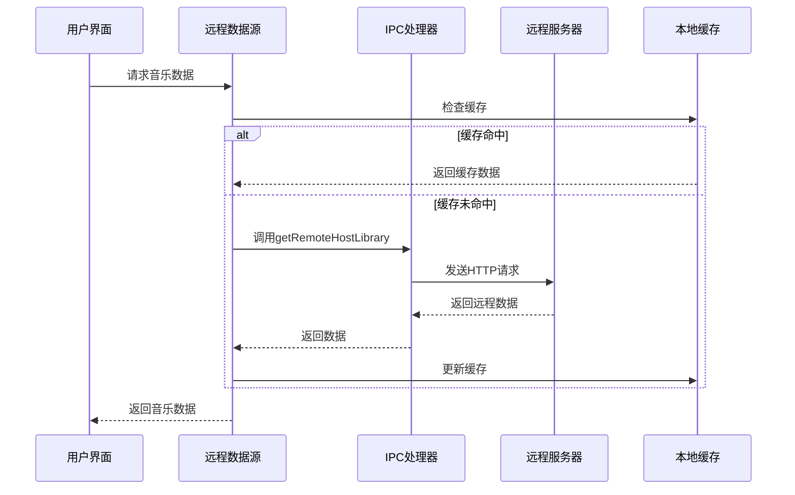

**图表来源**
- [musicDataSource.ts:205-285](file://src/data/musicDataSource.ts#L205-L285)

#### 远程数据映射

远程数据源实现了本地数据结构到远程数据的映射转换：

| 远程字段 | 本地字段 | 映射规则 |
|----------|----------|----------|
| hostId | id | 直接映射 |
| name | name | 直接映射 |
| baseUrl | baseUrl | 直接映射 |
| songs[].id | songs[].id | 负值映射 |
| playlists[].songIds | playlists[].songIds | ID映射 |
| favorites.songIds | favorites.songIds | ID映射 |
| nowPlaying.songIds | nowPlaying.songIds | ID映射 |

**章节来源**
- [musicDataSource.ts:205-285](file://src/data/musicDataSource.ts#L205-L285)

## 依赖关系分析

远程IPC接口的依赖关系清晰且层次分明：

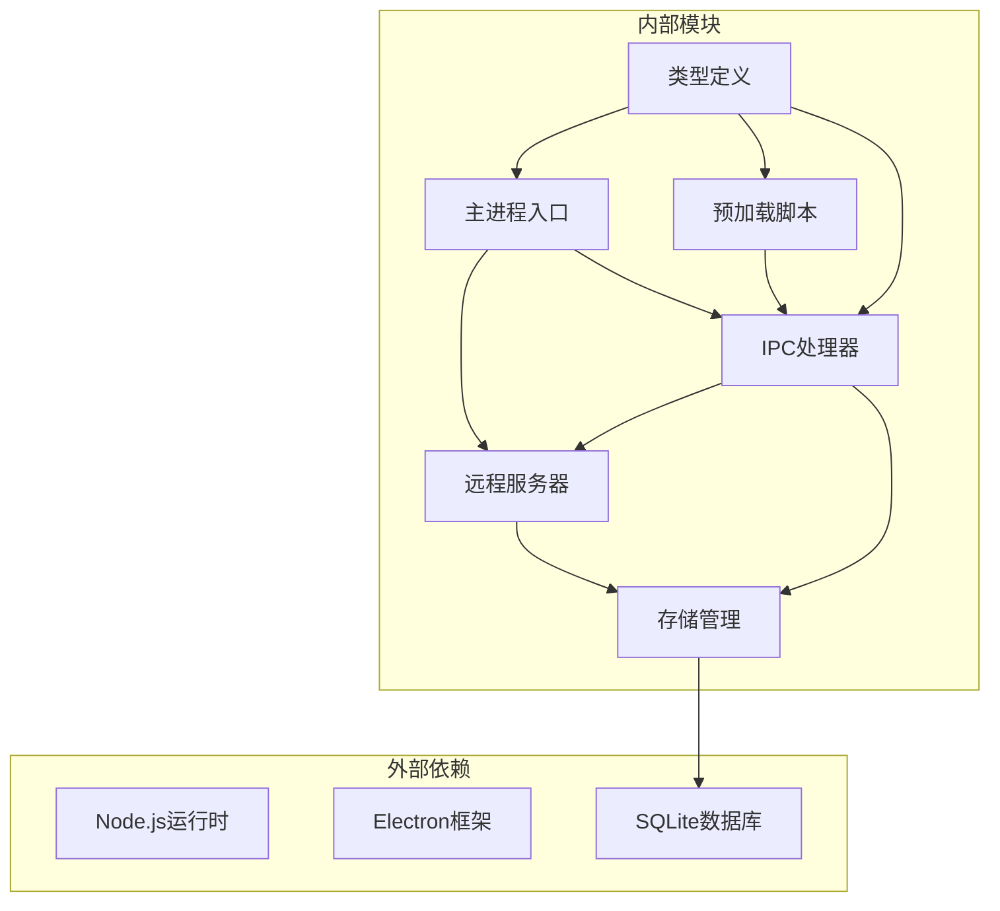

**图表来源**
- [main.ts:1-36](file://electron/main.ts#L1-L36)
- [preload.ts:1-3](file://electron/preload.ts#L1-L3)
- [remote-ipc.ts:1-12](file://electron/ipc/remote-ipc.ts#L1-L12)

### 循环依赖检测

系统设计避免了循环依赖问题：

- **主进程**不直接依赖渲染进程
- **IPC处理器**独立于具体业务逻辑
- **存储管理**提供抽象的数据访问接口
- **类型定义**位于共享模块中

**章节来源**
- [main.ts:141-203](file://electron/main.ts#L141-L203)
- [remote-store.ts:49-525](file://electron/services/remote-store.ts#L49-L525)

## 性能考虑

远程IPC接口在设计时充分考虑了性能优化：

### 并发处理

系统支持多客户端并发访问，通过以下机制保证性能：

- **异步I/O**：使用Promise和async/await处理异步操作
- **连接池**：合理管理HTTP连接和数据库连接
- **缓存策略**：本地缓存远程数据减少重复请求
- **流式传输**：音频文件采用流式传输避免内存占用

### 网络优化

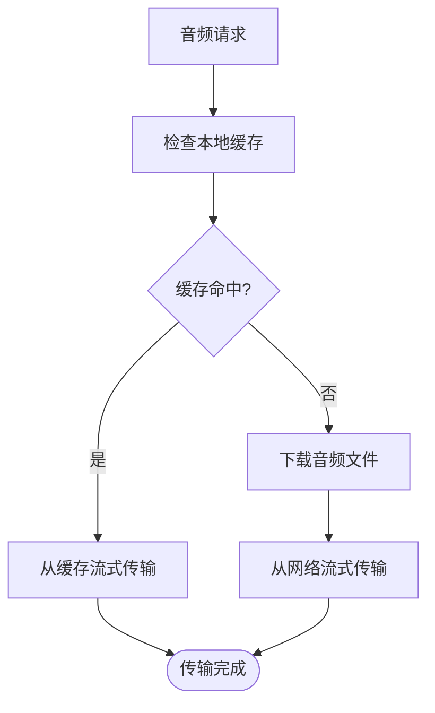

### 内存管理

系统采用渐进式内存管理策略：

- **分段传输**：支持HTTP Range请求实现分段下载
- **及时释放**：及时关闭不再使用的连接和文件句柄
- **垃圾回收**：利用JavaScript引擎的自动垃圾回收机制
- **资源监控**：定期监控内存使用情况

## 故障排除指南

### 常见问题诊断

#### 连接问题

**症状**：无法连接到远程服务器
**可能原因**：
- 端口被占用或防火墙阻止
- IP地址配置错误
- 网络连接不稳定

**解决步骤**：
1. 检查服务器端口是否正确开放
2. 验证IP地址格式是否正确
3. 确认网络连通性
4. 查看服务器日志获取详细错误信息

#### 认证失败

**症状**：登录请求被拒绝
**可能原因**：
- 密码错误
- 设备被加入黑名单
- 令牌过期

**解决步骤**：
1. 验证输入的密码是否正确
2. 检查设备授权状态
3. 重新生成访问令牌
4. 查看认证日志

#### 音频播放问题

**症状**：音频流传输中断或质量差
**可能原因**：
- 网络带宽不足
- HTTP Range请求不支持
- 文件路径错误

**解决步骤**：
1. 检查网络带宽和延迟
2. 验证服务器对Range请求的支持
3. 确认音频文件存在且可访问
4. 尝试降低音频质量设置

**章节来源**
- [remote-play-server.ts:218-255](file://electron/services/remote-play-server.ts#L218-L255)
- [remote-ipc.ts:71-111](file://electron/ipc/remote-ipc.ts#L71-L111)

### 日志记录和调试

系统提供了完善的日志记录机制：

- **服务器日志**：记录HTTP请求和响应详情
- **认证日志**：跟踪用户登录和权限变更
- **错误日志**：捕获和记录异常情况
- **性能日志**：监控系统性能指标

## 结论

SMPlayer的远程IPC接口是一个设计精良的分布式音频服务系统。它通过清晰的分层架构、严格的类型安全和完善的错误处理机制，为用户提供了稳定可靠的远程音乐体验。

### 主要优势

1. **架构清晰**：分层设计使得代码易于维护和扩展
2. **类型安全**：完整的TypeScript类型定义确保编译时安全
3. **性能优化**：流式传输和缓存机制提升用户体验
4. **安全性强**：多重认证机制保护用户数据安全
5. **可扩展性**：模块化设计便于功能扩展和定制

### 技术亮点

- **Electron IPC集成**：完美结合了桌面应用和Web技术的优势
- **HTTP流媒体**：基于标准协议的音频传输解决方案
- **SQLite持久化**：轻量级数据库提供可靠的数据存储
- **响应式设计**：适配不同设备和屏幕尺寸的用户界面

该系统为构建类似功能的应用程序提供了优秀的参考模板，展示了如何在现代Web技术栈中实现复杂的IPC通信和数据同步需求。