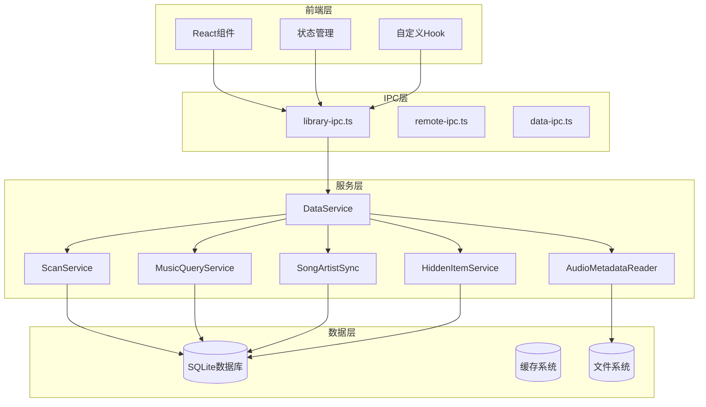
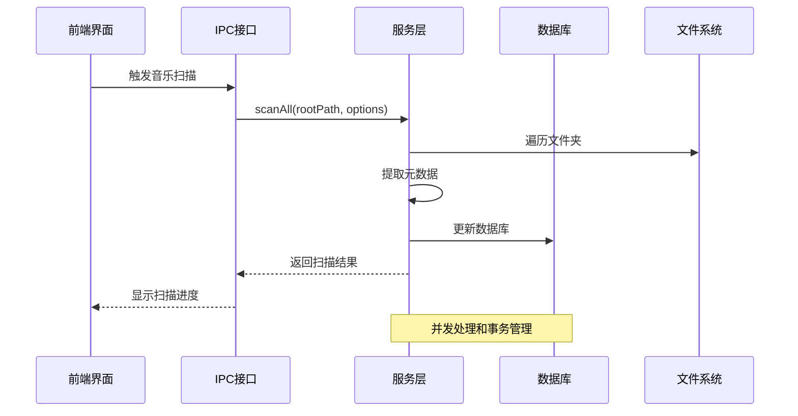
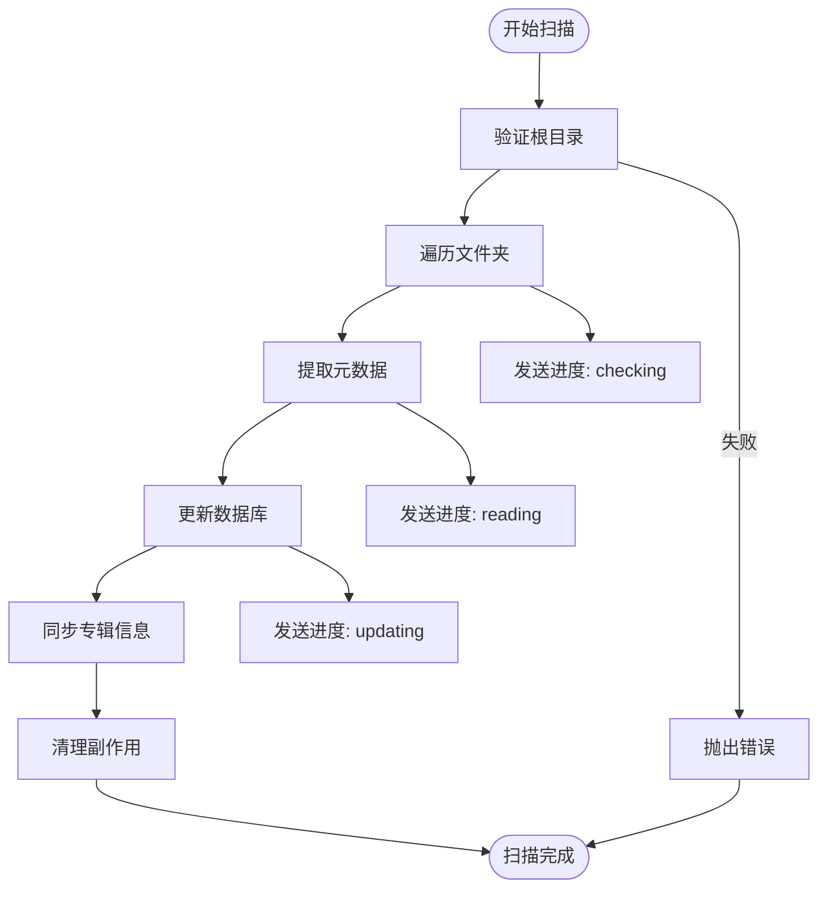
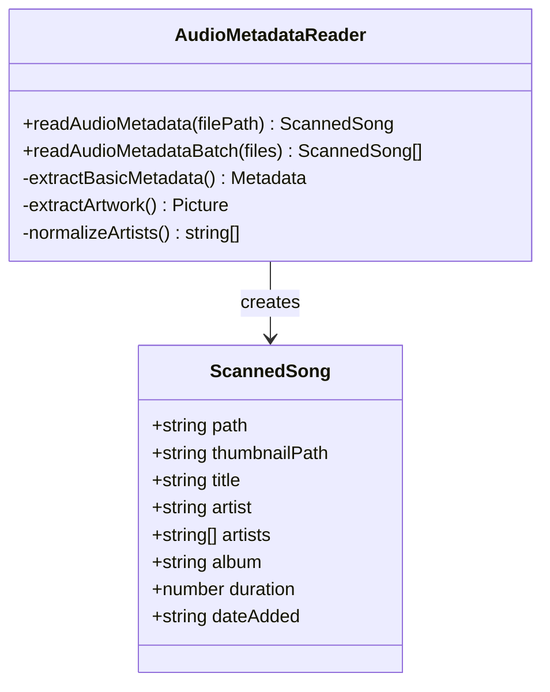
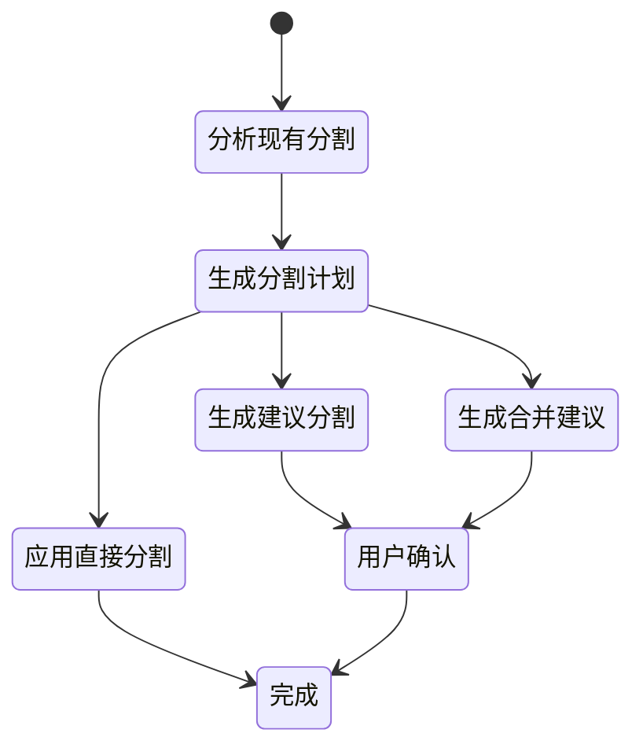
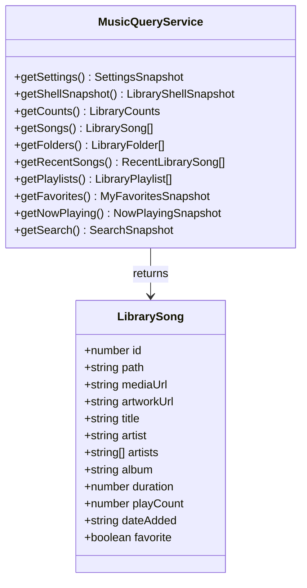
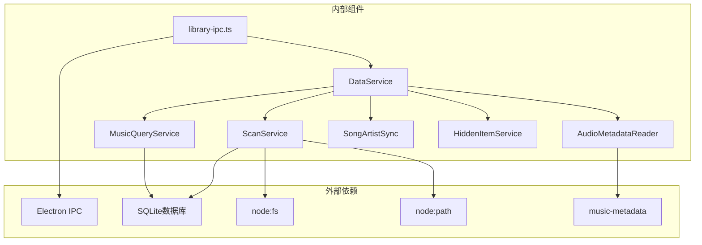

# 音乐库IPC接口

<cite>
**本文档引用的文件**
- [library-ipc.ts](file://electron/ipc/library-ipc.ts)
- [scan-service.ts](file://electron/services/scan-service.ts)
- [music-query-service.ts](file://electron/services/music-query-service.ts)
- [audio-metadata-reader.ts](file://electron/services/audio-metadata-reader.ts)
- [song-artist-sync.ts](file://electron/services/song-artist-sync.ts)
- [hidden-item-service.ts](file://electron/services/hidden-item-service.ts)
- [data-service.ts](file://electron/services/data-service.ts)
- [contracts.ts](file://src/shared/contracts.ts)
- [useLibraryStore.ts](file://src/state/useLibraryStore.ts)
</cite>

## 目录
1. [简介](#简介)
2. [项目结构](#项目结构)
3. [核心组件](#核心组件)
4. [架构概览](#架构概览)
5. [详细组件分析](#详细组件分析)
6. [依赖关系分析](#依赖关系分析)
7. [性能考虑](#性能考虑)
8. [故障排除指南](#故障排除指南)
9. [结论](#结论)

## 简介

SMPlayer的音乐库IPC接口是应用程序中负责音乐库管理和数据交换的核心模块。该接口实现了完整的音乐库生命周期管理，包括音乐扫描、元数据提取、歌手分割、隐藏项目管理等功能。通过Electron的IPC机制，前端界面能够与后端服务进行高效的数据交换，实现复杂的音乐数据操作。

该系统采用分层架构设计，将音乐库管理功能分解为多个专门的服务组件，每个组件负责特定的功能领域，通过清晰的接口进行交互。系统支持批量处理、并发控制、状态同步等高级特性，确保在处理大量音乐文件时的性能和可靠性。

## 项目结构

音乐库IPC接口位于Electron主进程的IPC层，与服务层和数据层形成清晰的分层架构：



**图表来源**
- [library-ipc.ts:28-302](file://electron/ipc/library-ipc.ts#L28-L302)
- [data-service.ts:39-145](file://electron/services/data-service.ts#L39-L145)

**章节来源**
- [library-ipc.ts:1-370](file://electron/ipc/library-ipc.ts#L1-L370)
- [data-service.ts:1-198](file://electron/services/data-service.ts#L1-L198)

## 核心组件

### IPC接口注册器

library-ipc.ts提供了统一的IPC接口注册功能，通过registerLibraryIpc函数初始化所有音乐库相关的IPC处理器。该函数接收一个配置对象，包含窗口获取器、服务实例获取器、冲突解决器等依赖项。

### 扫描服务

ScanService是音乐库扫描的核心组件，负责遍历音乐文件夹、提取元数据、更新数据库状态。它支持增量扫描和全量扫描两种模式，并提供详细的进度报告。

### 查询服务

MusicQueryService提供音乐库数据查询功能，包括歌曲列表、专辑信息、艺术家数据等。它使用预编译的SQL语句确保查询性能，并提供多种排序和过滤选项。

### 元数据读取器

AudioMetadataReader使用music-metadata库解析音频文件的元数据，支持多种音频格式。它实现了并发处理以提高扫描效率，并提供缓存机制减少重复读取。

### 艺术家同步器

SongArtistSync负责管理歌曲与艺术家之间的多对多关系，支持智能的多艺术家识别和分割功能。

### 隐藏项目服务

HiddenItemService管理用户隐藏的音乐文件夹和文件，提供隐藏状态的持久化和恢复功能。

**章节来源**
- [library-ipc.ts:28-302](file://electron/ipc/library-ipc.ts#L28-L302)
- [scan-service.ts:65-129](file://electron/services/scan-service.ts#L65-L129)
- [music-query-service.ts:50-165](file://electron/services/music-query-service.ts#L50-L165)
- [audio-metadata-reader.ts:13-29](file://electron/services/audio-metadata-reader.ts#L13-L29)
- [song-artist-sync.ts:7-38](file://electron/services/song-artist-sync.ts#L7-L38)
- [hidden-item-service.ts:6-120](file://electron/services/hidden-item-service.ts#L6-L120)

## 架构概览

音乐库IPC接口采用事件驱动的架构模式，通过Electron的ipcMain.handle方法注册异步处理器。系统支持操作取消、进度报告、错误处理等高级特性。



**图表来源**
- [library-ipc.ts:205-224](file://electron/ipc/library-ipc.ts#L205-L224)
- [scan-service.ts:131-306](file://electron/services/scan-service.ts#L131-L306)

**章节来源**
- [library-ipc.ts:205-250](file://electron/ipc/library-ipc.ts#L205-L250)
- [scan-service.ts:131-173](file://electron/services/scan-service.ts#L131-L173)

## 详细组件分析

### 音乐扫描流程

音乐扫描是系统最复杂的功能之一，涉及文件系统遍历、元数据提取、数据库更新等多个步骤：



**图表来源**
- [scan-service.ts:131-306](file://electron/services/scan-service.ts#L131-L306)
- [scan-service.ts:366-579](file://electron/services/scan-service.ts#L366-L579)

#### 扫描进度管理

系统实现了三层进度报告机制：
1. **检查阶段**: 统计需要扫描的文件夹数量
2. **读取阶段**: 提取音频文件的元数据
3. **更新阶段**: 将数据写入数据库

每个阶段都提供详细的统计信息，包括已处理数量、总数量、新增、更新、删除的文件数量。

#### 并发控制

扫描服务使用6个并发工作线程处理元数据提取，平衡了处理速度和系统资源占用。同时支持操作取消功能，通过operationId实现精确的取消控制。

**章节来源**
- [scan-service.ts:14-16](file://electron/services/scan-service.ts#L14-L16)
- [scan-service.ts:153-173](file://electron/services/scan-service.ts#L153-L173)
- [scan-service.ts:194-216](file://electron/services/scan-service.ts#L194-L216)

### 元数据提取机制

AudioMetadataReader使用music-metadata库解析各种音频格式的标签信息。系统支持以下元数据字段：

- **基础信息**: 标题、艺术家、专辑、时长
- **技术信息**: 比特率、文件大小、创建时间
- **封面艺术**: 内嵌封面、系统缩略图
- **播放统计**: 播放次数、最近播放时间



**图表来源**
- [audio-metadata-reader.ts:13-29](file://electron/services/audio-metadata-reader.ts#L13-L29)
- [audio-metadata-reader.ts:31-74](file://electron/services/audio-metadata-reader.ts#L31-L74)

**章节来源**
- [audio-metadata-reader.ts:31-105](file://electron/services/audio-metadata-reader.ts#L31-L105)

### 歌手分割功能

智能多艺术家识别是系统的重要特性，能够自动检测和分割包含多个艺术家的作品：



**图表来源**
- [scan-service.ts:320-353](file://electron/services/scan-service.ts#L320-L353)
- [song-artist-sync.ts:26-37](file://electron/services/song-artist-sync.ts#L26-L37)

系统使用正则表达式模式识别艺术家分隔符，支持多种语言和格式。分割决策基于艺术家出现频率、名称相似度等因素综合判断。

**章节来源**
- [scan-service.ts:320-353](file://electron/services/scan-service.ts#L320-L353)
- [song-artist-sync.ts:26-37](file://electron/services/song-artist-sync.ts#L26-L37)

### 隐藏项目管理

HiddenItemService提供完整的隐藏项目管理系统，支持文件夹和文件级别的隐藏控制：

```mermaid
erDiagram
HiddenStorageItem {
int id PK
string type
string path
enum state
}
Folder {
int id PK
string path
enum state
}
File {
int id PK
string path
enum state
}
Music {
int id PK
string path
enum state
}
HiddenStorageItem }o|--|| Folder : "隐藏文件夹"
HiddenStorageItem }o|--|| File : "隐藏文件"
Folder ||--o{ Music : "包含音乐"
```

**图表来源**
- [hidden-item-service.ts:105-160](file://electron/services/hidden-item-service.ts#L105-L160)

**章节来源**
- [hidden-item-service.ts:13-69](file://electron/services/hidden-item-service.ts#L13-L69)
- [hidden-item-service.ts:105-160](file://electron/services/hidden-item-service.ts#L105-L160)

### 数据查询服务

MusicQueryService提供高效的音乐库数据访问接口，使用预编译SQL语句优化查询性能：



**图表来源**
- [music-query-service.ts:50-165](file://electron/services/music-query-service.ts#L50-L165)
- [music-query-service.ts:324-349](file://electron/services/music-query-service.ts#L324-L349)

**章节来源**
- [music-query-service.ts:167-288](file://electron/services/music-query-service.ts#L167-L288)

## 依赖关系分析

音乐库IPC接口的依赖关系呈现清晰的层次结构：



**图表来源**
- [library-ipc.ts:1-13](file://electron/ipc/library-ipc.ts#L1-L13)
- [data-service.ts:1-22](file://electron/services/data-service.ts#L1-L22)

**章节来源**
- [library-ipc.ts:1-13](file://electron/ipc/library-ipc.ts#L1-L13)
- [data-service.ts:1-22](file://electron/services/data-service.ts#L1-L22)

## 性能考虑

### 并发处理策略

系统采用多层并发控制机制：

1. **元数据提取并发**: 使用6个工作线程并行处理音频文件元数据
2. **数据库事务**: 批量操作使用事务确保数据一致性
3. **异步I/O**: 文件系统操作采用异步模式避免阻塞

### 缓存机制

- **缩略图缓存**: 音频文件内嵌封面和系统缩略图缓存
- **数据库连接池**: 复用数据库连接减少开销
- **查询结果缓存**: 频繁访问的数据进行内存缓存

### 内存管理

- **流式处理**: 大文件处理采用流式方式减少内存占用
- **垃圾回收**: 及时释放不再使用的对象引用
- **背压控制**: 进度报告采用背压机制防止内存溢出

## 故障排除指南

### 常见问题及解决方案

**扫描无法启动**
- 检查音乐库根目录设置
- 验证磁盘空间和权限
- 查看系统日志获取详细错误信息

**扫描进度停滞**
- 检查网络连接（歌词自动获取）
- 监控磁盘I/O性能
- 确认没有其他程序占用磁盘

**元数据提取失败**
- 验证音频文件完整性
- 检查文件编码格式
- 更新music-metadata库版本

**数据库锁定错误**
- 确保只有一个实例运行
- 检查长时间运行的查询
- 重启应用清理数据库连接

### 错误处理策略

系统实现了多层次的错误处理机制：

1. **操作级错误**: 单个操作失败不影响整体系统
2. **事务回滚**: 数据库操作失败自动回滚
3. **状态恢复**: 系统异常后自动恢复到一致状态
4. **用户通知**: 重要错误向用户显示友好提示

**章节来源**
- [scan-service.ts:135-142](file://electron/services/scan-service.ts#L135-L142)
- [audio-metadata-reader.ts:61-74](file://electron/services/audio-metadata-reader.ts#L61-L74)

## 结论

SMPlayer的音乐库IPC接口展现了现代桌面应用的优秀架构实践。通过清晰的分层设计、完善的错误处理、高效的并发控制，系统能够稳定处理大规模音乐库数据。

关键优势包括：
- **模块化设计**: 各组件职责明确，易于维护和扩展
- **高性能处理**: 并发控制和缓存机制确保响应速度
- **用户体验**: 详细的进度反馈和操作取消功能
- **数据安全**: 事务处理和备份机制保障数据完整性

该接口为音乐库管理提供了坚实的技术基础，支持未来功能扩展和性能优化需求。