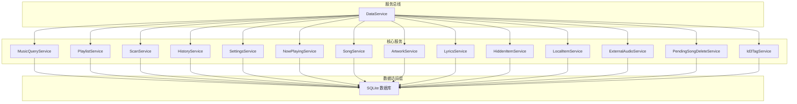
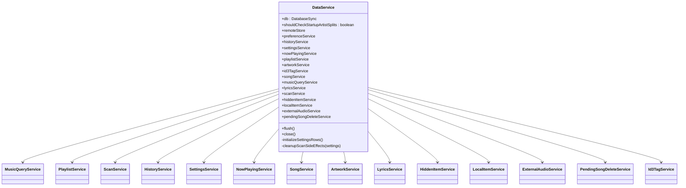
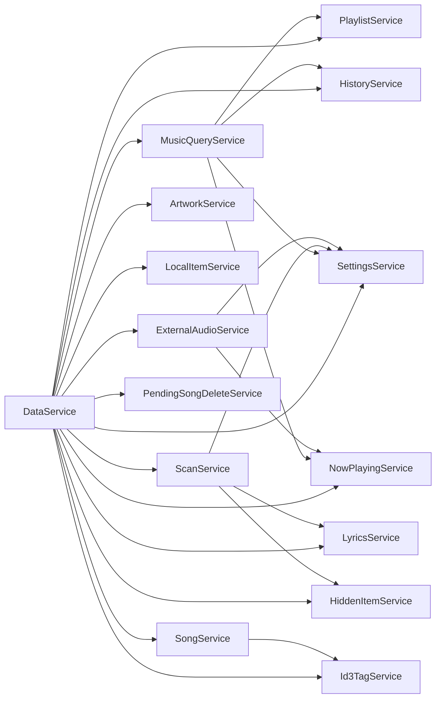

# 主进程服务模块

<cite>
**本文档引用的文件**
- [data-service.ts](file://electron/services/data-service.ts)
- [music-query-service.ts](file://electron/services/music-query-service.ts)
- [playlist-service.ts](file://electron/services/playlist-service.ts)
- [scan-service.ts](file://electron/services/scan-service.ts)
- [history-service.ts](file://electron/services/history-service.ts)
- [settings-service.ts](file://electron/services/settings-service.ts)
- [now-playing-service.ts](file://electron/services/now-playing-service.ts)
- [song-service.ts](file://electron/services/song-service.ts)
- [artwork-service.ts](file://electron/services/artwork-service.ts)
- [lyrics-service.ts](file://electron/services/lyrics-service.ts)
- [hidden-item-service.ts](file://electron/services/hidden-item-service.ts)
- [local-item-service.ts](file://electron/services/local-item-service.ts)
- [external-audio-service.ts](file://electron/services/external-audio-service.ts)
- [pending-song-delete-service.ts](file://electron/services/pending-song-delete-service.ts)
- [id3-tag-service.ts](file://electron/services/id3-tag-service.ts)
</cite>

## 目录
1. [简介](#简介)
2. [项目结构](#项目结构)
3. [核心组件](#核心组件)
4. [架构总览](#架构总览)
5. [详细组件分析](#详细组件分析)
6. [依赖关系分析](#依赖关系分析)
7. [性能考虑](#性能考虑)
8. [故障排除指南](#故障排除指南)
9. [结论](#结论)
10. [附录](#附录)

## 简介
本文件系统性梳理 SMPlayer 主进程服务模块，重点围绕 DataService 作为“服务总线”的核心地位，逐项解析各服务模块的职责边界、实现原理与协作关系。内容涵盖音乐查询、播放列表、扫描、历史记录、设置、正在播放、歌曲、艺术作品、歌词、隐藏项目、本地项目、外部音频、待删除歌曲等服务，并给出扩展与自定义指导、性能优化建议与错误处理策略。

## 项目结构
主进程服务位于 electron/services 目录，采用“按功能域分层”的组织方式：每个服务封装独立的数据访问与业务逻辑，通过 DataService 统一装配与初始化，形成清晰的依赖注入与控制反转结构。

图表来源
- [data-service.ts:39-145](file://electron/services/data-service.ts#L39-L145)
- [music-query-service.ts:50-165](file://electron/services/music-query-service.ts#L50-L165)
- [playlist-service.ts:9-145](file://electron/services/playlist-service.ts#L9-L145)
- [scan-service.ts:65-129](file://electron/services/scan-service.ts#L65-L129)
- [history-service.ts:30-182](file://electron/services/history-service.ts#L30-L182)
- [settings-service.ts:61-179](file://electron/services/settings-service.ts#L61-L179)
- [now-playing-service.ts:6-24](file://electron/services/now-playing-service.ts#L6-L24)
- [song-service.ts:17-56](file://electron/services/song-service.ts#L17-L56)
- [artwork-service.ts:25-34](file://electron/services/artwork-service.ts#L25-L34)
- [lyrics-service.ts:32-48](file://electron/services/lyrics-service.ts#L32-L48)
- [hidden-item-service.ts:6-11](file://electron/services/hidden-item-service.ts#L6-L11)
- [local-item-service.ts:22-41](file://electron/services/local-item-service.ts#L22-L41)
- [external-audio-service.ts:14-54](file://electron/services/external-audio-service.ts#L14-L54)
- [pending-song-delete-service.ts:36-47](file://electron/services/pending-song-delete-service.ts#L36-L47)
- [id3-tag-service.ts:4-55](file://electron/services/id3-tag-service.ts#L4-L55)

章节来源
- [data-service.ts:39-198](file://electron/services/data-service.ts#L39-L198)

## 核心组件
- DataService（服务总线）
  - 职责：负责数据库连接、模式初始化、服务实例化与装配、启动时清理与校正、提供统一的数据库事务与语句缓存。
  - 关键点：延迟初始化各子服务；在构造函数中完成所有服务的依赖注入；提供 flush/close 生命周期管理；在初始化阶段创建内置播放列表并校正播放状态。
- MusicQueryService（音乐查询服务）
  - 职责：聚合库统计、歌曲、播放列表、收藏、最近播放、搜索快照等数据，负责 SQL 查询与结果映射。
- PlaylistService（播放列表服务）
  - 职责：播放列表 CRUD、排序、歌曲增删、内置/自定义列表管理、优先级重排、失效条目清理。
- ScanService（扫描服务）
  - 职责：全量/增量扫描、目录遍历、元数据读取、艺术家拆分/合并、专辑同步、缩略图缓存维护、副作用清理。
- HistoryService（历史记录服务）
  - 职责：搜索历史、最近播放（歌单/专辑/艺人）、播放计数更新、最近记录清理。
- SettingsService（设置服务）
  - 职责：应用设置、视图状态、播放状态持久化，提供设置快照与值映射。
- NowPlayingService（正在播放服务）
  - 职责：当前播放队列的持久化与恢复（基于 JSON 文件），支持从队列或播放列表回退。
- SongService（歌曲服务）
  - 职责：歌曲属性读取与更新、播放计数、时长修正、艺术家同步、文件路径解析。
- ArtworkService（艺术作品服务）
  - 职责：封面读取/写入、嵌入式封面提取、缩略图缓存、相册批量封面设置/删除。
- LyricsService（歌词服务）
  - 职责：歌词来源选择（本地/嵌入/网络）、侧车文件解析、歌词写入、网络歌词抓取与清洗。
- HiddenItemService（隐藏项目服务）
  - 职责：隐藏文件/文件夹与数据库状态双向同步、层级隐藏传播。
- LocalItemService（本地项目服务）
  - 职责：本地文件移动/重命名/删除、冲突处理、删除状态捕获与恢复、文件夹排序。
- ExternalAudioService（外部音频服务）
  - 职责：外部音频文件导入到播放队列、元数据批量读取、插入当前播放位置。
- PendingSongDeleteService（待删除歌曲服务）
  - 职责：软删除记录、撤销/提交删除、垃圾箱处理、持久化存储。
- Id3TagService（ID3 标签服务）
  - 职责：MP3 标签写入（标题/艺人/专辑/歌词/封面等）。

章节来源
- [data-service.ts:39-198](file://electron/services/data-service.ts#L39-L198)
- [music-query-service.ts:50-418](file://electron/services/music-query-service.ts#L50-L418)
- [playlist-service.ts:9-508](file://electron/services/playlist-service.ts#L9-L508)
- [scan-service.ts:65-800](file://electron/services/scan-service.ts#L65-L800)
- [history-service.ts:30-484](file://electron/services/history-service.ts#L30-L484)
- [settings-service.ts:61-577](file://electron/services/settings-service.ts#L61-L577)
- [now-playing-service.ts:6-104](file://electron/services/now-playing-service.ts#L6-L104)
- [song-service.ts:17-297](file://electron/services/song-service.ts#L17-L297)
- [artwork-service.ts:25-340](file://electron/services/artwork-service.ts#L25-L340)
- [lyrics-service.ts:32-572](file://electron/services/lyrics-service.ts#L32-L572)
- [hidden-item-service.ts:6-260](file://electron/services/hidden-item-service.ts#L6-L260)
- [local-item-service.ts:22-347](file://electron/services/local-item-service.ts#L22-L347)
- [external-audio-service.ts:14-121](file://electron/services/external-audio-service.ts#L14-L121)
- [pending-song-delete-service.ts:36-179](file://electron/services/pending-song-delete-service.ts#L36-L179)
- [id3-tag-service.ts:4-237](file://electron/services/id3-tag-service.ts#L4-L237)

## 架构总览
DataService 是整个服务系统的装配中心，负责：
- 初始化 SQLite 数据库与表结构；
- 实例化各子服务并注入依赖；
- 提供统一的数据库事务与 SQL 预编译语句；
- 启动时执行播放状态校正与内置播放列表创建；
- 暴露 flush/close 生命周期方法。

图表来源
- [data-service.ts:39-198](file://electron/services/data-service.ts#L39-L198)

## 详细组件分析

### DataService（服务总线）
- 构造函数参数与初始化流程
  - 接收用户数据目录路径，创建 SQLite 连接并判断 Music 表是否存在以决定是否检查启动时的艺术家拆分。
  - 执行数据库模式初始化，随后依次实例化各服务并注入依赖。
  - 预编译若干常用 SQL 语句用于播放状态恢复与内置播放列表查询。
  - 初始化设置行并创建“我的最爱”内置播放列表。
- 启动时清理与校正
  - 清理无效播放列表项与最近播放记录；
  - 校正 LastPlaylist 与播放进度 LastMusicIndex/MusicProgress，确保恢复播放时的合理性。
- 生命周期
  - flush：触发 WAL checkpoint；
  - close：先 flush 再关闭数据库连接。

章节来源
- [data-service.ts:64-198](file://electron/services/data-service.ts#L64-L198)

### MusicQueryService（音乐查询服务）
- 公共接口
  - getSettings/getShellSnapshot：返回设置快照与库壳快照（包含统计、播放列表、收藏、正在播放、搜索）。
  - getSongs/getFolders/getRecentSongs/getPlaylists/getFavorites/getNowPlaying/getSearch：聚合查询与映射。
- 数据访问模式
  - 使用预编译语句进行高效查询；
  - 通过 row-mappers 将数据库行映射为前端契约对象；
  - 支持多表关联与 EXISTS 子查询判断是否为收藏。
- 复杂度与性能
  - 查询集中在单次事务内，避免重复连接开销；
  - 对艺术家与播放列表项使用 Map 聚合，降低二次查询成本。

章节来源
- [music-query-service.ts:50-418](file://electron/services/music-query-service.ts#L50-L418)

### PlaylistService（播放列表服务）
- 功能要点
  - 内置播放列表（我的最爱、正在播放）与自定义播放列表分离管理；
  - 创建/删除/重命名/恢复播放列表；
  - 添加/移除歌曲、重排歌曲顺序；
  - 重排播放列表顺序与优先级；
  - 清理失效播放列表项（目标歌曲或播放列表不存在时）。
- 数据访问模式
  - 使用事务包裹批量操作；
  - 通过 ON CONFLICT/UPDATE/INSERT 实现 UPSERT；
  - 使用 WITH 子句与有序插入保证顺序一致性。

章节来源
- [playlist-service.ts:9-508](file://electron/services/playlist-service.ts#L9-L508)

### ScanService（扫描服务）
- 功能要点
  - 全量扫描与增量扫描（文件夹级别）；
  - 目录遍历、隐藏项过滤、元数据批量读取；
  - 智能多艺人识别与拆分/合并建议；
  - 缩略图缓存写入与过期清理；
  - 扫描后副作用清理（播放列表/最近播放无效项）。
- 并发与性能
  - 元数据读取并发度可控（常量配置）；
  - 事务包裹写入，失败回滚；
  - 异步后台任务（如缩略图清理）不阻塞 IPC 返回。
- 错误处理
  - 提供取消信号与进度回调；
  - 扫描异常时回滚事务并抛出错误。

章节来源
- [scan-service.ts:65-800](file://electron/services/scan-service.ts#L65-L800)

### HistoryService（历史记录服务）
- 功能要点
  - 搜索历史保存、去重、清空；
  - 歌曲播放计数更新、最近播放记录写入；
  - 最近播放（歌单/专辑/艺人）查询；
  - 最近播放记录清理与失效项修复。
- 数据访问模式
  - 使用事务保证搜索历史与最近播放的一致性；
  - 通过 RecentRecord 类型区分不同记录类别。

章节来源
- [history-service.ts:30-484](file://electron/services/history-service.ts#L30-L484)

### SettingsService（设置服务）
- 功能要点
  - 应用设置、视图状态、播放状态持久化；
  - 设置快照转换与枚举值映射；
  - 默认值填充与初始化校验。
- 数据访问模式
  - 单行设置表，使用预编译语句读取/更新；
  - 值映射函数集中管理枚举转换。

章节来源
- [settings-service.ts:61-577](file://electron/services/settings-service.ts#L61-L577)

### NowPlayingService（正在播放服务）
- 功能要点
  - 从 JSON 文件读取上次播放队列，若为空则回退到“正在播放”播放列表；
  - 将当前队列写回 JSON 文件以便下次恢复；
  - 支持按路径还原队列 ID 列表。
- 数据访问模式
  - 与 PlaylistService 协作获取播放列表歌曲 ID；
  - 通过 SQL IN 条件批量查询路径与 ID 的映射。

章节来源
- [now-playing-service.ts:6-104](file://electron/services/now-playing-service.ts#L6-L104)

### SongService（歌曲服务）
- 功能要点
  - 获取歌曲属性快照（含文件元信息与标签）；
  - 更新歌曲属性（标题/艺人/专辑/播放计数等）；
  - 播放计数与时长更新；
  - 艺术家拆分批量应用；
  - 文件路径解析与 URL 生成。
- 数据访问模式
  - 与 Id3TagService 协作写入标签；
  - 使用事务保证标签写入与数据库更新一致性。

章节来源
- [song-service.ts:17-297](file://electron/services/song-service.ts#L17-L297)

### ArtworkService（艺术作品服务）
- 功能要点
  - 获取歌曲封面快照（缓存/嵌入/系统缩略图三级回退）；
  - 保存/删除歌曲封面；
  - 保存/删除相册封面；
  - 准备封面源（音乐文件嵌入封面或外部图片）。
- 数据访问模式
  - 与 artwork-cache 工具协作缓存缩略图；
  - 通过 ID3 写入封面（仅限 MP3）。

章节来源
- [artwork-service.ts:25-340](file://electron/services/artwork-service.ts#L25-L340)

### LyricsService（歌词服务）
- 功能要点
  - 歌词来源选择：侧车文件、嵌入式、网络；
  - 解析 LRC/文本歌词，支持时间戳清洗；
  - 保存歌词到侧车文件或嵌入式标签；
  - 网络歌词抓取（基于 QQ 音乐接口）。
- 数据访问模式
  - 与 SettingsService 协作读取偏好；
  - 与 SongService 协作获取歌曲路径与元数据。

章节来源
- [lyrics-service.ts:32-572](file://electron/services/lyrics-service.ts#L32-L572)

### HiddenItemService（隐藏项目服务）
- 功能要点
  - 隐藏文件/文件夹与数据库状态双向同步；
  - 层级隐藏传播（父目录隐藏导致子项隐藏）；
  - 恢复隐藏项时同步恢复子项状态。
- 数据访问模式
  - 使用 LIKE 模糊匹配传播隐藏状态；
  - ON CONFLICT UPSERT 保持状态一致性。

章节来源
- [hidden-item-service.ts:6-260](file://electron/services/hidden-item-service.ts#L6-L260)

### LocalItemService（本地项目服务）
- 功能要点
  - 移动歌曲/文件夹到目标位置，处理冲突（替换/保留两者/跳过）；
  - 删除歌曲/本地项目并捕获删除状态；
  - 恢复删除的歌曲/本地项目；
  - 更新本地文件夹排序、重命名文件夹、删除文件夹。
- 数据访问模式
  - 与 LocalItemStateService 协作维护删除状态与路径映射；
  - 通过文件系统 API 与数据库状态同步。

章节来源
- [local-item-service.ts:22-347](file://electron/services/local-item-service.ts#L22-L347)

### ExternalAudioService（外部音频服务）
- 功能要点
  - 批量读取外部音频元数据；
  - 将音频插入当前播放队列的当前位置；
  - 更新播放索引与进度。
- 数据访问模式
  - 与 NowPlayingService 协作写入队列；
  - 与 SettingsService 协作读取偏好。

章节来源
- [external-audio-service.ts:14-121](file://electron/services/external-audio-service.ts#L14-L121)

### PendingSongDeleteService（待删除歌曲服务）
- 功能要点
  - 记录待删除的歌曲/本地项目，支持撤销与提交；
  - 提交后将文件移至垃圾箱；
  - 持久化存储（JSON 文件），支持进程间恢复。
- 数据访问模式
  - 与 LocalItemService 协作捕获/恢复删除状态；
  - 通过 trashPathIfExists 安全删除。

章节来源
- [pending-song-delete-service.ts:36-179](file://electron/services/pending-song-delete-service.ts#L36-L179)

### Id3TagService（ID3 标签服务）
- 功能要点
  - 写入歌曲属性（标题/副标题/艺人/专辑/年份/流派/作曲者/出版者）；
  - 写入嵌入式歌词；
  - 写入封面图片（APIC 帧）。
- 数据访问模式
  - 解析/重建 ID3v2/v3/v4 标签帧；
  - 与文件系统交互写入标签。

章节来源
- [id3-tag-service.ts:4-237](file://electron/services/id3-tag-service.ts#L4-L237)

## 依赖关系分析
- 低耦合高内聚
  - 各服务围绕单一职责构建，内部通过预编译语句与事务保证一致性；
  - DataService 作为装配中心，避免服务间直接互相依赖。
- 关键依赖链
  - MusicQueryService 依赖 Settings/History/Playlist/NowPlaying；
  - ScanService 依赖 Settings/HiddenItem/ArtworkCache/SongArtistSync；
  - SongService 依赖 Id3TagService/SongArtistSync；
  - ExternalAudioService 依赖 NowPlayingService/SettingsService；
  - LocalItemService 依赖 LocalItemStateService（内部状态机）。
- 循环依赖规避
  - 通过接口与回调（如 ExternalAudioService 的 savePlaybackSettings 回调）解耦设置更新。

图表来源
- [data-service.ts:73-142](file://electron/services/data-service.ts#L73-L142)
- [music-query-service.ts:50-165](file://electron/services/music-query-service.ts#L50-L165)
- [scan-service.ts:129-800](file://electron/services/scan-service.ts#L129-L800)

## 性能考虑
- 数据库层面
  - 预编译语句减少解析开销；
  - 事务包裹批量写入，减少 WAL 频繁刷盘；
  - 合理使用索引字段（Path/State/ItemId 等）。
- I/O 与并发
  - 扫描与歌词抓取采用并发限制，避免资源争用；
  - 缩略图缓存清理异步执行，不阻塞主线程。
- 内存与序列化
  - 扫描进度与歌词解析使用流式处理，避免大对象驻留；
  - PendingSongDeleteService 使用临时文件写入，减少锁竞争。

## 故障排除指南
- 扫描中断
  - 现象：扫描进度卡住或报错。
  - 处理：检查 isCanceled 回调与权限；确认根目录存在且可读；查看日志中的事务回滚。
- 歌词抓取失败
  - 现象：网络请求超时或返回空歌词。
  - 处理：检查网络连通性与代理设置；调整语言偏好；尝试侧车文件或嵌入式歌词。
- 封面缺失
  - 现象：封面显示为空。
  - 处理：确认缩略图缓存路径可写；尝试重新写入封面或使用系统缩略图回退。
- 播放队列异常
  - 现象：恢复播放队列为空或顺序错误。
  - 处理：检查 NowPlaying.json 是否损坏；确认内置播放列表存在；查看 LastPlaylist 与 LastMusicIndex 的校正逻辑。
- 删除无法恢复
  - 现象：撤销/恢复删除失败。
  - 处理：检查删除状态记录文件；确认 LocalItemStateService 的状态映射正确。

章节来源
- [scan-service.ts:131-306](file://electron/services/scan-service.ts#L131-L306)
- [lyrics-service.ts:475-501](file://electron/services/lyrics-service.ts#L475-L501)
- [artwork-service.ts:259-310](file://electron/services/artwork-service.ts#L259-L310)
- [now-playing-service.ts:26-48](file://electron/services/now-playing-service.ts#L26-L48)
- [pending-song-delete-service.ts:104-143](file://electron/services/pending-song-delete-service.ts#L104-L143)

## 结论
SMPlayer 的主进程服务模块以 DataService 为核心，采用“服务总线 + 分层职责”的设计，实现了对音乐库的完整生命周期管理。通过明确的依赖注入、事务化数据访问与合理的并发控制，系统在功能完整性与性能稳定性之间取得了良好平衡。扩展新服务时，遵循现有装配与依赖注入模式，即可快速集成并保持一致性。

## 附录
- 扩展与自定义指导
  - 新增服务步骤
    - 在 electron/services 下新增服务文件，定义构造函数与公共方法；
    - 在 DataService 中引入并注入依赖；
    - 如需对外暴露接口，可在 MusicQueryService 或 SettingsService 中补充快照/查询。
  - 修改现有服务行为
    - 通过 SettingsService 的设置项控制行为开关；
    - 在 ScanService/ArtworkService/LyricsService 等服务中增加可配置参数。
  - 服务间通信
    - 使用回调（如 ExternalAudioService 的 savePlaybackSettings）或共享状态（NowPlayingService）进行松耦合通信。
- 性能优化建议
  - 对高频查询建立合适索引；
  - 控制并发度，避免磁盘与网络 I/O 抖动；
  - 使用 WAL 模式与定期 checkpoint；
  - 异步处理非关键任务（缩略图清理、歌词抓取）。
- 错误处理策略
  - 所有写入操作使用事务包裹，失败即回滚；
  - 对外提供取消信号与进度回调，提升用户体验；
  - 对网络与文件系统异常进行降级处理（如封面回退、歌词忽略）。