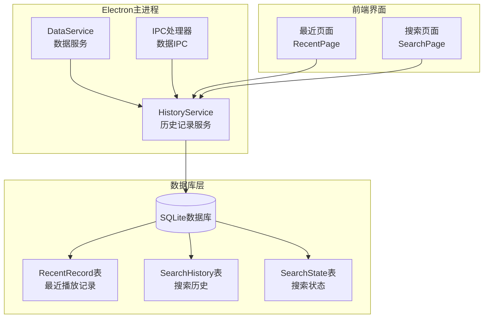
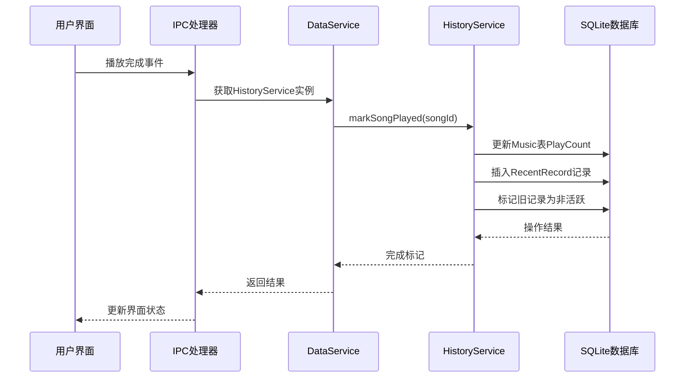
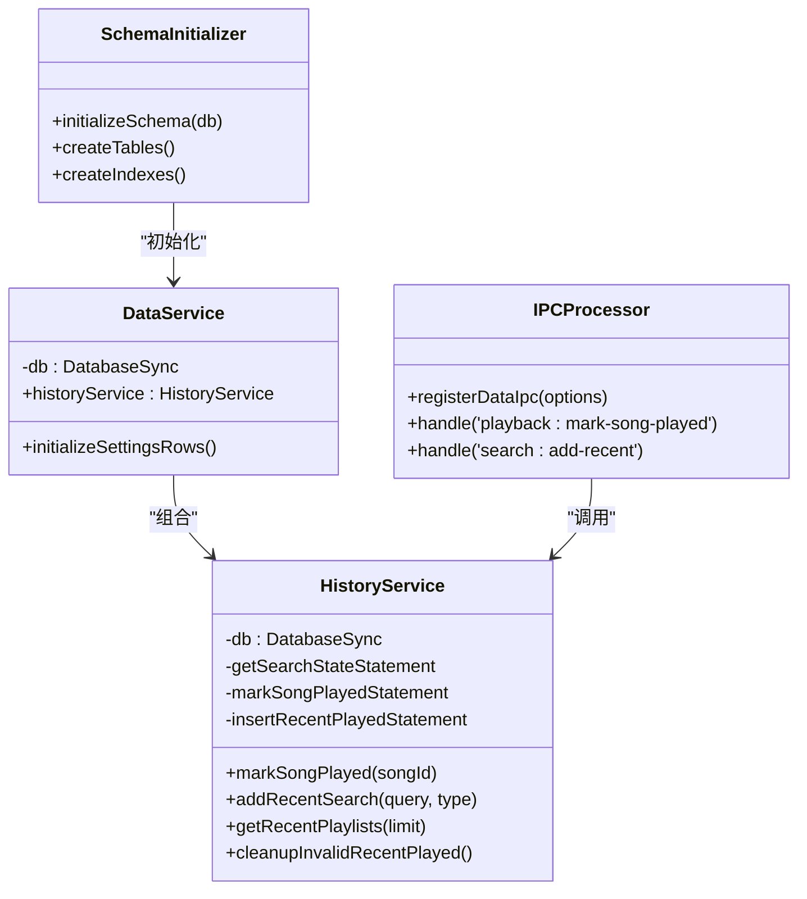
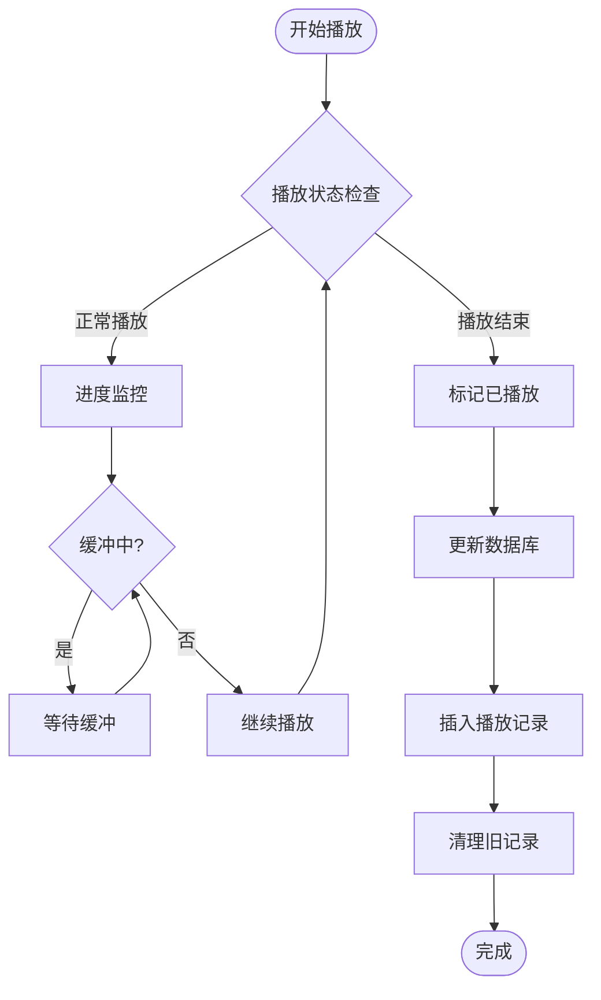
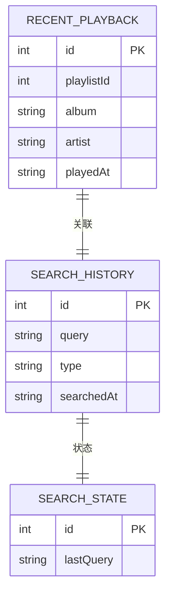
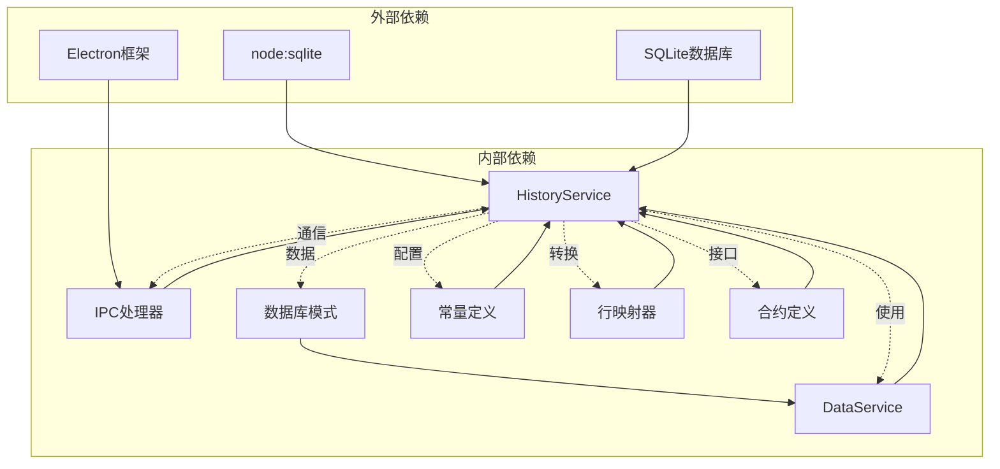

# 历史记录服务

<cite>
**本文档引用的文件**
- [history-service.ts](file://electron/services/history-service.ts)
- [data-service.ts](file://electron/services/data-service.ts)
- [schema.ts](file://electron/services/schema.ts)
- [data-ipc.ts](file://electron/ipc/data-ipc.ts)
- [constants.ts](file://electron/services/constants.ts)
- [row-mappers.ts](file://electron/services/row-mappers.ts)
- [contracts.ts](file://src/shared/contracts.ts)
- [RecentPage.tsx](file://src/pages/RecentPage.tsx)
- [SearchPage.tsx](file://src/pages/SearchPage.tsx)
- [usePlaybackController.ts](file://src/hooks/usePlaybackController.ts)
- [usePlaybackAudioElement.ts](file://src/hooks/usePlaybackAudioElement.ts)
</cite>

## 目录
1. [简介](#简介)
2. [项目结构](#项目结构)
3. [核心组件](#核心组件)
4. [架构概览](#架构概览)
5. [详细组件分析](#详细组件分析)
6. [依赖关系分析](#依赖关系分析)
7. [性能考虑](#性能考虑)
8. [故障排除指南](#故障排除指南)
9. [结论](#结论)
10. [附录](#附录)

## 简介

SMPlayer的历史记录服务是一个关键的后端组件，负责管理和跟踪用户的音乐播放历史。该服务提供了完整的播放历史管理功能，包括播放记录的跟踪、存储、查询和清理机制。

历史记录服务的核心职责包括：
- 跟踪用户播放过的歌曲、播放列表、专辑和艺术家
- 管理搜索历史记录
- 提供播放历史的查询和统计功能
- 实现历史记录的清理和维护
- 支持播放完成检测和播放中断处理

该服务使用SQLite数据库进行数据持久化，通过预编译的SQL语句确保高性能操作，并提供了完整的事务支持以保证数据一致性。

## 项目结构

历史记录服务在SMPlayer项目中的组织结构如下：

**图表来源**
- [history-service.ts:1-50](file://electron/services/history-service.ts#L1-L50)
- [data-service.ts:39-80](file://electron/services/data-service.ts#L39-L80)
- [schema.ts:171-189](file://electron/services/schema.ts#L171-L189)

**章节来源**
- [history-service.ts:1-484](file://electron/services/history-service.ts#L1-L484)
- [data-service.ts:1-198](file://electron/services/data-service.ts#L1-L198)
- [schema.ts:1-364](file://electron/services/schema.ts#L1-L364)

## 核心组件

### HistoryService类

HistoryService是历史记录服务的核心类，提供了完整的播放历史管理功能。该类包含了以下主要功能模块：

#### 数据库连接和初始化
- 使用SQLite数据库进行数据持久化
- 预编译所有SQL语句以提高性能
- 初始化数据库模式和索引

#### 播放历史管理
- `markSongPlayed(songId)`: 标记歌曲已播放
- `recordRecentPlaylistPlayed(playlistId)`: 记录播放列表播放
- `recordRecentAlbumPlayed(album)`: 记录专辑播放
- `recordRecentArtistPlayed(artist)`: 记录艺术家播放

#### 搜索历史管理
- `addRecentSearch(query, type)`: 添加搜索记录
- `removeRecentSearch(entryId)`: 删除单个搜索记录
- `removeRecentSearches(entryIds)`: 批量删除搜索记录
- `clearRecentSearches()`: 清空所有搜索记录

#### 查询和统计功能
- `getRecentPlaylists(limit)`: 获取最近播放的播放列表
- `getRecentAlbums(limit)`: 获取最近播放的专辑
- `getRecentArtists(limit)`: 获取最近播放的艺术家
- `getRecentPlayedSongPaths(limit)`: 获取最近播放歌曲的路径

#### 清理和维护
- `cleanupInvalidRecentPlayed()`: 清理无效的播放记录
- `clearRecentPlayed()`: 清空最近播放记录
- `removeRecentPlayed(songIds)`: 删除指定的播放记录
- `restoreRecentPlayed(songIds)`: 恢复播放记录

**章节来源**
- [history-service.ts:30-182](file://electron/services/history-service.ts#L30-L182)
- [history-service.ts:291-411](file://electron/services/history-service.ts#L291-L411)

### 数据库模式设计

历史记录服务使用三个核心表来存储不同类型的历史数据：

#### RecentRecord表
存储最近播放的项目记录，支持歌曲、播放列表、专辑和艺术家类型。

#### SearchHistory表
存储用户的搜索历史，包括查询内容、类型和时间戳。

#### SearchState表
存储最后的搜索状态，用于快速访问用户最近的搜索内容。

**章节来源**
- [schema.ts:171-189](file://electron/services/schema.ts#L171-L189)
- [schema.ts:235-247](file://electron/services/schema.ts#L235-L247)

## 架构概览

历史记录服务采用分层架构设计，确保了良好的模块化和可维护性：

**图表来源**
- [data-ipc.ts:145-149](file://electron/ipc/data-ipc.ts#L145-L149)
- [history-service.ts:291-306](file://electron/services/history-service.ts#L291-L306)

### 组件交互流程

历史记录服务与系统其他组件的交互通过IPC（Inter-Process Communication）实现，确保了前后端的解耦。

**图表来源**
- [history-service.ts:30-50](file://electron/services/history-service.ts#L30-L50)
- [data-service.ts:39-57](file://electron/services/data-service.ts#L39-L57)
- [data-ipc.ts:20-27](file://electron/ipc/data-ipc.ts#L20-L27)

**章节来源**
- [data-service.ts:39-145](file://electron/services/data-service.ts#L39-L145)
- [data-ipc.ts:20-151](file://electron/ipc/data-ipc.ts#L20-L151)

## 详细组件分析

### 播放历史跟踪机制

历史记录服务实现了智能的播放历史跟踪机制，能够准确记录用户的播放行为：

#### 播放完成检测
系统通过监听音频元素的状态变化来检测播放完成事件。当音频播放到达末尾或播放状态发生改变时，系统会触发播放完成检测逻辑。

**图表来源**
- [usePlaybackController.ts:307-372](file://src/hooks/usePlaybackController.ts#L307-L372)
- [history-service.ts:291-306](file://electron/services/history-service.ts#L291-L306)

#### 播放记录存储结构
播放记录包含以下关键字段：
- `Type`: 记录类型（歌曲、播放列表、专辑、艺术家）
- `ItemId`: 关联项目的标识符
- `Time`: 播放时间戳
- `State`: 记录状态（活跃、非活跃、隐藏）

**章节来源**
- [history-service.ts:13-18](file://electron/services/history-service.ts#L13-L18)
- [history-service.ts:24-28](file://electron/services/history-service.ts#L24-L28)

### 搜索历史管理

搜索历史功能提供了完整的搜索行为追踪和管理能力：

#### 搜索记录存储
搜索历史记录包含以下信息：
- `Query`: 搜索关键词
- `Type`: 搜索类型（侧边栏、艺术家、专辑、歌曲、播放列表、文件夹）
- `SearchedAt`: 搜索时间戳

#### 搜索状态管理
系统维护一个全局的搜索状态，用于快速访问用户最近的搜索内容。这个状态存储在`SearchState`表中，确保用户可以快速恢复之前的搜索会话。

**章节来源**
- [history-service.ts:184-193](file://electron/services/history-service.ts#L184-L193)
- [row-mappers.ts:26-46](file://electron/services/row-mappers.ts#L26-L46)

### 数据结构和字段定义

历史记录服务使用标准化的数据结构来确保数据的一致性和完整性：

#### 播放历史数据模型

**图表来源**
- [contracts.ts:65-81](file://src/shared/contracts.ts#L65-L81)
- [contracts.ts:181-186](file://src/shared/contracts.ts#L181-L186)
- [schema.ts:171-189](file://electron/services/schema.ts#L171-L189)

#### 字段详细说明

**播放历史字段**:
- `id`: 记录唯一标识符
- `playlistId`: 播放列表标识符
- `album`: 专辑名称
- `artist`: 艺术家名称
- `playedAt`: 播放时间戳（ISO格式）

**搜索历史字段**:
- `id`: 搜索记录唯一标识符
- `query`: 搜索关键词
- `type`: 搜索类型枚举
- `searchedAt`: 搜索时间戳

**章节来源**
- [contracts.ts:65-81](file://src/shared/contracts.ts#L65-L81)
- [contracts.ts:181-186](file://src/shared/contracts.ts#L181-L186)

### 查询和统计功能

历史记录服务提供了丰富的查询和统计功能：

#### 最近播放列表查询
系统支持按不同维度查询最近播放的项目：
- `getRecentPlaylists(limit)`: 获取最近播放的播放列表
- `getRecentAlbums(limit)`: 获取最近播放的专辑
- `getRecentArtists(limit)`: 获取最近播放的艺术家
- `getRecentPlayedSongPaths(limit)`: 获取最近播放歌曲的文件路径

#### 播放统计功能
系统能够提供各种播放统计数据：
- 播放次数统计：基于`Music.PlayCount`字段
- 最近播放排序：按时间戳降序排列
- 类型分类统计：按歌曲、播放列表、专辑、艺术家分类

**章节来源**
- [history-service.ts:195-230](file://electron/services/history-service.ts#L195-L230)
- [history-service.ts:423-445](file://electron/services/history-service.ts#L423-L445)

### 清理策略和维护

历史记录服务实现了完善的清理策略来管理存储空间和维护数据质量：

#### 过期数据清理
- `cleanupInvalidRecentPlayed()`: 清理无效的播放记录
- `clearRecentPlayed()`: 清空所有最近播放记录
- `removeRecentPlayed(songIds)`: 删除指定的播放记录

#### 存储空间管理
系统通过以下机制管理存储空间：
- 自动清理过期的播放记录
- 去重处理重复的搜索历史
- 限制历史记录数量以控制数据库大小

#### 隐私保护
- 支持用户手动清理搜索历史
- 提供批量删除功能
- 可配置的清理策略

**章节来源**
- [history-service.ts:332-338](file://electron/services/history-service.ts#L332-L338)
- [history-service.ts:328-330](file://electron/services/history-service.ts#L328-L330)
- [history-service.ts:308-316](file://electron/services/history-service.ts#L308-L316)

## 依赖关系分析

历史记录服务与其他系统组件存在紧密的依赖关系：

**图表来源**
- [history-service.ts:1-11](file://electron/services/history-service.ts#L1-L11)
- [data-service.ts:1-22](file://electron/services/data-service.ts#L1-L22)
- [constants.ts:1-28](file://electron/services/constants.ts#L1-L28)

### 外部依赖分析

历史记录服务主要依赖以下外部组件：
- **SQLite**: 提供轻量级的关系型数据库存储
- **node:sqlite**: Node.js的SQLite绑定库
- **Electron**: 提供跨平台桌面应用框架

### 内部依赖关系

系统内部组件之间的依赖关系体现了清晰的分层架构：
- HistoryService依赖于DataService进行数据库操作
- IPC处理器通过DataService访问HistoryService
- 数据库模式定义了数据结构和约束
- 行映射器负责数据转换和验证
- 合约定义确保前后端接口一致性

**章节来源**
- [history-service.ts:1-11](file://electron/services/history-service.ts#L1-L11)
- [data-service.ts:1-22](file://electron/services/data-service.ts#L1-L22)
- [schema.ts:1-33](file://electron/services/schema.ts#L1-L33)

## 性能考虑

历史记录服务在设计时充分考虑了性能优化：

### 数据库性能优化
- **预编译SQL语句**: 所有数据库操作都使用预编译语句，避免SQL注入并提高执行效率
- **索引优化**: 为常用查询字段建立索引，包括时间戳、类型和状态字段
- **事务管理**: 使用显式事务确保数据一致性和操作原子性

### 内存管理
- **懒加载**: 历史记录按需加载，避免不必要的内存占用
- **连接池**: 使用单例数据库连接，减少连接开销
- **垃圾回收**: 及时释放不再使用的对象引用

### 缓存策略
- **查询结果缓存**: 对频繁访问的查询结果进行缓存
- **状态缓存**: 缓存搜索状态以提高响应速度

## 故障排除指南

### 常见问题和解决方案

#### 数据库连接问题
**症状**: 历史记录无法保存或查询失败
**原因**: 数据库文件损坏或权限不足
**解决方案**: 
1. 检查数据库文件是否存在和可访问
2. 验证应用程序对数据库文件的读写权限
3. 重新初始化数据库模式

#### 播放记录不更新
**症状**: 播放完成后历史记录没有更新
**原因**: 播放完成事件未正确触发
**解决方案**:
1. 检查音频元素的状态监听器
2. 验证播放控制器的事件处理逻辑
3. 确认IPC通信是否正常工作

#### 搜索历史重复
**症状**: 搜索历史中出现重复条目
**原因**: 搜索记录去重逻辑失效
**解决方案**:
1. 检查搜索历史的去重机制
2. 验证搜索类型的枚举值
3. 确认数据库唯一约束是否生效

**章节来源**
- [history-service.ts:413-421](file://electron/services/history-service.ts#L413-L421)
- [usePlaybackAudioElement.ts:144-197](file://src/hooks/usePlaybackAudioElement.ts#L144-L197)

### 调试技巧

#### 日志记录
启用详细的日志记录来跟踪历史记录操作：
- 记录所有数据库操作的执行时间和结果
- 跟踪播放完成事件的触发时机
- 监控搜索历史的添加和删除操作

#### 性能监控
使用性能分析工具监控历史记录服务的性能：
- 监控数据库查询的执行时间
- 分析内存使用情况
- 检测潜在的内存泄漏

## 结论

SMPlayer的历史记录服务是一个设计精良、功能完整的播放历史管理组件。它通过以下特点确保了高质量的服务：

### 技术优势
- **模块化设计**: 清晰的分层架构和职责分离
- **性能优化**: 预编译SQL语句和索引优化
- **数据一致性**: 完整的事务支持和错误处理
- **扩展性**: 灵活的接口设计支持未来功能扩展

### 功能完整性
- 全面的播放历史跟踪功能
- 智能的搜索历史管理
- 丰富的查询和统计能力
- 完善的清理和维护机制

### 用户体验
- 无缝的播放历史集成
- 直观的界面展示
- 高效的搜索历史访问
- 可配置的隐私设置

历史记录服务为SMPlayer提供了坚实的数据基础，确保用户能够获得完整的音乐播放体验和便捷的历史记录管理功能。

## 附录

### API参考

#### 播放历史API
- `markSongPlayed(songId)`: 标记歌曲已播放
- `recordRecentPlaylistPlayed(playlistId)`: 记录播放列表播放
- `recordRecentAlbumPlayed(album)`: 记录专辑播放
- `recordRecentArtistPlayed(artist)`: 记录艺术家播放

#### 搜索历史API
- `addRecentSearch(query, type)`: 添加搜索记录
- `removeRecentSearch(entryId)`: 删除单个搜索记录
- `removeRecentSearches(entryIds)`: 批量删除搜索记录
- `clearRecentSearches()`: 清空所有搜索记录

#### 查询API
- `getRecentPlaylists(limit)`: 获取最近播放的播放列表
- `getRecentAlbums(limit)`: 获取最近播放的专辑
- `getRecentArtists(limit)`: 获取最近播放的艺术家
- `getRecentPlayedSongPaths(limit)`: 获取最近播放歌曲的路径

### 配置选项

#### 数据库配置
- 数据库文件名: `SMPlayerSettings.db`
- 日志模式: WAL (Write-Ahead Logging)
- 同步级别: NORMAL
- 外键约束: 启用

#### 历史记录限制
- 最近播放记录默认限制: 500条
- 搜索历史记录默认限制: 100条
- 存储空间清理阈值: 1000条记录