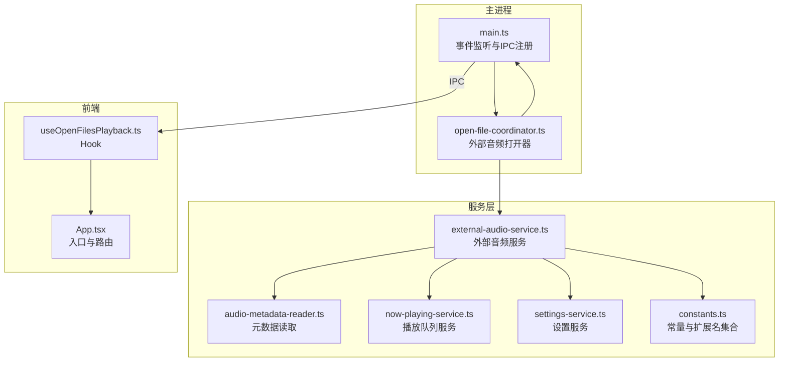
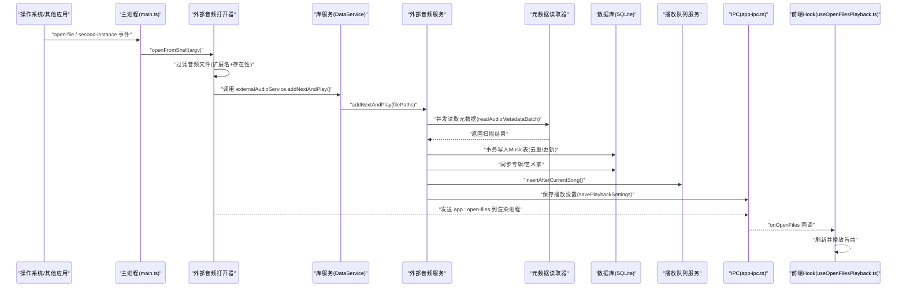
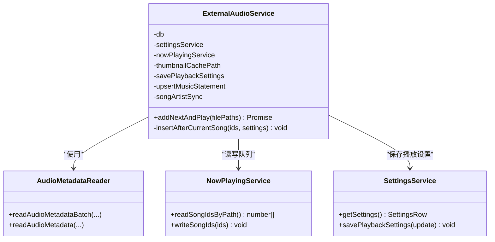
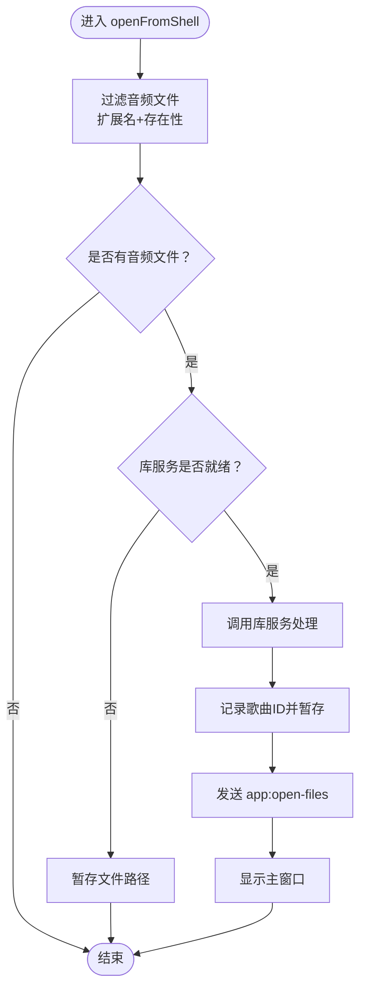
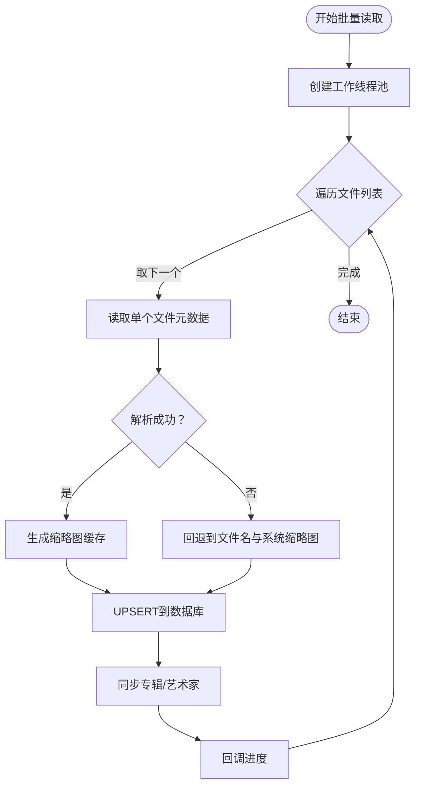
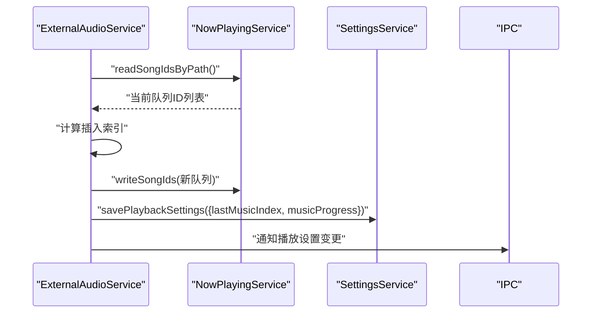
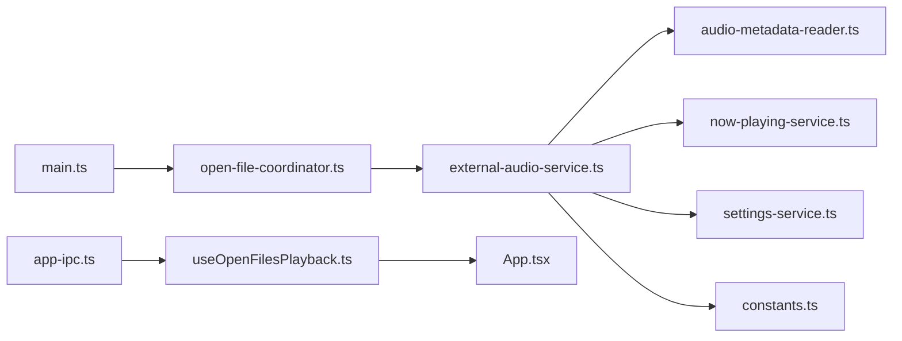

# 外部音频服务

<cite>
**本文引用的文件**
- [external-audio-service.ts](file://electron/services/external-audio-service.ts)
- [open-file-coordinator.ts](file://electron/services/open-file-coordinator.ts)
- [main.ts](file://electron/main.ts)
- [app-ipc.ts](file://electron/ipc/app-ipc.ts)
- [data-ipc.ts](file://electron/ipc/data-ipc.ts)
- [media-protocols.ts](file://electron/services/media-protocols.ts)
- [constants.ts](file://electron/services/constants.ts)
- [audio-metadata-reader.ts](file://electron/services/audio-metadata-reader.ts)
- [settings-service.ts](file://electron/services/settings-service.ts)
- [now-playing-service.ts](file://electron/services/now-playing-service.ts)
- [contracts.ts](file://src/shared/contracts.ts)
- [useOpenFilesPlayback.ts](file://src/hooks/useOpenFilesPlayback.ts)
- [App.tsx](file://src/App.tsx)
</cite>

## 目录
1. [简介](#简介)
2. [项目结构](#项目结构)
3. [核心组件](#核心组件)
4. [架构总览](#架构总览)
5. [详细组件分析](#详细组件分析)
6. [依赖关系分析](#依赖关系分析)
7. [性能考量](#性能考量)
8. [故障排除指南](#故障排除指南)
9. [结论](#结论)
10. [附录](#附录)

## 简介
本文件面向SMPlayer的“外部音频服务”，系统性阐述其从系统或外部应用打开音频文件的完整流程与实现细节。重点覆盖以下方面：
- 外部音频文件的接收与过滤：基于扩展名与存在性校验，筛选出可处理的音频文件。
- 元数据读取与入库：并发解析音频元数据，生成缩略图缓存，写入数据库并同步专辑/艺术家信息。
- 播放队列管理：将新加入的歌曲插入到当前播放队列的指定位置，并更新播放设置（索引、进度）。
- 主应用集成：通过IPC与主进程交互，触发窗口显示、托盘状态更新、前端Hook自动播放首曲。
- 配置项与行为：默认播放行为、文件类型支持、处理优先级等。
- 错误处理与异常：文件不存在、格式不支持、权限问题、并发取消等场景。
- 扩展与自定义：媒体协议注册、缩略图缓存策略、元数据解析器可替换点。

## 项目结构
外部音频服务涉及Electron主进程、服务层与前端Hook三部分协作：
- 主进程负责监听系统事件与命令行参数，协调外部音频文件的打开流程。
- 服务层完成文件过滤、元数据解析、数据库写入、队列插入与状态同步。
- 前端Hook在页面加载后拉取待播放列表并自动开始播放首曲。

图表来源
- [main.ts:131-139](file://electron/main.ts#L131-L139)
- [open-file-coordinator.ts:40-74](file://electron/services/open-file-coordinator.ts#L40-L74)
- [external-audio-service.ts:14-121](file://electron/services/external-audio-service.ts#L14-L121)
- [audio-metadata-reader.ts:31-105](file://electron/services/audio-metadata-reader.ts#L31-L105)
- [now-playing-service.ts:6-104](file://electron/services/now-playing-service.ts#L6-L104)
- [settings-service.ts:61-293](file://electron/services/settings-service.ts#L61-L293)
- [constants.ts:3-15](file://electron/services/constants.ts#L3-L15)
- [useOpenFilesPlayback.ts:11-43](file://src/hooks/useOpenFilesPlayback.ts#L11-L43)
- [App.tsx:494-498](file://src/App.tsx#L494-L498)

章节来源
- [main.ts:131-139](file://electron/main.ts#L131-L139)
- [open-file-coordinator.ts:40-74](file://electron/services/open-file-coordinator.ts#L40-L74)
- [external-audio-service.ts:14-121](file://electron/services/external-audio-service.ts#L14-L121)
- [audio-metadata-reader.ts:31-105](file://electron/services/audio-metadata-reader.ts#L31-L105)
- [now-playing-service.ts:6-104](file://electron/services/now-playing-service.ts#L6-L104)
- [settings-service.ts:61-293](file://electron/services/settings-service.ts#L61-L293)
- [constants.ts:3-15](file://electron/services/constants.ts#L3-L15)
- [useOpenFilesPlayback.ts:11-43](file://src/hooks/useOpenFilesPlayback.ts#L11-L43)
- [App.tsx:494-498](file://src/App.tsx#L494-L498)

## 核心组件
- 外部音频服务（ExternalAudioService）
  - 负责过滤音频文件、并发读取元数据、写入数据库、同步专辑与艺术家、插入播放队列并更新播放设置。
  - 关键点：使用SQLite事务保证一致性；并发度受控；支持标题来源选择（文件名或音乐名称）。
- 外部音频打开器（ExternalAudioFileOpener）
  - 负责从系统事件、命令行参数中提取音频文件，过滤后交由库服务处理，并向前端发送打开事件。
  - 支持排队机制，避免库服务未就绪时的丢失。
- 元数据读取器（AudioMetadataReader）
  - 使用音乐元数据解析库，提取标题、艺术家、专辑、封面、时长等；失败时回退到文件名与基础缩略图。
- 播放队列服务（NowPlayingService）
  - 维护当前播放队列的持久化顺序，支持按路径读取与写入，确保UI与播放器状态一致。
- 设置服务（SettingsService）
  - 提供播放设置的读取与保存，包括播放模式、音量、上次播放索引、进度等。
- 媒体协议（MediaProtocols）
  - 注册自定义协议以支持流式播放与封面获取，便于前端统一资源访问。
- 常量（Constants）
  - 定义受支持的音频扩展名集合，作为过滤依据。

章节来源
- [external-audio-service.ts:14-121](file://electron/services/external-audio-service.ts#L14-L121)
- [open-file-coordinator.ts:40-74](file://electron/services/open-file-coordinator.ts#L40-L74)
- [audio-metadata-reader.ts:31-105](file://electron/services/audio-metadata-reader.ts#L31-L105)
- [now-playing-service.ts:6-104](file://electron/services/now-playing-service.ts#L6-L104)
- [settings-service.ts:61-293](file://electron/services/settings-service.ts#L61-L293)
- [media-protocols.ts:10-120](file://electron/services/media-protocols.ts#L10-L120)
- [constants.ts:3-15](file://electron/services/constants.ts#L3-L15)

## 架构总览
外部音频服务的端到端流程如下：

图表来源
- [main.ts:131-139](file://electron/main.ts#L131-L139)
- [open-file-coordinator.ts:52-74](file://electron/services/open-file-coordinator.ts#L52-L74)
- [external-audio-service.ts:56-97](file://electron/services/external-audio-service.ts#L56-L97)
- [audio-metadata-reader.ts:76-105](file://electron/services/audio-metadata-reader.ts#L76-L105)
- [app-ipc.ts:10-16](file://electron/ipc/app-ipc.ts#L10-L16)
- [useOpenFilesPlayback.ts:14-30](file://src/hooks/useOpenFilesPlayback.ts#L14-L30)

## 详细组件分析

### 外部音频服务（ExternalAudioService）
- 功能职责
  - 过滤输入文件：仅保留受支持扩展名且存在的文件。
  - 并发解析元数据：批量读取，支持取消与进度回调。
  - 数据库写入：UPSERT到Music表，保持PlayCount与DateAdded不变。
  - 同步专辑与艺术家：根据扫描结果更新关联表。
  - 插入播放队列：在当前播放索引之后插入新歌，更新lastMusicIndex与musicProgress。
- 关键实现要点
  - 使用SQLite事务包裹写入，异常时回滚。
  - 通过NowPlayingService读取/写入当前队列，避免重复与越界。
  - 通过SettingsService保存播放设置，确保UI与播放器状态一致。
- 性能与并发
  - 元数据读取并发度固定为常量，避免过度占用IO。
  - 采用批量写入与事务提交，减少磁盘写入次数。

图表来源
- [external-audio-service.ts:14-121](file://electron/services/external-audio-service.ts#L14-L121)
- [audio-metadata-reader.ts:31-105](file://electron/services/audio-metadata-reader.ts#L31-L105)
- [now-playing-service.ts:50-93](file://electron/services/now-playing-service.ts#L50-L93)
- [settings-service.ts:189-292](file://electron/services/settings-service.ts#L189-L292)

章节来源
- [external-audio-service.ts:14-121](file://electron/services/external-audio-service.ts#L14-L121)
- [audio-metadata-reader.ts:31-105](file://electron/services/audio-metadata-reader.ts#L31-L105)
- [now-playing-service.ts:50-93](file://electron/services/now-playing-service.ts#L50-L93)
- [settings-service.ts:189-292](file://electron/services/settings-service.ts#L189-L292)

### 外部音频打开器（ExternalAudioFileOpener）
- 功能职责
  - 从命令行参数与系统事件中收集音频文件路径，过滤后交给库服务处理。
  - 若库服务尚未初始化，将文件路径暂存至队列，等待后续处理。
  - 将已处理的歌曲ID通过IPC发送给渲染进程，并显示主窗口。
- 关键实现要点
  - 协调器（OpenFileCoordinator）负责暂存与取出待处理文件与歌曲ID。
  - 过滤逻辑基于扩展名集合与文件存在性检查。

图表来源
- [open-file-coordinator.ts:52-74](file://electron/services/open-file-coordinator.ts#L52-L74)
- [constants.ts:3-15](file://electron/services/constants.ts#L3-L15)

章节来源
- [open-file-coordinator.ts:40-74](file://electron/services/open-file-coordinator.ts#L40-L74)
- [constants.ts:3-15](file://electron/services/constants.ts#L3-L15)

### 元数据读取与入库流程
- 元数据读取
  - 解析音频文件元数据，提取标题、艺术家、专辑、封面等；若失败则回退到文件名与系统缩略图。
  - 计算时长：优先使用解析得到的时长，其次根据文件大小与比特率估算。
- 数据库写入
  - UPSERT到Music表，保持PlayCount与DateAdded不变，避免覆盖播放历史。
  - 同步专辑与艺术家信息，确保查询与展示正确。
- 并发控制
  - 通过Promise.all与工作线程池控制并发度，支持取消与进度回调。

图表来源
- [audio-metadata-reader.ts:76-105](file://electron/services/audio-metadata-reader.ts#L76-L105)
- [external-audio-service.ts:68-96](file://electron/services/external-audio-service.ts#L68-L96)

章节来源
- [audio-metadata-reader.ts:31-127](file://electron/services/audio-metadata-reader.ts#L31-L127)
- [external-audio-service.ts:68-96](file://electron/services/external-audio-service.ts#L68-L96)

### 播放队列管理与状态同步
- 当前队列读取
  - 通过NowPlayingService按路径映射到歌曲ID，确保队列一致性。
- 插入策略
  - 基于SettingsService中的LastMusicIndex，计算插入位置，避免打乱现有播放顺序。
  - 写回队列并更新播放设置（lastMusicIndex、musicProgress），确保UI与播放器状态一致。
- 状态同步
  - 通过savePlaybackSettings即时保存播放设置，避免重启丢失。

图表来源
- [external-audio-service.ts:99-119](file://electron/services/external-audio-service.ts#L99-L119)
- [now-playing-service.ts:50-93](file://electron/services/now-playing-service.ts#L50-L93)
- [settings-service.ts:281-292](file://electron/services/settings-service.ts#L281-L292)

章节来源
- [external-audio-service.ts:99-119](file://electron/services/external-audio-service.ts#L99-L119)
- [now-playing-service.ts:50-93](file://electron/services/now-playing-service.ts#L50-L93)
- [settings-service.ts:281-292](file://electron/services/settings-service.ts#L281-L292)

### 媒体协议与资源访问
- 自定义协议
  - 注册smplayer-media与smplayer-artwork协议，支持范围请求与流式传输。
  - smplayer-media用于音频流播放，smplayer-artwork用于封面获取。
- 内容类型与范围
  - 根据文件扩展名确定Content-Type；支持Range头进行分段传输。
- 与前端集成
  - 前端通过协议URL访问资源，统一了本地与远程资源的访问方式。

章节来源
- [media-protocols.ts:10-120](file://electron/services/media-protocols.ts#L10-L120)

### 前端集成与自动播放
- Hook机制
  - 在页面加载后，通过Hook订阅并拉取待播放歌曲ID，刷新数据后自动播放首曲。
  - 通过IPC监听app:open-files事件，实现与主进程的解耦。
- 应用入口
  - App.tsx中集成Hook，确保在合适时机触发播放。

章节来源
- [useOpenFilesPlayback.ts:11-43](file://src/hooks/useOpenFilesPlayback.ts#L11-L43)
- [App.tsx:494-498](file://src/App.tsx#L494-L498)
- [app-ipc.ts:10-16](file://electron/ipc/app-ipc.ts#L10-L16)

## 依赖关系分析
- 组件耦合
  - ExternalAudioService依赖SettingsService、NowPlayingService、AudioMetadataReader与数据库。
  - ExternalAudioFileOpener依赖OpenFileCoordinator与主进程IPC。
  - 前端Hook依赖IPC与应用状态管理。
- 外部依赖
  - 音频元数据解析库、Electron协议系统、SQLite数据库。
- 循环依赖
  - 未发现直接循环依赖；各模块职责清晰，通过接口与IPC解耦。

图表来源
- [main.ts:131-139](file://electron/main.ts#L131-L139)
- [open-file-coordinator.ts:40-74](file://electron/services/open-file-coordinator.ts#L40-L74)
- [external-audio-service.ts:14-121](file://electron/services/external-audio-service.ts#L14-L121)
- [audio-metadata-reader.ts:31-105](file://electron/services/audio-metadata-reader.ts#L31-L105)
- [now-playing-service.ts:6-104](file://electron/services/now-playing-service.ts#L6-L104)
- [settings-service.ts:61-293](file://electron/services/settings-service.ts#L61-L293)
- [constants.ts:3-15](file://electron/services/constants.ts#L3-L15)
- [app-ipc.ts:10-16](file://electron/ipc/app-ipc.ts#L10-L16)
- [useOpenFilesPlayback.ts:11-43](file://src/hooks/useOpenFilesPlayback.ts#L11-L43)
- [App.tsx:494-498](file://src/App.tsx#L494-L498)

章节来源
- [main.ts:131-139](file://electron/main.ts#L131-L139)
- [open-file-coordinator.ts:40-74](file://electron/services/open-file-coordinator.ts#L40-L74)
- [external-audio-service.ts:14-121](file://electron/services/external-audio-service.ts#L14-L121)
- [audio-metadata-reader.ts:31-105](file://electron/services/audio-metadata-reader.ts#L31-L105)
- [now-playing-service.ts:6-104](file://electron/services/now-playing-service.ts#L6-L104)
- [settings-service.ts:61-293](file://electron/services/settings-service.ts#L61-L293)
- [constants.ts:3-15](file://electron/services/constants.ts#L3-L15)
- [app-ipc.ts:10-16](file://electron/ipc/app-ipc.ts#L10-L16)
- [useOpenFilesPlayback.ts:11-43](file://src/hooks/useOpenFilesPlayback.ts#L11-L43)
- [App.tsx:494-498](file://src/App.tsx#L494-L498)

## 性能考量
- 并发读取
  - 元数据读取并发度固定，避免过多线程导致IO争用；可根据系统资源调整并发数。
- 数据库事务
  - 批量写入使用事务，减少磁盘写入次数，提升吞吐量。
- 缓存策略
  - 缩略图缓存减少重复封面处理开销；失败回退到系统缩略图，保证可用性。
- 队列插入
  - 插入位置计算避免大规模重排，降低队列重建成本。

## 故障排除指南
- 文件不存在或无权限
  - 过滤阶段会跳过不存在的文件；若库服务未就绪，文件会被暂存，稍后重试。
- 格式不支持
  - 元数据解析失败时回退到文件名与系统缩略图；不影响整体流程。
- 并发取消
  - 批量读取支持取消回调，避免长时间阻塞。
- 队列越界
  - 插入索引经过边界保护，防止越界导致播放异常。
- IPC未就绪
  - 前端Hook会在window.smplayer可用后再拉取待播放列表，避免空引用。

章节来源
- [open-file-coordinator.ts:56-74](file://electron/services/open-file-coordinator.ts#L56-L74)
- [audio-metadata-reader.ts:61-74](file://electron/services/audio-metadata-reader.ts#L61-L74)
- [external-audio-service.ts:99-119](file://electron/services/external-audio-service.ts#L99-L119)
- [useOpenFilesPlayback.ts:14-30](file://src/hooks/useOpenFilesPlayback.ts#L14-L30)

## 结论
外部音频服务通过清晰的职责划分与稳健的错误处理，实现了从系统或外部应用打开音频文件的完整链路。其并发元数据读取、事务化数据库写入、智能队列插入与前端自动播放机制共同构成了高性能、高可用的外部音频接入能力。配合媒体协议与IPC集成，进一步提升了用户体验与扩展性。

## 附录
- 配置选项与默认行为
  - 默认播放行为：新加入的音频在当前播放索引之后插入，立即开始播放首曲。
  - 文件类型支持：受支持的扩展名集合由常量定义，可在扩展时统一维护。
  - 处理优先级：先过滤再并发解析，最后写入数据库并更新队列。
- 扩展与自定义建议
  - 可替换元数据解析器以支持更多格式或自定义字段。
  - 可扩展媒体协议以支持更多资源类型（如歌词、字幕）。
  - 可增加预处理钩子（如去噪、均衡）在写入数据库前执行。