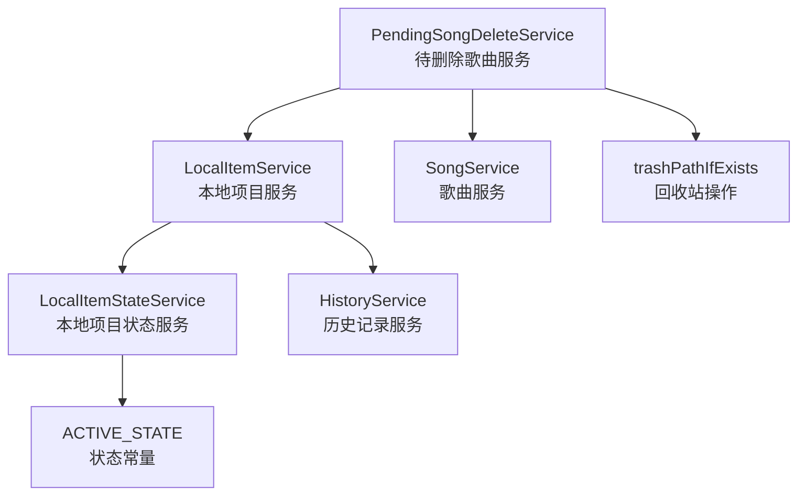
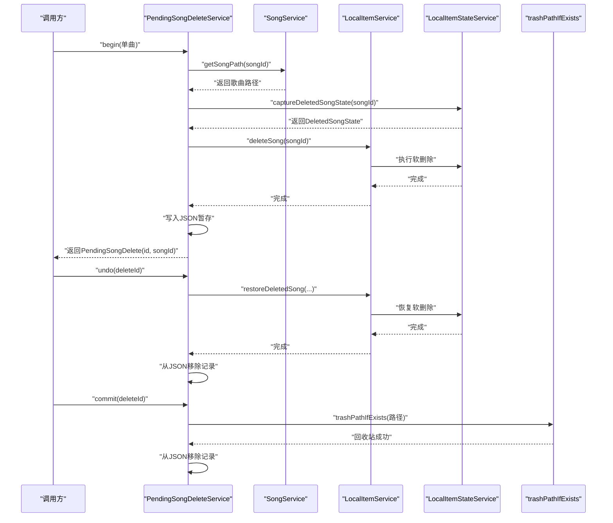
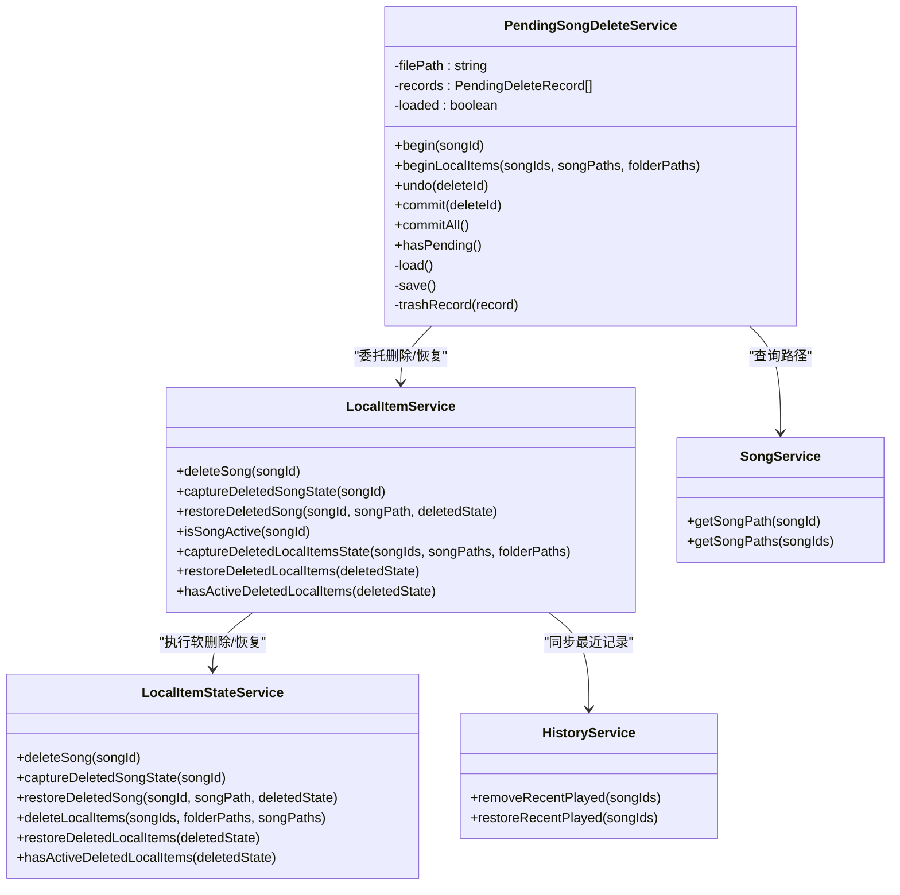
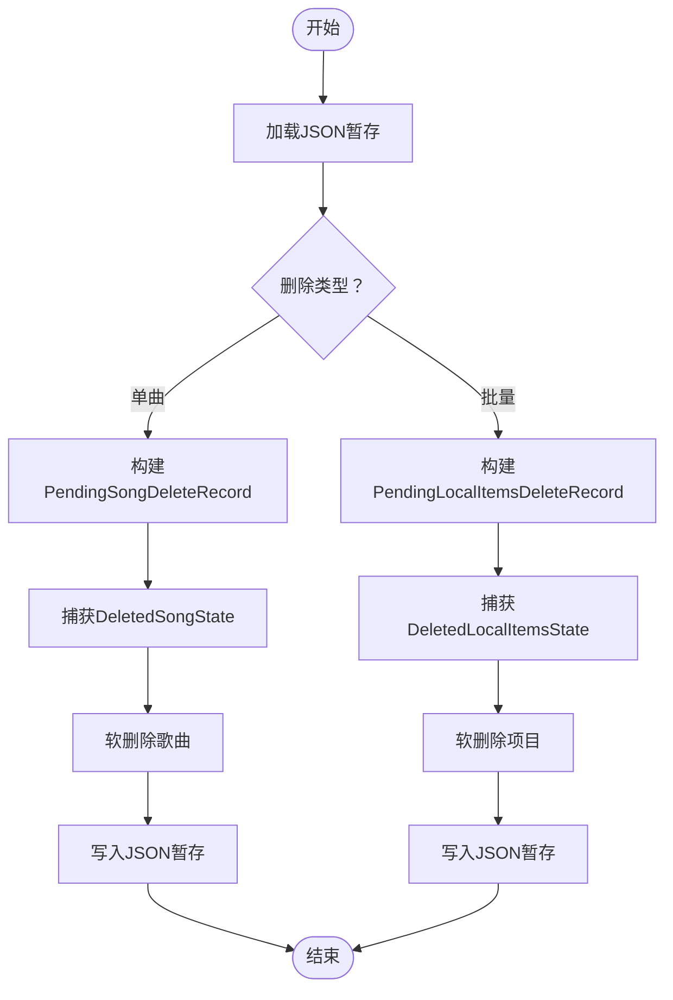
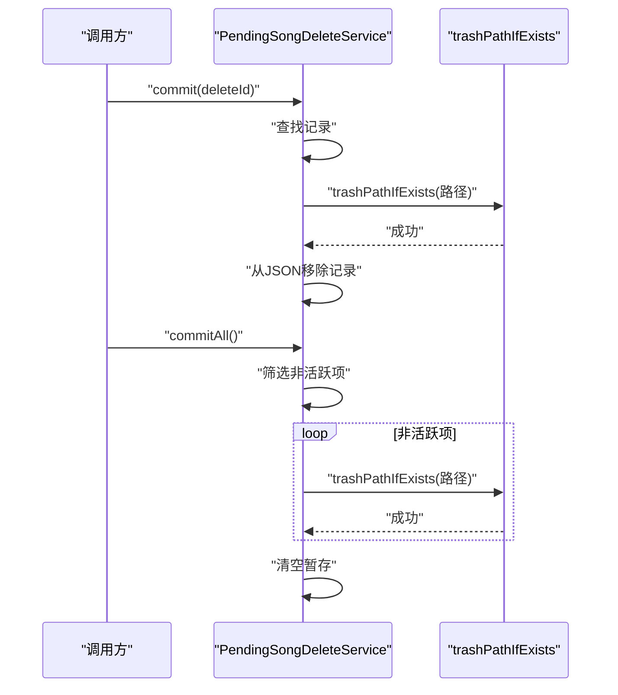
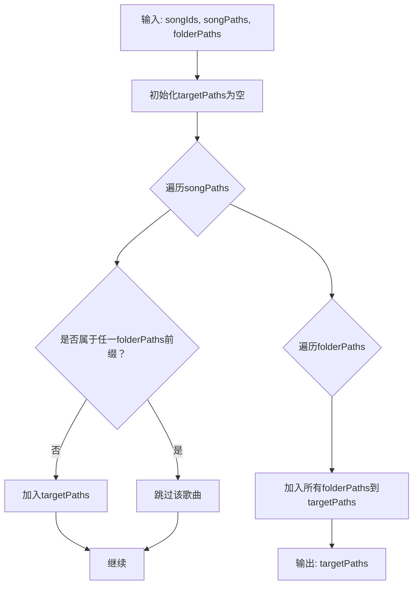
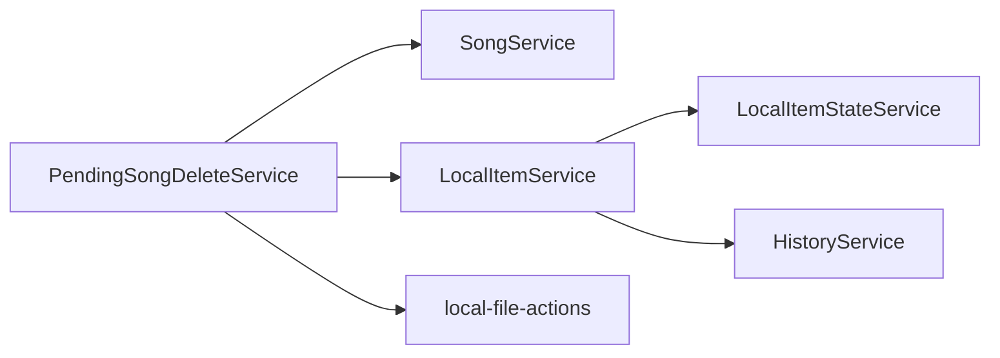
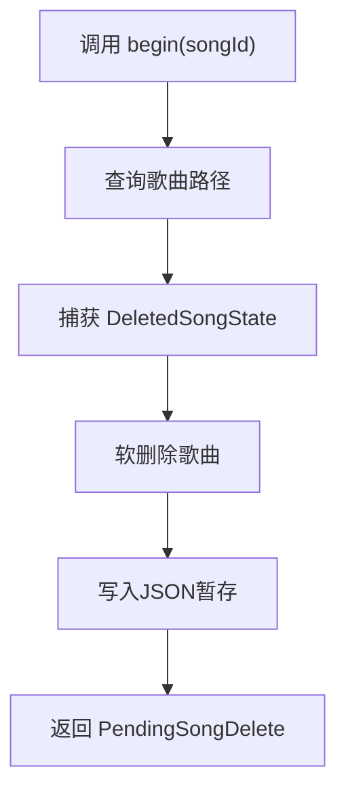
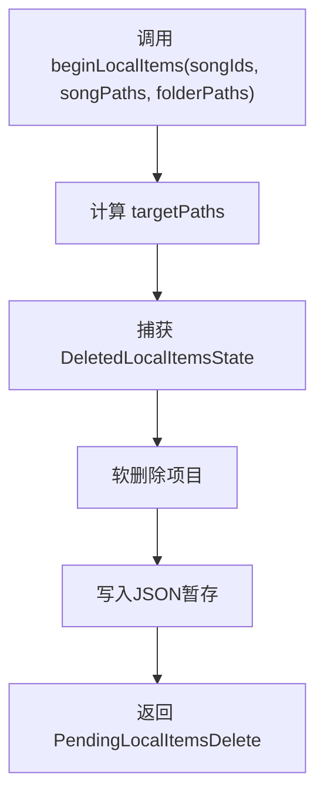

# 待删除歌曲服务

<cite>
**本文引用的文件**
- [pending-song-delete-service.ts](file://electron/services/pending-song-delete-service.ts)
- [local-item-service.ts](file://electron/services/local-item-service.ts)
- [local-item-state-service.ts](file://electron/services/local-item-state-service.ts)
- [song-service.ts](file://electron/services/song-service.ts)
- [history-service.ts](file://electron/services/history-service.ts)
- [local-file-actions.ts](file://electron/services/local-file-actions.ts)
- [constants.ts](file://electron/services/constants.ts)
</cite>

## 目录
1. [简介](#简介)
2. [项目结构](#项目结构)
3. [核心组件](#核心组件)
4. [架构总览](#架构总览)
5. [详细组件分析](#详细组件分析)
6. [依赖关系分析](#依赖关系分析)
7. [性能考量](#性能考量)
8. [故障排查指南](#故障排查指南)
9. [结论](#结论)
10. [附录](#附录)

## 简介
本文件系统性阐述 SMPlayer 的“待删除歌曲服务”（PendingSongDeleteService）的设计与实现，重点覆盖以下方面：
- 删除请求的暂存、确认机制与撤销操作
- 批量删除能力与目标路径去重策略
- 待删除歌曲的数据结构与生命周期管理
- 清理机制：持久化存储、垃圾箱回收、数据一致性保障
- 与本地项目服务、歌曲服务、历史记录服务的协作
- 安全策略与最佳实践

## 项目结构
待删除歌曲服务位于 Electron 后端服务层，围绕“删除请求暂存 + 状态捕获 + 撤销/提交”的模式组织代码，关键文件如下：
- 服务主体：pending-song-delete-service.ts
- 数据一致性与状态捕获：local-item-state-service.ts
- 本地项目删除与恢复：local-item-service.ts
- 歌曲路径查询：song-service.ts
- 历史记录状态维护：history-service.ts
- 文件级回收站操作：local-file-actions.ts
- 常量定义：constants.ts

图表来源
- [pending-song-delete-service.ts:36-47](file://electron/services/pending-song-delete-service.ts#L36-L47)
- [local-item-service.ts:22-41](file://electron/services/local-item-service.ts#L22-L41)
- [local-item-state-service.ts:34-64](file://electron/services/local-item-state-service.ts#L34-L64)
- [song-service.ts:17-56](file://electron/services/song-service.ts#L17-L56)
- [history-service.ts:30-50](file://electron/services/history-service.ts#L30-L50)
- [local-file-actions.ts:6-18](file://electron/services/local-file-actions.ts#L6-L18)
- [constants.ts:22-27](file://electron/services/constants.ts#L22-L27)

章节来源
- [pending-song-delete-service.ts:1-179](file://electron/services/pending-song-delete-service.ts#L1-L179)
- [local-item-service.ts:1-347](file://electron/services/local-item-service.ts#L1-L347)
- [local-item-state-service.ts:1-609](file://electron/services/local-item-state-service.ts#L1-L609)
- [song-service.ts:1-297](file://electron/services/song-service.ts#L1-L297)
- [history-service.ts:1-484](file://electron/services/history-service.ts#L1-L484)
- [local-file-actions.ts:1-38](file://electron/services/local-file-actions.ts#L1-L38)
- [constants.ts:1-28](file://electron/services/constants.ts#L1-L28)

## 核心组件
- 待删除歌曲服务（PendingSongDeleteService）
  - 负责删除请求的创建、暂存、撤销、提交与批量提交
  - 维护 JSON 持久化文件，确保崩溃后可恢复
  - 通过本地项目服务进行状态捕获与恢复
- 本地项目服务（LocalItemService）
  - 提供删除、恢复、状态检查等能力
  - 将删除影响范围（歌曲、艺术家、文件、播放列表项、最近记录、隐藏项、偏好项等）纳入状态捕获
- 本地项目状态服务（LocalItemStateService）
  - 实际执行数据库层面的软删除与恢复
  - 提供状态快照（DeletedSongState、DeletedLocalItemsState）
- 歌曲服务（SongService）
  - 提供歌曲路径查询，用于删除前的路径确认与回收站操作
- 历史记录服务（HistoryService）
  - 在删除/恢复时同步更新最近播放记录状态
- 回收站工具（local-file-actions）
  - 将文件或目录安全地移入系统回收站

章节来源
- [pending-song-delete-service.ts:36-179](file://electron/services/pending-song-delete-service.ts#L36-L179)
- [local-item-service.ts:22-73](file://electron/services/local-item-service.ts#L22-L73)
- [local-item-state-service.ts:34-208](file://electron/services/local-item-state-service.ts#L34-L208)
- [song-service.ts:253-280](file://electron/services/song-service.ts#L253-L280)
- [history-service.ts:30-136](file://electron/services/history-service.ts#L30-L136)
- [local-file-actions.ts:6-18](file://electron/services/local-file-actions.ts#L6-L18)

## 架构总览
待删除歌曲服务采用“请求暂存 + 状态捕获 + 可撤销 + 延迟提交”的设计，避免直接物理删除造成不可逆损失。

图表来源
- [pending-song-delete-service.ts:49-122](file://electron/services/pending-song-delete-service.ts#L49-L122)
- [song-service.ts:253-264](file://electron/services/song-service.ts#L253-L264)
- [local-item-service.ts:43-53](file://electron/services/local-item-service.ts#L43-L53)
- [local-item-state-service.ts:84-128](file://electron/services/local-item-state-service.ts#L84-L128)
- [local-file-actions.ts:6-18](file://electron/services/local-file-actions.ts#L6-L18)

## 详细组件分析

### 数据结构与生命周期
- 待删除请求类型
  - 单曲删除：PendingSongDeleteRecord（含 id、songId、songPath、createdAt、deletedState）
  - 本地项目批量删除：PendingLocalItemsDeleteRecord（含 id、songIds、folderPaths、targetPaths、createdAt、deletedState）
- 删除状态快照
  - DeletedSongState：记录与歌曲相关的播放列表项与最近记录 ID 列表
  - DeletedLocalItemsState：记录音乐、艺术家、文件、文件夹、播放列表项、最近记录、隐藏存储项、偏好项的 ID 列表
- 生命周期阶段
  - 创建：捕获状态 → 执行软删除 → 写入暂存
  - 撤销：根据状态恢复 → 从暂存移除
  - 提交：回收站删除 → 从暂存移除
  - 批量提交：筛选非活跃项 → 逐条回收站删除 → 清空暂存

图表来源
- [pending-song-delete-service.ts:36-179](file://electron/services/pending-song-delete-service.ts#L36-L179)
- [local-item-service.ts:22-73](file://electron/services/local-item-service.ts#L22-L73)
- [local-item-state-service.ts:34-208](file://electron/services/local-item-state-service.ts#L34-L208)
- [song-service.ts:253-280](file://electron/services/song-service.ts#L253-L280)
- [history-service.ts:290-326](file://electron/services/history-service.ts#L290-L326)

章节来源
- [pending-song-delete-service.ts:9-34](file://electron/services/pending-song-delete-service.ts#L9-L34)
- [local-item-state-service.ts:18-32](file://electron/services/local-item-state-service.ts#L18-L32)
- [local-item-state-service.ts:130-189](file://electron/services/local-item-state-service.ts#L130-L189)

### 删除请求创建与暂存
- 单曲删除
  - 查询歌曲路径
  - 捕获 DeletedSongState
  - 执行软删除
  - 写入 JSON 暂存
- 批量删除
  - 计算 targetPaths：排除属于文件夹内的歌曲路径，仅保留独立歌曲与文件夹本身
  - 捕获 DeletedLocalItemsState
  - 执行软删除
  - 写入 JSON 暂存

图表来源
- [pending-song-delete-service.ts:49-102](file://electron/services/pending-song-delete-service.ts#L49-L102)
- [local-item-state-service.ts:84-128](file://electron/services/local-item-state-service.ts#L84-L128)
- [local-item-state-service.ts:130-189](file://electron/services/local-item-state-service.ts#L130-L189)

章节来源
- [pending-song-delete-service.ts:49-102](file://electron/services/pending-song-delete-service.ts#L49-L102)

### 撤销与提交流程
- 撤销
  - 根据记录类型调用恢复接口
  - 从暂存移除对应记录
- 提交
  - 对单个记录：回收站删除目标路径 → 从暂存移除
  - 对全部记录：筛选非活跃项 → 逐条回收站删除 → 清空暂存

图表来源
- [pending-song-delete-service.ts:104-139](file://electron/services/pending-song-delete-service.ts#L104-L139)
- [local-file-actions.ts:6-18](file://electron/services/local-file-actions.ts#L6-L18)

章节来源
- [pending-song-delete-service.ts:104-139](file://electron/services/pending-song-delete-service.ts#L104-L139)

### 批量处理与目标路径去重
- 批量删除时，对 songPaths 进行过滤：若某歌曲路径属于任一文件夹路径前缀，则跳过该歌曲，避免重复删除
- 最终 targetPaths 包含：
  - 不属于任何文件夹的独立歌曲
  - 所有文件夹路径

图表来源
- [pending-song-delete-service.ts:73-81](file://electron/services/pending-song-delete-service.ts#L73-L81)

章节来源
- [pending-song-delete-service.ts:73-81](file://electron/services/pending-song-delete-service.ts#L73-L81)

### 数据一致性保障
- 状态捕获
  - DeletedSongState：播放列表项、最近记录
  - DeletedLocalItemsState：音乐、艺术家、文件、文件夹、播放列表项、最近记录、隐藏存储项、偏好项
- 软删除与恢复
  - 通过 LocalItemStateService 在数据库层面标记为非活跃，不立即物理删除
  - 撤销时按 ID 列表恢复上述实体
- 历史记录同步
  - 删除时移除最近记录；恢复时重建最近记录

章节来源
- [local-item-state-service.ts:84-128](file://electron/services/local-item-state-service.ts#L84-L128)
- [local-item-state-service.ts:130-208](file://electron/services/local-item-state-service.ts#L130-L208)
- [history-service.ts:290-326](file://electron/services/history-service.ts#L290-L326)

### 与外部服务的交互
- 与歌曲服务
  - 通过 getSongPath 获取路径，用于后续回收站操作
- 与本地项目服务
  - 删除/恢复委托给 LocalItemService，后者调用 LocalItemStateService
- 与历史记录服务
  - 删除/恢复时同步更新最近记录状态，保持 UI 与数据库一致

章节来源
- [song-service.ts:253-264](file://electron/services/song-service.ts#L253-L264)
- [local-item-service.ts:43-53](file://electron/services/local-item-service.ts#L43-L53)
- [history-service.ts:290-326](file://electron/services/history-service.ts#L290-L326)

## 依赖关系分析
- 组件耦合
  - PendingSongDeleteService 依赖 SongService（路径）、LocalItemService（删除/恢复）、local-file-actions（回收站）
  - LocalItemService 依赖 LocalItemStateService（软删除/恢复）、HistoryService（最近记录）
- 外部依赖
  - 文件系统：读取/写入 JSON 暂存文件
  - 系统回收站：通过 Electron shell.trashItem
- 潜在循环依赖
  - 当前未见循环依赖；各方向调用清晰

图表来源
- [pending-song-delete-service.ts:36-47](file://electron/services/pending-song-delete-service.ts#L36-L47)
- [local-item-service.ts:22-41](file://electron/services/local-item-service.ts#L22-L41)
- [local-item-state-service.ts:34-64](file://electron/services/local-item-state-service.ts#L34-L64)
- [history-service.ts:30-50](file://electron/services/history-service.ts#L30-L50)

章节来源
- [pending-song-delete-service.ts:36-47](file://electron/services/pending-song-delete-service.ts#L36-L47)
- [local-item-service.ts:22-41](file://electron/services/local-item-service.ts#L22-L41)

## 性能考量
- JSON 持久化
  - 使用临时文件 + 原子重命名，降低并发写入风险
- 批量提交
  - 先筛选非活跃项，减少无效回收站调用
- 软删除优先
  - 数据库层面的软删除成本低，恢复快速
- I/O 优化
  - 批量删除时合并目标路径，减少多次回收站调用

章节来源
- [pending-song-delete-service.ts:162-166](file://electron/services/pending-song-delete-service.ts#L162-L166)
- [pending-song-delete-service.ts:124-139](file://electron/services/pending-song-delete-service.ts#L124-L139)

## 故障排查指南
- 暂存文件损坏
  - 现象：启动时报错或暂存为空
  - 排查：检查 JSON 文件格式；必要时手动备份并删除
- 删除失败回滚
  - 现象：begin 调用抛出异常
  - 排查：检查软删除是否成功；确认记录已从暂存移除
- 回收站无响应
  - 现象：commit/commitAll 成功但文件未消失
  - 排查：确认路径存在且可访问；检查系统回收站权限
- 撤销无效
  - 现象：undo 后状态未恢复
  - 排查：确认 deletedState 中的 ID 列表有效；检查数据库事务是否成功

章节来源
- [pending-song-delete-service.ts:150-159](file://electron/services/pending-song-delete-service.ts#L150-L159)
- [pending-song-delete-service.ts:63-69](file://electron/services/pending-song-delete-service.ts#L63-L69)
- [local-file-actions.ts:6-18](file://electron/services/local-file-actions.ts#L6-L18)

## 结论
待删除歌曲服务通过“状态捕获 + 软删除 + 暂存 + 可撤销 + 延迟提交”的机制，在保证数据一致性的同时，提供了安全可控的删除体验。配合批量处理与目标路径去重策略，进一步提升了可用性与可靠性。建议在生产环境中结合日志与监控，持续验证回收站行为与数据库状态的一致性。

## 附录

### 关键流程图：单曲删除

图表来源
- [pending-song-delete-service.ts:49-71](file://electron/services/pending-song-delete-service.ts#L49-L71)
- [song-service.ts:253-264](file://electron/services/song-service.ts#L253-L264)
- [local-item-state-service.ts:84-128](file://electron/services/local-item-state-service.ts#L84-L128)

### 关键流程图：批量删除

图表来源
- [pending-song-delete-service.ts:73-102](file://electron/services/pending-song-delete-service.ts#L73-L102)
- [local-item-state-service.ts:130-189](file://electron/services/local-item-state-service.ts#L130-L189)