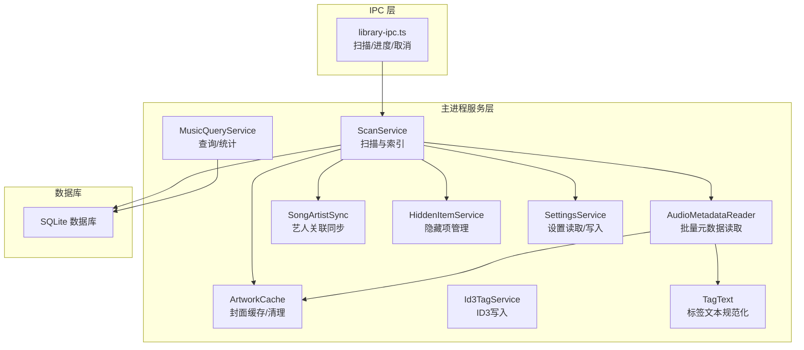
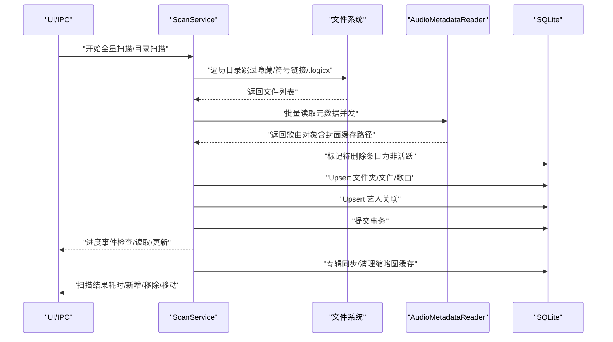
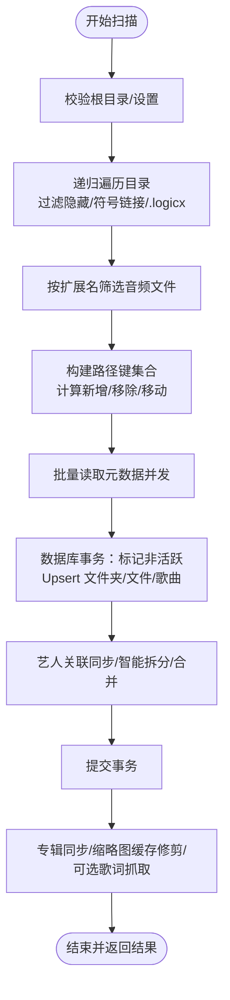
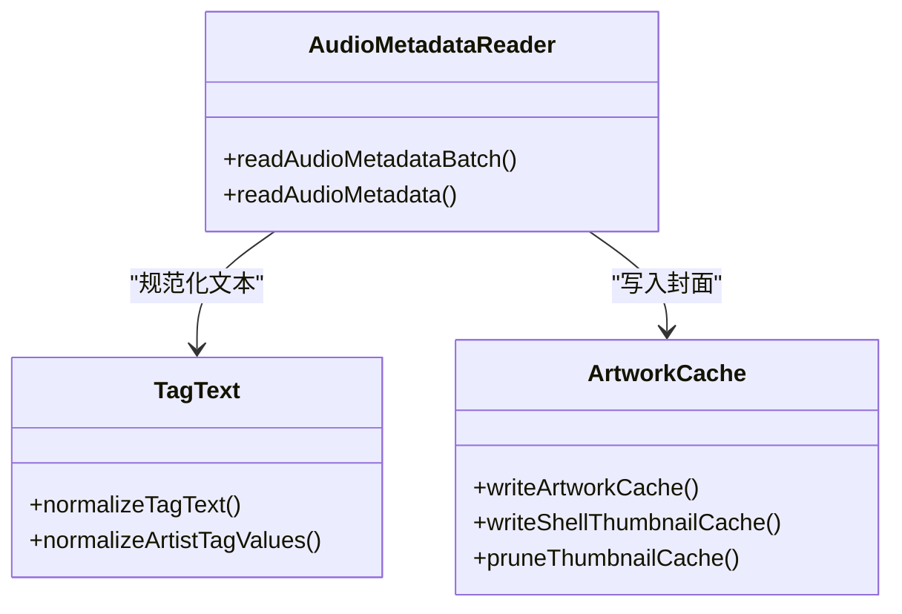
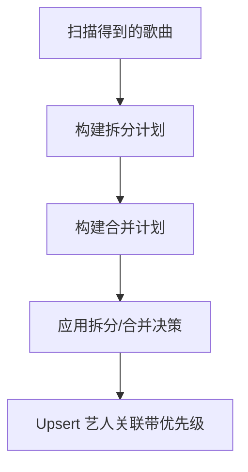
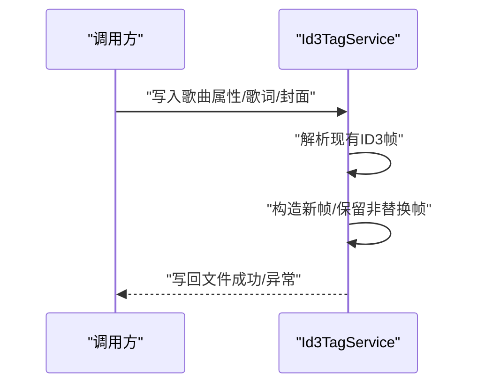
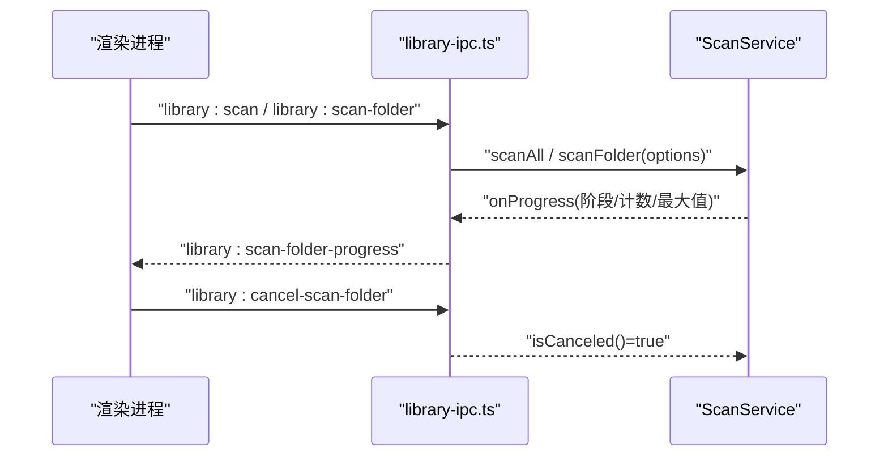
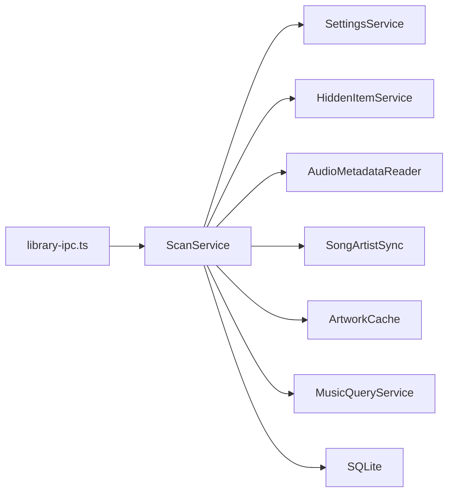

# 扫描服务

<cite>
**本文引用的文件**
- [scan-service.ts](file://electron/services/scan-service.ts)
- [audio-metadata-reader.ts](file://electron/services/audio-metadata-reader.ts)
- [id3-tag-service.ts](file://electron/services/id3-tag-service.ts)
- [constants.ts](file://electron/services/constants.ts)
- [settings-service.ts](file://electron/services/settings-service.ts)
- [artwork-cache.ts](file://electron/services/artwork-cache.ts)
- [tag-text.ts](file://electron/services/tag-text.ts)
- [song-artist-sync.ts](file://electron/services/song-artist-sync.ts)
- [hidden-item-service.ts](file://electron/services/hidden-item-service.ts)
- [music-query-service.ts](file://electron/services/music-query-service.ts)
- [library-ipc.ts](file://electron/ipc/library-ipc.ts)
</cite>

## 目录
1. [简介](#简介)
2. [项目结构](#项目结构)
3. [核心组件](#核心组件)
4. [架构总览](#架构总览)
5. [详细组件分析](#详细组件分析)
6. [依赖关系分析](#依赖关系分析)
7. [性能考量](#性能考量)
8. [故障排查指南](#故障排查指南)
9. [结论](#结论)
10. [附录](#附录)

## 简介
本文件面向 SMPlayer 的扫描服务（ScanService），系统性阐述其音乐文件扫描与索引能力，覆盖文件系统遍历、音乐文件识别、元数据提取、并发与进度控制、重复检测与增量更新、艺术家智能拆分与合并、封面缓存与清理、以及与设置项、隐藏项、歌词自动抓取等模块的集成方式。文档同时提供可操作的性能优化建议、配置项说明与监控调试方法，帮助开发者与运维人员高效维护与扩展扫描能力。

## 项目结构
扫描服务位于 Electron 主进程的服务层，围绕 SQLite 数据库进行文件系统与媒体库的双向同步，并通过 IPC 将进度与结果回传给渲染层 UI。

图示来源
- [scan-service.ts:65-129](file://electron/services/scan-service.ts#L65-L129)
- [audio-metadata-reader.ts:31-105](file://electron/services/audio-metadata-reader.ts#L31-L105)
- [artwork-cache.ts:10-83](file://electron/services/artwork-cache.ts#L10-L83)
- [id3-tag-service.ts:4-121](file://electron/services/id3-tag-service.ts#L4-L121)
- [tag-text.ts:1-133](file://electron/services/tag-text.ts#L1-L133)
- [song-artist-sync.ts:7-38](file://electron/services/song-artist-sync.ts#L7-L38)
- [hidden-item-service.ts:6-160](file://electron/services/hidden-item-service.ts#L6-L160)
- [settings-service.ts:61-179](file://electron/services/settings-service.ts#L61-L179)
- [music-query-service.ts:50-165](file://electron/services/music-query-service.ts#L50-L165)
- [library-ipc.ts:205-250](file://electron/ipc/library-ipc.ts#L205-L250)

章节来源
- [scan-service.ts:65-129](file://electron/services/scan-service.ts#L65-L129)
- [library-ipc.ts:205-250](file://electron/ipc/library-ipc.ts#L205-L250)

## 核心组件
- 扫描器（ScanService）：负责递归遍历、过滤、去重、批量读取元数据、写入数据库、触发专辑同步与缓存清理。
- 元数据读取器（AudioMetadataReader）：基于 music-metadata 解析音频文件，提取标题、艺人、专辑、时长、封面等信息，并生成缩略图缓存路径。
- 艺人同步（SongArtistSync）：将歌曲与艺人多对多关系写入数据库，支持优先级与状态管理。
- 封面缓存（ArtworkCache）：优先使用嵌入式封面，否则回退到系统缩略图；提供缓存修剪以释放空间。
- ID3 写入（Id3TagService）：支持 MP3 文件的标签帧写入（标题、艺人、专辑、曲号、年份、流派、作曲者、发行商、歌词、封面）。
- 设置服务（SettingsService）：提供扫描相关的开关（如“用文件名替代音乐名称”、“智能多艺人识别”、“自动歌词”等）。
- 隐藏项服务（HiddenItemService）：维护用户显式隐藏的文件夹/文件，扫描时跳过或按需降级状态。
- 查询服务（MusicQueryService）：提供库快照、计数、搜索等查询接口，供 UI 使用。

章节来源
- [scan-service.ts:65-129](file://electron/services/scan-service.ts#L65-L129)
- [audio-metadata-reader.ts:13-74](file://electron/services/audio-metadata-reader.ts#L13-L74)
- [song-artist-sync.ts:7-38](file://electron/services/song-artist-sync.ts#L7-L38)
- [artwork-cache.ts:10-83](file://electron/services/artwork-cache.ts#L10-L83)
- [id3-tag-service.ts:4-121](file://electron/services/id3-tag-service.ts#L4-L121)
- [settings-service.ts:18-59](file://electron/services/settings-service.ts#L18-L59)
- [hidden-item-service.ts:6-160](file://electron/services/hidden-item-service.ts#L6-L160)
- [music-query-service.ts:50-165](file://electron/services/music-query-service.ts#L50-L165)

## 架构总览
扫描流程分为三阶段：文件发现（walk）、元数据读取（batch read）、数据库写入（upsert）。期间穿插隐藏项过滤、重复检测、艺人智能拆分/合并、专辑同步与缓存修剪。

图示来源
- [scan-service.ts:131-306](file://electron/services/scan-service.ts#L131-L306)
- [scan-service.ts:366-579](file://electron/services/scan-service.ts#L366-L579)
- [audio-metadata-reader.ts:76-105](file://electron/services/audio-metadata-reader.ts#L76-L105)
- [library-ipc.ts:205-250](file://electron/ipc/library-ipc.ts#L205-L250)

## 详细组件分析

### 扫描算法与流程
- 递归扫描（walk）
  - 遍历当前目录，跳过符号链接、隐藏项、特定后缀（如 .logicx）。
  - 收集子目录与符合条件的音频文件（依据扩展名集合）。
  - 支持取消（isCanceled）与进度回调（onFolder）。
- 文件过滤与隐藏项
  - 通过 HiddenItemService 获取隐藏文件/文件夹列表，避免扫描。
  - 对路径大小写与分隔符进行标准化，确保比较一致性。
- 重复检测与增量更新
  - 基于路径键集合对比，区分新增、移除、移动（同名不同路径）。
  - 目录扫描仅对目标目录范围内的文件进行增量更新。
- 并发读取与进度
  - 使用固定并发度批量读取元数据，边读取边上报进度。
  - 进度事件包含阶段、已处理数量、最大值、新增/更新/缺失计数等。
- 数据写入与事务
  - 开启事务，先标记非活跃条目，再 Upsert 文件夹/文件/歌曲，最后提交。
  - 歌曲写入后同步艺人关联，必要时应用智能艺人拆分/合并。
- 后处理
  - 提交后异步修剪缩略图缓存，避免阻塞 IPC 返回。
  - 可选触发歌词自动抓取（AutoLyrics）。

图示来源
- [scan-service.ts:131-306](file://electron/services/scan-service.ts#L131-L306)
- [scan-service.ts:366-579](file://electron/services/scan-service.ts#L366-L579)
- [scan-service.ts:883-909](file://electron/services/scan-service.ts#L883-L909)
- [scan-service.ts:1424-1436](file://electron/services/scan-service.ts#L1424-L1436)

章节来源
- [scan-service.ts:131-306](file://electron/services/scan-service.ts#L131-L306)
- [scan-service.ts:366-579](file://electron/services/scan-service.ts#L366-L579)
- [scan-service.ts:883-909](file://electron/services/scan-service.ts#L883-L909)
- [scan-service.ts:1424-1436](file://electron/services/scan-service.ts#L1424-L1436)

### 音频元数据处理
- 解析来源：music-metadata，启用时长与封面读取。
- 标题/专辑/艺人规范化：使用 TagText 规范化函数，修复拉丁1摩卡贝克、CJK 字符误码、艺人显示格式等。
- 封面处理：优先写入嵌入式封面缓存，否则回退到系统缩略图；失败则返回空路径。
- 时长估算：优先使用解析到的时长，其次根据比特率与文件大小推导，无法确定时返回 0。
- 文件名回退：当设置为“用文件名替代音乐名称”时，标题为空时回退到无扩展名的文件名。

图示来源
- [audio-metadata-reader.ts:31-105](file://electron/services/audio-metadata-reader.ts#L31-L105)
- [tag-text.ts:7-41](file://electron/services/tag-text.ts#L7-L41)
- [artwork-cache.ts:10-83](file://electron/services/artwork-cache.ts#L10-L83)

章节来源
- [audio-metadata-reader.ts:31-105](file://electron/services/audio-metadata-reader.ts#L31-L105)
- [tag-text.ts:7-41](file://electron/services/tag-text.ts#L7-L41)
- [artwork-cache.ts:10-83](file://electron/services/artwork-cache.ts#L10-L83)

### 艺人智能拆分与合并
- 拆分计划（autoSplits）：从多值艺人数组或可识别的斜杠分隔字符串中提取候选；结合已知艺人库与候选重复模式逐步收敛。
- 合并计划（mergeSuggestions）：统计使用频次与规范化后的艺人名，对包含关系与边界进行判断，选择更优的统一名称。
- 写入策略：优先使用拆分后的艺人数组；若存在合并建议，则写入合并后的艺人名，保证与用户可见的歌曲艺人字符串一致。

图示来源
- [scan-service.ts:911-959](file://electron/services/scan-service.ts#L911-L959)
- [scan-service.ts:973-998](file://electron/services/scan-service.ts#L973-L998)
- [song-artist-sync.ts:26-31](file://electron/services/song-artist-sync.ts#L26-L31)

章节来源
- [scan-service.ts:911-959](file://electron/services/scan-service.ts#L911-L959)
- [scan-service.ts:973-998](file://electron/services/scan-service.ts#L973-L998)
- [song-artist-sync.ts:26-31](file://electron/services/song-artist-sync.ts#L26-L31)

### ID3 标签写入（MP3）
- 支持字段：标题、副标题、艺人、专辑、专辑艺人、发行商、曲号、年份、流派、作曲者。
- 写入逻辑：读取现有 ID3 标签，保留非替换帧，写入新帧，重新写回文件尾部，保留音频数据不变。
- 歌词与封面：支持写入内嵌歌词（USLT/SYLT）与 APIC 帧，按版本差异处理编码与尺寸。

图示来源
- [id3-tag-service.ts:5-121](file://electron/services/id3-tag-service.ts#L5-L121)
- [id3-tag-service.ts:123-237](file://electron/services/id3-tag-service.ts#L123-L237)

章节来源
- [id3-tag-service.ts:5-121](file://electron/services/id3-tag-service.ts#L5-L121)
- [id3-tag-service.ts:123-237](file://electron/services/id3-tag-service.ts#L123-L237)

### IPC 与进度控制
- 提供全量扫描与目录扫描两个入口，支持 operationId 与进度回调。
- 支持取消：通过 isCanceled 判断，抛出统一取消消息。
- 进度事件包含阶段（检查/读取/更新）、已处理/总数、新增/更新/缺失、文件夹统计等。

图示来源
- [library-ipc.ts:205-250](file://electron/ipc/library-ipc.ts#L205-L250)
- [scan-service.ts:1337-1358](file://electron/services/scan-service.ts#L1337-L1358)

章节来源
- [library-ipc.ts:205-250](file://electron/ipc/library-ipc.ts#L205-L250)
- [scan-service.ts:1337-1358](file://electron/services/scan-service.ts#L1337-L1358)

## 依赖关系分析
- 扫描服务依赖设置服务（读取扫描行为）、隐藏项服务（过滤）、元数据读取器（批量解析）、艺人同步（写入关联）、封面缓存（生成/修剪）、查询服务（统计/快照）。
- IPC 层负责接收 UI 请求、传递取消信号、转发进度事件与最终结果。
- 数据库层承担所有持久化工作，采用事务保证一致性。

图示来源
- [library-ipc.ts:205-250](file://electron/ipc/library-ipc.ts#L205-L250)
- [scan-service.ts:65-129](file://electron/services/scan-service.ts#L65-L129)
- [settings-service.ts:61-179](file://electron/services/settings-service.ts#L61-L179)
- [hidden-item-service.ts:6-160](file://electron/services/hidden-item-service.ts#L6-L160)
- [audio-metadata-reader.ts:31-105](file://electron/services/audio-metadata-reader.ts#L31-L105)
- [song-artist-sync.ts:7-38](file://electron/services/song-artist-sync.ts#L7-L38)
- [artwork-cache.ts:10-83](file://electron/services/artwork-cache.ts#L10-L83)
- [music-query-service.ts:50-165](file://electron/services/music-query-service.ts#L50-L165)

章节来源
- [library-ipc.ts:205-250](file://electron/ipc/library-ipc.ts#L205-L250)
- [scan-service.ts:65-129](file://electron/services/scan-service.ts#L65-L129)

## 性能考量
- 并发策略
  - 元数据读取并发度固定，避免过多 IO 抖动；可根据磁盘与 CPU 资源动态调整（当前代码中常量定义）。
- 内存管理
  - 批量读取返回数组，逐批写入数据库；避免一次性加载全部文件到内存。
  - 缓存修剪在后台执行，不阻塞主事务。
- 进度与取消
  - 在关键点检查 isCanceled，及时中断，减少无效工作。
- I/O 优化
  - 路径标准化与键集合用于快速去重与差分，降低数据库查询压力。
  - 仅对目标目录范围进行增量更新（目录扫描）。
- 错误恢复
  - 单个文件解析失败不影响整体扫描；封面回退到系统缩略图，保证可用性。
  - 事务回滚确保数据库一致性。

章节来源
- [audio-metadata-reader.ts:76-105](file://electron/services/audio-metadata-reader.ts#L76-L105)
- [scan-service.ts:1424-1436](file://electron/services/scan-service.ts#L1424-L1436)
- [scan-service.ts:285-288](file://electron/services/scan-service.ts#L285-L288)
- [artwork-cache.ts:29-49](file://electron/services/artwork-cache.ts#L29-L49)

## 故障排查指南
- 常见错误与定位
  - “未选择音乐库文件夹/所选不是目录”：检查设置中的 RootPath 是否有效。
  - “无法访问/文件不存在”：确认权限与路径正确，排除符号链接与隐藏项。
  - “扫描被取消”：检查 operationId 是否被取消，或 isCanceled 回调是否返回真值。
- 日志与监控
  - 通过 library:scan-folder-progress 实时观察阶段与进度。
  - 关注“新增/更新/缺失/移动”计数，辅助判断扫描范围与结果。
- 数据一致性
  - 若出现艺人显示与数据库不一致，检查智能拆分/合并策略与写入优先级。
- 缓存问题
  - 缩略图缓存修剪失败不会影响扫描结果，但可能导致磁盘占用增加；可在空闲时手动清理。

章节来源
- [scan-service.ts:135-142](file://electron/services/scan-service.ts#L135-L142)
- [scan-service.ts:1337-1358](file://electron/services/scan-service.ts#L1337-L1358)
- [library-ipc.ts:205-250](file://electron/ipc/library-ipc.ts#L205-L250)
- [artwork-cache.ts:56-83](file://electron/services/artwork-cache.ts#L56-L83)

## 结论
ScanService 通过清晰的阶段划分、并发控制与事务保障，实现了稳定高效的音乐库扫描与索引。配合隐藏项过滤、智能艺人处理、封面缓存与后台清理，既保证了用户体验，也兼顾了性能与可靠性。建议在生产环境中结合硬件资源与用户习惯，合理配置并发度、扫描范围与日志级别，持续优化扫描体验。

## 附录

### 扫描服务配置项（来自设置）
- 用文件名替代音乐名称：当元数据不可用时回退到文件名作为标题。
- 智能多艺人识别：启用后对艺人字符串进行拆分与合并，提升多艺人展示准确性。
- 自动歌词：扫描完成后异步尝试抓取歌词（网络请求）。
- 根目录：扫描起始路径，由设置服务维护。

章节来源
- [settings-service.ts:18-59](file://electron/services/settings-service.ts#L18-L59)
- [settings-service.ts:208-269](file://electron/services/settings-service.ts#L208-L269)
- [scan-service.ts:194-216](file://electron/services/scan-service.ts#L194-L216)
- [scan-service.ts:432-454](file://electron/services/scan-service.ts#L432-L454)

### 文件类型与扩展名
- 支持的音频扩展名集合用于过滤，确保只扫描受支持的音频文件。

章节来源
- [constants.ts:3-15](file://electron/services/constants.ts#L3-L15)

### 扫描进度与结果字段
- 进度事件包含：阶段、已处理、最大值、文件夹统计、新增/更新/缺失计数、可取消标志。
- 结果包含：根路径、歌曲数、文件夹数、耗时、新增/移除/移动文件列表、艺人拆分/合并建议。

章节来源
- [scan-service.ts:158-216](file://electron/services/scan-service.ts#L158-L216)
- [scan-service.ts:440-453](file://electron/services/scan-service.ts#L440-L453)
- [scan-service.ts:294-305](file://electron/services/scan-service.ts#L294-L305)
- [scan-service.ts:567-578](file://electron/services/scan-service.ts#L567-L578)