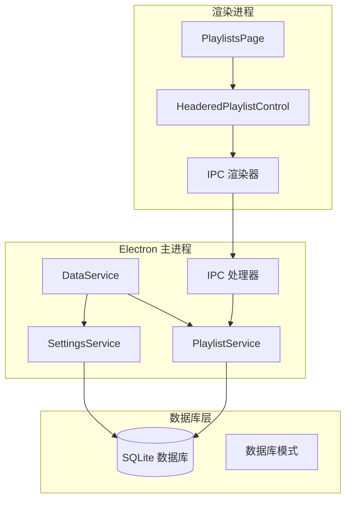
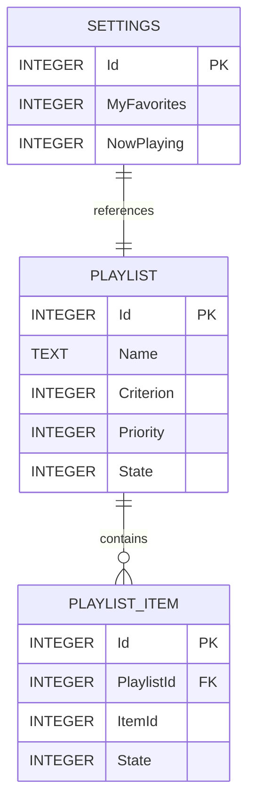
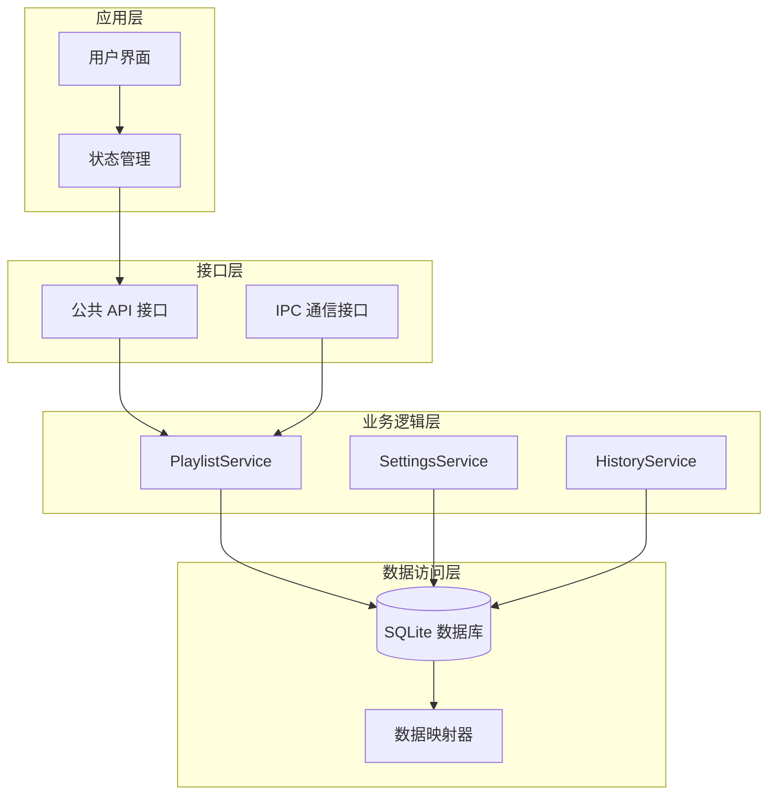
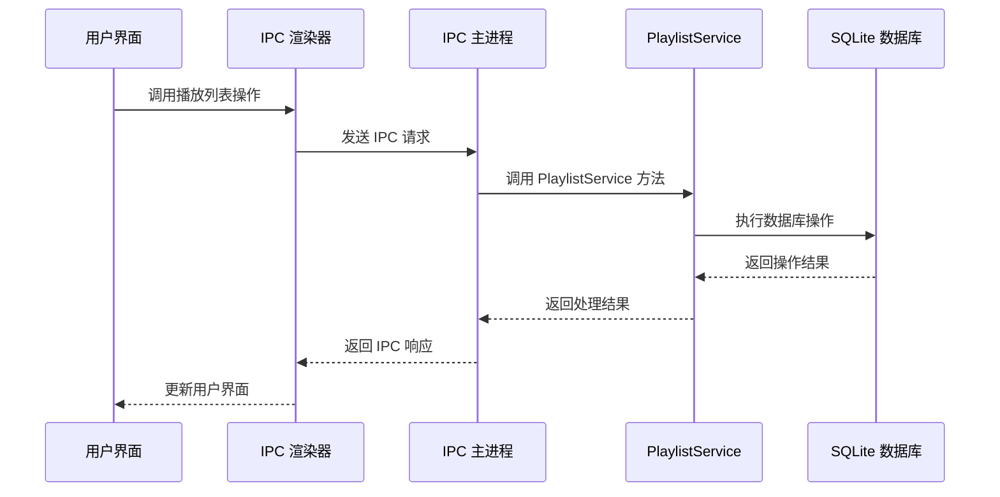
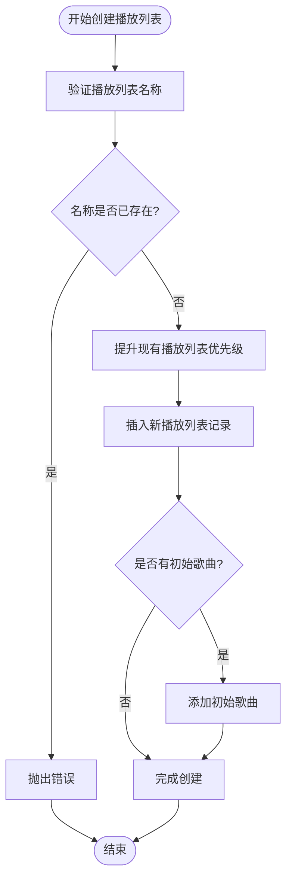
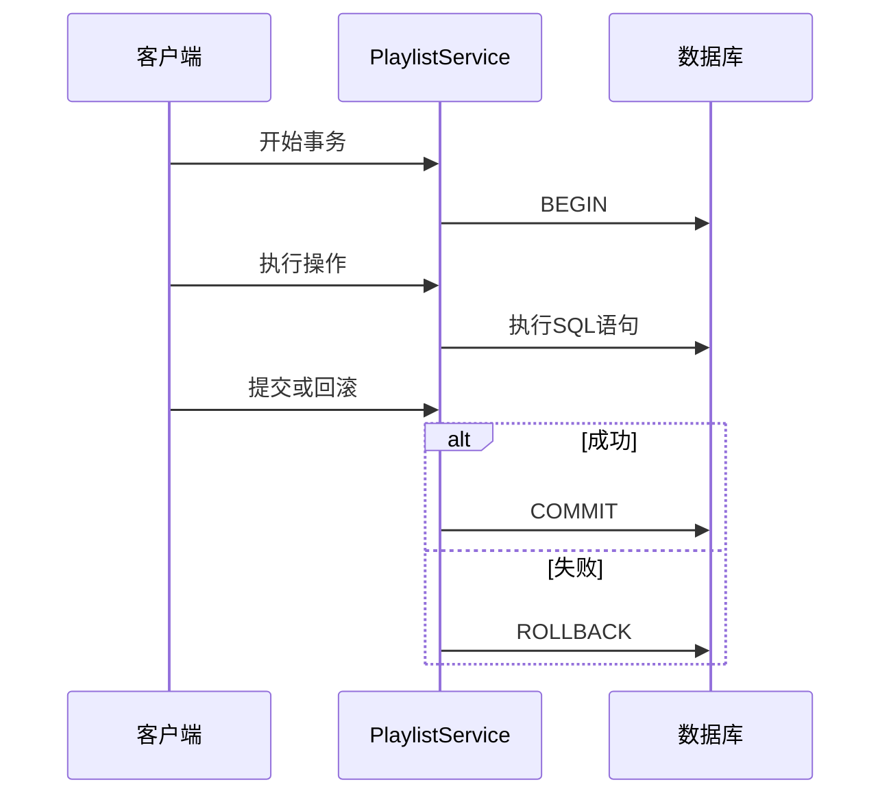
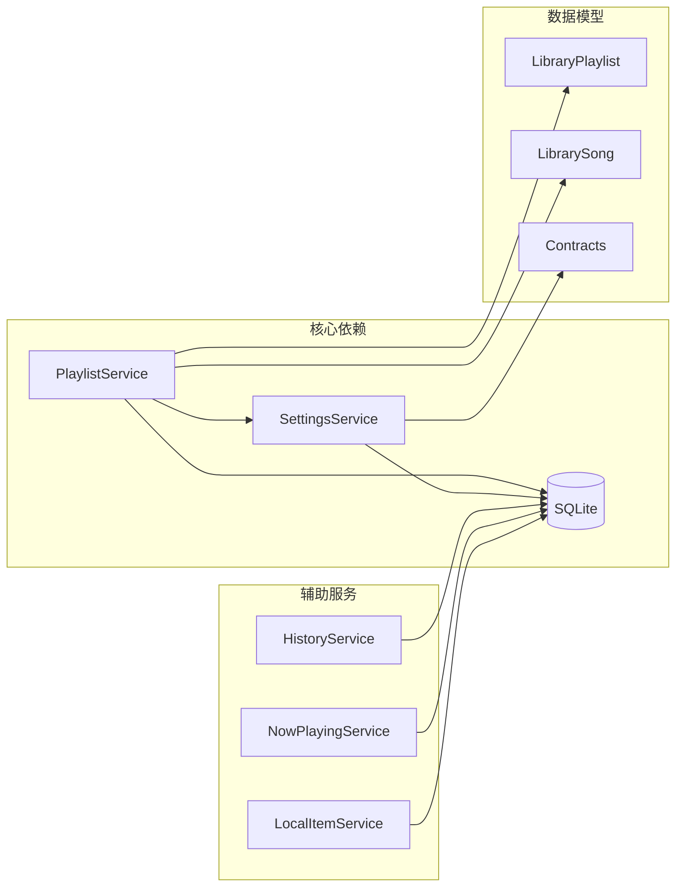

# 播放列表服务

<cite>
**本文档引用的文件**
- [playlist-service.ts](file://electron/services/playlist-service.ts)
- [constants.ts](file://electron/services/constants.ts)
- [settings-service.ts](file://electron/services/settings-service.ts)
- [row-mappers.ts](file://electron/services/row-mappers.ts)
- [schema.ts](file://electron/services/schema.ts)
- [data-service.ts](file://electron/services/data-service.ts)
- [data-ipc.ts](file://electron/ipc/data-ipc.ts)
- [preload.ts](file://electron/preload.ts)
- [contracts.ts](file://src/shared/contracts.ts)
- [PlaylistsPage.tsx](file://src/pages/PlaylistsPage.tsx)
- [MusicDataSourcePlaylistsPage.tsx](file://src/pages/LibraryDataSourcePlaylistsPage.tsx)
- [HeaderedPlaylistControl.tsx](file://src/components/HeaderedPlaylistControl.tsx)
- [playlistNames.ts](file://src/shared/playlistNames.ts)
- [headeredPlaylistModel.ts](file://src/components/headeredPlaylistModel.ts)
</cite>

## 目录
1. [简介](#简介)
2. [项目结构](#项目结构)
3. [核心组件](#核心组件)
4. [架构概览](#架构概览)
5. [详细组件分析](#详细组件分析)
6. [依赖关系分析](#依赖关系分析)
7. [性能考虑](#性能考虑)
8. [故障排除指南](#故障排除指南)
9. [结论](#结论)

## 简介

SMPlayer的播放列表服务是一个完整的音乐播放列表管理系统，负责管理用户创建的自定义播放列表以及内置的特殊播放列表（如我的最爱、正在播放）。该服务提供了完整的CRUD操作、排序功能、持久化机制和状态同步能力。

系统采用Electron架构，后端使用SQLite数据库进行数据持久化，前端通过IPC通信与渲染进程交互。播放列表服务支持实时状态同步、冲突处理和数据完整性保证。

## 项目结构

播放列表服务在项目中的组织结构如下：

**图表来源**
- [data-service.ts:39-145](file://electron/services/data-service.ts#L39-L145)
- [playlist-service.ts:9-25](file://electron/services/playlist-service.ts#L9-L25)
- [data-ipc.ts:20-64](file://electron/ipc/data-ipc.ts#L20-L64)

**章节来源**
- [data-service.ts:39-145](file://electron/services/data-service.ts#L39-L145)
- [schema.ts:133-146](file://electron/services/schema.ts#L133-L146)

## 核心组件

### PlaylistService 类

PlaylistService是播放列表服务的核心类，提供以下主要功能：

#### 数据库操作
- **播放列表 CRUD 操作**：创建、读取、更新、删除播放列表
- **播放列表项管理**：添加、移除、重新排序播放列表项
- **内置播放列表管理**：处理我的最爱、正在播放等特殊播放列表

#### 排序和优先级管理
- **自定义播放列表排序**：支持按优先级排序
- **播放列表项重新排序**：维护播放列表内的歌曲顺序
- **智能排序检测**：自动推断当前播放列表的排序标准

#### 状态管理
- **活动状态跟踪**：使用ACTIVE_STATE常量管理对象状态
- **数据完整性检查**：清理无效的播放列表项
- **事务管理**：确保操作的原子性和一致性

**章节来源**
- [playlist-service.ts:9-508](file://electron/services/playlist-service.ts#L9-L508)
- [constants.ts:17-28](file://electron/services/constants.ts#L17-L28)

### 数据库模式

系统使用标准化的数据库模式来存储播放列表信息：

**图表来源**
- [schema.ts:133-146](file://electron/services/schema.ts#L133-L146)
- [schema.ts:39-83](file://electron/services/schema.ts#L39-L83)

**章节来源**
- [schema.ts:133-146](file://electron/services/schema.ts#L133-L146)
- [row-mappers.ts:8-19](file://electron/services/row-mappers.ts#L8-L19)

## 架构概览

播放列表服务采用分层架构设计，确保职责分离和可维护性：

**图表来源**
- [data-service.ts:39-145](file://electron/services/data-service.ts#L39-L145)
- [contracts.ts:527-663](file://src/shared/contracts.ts#L527-L663)

### IPC 通信流程

播放列表操作通过IPC机制在主进程和渲染进程间传递：

**图表来源**
- [data-ipc.ts:37-64](file://electron/ipc/data-ipc.ts#L37-L64)
- [preload.ts:184-198](file://electron/preload.ts#L184-L198)

**章节来源**
- [data-ipc.ts:20-151](file://electron/ipc/data-ipc.ts#L20-L151)
- [preload.ts:163-232](file://electron/preload.ts#L163-L232)

## 详细组件分析

### 播放列表创建和管理

#### 创建自定义播放列表
创建新播放列表时，系统执行以下步骤：

1. **名称验证**：检查播放列表名称是否有效且唯一
2. **优先级调整**：为现有播放列表提升优先级
3. **数据库插入**：向Playlist表插入新记录
4. **初始项设置**：如果提供歌曲ID，立即设置播放列表项

**图表来源**
- [playlist-service.ts:171-201](file://electron/services/playlist-service.ts#L171-L201)

#### 删除播放列表
删除操作采用软删除策略，保护内置播放列表：

1. **权限检查**：禁止删除内置播放列表（我的最爱、正在播放）
2. **状态更新**：将播放列表状态设为非活跃
3. **项清理**：标记所有播放列表项为非活跃状态

**章节来源**
- [playlist-service.ts:203-219](file://electron/services/playlist-service.ts#L203-L219)

### 播放列表项管理

#### 添加歌曲到播放列表
添加歌曲操作支持单个和批量添加：

1. **去重处理**：使用唯一性算法去除重复歌曲ID
2. **状态更新**：将现有匹配项标记为非活跃
3. **插入新项**：为每个唯一歌曲ID插入新的播放列表项

#### 重新排序播放列表
重新排序功能确保播放列表内歌曲顺序的准确性：

1. **完整性检查**：验证请求的歌曲集合完整性
2. **状态重置**：将所有播放列表项标记为非活跃
3. **有序插入**：使用WITH子句和有序插入确保正确顺序

**章节来源**
- [playlist-service.ts:338-406](file://electron/services/playlist-service.ts#L338-L406)

### 内置播放列表管理

系统维护两个重要的内置播放列表：

#### 我的最爱播放列表
- **自动创建**：应用启动时自动初始化
- **歌曲管理**：通过setSongsFavorite方法管理收藏歌曲
- **特殊标识**：isBuiltIn标志表明其内置性质

#### 正在播放播放列表
- **动态内容**：基于当前播放队列
- **优先级管理**：使用PLAYLIST_NAMES常量标识
- **状态同步**：与播放器状态保持同步

**章节来源**
- [constants.ts:17-20](file://electron/services/constants.ts#L17-L20)
- [settings-service.ts:181-187](file://electron/services/settings-service.ts#L181-L187)

### 数据持久化机制

#### 事务管理
所有播放列表操作都在事务中执行，确保数据一致性：

**图表来源**
- [playlist-service.ts:175-200](file://electron/services/playlist-service.ts#L175-L200)

#### 状态同步
系统通过ACTIVE_STATE常量管理对象状态：

| 状态值 | 含义 | 用途 |
|--------|------|------|
| -2 | parentHidden | 父级隐藏状态 |
| -1 | hidden | 隐藏状态 |
| 0 | inactive | 非活跃状态 |
| 1 | active | 活跃状态 |

**章节来源**
- [constants.ts:22-27](file://electron/services/constants.ts#L22-L27)

### 错误处理和冲突解决

#### 冲突检测
系统实现了多层冲突检测机制：

1. **名称冲突**：防止重复的播放列表名称
2. **外键约束**：确保播放列表和歌曲的关联有效性
3. **状态一致性**：维护播放列表项与其父播放列表的状态同步

#### 异常处理
所有数据库操作都包含适当的异常处理：

- **事务回滚**：在发生错误时自动回滚事务
- **错误传播**：将底层错误转换为有意义的应用层错误
- **资源清理**：确保数据库连接和资源得到正确释放

**章节来源**
- [playlist-service.ts:412-419](file://electron/services/playlist-service.ts#L412-L419)

## 依赖关系分析

### 组件耦合度

播放列表服务的组件间依赖关系如下：

**图表来源**
- [data-service.ts:39-145](file://electron/services/data-service.ts#L39-L145)
- [contracts.ts:83-91](file://src/shared/contracts.ts#L83-L91)

### 外部依赖

系统依赖的关键外部组件：

1. **Node SQLite**：提供高性能的本地数据库支持
2. **Electron IPC**：实现主进程和渲染进程间的通信
3. **React**：构建用户界面和状态管理
4. **TypeScript**：提供类型安全和开发体验

**章节来源**
- [data-service.ts:1-22](file://electron/services/data-service.ts#L1-L22)

## 性能考虑

### 查询优化

#### 索引策略
系统使用了多个关键索引来优化查询性能：

1. **播放列表索引**：优化播放列表名称和状态查询
2. **播放列表项索引**：加速播放列表项的查找和关联
3. **音乐表索引**：支持快速的歌曲检索和搜索

#### 查询优化技术
- **预编译语句**：减少SQL解析开销
- **批量操作**：使用IN子句和VALUES子句进行批量插入
- **条件优化**：合理使用WHERE子句和JOIN条件

### 内存管理

#### 对象池模式
系统采用对象池模式管理播放列表项，减少内存分配：

1. **预分配**：预先创建常用对象实例
2. **复用机制**：重用已分配的对象实例
3. **垃圾回收**：定期清理不再使用的对象

#### 流式处理
对于大量数据的操作，系统采用流式处理方式：

- **分页查询**：避免一次性加载大量数据
- **增量处理**：逐步处理大数据集
- **内存监控**：实时监控内存使用情况

### 缓存策略

#### 结果缓存
系统实现了多层次的结果缓存：

1. **查询结果缓存**：缓存常用的查询结果
2. **元数据缓存**：缓存播放列表的统计信息
3. **配置缓存**：缓存用户偏好设置

#### 缓存失效策略
- **时间驱动**：基于时间的缓存过期
- **事件驱动**：基于数据变更的缓存更新
- **LRU淘汰**：基于最近最少使用的淘汰策略

## 故障排除指南

### 常见问题诊断

#### 播放列表无法创建
可能的原因和解决方案：

1. **名称冲突**
   - 检查播放列表名称是否已被使用
   - 使用getNextPlaylistName生成唯一名称

2. **数据库锁定**
   - 确认没有其他进程访问数据库
   - 检查文件权限和路径

3. **内存不足**
   - 监控系统内存使用情况
   - 实施分批处理策略

#### 播放列表项丢失
数据完整性问题的排查步骤：

1. **检查状态字段**
   - 验证PlaylistItem.State是否为active
   - 确认关联的Music记录状态正常

2. **验证外键约束**
   - 检查PlaylistId和ItemId的有效性
   - 确认不存在孤立的数据记录

3. **事务回滚检查**
   - 确认所有操作都在事务中执行
   - 检查异常处理是否正确

### 调试工具

#### 日志记录
系统提供了详细的日志记录功能：

1. **操作日志**：记录所有播放列表操作
2. **性能指标**：监控查询执行时间和资源使用
3. **错误追踪**：捕获和报告异常信息

#### 监控仪表板
提供实时监控功能：

- **数据库状态**：显示连接数和查询性能
- **内存使用**：监控内存分配和垃圾回收
- **磁盘I/O**：跟踪文件读写操作

**章节来源**
- [playlist-service.ts:421-435](file://electron/services/playlist-service.ts#L421-L435)

## 结论

SMPlayer的播放列表服务提供了一个完整、高效且可靠的音乐播放列表管理系统。通过精心设计的架构、完善的错误处理机制和优化的性能策略，该服务能够满足现代音乐应用的各种需求。

### 主要优势

1. **数据完整性**：通过事务管理和状态同步确保数据一致性
2. **性能优化**：采用多种优化技术提升查询和操作性能
3. **可扩展性**：模块化的架构设计便于功能扩展和维护
4. **用户体验**：提供流畅的用户界面和响应式操作反馈

### 技术亮点

- **事务安全性**：所有操作都在事务中执行，确保原子性
- **智能缓存**：多层次的缓存策略提升性能表现
- **错误恢复**：完善的异常处理和恢复机制
- **状态同步**：实时的状态同步和冲突解决

该播放列表服务为SMPlayer提供了坚实的基础，支持各种复杂的播放列表操作和管理功能，为用户提供了优秀的音乐播放体验。