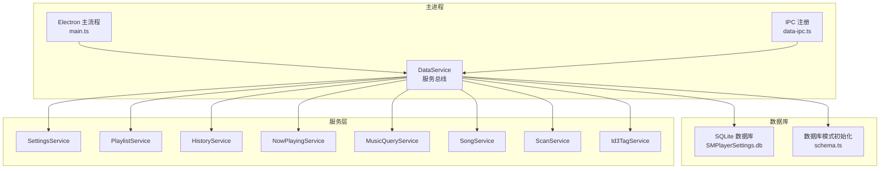
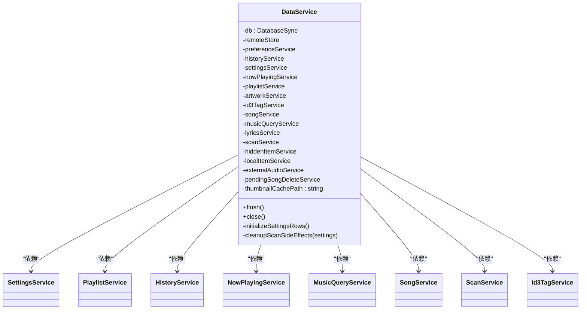
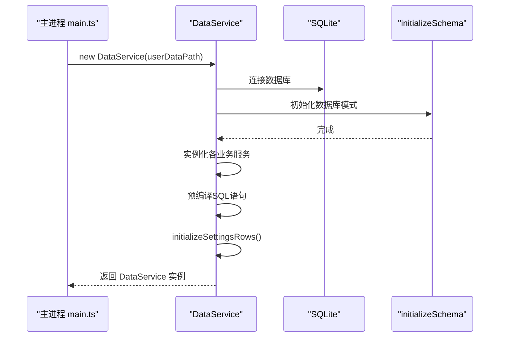
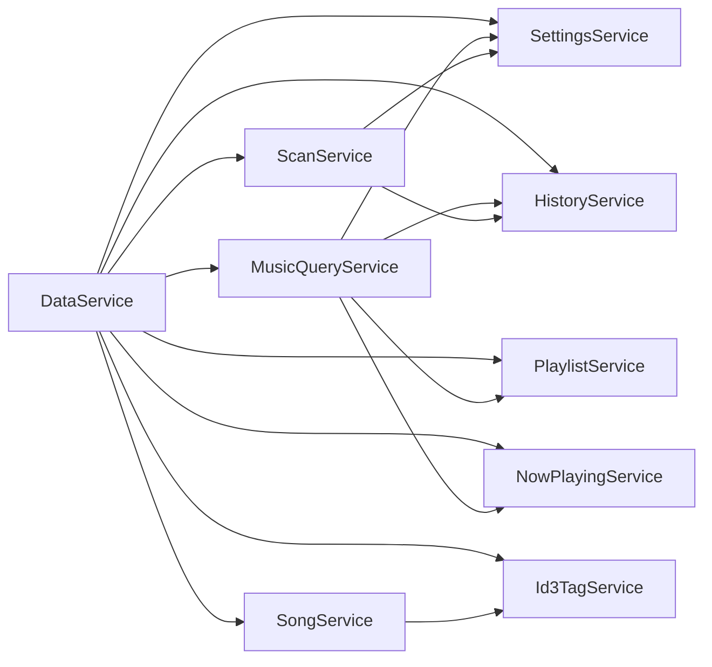
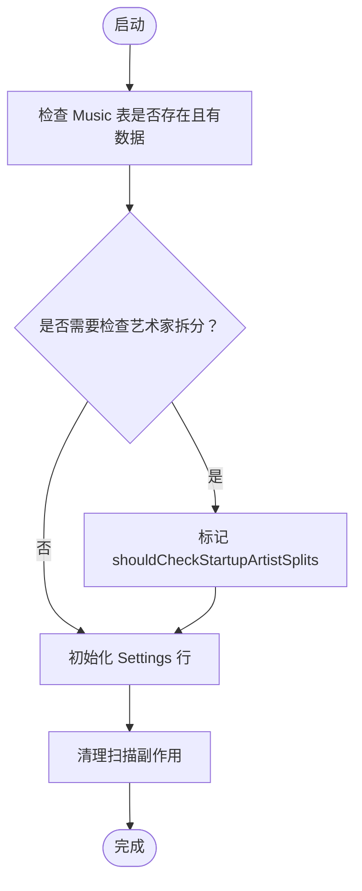
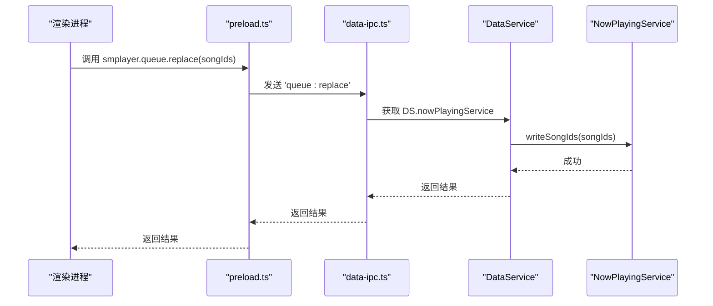
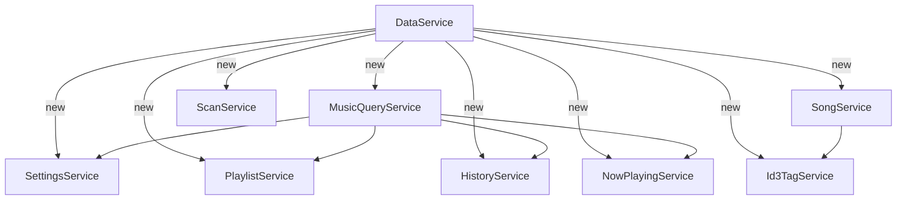

# 数据服务总线

<cite>
**本文引用的文件**
- [electron\services\data-service.ts](file://electron/services/data-service.ts)
- [electron\services\schema.ts](file://electron/services/schema.ts)
- [electron\services\constants.ts](file://electron/services/constants.ts)
- [electron\services\settings-service.ts](file://electron/services/settings-service.ts)
- [electron\services\playlist-service.ts](file://electron/services/playlist-service.ts)
- [electron\services\song-service.ts](file://electron/services/song-service.ts)
- [electron\services\history-service.ts](file://electron/services/history-service.ts)
- [electron\services\now-playing-service.ts](file://electron/services/now-playing-service.ts)
- [electron\services\music-query-service.ts](file://electron/services/music-query-service.ts)
- [electron\services\scan-service.ts](file://electron/services/scan-service.ts)
- [electron\services\id3-tag-service.ts](file://electron/services/id3-tag-service.ts)
- [electron\ipc\data-ipc.ts](file://electron/ipc/data-ipc.ts)
- [electron\main.ts](file://electron/main.ts)
- [electron\preload.ts](file://electron/preload.ts)
</cite>

## 目录
1. [简介](#简介)
2. [项目结构](#项目结构)
3. [核心组件](#核心组件)
4. [架构总览](#架构总览)
5. [详细组件分析](#详细组件分析)
6. [依赖关系分析](#依赖关系分析)
7. [性能考量](#性能考量)
8. [故障排查指南](#故障排查指南)
9. [结论](#结论)
10. [附录：扩展与最佳实践](#附录扩展与最佳实践)

## 简介
本文件围绕 SMPlayer 的“数据服务总线”（DataService）进行系统化文档化，目标是帮助开发者全面理解其在应用中的核心地位：作为统一的服务容器，协调并管理所有业务服务模块的初始化、生命周期与协作关系；同时覆盖数据库连接管理、依赖注入机制、初始化流程、服务间通信与数据共享方式，并给出扩展新服务模块、调整配置与优化性能的实操建议。

## 项目结构
DataService 位于 Electron 主进程的服务层，负责：
- 初始化 SQLite 数据库与表结构
- 构造并装配各类业务服务实例
- 提供统一的访问入口与生命周期管理（刷新与关闭）
- 通过 IPC 暴露给渲染进程调用

图表来源
- [electron\services\data-service.ts:39-145](file://electron/services/data-service.ts#L39-L145)
- [electron\services\schema.ts:33-260](file://electron/services/schema.ts#L33-L260)
- [electron\ipc\data-ipc.ts:20-151](file://electron/ipc/data-ipc.ts#L20-L151)
- [electron\main.ts:141-209](file://electron/main.ts#L141-L209)

章节来源
- [electron\services\data-service.ts:39-145](file://electron/services/data-service.ts#L39-L145)
- [electron\services\schema.ts:33-260](file://electron/services/schema.ts#L33-L260)
- [electron\main.ts:141-209](file://electron/main.ts#L141-L209)

## 核心组件
- 数据服务总线（DataService）
  - 职责：集中式服务容器，负责数据库连接、模式初始化、服务装配与生命周期管理
  - 关键字段：数据库句柄、各业务服务实例、预编译语句、缩略图缓存路径等
  - 生命周期：构造时完成初始化；提供 flush 与 close 以持久化与释放资源
- 数据库模式（initializeSchema）
  - 职责：创建/迁移数据库表与索引，确保版本兼容性
- 常量定义（constants）
  - 职责：提供数据库文件名、播放列表名称、状态常量等
- 服务层（按职责划分）
  - 设置服务（SettingsService）：应用设置、视图状态、播放状态持久化
  - 播放列表服务（PlaylistService）：内置/自定义播放列表、歌曲项管理
  - 历史记录服务（HistoryService）：搜索历史、最近播放、偏好项
  - 正在播放服务（NowPlayingService）：队列持久化（本地 JSON）与读取
  - 音乐查询服务（MusicQueryService）：聚合查询、统计、壳快照
  - 歌曲服务（SongService）：歌曲属性读写、元数据解析、艺术家同步
  - 扫描服务（ScanService）：全库扫描、批量元数据读取、副作用清理
  - ID3 标签服务（Id3TagService）：MP3 标签/歌词/封面写入
  - 其他：远程存储、隐藏项、外部音频、待删歌曲等

章节来源
- [electron\services\data-service.ts:39-145](file://electron/services/data-service.ts#L39-L145)
- [electron\services\schema.ts:33-260](file://electron/services/schema.ts#L33-L260)
- [electron\services\constants.ts:1-28](file://electron/services/constants.ts#L1-L28)
- [electron\services\settings-service.ts:61-187](file://electron/services/settings-service.ts#L61-L187)
- [electron\services\playlist-service.ts:9-145](file://electron/services/playlist-service.ts#L9-L145)
- [electron\services\history-service.ts:30-182](file://electron/services/history-service.ts#L30-L182)
- [electron\services\now-playing-service.ts:6-48](file://electron/services/now-playing-service.ts#L6-L48)
- [electron\services\music-query-service.ts:50-165](file://electron/services/music-query-service.ts#L50-L165)
- [electron\services\song-service.ts:17-56](file://electron/services/song-service.ts#L17-L56)
- [electron\services\scan-service.ts:65-129](file://electron/services/scan-service.ts#L65-L129)
- [electron\services\id3-tag-service.ts:4-55](file://electron/services/id3-tag-service.ts#L4-L55)

## 架构总览
DataService 是应用的“服务容器”，承担以下关键职责：
- 数据库连接与模式初始化
- 服务依赖注入与实例化顺序控制
- 启动时的设置行初始化与副作用清理
- 统一的生命周期管理（flush/commit 与 close）

图表来源
- [electron\services\data-service.ts:39-145](file://electron/services/data-service.ts#L39-L145)

章节来源
- [electron\services\data-service.ts:39-145](file://electron/services/data-service.ts#L39-L145)

## 详细组件分析

### 数据服务总线（DataService）构造与初始化
- 构造函数参数
  - userDataPath: 用户数据目录，用于定位数据库文件与缓存路径
- 初始化流程
  - 创建数据库连接（SQLite）
  - 判断音乐表是否存在，决定是否需要检查艺术家拆分场景
  - 执行数据库模式初始化（WAL、外键、表与索引）
  - 逐个实例化各业务服务，并注入必要的依赖（如 SettingsService、数据库句柄）
  - 预编译常用 SQL 语句，减少运行时开销
  - 初始化设置行（若不存在则插入默认行）
  - 注册扫描副作用清理回调
- 生命周期
  - flush：触发 WAL 强制检查点，保证数据落盘
  - close：先 flush 再关闭数据库连接

图表来源
- [electron\services\data-service.ts:64-145](file://electron/services/data-service.ts#L64-L145)
- [electron\services\schema.ts:33-260](file://electron/services/schema.ts#L33-L260)
- [electron\main.ts:141-150](file://electron/main.ts#L141-L150)

章节来源
- [electron\services\data-service.ts:64-145](file://electron/services/data-service.ts#L64-L145)
- [electron\services\schema.ts:33-260](file://electron/services/schema.ts#L33-L260)
- [electron\main.ts:141-150](file://electron/main.ts#L141-L150)

### 数据库连接管理与模式演进
- 连接与参数
  - 使用 SQLite 同步驱动，启用 WAL 模式、正常同步级别、外键约束
- 表与索引
  - Settings、Music、Album、MusicArtist、Folder、File、Playlist、PlaylistItem、PreferenceSetting、PreferenceItem、RecentRecord、SearchState、SearchHistory、HiddenStorageItem、RemoteSetting、AuthorizedDevice、RemoteHost 等
  - 多处唯一/非唯一索引，保障查询效率与数据一致性
- 模式演进
  - 动态检测列是否存在，按需新增或重命名列
  - 对历史数据进行迁移与补全（如从旧表字段映射到新字段）
  - 重建/修正索引，确保查询稳定性

章节来源
- [electron\services\schema.ts:33-260](file://electron/services/schema.ts#L33-L260)
- [electron\services\schema.ts:262-360](file://electron/services/schema.ts#L262-L360)

### 服务依赖注入与协作模式
- 依赖注入
  - DataService 在构造阶段直接 new 各服务实例，并传入数据库句柄与必要依赖（如 SettingsService）
  - 部分服务通过回调注入（如 ScanService 的副作用清理回调）
- 协作模式
  - MusicQueryService 聚合 Settings/History/Playlist/NowPlaying 等服务，提供统一的壳快照与查询接口
  - SongService 与 Id3TagService 协作，实现歌曲属性写入与标签更新
  - NowPlayingService 与 PlaylistService/SettingsService 协作，维护播放队列与恢复状态
  - ScanService 与 SettingsService/HiddenItemService/ArtworkService 协作，执行扫描与副作用清理

图表来源
- [electron\services\data-service.ts:73-142](file://electron/services/data-service.ts#L73-L142)
- [electron\services\music-query-service.ts:63-74](file://electron/services/music-query-service.ts#L63-L74)

章节来源
- [electron\services\data-service.ts:73-142](file://electron/services/data-service.ts#L73-L142)
- [electron\services\music-query-service.ts:63-74](file://electron/services/music-query-service.ts#L63-L74)

### 初始化流程与启动检查
- 启动时的艺术家拆分检查
  - 若音乐表存在且有数据、但尚未生成音乐-艺人关联表，则标记需要检查拆分
- 设置行初始化
  - 若 Settings 表无记录，插入默认行，并创建内置播放列表（如“我的收藏”）
- 扫描副作用清理
  - 校验上次播放列表有效性，修正播放恢复状态（索引与进度）
  - 清理无效播放项与最近播放记录

图表来源
- [electron\services\data-service.ts:64-71](file://electron/services/data-service.ts#L64-L71)
- [electron\services\data-service.ts:156-195](file://electron/services/data-service.ts#L156-L195)

章节来源
- [electron\services\data-service.ts:64-71](file://electron/services/data-service.ts#L64-L71)
- [electron\services\data-service.ts:156-195](file://electron/services/data-service.ts#L156-L195)

### 通过 DataService 访问子服务
- 渲染进程通过 IPC 调用，IPC 层转发至 DataService 的具体服务实例
- 示例：播放队列替换、搜索历史、设置更新、播放器即时设置等

图表来源
- [electron\preload.ts:199-201](file://electron/preload.ts#L199-L201)
- [electron\ipc\data-ipc.ts:65-69](file://electron/ipc/data-ipc.ts#L65-L69)
- [electron\services\now-playing-service.ts:72-93](file://electron/services/now-playing-service.ts#L72-L93)

章节来源
- [electron\preload.ts:199-201](file://electron/preload.ts#L199-L201)
- [electron\ipc\data-ipc.ts:65-69](file://electron/ipc/data-ipc.ts#L65-L69)
- [electron\services\now-playing-service.ts:72-93](file://electron/services/now-playing-service.ts#L72-L93)

## 依赖关系分析
- 低耦合高内聚
  - DataService 将各服务解耦，仅通过构造函数注入所需依赖
  - MusicQueryService 作为聚合层，向上提供统一接口，向下依赖多个服务
- 循环依赖规避
  - 通过回调注入（如 ScanService 的副作用清理回调）避免循环引用
- 外部依赖
  - SQLite 同步驱动、文件系统、第三方元数据解析库

图表来源
- [electron\services\data-service.ts:73-142](file://electron/services/data-service.ts#L73-L142)
- [electron\services\music-query-service.ts:63-74](file://electron/services/music-query-service.ts#L63-L74)

章节来源
- [electron\services\data-service.ts:73-142](file://electron/services/data-service.ts#L73-L142)
- [electron\services\music-query-service.ts:63-74](file://electron/services/music-query-service.ts#L63-L74)

## 性能考量
- 数据库参数
  - WAL 模式提升并发读写能力
  - 正常同步级别在可靠性与性能之间取得平衡
  - 启用外键约束保障数据一致性
- 预编译语句
  - DataService 在构造阶段预编译常用 SQL，降低运行时编译开销
- 查询优化
  - schema 中大量唯一/非唯一索引，覆盖常见查询条件
  - MusicQueryService 使用 JOIN 与 LIMIT 控制返回规模
- 扫描与并发
  - 扫描服务使用批量元数据读取与并发限制，避免阻塞主线程
- 缓存策略
  - 缩略图缓存路径集中管理，扫描服务中进行缓存修剪

章节来源
- [electron\services\schema.ts:33-260](file://electron/services/schema.ts#L33-L260)
- [electron\services\data-service.ts:102-119](file://electron/services/data-service.ts#L102-L119)
- [electron\services\scan-service.ts:14-17](file://electron/services/scan-service.ts#L14-L17)

## 故障排查指南
- 数据库未初始化或表缺失
  - 确认 initializeSchema 是否成功执行，检查 WAL/外键参数是否生效
- 启动后播放队列异常
  - 检查 NowPlayingService 的 JSON 文件是否存在与可读写
  - 核对 DataService 的副作用清理逻辑是否正确修正 LastPlaylist 与播放进度
- 设置更新不生效
  - 确认 SettingsService 的更新语句是否被调用，以及 IPC 层是否正确转发
- 扫描卡顿或失败
  - 检查扫描并发与取消标志，确认磁盘权限与隐藏项过滤
- 标签写入失败
  - 确认文件格式支持（当前仅 MP3），检查 ID3TagService 的写入流程

章节来源
- [electron\services\data-service.ts:156-195](file://electron/services/data-service.ts#L156-L195)
- [electron\services\now-playing-service.ts:95-102](file://electron/services/now-playing-service.ts#L95-L102)
- [electron\services\settings-service.ts:181-187](file://electron/services/settings-service.ts#L181-L187)
- [electron\services\scan-service.ts:131-173](file://electron/services/scan-service.ts#L131-L173)
- [electron\services\id3-tag-service.ts:20-22](file://electron/services/id3-tag-service.ts#L20-L22)

## 结论
DataService 作为 SMPlayer 的核心服务容器，通过明确的依赖注入与严格的初始化流程，将数据库连接、模式管理与多类业务服务有机整合。它不仅提供了统一的生命周期管理，还通过 IPC 与渲染进程形成清晰的调用链路。遵循本文的扩展与最佳实践，可在保持低耦合的前提下安全地引入新服务模块并持续优化性能与稳定性。

## 附录：扩展与最佳实践

### 如何添加新的服务模块
- 设计服务接口
  - 明确服务职责与对外暴露的方法
  - 评估是否需要数据库访问与依赖注入
- 在 DataService 中注册
  - 在构造函数中实例化服务并注入所需依赖
  - 如需回调注入，参考 ScanService 的方式
- 在 IPC 中暴露接口
  - 在 data-ipc.ts 中添加对应的 handle/on 处理器
  - 通过 options.getLibraryService() 获取 DataService 实例
- 在 preload.ts 中声明 API
  - 在 SmplayerApi 类型中增加新方法签名
  - 在上下文中桥接 exposeInMainWorld('smplayer', api)

章节来源
- [electron\services\data-service.ts:73-142](file://electron/services/data-service.ts#L73-L142)
- [electron\ipc\data-ipc.ts:20-151](file://electron/ipc/data-ipc.ts#L20-L151)
- [electron\preload.ts:45-284](file://electron/preload.ts#L45-L284)

### 修改现有服务配置
- 数据库模式变更
  - 在 schema.ts 中新增/修改表或列定义
  - 使用 columnExists/renameColumnIfPresent 确保向后兼容
- 服务初始化顺序
  - 将强依赖的服务放在前面实例化，弱依赖或可选服务延后
- 配置项扩展
  - 在 SettingsService 中新增字段与对应 SQL 更新语句
  - 在 MusicQueryService 中补充聚合查询或统计

章节来源
- [electron\services\schema.ts:262-322](file://electron/services/schema.ts#L262-L322)
- [electron\services\settings-service.ts:118-178](file://electron/services/settings-service.ts#L118-L178)
- [electron\services\music-query-service.ts:167-179](file://electron/services/music-query-service.ts#L167-L179)

### 服务初始化顺序与依赖管理
- 优先级建议
  - SettingsService → PlaylistService（依赖设置行）→ MusicQueryService（依赖多个服务）→ 其余服务
- 回调注入
  - 对于跨服务副作用清理（如扫描后清理无效项），采用回调注入避免循环依赖
- 预编译语句
  - 将高频查询语句在构造阶段预编译，减少运行时开销

章节来源
- [electron\services\data-service.ts:133-142](file://electron/services/data-service.ts#L133-L142)
- [electron\services\data-service.ts:102-119](file://electron/services/data-service.ts#L102-L119)

### 数据库连接优化与监控
- 参数调优
  - WAL 模式与外键约束已启用，可根据实际负载调整同步级别
- 连接复用
  - DataService 单例持有数据库连接，避免重复打开/关闭
- 性能监控
  - 使用 SQLite PRAGMA 查询与 EXPLAIN QUERY PLAN 分析慢查询
  - 在关键路径（扫描、查询）埋点统计耗时

章节来源
- [electron\services\schema.ts:35-37](file://electron/services/schema.ts#L35-L37)
- [electron\services\data-service.ts:147-154](file://electron/services/data-service.ts#L147-L154)