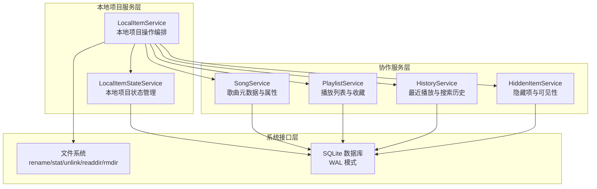
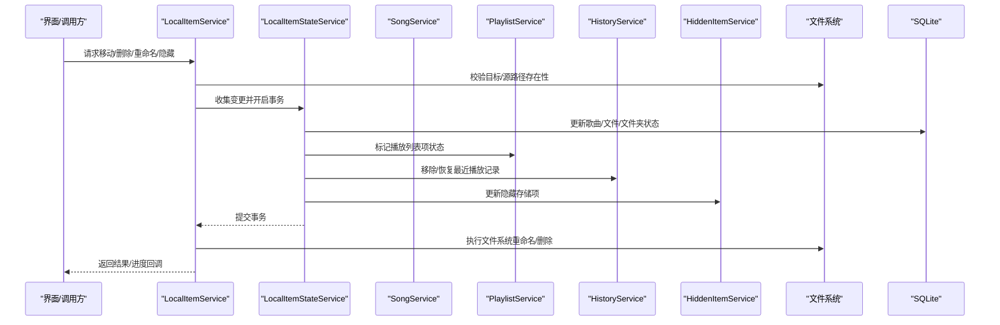
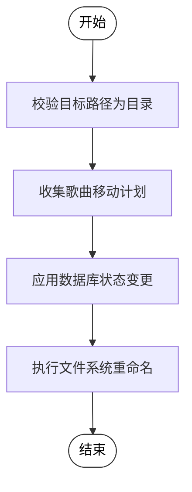
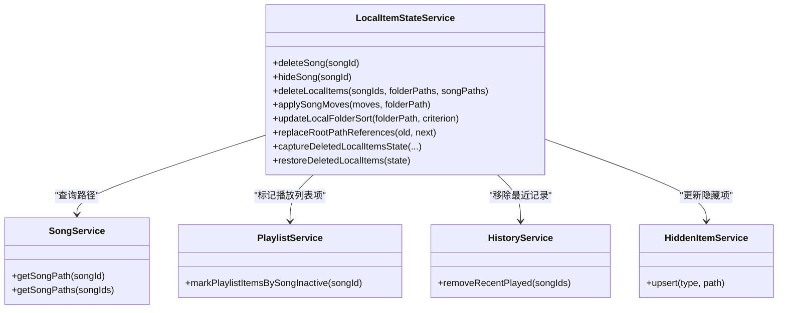
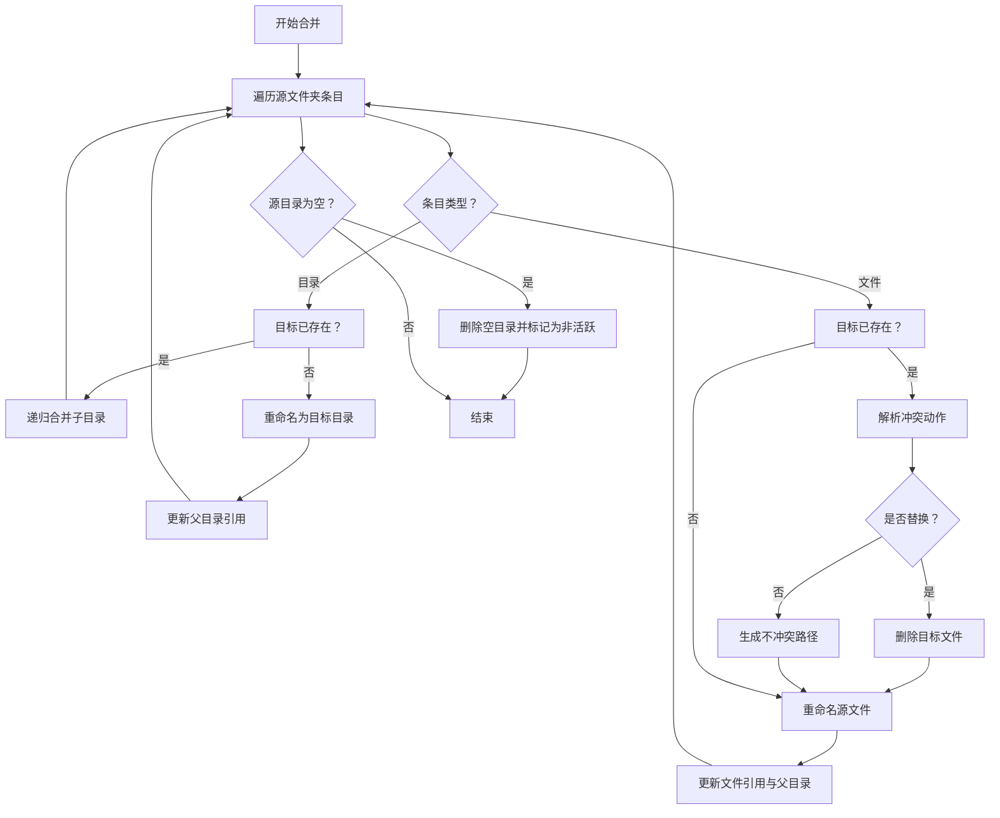
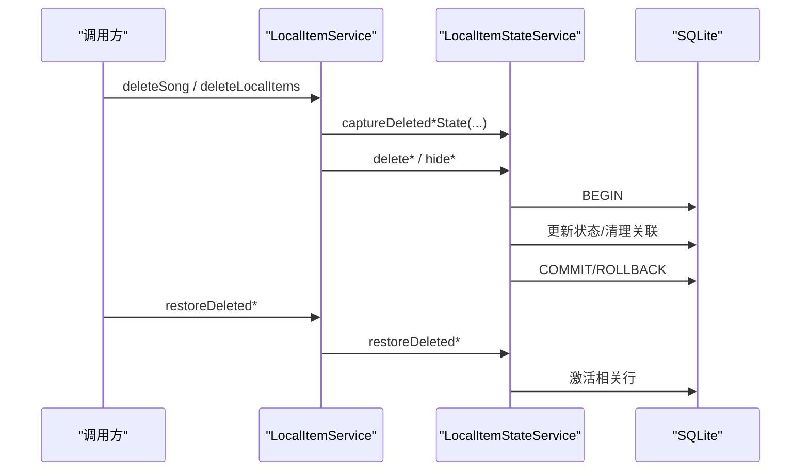
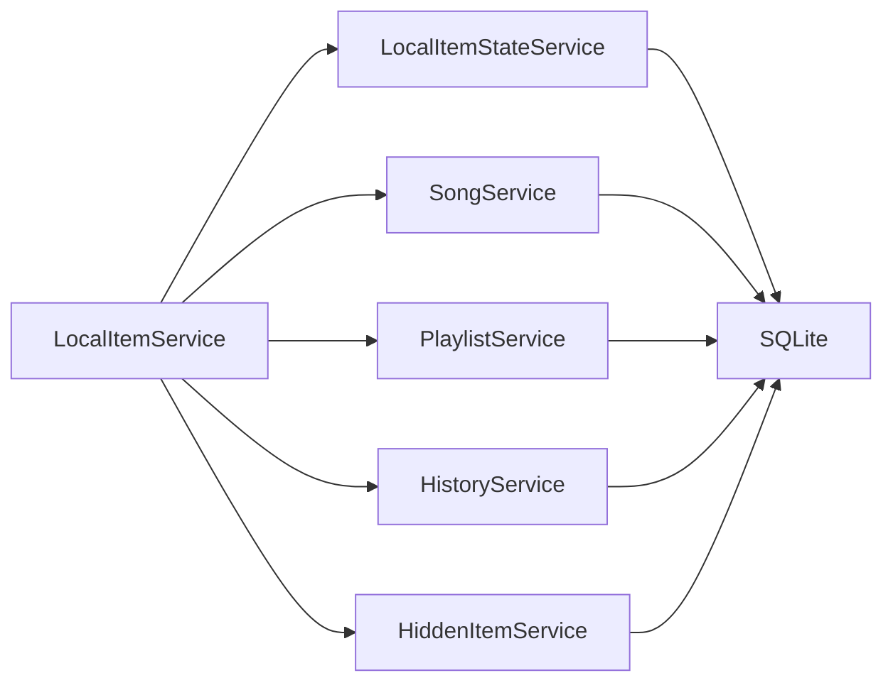

# 本地项目服务

<cite>
**本文档引用的文件**
- [local-item-service.ts](file://electron/services/local-item-service.ts)
- [local-item-state-service.ts](file://electron/services/local-item-state-service.ts)
- [local-file-actions.ts](file://electron/services/local-file-actions.ts)
- [scan-service.ts](file://electron/services/scan-service.ts)
- [song-service.ts](file://electron/services/song-service.ts)
- [history-service.ts](file://electron/services/history-service.ts)
- [playlist-service.ts](file://electron/services/playlist-service.ts)
- [hidden-item-service.ts](file://electron/services/hidden-item-service.ts)
- [constants.ts](file://electron/services/constants.ts)
- [schema.ts](file://electron/services/schema.ts)
- [useDeleteLocalItems.ts](file://src/hooks/useDeleteLocalItems.ts)
- [useDeleteSongFromDisk.ts](file://src/hooks/useDeleteSongFromDisk.ts)
- [pending-song-delete-service.ts](file://electron/services/pending-song-delete-service.ts)
</cite>

## 目录
1. [简介](#简介)
2. [项目结构](#项目结构)
3. [核心组件](#核心组件)
4. [架构总览](#架构总览)
5. [详细组件分析](#详细组件分析)
6. [依赖关系分析](#依赖关系分析)
7. [性能考虑](#性能考虑)
8. [故障排除指南](#故障排除指南)
9. [结论](#结论)
10. [附录](#附录)

## 简介
本文件系统性阐述 SMPlayer 的本地项目服务（LocalItemService）在本地音乐文件管理方面的设计与实现，覆盖文件跟踪、状态管理、操作协调、数据结构、操作流程、与歌曲服务/扫描服务/历史记录的协同机制，以及错误处理策略与扩展能力。目标是帮助开发者与使用者全面理解本地项目服务如何在文件系统与数据库之间建立一致的状态，并通过事务化操作保障数据完整性。

## 项目结构
本地项目服务位于 Electron 主进程的服务层，围绕 LocalItemService 与其状态服务 LocalItemStateService 构建，配合歌曲服务、播放列表服务、历史服务、隐藏项服务等共同完成本地音乐库的生命周期管理。

图表来源
- [local-item-service.ts:22-41](file://electron/services/local-item-service.ts#L22-L41)
- [local-item-state-service.ts:34-64](file://electron/services/local-item-state-service.ts#L34-L64)
- [song-service.ts:17-56](file://electron/services/song-service.ts#L17-L56)
- [playlist-service.ts:9-27](file://electron/services/playlist-service.ts#L9-L27)
- [history-service.ts:30-52](file://electron/services/history-service.ts#L30-L52)
- [hidden-item-service.ts:6-11](file://electron/services/hidden-item-service.ts#L6-L11)

章节来源
- [local-item-service.ts:22-41](file://electron/services/local-item-service.ts#L22-L41)
- [local-item-state-service.ts:34-64](file://electron/services/local-item-state-service.ts#L34-L64)

## 核心组件
- LocalItemService：对外暴露本地项目操作接口，负责文件系统层面的移动、重命名、删除、排序设置等，并协调状态服务进行数据库一致性更新。
- LocalItemStateService：封装数据库事务与状态变更逻辑，确保歌曲、文件、文件夹、播放列表项、历史记录、隐藏项之间的状态一致。
- 协作服务：
  - SongService：提供歌曲路径、属性读取与写入，驱动 ID3 标签更新。
  - PlaylistService：维护播放列表与收藏状态，配合删除/隐藏操作。
  - HistoryService：维护最近播放记录，配合删除/恢复操作。
  - HiddenItemService：维护隐藏存储项，支持文件/文件夹隐藏与恢复。
- 文件系统与数据库：
  - 文件系统：rename/stat/unlink/readdir/rmdir 等异步 API。
  - SQLite：WAL 模式、索引优化、事务控制。

章节来源
- [local-item-service.ts:22-41](file://electron/services/local-item-service.ts#L22-L41)
- [local-item-state-service.ts:34-64](file://electron/services/local-item-state-service.ts#L34-L64)
- [song-service.ts:17-56](file://electron/services/song-service.ts#L17-L56)
- [playlist-service.ts:9-27](file://electron/services/playlist-service.ts#L9-L27)
- [history-service.ts:30-52](file://electron/services/history-service.ts#L30-L52)
- [hidden-item-service.ts:6-11](file://electron/services/hidden-item-service.ts#L6-L11)

## 架构总览
LocalItemService 作为门面，将用户/界面触发的操作转化为文件系统与数据库的原子性变更。其内部通过 LocalItemStateService 组织事务，确保状态一致性；同时与 SongService、PlaylistService、HistoryService、HiddenItemService 协同，保证歌曲元数据、播放列表、历史记录、隐藏项等跨模块的一致性。

图表来源
- [local-item-service.ts:79-93](file://electron/services/local-item-service.ts#L79-L93)
- [local-item-state-service.ts:247-282](file://electron/services/local-item-state-service.ts#L247-L282)
- [playlist-service.ts:408-410](file://electron/services/playlist-service.ts#L408-L410)
- [history-service.ts:308-316](file://electron/services/history-service.ts#L308-L316)
- [hidden-item-service.ts:13-27](file://electron/services/hidden-item-service.ts#L13-L27)

## 详细组件分析

### LocalItemService：本地项目操作编排
- 职责边界
  - 文件移动：单曲移动、批量移动、文件夹移动与合并。
  - 文件删除：单曲删除、本地项目（歌曲+文件夹）批量删除。
  - 文件重命名与文件夹重命名。
  - 文件夹排序策略更新。
  - 路径根目录替换与移动后路径替换。
- 关键流程
  - 移动歌曲到文件夹：校验目标为目录 → 计算移动计划 → 执行文件系统重命名 → 应用数据库状态变更。
  - 合并文件夹到现有目标：递归遍历源文件夹 → 针对文件执行冲突解决 → 对子文件夹递归合并 → 清理空源文件夹。
  - 删除本地项目：收集受影响的歌曲与文件夹 → 进入事务 → 标记状态 → 清理播放列表与历史记录 → 提交事务。
- 冲突处理
  - 目标已存在时可选择替换、保留两者或跳过。
  - 自动生成“(n)”后缀避免同名冲突。
- 进度报告
  - 支持回调报告当前处理项与总进度。

图表来源
- [local-item-service.ts:79-93](file://electron/services/local-item-service.ts#L79-L93)
- [local-item-service.ts:187-200](file://electron/services/local-item-service.ts#L187-L200)
- [local-item-service.ts:232-246](file://electron/services/local-item-service.ts#L232-L246)

章节来源
- [local-item-service.ts:79-159](file://electron/services/local-item-service.ts#L79-L159)
- [local-item-service.ts:187-346](file://electron/services/local-item-service.ts#L187-L346)

### LocalItemStateService：本地项目状态管理
- 数据一致性
  - 歌曲删除：标记歌曲、艺术家、文件状态为非活跃；清理播放列表项；移除最近播放记录；同步专辑。
  - 歌曲隐藏：标记歌曲与文件为隐藏；写入隐藏存储项。
  - 本地项目删除：批量删除歌曲与文件夹及其关联项；清理偏好项与隐藏存储项。
  - 路径替换：统一替换 Settings、Music、Folder、File、HiddenStorageItem 中的路径前缀。
- 事务化操作
  - 所有删除/隐藏/移动/排序更新均在 BEGIN/COMMIT 或 ROLLBACK 包裹下执行，确保原子性。
- 查询与恢复
  - 捕获删除前状态（歌曲/本地项目），用于后续恢复。
  - 恢复时重新激活相关行并同步专辑。

图表来源
- [local-item-state-service.ts:66-208](file://electron/services/local-item-state-service.ts#L66-L208)
- [local-item-state-service.ts:247-406](file://electron/services/local-item-state-service.ts#L247-L406)
- [song-service.ts:253-280](file://electron/services/song-service.ts#L253-L280)
- [playlist-service.ts:408-410](file://electron/services/playlist-service.ts#L408-L410)
- [history-service.ts:308-316](file://electron/services/history-service.ts#L308-L316)
- [hidden-item-service.ts:13-27](file://electron/services/hidden-item-service.ts#L13-L27)

章节来源
- [local-item-state-service.ts:66-208](file://electron/services/local-item-state-service.ts#L66-L208)
- [local-item-state-service.ts:247-406](file://electron/services/local-item-state-service.ts#L247-L406)

### 本地项目数据结构
- 文件路径与状态
  - Music.Path：歌曲文件绝对路径，唯一索引。
  - File.Path：文件/文件夹绝对路径，唯一索引。
  - Folder.Path：文件夹绝对路径，唯一索引。
  - State：整型状态位，包含 inactive、active、hidden、parentHidden。
- 关联关系
  - MusicArtist：多对多，按优先级排序。
  - PlaylistItem：歌曲与播放列表的关联。
  - File.ParentId：指向 Folder.Id，形成树形目录结构。
  - HiddenStorageItem：统一管理被隐藏的文件/文件夹。
- 元数据
  - Music：Name、Artist、Album、ThumbnailPath、Duration、PlayCount、DateAdded。
  - File：FileType、FileId。
  - Folder：Criterion（排序策略）、ParentId。

章节来源
- [schema.ts:85-131](file://electron/services/schema.ts#L85-L131)
- [constants.ts:22-27](file://electron/services/constants.ts#L22-L27)

### 操作流程详解

#### 文件移动与合并
- 单曲移动：计算目标路径 → 若冲突则根据解析器决定替换/保留/跳过 → 执行重命名 → 应用数据库状态变更。
- 文件夹移动：若目标已存在且为目录，则递归合并；否则直接重命名根目录 → 更新父目录引用。
- 合并策略：文件冲突按解析器决策；子文件夹递归合并；空源文件夹删除并标记为非活跃。

图表来源
- [local-item-service.ts:95-122](file://electron/services/local-item-service.ts#L95-L122)
- [local-item-service.ts:248-291](file://electron/services/local-item-service.ts#L248-L291)
- [local-item-service.ts:293-319](file://electron/services/local-item-service.ts#L293-L319)

章节来源
- [local-item-service.ts:95-122](file://electron/services/local-item-service.ts#L95-L122)
- [local-item-service.ts:248-291](file://electron/services/local-item-service.ts#L248-L291)
- [local-item-service.ts:293-319](file://electron/services/local-item-service.ts#L293-L319)

#### 删除与恢复
- 删除流程：捕获删除前状态 → 进入事务 → 标记歌曲/文件/文件夹为非活跃 → 清理播放列表与历史记录 → 提交事务。
- 恢复流程：根据捕获的状态重新激活相关行，必要时同步专辑。

图表来源
- [local-item-service.ts:43-69](file://electron/services/local-item-service.ts#L43-L69)
- [local-item-state-service.ts:84-128](file://electron/services/local-item-state-service.ts#L84-L128)
- [local-item-state-service.ts:191-208](file://electron/services/local-item-state-service.ts#L191-L208)

章节来源
- [local-item-service.ts:43-69](file://electron/services/local-item-service.ts#L43-L69)
- [local-item-state-service.ts:84-128](file://electron/services/local-item-state-service.ts#L84-L128)
- [local-item-state-service.ts:191-208](file://electron/services/local-item-state-service.ts#L191-L208)

#### 与歌曲服务的同步
- 移动/删除/隐藏操作会联动更新 File.Path、Music.Path、File.ParentId、Folder.ParentId 等字段。
- 歌曲属性更新（标题、艺人、专辑、时长等）由 SongService 完成，LocalItemStateService 在必要时同步专辑。

章节来源
- [local-item-state-service.ts:247-282](file://electron/services/local-item-state-service.ts#L247-L282)
- [song-service.ts:155-203](file://electron/services/song-service.ts#L155-L203)

#### 与扫描服务的交互
- 扫描服务负责首次/增量扫描，建立 Music/File/Folder 的初始状态；本地项目服务负责在用户操作后保持与扫描结果一致的状态。
- 扫描服务在事务中批量更新状态，完成后触发专辑同步；本地项目服务同样在事务中更新状态并同步专辑。

章节来源
- [scan-service.ts:131-306](file://electron/services/scan-service.ts#L131-L306)
- [local-item-state-service.ts:66-82](file://electron/services/local-item-state-service.ts#L66-L82)

#### 与历史记录的关联
- 删除歌曲时移除对应最近播放记录；恢复时重新激活记录。
- 历史服务提供清理无效记录的能力，确保一致性。

章节来源
- [history-service.ts:308-316](file://electron/services/history-service.ts#L308-L316)
- [local-item-state-service.ts:74-76](file://electron/services/local-item-state-service.ts#L74-L76)

### 错误处理与边界条件
- 文件不存在：通过 stat 检测，ENOENT 视为“不存在”，其他错误抛出。
- 权限问题：文件系统操作失败时抛出异常，事务回滚。
- 路径冲突：通过冲突解析器决定替换/保留/跳过；必要时生成不冲突路径。
- 状态不一致：所有关键操作在事务中执行，失败即回滚；隐藏项与数据库状态通过双向同步保持一致。

章节来源
- [local-item-service.ts:335-345](file://electron/services/local-item-service.ts#L335-L345)
- [local-file-actions.ts:6-18](file://electron/services/local-file-actions.ts#L6-L18)
- [hidden-item-service.ts:162-258](file://electron/services/hidden-item-service.ts#L162-L258)

### 扩展功能与自定义选项
- 冲突解析器：允许 UI 注入自定义冲突处理策略（替换/保留/跳过）。
- 进度回调：支持移动过程中的进度上报，便于 UI 反馈。
- 排序策略：支持按标题/艺人/专辑/逆序等策略更新文件夹排序。
- 路径替换：支持根路径整体替换，适用于磁盘迁移场景。

章节来源
- [local-item-service.ts:17-20](file://electron/services/local-item-service.ts#L17-L20)
- [local-item-service.ts:169-171](file://electron/services/local-item-service.ts#L169-L171)
- [local-item-state-service.ts:332-342](file://electron/services/local-item-state-service.ts#L332-L342)

## 依赖关系分析
- 组件耦合
  - LocalItemService 依赖 LocalItemStateService 与多个协作服务，耦合度适中，职责清晰。
  - LocalItemStateService 依赖数据库与协作服务，承担强一致性职责。
- 外部依赖
  - 文件系统 API：rename/stat/unlink/readdir/rmdir。
  - SQLite：WAL 模式提升并发写入性能。
- 循环依赖
  - 未发现循环依赖，各服务通过接口解耦。

图表来源
- [local-item-service.ts:26-40](file://electron/services/local-item-service.ts#L26-L40)
- [local-item-state-service.ts:34-64](file://electron/services/local-item-state-service.ts#L34-L64)

章节来源
- [local-item-service.ts:26-40](file://electron/services/local-item-service.ts#L26-L40)
- [local-item-state-service.ts:34-64](file://electron/services/local-item-state-service.ts#L34-L64)

## 性能考虑
- 事务批处理：删除/隐藏/移动等操作统一在事务中执行，减少锁竞争与中间态。
- 索引优化：Music.Path、File.Path、Folder.Path 等关键字段建立唯一索引，加速查找与去重。
- 批量 SQL：IN 子句与 CASE WHEN 结构减少往返次数。
- 异步文件系统：使用 node:fs/promises 并发友好，结合进度回调优化用户体验。

## 故障排除指南
- “目标路径不是文件夹”：检查传入路径是否为目录，或是否存在拼写错误。
- “文件已存在且非文件夹”：合并目标已存在但不是目录时会报错，需调整目标或使用冲突解析器。
- “源路径不存在”：确认源路径存在且可访问，避免 ENOENT。
- “权限不足”：检查文件/目录权限，确保主进程具备读写权限。
- “状态不一致”：若出现部分成功，检查事务日志与回滚点，必要时重建数据库索引。

章节来源
- [local-item-service.ts:84-88](file://electron/services/local-item-service.ts#L84-L88)
- [local-item-service.ts:101-103](file://electron/services/local-item-service.ts#L101-L103)
- [local-file-actions.ts:6-18](file://electron/services/local-file-actions.ts#L6-L18)

## 结论
LocalItemService 通过明确的职责划分与事务化的状态管理，实现了本地音乐文件在文件系统与数据库之间的高一致性与可恢复性。其与歌曲服务、播放列表服务、历史服务、隐藏项服务的协同，确保了从扫描到操作再到恢复的完整生命周期管理。配合冲突解析器与进度回调，既满足高级用户的精细控制需求，也保证了普通用户的易用性。

## 附录

### 前端集成示例（钩子）
- useDeleteLocalItems：封装本地项目批量删除的撤销通知与提交流程。
- useDeleteSongFromDisk：封装单曲删除的撤销通知与提交流程。
- pending-song-delete-service：持久化待处理删除记录，支持统一撤销/提交。

章节来源
- [useDeleteLocalItems.ts:5-25](file://src/hooks/useDeleteLocalItems.ts#L5-L25)
- [useDeleteSongFromDisk.ts:6-26](file://src/hooks/useDeleteSongFromDisk.ts#L6-L26)
- [pending-song-delete-service.ts:49-148](file://electron/services/pending-song-delete-service.ts#L49-L148)