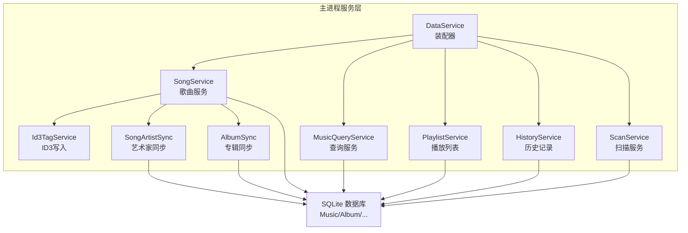
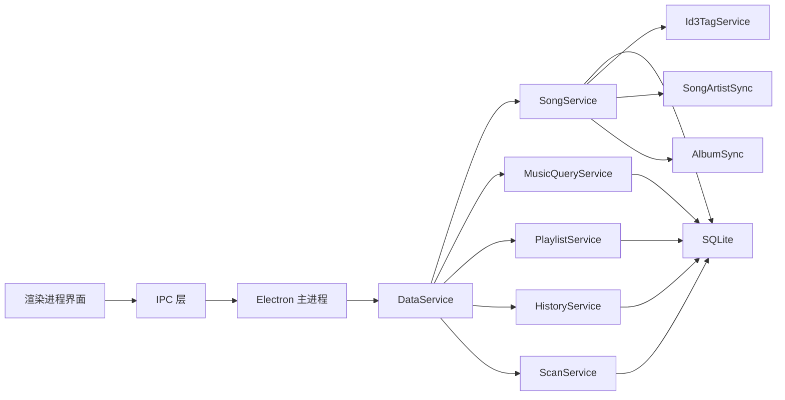
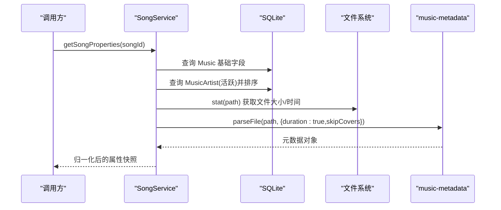
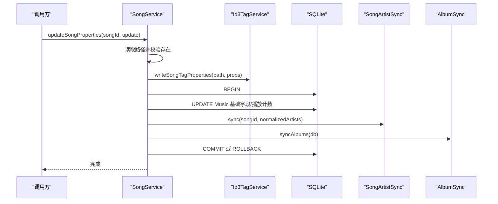
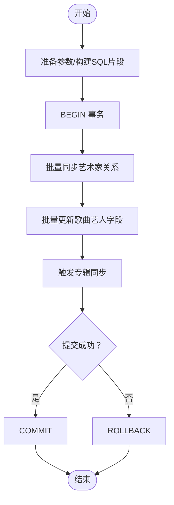
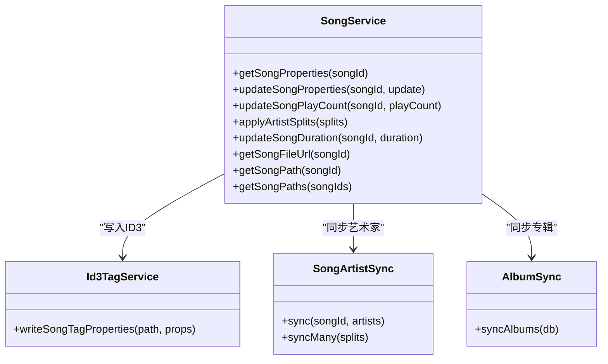

# 歌曲服务

<cite>
**本文引用的文件**
- [song-service.ts](file://electron/services/song-service.ts)
- [data-service.ts](file://electron/services/data-service.ts)
- [schema.ts](file://electron/services/schema.ts)
- [music-query-service.ts](file://electron/services/music-query-service.ts)
- [scan-service.ts](file://electron/services/scan-service.ts)
- [song-artist-sync.ts](file://electron/services/song-artist-sync.ts)
- [album-sync.ts](file://electron/services/album-sync.ts)
- [id3-tag-service.ts](file://electron/services/id3-tag-service.ts)
- [history-service.ts](file://electron/services/history-service.ts)
- [playlist-service.ts](file://electron/services/playlist-service.ts)
- [constants.ts](file://electron/services/constants.ts)
- [tag-text.ts](file://electron/services/tag-text.ts)
- [row-mappers.ts](file://electron/services/row-mappers.ts)
- [README.md](file://README.md)
</cite>

## 目录
1. [简介](#简介)
2. [项目结构](#项目结构)
3. [核心组件](#核心组件)
4. [架构总览](#架构总览)
5. [详细组件分析](#详细组件分析)
6. [依赖分析](#依赖分析)
7. [性能考量](#性能考量)
8. [故障排查指南](#故障排查指南)
9. [结论](#结论)
10. [附录](#附录)

## 简介
本文件系统性阐述 SMPlayer 的歌曲服务（SongService）在本地音乐库中的数据管理能力，覆盖歌曲信息的存储、查询、更新、删除等 CRUD 操作；解释歌曲数据结构与元数据字段、多艺术家关系模型；说明批量操作与事务处理策略；给出验证与清理机制（去重、完整性、格式标准化）；并梳理与播放列表、历史记录、扫描服务之间的交互，最后提供最佳实践与性能优化建议。

## 项目结构
- 歌曲服务位于 Electron 主进程的服务层，围绕 SQLite 数据库存储与查询展开，并通过 ID3 标签写入实现元数据持久化。
- 数据层由 DataService 统一装配，包含歌曲、专辑、播放列表、历史、歌词、扫描等子服务。
- Schema 定义了 Music、MusicArtist、Album、Playlist、PlaylistItem、RecentRecord 等核心表及索引。
- 查询层由 MusicQueryService 提供统一的库快照与统计接口，服务于前端展示。
- 扫描层 ScanService 负责全量/增量扫描、艺术家智能拆分与合并建议、专辑同步等。

图表来源
- [data-service.ts:39-145](file://electron/services/data-service.ts#L39-L145)
- [song-service.ts:17-56](file://electron/services/song-service.ts#L17-L56)
- [schema.ts:33-260](file://electron/services/schema.ts#L33-L260)

章节来源
- [README.md:1-157](file://README.md#L1-L157)
- [data-service.ts:39-145](file://electron/services/data-service.ts#L39-L145)

## 核心组件
- 歌曲服务（SongService）
  - 提供歌曲属性快照读取、属性更新、播放计数与时长更新、路径解析、批量艺术家拆分应用、媒体 URL 构造等能力。
  - 使用预编译语句与事务保证一致性与性能。
- 艺术家同步（SongArtistSync）
  - 将歌曲与多艺术家关系进行“置无效-重建”策略，确保 MusicArtist 表与歌曲显示字符串一致。
- 专辑同步（AlbumSync）
  - 基于当前活跃歌曲聚合生成临时表，再与 Album 合并，维护专辑封面与艺人聚合。
- ID3 写入（Id3TagService）
  - 针对 MP3 文件写入标题、副标题、艺人、专辑、专辑艺人、出版者、曲号、年份、流派、作曲者等文本帧，保留非替换帧。
- 扫描服务（ScanService）
  - 全量/增量扫描、隐藏项过滤、艺术家智能拆分/合并建议、UPSERT 写入、事务提交、副作用清理。
- 查询服务（MusicQueryService）
  - 提供库壳快照、统计、最近播放、播放列表、收藏夹、NowPlaying 等聚合视图。
- 历史服务（HistoryService）
  - 最近播放记录、搜索历史、播放计数自增、最近项目清理。
- 播放列表服务（PlaylistService）
  - 播放列表 CRUD、歌曲增删改、排序、内置列表保护。

章节来源
- [song-service.ts:17-297](file://electron/services/song-service.ts#L17-L297)
- [song-artist-sync.ts:7-39](file://electron/services/song-artist-sync.ts#L7-L39)
- [album-sync.ts:3-83](file://electron/services/album-sync.ts#L3-L83)
- [id3-tag-service.ts:4-237](file://electron/services/id3-tag-service.ts#L4-L237)
- [scan-service.ts:65-306](file://electron/services/scan-service.ts#L65-L306)
- [music-query-service.ts:50-418](file://electron/services/music-query-service.ts#L50-L418)
- [history-service.ts:30-484](file://electron/services/history-service.ts#L30-L484)
- [playlist-service.ts:9-508](file://electron/services/playlist-service.ts#L9-L508)

## 架构总览
下图展示歌曲服务在系统中的位置与交互：

图表来源
- [data-service.ts:39-145](file://electron/services/data-service.ts#L39-L145)
- [song-service.ts:17-56](file://electron/services/song-service.ts#L17-L56)
- [music-query-service.ts:50-165](file://electron/services/music-query-service.ts#L50-L165)
- [playlist-service.ts:9-145](file://electron/services/playlist-service.ts#L9-L145)
- [history-service.ts:30-182](file://electron/services/history-service.ts#L30-L182)
- [scan-service.ts:65-129](file://electron/services/scan-service.ts#L65-L129)

## 详细组件分析

### 歌曲数据结构与关系
- 核心表
  - Music：歌曲主表，包含路径、标题、艺人、专辑、缩略图、时长、播放计数、添加时间、状态等。
  - MusicArtist：歌曲-艺术家多对多中间表，支持优先级与状态。
  - Album：专辑表，包含名称、艺人、封面路径、状态。
  - Playlist/PlaylistItem：播放列表与条目。
  - RecentRecord：最近播放/搜索等记录。
- 关键约束与索引
  - Music.Path 唯一索引，避免重复。
  - MusicArtist(MusicId, Name) 唯一索引，防止重复艺术家。
  - 外键约束（Cascade）保证删除歌曲时级联删除艺术家关系。
- 状态机
  - ACTIVE_STATE：inactive(0)/active(1)/hidden(-1)/parentHidden(-2)，用于软删除与可见性控制。

章节来源
- [schema.ts:85-147](file://electron/services/schema.ts#L85-L147)
- [schema.ts:238-260](file://electron/services/schema.ts#L238-L260)
- [constants.ts:22-28](file://electron/services/constants.ts#L22-L28)

### 歌曲属性快照（读取）
- 读取流程
  - 从 Music 获取基础字段。
  - 从 MusicArtist 读取当前活跃艺术家，按优先级排序。
  - 通过文件系统 stat 获取文件大小、创建/修改时间。
  - 使用 music-metadata 解析音频元数据，补充标题、副标题、专辑艺人、流派、作曲者、时长、比特率等。
  - 使用标签标准化工具修复乱码与格式问题。
- 返回结构
  - 包含歌曲标识、路径、标题、副标题、艺人、艺术家数组、专辑、专辑艺人、发布者、曲号、年份、流派、作曲者、时长、比特率、文件大小、创建/修改时间、文件类型、播放计数等。

图表来源
- [song-service.ts:58-153](file://electron/services/song-service.ts#L58-L153)
- [tag-text.ts:7-41](file://electron/services/tag-text.ts#L7-L41)

章节来源
- [song-service.ts:58-153](file://electron/services/song-service.ts#L58-L153)
- [tag-text.ts:7-133](file://electron/services/tag-text.ts#L7-L133)

### 歌曲属性更新（写入）
- 更新流程
  - 通过 Id3TagService 写入 MP3 文本帧（标题、副标题、艺人、专辑、专辑艺人、出版者、曲号、年份、流派、作曲者）。
  - 在事务中更新 Music 基础字段与播放计数。
  - 同步艺术家关系（SongArtistSync），并触发专辑同步。
- 并发与幂等
  - 使用事务包裹，失败回滚。
  - 仅对 MP3 文件执行 ID3 写入。

图表来源
- [song-service.ts:155-203](file://electron/services/song-service.ts#L155-L203)
- [id3-tag-service.ts:5-55](file://electron/services/id3-tag-service.ts#L5-L55)
- [song-artist-sync.ts:26-31](file://electron/services/song-artist-sync.ts#L26-L31)
- [album-sync.ts:3-83](file://electron/services/album-sync.ts#L3-L83)

章节来源
- [song-service.ts:155-203](file://electron/services/song-service.ts#L155-L203)
- [id3-tag-service.ts:5-55](file://electron/services/id3-tag-service.ts#L5-L55)
- [song-artist-sync.ts:26-31](file://electron/services/song-artist-sync.ts#L26-L31)
- [album-sync.ts:3-83](file://electron/services/album-sync.ts#L3-L83)

### 批量操作与事务处理
- 批量艺术家拆分应用
  - 通过 CASE WHEN 动态构造 SQL，一次性更新多个歌曲的艺人字段。
  - 同步艺术家关系并触发专辑同步，事务包裹。
- 扫描服务中的批量写入
  - 使用 UPSERT（ON CONFLICT）写入 Music/Album/File。
  - 标记过期条目为 inactive，再统一提交。
  - 自动歌词抓取与缩略图缓存清理异步执行。

图表来源
- [song-service.ts:209-232](file://electron/services/song-service.ts#L209-L232)
- [scan-service.ts:239-288](file://electron/services/scan-service.ts#L239-L288)
- [album-sync.ts:3-83](file://electron/services/album-sync.ts#L3-L83)

章节来源
- [song-service.ts:209-232](file://electron/services/song-service.ts#L209-L232)
- [scan-service.ts:239-288](file://electron/services/scan-service.ts#L239-L288)

### 歌曲时长与播放计数
- 时长更新
  - 仅在时长为正且与现有值差异超过阈值时才更新，避免无效写入。
  - 支持基于时长或基于文件大小/比特率估算两种策略。
- 播放计数
  - 单独更新语句，便于外部调用（如 HistoryService 记录播放后增加计数）。

章节来源
- [song-service.ts:234-247](file://electron/services/song-service.ts#L234-L247)
- [song-service.ts:205-207](file://electron/services/song-service.ts#L205-L207)
- [song-service.ts:282-295](file://electron/services/song-service.ts#L282-L295)
- [history-service.ts:291-306](file://electron/services/history-service.ts#L291-L306)

### 路径解析与媒体 URL
- 通过预编译语句安全查询歌曲路径，不存在则抛出错误。
- 将路径转换为 URL 供播放器使用。

章节来源
- [song-service.ts:249-264](file://electron/services/song-service.ts#L249-L264)

### 与其他服务的交互

#### 与播放列表的关联
- 收藏/喜欢：通过 PlaylistService 对 My Favorites 列表进行增删。
- 播放队列：NowPlaying 作为特殊播放列表，MusicQueryService 提供其歌曲 ID 列表。

章节来源
- [playlist-service.ts:259-275](file://electron/services/playlist-service.ts#L259-L275)
- [music-query-service.ts:273-284](file://electron/services/music-query-service.ts#L273-L284)

#### 与历史记录的同步
- 播放记录：HistoryService 在播放后增加计数、写入最近播放记录。
- 搜索历史：保存/恢复/清理搜索历史，支持去重与类型区分。

章节来源
- [history-service.ts:291-306](file://electron/services/history-service.ts#L291-L306)
- [history-service.ts:232-290](file://electron/services/history-service.ts#L232-L290)

#### 与扫描服务的数据交换
- 扫描写入：ScanService 使用 UPSERT 写入 Music/Album/File，并同步艺术家与专辑。
- 副作用清理：扫描完成后清理无效播放列表项、最近播放记录，修正播放恢复状态。

章节来源
- [scan-service.ts:616-694](file://electron/services/scan-service.ts#L616-L694)
- [data-service.ts:160-195](file://electron/services/data-service.ts#L160-L195)

### 验证与清理机制
- 重复检测
  - Music.Path 唯一索引，避免重复条目。
  - 扫描阶段基于路径集合去重，仅对新增/移动/删除做增量处理。
- 完整性检查
  - ACTIVE_STATE 状态字段统一软删除与可见性。
  - 外键 Cascade 级联删除艺术家关系。
- 格式标准化
  - 标题/艺人/专辑等使用归一化函数，修复拉丁1摩卡贝克乱码、CJK 字符识别、多分隔符拆分、括号别名覆盖等。
  - 艺术家智能拆分：基于斜杠、中文顿号、逗号、分号、竖线等分隔符，结合上下文判断是否应拆分或合并。

章节来源
- [schema.ts:238-260](file://electron/services/schema.ts#L238-L260)
- [tag-text.ts:7-133](file://electron/services/tag-text.ts#L7-L133)
- [scan-service.ts:320-353](file://electron/services/scan-service.ts#L320-L353)

## 依赖分析
- SongService 依赖
  - SQLite 预编译语句与事务。
  - Id3TagService（MP3 写入）、SongArtistSync（艺术家关系）、AlbumSync（专辑聚合）。
  - 标签文本归一化工具。
- 与查询/播放/历史/扫描的耦合
  - 通过 DataService 统一装配，降低循环依赖风险。
  - MusicQueryService 仅读取，不直接写入歌曲主表，避免竞争。

图表来源
- [song-service.ts:17-56](file://electron/services/song-service.ts#L17-L56)
- [id3-tag-service.ts:4-55](file://electron/services/id3-tag-service.ts#L4-L55)
- [song-artist-sync.ts:7-39](file://electron/services/song-artist-sync.ts#L7-L39)
- [album-sync.ts:3-83](file://electron/services/album-sync.ts#L3-L83)

章节来源
- [song-service.ts:17-56](file://electron/services/song-service.ts#L17-L56)

## 性能考量
- 预编译语句与参数绑定
  - 大幅减少 SQL 解析开销，提升批量更新效率。
- 事务批处理
  - 将多次写入放入单个事务，显著降低 WAL 刷新频率。
- 索引与唯一约束
  - Path 唯一索引、MusicArtist 唯一索引，避免重复与冲突。
- 异步副作用
  - 缩略图缓存清理与歌词抓取在事务提交后后台执行，缩短 IPC 响应时间。
- 时长估算
  - 当元数据缺失时，基于文件大小与比特率估算时长，减少 IO 开销。

章节来源
- [song-service.ts:282-295](file://electron/services/song-service.ts#L282-L295)
- [scan-service.ts:290-293](file://electron/services/scan-service.ts#L290-L293)
- [scan-service.ts:556-566](file://electron/services/scan-service.ts#L556-L566)

## 故障排查指南
- 歌曲未找到
  - getSongPath/getSongProperties 在找不到记录时抛错，检查歌曲状态与路径是否正确。
- ID3 写入失败
  - 仅对 MP3 文件生效；非 MP3 文件会跳过写入。
- 事务异常
  - 所有写入均在事务中执行，若中途失败会回滚；检查日志定位具体语句。
- 艺术家拆分/合并建议
  - 可通过分析接口查看建议结果，确认是否符合预期后再应用。
- 最近播放/搜索历史异常
  - 使用清理接口移除无效记录，或恢复历史条目。

章节来源
- [song-service.ts:253-264](file://electron/services/song-service.ts#L253-L264)
- [id3-tag-service.ts:20-22](file://electron/services/id3-tag-service.ts#L20-L22)
- [scan-service.ts:320-353](file://electron/services/scan-service.ts#L320-L353)
- [history-service.ts:332-338](file://electron/services/history-service.ts#L332-L338)

## 结论
SongService 以 SQLite 为核心，结合 ID3 写入与艺术家/专辑同步，提供了完整的歌曲数据生命周期管理能力。通过事务、索引与归一化策略，兼顾了数据一致性与性能。与播放列表、历史、扫描等服务协同，形成从采集到展示的闭环。建议在大规模批量操作时充分利用事务与批量语句，并持续利用扫描服务的智能拆分建议优化艺术家关系质量。

## 附录
- 最佳实践
  - 批量更新前先构建参数数组，使用 CASE WHEN 或批量 UPSERT。
  - 仅在必要时写入 ID3，避免无意义的磁盘写入。
  - 定期运行扫描服务的副作用清理逻辑，保持数据库整洁。
  - 使用标签归一化工具统一格式，减少乱码与重复。
- 性能优化建议
  - 合理设置 WAL 与同步模式，平衡可靠性与性能。
  - 对高频查询建立合适索引，避免全表扫描。
  - 将耗时任务（如缩略图清理、歌词抓取）异步化，缩短主流程耗时。