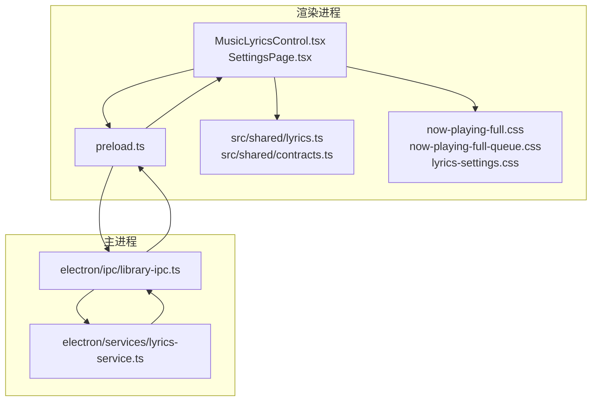
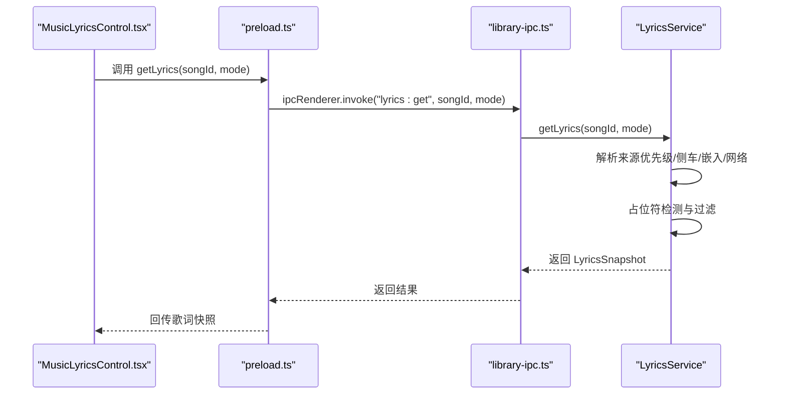
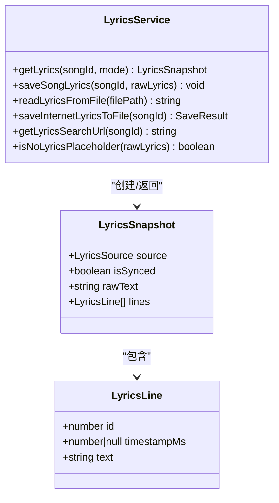
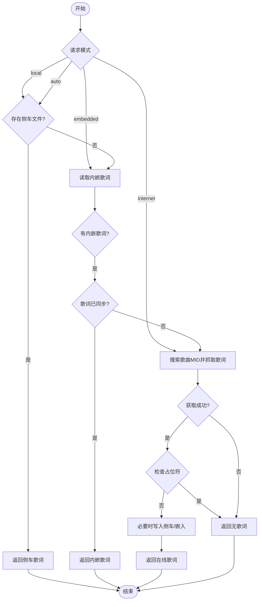
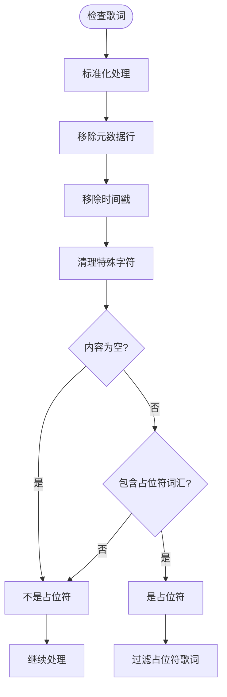
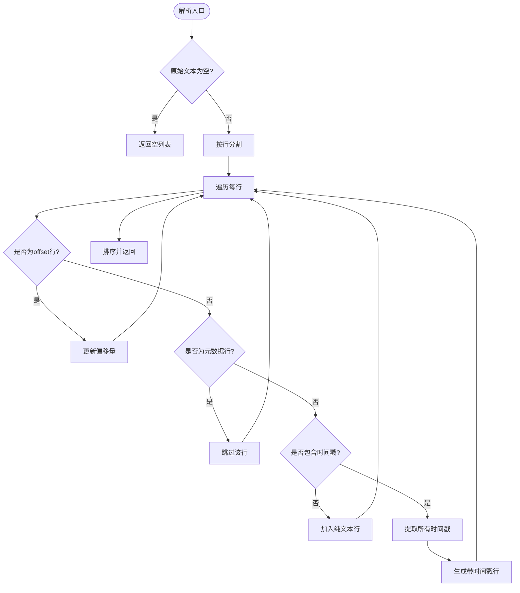
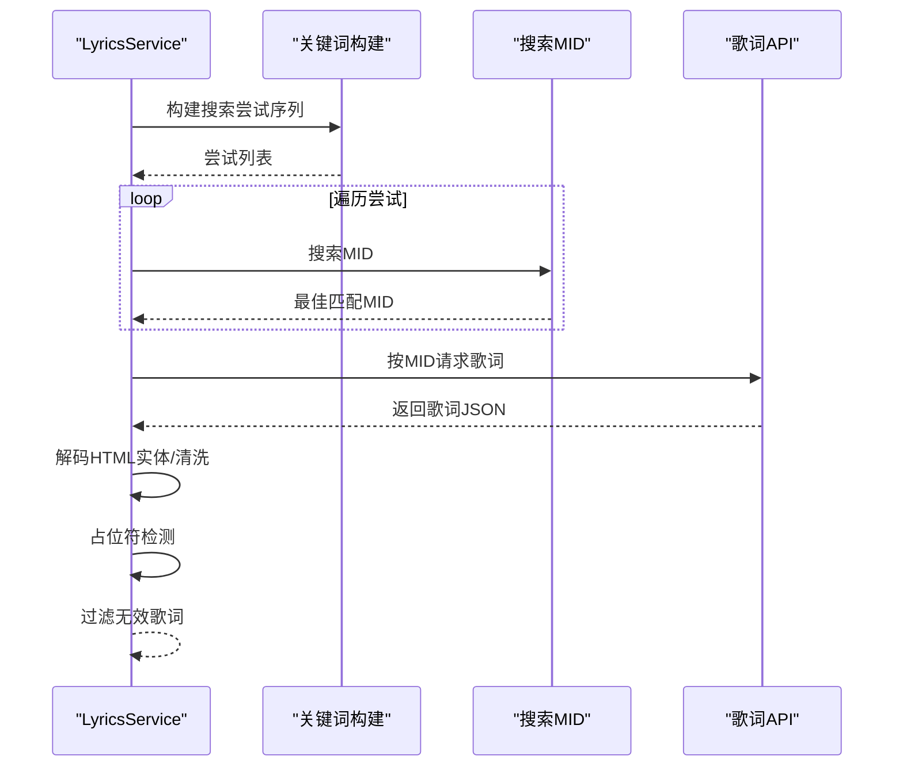
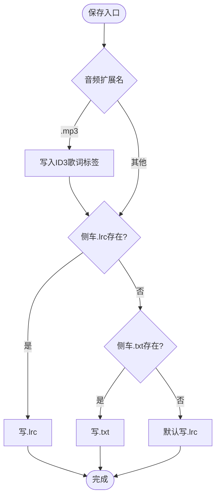
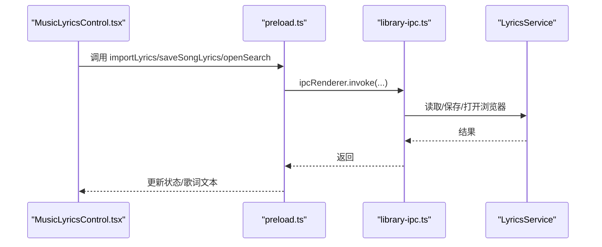
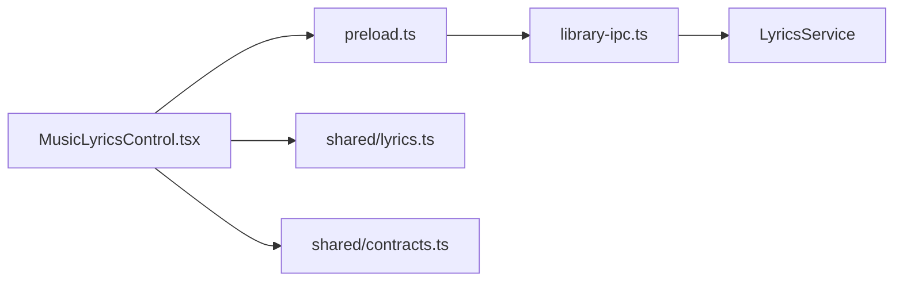

# 歌词服务

<cite>
**本文引用的文件**
- [electron\services\lyrics-service.ts](file://electron/services/lyrics-service.ts)
- [src\shared\lyrics.ts](file://src/shared/lyrics.ts)
- [src\shared\contracts.ts](file://src/shared/contracts.ts)
- [electron\ipc\library-ipc.ts](file://electron/ipc/library-ipc.ts)
- [electron\preload.ts](file://electron/preload.ts)
- [src\components\MusicLyricsControl.tsx](file://src/components/MusicLyricsControl.tsx)
- [src\pages\SettingsPage.tsx](file://src/pages/SettingsPage.tsx)
- [src\styles\now-playing-full.css](file://src/styles/now-playing-full.css)
- [src\styles\now-playing-full-queue.css](file://src/styles/now-playing-full-queue.css)
- [src\styles\lyrics-settings.css](file://src/styles/lyrics-settings.css)
</cite>

## 更新摘要
**变更内容**
- 增强了歌词获取逻辑，优化了自动模式选择算法
- 新增占位符检测功能，能够识别和过滤无歌词占位符
- 改进了跨平台兼容性处理，增强了文件存在性检查
- 优化了歌词解析和时间轴处理的稳定性

## 目录
1. [简介](#简介)
2. [项目结构](#项目结构)
3. [核心组件](#核心组件)
4. [架构总览](#架构总览)
5. [详细组件分析](#详细组件分析)
6. [依赖关系分析](#依赖关系分析)
7. [性能考量](#性能考量)
8. [故障排查指南](#故障排查指南)
9. [结论](#结论)
10. [附录](#附录)

## 简介
本文件系统性阐述 SMPlayer 的歌词服务（LyricsService）实现与使用方式，覆盖歌词获取、存储、解析、显示、批量处理、设置集成与样式定制等全链路能力。读者可据此理解歌词数据结构、多源获取策略、时间轴解析与同步、缓存与持久化、以及前端展示与交互。

**更新** 本次更新增强了歌词获取逻辑的智能化程度，新增了占位符检测功能以提高歌词质量，并改进了跨平台兼容性处理。

## 项目结构
歌词服务横跨渲染进程与主进程，通过 IPC 暴露接口；核心逻辑位于 Electron 主进程的服务层，共享工具与类型定义位于渲染侧。

**图表来源**
- [electron\ipc\library-ipc.ts:155-185](file://electron/ipc/library-ipc.ts#L155-L185)
- [electron\services\lyrics-service.ts:32-78](file://electron/services/lyrics-service.ts#L32-L78)
- [electron\preload.ts:63-69](file://electron/preload.ts#L63-L69)
- [src\components\MusicLyricsControl.tsx:7-39](file://src/components/MusicLyricsControl.tsx#L7-L39)
- [src\pages\SettingsPage.tsx:663-708](file://src/pages/SettingsPage.tsx#L663-L708)
- [src\shared\lyrics.ts:1-89](file://src/shared/lyrics.ts#L1-L89)
- [src\shared\contracts.ts:195-227](file://src/shared/contracts.ts#L195-L227)

**章节来源**
- [electron\ipc\library-ipc.ts:155-185](file://electron/ipc/library-ipc.ts#L155-L185)
- [electron\services\lyrics-service.ts:32-78](file://electron/services/lyrics-service.ts#L32-L78)
- [electron\preload.ts:63-69](file://electron/preload.ts#L63-L69)
- [src\components\MusicLyricsControl.tsx:7-39](file://src/components/MusicLyricsControl.tsx#L7-L39)
- [src\pages\SettingsPage.tsx:663-708](file://src/pages/SettingsPage.tsx#L663-L708)
- [src\shared\lyrics.ts:1-89](file://src/shared/lyrics.ts#L1-L89)
- [src\shared\contracts.ts:195-227](file://src/shared/contracts.ts#L195-L227)

## 核心组件
- LyricsService：主进程歌词服务，负责从多种来源获取歌词、解析与持久化、网络请求与匹配、时间戳处理等。
- IPC 层：在 library-ipc.ts 中注册并转发歌词相关 IPC 处理器。
- 渲染侧控制：MusicLyricsControl 提供歌词编辑与操作按钮；SettingsPage 集成歌词批量任务与设置项。
- 共享工具与类型：src/shared/lyrics.ts 提供歌词行选择、时间戳剥离、合并等通用函数；contracts.ts 定义歌词数据结构与请求模式。

**更新** LyricsService 现在具备更智能的自动模式选择和占位符检测能力。

**章节来源**
- [electron\services\lyrics-service.ts:32-78](file://electron/services/lyrics-service.ts#L32-L78)
- [electron\ipc\library-ipc.ts:155-185](file://electron/ipc/library-ipc.ts#L155-L185)
- [src\components\MusicLyricsControl.tsx:7-39](file://src/components/MusicLyricsControl.tsx#L7-L39)
- [src\pages\SettingsPage.tsx:663-708](file://src/pages/SettingsPage.tsx#L663-L708)
- [src\shared\lyrics.ts:1-89](file://src/shared/lyrics.ts#L1-L89)
- [src\shared\contracts.ts:195-227](file://src/shared/contracts.ts#L195-L227)

## 架构总览
歌词服务采用"主进程服务 + 渲染进程 IPC 调用"的分层设计。渲染侧通过 preload 暴露的 API 发起请求，主进程 LyricsService 执行业务逻辑并返回 LyricsSnapshot。

**更新** 架构保持不变，但 LyricsService 的内部逻辑得到了显著增强。

**图表来源**
- [electron\preload.ts:63-64](file://electron/preload.ts#L63-L64)
- [electron\ipc\library-ipc.ts:155-156](file://electron/ipc/library-ipc.ts#L155-L156)
- [electron\services\lyrics-service.ts:50-78](file://electron/services/lyrics-service.ts#L50-L78)

## 详细组件分析

### 数据模型与结构
- LyricsSource：歌词来源标识，包括 none、lrc-file、text-file、music-file、internet。
- LyricsRequestMode：请求模式，包括 internet、local、embedded、auto。
- LyricsLine：单行歌词，包含 id、timestampMs（可空）、text。
- LyricsSnapshot：歌词快照，包含 source、isSynced、rawText、lines。

**图表来源**
- [src\shared\contracts.ts:195-227](file://src/shared/contracts.ts#L195-L227)
- [electron\services\lyrics-service.ts:229-239](file://electron/services/lyrics-service.ts#L229-L239)

**章节来源**
- [src\shared\contracts.ts:195-227](file://src/shared/contracts.ts#L195-L227)
- [electron\services\lyrics-service.ts:229-239](file://electron/services/lyrics-service.ts#L229-L239)

### 歌词获取流程
LyricsService 根据请求模式按优先级获取歌词：
- embedded：仅从音乐文件内嵌标签读取。
- local：优先侧车文件（.lrc/.txt），否则回退到嵌入式。
- internet：调用在线 API 获取，支持自动持久化到侧车或嵌入。
- auto：默认策略，先尝试侧车/嵌入，再按需请求网络。

**更新** 自动模式现在具备更智能的选择逻辑，能够根据歌词同步状态决定是否继续搜索在线歌词。

**图表来源**
- [electron\services\lyrics-service.ts:50-78](file://electron/services/lyrics-service.ts#L50-L78)
- [electron\services\lyrics-service.ts:161-174](file://electron/services/lyrics-service.ts#L161-L174)
- [electron\services\lyrics-service.ts:421-433](file://electron/services/lyrics-service.ts#L421-L433)

**章节来源**
- [electron\services\lyrics-service.ts:50-78](file://electron/services/lyrics-service.ts#L50-L78)
- [electron\services\lyrics-service.ts:161-174](file://electron/services/lyrics-service.ts#L161-L174)
- [electron\services\lyrics-service.ts:421-433](file://electron/services/lyrics-service.ts#L421-L433)

### 占位符检测与过滤
**新增功能** LyricsService 现在具备检测和过滤无歌词占位符的能力，确保返回的歌词质量。

- `isNoLyricsPlaceholder(rawLyrics)`：检测歌词是否为占位符内容
- 支持中文占位符："此歌曲为没有填词的纯音乐请您欣赏"
- 移除元数据和时间戳后进行内容标准化比较
- 自动过滤包含占位符内容的歌词

**图表来源**
- [electron\services\lyrics-service.ts:421-433](file://electron/services/lyrics-service.ts#L421-L433)
- [electron\services\lyrics-service.ts:411-419](file://electron/services/lyrics-service.ts#L411-L419)

**章节来源**
- [electron\services\lyrics-service.ts:421-433](file://electron/services/lyrics-service.ts#L421-L433)
- [electron\services\lyrics-service.ts:411-419](file://electron/services/lyrics-service.ts#L411-L419)

### 歌词解析与时间轴处理
- 支持 LRC 时间戳解析，含 offset 元数据与毫秒精度。
- 自动排序：按时间戳升序，无时间戳行按插入顺序排列。
- 可剥离时间戳用于纯文本对比与合并。

**更新** 增强了对特殊字符和编码的支持，改进了文件存在性检查的跨平台兼容性。

**图表来源**
- [electron\services\lyrics-service.ts:241-316](file://electron/services/lyrics-service.ts#L241-L316)
- [src\shared\lyrics.ts:42-55](file://src/shared/lyrics.ts#L42-L55)

**章节来源**
- [electron\services\lyrics-service.ts:241-316](file://electron/services/lyrics-service.ts#L241-L316)
- [src\shared\lyrics.ts:42-55](file://src/shared/lyrics.ts#L42-L55)

### 在线歌词检索与匹配
- 通过关键词构建多次尝试（含去括号、简化标题/艺人），提升匹配准确率。
- 使用评分函数综合标题与艺人相似度，选择最佳匹配 MID。
- 请求歌词接口并解码 HTML 实体，过滤无效结果。

**更新** 改进了跨平台兼容性，增强了语言检测和请求头设置。

**图表来源**
- [electron\services\lyrics-service.ts:402-473](file://electron/services/lyrics-service.ts#L402-L473)
- [electron\services\lyrics-service.ts:561-570](file://electron/services/lyrics-service.ts#L561-L570)

**章节来源**
- [electron\services\lyrics-service.ts:402-473](file://electron/services/lyrics-service.ts#L402-L473)
- [electron\services\lyrics-service.ts:561-570](file://electron/services/lyrics-service.ts#L561-L570)

### 歌词存储与持久化
- 侧车文件：优先写入 .lrc，其次 .txt；若音频为 MP3，同时写入 ID3 嵌入标签与侧车文件。
- 非 MP3：优先写入 .lrc，若为空则写入 .txt。
- 写入失败不阻塞播放，异常被吞并。

**更新** 改进了文件存在性检查的跨平台兼容性，增强了错误处理机制。

**图表来源**
- [electron\services\lyrics-service.ts:176-210](file://electron/services/lyrics-service.ts#L176-L210)

**章节来源**
- [electron\services\lyrics-service.ts:176-210](file://electron/services/lyrics-service.ts#L176-L210)

### 渲染侧歌词显示与交互
- MusicLyricsControl 提供搜索、导入、保存、重置、时间戳开关等操作。
- 设置页提供批量添加歌词任务，内置节流与进度反馈。
- 全屏播放界面提供歌词舞台与高亮滚动，支持夜间模式样式。

**图表来源**
- [electron\preload.ts:64-68](file://electron/preload.ts#L64-L68)
- [electron\ipc\library-ipc.ts:157-184](file://electron/ipc/library-ipc.ts#L157-L184)
- [src\components\MusicLyricsControl.tsx:7-39](file://src/components/MusicLyricsControl.tsx#L7-L39)

**章节来源**
- [electron\preload.ts:64-68](file://electron/preload.ts#L64-L68)
- [electron\ipc\library-ipc.ts:157-184](file://electron/ipc/library-ipc.ts#L157-L184)
- [src\components\MusicLyricsControl.tsx:7-39](file://src/components/MusicLyricsControl.tsx#L7-L39)

### 批量歌词处理
- SettingsPage 提供批量添加歌词任务，内置请求节流（约1秒间隔），支持停止与进度统计。
- 任务运行期间禁用触发按钮，避免并发冲突。

**章节来源**
- [src\pages\SettingsPage.tsx:451-503](file://src/pages/SettingsPage.tsx#L451-L503)
- [src\pages\SettingsPage.tsx:663-708](file://src/pages/SettingsPage.tsx#L663-L708)

### 显示样式与主题适配
- now-playing-full.css/now-playing-full-queue.css 定义歌词舞台、行高亮、滚动遮罩、夜间模式颜色。
- lyrics-settings.css 提供歌词批量任务面板与控件样式。

**章节来源**
- [src\styles\now-playing-full.css:249-330](file://src/styles/now-playing-full.css#L249-L330)
- [src\styles\now-playing-full-queue.css:433-440](file://src/styles/now-playing-full-queue.css#L433-L440)
- [src\styles\lyrics-settings.css:1-69](file://src/styles/lyrics-settings.css#L1-L69)

## 依赖关系分析
- IPC 注册：library-ipc.ts 统一注册 lyrics:* 相关处理器，转发到 LyricsService。
- 预加载桥接：preload.ts 将 IPC 调用暴露为可直接调用的 API。
- 类型与工具：contracts.ts 定义数据结构；shared/lyrics.ts 提供解析与合并工具。

**图表来源**
- [electron\preload.ts:63-69](file://electron/preload.ts#L63-L69)
- [electron\ipc\library-ipc.ts:155-185](file://electron/ipc/library-ipc.ts#L155-L185)
- [electron\services\lyrics-service.ts:32-48](file://electron/services/lyrics-service.ts#L32-L48)
- [src\shared\lyrics.ts:1-89](file://src/shared/lyrics.ts#L1-L89)
- [src\shared\contracts.ts:195-227](file://src/shared/contracts.ts#L195-L227)

**章节来源**
- [electron\preload.ts:63-69](file://electron/preload.ts#L63-L69)
- [electron\ipc\library-ipc.ts:155-185](file://electron/ipc/library-ipc.ts#L155-L185)
- [electron\services\lyrics-service.ts:32-48](file://electron/services/lyrics-service.ts#L32-L48)
- [src\shared\lyrics.ts:1-89](file://src/shared/lyrics.ts#L1-L89)
- [src\shared\contracts.ts:195-227](file://src/shared/contracts.ts#L195-L227)

## 性能考量
- 网络请求超时控制：固定超时阈值，避免长时间阻塞。
- 请求节流：批量任务内置约1秒间隔，降低 API 压力与封禁风险。
- 解析复杂度：逐行扫描与正则匹配，整体 O(n)；排序按时间戳与 id，稳定排序确保一致性。
- 写入非阻塞：侧车/嵌入写入失败不中断主线程，保证播放流畅性。

**更新** 新增了占位符检测的性能优化，避免不必要的歌词处理。

**章节来源**
- [electron\services\lyrics-service.ts:23-23](file://electron/services/lyrics-service.ts#L23-L23)
- [electron\services\lyrics-service.ts:475-501](file://electron/services/lyrics-service.ts#L475-L501)
- [src\pages\SettingsPage.tsx:488-491](file://src/pages/SettingsPage.tsx#L488-L491)
- [electron\services\lyrics-service.ts:169-174](file://electron/services/lyrics-service.ts#L169-L174)

## 故障排查指南
- 无法获取歌词
  - 检查请求模式与来源：确认侧车文件是否存在、内嵌标签是否可用、网络是否可达。
  - 查看日志与错误信息：网络请求失败会抛出异常，可在主进程捕获。
- 歌词未持久化
  - 写入失败会被忽略，检查目标路径权限与磁盘空间。
  - MP3 文件写入需同时更新 ID3 标签与侧车文件。
- 时间戳显示异常
  - 确认设置项 PreserveInternetLyricsTimestamps 是否开启。
  - 使用 stripLyricsTimestamps 对比剥离前后差异。
- 批量任务卡住
  - 检查是否已停止任务；确认节流间隔是否生效。
- 占位符问题
  - 检查歌词是否包含"此歌曲为没有填词的纯音乐请您欣赏"等占位符内容。
  - 确认 isNoLyricsPlaceholder 功能正常工作。

**更新** 新增了占位符检测相关的故障排查指导。

**章节来源**
- [electron\services\lyrics-service.ts:374-394](file://electron/services/lyrics-service.ts#L374-L394)
- [electron\services\lyrics-service.ts:169-174](file://electron/services/lyrics-service.ts#L169-L174)
- [src\shared\lyrics.ts:42-55](file://src/shared/lyrics.ts#L42-L55)
- [src\pages\SettingsPage.tsx:488-491](file://src/pages/SettingsPage.tsx#L488-L491)

## 结论
LyricsService 提供了从侧车、内嵌、网络多源获取歌词的能力，并通过稳定的解析与持久化策略保障用户体验。结合渲染侧的编辑、导入、保存与批量任务，形成完整的歌词管理闭环。

**更新** 本次更新显著增强了歌词获取的智能化程度，新增的占位符检测功能有效提升了歌词质量，改进的跨平台兼容性处理确保了更好的稳定性。

建议在生产环境中配合合理的超时与节流策略，确保稳定性与性能平衡。

## 附录
- 关键 API 一览
  - getLyrics(songId, mode)：获取歌词快照
  - saveSongLyrics(songId, rawLyrics)：保存歌词
  - readLyricsFromFile(filePath)：从文件读取歌词
  - saveInternetLyricsToFile(songId)：将在线歌词保存至本地
  - openLyricsSearchInBrowser(songId)：在浏览器打开歌词搜索
  - isNoLyricsPlaceholder(rawLyrics)：检测占位符歌词
- 相关设置
  - playerLyricsSource：播放器歌词来源模式
  - autoLyrics：自动获取歌词
  - preserveInternetLyricsTimestamps：保留在线歌词时间戳
  - saveLyricsImmediately：立即保存歌词

**章节来源**
- [electron\ipc\library-ipc.ts:155-184](file://electron/ipc/library-ipc.ts#L155-L184)
- [src\shared\contracts.ts:318-357](file://src/shared/contracts.ts#L318-L357)
- [src\pages\SettingsPage.tsx:663-686](file://src/pages/SettingsPage.tsx#L663-L686)