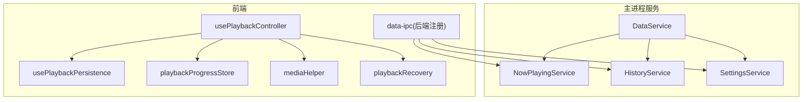
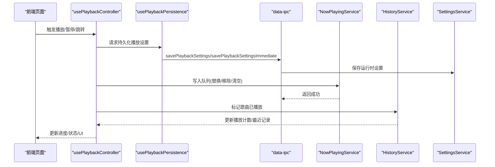
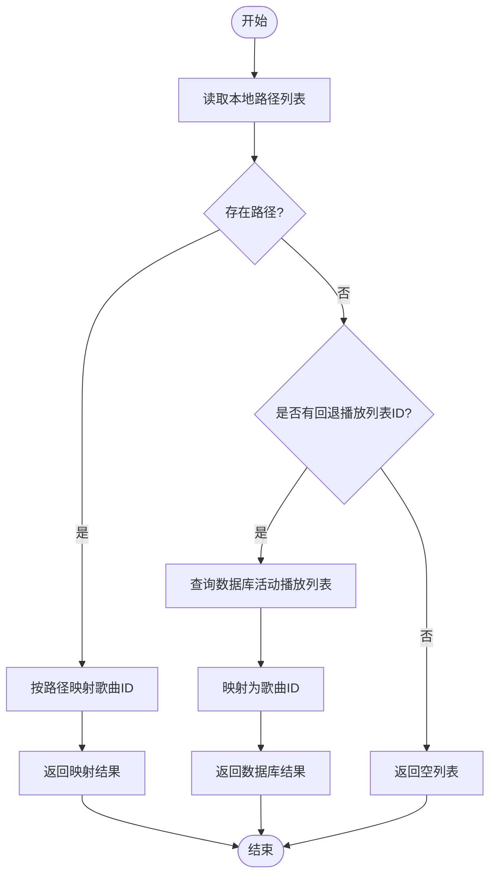
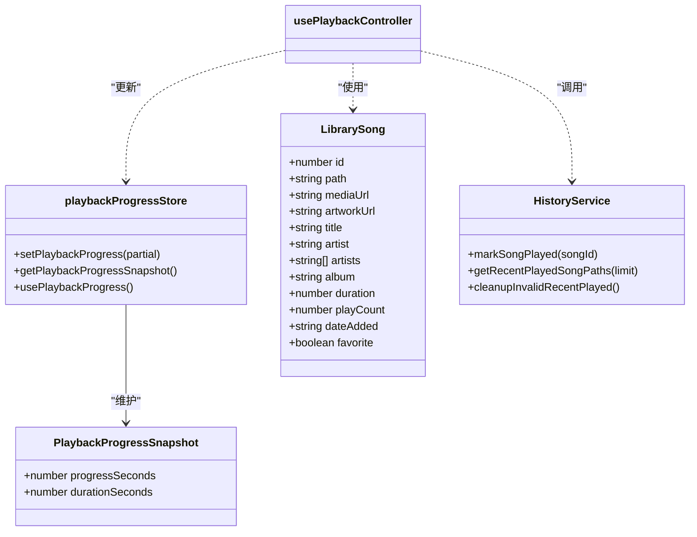
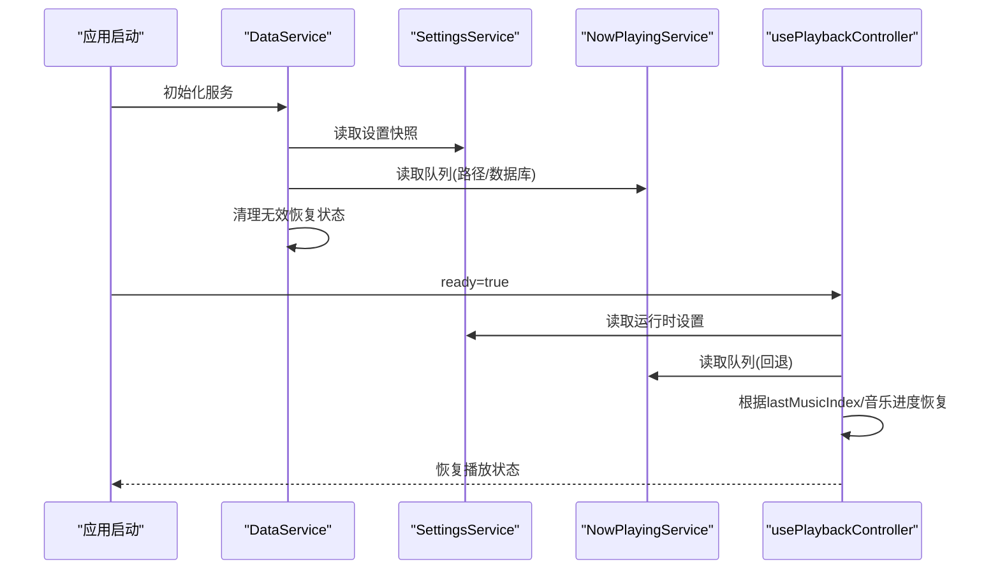
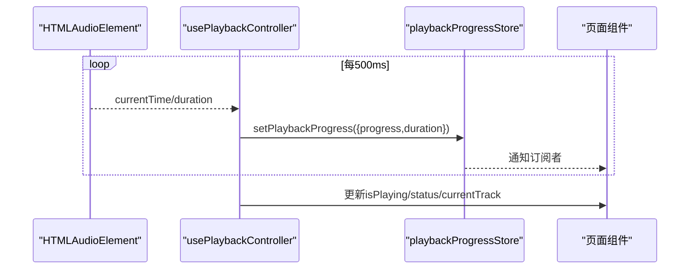
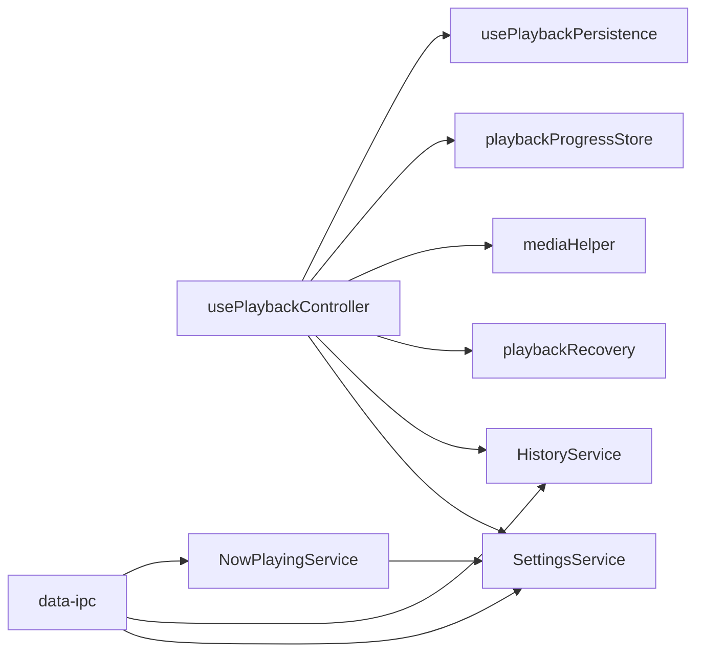
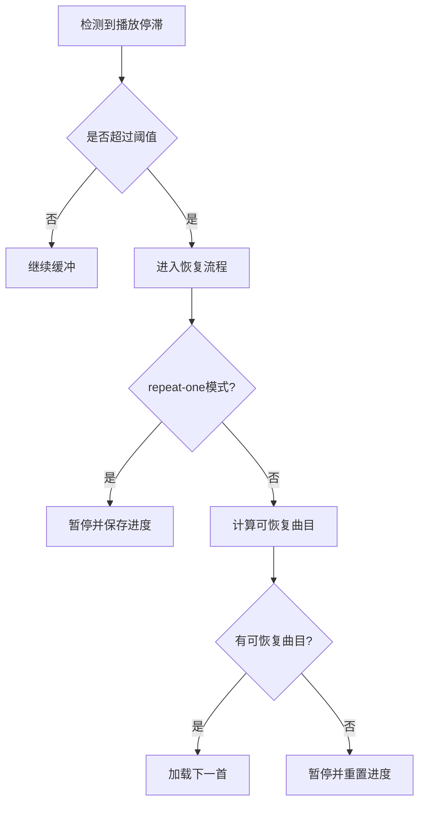

# 正在播放服务

<cite>
**本文引用的文件**
- [electron\services\now-playing-service.ts](file://electron\services\now-playing-service.ts)
- [src\hooks\usePlaybackPersistence.ts](file://src\hooks\usePlaybackPersistence.ts)
- [src\state\playbackProgressStore.ts](file://src\state\playbackProgressStore.ts)
- [src\shared\playbackRecovery.ts](file://src\shared\playbackRecovery.ts)
- [electron\services\history-service.ts](file://electron\services\history-service.ts)
- [src\shared\mediaHelper.ts](file://src\shared\mediaHelper.ts)
- [src\hooks\usePlaybackController.ts](file://src\hooks\usePlaybackController.ts)
- [src\shared\contracts.ts](file://src\shared\contracts.ts)
- [electron\services\constants.ts](file://electron\services\constants.ts)
- [electron\ipc\data-ipc.ts](file://electron\ipc\data-ipc.ts)
- [electron\services\settings-service.ts](file://electron\services\settings-service.ts)
- [electron\services\data-service.ts](file://electron\services\data-service.ts)
</cite>

## 目录
1. [简介](#简介)
2. [项目结构](#项目结构)
3. [核心组件](#核心组件)
4. [架构总览](#架构总览)
5. [详细组件分析](#详细组件分析)
6. [依赖关系分析](#依赖关系分析)
7. [性能考量](#性能考量)
8. [故障排查指南](#故障排查指南)
9. [结论](#结论)
10. [附录](#附录)

## 简介
本文件聚焦于 SMPlayer 的“正在播放”服务，系统性阐述 NowPlayingService 的播放状态管理能力，包括当前播放歌曲、播放队列、播放进度与播放模式的状态跟踪与同步；解析播放状态的数据结构（当前歌曲信息、队列管理、进度记录、播放历史）；说明持久化与恢复机制（应用重启后的状态恢复、播放进度保存、队列重建）；给出实时更新机制（状态变更通知、UI 同步、系统集成）；并讨论扩展功能（跨设备同步、云端播放记录、播放统计分析）以及性能优化与错误处理策略。

## 项目结构
围绕“正在播放”的关键代码分布在 Electron 主进程服务层与前端 Hook/Store 层：
- 主进程服务：NowPlayingService 负责读写“正在播放”队列的持久化；HistoryService 记录播放历史；SettingsService 维护播放运行时设置；data-service 汇聚各服务并负责初始化与恢复。
- 前端 Hook/Store：usePlaybackController 驱动播放控制与状态机；usePlaybackPersistence 负责持久化写入；playbackProgressStore 提供进度订阅；mediaHelper 提供队列与索引计算；playbackRecovery 提供失败恢复逻辑；contracts 定义数据契约。

图表来源
- [electron\services\data-service.ts:78-101](file://electron\services\data-service.ts#L78-L101)
- [electron\services\now-playing-service.ts:6-24](file://electron\services\now-playing-service.ts#L6-L24)
- [electron\services\history-service.ts:30-50](file://electron\services\history-service.ts#L30-L50)
- [electron\services\settings-service.ts:61-79](file://electron\services\settings-service.ts#L61-L79)
- [electron\ipc\data-ipc.ts:20-26](file://electron\ipc\data-ipc.ts#L20-L26)
- [src\hooks\usePlaybackController.ts:68-113](file://src\hooks\usePlaybackController.ts#L68-L113)
- [src\hooks\usePlaybackPersistence.ts:14-20](file://src\hooks\usePlaybackPersistence.ts#L14-L20)
- [src\state\playbackProgressStore.ts:1-13](file://src\state\playbackProgressStore.ts#L1-L13)
- [src\shared\mediaHelper.ts:1-11](file://src\shared\mediaHelper.ts#L1-L11)
- [src\shared\playbackRecovery.ts:1-10](file://src\shared\playbackRecovery.ts#L1-L10)

章节来源
- [electron\services\data-service.ts:64-145](file://electron\services\data-service.ts#L64-L145)
- [electron\ipc\data-ipc.ts:20-151](file://electron\ipc\data-ipc.ts#L20-L151)

## 核心组件
- NowPlayingService：负责“正在播放”队列的持久化读写，支持基于路径或数据库的歌曲 ID 列表重建，并将路径列表写入本地 JSON 文件。
- HistoryService：维护最近播放记录、搜索历史、播放计数等，提供标记歌曲已播放、清理无效记录等功能。
- SettingsService：维护播放运行时设置（音量、静音、播放模式、上次播放位置、进度等），并提供持久化接口。
- usePlaybackController：前端播放控制器，驱动播放状态机、进度同步、失败恢复、队列操作与系统媒体会话集成。
- usePlaybackPersistence：封装播放设置的异步持久化写入，支持立即写入与队列串行化，避免频繁 IO。
- playbackProgressStore：React 外部状态存储，提供播放进度与总时长的订阅与通知。
- playbackRecovery：根据播放模式与失败集合，计算可恢复的下一首曲目。
- mediaHelper：队列与索引工具函数，包括设置播放列表、移动/添加/删除曲目、计算下一首/上一首等。
- contracts：定义播放模式、播放设置更新、NowPlaying 快照等类型。

章节来源
- [electron\services\now-playing-service.ts:6-104](file://electron\services\now-playing-service.ts#L6-L104)
- [electron\services\history-service.ts:30-182](file://electron\services\history-service.ts#L30-L182)
- [electron\services\settings-service.ts:61-179](file://electron\services\settings-service.ts#L61-L179)
- [src\hooks\usePlaybackController.ts:68-583](file://src\hooks\usePlaybackController.ts#L68-L583)
- [src\hooks\usePlaybackPersistence.ts:14-94](file://src\hooks\usePlaybackPersistence.ts#L14-L94)
- [src\state\playbackProgressStore.ts:1-52](file://src\state\playbackProgressStore.ts#L1-L52)
- [src\shared\playbackRecovery.ts:1-25](file://src\shared\playbackRecovery.ts#L1-L25)
- [src\shared\mediaHelper.ts:7-246](file://src\shared\mediaHelper.ts#L7-L246)
- [src\shared\contracts.ts:8-179](file://src\shared\contracts.ts#L8-L179)

## 架构总览
“正在播放”服务通过主进程服务与前端控制器协同工作：
- 主进程负责数据库与文件系统的持久化，前端负责 UI 与用户交互。
- IPC 将前端的播放设置更新与队列操作转发到主进程服务。
- 前端控制器在播放过程中持续同步进度、状态与系统媒体会话。

图表来源
- [src\hooks\usePlaybackController.ts:585-610](file://src\hooks\usePlaybackController.ts#L585-L610)
- [src\hooks\usePlaybackPersistence.ts:24-65](file://src\hooks\usePlaybackPersistence.ts#L24-L65)
- [electron\ipc\data-ipc.ts:65-149](file://electron\ipc\data-ipc.ts#L65-L149)
- [electron\services\now-playing-service.ts:72-93](file://electron\services\now-playing-service.ts#L72-L93)
- [electron\services\history-service.ts:291-306](file://electron\services\history-service.ts#L291-L306)
- [electron\services\settings-service.ts:169-178](file://electron\services\settings-service.ts#L169-L178)

## 详细组件分析

### NowPlayingService：播放队列持久化与恢复
- 数据来源与重建
  - 支持从本地 JSON 读取路径列表并映射为歌曲 ID；若无路径则回退到数据库中的活动播放列表。
  - 写入时先查询有效歌曲路径，再序列化为 JSON 写入文件。
- 关键方法
  - readSongIds：优先使用路径映射，否则回退到数据库活动播放列表。
  - readSongIdsByPath：按路径批量查询歌曲 ID。
  - writeSongIds：将歌曲 ID 映射回路径并写入 JSON。
- 失败与边界
  - 读取 JSON 异常时返回空列表，保证健壮性。
  - 写入空队列时写入空数组，确保状态一致。

图表来源
- [electron\services\now-playing-service.ts:26-48](file://electron\services\now-playing-service.ts#L26-L48)
- [electron\services\now-playing-service.ts:50-70](file://electron\services\now-playing-service.ts#L50-L70)
- [electron\services\now-playing-service.ts:72-93](file://electron\services\now-playing-service.ts#L72-L93)

章节来源
- [electron\services\now-playing-service.ts:26-104](file://electron\services\now-playing-service.ts#L26-L104)

### 播放状态数据结构与同步
- 当前播放歌曲信息
  - 使用 LibrarySong 类型描述歌曲元数据（含媒体 URL、封面 URL、时长等）。
- 队列管理
  - 使用 number[] 表示歌曲 ID 序列；currentIndex、moveNext、movePrev、addNextAndPlay、removeMusic 等工具函数提供队列操作。
- 进度记录
  - playbackProgressStore 提供进度与总时长的外部状态订阅；setPlaybackProgress 在变化时通知监听者。
- 播放历史
  - HistoryService 维护最近播放记录、播放计数、最近播放的歌曲路径等；提供标记歌曲已播放、清理无效记录等能力。

图表来源
- [src\state\playbackProgressStore.ts:3-51](file://src\state\playbackProgressStore.ts#L3-L51)
- [src\shared\contracts.ts:36-49](file://src\shared\contracts.ts#L36-L49)
- [electron\services\history-service.ts:291-338](file://electron\services\history-service.ts#L291-L338)

章节来源
- [src\state\playbackProgressStore.ts:1-52](file://src\state\playbackProgressStore.ts#L1-L52)
- [src\shared\contracts.ts:36-49](file://src\shared\contracts.ts#L36-L49)
- [electron\services\history-service.ts:222-338](file://electron\services\history-service.ts#L222-L338)

### 播放状态的持久化与恢复机制
- 持久化入口
  - usePlaybackPersistence 将播放设置（音量、静音、播放模式、进度、当前曲目索引）写入 SettingsService。
  - IPC 注册了立即写入与异步写入两类接口，满足不同场景的延迟与一致性需求。
- 恢复流程
  - data-service 在启动时清理无效播放恢复状态，并将 LastMusicIndex 与 MusicProgress 归一化到有效范围。
  - usePlaybackController 在 ready 时根据 SettingsService 中的 lastMusicIndex 与 musicProgress 恢复播放队列与进度。
- 队列重建
  - 若本地 JSON 存在路径，则优先映射；否则回退到数据库活动播放列表。

图表来源
- [electron\services\data-service.ts:156-195](file://electron\services\data-service.ts#L156-L195)
- [electron\services\settings-service.ts:199-200](file://electron\services\settings-service.ts#L199-L200)
- [electron\services\now-playing-service.ts:26-48](file://electron\services\now-playing-service.ts#L26-L48)
- [src\hooks\usePlaybackController.ts:515-583](file://src\hooks\usePlaybackController.ts#L515-L583)

章节来源
- [electron\services\settings-service.ts:169-178](file://electron\services\settings-service.ts#L169-L178)
- [electron\ipc\data-ipc.ts:130-144](file://electron\ipc\data-ipc.ts#L130-L144)
- [electron\services\data-service.ts:156-195](file://electron\services\data-service.ts#L156-L195)
- [src\hooks\usePlaybackController.ts:515-583](file://src\hooks\usePlaybackController.ts#L515-L583)

### 实时更新机制：状态变更通知与 UI 同步
- 进度同步
  - usePlaybackController 周期性读取音频元素 currentTime 并更新 playbackProgressStore；同时更新系统媒体会话位置。
- 状态机
  - 通过 transitionPlaybackStatus 驱动 idle、loading、playing、paused、seeking、buffering 等状态。
- UI 同步
  - playbackProgressStore 的订阅者自动刷新 UI；usePlaybackController 将当前曲目、队列索引、播放状态暴露给页面组件。

图表来源
- [src\hooks\usePlaybackController.ts:270-305](file://src\hooks\usePlaybackController.ts#L270-L305)
- [src\state\playbackProgressStore.ts:15-32](file://src\state\playbackProgressStore.ts#L15-L32)

章节来源
- [src\hooks\usePlaybackController.ts:233-305](file://src\hooks\usePlaybackController.ts#L233-L305)
- [src\state\playbackProgressStore.ts:1-52](file://src\state\playbackProgressStore.ts#L1-L52)

### 扩展功能建议
- 跨设备同步
  - 可在主进程引入 RemoteStore 与远程主机连接，将 NowPlayingService 的队列与 SettingsService 的播放设置同步至远端。
- 云端播放记录
  - 结合 HistoryService 的最近播放与播放计数，上传至云端以实现多端播放历史统一。
- 播放统计分析
  - 基于 HistoryService 的播放计数与最近播放记录，结合时间窗口统计生成播放偏好报告。

章节来源
- [electron\services\remote-store.ts:1-200](file://electron\services\remote-store.ts#L1-L200)
- [electron\services\history-service.ts:291-338](file://electron\services\history-service.ts#L291-L338)
- [electron\services\settings-service.ts:169-178](file://electron\services\settings-service.ts#L169-L178)

## 依赖关系分析
- 组件耦合
  - usePlaybackController 依赖 usePlaybackPersistence、playbackProgressStore、mediaHelper、playbackRecovery、HistoryService 与 SettingsService。
  - NowPlayingService 依赖数据库与文件系统，向 IPC 暴露队列操作。
- 外部依赖
  - SQLite 数据库用于持久化设置、播放列表与历史；IPC 用于前后端通信；系统媒体会话用于系统级控制。

图表来源
- [src\hooks\usePlaybackController.ts:17-26](file://src\hooks\usePlaybackController.ts#L17-L26)
- [electron\ipc\data-ipc.ts:20-26](file://electron\ipc\data-ipc.ts#L20-L26)
- [electron\services\now-playing-service.ts:6-24](file://electron\services\now-playing-service.ts#L6-L24)

章节来源
- [src\hooks\usePlaybackController.ts:68-113](file://src\hooks\usePlaybackController.ts#L68-L113)
- [electron\ipc\data-ipc.ts:20-151](file://electron\ipc\data-ipc.ts#L20-L151)

## 性能考量
- 写入队列与设置
  - usePlaybackPersistence 对设置写入进行队列串行化，避免并发写入导致的竞态与抖动。
- 进度同步频率
  - 采用固定周期（约 500ms）读取音频进度，结合阈值判断减少冗余更新。
- 数据库查询
  - NowPlayingService 使用预编译语句与 IN 占位符批量查询，降低 SQL 解析开销。
- 状态归一化
  - data-service 在启动时对 LastMusicIndex 与 MusicProgress 进行边界校正，避免越界访问。

章节来源
- [src\hooks\usePlaybackPersistence.ts:58-65](file://src\hooks\usePlaybackPersistence.ts#L58-L65)
- [src\hooks\usePlaybackController.ts:270-305](file://src\hooks\usePlaybackController.ts#L270-L305)
- [electron\services\now-playing-service.ts:57-86](file://electron\services\now-playing-service.ts#L57-L86)
- [electron\services\data-service.ts:175-195](file://electron\services\data-service.ts#L175-L195)

## 故障排查指南
- 播放卡顿与停滞
  - 使用 stall 检测定时器与缓冲状态切换，超过阈值触发 recoverFromPlaybackFailure，尝试切换到可恢复曲目。
- 恢复失败
  - playbackRecovery 根据播放模式与失败集合选择下一首曲目；若无可恢复曲目则暂停并重置进度。
- 队列不一致
  - NowPlayingService 优先使用路径映射，若映射失败则回退数据库活动播放列表；IPC 提供队列替换/移除/清空接口，便于修复。
- 历史记录异常
  - HistoryService 提供清理无效记录与恢复/移除/清空最近播放记录的能力。

图表来源
- [src\hooks\usePlaybackController.ts:292-304](file://src\hooks\usePlaybackController.ts#L292-L304)
- [src\hooks\usePlaybackController.ts:374-425](file://src\hooks\usePlaybackController.ts#L374-L425)
- [src\shared\playbackRecovery.ts:4-24](file://src\shared\playbackRecovery.ts#L4-L24)

章节来源
- [src\hooks\usePlaybackController.ts:292-425](file://src\hooks\usePlaybackController.ts#L292-L425)
- [src\shared\playbackRecovery.ts:1-25](file://src\shared\playbackRecovery.ts#L1-L25)
- [electron\services\history-service.ts:291-338](file://electron\services\history-service.ts#L291-L338)

## 结论
SMPlayer 的“正在播放”服务通过主进程服务与前端控制器的协作，实现了对播放队列、播放进度、播放模式与播放历史的完整生命周期管理。其持久化与恢复机制确保了应用重启后的状态一致性；实时更新机制保障了 UI 与系统媒体会话的同步；扩展功能建议为跨设备同步与云端播放记录提供了清晰路径。整体设计在性能与可靠性之间取得平衡，具备良好的可维护性与可扩展性。

## 附录
- 关键类型与常量
  - PlaybackMode：播放模式枚举（once/repeat/repeat-one/shuffle）
  - NowPlayingSnapshot：包含播放列表 ID 与歌曲 ID 序列
  - ACTIVE_STATE：状态常量（active/inactive/hidden/parentHidden）

章节来源
- [src\shared\contracts.ts:8-179](file://src\shared\contracts.ts#L8-L179)
- [electron\services\constants.ts:22-27](file://electron\services\constants.ts#L22-L27)