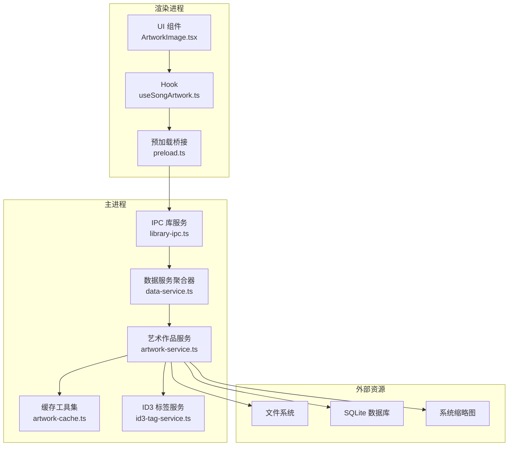
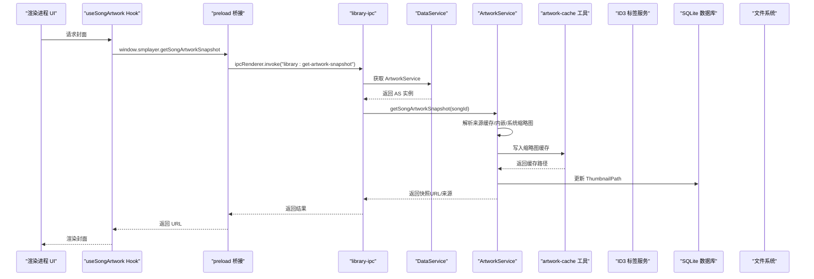
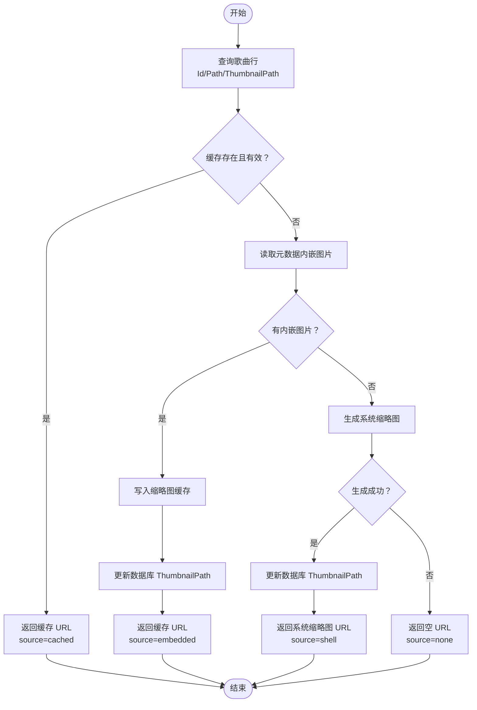
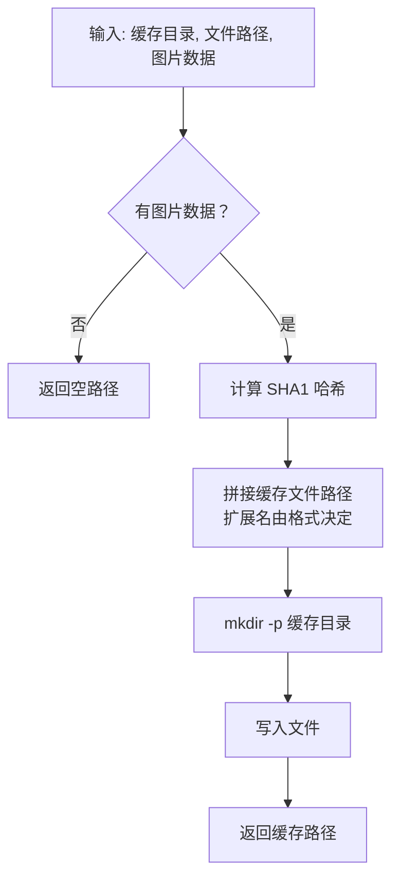
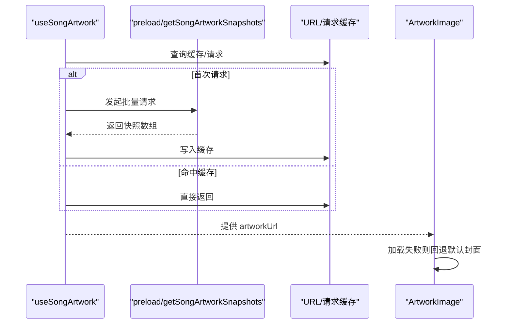
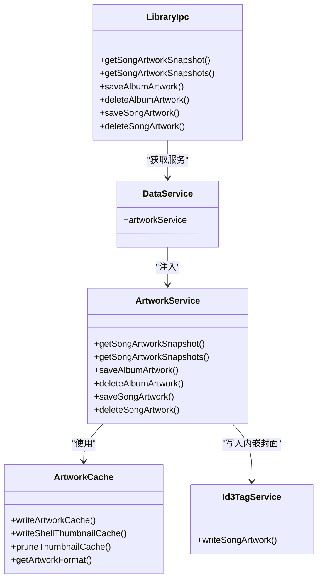

# 艺术作品服务

<cite>
**本文引用的文件**
- [electron\services\artwork-service.ts](file://electron/services/artwork-service.ts)
- [electron\services\artwork-cache.ts](file://electron/services/artwork-cache.ts)
- [electron\services\id3-tag-service.ts](file://electron/services/id3-tag-service.ts)
- [electron\services\data-service.ts](file://electron/services/data-service.ts)
- [electron\ipc\library-ipc.ts](file://electron/ipc/library-ipc.ts)
- [electron\preload.ts](file://electron/preload.ts)
- [src\hooks\useSongArtwork.ts](file://src/hooks/useSongArtwork.ts)
- [src\components\ArtworkImage.tsx](file://src/components/ArtworkImage.tsx)
- [src\components\DefaultAlbumArtwork.tsx](file://src/components/DefaultAlbumArtwork.tsx)
- [src\shared\contracts.ts](file://src/shared/contracts.ts)
- [src\shared\staticAssets.ts](file://src/shared/staticAssets.ts)
- [src\shared\artworkColor.ts](file://src/shared/artworkColor.ts)
- [electron\services\constants.ts](file://electron/services/constants.ts)
</cite>

## 目录
1. [简介](#简介)
2. [项目结构](#项目结构)
3. [核心组件](#核心组件)
4. [架构总览](#架构总览)
5. [详细组件分析](#详细组件分析)
6. [依赖关系分析](#依赖关系分析)
7. [性能考量](#性能考量)
8. [故障排查指南](#故障排查指南)
9. [结论](#结论)
10. [附录](#附录)

## 简介
本文件系统性阐述 SMPlayer 的艺术作品服务（ArtworkService），重点覆盖以下方面：
- 封面图片获取与来源：文件内嵌图片、外部文件、系统缩略图（Shell）等
- 缓存策略与存储：本地缩略图缓存、格式选择、过期重建与清理
- 数据存储机制：数据库记录（缩略图路径）、文件系统写入（MP3 内嵌）
- 处理流程：图片解码、尺寸调整、格式转换、质量优化
- 前端集成：批量请求、缓存命中、错误回退与刷新
- 扩展与自定义：支持的图片格式、缩略图尺寸、可配置项

## 项目结构
艺术作品服务横跨渲染进程与主进程，采用“前端请求 → IPC → 主进程服务 → 文件系统/数据库”的分层设计。

图表来源
- [electron\ipc\library-ipc.ts:53-58](file://electron/ipc/library-ipc.ts#L53-L58)
- [electron\services\data-service.ts:82-84](file://electron/services/data-service.ts#L82-L84)
- [electron\services\artwork-service.ts:25-34](file://electron/services/artwork-service.ts#L25-L34)
- [electron\services\artwork-cache.ts:10-27](file://electron/services/artwork-cache.ts#L10-L27)
- [electron\services\id3-tag-service.ts:77-101](file://electron/services/id3-tag-service.ts#L77-L101)

章节来源
- [electron\ipc\library-ipc.ts:28-102](file://electron/ipc/library-ipc.ts#L28-L102)
- [electron\services\data-service.ts:64-101](file://electron/services/data-service.ts#L64-L101)
- [electron\services\artwork-service.ts:25-34](file://electron/services/artwork-service.ts#L25-L34)

## 核心组件
- 艺术作品服务（ArtworkService）：负责封面解析、来源选择、缓存写入、数据库更新、专辑级封面批量处理
- 缓存工具集（artwork-cache.ts）：负责缩略图缓存写入、系统缩略图生成、缓存清理、格式推断
- ID3 标签服务（id3-tag-service.ts）：负责将封面写入 MP3 文件内嵌 APIC 帧
- 数据服务聚合器（data-service.ts）：初始化数据库、扫描服务、设置缩略图缓存路径并注入 ArtworkService
- 前端 Hook（useSongArtwork.ts）：批量请求、缓存与去抖、错误回退
- 前端组件（ArtworkImage.tsx、DefaultAlbumArtwork.tsx）：展示与回退
- IPC（library-ipc.ts）：暴露封面快照接口给渲染进程
- 预加载桥接（preload.ts）：注册 IPC 句柄并暴露 smplayer API

章节来源
- [electron\services\artwork-service.ts:25-340](file://electron/services/artwork-service.ts#L25-L340)
- [electron\services\artwork-cache.ts:1-125](file://electron/services/artwork-cache.ts#L1-L125)
- [electron\services\id3-tag-service.ts:1-200](file://electron/services/id3-tag-service.ts#L1-L200)
- [electron\services\data-service.ts:39-145](file://electron/services/data-service.ts#L39-L145)
- [src\hooks\useSongArtwork.ts:1-197](file://src/hooks/useSongArtwork.ts#L1-L197)
- [src\components\ArtworkImage.tsx:1-33](file://src/components/ArtworkImage.tsx#L1-L33)
- [src\components\DefaultAlbumArtwork.tsx:1-16](file://src/components/DefaultAlbumArtwork.tsx#L1-L16)
- [electron\ipc\library-ipc.ts:53-102](file://electron/ipc/library-ipc.ts#L53-L102)
- [electron\preload.ts:80-92](file://electron/preload.ts#L80-L92)

## 架构总览
艺术作品服务的调用链从渲染进程发起，经 IPC 到主进程，再由 ArtworkService 决策来源与缓存策略，并最终写入数据库或文件系统。

图表来源
- [electron\ipc\library-ipc.ts:53-58](file://electron/ipc/library-ipc.ts#L53-L58)
- [electron\services\data-service.ts:82-84](file://electron/services/data-service.ts#L82-L84)
- [electron\services\artwork-service.ts:36-47](file://electron/services/artwork-service.ts#L36-L47)
- [electron\services\artwork-cache.ts:10-27](file://electron/services/artwork-cache.ts#L10-L27)
- [electron\services\id3-tag-service.ts:77-101](file://electron/services/id3-tag-service.ts#L77-L101)

## 详细组件分析

### 艺术作品服务（ArtworkService）
职责与流程要点：
- 单曲封面快照：优先使用已缓存缩略图；若无效则读取音乐元数据中的内嵌图片；最后回退到系统缩略图
- 批量快照：并发限制（每批最多 6 个）以平衡吞吐与资源占用
- 专辑级封面：批量写入歌曲内嵌图片、生成专辑缩略图缓存并更新数据库
- 歌曲级封面：写入单曲内嵌图片、生成缓存并更新数据库
- 来源枚举：cached/embedded/shell/none

图表来源
- [electron\services\artwork-service.ts:259-310](file://electron/services/artwork-service.ts#L259-L310)
- [electron\services\artwork-cache.ts:29-49](file://electron/services/artwork-cache.ts#L29-L49)

章节来源
- [electron\services\artwork-service.ts:36-77](file://electron/services/artwork-service.ts#L36-L77)
- [electron\services\artwork-service.ts:156-178](file://electron/services/artwork-service.ts#L156-L178)
- [electron\services\artwork-service.ts:180-233](file://electron/services/artwork-service.ts#L180-L233)
- [electron\services\artwork-service.ts:259-310](file://electron/services/artwork-service.ts#L259-L310)
- [electron\services\artwork-service.ts:317-340](file://electron/services/artwork-service.ts#L317-L340)

### 缓存管理（artwork-cache.ts）
- 缩略图缓存写入：根据图片内容哈希命名，避免重复；自动创建目录
- 系统缩略图：通过 Electron 原生能力生成固定尺寸 PNG；兼容旧版本命名以便重建
- 缓存清理：基于活动缩略图集合进行差量删除，失败不阻断主流程
- 格式推断：依据文件扩展名或图片头信息推断目标格式（png/webp/gif/jpg）

图表来源
- [electron\services\artwork-cache.ts:10-27](file://electron/services/artwork-cache.ts#L10-L27)

章节来源
- [electron\services\artwork-cache.ts:10-83](file://electron/services/artwork-cache.ts#L10-L83)
- [electron\services\artwork-cache.ts:116-124](file://electron/services/artwork-cache.ts#L116-L124)

### 数据存储机制
- 数据库存储：歌曲行包含 ThumbnailPath 字段，用于持久化缩略图路径
- 文件存储：缩略图缓存写入文件系统；MP3 内嵌图片通过 ID3 标签写入音频文件
- 缓存策略：按内容哈希命名，避免重复；系统缩略图按版本号命名，便于迁移重建

章节来源
- [electron\services\artwork-service.ts:240-257](file://electron/services/artwork-service.ts#L240-L257)
- [electron\services\id3-tag-service.ts:77-101](file://electron/services/id3-tag-service.ts#L77-L101)
- [electron\services\artwork-cache.ts:10-27](file://electron/services/artwork-cache.ts#L10-L27)

### 封面来源与处理流程
- 文件内嵌图片：从音乐元数据中提取，写入缓存并更新数据库
- 外部文件：直接作为封面来源（非音频文件时）
- 在线 API：未在代码中实现
- 用户上传：通过 IPC 接口保存/删除专辑/单曲封面
- 处理流程：解码（由元数据解析库完成）、尺寸调整（系统缩略图固定尺寸）、格式转换（按需写入 PNG/JPEG/WebP/GIF）、质量优化（系统缩略图 PNG）

章节来源
- [electron\services\artwork-service.ts:156-178](file://electron/services/artwork-service.ts#L156-L178)
- [electron\services\artwork-service.ts:272-290](file://electron/services/artwork-service.ts#L272-L290)
- [electron\services\artwork-cache.ts:29-49](file://electron/services/artwork-cache.ts#L29-L49)

### 前端集成与缓存策略
- 批量请求：useSongArtwork 对同一帧内的多次请求进行合并与去抖，减少 IPC 调用
- 缓存命中：优先使用已缓存 URL；对生成型 URL（smplayer-artwork://）进行二次校验
- 错误回退：ArtworkImage 组件在加载失败时回退到默认封面
- 刷新机制：支持强制刷新以绕过缓存

图表来源
- [src\hooks\useSongArtwork.ts:36-83](file://src/hooks/useSongArtwork.ts#L36-L83)
- [src\hooks\useSongArtwork.ts:111-155](file://src/hooks/useSongArtwork.ts#L111-L155)
- [src\components\ArtworkImage.tsx:13-32](file://src/components/ArtworkImage.tsx#L13-L32)

章节来源
- [src\hooks\useSongArtwork.ts:1-197](file://src/hooks/useSongArtwork.ts#L1-L197)
- [src\components\ArtworkImage.tsx:1-33](file://src/components/ArtworkImage.tsx#L1-L33)
- [src\components\DefaultAlbumArtwork.tsx:1-16](file://src/components/DefaultAlbumArtwork.tsx#L1-L16)

### IPC 与扩展接口
- 渲染进程通过 preload 暴露的 smplayer API 调用库服务
- 主进程注册封面相关 IPC：获取单/多快照、选择封面来源、保存/删除专辑/单曲封面
- 支持清空会话缓存以确保新封面生效

章节来源
- [electron\ipc\library-ipc.ts:53-102](file://electron/ipc/library-ipc.ts#L53-L102)
- [electron\preload.ts:80-92](file://electron/preload.ts#L80-L92)

## 依赖关系分析
- ArtworkService 依赖：
  - 数据库（读取歌曲行、更新缩略图路径）
  - 缓存工具集（写入缩略图缓存、生成系统缩略图、清理缓存）
  - ID3 标签服务（写入 MP3 内嵌封面）
  - 音频元数据解析库（提取内嵌图片）
- 前端依赖：
  - useSongArtwork 进行批量请求与缓存
  - ArtworkImage/DefaultAlbumArtwork 进行展示与回退

图表来源
- [electron\services\artwork-service.ts:25-34](file://electron/services/artwork-service.ts#L25-L34)
- [electron\services\artwork-cache.ts:10-83](file://electron/services/artwork-cache.ts#L10-L83)
- [electron\services\id3-tag-service.ts:77-101](file://electron/services/id3-tag-service.ts#L77-L101)
- [electron\services\data-service.ts:82-84](file://electron/services/data-service.ts#L82-L84)
- [electron\ipc\library-ipc.ts:53-102](file://electron/ipc/library-ipc.ts#L53-L102)

章节来源
- [electron\services\artwork-service.ts:25-34](file://electron/services/artwork-service.ts#L25-L34)
- [electron\services\artwork-cache.ts:10-83](file://electron/services/artwork-cache.ts#L10-L83)
- [electron\services\id3-tag-service.ts:77-101](file://electron/services/id3-tag-service.ts#L77-L101)
- [electron\services\data-service.ts:82-84](file://electron/services/data-service.ts#L82-L84)
- [electron\ipc\library-ipc.ts:53-102](file://electron/ipc/library-ipc.ts#L53-L102)

## 性能考量
- 并发控制：批量解析时限制并发数（每批最多 6 个），避免 I/O 抖动
- 缓存命中：优先使用缓存与数据库记录，减少重复解析与生成
- 系统缩略图：固定尺寸生成，避免大图处理开销
- 清理策略：仅删除非活动缩略图，失败不中断主流程
- 建议优化：
  - 对高频访问的封面增加预加载队列
  - 对网络来源（未来扩展）增加内存缓存与 CDN 支持
  - 对大图场景引入懒加载与占位符

## 故障排查指南
- 封面为空：
  - 检查歌曲是否存在于活跃状态
  - 确认缓存路径是否存在且可写
  - 若为 MP3，确认内嵌图片是否正确写入
- 加载失败回退：
  - 确认默认封面 URL 是否可用
  - 检查前端错误回调逻辑
- 刷新后未生效：
  - 确认保存/删除操作后是否触发了会话缓存清理
  - 检查数据库 ThumbnailPath 是否更新

章节来源
- [electron\services\artwork-service.ts:252-254](file://electron/services/artwork-service.ts#L252-L254)
- [electron\services\artwork-cache.ts:56-83](file://electron/services/artwork-cache.ts#L56-L83)
- [electron\ipc\library-ipc.ts:86-102](file://electron/ipc/library-ipc.ts#L86-L102)
- [src\components\DefaultAlbumArtwork.tsx:9-15](file://src/components/DefaultAlbumArtwork.tsx#L9-L15)

## 结论
SMPlayer 的艺术作品服务通过“缓存优先 + 元数据内嵌 + 系统缩略图”的三层来源策略，结合数据库持久化与文件系统写入，实现了稳定高效的封面管理。前端通过批量请求与缓存策略显著降低 IPC 开销，配合错误回退与刷新机制提升用户体验。后续可在网络来源、内存缓存与预加载等方面进一步增强性能与扩展性。

## 附录

### 数据模型与来源类型
- 快照结构：包含歌曲 ID、封面 URL、来源 URL、来源路径与来源类型
- 来源类型：cached（缓存）、embedded（内嵌）、shell（系统缩略图）、none（无）

章节来源
- [src\shared\contracts.ts:51-59](file://src/shared/contracts.ts#L51-L59)

### 默认封面与颜色提取
- 默认封面：应用图标作为默认封面
- 颜色提取：基于封面像素网格采样，计算与最小/最大阈值的距离，选择最合适的 RGB

章节来源
- [src\components\DefaultAlbumArtwork.tsx:1-16](file://src/components/DefaultAlbumArtwork.tsx#L1-L16)
- [src\shared\staticAssets.ts:1](file://src/shared/staticAssets.ts#L1)
- [src\shared\artworkColor.ts:18-49](file://src/shared/artworkColor.ts#L18-L49)

### 支持的图片格式与尺寸
- 缓存格式：png、webp、gif、jpg（依据扩展名或格式推断）
- 系统缩略图尺寸：固定 1024×1024（PNG）

章节来源
- [electron\services\artwork-cache.ts:85-114](file://electron/services/artwork-cache.ts#L85-L114)
- [electron\services\artwork-cache.ts:7-8](file://electron/services/artwork-cache.ts#L7-L8)