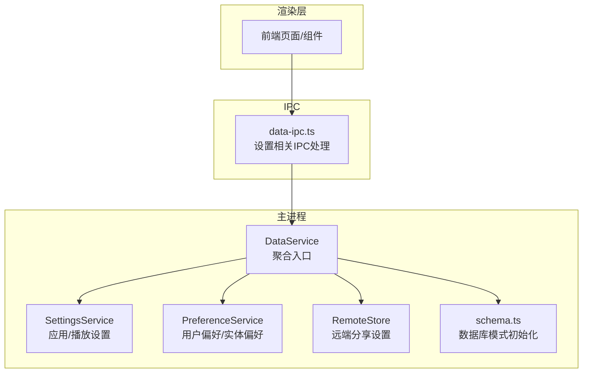
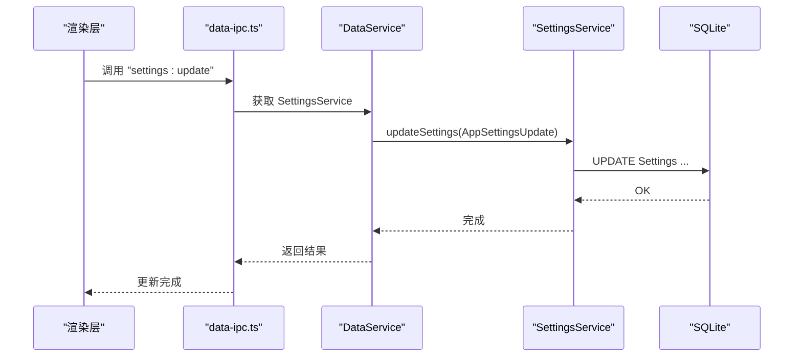
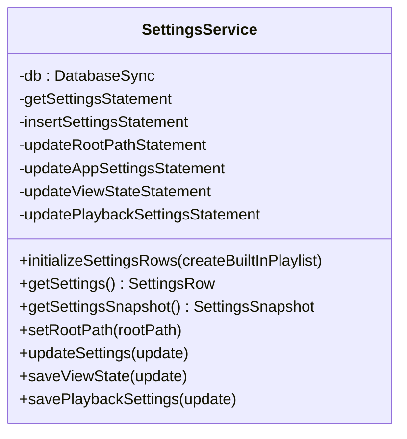
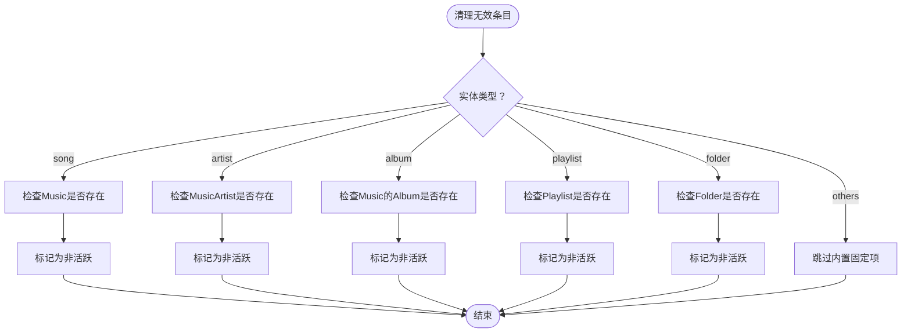
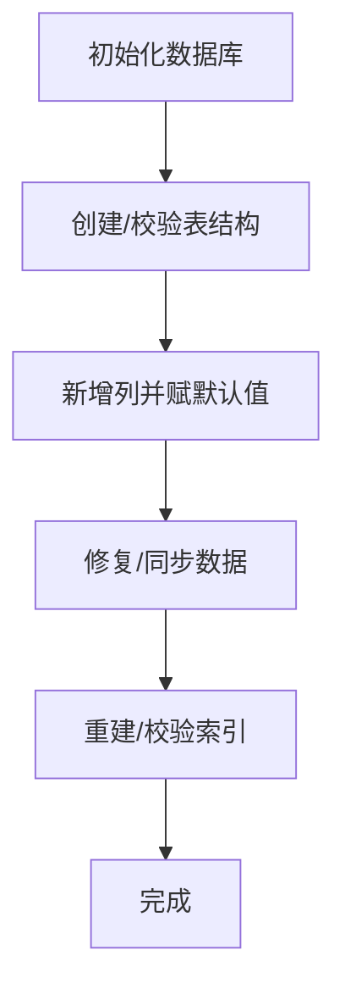
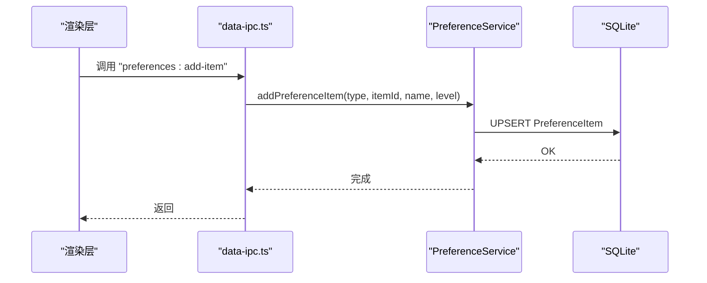
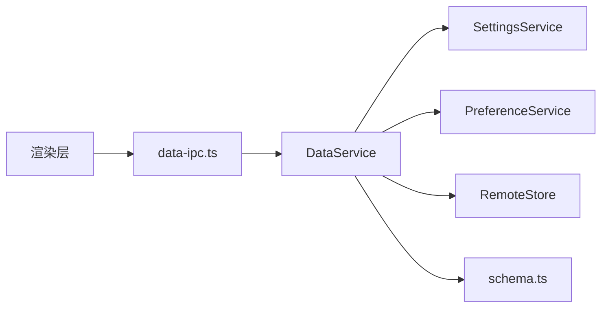

# 设置服务

<cite>
**本文引用的文件**
- [settings-service.ts](file://electron/services/settings-service.ts)
- [preference-service.ts](file://electron/services/preference-service.ts)
- [preference-compatibility.ts](file://electron/services/preference-compatibility.ts)
- [schema.ts](file://electron/services/schema.ts)
- [constants.ts](file://electron/services/constants.ts)
- [data-service.ts](file://electron/services/data-service.ts)
- [contracts.ts](file://src/shared/contracts.ts)
- [data-ipc.ts](file://electron/ipc/data-ipc.ts)
- [main.ts](file://electron/main.ts)
</cite>

## 目录
1. [简介](#简介)
2. [项目结构](#项目结构)
3. [核心组件](#核心组件)
4. [架构总览](#架构总览)
5. [详细组件分析](#详细组件分析)
6. [依赖关系分析](#依赖关系分析)
7. [性能考量](#性能考量)
8. [故障排除指南](#故障排除指南)
9. [结论](#结论)
10. [附录](#附录)

## 简介
本文件面向SMPlayer的设置服务，系统性阐述SettingsService与PreferenceService的职责边界、数据模型、持久化策略、版本兼容与通知机制，并给出扩展能力（导入导出、多用户配置、设置模板）的设计建议与最佳实践。读者可据此理解设置项的定义、默认值管理、类型映射、变更传播与回滚策略，以及在Electron主进程中的集成方式。

## 项目结构
设置服务位于Electron主进程侧，通过SQLite数据库进行持久化，配合IPC向渲染层暴露读写接口；同时与扫描、播放队列、歌词、远程分享等子系统协作，确保设置变更能跨模块生效。

图表来源
- [data-service.ts:64-145](file://electron/services/data-service.ts#L64-L145)
- [schema.ts:33-260](file://electron/services/schema.ts#L33-L260)
- [data-ipc.ts:108-144](file://electron/ipc/data-ipc.ts#L108-L144)

章节来源
- [data-service.ts:39-145](file://electron/services/data-service.ts#L39-L145)
- [schema.ts:33-260](file://electron/services/schema.ts#L33-L260)

## 核心组件
- SettingsService：负责应用配置、播放设置、视图状态的读取与更新，提供快照转换与类型映射。
- PreferenceService：负责“实体偏好”（歌曲/艺人/专辑/歌单/文件夹等）的启用状态、优先级与内置项兼容。
- PreferenceCompatibility：保证内置偏好项的存在与关联ID一致性，实现版本演进时的兼容。
- 数据库模式：schema.ts统一初始化Settings、PreferenceSetting、PreferenceItem等表及索引，并维护列演进。
- IPC接口：data-ipc.ts将设置更新、视图状态保存、播放设置即时保存等操作暴露给渲染层。

章节来源
- [settings-service.ts:61-293](file://electron/services/settings-service.ts#L61-L293)
- [preference-service.ts:44-401](file://electron/services/preference-service.ts#L44-L401)
- [preference-compatibility.ts:10-48](file://electron/services/preference-compatibility.ts#L10-L48)
- [schema.ts:33-363](file://electron/services/schema.ts#L33-L363)
- [data-ipc.ts:108-144](file://electron/ipc/data-ipc.ts#L108-L144)

## 架构总览
设置服务围绕“单一设置行（Settings）+ 偏好设置行（PreferenceSetting）+ 偏好条目（PreferenceItem）”展开，所有写入均通过预编译SQL语句执行，读取通过快照转换为前端可用的强类型对象。IPC层负责桥接渲染层请求与主进程服务。

图表来源
- [data-ipc.ts:108-113](file://electron/ipc/data-ipc.ts#L108-L113)
- [settings-service.ts:208-269](file://electron/services/settings-service.ts#L208-L269)

章节来源
- [data-ipc.ts:108-144](file://electron/ipc/data-ipc.ts#L108-L144)
- [settings-service.ts:61-293](file://electron/services/settings-service.ts#L61-L293)

## 详细组件分析

### SettingsService 组件分析
- 职责
  - 初始化设置行（若不存在则插入默认行）
  - 读取当前设置行并转为快照（SettingsSnapshot）
  - 应用设置更新（AppSettingsUpdate），含主题、夜间模式、通知、歌词源、排序、本地视图、退出行为等
  - 视图状态保存（最后页面、最后歌单）
  - 播放设置保存（音量、静音、播放模式、进度、上次曲目）

- 数据模型与默认值
  - Settings表字段覆盖应用外观、通知、歌词、排序、播放控制、本地视图、退出行为等
  - schema.ts中为各字段提供默认值，确保新安装或迁移后具备合理初始状态

- 类型映射与兼容
  - 将数值枚举映射为前端枚举类型（如夜间模式、播放模式、排序准则、语言等）
  - 提供toXxxValue与mapXxx函数对称转换，保证前后一致

- 并发与事务
  - 所有写入使用预编译语句，避免SQL注入
  - 多处更新为单行写入，无需显式事务

图表来源
- [settings-service.ts:61-293](file://electron/services/settings-service.ts#L61-L293)

章节来源
- [settings-service.ts:61-293](file://electron/services/settings-service.ts#L61-L293)
- [schema.ts:39-83](file://electron/services/schema.ts#L39-L83)
- [contracts.ts:318-357](file://src/shared/contracts.ts#L318-L357)

### PreferenceService 组件分析
- 职责
  - 读取/更新偏好设置开关（歌曲/艺人/专辑/歌单/文件夹）
  - 添加/更新/删除偏好条目（PreferenceItem），支持层级（PreferenceLevel）
  - 清理无效条目（基于实体有效性检查）
  - 生成偏好快照（PreferenceSettingsSnapshot），按类型分组

- 内置偏好项与兼容
  - 通过ensurePreferenceCompatibility确保内置条目存在并正确关联到PreferenceSetting的ID字段
  - 支持版本演进时自动补齐缺失的内置项

- 实体类型与层级
  - 实体类型覆盖歌曲、艺人、专辑、歌单、文件夹及“最近添加/我的收藏/最常播放/最少播放”
  - 层级支持“不出现/不喜欢/正常/高/更高/非常高等”

图表来源
- [preference-service.ts:194-273](file://electron/services/preference-service.ts#L194-L273)

章节来源
- [preference-service.ts:44-401](file://electron/services/preference-service.ts#L44-L401)
- [preference-compatibility.ts:10-48](file://electron/services/preference-compatibility.ts#L10-L48)
- [contracts.ts:198-208](file://src/shared/contracts.ts#L198-L208)

### 数据库模式与版本兼容
- 初始化
  - schema.ts创建Settings、PreferenceSetting、PreferenceItem等表，建立必要索引
  - 插入默认行（如SearchState），确保最小可用状态

- 列演进
  - 使用addColumnIfMissing/renameColumnIfPresent保障新增/重命名列的兼容
  - 针对Settings表补充新增字段（如夜间模式时间、歌词源、退出行为等）并赋予默认值

- 同步与修复
  - 同步专辑信息、修正搜索历史类型、重建索引等

图表来源
- [schema.ts:33-363](file://electron/services/schema.ts#L33-L363)

章节来源
- [schema.ts:33-363](file://electron/services/schema.ts#L33-L363)

### IPC 接口与前端交互
- 设置更新
  - 渲染层调用 "settings:update"，主进程通过SettingsService.apply并触发托盘菜单与任务栏列表刷新

- 偏好设置
  - "preferences:update-settings"/"preferences:add-item"/"preferences:update-item"/"preferences:remove-item"/"preferences:clear-invalid"等

- 视图与播放设置
  - "view-state:save"、"playback:save-settings"、"playback:get-settings-immediate"、"playback:save-settings-immediate"

图表来源
- [data-ipc.ts:114-128](file://electron/ipc/data-ipc.ts#L114-L128)
- [preference-service.ts:141-171](file://electron/services/preference-service.ts#L141-L171)

章节来源
- [data-ipc.ts:108-144](file://electron/ipc/data-ipc.ts#L108-L144)
- [preference-service.ts:44-401](file://electron/services/preference-service.ts#L44-L401)

## 依赖关系分析
- DataService作为聚合入口，持有SettingsService、PreferenceService、RemoteStore等实例，并在构造阶段完成数据库初始化与设置行初始化
- SettingsService依赖SQLite语句与类型映射函数，不直接依赖其他业务服务
- PreferenceService依赖SQLite与内置偏好项兼容逻辑
- IPC层仅通过DataService间接访问各服务，保持职责分离

图表来源
- [data-service.ts:39-145](file://electron/services/data-service.ts#L39-L145)
- [data-ipc.ts:20-27](file://electron/ipc/data-ipc.ts#L20-L27)

章节来源
- [data-service.ts:39-145](file://electron/services/data-service.ts#L39-L145)
- [data-ipc.ts:20-27](file://electron/ipc/data-ipc.ts#L20-L27)

## 性能考量
- 预编译语句：所有写入均使用预编译语句，减少解析开销与SQL注入风险
- WAL模式与同步策略：schema初始化启用WAL与NORMAL同步，提升并发读写性能
- 索引优化：为常用查询字段建立唯一/普通索引，降低查询成本
- 批量操作：PreferenceService的清理流程按类型分支，避免全表扫描
- 快照转换：SettingsService将整行转为快照，前端按需消费，避免重复查询

章节来源
- [schema.ts:35-37](file://electron/services/schema.ts#L35-L37)
- [schema.ts:238-260](file://electron/services/schema.ts#L238-L260)
- [settings-service.ts:181-197](file://electron/services/settings-service.ts#L181-L197)

## 故障排除指南
- 设置未初始化
  - 现象：读取设置时报错或返回空
  - 排查：确认DataService构造时已调用initializeSettingsRows
  - 参考
    - [data-service.ts:156-158](file://electron/services/data-service.ts#L156-L158)
    - [settings-service.ts:181-187](file://electron/services/settings-service.ts#L181-L187)

- 偏好项显示无效
  - 现象：偏好项不可用或无法移除
  - 排查：调用clearInvalidPreferenceItems(type)清理失效条目；确认内置偏好项是否齐全
  - 参考
    - [preference-service.ts:194-273](file://electron/services/preference-service.ts#L194-L273)
    - [preference-compatibility.ts:15-30](file://electron/services/preference-compatibility.ts#L15-L30)

- 设置更新未生效
  - 现象：前端仍显示旧值
  - 排查：确认IPC调用成功且SettingsService.updateSettings已执行；检查映射函数与默认值
  - 参考
    - [data-ipc.ts:108-113](file://electron/ipc/data-ipc.ts#L108-L113)
    - [settings-service.ts:208-269](file://electron/services/settings-service.ts#L208-L269)

- 数据库损坏或列缺失
  - 现象：启动失败或字段异常
  - 排查：重新初始化schema；检查addColumnIfMissing/renameColumnIfPresent逻辑
  - 参考
    - [schema.ts:33-363](file://electron/services/schema.ts#L33-L363)

- 远程分享密码变更导致授权失效
  - 现象：设备被强制下线或无法连接
  - 排查：更新RemoteShareSettings时会将AuthorizedDevice标记为非活跃，需重新授权
  - 参考
    - [remote-store.ts:106-112](file://electron/services/remote-store.ts#L106-L112)

章节来源
- [data-service.ts:156-158](file://electron/services/data-service.ts#L156-L158)
- [preference-service.ts:194-273](file://electron/services/preference-service.ts#L194-L273)
- [preference-compatibility.ts:15-30](file://electron/services/preference-compatibility.ts#L15-L30)
- [data-ipc.ts:108-113](file://electron/ipc/data-ipc.ts#L108-L113)
- [settings-service.ts:208-269](file://electron/services/settings-service.ts#L208-L269)
- [schema.ts:33-363](file://electron/services/schema.ts#L33-L363)
- [remote-store.ts:106-112](file://electron/services/remote-store.ts#L106-L112)

## 结论
SettingsService与PreferenceService以SQLite为核心，提供稳定、可演进的设置管理能力。通过明确的类型映射、默认值与兼容策略，确保新老版本平滑过渡；通过IPC桥接渲染层，实现设置变更的即时反馈。建议在后续迭代中引入设置导入/导出、多用户配置与模板能力，进一步增强可移植性与可复用性。

## 附录

### 设置项定义与默认值一览（节选）
- 应用设置（AppSettingsUpdate）
  - 主题色、夜间模式、通知发送/显示、歌词请求模式、语言、排序准则、本地视图、退出行为、是否保存音乐进度等
  - 默认值由schema.ts提供，映射函数保证前后一致
  - 参考
    - [schema.ts:39-83](file://electron/services/schema.ts#L39-L83)
    - [settings-service.ts:208-269](file://electron/services/settings-service.ts#L208-L269)

- 播放设置（PlaybackSettingsUpdate）
  - 上次曲目索引、音量、静音、播放模式、进度
  - 参考
    - [contracts.ts:481-487](file://src/shared/contracts.ts#L481-L487)
    - [settings-service.ts:281-292](file://electron/services/settings-service.ts#L281-L292)

- 偏好设置（PreferenceSettingsUpdate）
  - 歌曲/艺人/专辑/歌单/文件夹开关
  - 参考
    - [contracts.ts:409-415](file://src/shared/contracts.ts#L409-L415)
    - [preference-service.ts:125-139](file://electron/services/preference-service.ts#L125-L139)

- 偏好条目（PreferenceItem）
  - 类型、ID、名称、启用状态、层级、有效性
  - 参考
    - [contracts.ts:379-389](file://src/shared/contracts.ts#L379-L389)
    - [preference-service.ts:300-344](file://electron/services/preference-service.ts#L300-L344)

### 扩展功能建议（设计思路）
- 设置导入/导出
  - 在IPC层增加 "settings:export" / "settings:import"，序列化SettingsSnapshot与PreferenceSettingsSnapshot，支持选择性覆盖
- 多用户配置
  - 为每个用户创建独立数据库文件或在Settings表中增加UserId字段，切换用户时加载对应配置
- 设置模板
  - 提供“模板集”，允许快速切换“工作/休闲/夜间”等预设，内部映射到AppSettingsUpdate集合

[本节为概念性内容，不直接分析具体文件，故无章节来源]