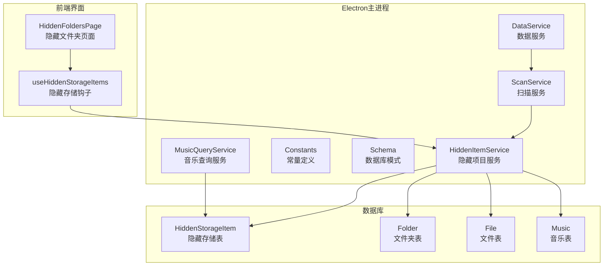
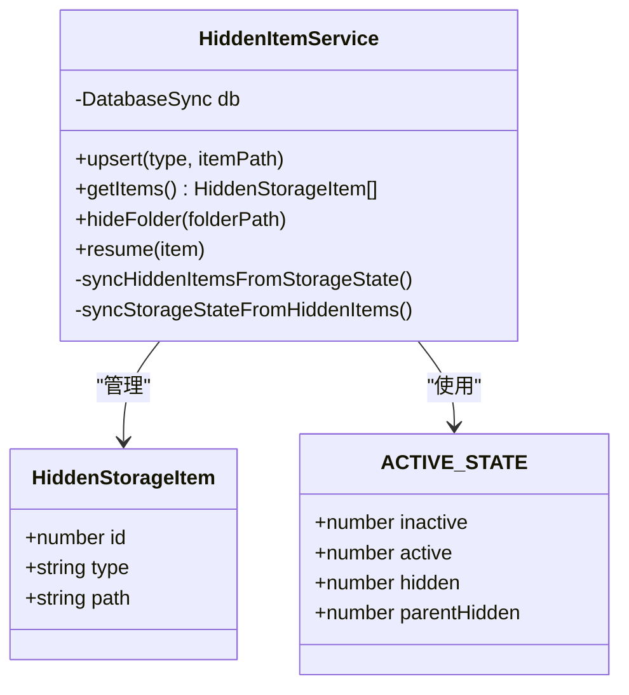
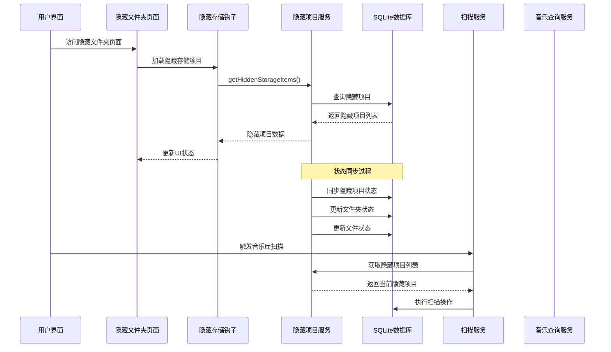
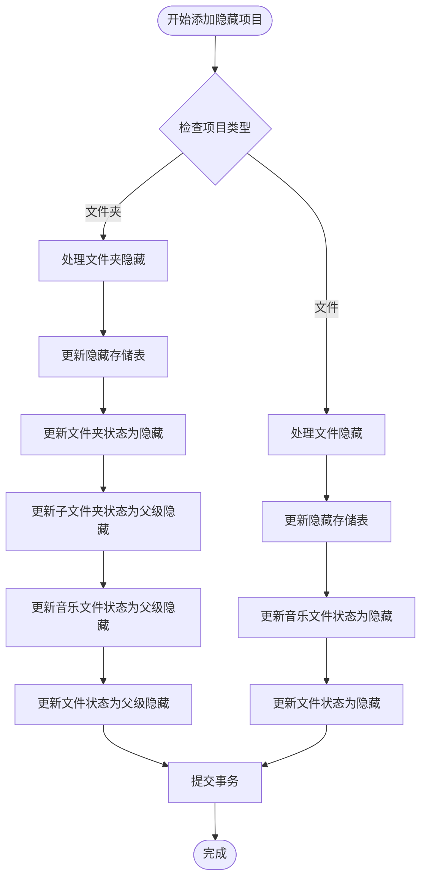
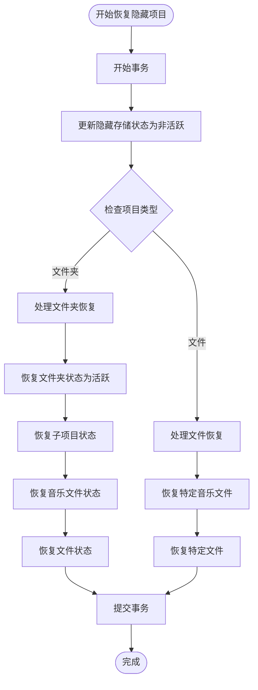
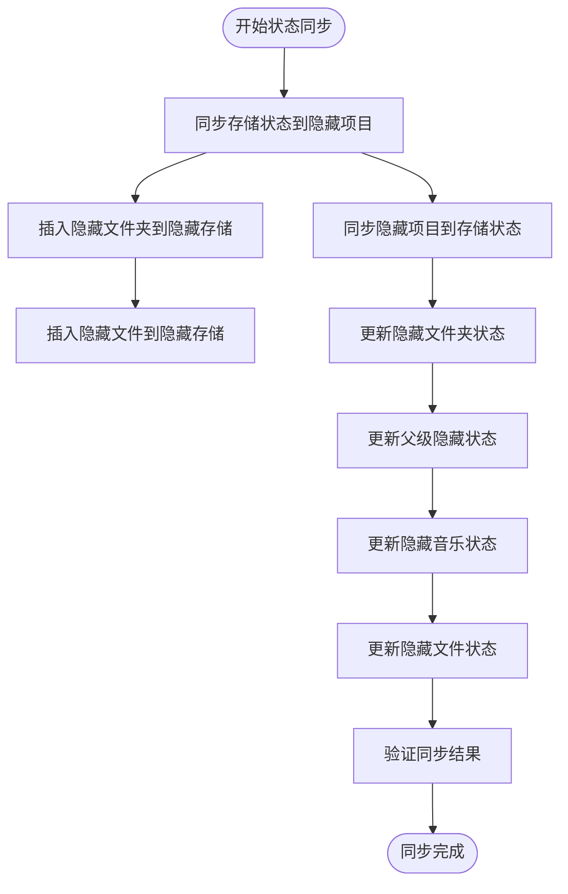
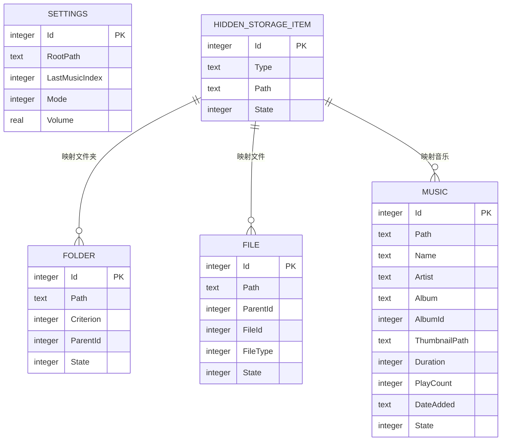
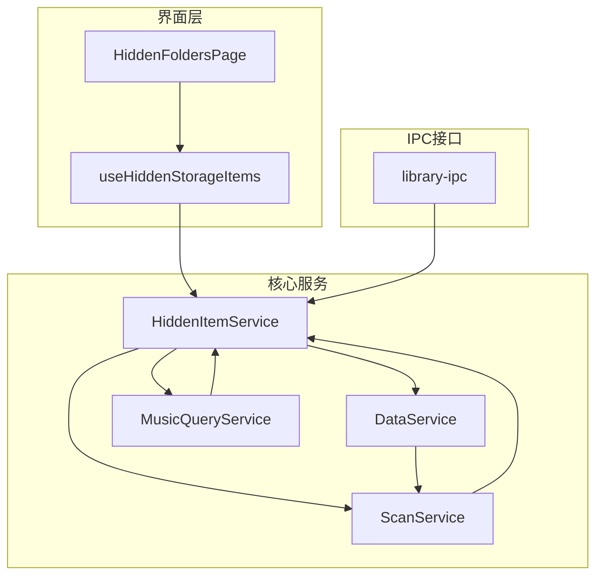

# 隐藏项目服务

<cite>
**本文档引用的文件**
- [hidden-item-service.ts](file://electron/services/hidden-item-service.ts)
- [constants.ts](file://electron/services/constants.ts)
- [schema.ts](file://electron/services/schema.ts)
- [data-service.ts](file://electron/services/data-service.ts)
- [scan-service.ts](file://electron/services/scan-service.ts)
- [music-query-service.ts](file://electron/services/music-query-service.ts)
- [contracts.ts](file://src/shared/contracts.ts)
- [HiddenFoldersPage.tsx](file://src/pages/HiddenFoldersPage.tsx)
- [useHiddenStorageItems.ts](file://src/hooks/useHiddenStorageItems.ts)
- [library-ipc.ts](file://electron/ipc/library-ipc.ts)
</cite>

## 目录
1. [简介](#简介)
2. [项目结构](#项目结构)
3. [核心组件](#核心组件)
4. [架构概览](#架构概览)
5. [详细组件分析](#详细组件分析)
6. [依赖关系分析](#依赖关系分析)
7. [性能考虑](#性能考虑)
8. [故障排除指南](#故障排除指南)
9. [结论](#结论)
10. [附录](#附录)

## 简介

SMPlayer的隐藏项目服务是一个关键的数据库层组件，负责管理用户选择性隐藏的音乐项目。该服务支持隐藏文件夹、隐藏歌曲和隐藏艺术家等不同类型的项目，通过统一的状态管理系统确保音乐库的一致性和完整性。

隐藏项目服务的核心功能包括：
- 跟踪和管理隐藏的音乐项目（文件夹、歌曲、艺术家）
- 维护隐藏列表的状态同步
- 提供批量处理和状态管理功能
- 与扫描服务和音乐查询服务的深度集成
- 支持权限控制和状态标记机制

## 项目结构

隐藏项目服务在SMPlayer项目中的组织结构如下：

**图表来源**
- [hidden-item-service.ts:1-260](file://electron/services/hidden-item-service.ts#L1-L260)
- [schema.ts:191-196](file://electron/services/schema.ts#L191-L196)

**章节来源**
- [hidden-item-service.ts:1-260](file://electron/services/hidden-item-service.ts#L1-L260)
- [schema.ts:191-196](file://electron/services/schema.ts#L191-L196)

## 核心组件

### 隐藏项目数据模型

隐藏项目服务基于统一的数据模型来管理不同类型的内容：

**图表来源**
- [contracts.ts:100-104](file://src/shared/contracts.ts#L100-L104)
- [constants.ts:22-27](file://electron/services/constants.ts#L22-L27)
- [hidden-item-service.ts:6-27](file://electron/services/hidden-item-service.ts#L6-L27)

### 数据存储机制

隐藏项目服务采用三层存储架构：

1. **隐藏存储表 (HiddenStorageItem)**: 存储用户明确选择隐藏的项目
2. **文件夹状态表 (Folder)**: 跟踪文件夹的可见性状态
3. **文件状态表 (File)**: 跟踪单个文件的可见性状态

**章节来源**
- [hidden-item-service.ts:13-27](file://electron/services/hidden-item-service.ts#L13-L27)
- [schema.ts:191-196](file://electron/services/schema.ts#L191-L196)

## 架构概览

隐藏项目服务在整个SMPlayer架构中扮演着关键的协调角色：

**图表来源**
- [hidden-item-service.ts:29-69](file://electron/services/hidden-item-service.ts#L29-L69)
- [data-service.ts:133-142](file://electron/services/data-service.ts#L133-L142)
- [scan-service.ts:149-150](file://electron/services/scan-service.ts#L149-L150)

**章节来源**
- [data-service.ts:133-142](file://electron/services/data-service.ts#L133-L142)
- [scan-service.ts:149-150](file://electron/services/scan-service.ts#L149-L150)

## 详细组件分析

### 隐藏项目管理核心功能

#### 添加到隐藏列表

隐藏项目服务提供了灵活的添加机制，支持不同类型的项目：

**图表来源**
- [hidden-item-service.ts:71-103](file://electron/services/hidden-item-service.ts#L71-L103)
- [hidden-item-service.ts:13-27](file://electron/services/hidden-item-service.ts#L13-L27)

#### 从隐藏列表移除

恢复隐藏项目的过程需要维护数据库的一致性：

**图表来源**
- [hidden-item-service.ts:105-160](file://electron/services/hidden-item-service.ts#L105-L160)

**章节来源**
- [hidden-item-service.ts:71-160](file://electron/services/hidden-item-service.ts#L71-L160)

### 状态同步机制

隐藏项目服务实现了双向状态同步，确保数据库一致性：

**图表来源**
- [hidden-item-service.ts:162-258](file://electron/services/hidden-item-service.ts#L162-L258)

**章节来源**
- [hidden-item-service.ts:162-258](file://electron/services/hidden-item-service.ts#L162-L258)

### 数据库模式设计

隐藏项目服务的数据库架构设计体现了良好的规范化原则：

**图表来源**
- [schema.ts:39-131](file://electron/services/schema.ts#L39-L131)
- [schema.ts:191-196](file://electron/services/schema.ts#L191-L196)

**章节来源**
- [schema.ts:39-131](file://electron/services/schema.ts#L39-L131)
- [schema.ts:191-196](file://electron/services/schema.ts#L191-L196)

## 依赖关系分析

### 服务间依赖关系

隐藏项目服务与SMPlayer其他组件存在紧密的依赖关系：

**图表来源**
- [data-service.ts:133-142](file://electron/services/data-service.ts#L133-L142)
- [scan-service.ts:25-32](file://electron/services/scan-service.ts#L25-L32)
- [library-ipc.ts:28-38](file://electron/ipc/library-ipc.ts#L28-L38)

### 外部依赖和集成点

隐藏项目服务的关键外部依赖包括：

1. **SQLite数据库**: 提供持久化存储和ACID事务支持
2. **Node.js sqlite模块**: 实现底层数据库操作
3. **React Hooks**: 支持前端状态管理和数据获取
4. **IPC通信**: 实现主进程和渲染进程之间的数据交换

**章节来源**
- [data-service.ts:133-142](file://electron/services/data-service.ts#L133-L142)
- [library-ipc.ts:28-38](file://electron/ipc/library-ipc.ts#L28-L38)

## 性能考虑

### 查询优化策略

隐藏项目服务采用了多种性能优化技术：

1. **索引优化**: 在HiddenStorageItem表上使用复合索引(Type, Path)
2. **批量操作**: 使用事务批量处理多个数据库操作
3. **状态缓存**: 通过状态同步减少重复查询
4. **延迟加载**: 按需加载隐藏项目数据

### 内存管理

服务实现了高效的内存管理策略：
- 使用游标进行大数据集的分页处理
- 及时释放数据库连接和资源
- 避免不必要的数据复制和转换

## 故障排除指南

### 常见问题和解决方案

#### 隐藏项目状态不一致

**问题描述**: 隐藏项目在界面中显示异常或状态不同步

**解决步骤**:
1. 检查数据库连接是否正常
2. 验证状态同步函数是否正确执行
3. 确认事务是否正确提交或回滚

#### 性能问题

**问题描述**: 隐藏项目查询或更新操作响应缓慢

**诊断方法**:
1. 检查数据库索引是否有效
2. 分析SQL查询执行计划
3. 监控数据库锁竞争情况

**章节来源**
- [hidden-item-service.ts:99-102](file://electron/services/hidden-item-service.ts#L99-L102)
- [hidden-item-service.ts:157-159](file://electron/services/hidden-item-service.ts#L157-L159)

## 结论

SMPlayer的隐藏项目服务是一个设计精良的数据库层组件，它通过以下特点确保了系统的稳定性和用户体验：

1. **统一的数据模型**: 支持多种类型的隐藏项目管理
2. **强一致性的状态管理**: 通过双向同步确保数据完整性
3. **高性能的查询机制**: 优化的数据库设计和索引策略
4. **完善的错误处理**: 事务管理和异常恢复机制
5. **良好的扩展性**: 清晰的架构设计便于功能扩展

该服务为SMPlayer提供了可靠的隐藏项目管理能力，是整个音乐库管理系统的重要组成部分。

## 附录

### 最佳实践和使用建议

#### 开发最佳实践

1. **事务管理**: 始终使用事务包装相关的数据库操作
2. **状态同步**: 定期调用状态同步函数保持数据一致性
3. **错误处理**: 实现完善的异常捕获和错误恢复机制
4. **性能监控**: 监控数据库查询性能和内存使用情况

#### 用户使用建议

1. **定期清理**: 定期检查和清理不再需要的隐藏项目
2. **备份策略**: 在进行大量隐藏操作前备份数据库
3. **权限管理**: 合理设置文件系统权限避免访问问题
4. **性能优化**: 对于大型音乐库，建议分批处理隐藏操作