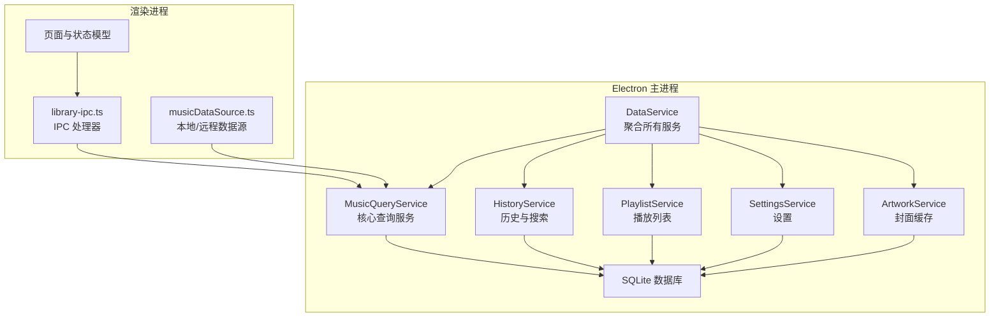
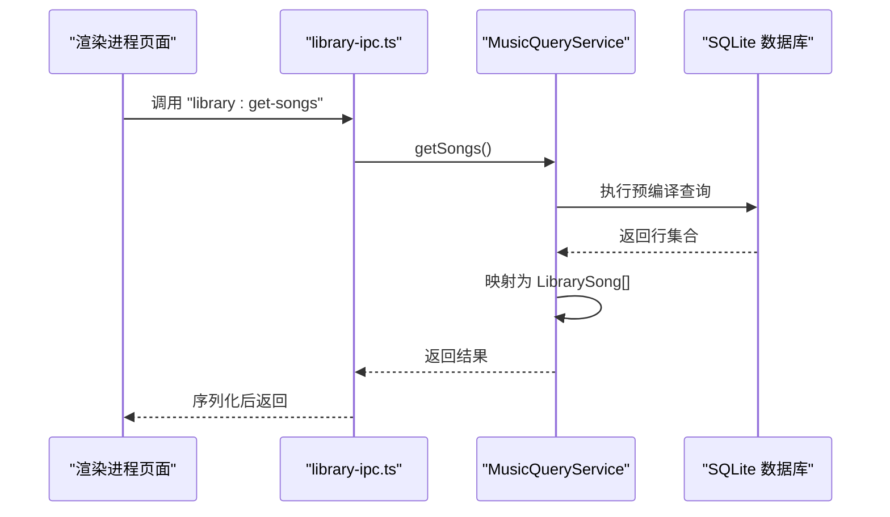
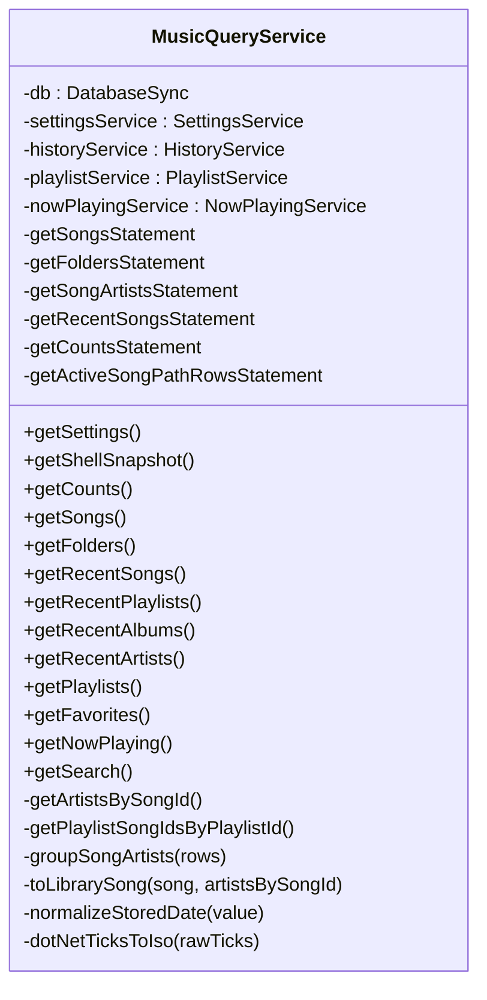
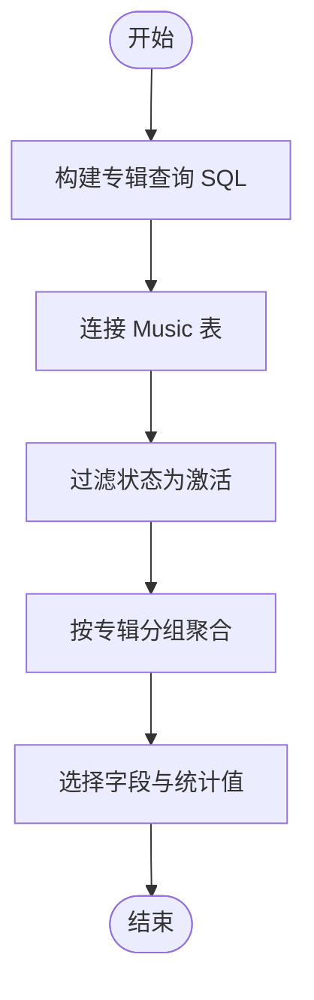
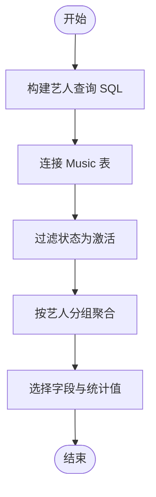
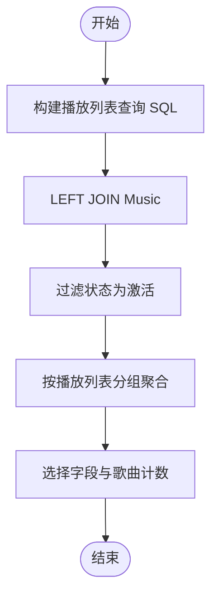
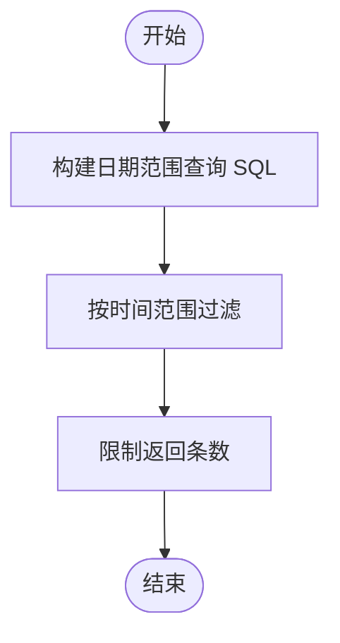
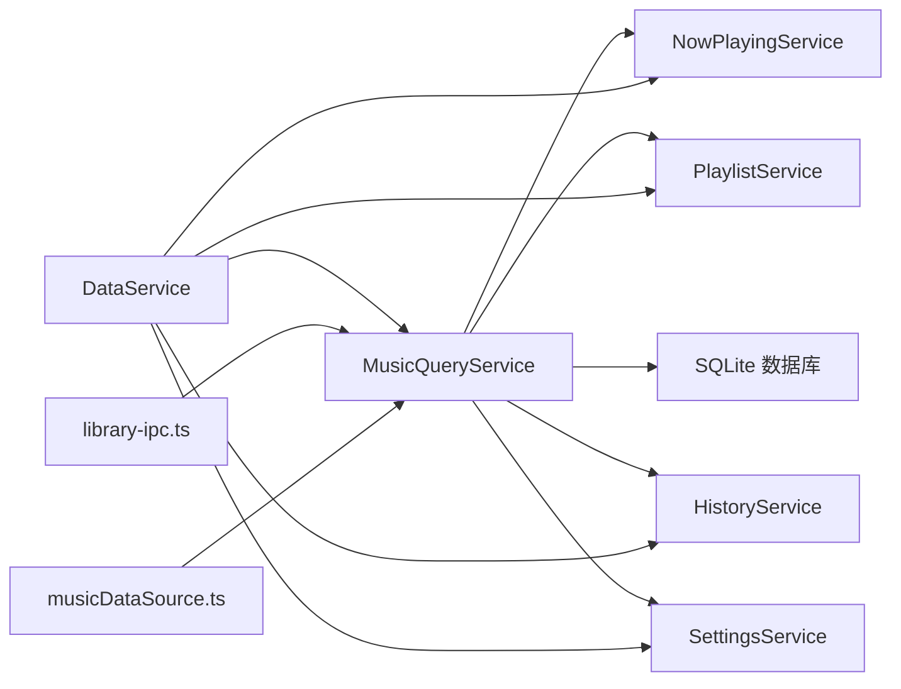

# 音乐查询服务

<cite>
**本文档引用的文件**
- [music-query-service.ts](file://electron/services/music-query-service.ts)
- [data-service.ts](file://electron/services/data-service.ts)
- [schema.ts](file://electron/services/schema.ts)
- [row-mappers.ts](file://electron/services/row-mappers.ts)
- [constants.ts](file://electron/services/constants.ts)
- [history-service.ts](file://electron/services/history-service.ts)
- [playlist-service.ts](file://electron/services/playlist-service.ts)
- [settings-service.ts](file://electron/services/settings-service.ts)
- [musicDataSource.ts](file://src/data/musicDataSource.ts)
- [SearchHelper.ts](file://src/shared/SearchHelper.ts)
- [library-ipc.ts](file://electron/ipc/library-ipc.ts)
- [libraryStoreModel.ts](file://src/state/libraryStoreModel.ts)
</cite>

## 目录
1. [简介](#简介)
2. [项目结构](#项目结构)
3. [核心组件](#核心组件)
4. [架构总览](#架构总览)
5. [详细组件分析](#详细组件分析)
6. [依赖关系分析](#依赖关系分析)
7. [性能考虑](#性能考虑)
8. [故障排除指南](#故障排除指南)
9. [结论](#结论)
10. [附录](#附录)

## 简介
本文件系统性地解析 SMPlayer 的音乐查询服务（MusicQueryService），围绕音乐库的查询、过滤、排序与搜索机制展开，重点覆盖以下方面：
- 查询接口设计：SQL 查询构建、参数化查询、结果集映射与类型安全
- 查询类型实现：按专辑、按艺术家、按播放列表、按最近播放、按日期范围等
- 性能优化策略：索引使用、查询缓存、分页处理
- 扩展方法：新增查询类型、自定义查询条件、复杂查询组合
- 实际示例与最佳实践：从数据库层到前端页面的完整调用链路

## 项目结构
SMPlayer 将“查询”能力集中在 Electron 主进程的服务层，通过 IPC 暴露给渲染进程，前端页面通过数据源适配器统一消费。

图表来源
- [data-service.ts:39-145](file://electron/services/data-service.ts#L39-L145)
- [music-query-service.ts:50-165](file://electron/services/music-query-service.ts#L50-L165)
- [history-service.ts:30-182](file://electron/services/history-service.ts#L30-L182)
- [playlist-service.ts:9-145](file://electron/services/playlist-service.ts#L9-L145)
- [settings-service.ts:61-179](file://electron/services/settings-service.ts#L61-L179)
- [library-ipc.ts:28-52](file://electron/ipc/library-ipc.ts#L28-L52)
- [musicDataSource.ts:136-179](file://src/data/musicDataSource.ts#L136-L179)

章节来源
- [data-service.ts:39-145](file://electron/services/data-service.ts#L39-L145)
- [music-query-service.ts:50-165](file://electron/services/music-query-service.ts#L50-L165)
- [library-ipc.ts:28-52](file://electron/ipc/library-ipc.ts#L28-L52)

## 核心组件
- MusicQueryService：封装所有音乐库查询逻辑，负责 SQL 构建、参数化执行、结果映射与实体转换
- DataService：服务聚合器，初始化数据库、迁移模式、各子服务实例并注入依赖
- Schema：数据库表结构与索引初始化，确保查询性能与一致性
- Row Mappers：将数据库行映射为领域对象，保证类型安全与数据规范化
- HistoryService：维护搜索历史、最近播放记录，支持按类型检索
- PlaylistService：播放列表与歌曲关联查询，支持内置与自定义列表
- SettingsService：读取用户偏好，决定查询行为（如收藏夹、排序准则）
- IPC 层：将查询接口暴露为 IPC 句柄，供渲染进程调用
- 前端数据源：统一抽象本地/远程数据源，屏蔽差异

章节来源
- [music-query-service.ts:50-418](file://electron/services/music-query-service.ts#L50-L418)
- [data-service.ts:39-145](file://electron/services/data-service.ts#L39-L145)
- [schema.ts:33-364](file://electron/services/schema.ts#L33-L364)
- [row-mappers.ts:1-87](file://electron/services/row-mappers.ts#L1-L87)
- [history-service.ts:30-182](file://electron/services/history-service.ts#L30-L182)
- [playlist-service.ts:9-145](file://electron/services/playlist-service.ts#L9-L145)
- [settings-service.ts:61-179](file://electron/services/settings-service.ts#L61-L179)
- [musicDataSource.ts:43-63](file://src/data/musicDataSource.ts#L43-L63)
- [library-ipc.ts:28-52](file://electron/ipc/library-ipc.ts#L28-L52)

## 架构总览
MusicQueryService 作为查询入口，内部通过预编译语句（prepare）实现参数化查询，避免 SQL 注入；通过 row mappers 将数据库行映射为领域对象；结合 SettingsService 决定收藏夹 ID、排序准则等上下文；通过 HistoryService 和 PlaylistService 提供最近播放、播放列表等扩展查询。

图表来源
- [library-ipc.ts:40-44](file://electron/ipc/library-ipc.ts#L40-L44)
- [music-query-service.ts:199-209](file://electron/services/music-query-service.ts#L199-L209)

## 详细组件分析

### MusicQueryService 查询接口设计
- SQL 查询构建：使用预编译语句，参数化传入收藏夹 ID、活动状态等，确保可复用与安全
- 结果集映射：将数据库行映射为 LibrarySong、LibraryFolder、LibraryPlaylist 等领域对象，同时进行艺术家归一化、日期格式转换
- 排序与过滤：内置排序（如名称、艺术家、ID），过滤仅返回状态为“激活”的实体
- 关联查询：通过 EXISTS 子查询判断是否为收藏；通过 JOIN 获取播放列表项与最近播放记录

图表来源
- [music-query-service.ts:50-418](file://electron/services/music-query-service.ts#L50-L418)

章节来源
- [music-query-service.ts:50-165](file://electron/services/music-query-service.ts#L50-L165)
- [music-query-service.ts:199-209](file://electron/services/music-query-service.ts#L199-L209)
- [music-query-service.ts:216-231](file://electron/services/music-query-service.ts#L216-L231)
- [music-query-service.ts:245-271](file://electron/services/music-query-service.ts#L245-L271)
- [music-query-service.ts:273-284](file://electron/services/music-query-service.ts#L273-L284)
- [music-query-service.ts:286-288](file://electron/services/music-query-service.ts#L286-L288)

### 查询类型实现

#### 按专辑查询
- 数据来源：Album 表与 Music 表关联，通过 Music.AlbumId 关联
- 查询要点：按专辑名去重统计歌曲数、播放次数、时长；封面路径来自 Album 或歌曲
- 索引建议：专辑名唯一索引、专辑与歌曲的外键索引

图表来源
- [schema.ts:99-105](file://electron/services/schema.ts#L99-L105)
- [schema.ts:239-240](file://electron/services/schema.ts#L239-L240)

章节来源
- [schema.ts:99-105](file://electron/services/schema.ts#L99-L105)
- [schema.ts:239-240](file://electron/services/schema.ts#L239-L240)

#### 按艺术家查询
- 数据来源：MusicArtist 表与 Music 表关联，支持多艺人归一化
- 查询要点：按艺人名去重统计专辑数、歌曲数、播放次数、时长；艺人名大小写不敏感
- 索引建议：艺人名与优先级索引、艺人-歌曲索引

图表来源
- [schema.ts:107-114](file://electron/services/schema.ts#L107-L114)
- [schema.ts:249-250](file://electron/services/schema.ts#L249-L250)

章节来源
- [schema.ts:107-114](file://electron/services/schema.ts#L107-L114)
- [schema.ts:249-250](file://electron/services/schema.ts#L249-L250)

#### 按播放列表查询
- 数据来源：Playlist 与 PlaylistItem 表，通过 PlaylistItem 关联歌曲
- 查询要点：区分内置列表（收藏夹、正在播放）与自定义列表；支持按优先级与名称排序
- 索引建议：播放列表-歌曲索引、播放列表名称索引

图表来源
- [schema.ts:133-146](file://electron/services/schema.ts#L133-L146)
- [playlist-service.ts:77-102](file://electron/services/playlist-service.ts#L77-L102)

章节来源
- [schema.ts:133-146](file://electron/services/schema.ts#L133-L146)
- [playlist-service.ts:77-102](file://electron/services/playlist-service.ts#L77-L102)

#### 按日期范围查询
- 数据来源：Music.DateAdded 字段或 RecentRecord.Time
- 查询要点：通过时间字段过滤；RecentRecord 支持按类型（歌曲、专辑、艺人、播放列表）筛选
- 索引建议：RecentRecord.Type 与时间索引

图表来源
- [music-query-service.ts:118-145](file://electron/services/music-query-service.ts#L118-L145)
- [history-service.ts:117-127](file://electron/services/history-service.ts#L117-L127)

章节来源
- [music-query-service.ts:118-145](file://electron/services/music-query-service.ts#L118-L145)
- [history-service.ts:117-127](file://electron/services/history-service.ts#L117-L127)

### 查询接口扩展方法
- 新增查询类型：在 MusicQueryService 中新增预编译语句与映射函数；在 DataService 中注入新服务；在 IPC 层注册新句柄
- 自定义查询条件：通过 SettingsService 读取用户偏好（如收藏夹 ID、排序准则），在查询中动态拼接 WHERE 条件
- 复杂查询组合：利用 EXISTS、JOIN、GROUP BY、ORDER BY 组合实现跨表聚合与排序

章节来源
- [music-query-service.ts:50-165](file://electron/services/music-query-service.ts#L50-L165)
- [data-service.ts:120-132](file://electron/services/data-service.ts#L120-L132)
- [library-ipc.ts:28-52](file://electron/ipc/library-ipc.ts#L28-L52)

### 查询性能优化策略
- 索引使用：根据查询模式建立唯一与非唯一索引，如专辑名、艺人名、播放列表-歌曲、搜索历史等
- 查询缓存：对热点查询（如收藏夹、最近播放）采用内存缓存；对静态数据（如设置）进行懒加载
- 分页处理：对大结果集使用 LIMIT/OFFSET 或基于游标的方式分页，避免一次性加载过多数据
- 参数化查询：使用预编译语句与参数绑定，减少 SQL 解析与注入风险
- 连接优化：尽量减少 N+1 查询，批量获取关联数据（如艺人、播放列表项）

章节来源
- [schema.ts:238-260](file://electron/services/schema.ts#L238-L260)
- [music-query-service.ts:290-322](file://electron/services/music-query-service.ts#L290-L322)
- [playlist-service.ts:158-164](file://electron/services/playlist-service.ts#L158-L164)

## 依赖关系分析

图表来源
- [music-query-service.ts:50-75](file://electron/services/music-query-service.ts#L50-L75)
- [data-service.ts:120-132](file://electron/services/data-service.ts#L120-L132)
- [library-ipc.ts:28-52](file://electron/ipc/library-ipc.ts#L28-L52)
- [musicDataSource.ts:136-179](file://src/data/musicDataSource.ts#L136-L179)

章节来源
- [music-query-service.ts:50-75](file://electron/services/music-query-service.ts#L50-L75)
- [data-service.ts:120-132](file://electron/services/data-service.ts#L120-L132)
- [library-ipc.ts:28-52](file://electron/ipc/library-ipc.ts#L28-L52)
- [musicDataSource.ts:136-179](file://src/data/musicDataSource.ts#L136-L179)

## 性能考虑
- 预编译语句与参数绑定：降低 SQL 解析成本，提升重复查询性能
- 索引策略：针对高频查询字段建立索引，避免全表扫描
- 批量映射：对艺人、播放列表项等进行批量归并，减少循环与查找开销
- 内存与序列化：对大对象进行延迟序列化，避免 IPC 传输过大
- 清理与校验：定期清理无效记录（如已删除歌曲对应的最近播放），保持查询效率

## 故障排除指南
- 查询无结果：检查实体状态字段是否为激活；确认收藏夹 ID 是否正确初始化
- 性能问题：确认相关索引是否存在；检查是否存在不必要的 JOIN 或子查询
- 日期显示异常：检查日期格式转换逻辑，确保兼容 .NET 时间戳与 ISO 格式
- IPC 调用失败：确认 IPC 句柄是否注册；检查渲染进程调用是否在主进程初始化完成后

章节来源
- [music-query-service.ts:359-416](file://electron/services/music-query-service.ts#L359-L416)
- [history-service.ts:101-112](file://electron/services/history-service.ts#L101-L112)
- [library-ipc.ts:28-52](file://electron/ipc/library-ipc.ts#L28-L52)

## 结论
MusicQueryService 以“预编译 + 参数化 + 映射”的方式实现了高效、安全且可扩展的音乐库查询体系。通过合理的索引设计、缓存策略与分页处理，能够在大规模音乐库场景下保持良好性能。结合 SettingsService、HistoryService、PlaylistService 的协同，能够满足从基础查询到高级搜索、最近播放、播放列表管理等多样化需求。未来扩展可通过新增预编译语句与 IPC 句柄，快速接入新的查询类型与复杂组合。

## 附录

### 查询接口一览（IPC）
- library:get-shell
- library:get-settings
- library:get-counts
- library:get-songs
- library:get-folders
- library:get-recent-songs
- library:get-recent-playlists
- library:get-recent-albums
- library:get-recent-artists
- library:get-playlists
- library:get-favorites
- library:get-now-playing
- library:get-search

章节来源
- [library-ipc.ts:40-52](file://electron/ipc/library-ipc.ts#L40-L52)

### 前端数据源与页面集成
- 本地数据源：直接从 MusicQueryService 获取快照
- 远程数据源：通过 IPC 从远端主机拉取并转换为本地结构
- 页面渲染：通过状态模型与路由组件消费数据源输出

章节来源
- [musicDataSource.ts:136-179](file://src/data/musicDataSource.ts#L136-L179)
- [musicDataSource.ts:181-203](file://src/data/musicDataSource.ts#L181-L203)
- [musicDataSource.ts:205-285](file://src/data/musicDataSource.ts#L205-L285)
- [libraryStoreModel.ts:12-79](file://src/state/libraryStoreModel.ts#L12-L79)