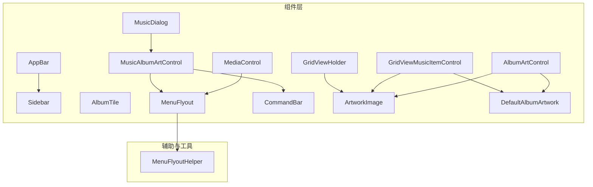
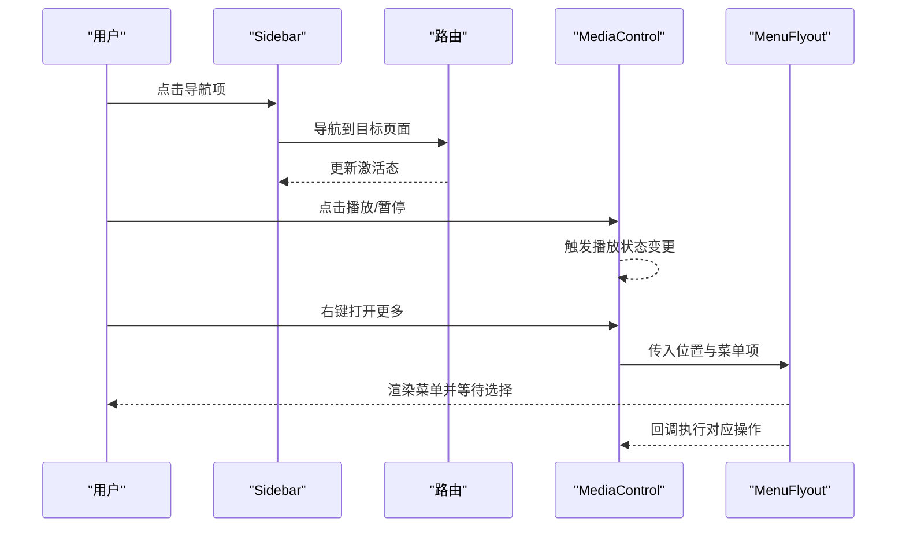
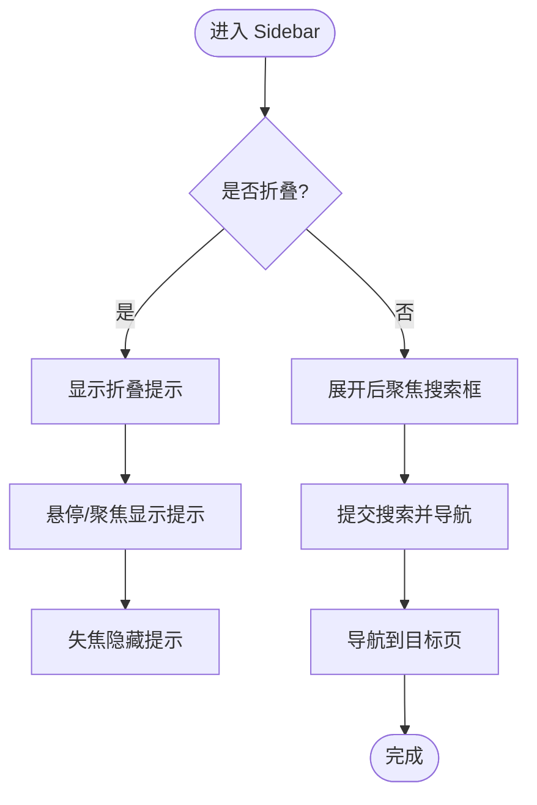
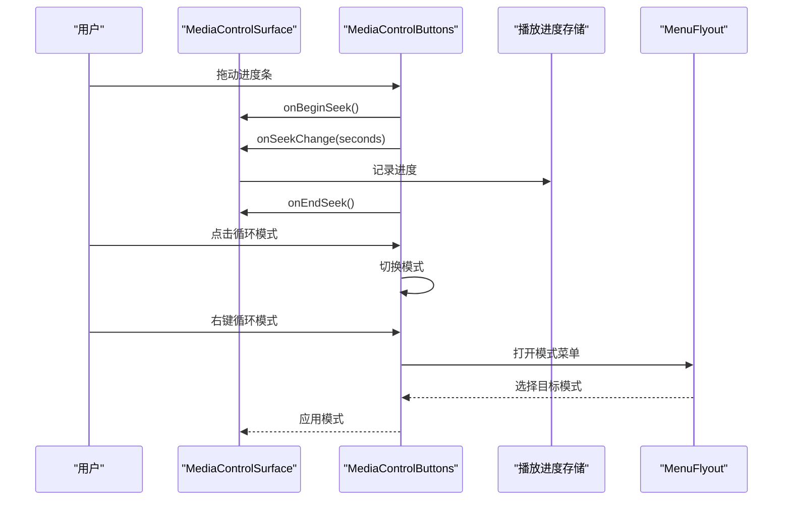
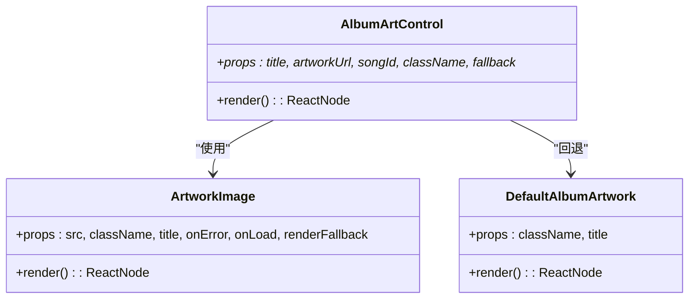
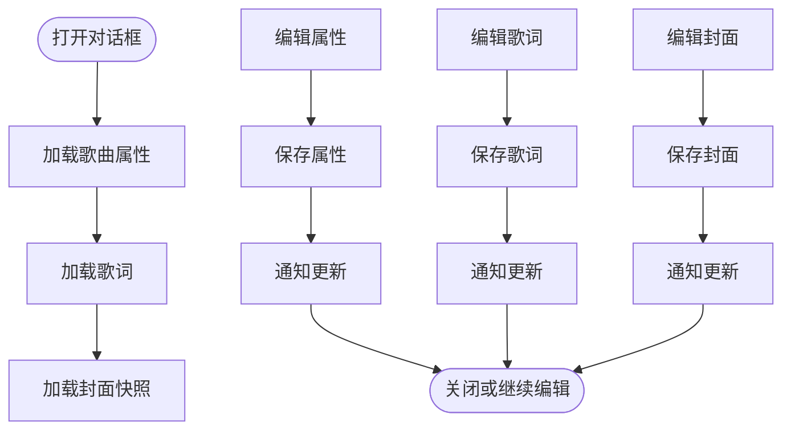
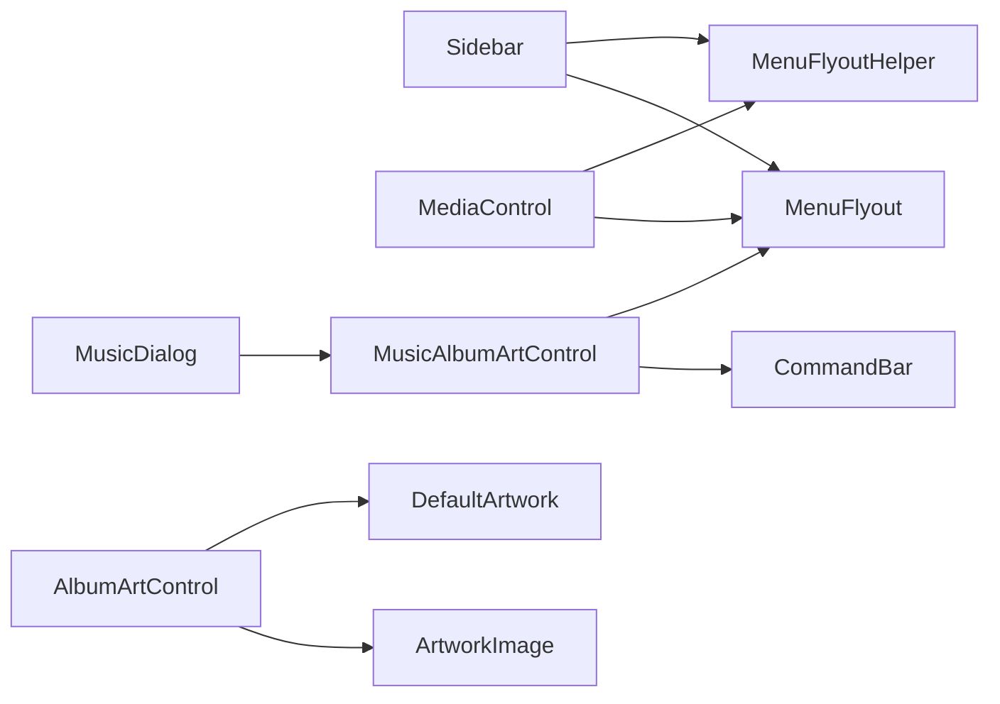

# 前端组件模块

<cite>
**本文引用的文件**
- [AppBar.tsx](file://src/components/AppBar.tsx)
- [Sidebar.tsx](file://src/components/Sidebar.tsx)
- [MediaControl.tsx](file://src/components/MediaControl.tsx)
- [AlbumArtControl.tsx](file://src/components/AlbumArtControl.tsx)
- [AlbumTile.tsx](file://src/components/AlbumTile.tsx)
- [GridViewMusicItemControl.tsx](file://src/components/GridViewMusicItemControl.tsx)
- [MusicDialog.tsx](file://src/components/MusicDialog.tsx)
- [MenuFlyout.tsx](file://src/components/MenuFlyout.tsx)
- [MenuFlyoutHelper.ts](file://src/components/MenuFlyoutHelper.ts)
- [CommandBar.tsx](file://src/components/CommandBar.tsx)
- [ArtworkImage.tsx](file://src/components/ArtworkImage.tsx)
- [DefaultAlbumArtwork.tsx](file://src/components/DefaultAlbumArtwork.tsx)
- [GridViewHolder.tsx](file://src/components/GridViewHolder.tsx)
- [MusicAlbumArtControl.tsx](file://src/components/MusicAlbumArtControl.tsx)
</cite>

## 目录
1. [简介](#简介)
2. [项目结构](#项目结构)
3. [核心组件](#核心组件)
4. [架构总览](#架构总览)
5. [详细组件分析](#详细组件分析)
6. [依赖关系分析](#依赖关系分析)
7. [性能考量](#性能考量)
8. [故障排查指南](#故障排查指南)
9. [结论](#结论)
10. [附录](#附录)

## 简介
本文件面向 SMPlayer 的前端组件模块，系统性梳理 React 组件体系的架构与实现，覆盖应用栏、侧边栏导航、媒体控制、专辑艺术控制、专辑磁贴、网格视图音乐项控制、音乐对话框、菜单飞出、命令栏等核心 UI 组件。文档从设计模式、props 接口、事件处理、状态管理、样式系统、组件通信与复用策略等方面进行深入解析，并提供可定制与扩展建议，涵盖响应式设计、无障碍访问与性能优化的最佳实践。

## 项目结构
SMPlayer 前端采用以“功能域”为主的组件组织方式，核心 UI 组件集中在 src/components 目录下，配合样式目录 src/styles 实现主题化与响应式布局。组件间通过 props 与回调函数解耦，使用 Portal 将上下文菜单等浮层渲染到文档根节点，确保层级与定位正确。

图表来源
- [AppBar.tsx](file://src/components/AppBar.tsx)
- [Sidebar.tsx](file://src/components/Sidebar.tsx)
- [MediaControl.tsx](file://src/components/MediaControl.tsx)
- [AlbumArtControl.tsx](file://src/components/AlbumArtControl.tsx)
- [AlbumTile.tsx](file://src/components/AlbumTile.tsx)
- [GridViewMusicItemControl.tsx](file://src/components/GridViewMusicItemControl.tsx)
- [MusicDialog.tsx](file://src/components/MusicDialog.tsx)
- [MenuFlyout.tsx](file://src/components/MenuFlyout.tsx)
- [MenuFlyoutHelper.ts](file://src/components/MenuFlyoutHelper.ts)
- [CommandBar.tsx](file://src/components/CommandBar.tsx)
- [ArtworkImage.tsx](file://src/components/ArtworkImage.tsx)
- [DefaultAlbumArtwork.tsx](file://src/components/DefaultAlbumArtwork.tsx)
- [GridViewHolder.tsx](file://src/components/GridViewHolder.tsx)
- [MusicAlbumArtControl.tsx](file://src/components/MusicAlbumArtControl.tsx)

章节来源
- [AppBar.tsx](file://src/components/AppBar.tsx)
- [Sidebar.tsx](file://src/components/Sidebar.tsx)
- [MediaControl.tsx](file://src/components/MediaControl.tsx)
- [AlbumArtControl.tsx](file://src/components/AlbumArtControl.tsx)
- [AlbumTile.tsx](file://src/components/AlbumTile.tsx)
- [GridViewMusicItemControl.tsx](file://src/components/GridViewMusicItemControl.tsx)
- [MusicDialog.tsx](file://src/components/MusicDialog.tsx)
- [MenuFlyout.tsx](file://src/components/MenuFlyout.tsx)
- [MenuFlyoutHelper.ts](file://src/components/MenuFlyoutHelper.ts)
- [CommandBar.tsx](file://src/components/CommandBar.tsx)
- [ArtworkImage.tsx](file://src/components/ArtworkImage.tsx)
- [DefaultAlbumArtwork.tsx](file://src/components/DefaultAlbumArtwork.tsx)
- [GridViewHolder.tsx](file://src/components/GridViewHolder.tsx)
- [MusicAlbumArtControl.tsx](file://src/components/MusicAlbumArtControl.tsx)

## 核心组件
本节对关键组件进行概览式说明，后续章节将逐个深入。

- 应用栏 AppBar：提供标题区、菜单按钮与动作区，支持国际化标签与无障碍属性。
- 侧边栏 Sidebar：导航主干、播放列表、搜索与历史、折叠/展开、拖拽排序、右键菜单与重命名弹窗。
- 媒体控制 MediaControl：播放/暂停、上一首/下一首、进度条、音量滑条、收藏、模式切换、语音助手入口。
- 专辑艺术 AlbumArtControl：基于歌曲 ID 或 URL 渲染封面，失败时回退默认或占位内容。
- 专辑磁贴 AlbumTile：专辑卡片，支持选择态、右键菜单、播放/添加到歌单。
- 网格视图音乐项 GridViewMusicItemControl：本地/最近视图的网格项，支持多选、拖拽、更多操作。
- 音乐对话框 MusicDialog：歌曲属性、歌词、专辑封面编辑，含保存/重置/删除等流程。
- 菜单飞出 MenuFlyout：上下文菜单，支持子菜单、卷面滑条、边界自适应与键盘关闭。
- 菜单工具 MenuFlyoutHelper：生成通用菜单项（添加到歌单、偏好设置、随机播放等）。
- 命令栏 CommandBar：动态溢出的工具栏，自动计算可用宽度并把多余按钮放入溢出菜单。

章节来源
- [AppBar.tsx](file://src/components/AppBar.tsx)
- [Sidebar.tsx](file://src/components/Sidebar.tsx)
- [MediaControl.tsx](file://src/components/MediaControl.tsx)
- [AlbumArtControl.tsx](file://src/components/AlbumArtControl.tsx)
- [AlbumTile.tsx](file://src/components/AlbumTile.tsx)
- [GridViewMusicItemControl.tsx](file://src/components/GridViewMusicItemControl.tsx)
- [MusicDialog.tsx](file://src/components/MusicDialog.tsx)
- [MenuFlyout.tsx](file://src/components/MenuFlyout.tsx)
- [MenuFlyoutHelper.ts](file://src/components/MenuFlyoutHelper.ts)
- [CommandBar.tsx](file://src/components/CommandBar.tsx)

## 架构总览
组件体系遵循“容器-展示”分离与“组合优先”的原则：
- 容器组件负责状态与副作用（如播放进度、搜索历史、歌词加载），展示组件专注渲染与交互。
- 大量使用 Portal 将菜单、对话框等浮层渲染至 body，避免 CSS 层级与定位问题。
- 通过统一的图标库与样式类名，保证视觉一致性与主题化能力。

图表来源
- [Sidebar.tsx](file://src/components/Sidebar.tsx)
- [MediaControl.tsx](file://src/components/MediaControl.tsx)
- [MenuFlyout.tsx](file://src/components/MenuFlyout.tsx)

## 详细组件分析

### 应用栏 AppBar
- 设计模式：容器组件，承载页面标题与动作区，通过 children 扩展内容。
- 关键 props：menuLabel、menuTitle、onMenuClick、actions、className。
- 事件与无障碍：菜单按钮具备 aria-label/title，点击触发 onMenuClick。
- 样式系统：使用 clsx 合并类名，支持外部注入样式。

章节来源
- [AppBar.tsx](file://src/components/AppBar.tsx)

### 侧边栏 Sidebar
- 设计模式：复合容器，聚合导航、搜索、播放列表、右键菜单与重命名弹窗。
- 关键 props：t（翻译）、collapsed、appName、playlists、搜索相关回调、播放列表操作回调。
- 交互要点：
  - 折叠/展开：根据 collapsed 控制搜索输入显隐与提示气泡。
  - 搜索：支持聚焦、提交、清空、最近搜索面板与清除。
  - 播放列表：展开/收起、拖拽排序、右键菜单（新建/重命名/删除/随机播放）。
  - 导航：NavItem 支持精确/前缀匹配激活态，支持 onNavigate 钩子。
- 状态管理：内部维护搜索焦点、菜单状态、拖拽状态、提示气泡位置等。
- 无障碍：back 按钮、折叠提示、菜单项均提供 aria-label/aria-expanded。

图表来源
- [Sidebar.tsx](file://src/components/Sidebar.tsx)

章节来源
- [Sidebar.tsx](file://src/components/Sidebar.tsx)

### 媒体控制 MediaControl
- 设计模式：分层组件（MediaControlSurface + MediaControlButtons），职责清晰。
- 关键 props：播放状态、音量、模式、当前曲目信息、播放队列、语言与语音助手能力。
- 进度与音量：
  - 支持拖动开始/结束回调，按需触发 seek 开始/结束。
  - 音量滑条支持水平/垂直两种交互，带 tooltip 与边界处理。
- 模式切换：循环模式在“点击”与“长按右键”之间切换，长按打开菜单飞出。
- 事件与回调：播放/暂停、上一首/下一首、收藏、更多、全屏/迷你模式等。
- 无障碍：所有按钮提供 aria-label/title；进度条提供 aria-valuetext。

图表来源
- [MediaControl.tsx](file://src/components/MediaControl.tsx)
- [MenuFlyout.tsx](file://src/components/MenuFlyout.tsx)

章节来源
- [MediaControl.tsx](file://src/components/MediaControl.tsx)

### 专辑艺术控制 AlbumArtControl
- 设计模式：封装封面加载与回退逻辑，支持自定义回退内容。
- 关键 props：title、artworkUrl、songId、回退类名与文本、onLoad。
- 回退策略：ArtworkImage 在加载失败时触发刷新（useSongArtwork），并渲染 DefaultAlbumArtwork 或自定义 fallback。

图表来源
- [AlbumArtControl.tsx](file://src/components/AlbumArtControl.tsx)
- [ArtworkImage.tsx](file://src/components/ArtworkImage.tsx)
- [DefaultAlbumArtwork.tsx](file://src/components/DefaultAlbumArtwork.tsx)

章节来源
- [AlbumArtControl.tsx](file://src/components/AlbumArtControl.tsx)
- [ArtworkImage.tsx](file://src/components/ArtworkImage.tsx)
- [DefaultAlbumArtwork.tsx](file://src/components/DefaultAlbumArtwork.tsx)

### 专辑磁贴 AlbumTile
- 设计模式：卡片型展示，支持多选与右键菜单。
- 关键 props：album 数据、多选/选中状态、t、subtitle、回调（打开/播放/添加/选择/右键）。
- 交互：点击打开详情或切换选择；右键打开上下文菜单；悬浮显示播放/添加按钮。

章节来源
- [AlbumTile.tsx](file://src/components/AlbumTile.tsx)

### 网格视图音乐项 GridViewMusicItemControl
- 设计模式：网格卡片，区分本地与最近视图，支持多选、拖拽、更多操作。
- 关键 props：song、queueSongIds、selected/current/playing、multiSelect、t、变体、draggable、回调。
- 交互：Enter/Space 键盘激活；右键打开更多；拖拽开始/结束；多选切换。

章节来源
- [GridViewMusicItemControl.tsx](file://src/components/GridViewMusicItemControl.tsx)

### 音乐对话框 MusicDialog
- 设计模式：多标签页对话框（属性/歌词/专辑封面），集中管理歌曲元数据与资源。
- 关键状态：属性、歌词、封面、脏检查、保存/重置/删除流程、通知提示。
- 流程要点：
  - 属性页：编辑字段、艺术家单元格增删、保存更新。
  - 歌词页：编辑原始文本、时间戳开关、搜索/导入/保存。
  - 封面页：选择来源（本地/库）、推荐封面、保存/重置/删除确认。
- 无障碍：滚动条、快捷键、确认对话框。

图表来源
- [MusicDialog.tsx](file://src/components/MusicDialog.tsx)

章节来源
- [MusicDialog.tsx](file://src/components/MusicDialog.tsx)

### 菜单飞出 MenuFlyout
- 设计模式：Portal 渲染的上下文菜单，支持子菜单、卷面滑条、边界自适应。
- 关键能力：锚点定位、窗口尺寸/滚动监听、Esc 关闭、点击外部关闭。
- 子菜单：支持左右展开、最大高度与滚动检测。

章节来源
- [MenuFlyout.tsx](file://src/components/MenuFlyout.tsx)

### 菜单工具 MenuFlyoutHelper
- 设计模式：纯函数集合，生成通用菜单项（添加到歌单、偏好设置、移动到文件夹、随机播放等）。
- 关键类型：MenuFlyoutItem、MenuFlyoutPosition、MenuFlyoutOption。
- 复用策略：在多个组件中复用同一套菜单构建逻辑，保持一致的交互体验。

章节来源
- [MenuFlyoutHelper.ts](file://src/components/MenuFlyoutHelper.ts)

### 命令栏 CommandBar
- 设计模式：动态溢出工具栏，根据可用宽度自动隐藏按钮到“更多”菜单。
- 关键能力：ResizeObserver 监听容器变化，测量子项宽度，计算溢出索引集。
- 交互：More 按钮打开 MenuFlyout，溢出项转为菜单项并保留图标与文案。

章节来源
- [CommandBar.tsx](file://src/components/CommandBar.tsx)

### 网格视图持有者 GridViewHolder
- 设计模式：网格卡片容器，支持拖拽、选择态、右键菜单与拖拽手柄。
- 关键 props：playlist、songs、subtitle、selected/dragging、t、回调、拖拽覆盖与选择标记。
- 交互：键盘 Enter/Space 打开；右键菜单；拖拽开始过滤动作按钮区域。

章节来源
- [GridViewHolder.tsx](file://src/components/GridViewHolder.tsx)

### 专辑封面编辑器 MusicAlbumArtControl
- 设计模式：对话框内专辑封面编辑控件，结合 CommandBar 与 MenuFlyout。
- 关键能力：从本地/库选择封面、应用推荐、保存/重置/删除确认。
- 与 AlbumArtControl 组合：复用 AlbumArtControl 的加载与回退逻辑。

章节来源
- [MusicAlbumArtControl.tsx](file://src/components/MusicAlbumArtControl.tsx)

## 依赖关系分析
- 组件耦合：
  - Sidebar 依赖 MenuFlyout 与 PlaylistMenuItems（通过 MenuFlyoutHelper 生成菜单）。
  - MediaControl 依赖 MenuFlyout 与 MenuFlyoutHelper（模式菜单、音量滑条）。
  - MusicDialog 依赖 MusicAlbumArtControl、CommandBar、MenuFlyout。
  - AlbumArtControl 依赖 ArtworkImage 与 DefaultAlbumArtwork。
- 外部依赖：
  - Portal 渲染用于菜单与对话框，避免层级与定位问题。
  - 图标库统一管理，减少重复图标资源。
- 循环依赖：未发现直接循环依赖，组件通过 props 与回调解耦。

图表来源
- [Sidebar.tsx](file://src/components/Sidebar.tsx)
- [MenuFlyout.tsx](file://src/components/MenuFlyout.tsx)
- [MenuFlyoutHelper.ts](file://src/components/MenuFlyoutHelper.ts)
- [MediaControl.tsx](file://src/components/MediaControl.tsx)
- [MusicDialog.tsx](file://src/components/MusicDialog.tsx)
- [MusicAlbumArtControl.tsx](file://src/components/MusicAlbumArtControl.tsx)
- [AlbumArtControl.tsx](file://src/components/AlbumArtControl.tsx)
- [ArtworkImage.tsx](file://src/components/ArtworkImage.tsx)
- [DefaultAlbumArtwork.tsx](file://src/components/DefaultAlbumArtwork.tsx)

章节来源
- [Sidebar.tsx](file://src/components/Sidebar.tsx)
- [MenuFlyout.tsx](file://src/components/MenuFlyout.tsx)
- [MenuFlyoutHelper.ts](file://src/components/MenuFlyoutHelper.ts)
- [MediaControl.tsx](file://src/components/MediaControl.tsx)
- [MusicDialog.tsx](file://src/components/MusicDialog.tsx)
- [MusicAlbumArtControl.tsx](file://src/components/MusicAlbumArtControl.tsx)
- [AlbumArtControl.tsx](file://src/components/AlbumArtControl.tsx)
- [ArtworkImage.tsx](file://src/components/ArtworkImage.tsx)
- [DefaultAlbumArtwork.tsx](file://src/components/DefaultAlbumArtwork.tsx)

## 性能考量
- 动态溢出 CommandBar 使用 ResizeObserver 与 requestAnimationFrame，避免频繁重排。
- MenuFlyout 使用 Portal 与边界计算，减少 DOM 层级对布局的影响。
- MediaControl 的音量与进度滑条采用指针捕获与节流式 tooltip 显示，降低重绘频率。
- AlbumArtControl 的回退与错误处理避免重复请求失败资源，提升加载稳定性。
- 建议：
  - 对高频滚动列表使用虚拟化或分页。
  - 对大量图片加载场景引入懒加载与占位骨架。
  - 对菜单项进行必要的 memo 化，减少不必要的重渲染。

## 故障排查指南
- 菜单不出现或位置异常
  - 检查 MenuFlyout 的 position 与锚点元素是否仍存在于 DOM。
  - 确认窗口尺寸/滚动事件监听是否生效。
- 播放控制无响应
  - 确认 disabled 状态与当前曲目有效。
  - 检查 onBeginSeek/onEndSeek 是否成对调用。
- 封面加载失败
  - 查看 useSongArtwork 的刷新逻辑与失败集合。
  - 确认默认封面是否正确渲染。
- 对话框无法保存
  - 检查 saving/loading 状态与脏检查逻辑。
  - 确认 IPC 调用返回结果与通知提示。

章节来源
- [MenuFlyout.tsx](file://src/components/MenuFlyout.tsx)
- [MediaControl.tsx](file://src/components/MediaControl.tsx)
- [AlbumArtControl.tsx](file://src/components/AlbumArtControl.tsx)
- [MusicDialog.tsx](file://src/components/MusicDialog.tsx)

## 结论
SMPlayer 的前端组件模块以清晰的职责划分与组合模式构建，通过统一的菜单工具与动态溢出机制提升交互一致性与可用性。组件广泛采用 Portal、受控状态与回调解耦，既保证了可维护性，也为扩展与定制提供了良好基础。建议在后续迭代中进一步完善虚拟化、懒加载与无障碍细节，持续优化性能与用户体验。

## 附录
- 自定义与扩展建议
  - 样式系统：通过 CSS 变量与主题类名覆盖默认样式，避免内联样式的侵入。
  - 组件扩展：新增交互时优先复用 MenuFlyoutHelper 生成菜单项，保持一致性。
  - 第三方组件集成：通过 Portal 与现有菜单体系对接，确保层级与定位正确。
- 响应式与无障碍
  - 使用 CSS 媒体查询与 flex/grid 布局适配不同屏幕尺寸。
  - 为所有交互元素提供 aria-label/title，支持键盘导航与屏幕阅读器。
- 性能优化
  - 对高频渲染组件使用 memo 与浅比较，减少重渲染。
  - 对网络请求与 IPC 调用进行去抖与缓存，避免重复请求。