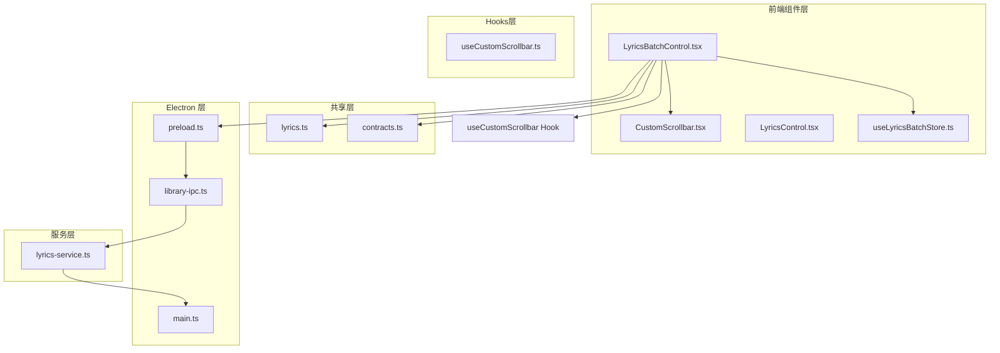
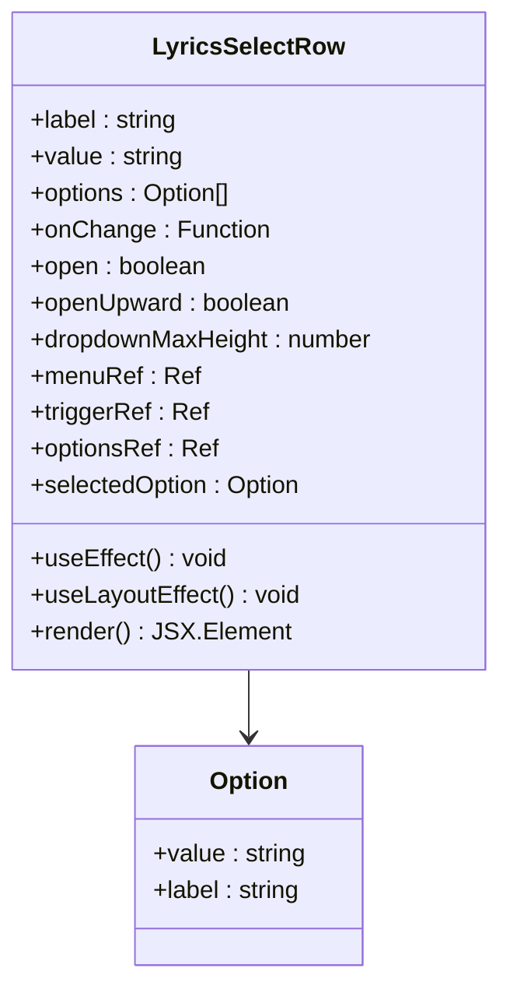
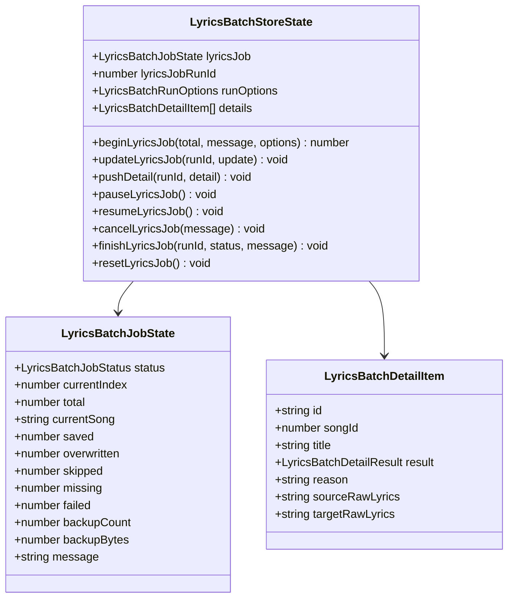
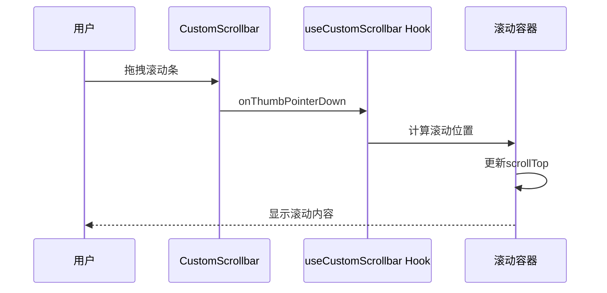
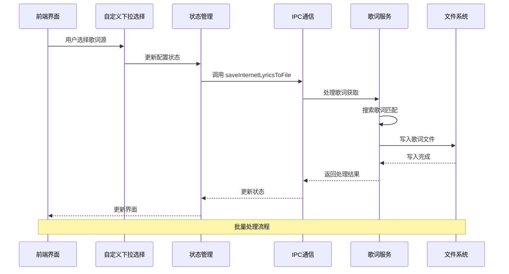
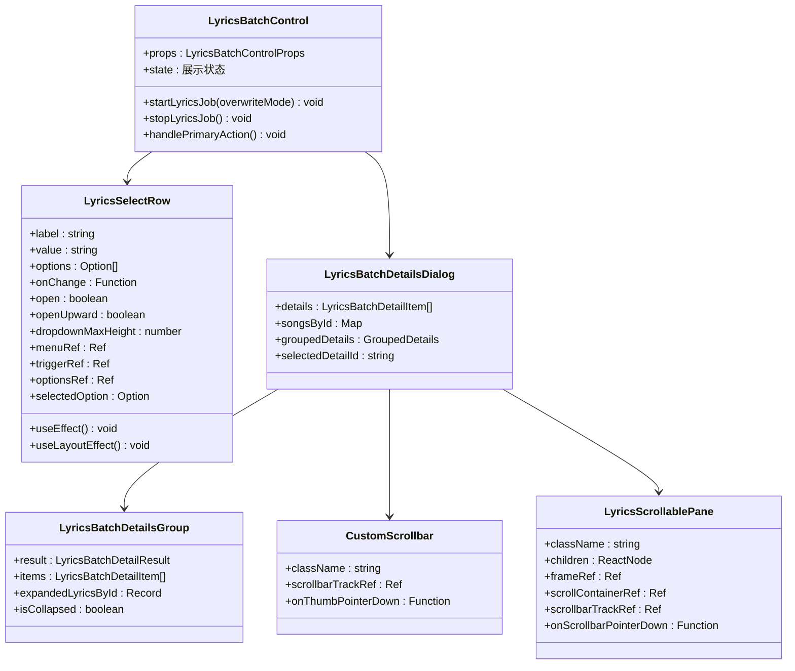
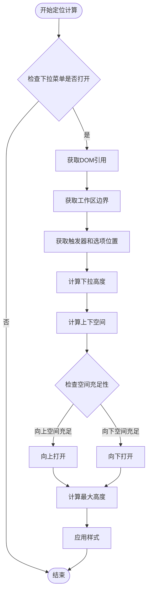
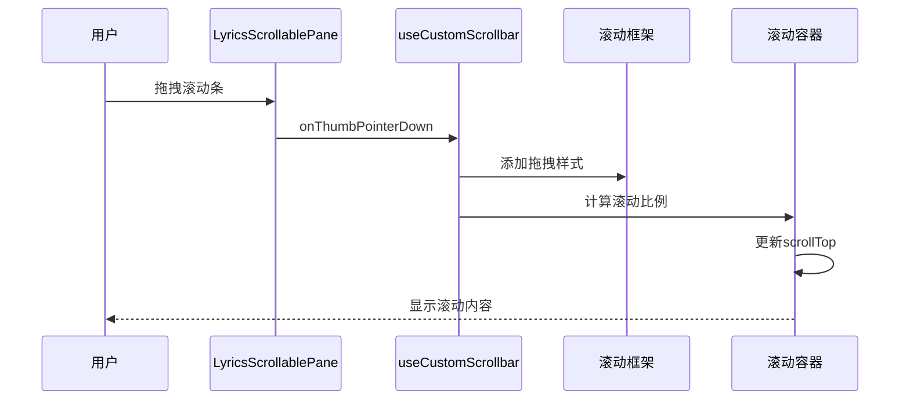
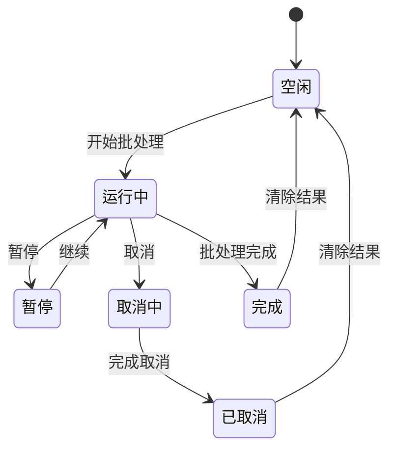
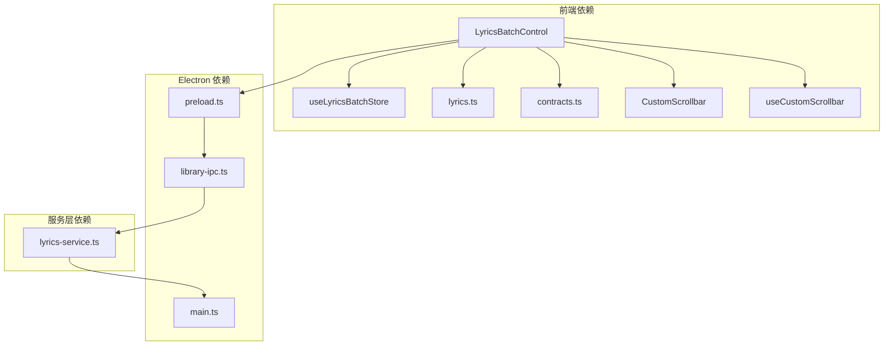

# 批处理歌词控制组件

<cite>
**本文档引用的文件**
- [LyricsBatchControl.tsx](file://src/components/LyricsBatchControl.tsx)
- [useLyricsBatchStore.ts](file://src/state/useLyricsBatchStore.ts)
- [CustomScrollbar.tsx](file://src/components/CustomScrollbar.tsx)
- [useCustomScrollbar.ts](file://src/hooks/useCustomScrollbar.ts)
- [lyrics-service.ts](file://electron/services/lyrics-service.ts)
- [lyrics.ts](file://src/shared/lyrics.ts)
- [contracts.ts](file://src/shared/contracts.ts)
- [preload.ts](file://electron/preload.ts)
- [library-ipc.ts](file://electron/ipc/library-ipc.ts)
- [main.ts](file://electron/main.ts)
- [custom-scrollbar.css](file://src/styles/custom-scrollbar.css)
- [lyrics-settings.css](file://src/styles/lyrics-settings.css)
</cite>

## 更新摘要
**变更内容**
- 新增自定义下拉选择系统，替代传统HTML select元素
- 实现智能定位计算和动态高度调整
- 集成CustomScrollbar组件提供现代化滚动体验
- 使用React useLayoutEffect钩子进行精确布局计算
- 采用现代指针事件API处理用户交互

## 目录
1. [简介](#简介)
2. [项目结构](#项目结构)
3. [核心组件](#核心组件)
4. [架构概览](#架构概览)
5. [详细组件分析](#详细组件分析)
6. [依赖关系分析](#依赖关系分析)
7. [性能考虑](#性能考虑)
8. [故障排除指南](#故障排除指南)
9. [结论](#结论)

## 简介

批处理歌词控制组件是 SMPlayer 音乐播放器中一个重要的功能模块，允许用户批量处理音乐文件的歌词信息。该组件提供了完整的歌词管理功能，包括从互联网获取歌词、保存到本地文件、覆盖现有歌词以及详细的处理结果跟踪。

**重大增强**：组件现已集成全新的自定义下拉选择系统，替代传统的HTML select元素，提供更灵活的用户界面和更好的用户体验。新增的智能定位计算、动态高度调整、指针事件处理以及与CustomScrollbar组件的深度集成，使组件在各种屏幕尺寸和设备上都能提供一致的高质量体验。

该组件采用 React 组件化设计，结合 Electron 的 IPC 通信机制，在前端提供用户友好的界面，同时在后端通过服务层处理复杂的歌词获取和存储逻辑。

## 项目结构

批处理歌词控制组件位于项目的前端组件目录中，与相关的状态管理、自定义滚动条组件和服务层紧密配合：

**图表来源**
- [LyricsBatchControl.tsx:1-15](file://src/components/LyricsBatchControl.tsx#L1-L15)
- [CustomScrollbar.tsx:1-16](file://src/components/CustomScrollbar.tsx#L1-L16)
- [useCustomScrollbar.ts:1-96](file://src/hooks/useCustomScrollbar.ts#L1-L96)

**章节来源**
- [LyricsBatchControl.tsx:1-100](file://src/components/LyricsBatchControl.tsx#L1-L100)
- [useLyricsBatchStore.ts:1-80](file://src/state/useLyricsBatchStore.ts#L1-L80)

## 核心组件

### LyricsBatchControl 主组件

LyricsBatchControl 是整个批处理歌词功能的核心组件，负责：

- **用户界面管理**：提供开始、暂停、继续、取消等操作按钮
- **进度跟踪**：实时显示处理进度和统计信息
- **详细结果展示**：提供详细的处理结果对话框
- **配置选项**：支持不同的歌词源选择和写入策略

**新增功能**：
- **自定义下拉选择系统**：使用LyricsSelectRow组件替代传统HTML select元素
- **智能定位计算**：使用useLayoutEffect进行精确的下拉菜单定位
- **动态高度调整**：根据可用空间动态计算下拉菜单最大高度
- **指针事件处理**：使用现代pointer events API处理用户交互

### 自定义下拉选择系统

**LyricsSelectRow组件**提供了完全自定义的下拉选择体验：

**图表来源**
- [LyricsBatchControl.tsx:90-195](file://src/components/LyricsBatchControl.tsx#L90-L195)

### 状态管理

使用 Zustand 状态管理库创建专门的批处理状态存储：

**图表来源**
- [useLyricsBatchStore.ts:35-48](file://src/state/useLyricsBatchStore.ts#L35-L48)

### 自定义滚动条系统

**CustomScrollbar组件**和**useCustomScrollbar Hook**提供了现代化的滚动体验：

**图表来源**
- [CustomScrollbar.tsx:9-15](file://src/components/CustomScrollbar.tsx#L9-L15)
- [useCustomScrollbar.ts:64-94](file://src/hooks/useCustomScrollbar.ts#L64-L94)

**章节来源**
- [LyricsBatchControl.tsx:122-506](file://src/components/LyricsBatchControl.tsx#L122-L506)
- [useLyricsBatchStore.ts:67-187](file://src/state/useLyricsBatchStore.ts#L67-L187)

## 架构概览

批处理歌词控制组件采用分层架构设计，确保前后端分离和职责明确：

**图表来源**
- [LyricsBatchControl.tsx:160-333](file://src/components/LyricsBatchControl.tsx#L160-L333)
- [CustomScrollbar.tsx:9-15](file://src/components/CustomScrollbar.tsx#L9-L15)

**章节来源**
- [lyrics-service.ts:105-126](file://electron/services/lyrics-service.ts#L105-L126)
- [main.ts:160-170](file://electron/main.ts#L160-L170)

## 详细组件分析

### 用户界面组件

LyricsBatchControl 提供了丰富的用户交互功能：

#### 主要功能特性

1. **操作控制面板**
   - 开始/暂停/继续/取消按钮
   - 进度条显示
   - 实时统计信息

2. **自定义配置选项**
   - **全新下拉选择系统**：替代传统HTML select元素
   - **智能定位计算**：自动计算最佳下拉菜单位置
   - **动态高度调整**：根据可用空间调整菜单大小
   - **指针事件处理**：支持触摸和鼠标交互

3. **详细结果展示**
   - 分类显示处理结果
   - 支持展开查看详细信息
   - **集成自定义滚动条**：提供流畅的滚动体验
   - 备份记录跟踪

#### 界面组件结构

**图表来源**
- [LyricsBatchControl.tsx:508-780](file://src/components/LyricsBatchControl.tsx#L508-L780)
- [CustomScrollbar.tsx:9-15](file://src/components/CustomScrollbar.tsx#L9-L15)

### 智能定位计算系统

**LyricsSelectRow组件**实现了复杂的智能定位计算：

#### 定位算法流程

**图表来源**
- [LyricsBatchControl.tsx:129-148](file://src/components/LyricsBatchControl.tsx#L129-L148)

### 自定义滚动条集成

**LyricsScrollablePane组件**提供了完整的自定义滚动条解决方案：

#### 滚动条工作原理

**图表来源**
- [LyricsBatchControl.tsx:897-925](file://src/components/LyricsBatchControl.tsx#L897-L925)
- [useCustomScrollbar.ts:64-94](file://src/hooks/useCustomScrollbar.ts#L64-L94)

### 状态管理系统

状态管理采用函数式编程模式，提供完整的批处理生命周期管理：

#### 状态流转图

**图表来源**
- [useLyricsBatchStore.ts:3-48](file://src/state/useLyricsBatchStore.ts#L3-L48)

### 歌词服务处理逻辑

歌词服务层实现了复杂的歌词处理算法：

#### 歌词获取流程

**图表来源**
- [lyrics-service.ts:50-93](file://electron/services/lyrics-service.ts#L50-L93)

**章节来源**
- [lyrics-service.ts:385-409](file://electron/services/lyrics-service.ts#L385-L409)
- [lyrics.ts:63-76](file://src/shared/lyrics.ts#L63-L76)

## 依赖关系分析

### 组件间依赖关系

**图表来源**
- [LyricsBatchControl.tsx:1-15](file://src/components/LyricsBatchControl.tsx#L1-L15)
- [CustomScrollbar.tsx:1-16](file://src/components/CustomScrollbar.tsx#L1-L16)
- [useCustomScrollbar.ts:1-96](file://src/hooks/useCustomScrollbar.ts#L1-L96)

### 外部依赖

组件依赖于以下外部库和服务：

1. **React 生态系统**：用于构建用户界面
2. **Zustand**：轻量级状态管理
3. **Electron IPC**：前后端通信
4. **music-metadata**：音频文件元数据解析
5. **第三方歌词服务**：QQ音乐歌词接口
6. **现代指针事件API**：支持触摸和鼠标交互

**章节来源**
- [lyrics-service.ts:1-25](file://electron/services/lyrics-service.ts#L1-L25)
- [contracts.ts:195-197](file://src/shared/contracts.ts#L195-L197)

## 性能考虑

### 并发处理优化

批处理歌词组件采用了多项性能优化措施：

1. **请求节流**：每个请求间隔至少200毫秒，避免过度请求
2. **异步处理**：使用 Promise 和 async/await 确保非阻塞操作
3. **状态更新优化**：批量更新状态，减少不必要的重渲染
4. **内存管理**：及时清理事件监听器和定时器

### 智能定位计算优化

**LyricsSelectRow组件**实现了高效的定位计算：

1. **useLayoutEffect钩子**：在浏览器绘制前执行精确计算
2. **边界检测优化**：仅在下拉菜单打开时进行计算
3. **DOM引用缓存**：避免重复查询DOM元素
4. **空间计算优化**：智能判断最佳打开方向

### 自定义滚动条性能

**CustomScrollbar组件**和**useCustomScrollbar Hook**提供了高性能的滚动体验：

1. **requestAnimationFrame优化**：使用动画帧进行滚动更新
2. **ResizeObserver集成**：自动响应容器尺寸变化
3. **MutationObserver监控**：监听DOM内容变化
4. **被动事件监听器**：减少主线程阻塞

### 存储优化

1. **增量更新**：只更新变化的状态字段
2. **缓存机制**：对已获取的歌词进行缓存
3. **文件系统优化**：智能检测文件存在性，避免重复读取

## 故障排除指南

### 常见问题及解决方案

#### 自定义下拉菜单定位问题

**症状**：下拉菜单位置不正确或超出屏幕边界

**可能原因**：
1. DOM元素引用未正确设置
2. 工作区边界计算错误
3. 触发器和选项元素未正确渲染

**解决方法**：
1. 确保menuRef、triggerRef、optionsRef正确绑定
2. 检查工作区容器的CSS定位
3. 验证下拉菜单的初始渲染状态

#### 自定义滚动条拖拽问题

**症状**：滚动条拖拽不流畅或位置不准确

**可能原因**：
1. useCustomScrollbar Hook未正确初始化
2. 滚动容器尺寸计算错误
3. 指针事件处理冲突

**解决方法**：
1. 检查frameRef和scrollContainerRef的DOM引用
2. 确保滚动容器具有正确的CSS样式
3. 验证指针事件监听器的注册和清理

#### 文件写入错误

**症状**：部分歌曲无法保存歌词文件

**可能原因**：
1. 文件权限不足
2. 磁盘空间不足
3. 文件被其他程序占用

**解决方法**：
1. 检查文件权限
2. 确保磁盘有足够的可用空间
3. 关闭占用文件的程序

#### 性能问题

**症状**：批处理速度过慢或界面卡顿

**优化建议**：
1. 减少同时运行的进程数量
2. 检查磁盘性能
3. 关闭不必要的应用程序
4. 确保useLayoutEffect计算不会频繁触发

**章节来源**
- [LyricsBatchControl.tsx:192-333](file://src/components/LyricsBatchControl.tsx#L192-L333)
- [lyrics-service.ts:231-238](file://electron/services/lyrics-service.ts#L231-L238)

## 结论

批处理歌词控制组件经过重大增强，现在提供了一个功能完整、架构清晰且用户体验卓越的音乐播放器功能模块。新版本的主要改进包括：

### 核心优势

1. **现代化用户界面**：自定义下拉选择系统替代传统HTML select元素
2. **智能定位计算**：使用useLayoutEffect钩子实现精确的下拉菜单定位
3. **动态高度调整**：根据可用空间智能调整下拉菜单大小
4. **指针事件处理**：支持触摸和鼠标交互的现代化事件处理
5. **自定义滚动条**：集成CustomScrollbar组件提供流畅的滚动体验
6. **性能优化**：高效的定位计算和滚动条性能

### 技术创新

1. **React Hooks集成**：充分利用现代React特性提升开发效率
2. **CSS变量驱动**：使用CSS变量实现动态样式计算
3. **响应式设计**：适配各种屏幕尺寸和设备类型
4. **无障碍访问**：支持键盘导航和屏幕阅读器

### 用户体验提升

1. **直观的操作界面**：清晰的视觉反馈和状态指示
2. **流畅的交互体验**：平滑的动画和过渡效果
3. **详细的处理结果**：分类显示和详细对比功能
4. **备份保护机制**：智能备份现有歌词防止意外覆盖

通过这些重大增强，批处理歌词控制组件不仅保持了原有的强大功能，还显著提升了用户体验和技术架构的质量，为 SMPlayer 提供了更加专业和现代化的歌词管理能力。